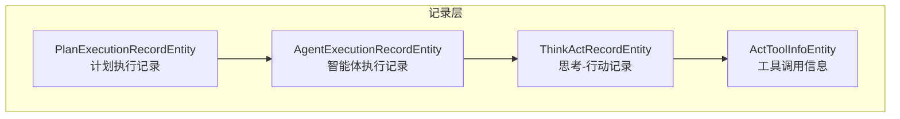
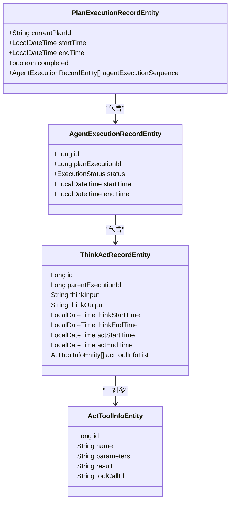
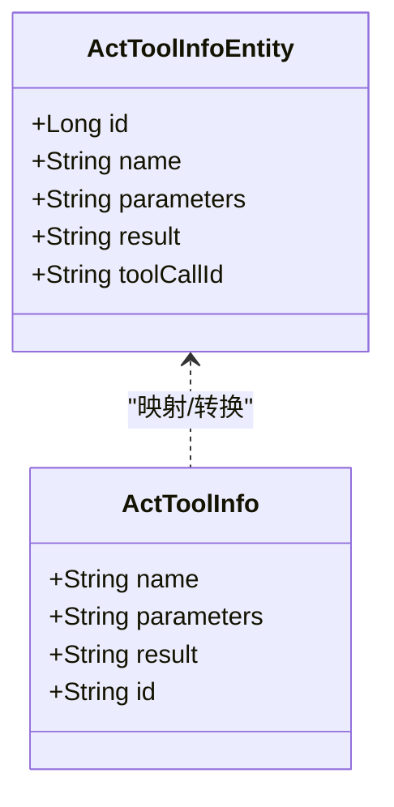
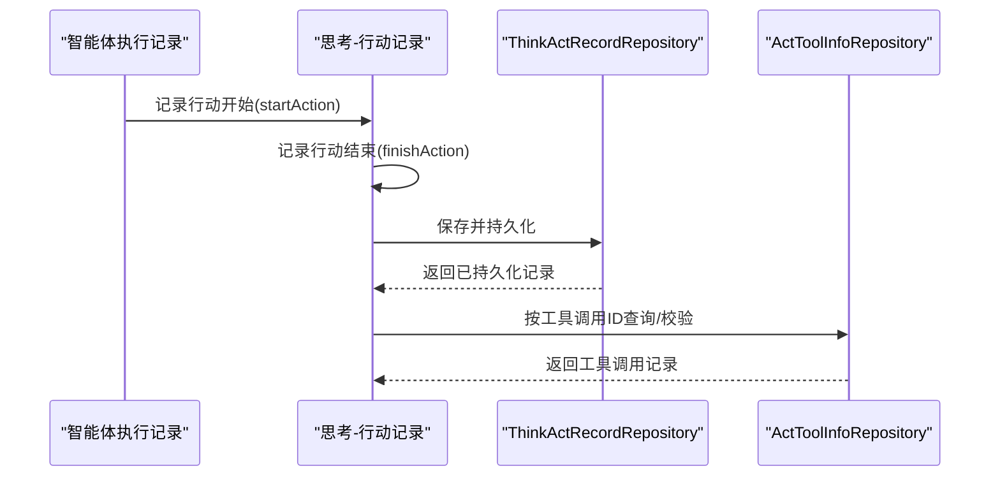
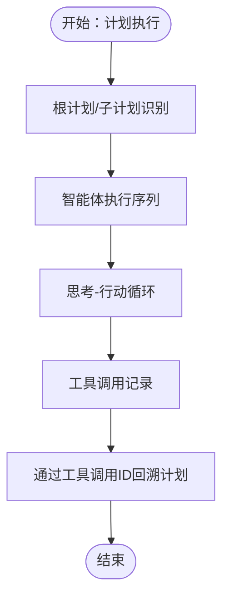
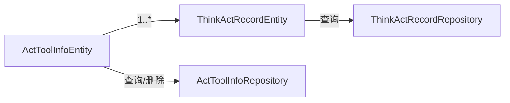

# 工具调用记录

<cite>
**本文引用的文件**
- [ActToolInfoEntity.java](file://src/main/java/com/alibaba/cloud/ai/lynxe/recorder/entity/po/ActToolInfoEntity.java)
- [ActToolInfo.java](file://src/main/java/com/alibaba/cloud/ai/lynxe/recorder/entity/vo/ActToolInfo.java)
- [ActToolInfoRepository.java](file://src/main/java/com/alibaba/cloud/ai/lynxe/recorder/repository/ActToolInfoRepository.java)
- [ThinkActRecordEntity.java](file://src/main/java/com/alibaba/cloud/ai/lynxe/recorder/entity/po/ThinkActRecordEntity.java)
- [ThinkActRecord.java](file://src/main/java/com/alibaba/cloud/ai/lynxe/recorder/entity/vo/ThinkActRecord.java)
- [ThinkActRecordRepository.java](file://src/main/java/com/alibaba/cloud/ai/lynxe/recorder/repository/ThinkActRecordRepository.java)
- [PlanExecutionRecordEntity.java](file://src/main/java/com/alibaba/cloud/ai/lynxe/recorder/entity/po/PlanExecutionRecordEntity.java)
- [PlanExecutionRecord.java](file://src/main/java/com/alibaba/cloud/ai/lynxe/recorder/entity/vo/PlanExecutionRecord.java)
</cite>

## 目录
1. [简介](#简介)
2. [项目结构](#项目结构)
3. [核心组件](#核心组件)
4. [架构总览](#架构总览)
5. [详细组件分析](#详细组件分析)
6. [依赖分析](#依赖分析)
7. [性能考虑](#性能考虑)
8. [故障排查指南](#故障排查指南)
9. [结论](#结论)
10. [附录](#附录)

## 简介
本技术文档聚焦于 Lynxe 的“工具调用记录”模块，系统性阐述 ActToolInfo 实体与工具调用记录的采集、存储、查询与统计分析能力。重点覆盖以下方面：
- ActToolInfo 实体设计与工具调用过程记录机制
- 工具调用参数记录、结果保存与执行状态跟踪
- ActToolParam 参数类（ActToolInfo）的作用与职责边界
- 工具调用记录与“思考-行动”记录的关联关系及复杂执行流程中的嵌套调用处理
- 查询接口与统计分析（按工具名、执行时间、执行结果等条件过滤）
- 性能优化与工具选择决策的价值

## 项目结构
工具调用记录模块位于 recorder 子系统中，围绕“计划执行记录 -> 智能体执行记录 -> 思考-行动记录 -> 工具调用信息”的层级化数据模型组织。ActToolInfo 作为 ThinkActRecord 的子实体，承载单次工具调用的名称、参数、结果与工具调用 ID。

图表来源
- [PlanExecutionRecordEntity.java:1-283](file://src/main/java/com/alibaba/cloud/ai/lynxe/recorder/entity/po/PlanExecutionRecordEntity.java#L1-L283)
- [ThinkActRecordEntity.java:1-185](file://src/main/java/com/alibaba/cloud/ai/lynxe/recorder/entity/po/ThinkActRecordEntity.java#L1-L185)
- [ActToolInfoEntity.java:1-118](file://src/main/java/com/alibaba/cloud/ai/lynxe/recorder/entity/po/ActToolInfoEntity.java#L1-L118)

章节来源
- [PlanExecutionRecordEntity.java:1-283](file://src/main/java/com/alibaba/cloud/ai/lynxe/recorder/entity/po/PlanExecutionRecordEntity.java#L1-L283)
- [ThinkActRecordEntity.java:1-185](file://src/main/java/com/alibaba/cloud/ai/lynxe/recorder/entity/po/ThinkActRecordEntity.java#L1-L185)
- [ActToolInfoEntity.java:1-118](file://src/main/java/com/alibaba/cloud/ai/lynxe/recorder/entity/po/ActToolInfoEntity.java#L1-L118)

## 核心组件
- ActToolInfo 实体（持久化对象）：用于持久化存储单次工具调用的关键信息，包括工具名、序列化的参数、执行结果与工具调用 ID。
- ActToolInfo 值对象：用于跨层传递与展示的轻量对象，便于在 VO 层复用与组合。
- ThinkActRecord 实体与值对象：承载一次“思考-行动”循环的输入输出、时间戳、状态与工具调用列表。
- ThinkActRecordRepository：提供按父执行记录 ID、工具调用 ID 等维度的查询能力，并支持延迟加载工具调用列表。
- ActToolInfoRepository：提供按工具调用 ID 的存在性检查、删除与查询能力。

章节来源
- [ActToolInfoEntity.java:1-118](file://src/main/java/com/alibaba/cloud/ai/lynxe/recorder/entity/po/ActToolInfoEntity.java#L1-L118)
- [ActToolInfo.java:1-138](file://src/main/java/com/alibaba/cloud/ai/lynxe/recorder/entity/vo/ActToolInfo.java#L1-L138)
- [ThinkActRecordEntity.java:1-185](file://src/main/java/com/alibaba/cloud/ai/lynxe/recorder/entity/po/ThinkActRecordEntity.java#L1-L185)
- [ThinkActRecord.java:1-362](file://src/main/java/com/alibaba/cloud/ai/lynxe/recorder/entity/vo/ThinkActRecord.java#L1-L362)
- [ThinkActRecordRepository.java:1-55](file://src/main/java/com/alibaba/cloud/ai/lynxe/recorder/repository/ThinkActRecordRepository.java#L1-L55)
- [ActToolInfoRepository.java:1-44](file://src/main/java/com/alibaba/cloud/ai/lynxe/recorder/repository/ActToolInfoRepository.java#L1-L44)

## 架构总览
工具调用记录贯穿“计划执行 -> 智能体执行 -> 思考-行动 -> 工具调用”链路，ActToolInfo 通过一对多关系挂载在 ThinkActRecord 下，形成可查询、可统计的数据结构。

图表来源
- [PlanExecutionRecordEntity.java:1-283](file://src/main/java/com/alibaba/cloud/ai/lynxe/recorder/entity/po/PlanExecutionRecordEntity.java#L1-L283)
- [ThinkActRecordEntity.java:1-185](file://src/main/java/com/alibaba/cloud/ai/lynxe/recorder/entity/po/ThinkActRecordEntity.java#L1-L185)
- [ActToolInfoEntity.java:1-118](file://src/main/java/com/alibaba/cloud/ai/lynxe/recorder/entity/po/ActToolInfoEntity.java#L1-L118)

## 详细组件分析

### ActToolInfo 实体与值对象
- 设计目标：统一记录工具调用的名称、参数、结果与工具调用 ID，支持序列化存储与跨层传输。
- 关键字段：
  - 名称：工具标识
  - 参数：序列化后的参数字符串
  - 结果：执行结果字符串
  - 工具调用 ID：唯一标识一次调用请求
- 值对象扩展：ActToolInfo 在 VO 层提供更灵活的构造与比较逻辑，便于在上层进行聚合与展示。

图表来源
- [ActToolInfoEntity.java:1-118](file://src/main/java/com/alibaba/cloud/ai/lynxe/recorder/entity/po/ActToolInfoEntity.java#L1-L118)
- [ActToolInfo.java:1-138](file://src/main/java/com/alibaba/cloud/ai/lynxe/recorder/entity/vo/ActToolInfo.java#L1-L138)

章节来源
- [ActToolInfoEntity.java:1-118](file://src/main/java/com/alibaba/cloud/ai/lynxe/recorder/entity/po/ActToolInfoEntity.java#L1-L118)
- [ActToolInfo.java:1-138](file://src/main/java/com/alibaba/cloud/ai/lynxe/recorder/entity/vo/ActToolInfo.java#L1-L138)

### 思考-行动记录与工具调用关联
- ThinkActRecordEntity 通过 actToolInfoList 维护一次行动阶段内使用的工具调用集合；ActToolInfoEntity 以外键关联到 ThinkActRecordEntity。
- ThinkActRecord 提供 startAction/finishAction 等生命周期方法，用于记录行动开始与结束的时间戳、状态与结果。
- 通过 ThinkActRecordRepository 可按父执行记录 ID 或通过 JOIN 查询工具调用 ID 对应的思考-行动记录，实现双向关联定位。

图表来源
- [ThinkActRecord.java:1-362](file://src/main/java/com/alibaba/cloud/ai/lynxe/recorder/entity/vo/ThinkActRecord.java#L1-L362)
- [ThinkActRecordRepository.java:1-55](file://src/main/java/com/alibaba/cloud/ai/lynxe/recorder/repository/ThinkActRecordRepository.java#L1-L55)
- [ActToolInfoRepository.java:1-44](file://src/main/java/com/alibaba/cloud/ai/lynxe/recorder/repository/ActToolInfoRepository.java#L1-L44)

章节来源
- [ThinkActRecordEntity.java:1-185](file://src/main/java/com/alibaba/cloud/ai/lynxe/recorder/entity/po/ThinkActRecordEntity.java#L1-L185)
- [ThinkActRecord.java:1-362](file://src/main/java/com/alibaba/cloud/ai/lynxe/recorder/entity/vo/ThinkActRecord.java#L1-L362)
- [ThinkActRecordRepository.java:1-55](file://src/main/java/com/alibaba/cloud/ai/lynxe/recorder/repository/ThinkActRecordRepository.java#L1-L55)
- [ActToolInfoRepository.java:1-44](file://src/main/java/com/alibaba/cloud/ai/lynxe/recorder/repository/ActToolInfoRepository.java#L1-L44)

### 复杂执行流程中的嵌套调用处理
- PlanExecutionRecordEntity 支持根计划、子计划与父计划 ID 的层次化结构，ActToolInfo 中的工具调用 ID 可用于回溯触发该计划的工具调用。
- ThinkActRecordEntity 通过 parentExecutionId 与 PlanExecutionRecordEntity 的 agentExecutionSequence 形成层级关系，ActToolInfo 可在任意层级被定位与统计。

图表来源
- [PlanExecutionRecordEntity.java:1-283](file://src/main/java/com/alibaba/cloud/ai/lynxe/recorder/entity/po/PlanExecutionRecordEntity.java#L1-L283)
- [ThinkActRecordEntity.java:1-185](file://src/main/java/com/alibaba/cloud/ai/lynxe/recorder/entity/po/ThinkActRecordEntity.java#L1-L185)
- [ActToolInfoEntity.java:1-118](file://src/main/java/com/alibaba/cloud/ai/lynxe/recorder/entity/po/ActToolInfoEntity.java#L1-L118)

章节来源
- [PlanExecutionRecordEntity.java:1-283](file://src/main/java/com/alibaba/cloud/ai/lynxe/recorder/entity/po/PlanExecutionRecordEntity.java#L1-L283)
- [ThinkActRecordEntity.java:1-185](file://src/main/java/com/alibaba/cloud/ai/lynxe/recorder/entity/po/ThinkActRecordEntity.java#L1-L185)
- [ActToolInfoEntity.java:1-118](file://src/main/java/com/alibaba/cloud/ai/lynxe/recorder/entity/po/ActToolInfoEntity.java#L1-L118)

### 查询接口与过滤条件
- 按工具调用 ID 查询：ActToolInfoRepository 提供按 toolCallId 的存在性检查、删除与查询；ThinkActRecordRepository 提供通过 JOIN 查询对应 ThinkActRecordEntity 的能力。
- 按父执行记录 ID 查询：ThinkActRecordRepository 提供按 parentExecutionId 查询与延迟加载 actToolInfoList 的能力。
- 过滤建议（基于现有接口扩展）：
  - 工具名称：可通过 ActToolInfoEntity 的 name 字段进行 LIKE/精确匹配（需在仓库层新增查询方法）
  - 执行时间：可通过 ThinkActRecordEntity 的 thinkStartTime/actStartTime/actEndTime 进行范围查询（需在仓库层新增查询方法）
  - 执行结果：可通过 ActToolInfoEntity 的 result 字段进行模糊或精确匹配（需在仓库层新增查询方法）

章节来源
- [ActToolInfoRepository.java:1-44](file://src/main/java/com/alibaba/cloud/ai/lynxe/recorder/repository/ActToolInfoRepository.java#L1-L44)
- [ThinkActRecordRepository.java:1-55](file://src/main/java/com/alibaba/cloud/ai/lynxe/recorder/repository/ThinkActRecordRepository.java#L1-L55)

### 统计分析能力
- 工具使用频率：按 ActToolInfoEntity 的 name 分组统计调用次数
- 执行成功率：按 ActToolInfoEntity 的 result 或 ThinkActRecordEntity 的 status 计算成功/失败比例
- 平均执行时间：按 ThinkActRecordEntity 的 actStartTime/actEndTime 计算行动耗时并求平均
- 时间分布与趋势：结合 startTime/endTime 与分页查询，支持按时间段聚合统计

章节来源
- [ActToolInfoEntity.java:1-118](file://src/main/java/com/alibaba/cloud/ai/lynxe/recorder/entity/po/ActToolInfoEntity.java#L1-L118)
- [ThinkActRecordEntity.java:1-185](file://src/main/java/com/alibaba/cloud/ai/lynxe/recorder/entity/po/ThinkActRecordEntity.java#L1-L185)

## 依赖分析
- ActToolInfoEntity 依赖 JPA 注解进行持久化映射，字段采用 LONGTEXT 以适配较长的参数与结果内容。
- ThinkActRecordEntity 与 ActToolInfoEntity 之间为一对多关系，通过外键关联；支持延迟加载以减少不必要的数据加载。
- ThinkActRecordRepository 提供基于 JPQL 的 JOIN 查询，支持通过工具调用 ID 定位对应的思考-行动记录。
- ActToolInfoRepository 提供基于工具调用 ID 的基础 CRUD 能力，便于去重与清理。

图表来源
- [ThinkActRecordEntity.java:1-185](file://src/main/java/com/alibaba/cloud/ai/lynxe/recorder/entity/po/ThinkActRecordEntity.java#L1-L185)
- [ActToolInfoEntity.java:1-118](file://src/main/java/com/alibaba/cloud/ai/lynxe/recorder/entity/po/ActToolInfoEntity.java#L1-L118)
- [ThinkActRecordRepository.java:1-55](file://src/main/java/com/alibaba/cloud/ai/lynxe/recorder/repository/ThinkActRecordRepository.java#L1-L55)
- [ActToolInfoRepository.java:1-44](file://src/main/java/com/alibaba/cloud/ai/lynxe/recorder/repository/ActToolInfoRepository.java#L1-L44)

章节来源
- [ThinkActRecordEntity.java:1-185](file://src/main/java/com/alibaba/cloud/ai/lynxe/recorder/entity/po/ThinkActRecordEntity.java#L1-L185)
- [ActToolInfoEntity.java:1-118](file://src/main/java/com/alibaba/cloud/ai/lynxe/recorder/entity/po/ActToolInfoEntity.java#L1-L118)
- [ThinkActRecordRepository.java:1-55](file://src/main/java/com/alibaba/cloud/ai/lynxe/recorder/repository/ThinkActRecordRepository.java#L1-L55)
- [ActToolInfoRepository.java:1-44](file://src/main/java/com/alibaba/cloud/ai/lynxe/recorder/repository/ActToolInfoRepository.java#L1-L44)

## 性能考虑
- 数据库索引建议：
  - ActToolInfoEntity.toolCallId：高频查询与去重
  - ThinkActRecordEntity.parentExecutionId：按父记录批量查询
  - ThinkActRecordEntity.actStartTime/actEndTime：时间范围统计
- 延迟加载策略：利用 JPA 的 LAZY 加载避免一次性加载大量工具调用详情
- 序列化字段大小控制：对 parameters 与 result 使用 LONGTEXT，但建议在入库前做大小限制与压缩策略
- 分页与聚合：统计分析建议使用分页与数据库聚合函数，避免一次性拉取全量数据

## 故障排查指南
- 工具调用 ID 重复或缺失：
  - 现象：按 toolCallId 查询不到或重复
  - 排查：确认 ActToolInfoRepository.existsByToolCallId 的存在性检查与 ActToolInfoEntity.toolCallId 的唯一性约束
- 关联查询为空：
  - 现象：按 parentExecutionId 查询不到 actToolInfoList
  - 排查：使用 ThinkActRecordRepository.findByParentExecutionIdWithActToolInfo 确保 JOIN FETCH 已启用
- 结果字段过长导致存储异常：
  - 现象：parameters/result 字段超出存储上限
  - 排查：确认数据库字段定义为 LONGTEXT，并在业务侧进行长度与字符集校验

章节来源
- [ActToolInfoRepository.java:1-44](file://src/main/java/com/alibaba/cloud/ai/lynxe/recorder/repository/ActToolInfoRepository.java#L1-L44)
- [ThinkActRecordRepository.java:1-55](file://src/main/java/com/alibaba/cloud/ai/lynxe/recorder/repository/ThinkActRecordRepository.java#L1-L55)

## 结论
ActToolInfo 与 ThinkActRecord 的组合提供了细粒度的工具调用记录能力，配合 PlanExecutionRecord 的层次化结构，能够完整追踪从计划到工具调用的全过程。通过现有仓库接口与扩展查询，可实现按工具名、时间、结果等条件的高效过滤与统计分析，为性能优化与工具选择决策提供数据支撑。

## 附录
- ActToolParam 参数类说明（ActToolInfo）：
  - 作用：封装工具名称、参数、结果与工具调用 ID 的值对象，便于在 VO 层复用与跨模块传递
  - 管理方式：通过构造函数与 setter/getter 管理字段；equals/hashCode 基于关键字段实现
- 扩展建议：
  - 新增按工具名、执行时间、执行结果的查询方法
  - 引入索引与分页策略提升统计查询性能
  - 对超长参数/结果进行压缩与归档策略

章节来源
- [ActToolInfo.java:1-138](file://src/main/java/com/alibaba/cloud/ai/lynxe/recorder/entity/vo/ActToolInfo.java#L1-L138)