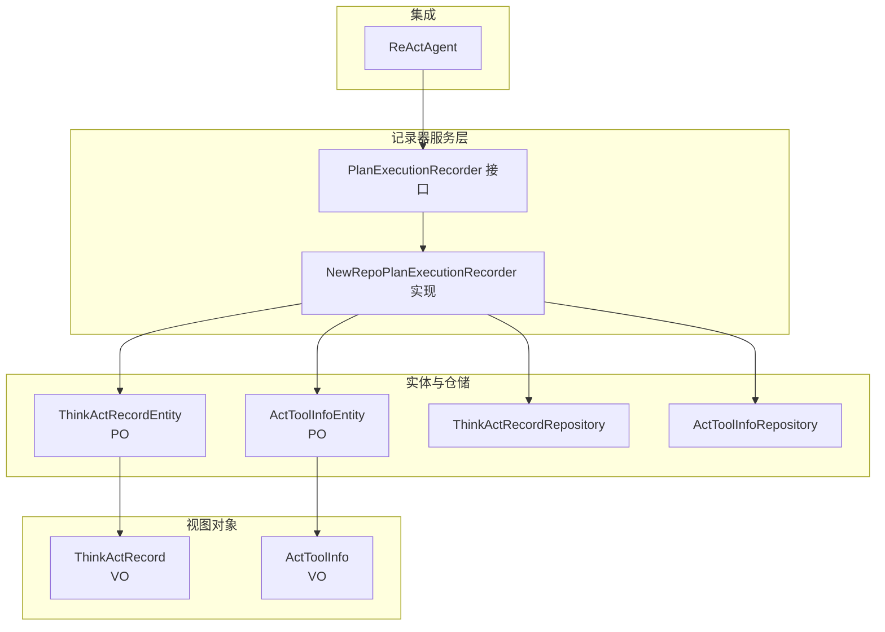
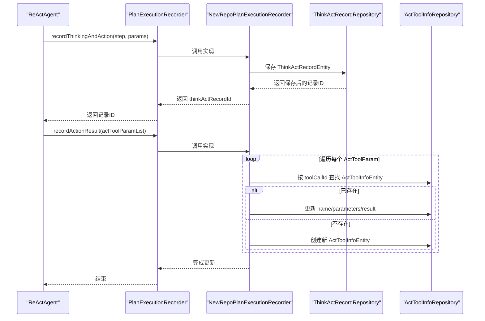
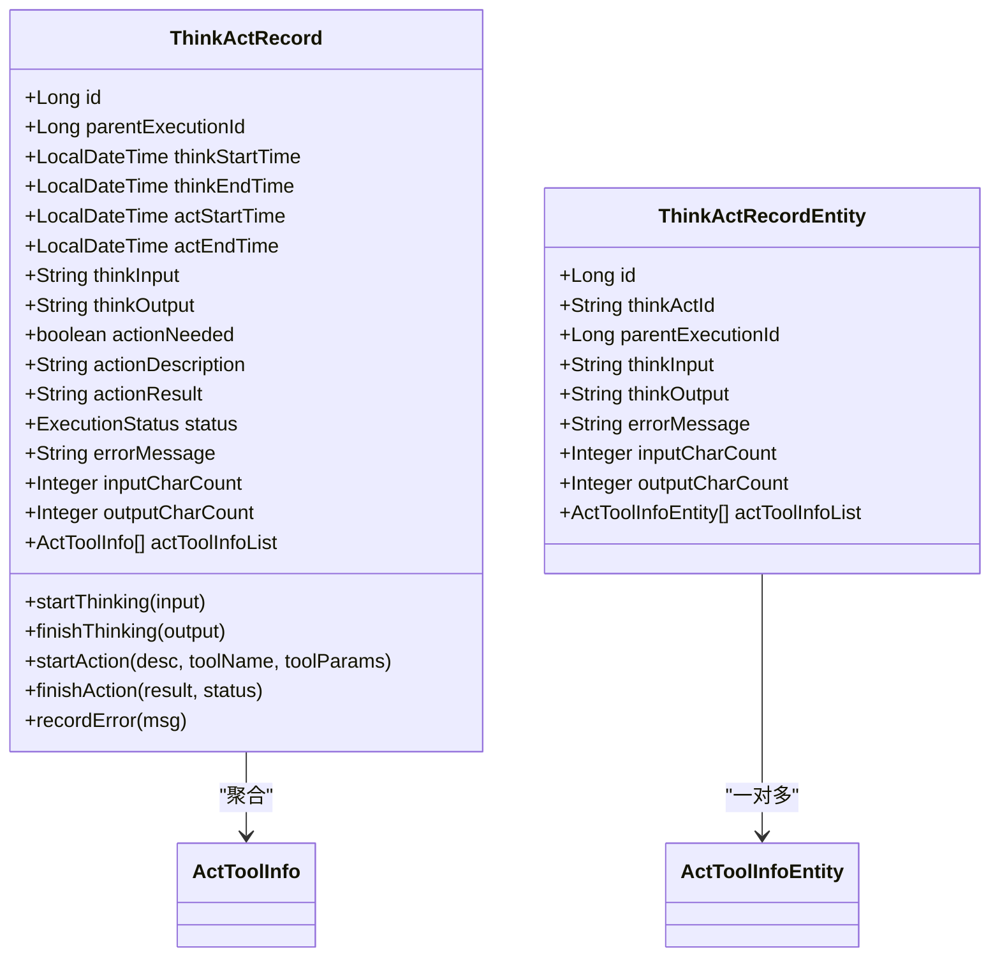
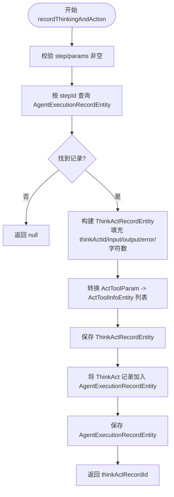
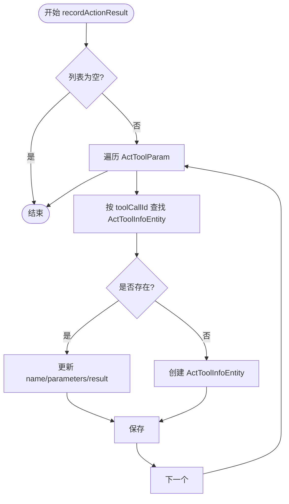
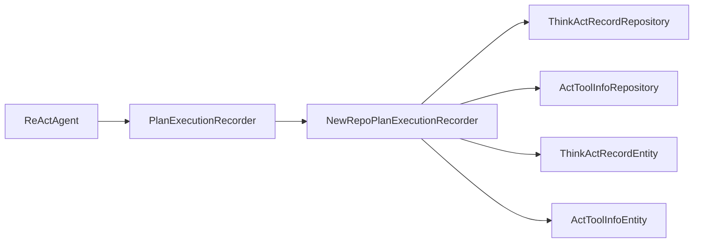

# 思考行动记录

<cite>
**本文引用的文件**
- [ThinkActRecordEntity.java](file://src/main/java/com/alibaba/cloud/ai/lynxe/recorder/entity/po/ThinkActRecordEntity.java)
- [ThinkActRecord.java](file://src/main/java/com/alibaba/cloud/ai/lynxe/recorder/entity/vo/ThinkActRecord.java)
- [ThinkActRecordRepository.java](file://src/main/java/com/alibaba/cloud/ai/lynxe/recorder/repository/ThinkActRecordRepository.java)
- [PlanExecutionRecorder.java](file://src/main/java/com/alibaba/cloud/ai/lynxe/recorder/service/PlanExecutionRecorder.java)
- [NewRepoPlanExecutionRecorder.java](file://src/main/java/com/alibaba/cloud/ai/lynxe/recorder/service/NewRepoPlanExecutionRecorder.java)
- [ReActAgent.java](file://src/main/java/com/alibaba/cloud/ai/lynxe/agent/ReActAgent.java)
- [ActToolInfoEntity.java](file://src/main/java/com/alibaba/cloud/ai/lynxe/recorder/entity/po/ActToolInfoEntity.java)
- [ActToolInfo.java](file://src/main/java/com/alibaba/cloud/ai/lynxe/recorder/entity/vo/ActToolInfo.java)
- [ActToolInfoRepository.java](file://src/main/java/com/alibaba/cloud/ai/lynxe/recorder/repository/ActToolInfoRepository.java)
</cite>

## 目录
1. [引言](#引言)
2. [项目结构](#项目结构)
3. [核心组件](#核心组件)
4. [架构总览](#架构总览)
5. [详细组件分析](#详细组件分析)
6. [依赖分析](#依赖分析)
7. [性能考虑](#性能考虑)
8. [故障排查指南](#故障排查指南)
9. [结论](#结论)
10. [附录](#附录)

## 引言
本技术文档围绕 Lynxe 的“思考行动记录”模块展开，系统性阐述 ThinkActRecord 的设计与实现，以及其在 ReAct 执行模式下的支撑作用。文档重点覆盖以下方面：
- 思考阶段（Think）与行动阶段（Act）的记录机制
- recordThinkingAndAction 与 recordActionResult 的实现逻辑与数据流
- ThinkActRecordParams 与 ActToolParam 参数类的设计与使用场景
- 嵌套子计划中的思考行动记录管理
- 时间戳管理、字符数统计与错误信息记录
- 在执行过程可视化与调试分析中的价值

## 项目结构
“思考行动记录”模块位于 recorder 子系统内，采用分层设计：
- 实体层（PO）：ThinkActRecordEntity、ActToolInfoEntity
- 视图对象（VO）：ThinkActRecord、ActToolInfo
- 仓储层：ThinkActRecordRepository、ActToolInfoRepository
- 服务层：PlanExecutionRecorder 接口与 NewRepoPlanExecutionRecorder 实现
- 集成点：ReActAgent 通过 PlanExecutionRecorder 进行记录

图表来源
- [PlanExecutionRecorder.java:26-242](file://src/main/java/com/alibaba/cloud/ai/lynxe/recorder/service/PlanExecutionRecorder.java#L26-L242)
- [NewRepoPlanExecutionRecorder.java:48-857](file://src/main/java/com/alibaba/cloud/ai/lynxe/recorder/service/NewRepoPlanExecutionRecorder.java#L48-L857)
- [ThinkActRecordEntity.java:55-185](file://src/main/java/com/alibaba/cloud/ai/lynxe/recorder/entity/po/ThinkActRecordEntity.java#L55-L185)
- [ActToolInfoEntity.java](file://src/main/java/com/alibaba/cloud/ai/lynxe/recorder/entity/po/ActToolInfoEntity.java)
- [ThinkActRecordRepository.java:29-55](file://src/main/java/com/alibaba/cloud/ai/lynxe/recorder/repository/ThinkActRecordRepository.java#L29-L55)
- [ActToolInfoRepository.java](file://src/main/java/com/alibaba/cloud/ai/lynxe/recorder/repository/ActToolInfoRepository.java)
- [ReActAgent.java:30-97](file://src/main/java/com/alibaba/cloud/ai/lynxe/agent/ReActAgent.java#L30-L97)

章节来源
- [PlanExecutionRecorder.java:26-242](file://src/main/java/com/alibaba/cloud/ai/lynxe/recorder/service/PlanExecutionRecorder.java#L26-L242)
- [NewRepoPlanExecutionRecorder.java:48-857](file://src/main/java/com/alibaba/cloud/ai/lynxe/recorder/service/NewRepoPlanExecutionRecorder.java#L48-L857)
- [ThinkActRecordEntity.java:55-185](file://src/main/java/com/alibaba/cloud/ai/lynxe/recorder/entity/po/ThinkActRecordEntity.java#L55-L185)
- [ActToolInfoEntity.java](file://src/main/java/com/alibaba/cloud/ai/lynxe/recorder/entity/po/ActToolInfoEntity.java)
- [ThinkActRecordRepository.java:29-55](file://src/main/java/com/alibaba/cloud/ai/lynxe/recorder/repository/ThinkActRecordRepository.java#L29-L55)
- [ActToolInfoRepository.java](file://src/main/java/com/alibaba/cloud/ai/lynxe/recorder/repository/ActToolInfoRepository.java)
- [ReActAgent.java:30-97](file://src/main/java/com/alibaba/cloud/ai/lynxe/agent/ReActAgent.java#L30-L97)

## 核心组件
- ThinkActRecord（VO）：封装单步执行中的思考与行动记录，提供 start/finishThinking、startAction、finishAction、recordError 等方法；内置时间戳、字符数统计与错误信息字段。
- ThinkActRecordEntity（PO）：持久化实体，与 AgentExecutionRecordEntity 建立父子关系；包含 thinkActId、thinkInput/thinkOutput、actToolInfoList 等字段。
- ActToolInfo（VO）与 ActToolInfoEntity（PO）：记录工具调用的名称、参数、结果与工具调用 ID（toolCallId），用于关联具体行动。
- PlanExecutionRecorder 接口：定义记录计划、步骤、代理执行与思考行动的核心接口。
- NewRepoPlanExecutionRecorder 实现：将 VO/PO 转换并持久化到数据库，处理 think-act 记录与工具信息的双向映射。
- ThinkActRecordRepository：按父执行 ID、ID、或工具调用 ID 查询 think-act 记录，支持预加载 actToolInfoList。

章节来源
- [ThinkActRecord.java:45-362](file://src/main/java/com/alibaba/cloud/ai/lynxe/recorder/entity/vo/ThinkActRecord.java#L45-L362)
- [ThinkActRecordEntity.java:55-185](file://src/main/java/com/alibaba/cloud/ai/lynxe/recorder/entity/po/ThinkActRecordEntity.java#L55-L185)
- [ActToolInfo.java](file://src/main/java/com/alibaba/cloud/ai/lynxe/recorder/entity/vo/ActToolInfo.java)
- [ActToolInfoEntity.java](file://src/main/java/com/alibaba/cloud/ai/lynxe/recorder/entity/po/ActToolInfoEntity.java)
- [PlanExecutionRecorder.java:26-242](file://src/main/java/com/alibaba/cloud/ai/lynxe/recorder/service/PlanExecutionRecorder.java#L26-L242)
- [NewRepoPlanExecutionRecorder.java:48-857](file://src/main/java/com/alibaba/cloud/ai/lynxe/recorder/service/NewRepoPlanExecutionRecorder.java#L48-L857)
- [ThinkActRecordRepository.java:29-55](file://src/main/java/com/alibaba/cloud/ai/lynxe/recorder/repository/ThinkActRecordRepository.java#L29-L55)

## 架构总览
ReAct 执行模式下，代理每一步由 think() 决策是否需要行动，若需要则执行 act() 并返回结果。记录器负责在 think-act 循环中记录思考输入/输出、行动描述与工具调用信息，并在工具执行后回填结果。

图表来源
- [ReActAgent.java:78-94](file://src/main/java/com/alibaba/cloud/ai/lynxe/agent/ReActAgent.java#L78-L94)
- [PlanExecutionRecorder.java:89-107](file://src/main/java/com/alibaba/cloud/ai/lynxe/recorder/service/PlanExecutionRecorder.java#L89-L107)
- [NewRepoPlanExecutionRecorder.java:390-520](file://src/main/java/com/alibaba/cloud/ai/lynxe/recorder/service/NewRepoPlanExecutionRecorder.java#L390-L520)
- [ThinkActRecordRepository.java:44-52](file://src/main/java/com/alibaba/cloud/ai/lynxe/recorder/repository/ThinkActRecordRepository.java#L44-L52)
- [ActToolInfoRepository.java](file://src/main/java/com/alibaba/cloud/ai/lynxe/recorder/repository/ActToolInfoRepository.java)

## 详细组件分析

### ThinkActRecord（VO）与 ThinkActRecordEntity（PO）
- 设计要点
  - VO 层提供 start/finishThinking、startAction、finishAction、recordError 等方法，统一记录思考与行动的生命周期。
  - PO 层映射数据库表结构，包含 thinkActId、thinkInput/thinkOutput、inputCharCount/outputCharCount、errorMessage，以及与 ActToolInfoEntity 的一对多关系。
  - 通过 parentExecutionId 与 AgentExecutionRecordEntity 建立层级关系，支持在子计划中嵌套记录。

图表来源
- [ThinkActRecord.java:45-362](file://src/main/java/com/alibaba/cloud/ai/lynxe/recorder/entity/vo/ThinkActRecord.java#L45-L362)
- [ThinkActRecordEntity.java:55-185](file://src/main/java/com/alibaba/cloud/ai/lynxe/recorder/entity/po/ThinkActRecordEntity.java#L55-L185)
- [ActToolInfo.java](file://src/main/java/com/alibaba/cloud/ai/lynxe/recorder/entity/vo/ActToolInfo.java)
- [ActToolInfoEntity.java](file://src/main/java/com/alibaba/cloud/ai/lynxe/recorder/entity/po/ActToolInfoEntity.java)

章节来源
- [ThinkActRecord.java:133-173](file://src/main/java/com/alibaba/cloud/ai/lynxe/recorder/entity/vo/ThinkActRecord.java#L133-L173)
- [ThinkActRecordEntity.java:31-94](file://src/main/java/com/alibaba/cloud/ai/lynxe/recorder/entity/po/ThinkActRecordEntity.java#L31-L94)

### recordThinkingAndAction 方法实现
- 输入：ExecutionStep 与 ThinkActRecordParams
- 处理流程
  - 依据 step.getStepId() 获取 AgentExecutionRecordEntity
  - 构造 ThinkActRecordEntity，填充 thinkActId、thinkInput、thinkOutput、errorMessage、字符数统计等
  - 将 ActToolParam 列表转换为 ActToolInfoEntity 列表并设置
  - 保存 ThinkActRecordEntity，并将其加入 AgentExecutionRecordEntity 的 thinkActSteps
  - 返回保存后的记录 ID
- 输出：thinkActRecordId，供后续 recordActionResult 使用

图表来源
- [NewRepoPlanExecutionRecorder.java:390-450](file://src/main/java/com/alibaba/cloud/ai/lynxe/recorder/service/NewRepoPlanExecutionRecorder.java#L390-L450)
- [PlanExecutionRecorder.java:89-89](file://src/main/java/com/alibaba/cloud/ai/lynxe/recorder/service/PlanExecutionRecorder.java#L89-L89)

章节来源
- [NewRepoPlanExecutionRecorder.java:390-450](file://src/main/java/com/alibaba/cloud/ai/lynxe/recorder/service/NewRepoPlanExecutionRecorder.java#L390-L450)
- [PlanExecutionRecorder.java:89-89](file://src/main/java/com/alibaba/cloud/ai/lynxe/recorder/service/PlanExecutionRecorder.java#L89-L89)

### recordActionResult 方法实现
- 输入：List<ActToolParam>
- 处理流程
  - 遍历 ActToolParam，按 toolCallId 查找 ActToolInfoEntity
  - 若存在则更新 name/parameters/result；否则新建 ActToolInfoEntity
  - 逐条保存，完成批量回填
- 输出：无（副作用为更新数据库）

图表来源
- [NewRepoPlanExecutionRecorder.java:453-520](file://src/main/java/com/alibaba/cloud/ai/lynxe/recorder/service/NewRepoPlanExecutionRecorder.java#L453-L520)
- [PlanExecutionRecorder.java:107-107](file://src/main/java/com/alibaba/cloud/ai/lynxe/recorder/service/PlanExecutionRecorder.java#L107-L107)

章节来源
- [NewRepoPlanExecutionRecorder.java:453-520](file://src/main/java/com/alibaba/cloud/ai/lynxe/recorder/service/NewRepoPlanExecutionRecorder.java#L453-L520)
- [PlanExecutionRecorder.java:107-107](file://src/main/java/com/alibaba/cloud/ai/lynxe/recorder/service/PlanExecutionRecorder.java#L107-L107)

### ThinkActRecordParams 与 ActToolParam 参数类
- ThinkActRecordParams
  - 用途：封装 recordThinkingAndAction 的输入参数，包含 thinkActId、stepId、thinkInput、thinkOutput、errorMessage、inputCharCount、outputCharCount、actToolInfoList
  - 设计意图：将 VO 层的 ThinkActRecord 的字段映射到接口层，避免直接暴露 PO
- ActToolParam
  - 用途：封装 recordActionResult 的输入参数，包含 name、parameters、result、toolCallId
  - 设计意图：在工具执行后回填结果，通过 toolCallId 关联到数据库实体

章节来源
- [PlanExecutionRecorder.java:113-182](file://src/main/java/com/alibaba/cloud/ai/lynxe/recorder/service/PlanExecutionRecorder.java#L113-L182)
- [PlanExecutionRecorder.java:188-239](file://src/main/java/com/alibaba/cloud/ai/lynxe/recorder/service/PlanExecutionRecorder.java#L188-L239)

### 嵌套子计划中的思考行动记录管理
- 通过 parentExecutionId 与 ThinkActRecordEntity 建立层级关系，支持在子计划中重复使用 ThinkActRecord
- NewRepoPlanExecutionRecorder 在查询时可按 parentExecutionId 预加载 actToolInfoList，便于渲染与分析
- ThinkActRecordRepository 提供按工具调用 ID 反查 ThinkActRecord 的能力，便于跨层级定位

章节来源
- [ThinkActRecordEntity.java:66-94](file://src/main/java/com/alibaba/cloud/ai/lynxe/recorder/entity/po/ThinkActRecordEntity.java#L66-L94)
- [ThinkActRecordRepository.java:44-52](file://src/main/java/com/alibaba/cloud/ai/lynxe/recorder/repository/ThinkActRecordRepository.java#L44-L52)
- [NewRepoPlanExecutionRecorder.java:708-738](file://src/main/java/com/alibaba/cloud/ai/lynxe/recorder/service/NewRepoPlanExecutionRecorder.java#L708-L738)

### 时间戳管理、字符数统计与错误信息记录
- 时间戳：ThinkActRecord/Entity 提供 thinkStartTime/thinkEndTime、actStartTime/actEndTime 字段，分别在 start/finishThinking 与 start/finishAction 中写入
- 字符数统计：inputCharCount/outputCharCount 字段用于记录发送给 LLM 的消息字符数与响应字符数
- 错误信息：recordError 支持在思考阶段记录错误；errorMessage 字段贯穿 ThinkActRecord/Entity，便于统一展示

章节来源
- [ThinkActRecord.java:133-173](file://src/main/java/com/alibaba/cloud/ai/lynxe/recorder/entity/vo/ThinkActRecord.java#L133-L173)
- [ThinkActRecordEntity.java:78-88](file://src/main/java/com/alibaba/cloud/ai/lynxe/recorder/entity/po/ThinkActRecordEntity.java#L78-L88)

### 在执行过程可视化与调试分析中的作用
- 可视化：前端可基于 ThinkActRecord 列表渲染 ReAct 步骤树，展示思考输入/输出、行动描述与工具调用结果
- 调试：通过 errorMessage、status、工具调用 ID（toolCallId）快速定位问题；结合字符数统计评估成本
- 分析：按 parentExecutionId 聚合子计划的 think-act 流程，支持性能与行为分析

章节来源
- [NewRepoPlanExecutionRecorder.java:652-744](file://src/main/java/com/alibaba/cloud/ai/lynxe/recorder/service/NewRepoPlanExecutionRecorder.java#L652-L744)
- [ThinkActRecordRepository.java:44-52](file://src/main/java/com/alibaba/cloud/ai/lynxe/recorder/repository/ThinkActRecordRepository.java#L44-L52)

## 依赖分析
- 组件耦合
  - ReActAgent 仅依赖 PlanExecutionRecorder 接口，解耦具体实现
  - NewRepoPlanExecutionRecorder 依赖多个仓储与实体，承担 VO/PO 转换与持久化职责
  - ThinkActRecordRepository 与 ActToolInfoRepository 提供查询与关联能力
- 外部依赖
  - Spring Data JPA 提供仓储抽象与查询能力
  - 日志框架用于记录异常与调试信息

图表来源
- [ReActAgent.java:40-44](file://src/main/java/com/alibaba/cloud/ai/lynxe/agent/ReActAgent.java#L40-L44)
- [PlanExecutionRecorder.java:26-242](file://src/main/java/com/alibaba/cloud/ai/lynxe/recorder/service/PlanExecutionRecorder.java#L26-L242)
- [NewRepoPlanExecutionRecorder.java:48-857](file://src/main/java/com/alibaba/cloud/ai/lynxe/recorder/service/NewRepoPlanExecutionRecorder.java#L48-L857)
- [ThinkActRecordRepository.java:29-55](file://src/main/java/com/alibaba/cloud/ai/lynxe/recorder/repository/ThinkActRecordRepository.java#L29-L55)
- [ActToolInfoRepository.java](file://src/main/java/com/alibaba/cloud/ai/lynxe/recorder/repository/ActToolInfoRepository.java)

章节来源
- [ReActAgent.java:40-44](file://src/main/java/com/alibaba/cloud/ai/lynxe/agent/ReActAgent.java#L40-L44)
- [PlanExecutionRecorder.java:26-242](file://src/main/java/com/alibaba/cloud/ai/lynxe/recorder/service/PlanExecutionRecorder.java#L26-L242)
- [NewRepoPlanExecutionRecorder.java:48-857](file://src/main/java/com/alibaba/cloud/ai/lynxe/recorder/service/NewRepoPlanExecutionRecorder.java#L48-L857)

## 性能考虑
- 批量更新：recordActionResult 对 ActToolParam 列表逐条处理，建议在上层合并同类工具调用以减少数据库往返
- 预加载：查询 ThinkActRecord 时使用 LEFT JOIN FETCH actToolInfoList，避免 N+1 查询
- 字段选择：仅记录必要字段，避免大文本字段频繁序列化带来的开销
- 事务边界：recordThinkingAndAction 与 recordActionResult 均在事务中执行，确保一致性

## 故障排查指南
- 记录为空
  - 检查 stepId 是否正确传入，确认 AgentExecutionRecordEntity 是否已创建
  - 参考：[NewRepoPlanExecutionRecorder.java:392-405](file://src/main/java/com/alibaba/cloud/ai/lynxe/recorder/service/NewRepoPlanExecutionRecorder.java#L392-L405)
- 工具结果未回填
  - 确认 ActToolParam 的 toolCallId 与数据库一致
  - 参考：[NewRepoPlanExecutionRecorder.java:472-506](file://src/main/java/com/alibaba/cloud/ai/lynxe/recorder/service/NewRepoPlanExecutionRecorder.java#L472-L506)
- 查询不到 think-act 记录
  - 使用 findByParentExecutionIdWithActToolInfo 或按 toolCallId 查询
  - 参考：[ThinkActRecordRepository.java:50-52](file://src/main/java/com/alibaba/cloud/ai/lynxe/recorder/repository/ThinkActRecordRepository.java#L50-L52)

章节来源
- [NewRepoPlanExecutionRecorder.java:392-405](file://src/main/java/com/alibaba/cloud/ai/lynxe/recorder/service/NewRepoPlanExecutionRecorder.java#L392-L405)
- [NewRepoPlanExecutionRecorder.java:472-506](file://src/main/java/com/alibaba/cloud/ai/lynxe/recorder/service/NewRepoPlanExecutionRecorder.java#L472-L506)
- [ThinkActRecordRepository.java:50-52](file://src/main/java/com/alibaba/cloud/ai/lynxe/recorder/repository/ThinkActRecordRepository.java#L50-L52)

## 结论
“思考行动记录”模块以 ThinkActRecord 为核心，通过 PlanExecutionRecorder 抽象与 NewRepoPlanExecutionRecorder 实现，完整覆盖 ReAct 执行模式下的思考与行动记录需求。其设计兼顾可扩展性与可维护性，支持嵌套子计划、工具调用回填、时间戳与字符数统计、错误信息记录，并为可视化与调试分析提供坚实基础。

## 附录
- 关键接口与方法路径
  - [recordThinkingAndAction:89-89](file://src/main/java/com/alibaba/cloud/ai/lynxe/recorder/service/PlanExecutionRecorder.java#L89-L89)
  - [recordActionResult:107-107](file://src/main/java/com/alibaba/cloud/ai/lynxe/recorder/service/PlanExecutionRecorder.java#L107-L107)
  - [startThinking/finishThinking:133-145](file://src/main/java/com/alibaba/cloud/ai/lynxe/recorder/entity/vo/ThinkActRecord.java#L133-L145)
  - [startAction/finishAction:150-165](file://src/main/java/com/alibaba/cloud/ai/lynxe/recorder/entity/vo/ThinkActRecord.java#L150-L165)
  - [recordError:170-173](file://src/main/java/com/alibaba/cloud/ai/lynxe/recorder/entity/vo/ThinkActRecord.java#L170-L173)
- 数据模型关系
  - [ThinkActRecordEntity → ActToolInfoEntity:92-94](file://src/main/java/com/alibaba/cloud/ai/lynxe/recorder/entity/po/ThinkActRecordEntity.java#L92-L94)
  - [findByActToolInfoToolCallId:44-45](file://src/main/java/com/alibaba/cloud/ai/lynxe/recorder/repository/ThinkActRecordRepository.java#L44-L45)