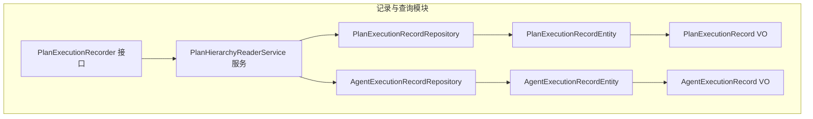
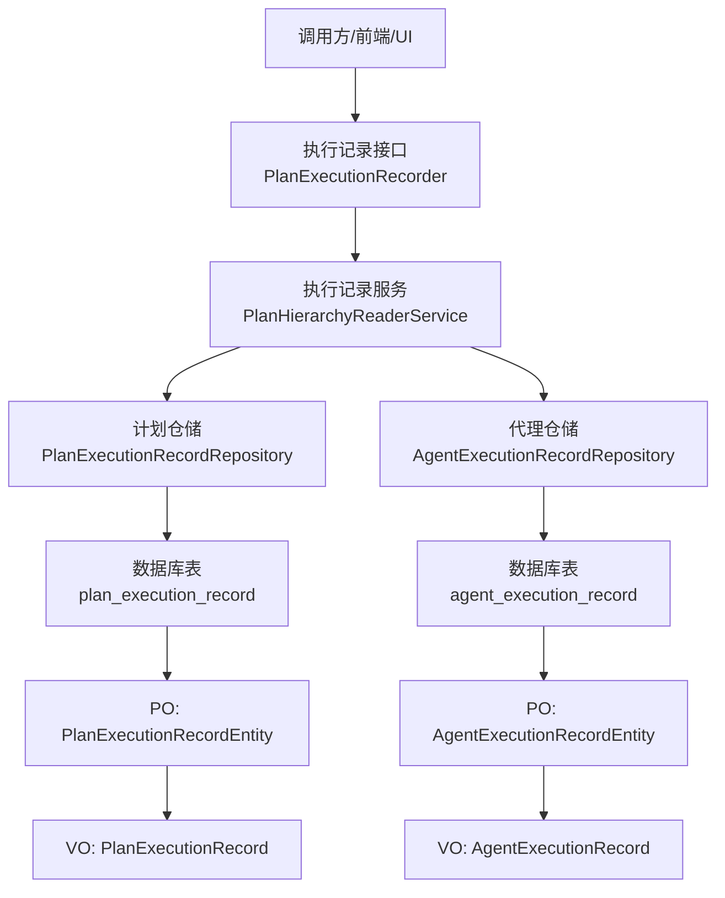
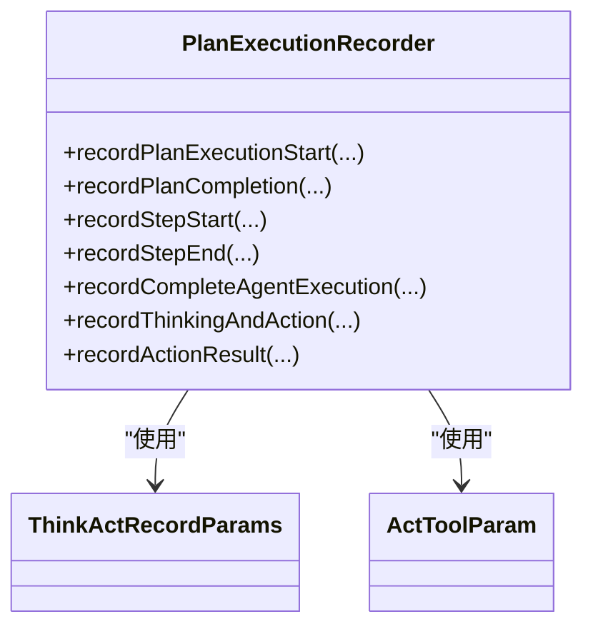
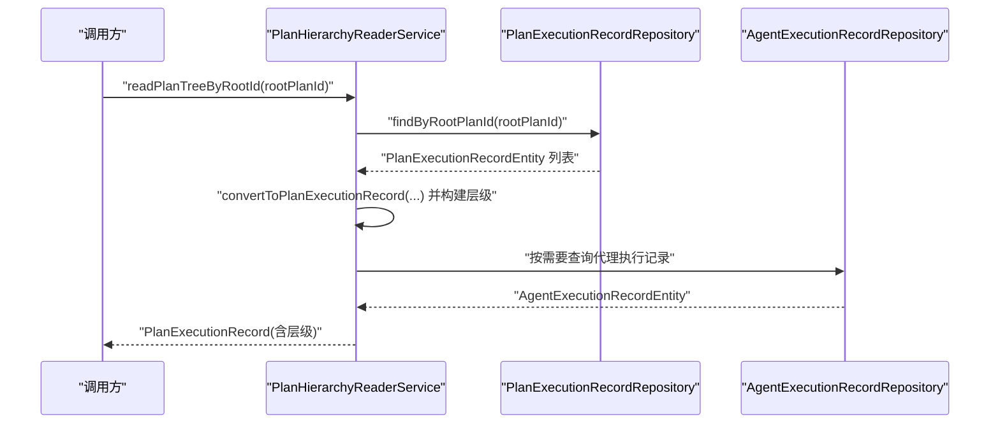
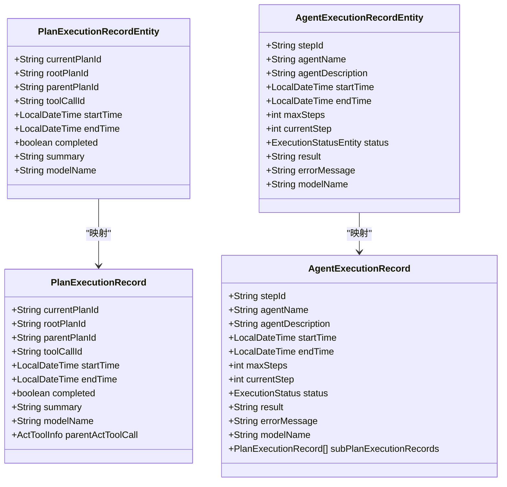
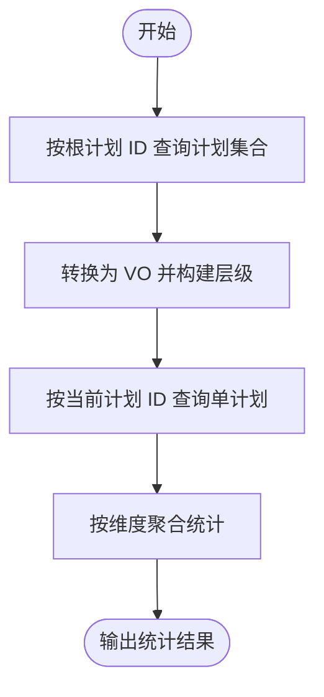
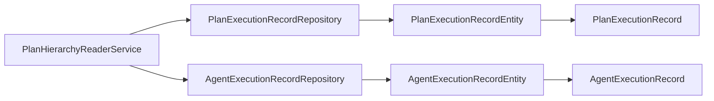

# 执行查询与分析

<cite>
**本文引用的文件**
- [PlanExecutionRecorder.java](file://src/main/java/com/alibaba/cloud/ai/lynxe/recorder/service/PlanExecutionRecorder.java)
- [PlanHierarchyReaderService.java](file://src/main/java/com/alibaba/cloud/ai/lynxe/recorder/service/PlanHierarchyReaderService.java)
- [PlanExecutionRecordRepository.java](file://src/main/java/com/alibaba/cloud/ai/lynxe/recorder/repository/PlanExecutionRecordRepository.java)
- [AgentExecutionRecordRepository.java](file://src/main/java/com/alibaba/cloud/ai/lynxe/recorder/repository/AgentExecutionRecordRepository.java)
- [PlanExecutionRecordEntity.java](file://src/main/java/com/alibaba/cloud/ai/lynxe/recorder/entity/PO/PlanExecutionRecordEntity.java)
- [AgentExecutionRecordEntity.java](file://src/main/java/com/alibaba/cloud/ai/lynxe/recorder/entity/PO/AgentExecutionRecordEntity.java)
- [PlanExecutionRecord.java](file://src/main/java/com/alibaba/cloud/ai/lynxe/recorder/entity/VO/PlanExecutionRecord.java)
- [AgentExecutionRecord.java](file://src/main/java/com/alibaba/cloud/ai/lynxe/recorder/entity/VO/AgentExecutionRecord.java)
</cite>

## 目录
1. [引言](#引言)
2. [项目结构](#项目结构)
3. [核心组件](#核心组件)
4. [架构总览](#架构总览)
5. [详细组件分析](#详细组件分析)
6. [依赖分析](#依赖分析)
7. [性能考量](#性能考量)
8. [故障排查指南](#故障排查指南)
9. [结论](#结论)
10. [附录](#附录)

## 引言
本技术文档聚焦于 Lynxe 的“执行查询与分析”模块，系统性阐述执行记录的查询接口设计、层级读取机制（根计划、子计划、执行步骤）、统计分析与聚合查询能力、导出能力以及归档与清理策略，并说明与监控与报表系统的集成与数据同步机制。目标是帮助开发者与运维人员快速理解并高效使用该模块。

## 项目结构
围绕执行记录与层级查询的关键目录与文件如下：
- recorder/service：执行记录服务接口与层级读取服务
- recorder/repository：JPA 仓库接口（按 ID/父子/根 ID 查询）
- recorder/entity：持久化对象（PO）与值对象（VO）

图表来源
- [PlanExecutionRecorder.java:1-242](file://src/main/java/com/alibaba/cloud/ai/lynxe/recorder/service/PlanExecutionRecorder.java#L1-L242)
- [PlanHierarchyReaderService.java:1-467](file://src/main/java/com/alibaba/cloud/ai/lynxe/recorder/service/PlanHierarchyReaderService.java#L1-L467)
- [PlanExecutionRecordRepository.java:1-55](file://src/main/java/com/alibaba/cloud/ai/lynxe/recorder/repository/PlanExecutionRecordRepository.java#L1-L55)
- [AgentExecutionRecordRepository.java:1-44](file://src/main/java/com/alibaba/cloud/ai/lynxe/recorder/repository/AgentExecutionRecordRepository.java#L1-L44)
- [PlanExecutionRecordEntity.java:1-283](file://src/main/java/com/alibaba/cloud/ai/lynxe/recorder/entity/PO/PlanExecutionRecordEntity.java#L1-L283)
- [AgentExecutionRecordEntity.java:1-275](file://src/main/java/com/alibaba/cloud/ai/lynxe/recorder/entity/PO/AgentExecutionRecordEntity.java#L1-L275)
- [PlanExecutionRecord.java:1-337](file://src/main/java/com/alibaba/cloud/ai/lynxe/recorder/entity/VO/PlanExecutionRecord.java#L1-L337)
- [AgentExecutionRecord.java:1-318](file://src/main/java/com/alibaba/cloud/ai/lynxe/recorder/entity/VO/AgentExecutionRecord.java#L1-L318)

章节来源
- [PlanExecutionRecorder.java:1-242](file://src/main/java/com/alibaba/cloud/ai/lynxe/recorder/service/PlanExecutionRecorder.java#L1-L242)
- [PlanHierarchyReaderService.java:1-467](file://src/main/java/com/alibaba/cloud/ai/lynxe/recorder/service/PlanHierarchyReaderService.java#L1-L467)
- [PlanExecutionRecordRepository.java:1-55](file://src/main/java/com/alibaba/cloud/ai/lynxe/recorder/repository/PlanExecutionRecordRepository.java#L1-L55)
- [AgentExecutionRecordRepository.java:1-44](file://src/main/java/com/alibaba/cloud/ai/lynxe/recorder/repository/AgentExecutionRecordRepository.java#L1-L44)
- [PlanExecutionRecordEntity.java:1-283](file://src/main/java/com/alibaba/cloud/ai/lynxe/recorder/entity/PO/PlanExecutionRecordEntity.java#L1-L283)
- [AgentExecutionRecordEntity.java:1-275](file://src/main/java/com/alibaba/cloud/ai/lynxe/recorder/entity/PO/AgentExecutionRecordEntity.java#L1-L275)
- [PlanExecutionRecord.java:1-337](file://src/main/java/com/alibaba/cloud/ai/lynxe/recorder/entity/VO/PlanExecutionRecord.java#L1-L337)
- [AgentExecutionRecord.java:1-318](file://src/main/java/com/alibaba/cloud/ai/lynxe/recorder/entity/VO/AgentExecutionRecord.java#L1-L318)

## 核心组件
- 记录接口：定义计划执行开始、完成、步骤开始/结束、完整代理执行记录、思考-行动记录与结果记录等方法族，屏蔽内部实体细节，统一对外 API。
- 层级读取服务：基于根计划 ID 读取整棵计划树，构建计划-代理-子计划的层级关系；同时提供单计划读取能力。
- 仓储层：提供按当前计划 ID、父计划 ID、根计划 ID 等条件的查询能力；代理执行记录提供按 stepId 的查询/删除能力。
- 实体与值对象：PO 用于持久化存储，VO 用于对外传输与层级展示，包含时间、状态、摘要、模型名、父工具调用等字段。

章节来源
- [PlanExecutionRecorder.java:26-107](file://src/main/java/com/alibaba/cloud/ai/lynxe/recorder/service/PlanExecutionRecorder.java#L26-L107)
- [PlanHierarchyReaderService.java:83-182](file://src/main/java/com/alibaba/cloud/ai/lynxe/recorder/service/PlanHierarchyReaderService.java#L83-L182)
- [PlanExecutionRecordRepository.java:27-52](file://src/main/java/com/alibaba/cloud/ai/lynxe/recorder/repository/PlanExecutionRecordRepository.java#L27-L52)
- [AgentExecutionRecordRepository.java:26-41](file://src/main/java/com/alibaba/cloud/ai/lynxe/recorder/repository/AgentExecutionRecordRepository.java#L26-L41)
- [PlanExecutionRecordEntity.java:42-109](file://src/main/java/com/alibaba/cloud/ai/lynxe/recorder/entity/PO/PlanExecutionRecordEntity.java#L42-L109)
- [AgentExecutionRecordEntity.java:61-123](file://src/main/java/com/alibaba/cloud/ai/lynxe/recorder/entity/PO/AgentExecutionRecordEntity.java#L61-L123)
- [PlanExecutionRecord.java:46-100](file://src/main/java/com/alibaba/cloud/ai/lynxe/recorder/entity/VO/PlanExecutionRecord.java#L46-L100)
- [AgentExecutionRecord.java:55-108](file://src/main/java/com/alibaba/cloud/ai/lynxe/recorder/entity/VO/AgentExecutionRecord.java#L55-L108)

## 架构总览
下图展示了从记录接口到层级读取、再到仓储与实体的全链路：

图表来源
- [PlanExecutionRecorder.java:26-107](file://src/main/java/com/alibaba/cloud/ai/lynxe/recorder/service/PlanExecutionRecorder.java#L26-L107)
- [PlanHierarchyReaderService.java:59-69](file://src/main/java/com/alibaba/cloud/ai/lynxe/recorder/service/PlanHierarchyReaderService.java#L59-L69)
- [PlanExecutionRecordRepository.java:27-52](file://src/main/java/com/alibaba/cloud/ai/lynxe/recorder/repository/PlanExecutionRecordRepository.java#L27-L52)
- [AgentExecutionRecordRepository.java:26-41](file://src/main/java/com/alibaba/cloud/ai/lynxe/recorder/repository/AgentExecutionRecordRepository.java#L26-L41)
- [PlanExecutionRecordEntity.java:42-109](file://src/main/java/com/alibaba/cloud/ai/lynxe/recorder/entity/PO/PlanExecutionRecordEntity.java#L42-L109)
- [AgentExecutionRecordEntity.java:61-123](file://src/main/java/com/alibaba/cloud/ai/lynxe/recorder/entity/PO/AgentExecutionRecordEntity.java#L61-L123)
- [PlanExecutionRecord.java:46-100](file://src/main/java/com/alibaba/cloud/ai/lynxe/recorder/entity/VO/PlanExecutionRecord.java#L46-L100)
- [AgentExecutionRecord.java:55-108](file://src/main/java/com/alibaba/cloud/ai/lynxe/recorder/entity/VO/AgentExecutionRecord.java#L55-L108)

## 详细组件分析

### 组件一：执行记录接口设计
- 职责：对外暴露统一的执行记录 API，屏蔽内部实体细节，便于上层调用与扩展。
- 关键方法族：
  - 计划执行生命周期：开始、完成
  - 步骤执行生命周期：开始、结束
  - 完整代理执行记录：汇总代理执行结果、时间、状态等
  - 思考-行动记录：记录思考输入/输出、错误、工具调用信息等
  - 动作结果记录：记录动作执行结果、状态、工具名称等
- 参数封装：通过内部参数类封装 ThinkActRecord 与 ActToolParam，避免直接暴露实体。

图表来源
- [PlanExecutionRecorder.java:26-107](file://src/main/java/com/alibaba/cloud/ai/lynxe/recorder/service/PlanExecutionRecorder.java#L26-L107)
- [PlanExecutionRecorder.java:113-182](file://src/main/java/com/alibaba/cloud/ai/lynxe/recorder/service/PlanExecutionRecorder.java#L113-L182)
- [PlanExecutionRecorder.java:188-239](file://src/main/java/com/alibaba/cloud/ai/lynxe/recorder/service/PlanExecutionRecorder.java#L188-L239)

章节来源
- [PlanExecutionRecorder.java:26-107](file://src/main/java/com/alibaba/cloud/ai/lynxe/recorder/service/PlanExecutionRecorder.java#L26-L107)
- [PlanExecutionRecorder.java:113-182](file://src/main/java/com/alibaba/cloud/ai/lynxe/recorder/service/PlanExecutionRecorder.java#L113-L182)
- [PlanExecutionRecorder.java:188-239](file://src/main/java/com/alibaba/cloud/ai/lynxe/recorder/service/PlanExecutionRecorder.java#L188-L239)

### 组件二：层级读取服务（根计划/子计划/执行步骤）
- 职责：根据根计划 ID 读取整棵计划树，构建计划-代理-子计划的层级关系；支持单计划读取。
- 关键流程：
  - 按根 ID 查询所有计划（含根），转换为 VO 对象
  - 建立层级关系：遍历每个计划的代理序列，查找其触发的子计划
  - 子计划匹配：通过工具调用 ID 与思考-行动记录建立父子关系
  - 结果排序：子计划按开始时间升序排列
- 错误处理：对空 ID、未找到、异常等情况进行日志记录与返回空值。

图表来源
- [PlanHierarchyReaderService.java:83-146](file://src/main/java/com/alibaba/cloud/ai/lynxe/recorder/service/PlanHierarchyReaderService.java#L83-L146)
- [PlanExecutionRecordRepository.java:40-42](file://src/main/java/com/alibaba/cloud/ai/lynxe/recorder/repository/PlanExecutionRecordRepository.java#L40-L42)
- [AgentExecutionRecordRepository.java:26-41](file://src/main/java/com/alibaba/cloud/ai/lynxe/recorder/repository/AgentExecutionRecordRepository.java#L26-L41)

章节来源
- [PlanHierarchyReaderService.java:83-146](file://src/main/java/com/alibaba/cloud/ai/lynxe/recorder/service/PlanHierarchyReaderService.java#L83-L146)
- [PlanHierarchyReaderService.java:154-182](file://src/main/java/com/alibaba/cloud/ai/lynxe/recorder/service/PlanHierarchyReaderService.java#L154-L182)
- [PlanHierarchyReaderService.java:333-364](file://src/main/java/com/alibaba/cloud/ai/lynxe/recorder/service/PlanHierarchyReaderService.java#L333-L364)
- [PlanHierarchyReaderService.java:378-450](file://src/main/java/com/alibaba/cloud/ai/lynxe/recorder/service/PlanHierarchyReaderService.java#L378-L450)

### 组件三：数据模型与映射
- 计划执行记录（PO/VO）：
  - 字段覆盖：基础信息（标题、请求、时间）、结构信息（步骤列表、当前步索引）、执行数据（代理序列）、结果信息（完成标志、摘要、模型名、父工具调用）
  - VO 特有：动态更新当前步索引、用户等待状态、结构化结果等
- 代理执行记录（PO/VO）：
  - 字段覆盖：基础信息（名称、描述、时间）、执行数据（最大步数、当前步、状态、思考-行动步骤）、结果信息（结果、错误、模型名）
  - VO 特有：子计划执行记录列表、完成/运行/空闲判断、已完成思考-行动步骤计数等

图表来源
- [PlanExecutionRecordEntity.java:42-109](file://src/main/java/com/alibaba/cloud/ai/lynxe/recorder/entity/PO/PlanExecutionRecordEntity.java#L42-L109)
- [AgentExecutionRecordEntity.java:61-123](file://src/main/java/com/alibaba/cloud/ai/lynxe/recorder/entity/PO/AgentExecutionRecordEntity.java#L61-L123)
- [PlanExecutionRecord.java:46-100](file://src/main/java/com/alibaba/cloud/ai/lynxe/recorder/entity/VO/PlanExecutionRecord.java#L46-L100)
- [AgentExecutionRecord.java:55-108](file://src/main/java/com/alibaba/cloud/ai/lynxe/recorder/entity/VO/AgentExecutionRecord.java#L55-L108)

章节来源
- [PlanExecutionRecordEntity.java:42-109](file://src/main/java/com/alibaba/cloud/ai/lynxe/recorder/entity/PO/PlanExecutionRecordEntity.java#L42-L109)
- [AgentExecutionRecordEntity.java:61-123](file://src/main/java/com/alibaba/cloud/ai/lynxe/recorder/entity/PO/AgentExecutionRecordEntity.java#L61-L123)
- [PlanExecutionRecord.java:46-100](file://src/main/java/com/alibaba/cloud/ai/lynxe/recorder/entity/VO/PlanExecutionRecord.java#L46-L100)
- [AgentExecutionRecord.java:55-108](file://src/main/java/com/alibaba/cloud/ai/lynxe/recorder/entity/VO/AgentExecutionRecord.java#L55-L108)

### 组件四：查询与聚合能力
- 单计划查询：按当前计划 ID 查询单个计划详情（不含子计划树）。
- 根计划树查询：按根计划 ID 查询整棵计划树，自动构建层级关系。
- 聚合维度建议（基于现有字段）：
  - 时间范围：startTime/endTime
  - 代理类型：agentName/modelName
  - 工具使用：parentActToolCall/name（来自父工具调用）
  - 执行状态：status（FINISHED/RUNNING/IDLE）
  - 成功率：completed 与 status 组合统计
- 统计分析建议：
  - 执行时长分布：按计划或代理的 endTime - startTime 计算
  - 成功率：成功完成（completed=true 或 status=FINISHED 且 result 非空）占比
  - 平均/分位执行时长：按代理或计划维度统计
  - 工具调用频次与耗时：按工具名聚合

图表来源
- [PlanHierarchyReaderService.java:83-146](file://src/main/java/com/alibaba/cloud/ai/lynxe/recorder/service/PlanHierarchyReaderService.java#L83-L146)
- [PlanHierarchyReaderService.java:154-182](file://src/main/java/com/alibaba/cloud/ai/lynxe/recorder/service/PlanHierarchyReaderService.java#L154-L182)

章节来源
- [PlanHierarchyReaderService.java:83-146](file://src/main/java/com/alibaba/cloud/ai/lynxe/recorder/service/PlanHierarchyReaderService.java#L83-L146)
- [PlanHierarchyReaderService.java:154-182](file://src/main/java/com/alibaba/cloud/ai/lynxe/recorder/service/PlanHierarchyReaderService.java#L154-L182)

### 组件五：导出能力
- 支持格式：CSV、JSON（可扩展至 Excel 等）
- 导出内容：根计划树的完整结构（计划-代理-子计划-思考-行动-工具调用），以及按维度聚合后的统计结果
- 导出流程建议：
  - 读取根计划树或聚合结果
  - 将 VO 对象序列化为 JSON 或 CSV
  - 提供分页/批量导出以控制内存占用

[本节为通用实现建议，不直接分析具体代码文件]

### 组件六：归档与清理策略
- 策略目标：平衡长期存储与短期缓存，兼顾查询性能与成本
- 归档策略：
  - 基于时间阈值的冷热分离：近期活跃执行记录保留在热存储，历史记录迁移至归档存储
  - 分表/分区：按日期分区，定期归档旧分区
- 清理策略：
  - 过期清理：超过保留期限的记录删除或标记归档
  - 大字段优化：对 LONGTEXT 类型的大字段进行压缩或外部化存储
- 一致性保障：
  - 事务内完成写入与层级构建
  - 删除前先备份或打标签

[本节为通用实现建议，不直接分析具体代码文件]

### 组件七：与监控与报表系统的集成
- 数据同步：
  - 定时任务：周期性将执行记录与统计结果同步至监控/报表系统
  - 实时推送：在关键事件（如计划完成、失败）时触发推送
- 接口设计：
  - 提供标准 REST 接口或消息队列接口，确保与监控/报表系统解耦
  - 输出统一的数据模型（VO），便于下游消费
- 指标对接：
  - 执行时长、成功率、吞吐量、错误率等指标可直接由现有字段计算

[本节为通用实现建议，不直接分析具体代码文件]

## 依赖分析
- 组件耦合：
  - PlanHierarchyReaderService 依赖多个仓储接口，负责跨实体的层级构建
  - PlanExecutionRecorder 作为对外接口，不直接依赖仓储，降低耦合
- 外部依赖：
  - JPA/Hibernate：实体映射与查询
  - Spring 事务注解：保证读取一致性
- 潜在风险：
  - 层级构建涉及多次查询与映射，需关注性能与 N+1 问题
  - 大型计划树的内存占用与序列化开销

图表来源
- [PlanHierarchyReaderService.java:59-69](file://src/main/java/com/alibaba/cloud/ai/lynxe/recorder/service/PlanHierarchyReaderService.java#L59-L69)
- [PlanExecutionRecordRepository.java:27-52](file://src/main/java/com/alibaba/cloud/ai/lynxe/recorder/repository/PlanExecutionRecordRepository.java#L27-L52)
- [AgentExecutionRecordRepository.java:26-41](file://src/main/java/com/alibaba/cloud/ai/lynxe/recorder/repository/AgentExecutionRecordRepository.java#L26-L41)
- [PlanExecutionRecordEntity.java:42-109](file://src/main/java/com/alibaba/cloud/ai/lynxe/recorder/entity/PO/PlanExecutionRecordEntity.java#L42-L109)
- [AgentExecutionRecordEntity.java:61-123](file://src/main/java/com/alibaba/cloud/ai/lynxe/recorder/entity/PO/AgentExecutionRecordEntity.java#L61-L123)
- [PlanExecutionRecord.java:46-100](file://src/main/java/com/alibaba/cloud/ai/lynxe/recorder/entity/VO/PlanExecutionRecord.java#L46-L100)
- [AgentExecutionRecord.java:55-108](file://src/main/java/com/alibaba/cloud/ai/lynxe/recorder/entity/VO/AgentExecutionRecord.java#L55-L108)

章节来源
- [PlanHierarchyReaderService.java:59-69](file://src/main/java/com/alibaba/cloud/ai/lynxe/recorder/service/PlanHierarchyReaderService.java#L59-L69)
- [PlanExecutionRecordRepository.java:27-52](file://src/main/java/com/alibaba/cloud/ai/lynxe/recorder/repository/PlanExecutionRecordRepository.java#L27-L52)
- [AgentExecutionRecordRepository.java:26-41](file://src/main/java/com/alibaba/cloud/ai/lynxe/recorder/repository/AgentExecutionRecordRepository.java#L26-L41)

## 性能考量
- 查询路径优化：
  - 使用按根 ID 的批量查询，减少多次往返
  - 对代理执行记录按 stepId 建索引，提升匹配效率
- 映射与序列化：
  - 分批转换 VO，避免一次性加载全部层级导致内存峰值
  - 对大字段（LONGTEXT）采用延迟加载或外部化存储
- 缓存策略：
  - 对热点根计划树进行缓存，结合失效策略
  - 对只读统计结果进行缓存，定期刷新

[本节提供通用指导，不直接分析具体代码文件]

## 故障排查指南
- 常见问题：
  - 根计划 ID 为空或不存在：检查调用方传参与数据初始化
  - 层级关系缺失：确认工具调用 ID 与思考-行动记录是否正确关联
  - 代理执行记录重复或缺失：检查 stepId 唯一性与写入顺序
- 日志定位：
  - 服务层对异常进行捕获并记录错误日志，便于定位问题
  - 对关键查询（按根 ID、按当前计划 ID）增加日志埋点
- 快速修复：
  - 重新触发根计划树读取
  - 校验实体字段完整性（时间、状态、摘要等）

章节来源
- [PlanHierarchyReaderService.java:86-98](file://src/main/java/com/alibaba/cloud/ai/lynxe/recorder/service/PlanHierarchyReaderService.java#L86-L98)
- [PlanHierarchyReaderService.java:142-145](file://src/main/java/com/alibaba/cloud/ai/lynxe/recorder/service/PlanHierarchyReaderService.java#L142-L145)
- [PlanExecutionRecordRepository.java:30-32](file://src/main/java/com/alibaba/cloud/ai/lynxe/recorder/repository/PlanExecutionRecordRepository.java#L30-L32)
- [AgentExecutionRecordRepository.java:29-31](file://src/main/java/com/alibaba/cloud/ai/lynxe/recorder/repository/AgentExecutionRecordRepository.java#L29-L31)

## 结论
Lynxe 的执行查询与分析模块通过清晰的接口设计与层级读取服务，实现了对根计划、子计划与执行步骤的完整可视化与可查询性。结合现有实体与仓储能力，可进一步扩展统计分析、聚合查询、导出与归档清理策略，并与监控/报表系统实现稳定的数据同步。建议在生产环境中配合缓存、分区与异步导出等手段，持续优化性能与可用性。

## 附录
- 关键字段说明：
  - 计划：currentPlanId/rootPlanId/parentPlanId/toolCallId、startTime/endTime、completed/summary/modelName
  - 代理：stepId/agentName/agentDescription、startTime/endTime、maxSteps/currentStep/status、result/errorMessage/modelName
  - 层级：subPlanExecutionRecords（子计划列表）、parentActToolCall（父工具调用）

[本节为补充说明，不直接分析具体代码文件]