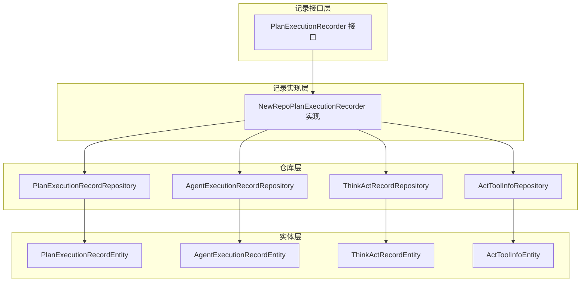
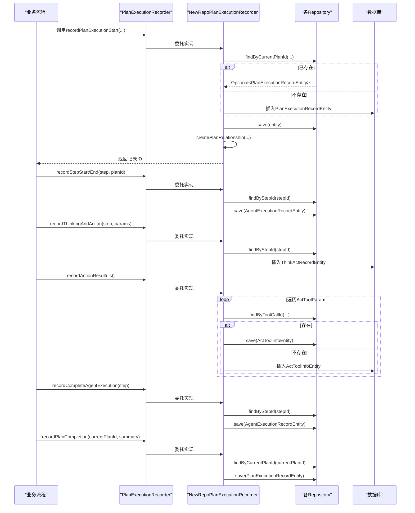
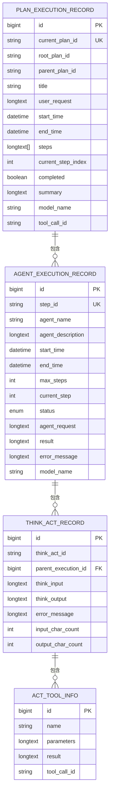
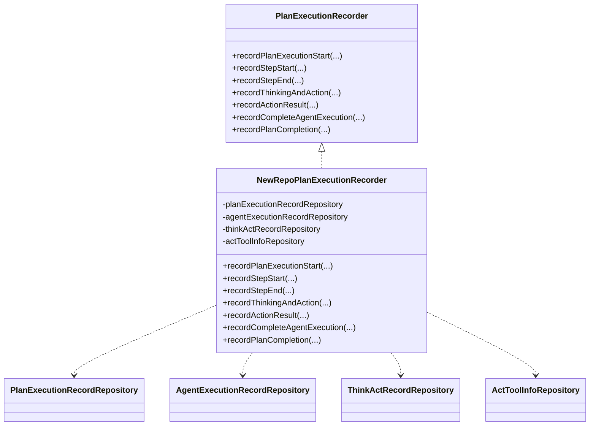

# 执行记录系统

<cite>
**本文引用的文件**
- [PlanExecutionRecorder.java](file://src/main/java/com/alibaba/cloud/ai/lynxe/recorder/service/PlanExecutionRecorder.java)
- [NewRepoPlanExecutionRecorder.java](file://src/main/java/com/alibaba/cloud/ai/lynxe/recorder/service/NewRepoPlanExecutionRecorder.java)
- [PlanExecutionRecordEntity.java](file://src/main/java/com/alibaba/cloud/ai/lynxe/recorder/entity/po/PlanExecutionRecordEntity.java)
- [AgentExecutionRecordEntity.java](file://src/main/java/com/alibaba/cloud/ai/lynxe/recorder/entity/po/AgentExecutionRecordEntity.java)
- [ThinkActRecordEntity.java](file://src/main/java/com/alibaba/cloud/ai/lynxe/recorder/entity/po/ThinkActRecordEntity.java)
- [ActToolInfoEntity.java](file://src/main/java/com/alibaba/cloud/ai/lynxe/recorder/entity/po/ActToolInfoEntity.java)
- [PlanExecutionRecordRepository.java](file://src/main/java/com/alibaba/cloud/ai/lynxe/recorder/repository/PlanExecutionRecordRepository.java)
- [AgentExecutionRecordRepository.java](file://src/main/java/com/alibaba/cloud/ai/lynxe/recorder/repository/AgentExecutionRecordRepository.java)
- [ThinkActRecordRepository.java](file://src/main/java/com/alibaba/cloud/ai/lynxe/recorder/repository/ThinkActRecordRepository.java)
- [ActToolInfoRepository.java](file://src/main/java/com/alibaba/cloud/ai/lynxe/recorder/repository/ActToolInfoRepository.java)
- [LynxeSpringEnvironmentHolder.java](file://src/main/java/com/alibaba/cloud/ai/lynxe/recorder/LynxeSpringEnvironmentHolder.java)
- [SerializeType.java](file://src/main/java/com/alibaba/cloud/ai/lynxe/recorder/SerializeType.java)
</cite>

## 目录
1. [简介](#简介)
2. [项目结构](#项目结构)
3. [核心组件](#核心组件)
4. [架构总览](#架构总览)
5. [详细组件分析](#详细组件分析)
6. [依赖关系分析](#依赖关系分析)
7. [性能考量](#性能考量)
8. [故障排查指南](#故障排查指南)
9. [结论](#结论)
10. [附录](#附录)

## 简介
本文件面向Lynxe执行记录系统，系统性阐述执行记录的设计理念、数据模型、存储策略与查询统计能力，并给出导入导出、归档与清理策略以及与监控与审计系统的集成建议。执行记录体系围绕“计划执行记录”“代理执行记录”“工具调用记录”三层结构展开，覆盖从计划启动、步骤执行、思考-行动循环到最终完成的全生命周期追踪。

## 项目结构
执行记录相关代码位于recorder模块，采用分层设计：
- 接口层：定义统一的记录接口，屏蔽具体实现细节
- 实现层：基于JPA实体与仓库的持久化实现
- 实体层：以JPA注解映射数据库表
- 仓库层：Spring Data JPA接口，提供查询与聚合方法

图表来源
- [PlanExecutionRecorder.java:26-107](file://src/main/java/com/alibaba/cloud/ai/lynxe/recorder/service/PlanExecutionRecorder.java#L26-L107)
- [NewRepoPlanExecutionRecorder.java:48-62](file://src/main/java/com/alibaba/cloud/ai/lynxe/recorder/service/NewRepoPlanExecutionRecorder.java#L48-L62)
- [PlanExecutionRecordRepository.java:27-54](file://src/main/java/com/alibaba/cloud/ai/lynxe/recorder/repository/PlanExecutionRecordRepository.java#L27-L54)
- [AgentExecutionRecordRepository.java:26-43](file://src/main/java/com/alibaba/cloud/ai/lynxe/recorder/repository/AgentExecutionRecordRepository.java#L26-L43)
- [ThinkActRecordRepository.java:29-54](file://src/main/java/com/alibaba/cloud/ai/lynxe/recorder/repository/ThinkActRecordRepository.java#L29-L54)
- [ActToolInfoRepository.java:26-43](file://src/main/java/com/alibaba/cloud/ai/lynxe/recorder/repository/ActToolInfoRepository.java#L26-L43)

章节来源
- [PlanExecutionRecorder.java:26-107](file://src/main/java/com/alibaba/cloud/ai/lynxe/recorder/service/PlanExecutionRecorder.java#L26-L107)
- [NewRepoPlanExecutionRecorder.java:48-62](file://src/main/java/com/alibaba/cloud/ai/lynxe/recorder/service/NewRepoPlanExecutionRecorder.java#L48-L62)

## 核心组件
- 记录接口：定义计划开始、步骤开始/结束、思考-行动、动作结果、完整代理执行、计划完成等方法，参数封装在内部类中，避免对外暴露实体细节。
- 记录实现：NewRepoPlanExecutionRecorder负责事务化持久化、状态转换、层级关系建立与查询细节转换。
- 实体模型：PlanExecutionRecordEntity、AgentExecutionRecordEntity、ThinkActRecordEntity、ActToolInfoEntity构成完整的执行记录数据模型。
- 仓库接口：提供按ID、父子计划ID、工具调用ID等维度的查询与聚合能力。

章节来源
- [PlanExecutionRecorder.java:26-107](file://src/main/java/com/alibaba/cloud/ai/lynxe/recorder/service/PlanExecutionRecorder.java#L26-L107)
- [NewRepoPlanExecutionRecorder.java:75-156](file://src/main/java/com/alibaba/cloud/ai/lynxe/recorder/service/NewRepoPlanExecutionRecorder.java#L75-L156)
- [PlanExecutionRecordEntity.java:42-109](file://src/main/java/com/alibaba/cloud/ai/lynxe/recorder/entity/po/PlanExecutionRecordEntity.java#L42-L109)
- [AgentExecutionRecordEntity.java:61-123](file://src/main/java/com/alibaba/cloud/ai/lynxe/recorder/entity/po/AgentExecutionRecordEntity.java#L61-L123)
- [ThinkActRecordEntity.java:53-95](file://src/main/java/com/alibaba/cloud/ai/lynxe/recorder/entity/po/ThinkActRecordEntity.java#L53-L95)
- [ActToolInfoEntity.java:27-51](file://src/main/java/com/alibaba/cloud/ai/lynxe/recorder/entity/po/ActToolInfoEntity.java#L27-L51)

## 架构总览
执行记录系统通过接口隔离业务流程与持久化细节，实现层在事务边界内协调多个实体的创建与更新，仓库层提供高效查询与关联加载。

图表来源
- [PlanExecutionRecorder.java:34-107](file://src/main/java/com/alibaba/cloud/ai/lynxe/recorder/service/PlanExecutionRecorder.java#L34-L107)
- [NewRepoPlanExecutionRecorder.java:75-156](file://src/main/java/com/alibaba/cloud/ai/lynxe/recorder/service/NewRepoPlanExecutionRecorder.java#L75-L156)
- [NewRepoPlanExecutionRecorder.java:293-386](file://src/main/java/com/alibaba/cloud/ai/lynxe/recorder/service/NewRepoPlanExecutionRecorder.java#L293-L386)
- [NewRepoPlanExecutionRecorder.java:390-450](file://src/main/java/com/alibaba/cloud/ai/lynxe/recorder/service/NewRepoPlanExecutionRecorder.java#L390-L450)
- [NewRepoPlanExecutionRecorder.java:453-520](file://src/main/java/com/alibaba/cloud/ai/lynxe/recorder/service/NewRepoPlanExecutionRecorder.java#L453-L520)
- [NewRepoPlanExecutionRecorder.java:523-604](file://src/main/java/com/alibaba/cloud/ai/lynxe/recorder/service/NewRepoPlanExecutionRecorder.java#L523-L604)
- [NewRepoPlanExecutionRecorder.java:607-645](file://src/main/java/com/alibaba/cloud/ai/lynxe/recorder/service/NewRepoPlanExecutionRecorder.java#L607-L645)

## 详细组件分析

### 数据模型与字段定义
- 计划执行记录（PlanExecutionRecordEntity）
  - 关键字段：当前计划ID、根计划ID、父计划ID、标题、用户请求、开始/结束时间、步骤列表、当前步骤索引、完成标记、摘要、模型名、工具调用ID、代理执行序列
  - 关系：一对多，维护代理执行顺序
- 代理执行记录（AgentExecutionRecordEntity）
  - 关键字段：步骤ID（唯一）、代理名称、描述、开始/结束时间、最大步数、当前步数、状态、代理请求、结果、错误信息、模型名
  - 关系：一对多，维护思考-行动子步骤；索引：step_id
- 思考-行动记录（ThinkActRecordEntity）
  - 关键字段：思考输入/输出、错误信息、输入/输出字符计数、父执行ID、思考-行动ID
  - 关系：一对多，维护工具调用信息
- 工具调用信息（ActToolInfoEntity）
  - 关键字段：名称、参数（序列化）、结果（序列化）、工具调用ID（唯一）
  - 关系：与思考-行动记录关联，支持按工具调用ID反查

图表来源
- [PlanExecutionRecordEntity.java:42-282](file://src/main/java/com/alibaba/cloud/ai/lynxe/recorder/entity/po/PlanExecutionRecordEntity.java#L42-L282)
- [AgentExecutionRecordEntity.java:61-274](file://src/main/java/com/alibaba/cloud/ai/lynxe/recorder/entity/po/AgentExecutionRecordEntity.java#L61-L274)
- [ThinkActRecordEntity.java:53-184](file://src/main/java/com/alibaba/cloud/ai/lynxe/recorder/entity/po/ThinkActRecordEntity.java#L53-L184)
- [ActToolInfoEntity.java:27-117](file://src/main/java/com/alibaba/cloud/ai/lynxe/recorder/entity/po/ActToolInfoEntity.java#L27-L117)

章节来源
- [PlanExecutionRecordEntity.java:42-282](file://src/main/java/com/alibaba/cloud/ai/lynxe/recorder/entity/po/PlanExecutionRecordEntity.java#L42-L282)
- [AgentExecutionRecordEntity.java:61-274](file://src/main/java/com/alibaba/cloud/ai/lynxe/recorder/entity/po/AgentExecutionRecordEntity.java#L61-L274)
- [ThinkActRecordEntity.java:53-184](file://src/main/java/com/alibaba/cloud/ai/lynxe/recorder/entity/po/ThinkActRecordEntity.java#L53-L184)
- [ActToolInfoEntity.java:27-117](file://src/main/java/com/alibaba/cloud/ai/lynxe/recorder/entity/po/ActToolInfoEntity.java#L27-L117)

### 执行状态管理与时间戳
- 状态枚举：AgentExecutionRecordEntity使用ExecutionStatusEntity枚举，映射为IDLE/RUNNING/FINISHED
- 状态转换：根据AgentState转换，失败/阻塞视为FINISHED
- 时间戳：所有实体均包含start_time/end_time，记录关键节点时间
- 完成标记：PlanExecutionRecordEntity提供complete(summary)设置结束时间与摘要

章节来源
- [NewRepoPlanExecutionRecorder.java:255-275](file://src/main/java/com/alibaba/cloud/ai/lynxe/recorder/service/NewRepoPlanExecutionRecorder.java#L255-L275)
- [AgentExecutionRecordEntity.java:98-101](file://src/main/java/com/alibaba/cloud/ai/lynxe/recorder/entity/po/AgentExecutionRecordEntity.java#L98-L101)
- [PlanExecutionRecordEntity.java:162-166](file://src/main/java/com/alibaba/cloud/ai/lynxe/recorder/entity/po/PlanExecutionRecordEntity.java#L162-L166)

### 记录结构与字段详解
- 计划执行记录
  - 用途：顶层计划生命周期跟踪，支持父子/根计划层级
  - 关键字段：currentPlanId（唯一）、rootPlanId、parentPlanId、toolCallId、steps、currentStepIndex、completed、summary
- 代理执行记录
  - 用途：单个步骤的代理执行过程跟踪
  - 关键字段：stepId（唯一）、agentName、agentDescription、status、agentRequest、result、errorMessage、modelName
- 思考-行动记录
  - 用途：单步内思考阶段与行动阶段的明细
  - 关键字段：thinkInput/thinkOutput、errorMessage、inputCharCount/outputCharCount、actToolInfoList
- 工具调用信息
  - 用途：记录工具调用的名称、参数、结果与唯一标识
  - 关键字段：name、parameters、result、toolCallId

章节来源
- [PlanExecutionRecordEntity.java:52-109](file://src/main/java/com/alibaba/cloud/ai/lynxe/recorder/entity/po/PlanExecutionRecordEntity.java#L52-L109)
- [AgentExecutionRecordEntity.java:71-123](file://src/main/java/com/alibaba/cloud/ai/lynxe/recorder/entity/po/AgentExecutionRecordEntity.java#L71-L123)
- [ThinkActRecordEntity.java:63-95](file://src/main/java/com/alibaba/cloud/ai/lynxe/recorder/entity/po/ThinkActRecordEntity.java#L63-L95)
- [ActToolInfoEntity.java:37-51](file://src/main/java/com/alibaba/cloud/ai/lynxe/recorder/entity/po/ActToolInfoEntity.java#L37-L51)

### 查询、统计与报告生成
- 查询能力
  - 按计划ID：PlanExecutionRecordRepository提供findByCurrentPlanId、findByParentPlanId、findByRootPlanId
  - 按步骤ID：AgentExecutionRecordRepository提供findByStepId
  - 按工具调用ID：ActToolInfoRepository提供findByToolCallId；ThinkActRecordRepository提供按工具调用ID的JOIN查询
  - 关联加载：ThinkActRecordRepository提供按父执行ID带Eager加载的actToolInfoList查询
- 统计与报告
  - 可基于实体字段进行聚合统计（如按时间窗口、状态分布、平均耗时等），结合仓库查询结果在服务层汇总
  - 报告生成可基于getAgentExecutionDetail与fetchThinkActRecords返回的明细对象进行二次加工

章节来源
- [PlanExecutionRecordRepository.java:29-47](file://src/main/java/com/alibaba/cloud/ai/lynxe/recorder/repository/PlanExecutionRecordRepository.java#L29-L47)
- [AgentExecutionRecordRepository.java:29-36](file://src/main/java/com/alibaba/cloud/ai/lynxe/recorder/repository/AgentExecutionRecordRepository.java#L29-L36)
- [ActToolInfoRepository.java:29-36](file://src/main/java/com/alibaba/cloud/ai/lynxe/recorder/repository/ActToolInfoRepository.java#L29-L36)
- [ThinkActRecordRepository.java:42-52](file://src/main/java/com/alibaba/cloud/ai/lynxe/recorder/repository/ThinkActRecordRepository.java#L42-L52)
- [NewRepoPlanExecutionRecorder.java:652-744](file://src/main/java/com/alibaba/cloud/ai/lynxe/recorder/service/NewRepoPlanExecutionRecorder.java#L652-L744)

### 导入导出、归档与清理策略
- 导入导出
  - 建议以标准格式（如JSON）导出执行明细，包含计划、代理、思考-行动、工具调用的完整链路
  - 导入时需校验唯一性（currentPlanId、stepId、toolCallId），并按层级关系重建父子关系
- 归档
  - 基于时间范围与完成标记进行批量归档，保留摘要与关键指标，压缩长文本字段
- 清理
  - 设定保留周期（如90天），到期后删除或迁移至归档库
  - 清理前确保无外部依赖引用（如监控/审计系统）

说明：本节为通用实践建议，不直接对应具体源码实现。

### 与监控系统、审计系统的集成
- 监控系统
  - 利用startTime/endTime计算执行耗时，结合状态字段上报指标
  - 将错误信息与摘要纳入异常监控
- 审计系统
  - 保留原始用户请求与工具参数（脱敏处理），确保可追溯
  - 记录操作人、时间戳与变更轨迹

说明：本节为通用实践建议，不直接对应具体源码实现。

## 依赖关系分析
- 组件耦合
  - 接口与实现分离，降低耦合度
  - 实现类依赖多个仓库接口，形成清晰的领域边界
- 外部依赖
  - Spring Data JPA提供ORM与查询能力
  - SLF4J用于日志记录

图表来源
- [PlanExecutionRecorder.java:26-107](file://src/main/java/com/alibaba/cloud/ai/lynxe/recorder/service/PlanExecutionRecorder.java#L26-L107)
- [NewRepoPlanExecutionRecorder.java:48-62](file://src/main/java/com/alibaba/cloud/ai/lynxe/recorder/service/NewRepoPlanExecutionRecorder.java#L48-L62)
- [PlanExecutionRecordRepository.java:27-54](file://src/main/java/com/alibaba/cloud/ai/lynxe/recorder/repository/PlanExecutionRecordRepository.java#L27-L54)
- [AgentExecutionRecordRepository.java:26-43](file://src/main/java/com/alibaba/cloud/ai/lynxe/recorder/repository/AgentExecutionRecordRepository.java#L26-L43)
- [ThinkActRecordRepository.java:29-54](file://src/main/java/com/alibaba/cloud/ai/lynxe/recorder/repository/ThinkActRecordRepository.java#L29-L54)
- [ActToolInfoRepository.java:26-43](file://src/main/java/com/alibaba/cloud/ai/lynxe/recorder/repository/ActToolInfoRepository.java#L26-L43)

章节来源
- [PlanExecutionRecorder.java:26-107](file://src/main/java/com/alibaba/cloud/ai/lynxe/recorder/service/PlanExecutionRecorder.java#L26-L107)
- [NewRepoPlanExecutionRecorder.java:48-62](file://src/main/java/com/alibaba/cloud/ai/lynxe/recorder/service/NewRepoPlanExecutionRecorder.java#L48-L62)

## 性能考量
- 索引策略
  - AgentExecutionRecordEntity对step_id建立唯一索引，保障按步骤ID查询与去重
  - ActToolInfoEntity以tool_call_id作为唯一标识，便于快速定位与更新
- 关联加载
  - ThinkActRecordRepository提供Eager加载actToolInfoList的查询，减少N+1问题
- 事务边界
  - 关键写入操作置于@Transactional中，保证一致性与原子性
- 日志与可观测性
  - 使用SLF4J记录关键路径与异常，便于性能分析与问题定位

章节来源
- [AgentExecutionRecordEntity.java:62](file://src/main/java/com/alibaba/cloud/ai/lynxe/recorder/entity/po/AgentExecutionRecordEntity.java#L62)
- [ThinkActRecordRepository.java:50-52](file://src/main/java/com/alibaba/cloud/ai/lynxe/recorder/repository/ThinkActRecordRepository.java#L50-L52)
- [NewRepoPlanExecutionRecorder.java:75](file://src/main/java/com/alibaba/cloud/ai/lynxe/recorder/service/NewRepoPlanExecutionRecorder.java#L75)
- [NewRepoPlanExecutionRecorder.java:293-338](file://src/main/java/com/alibaba/cloud/ai/lynxe/recorder/service/NewRepoPlanExecutionRecorder.java#L293-L338)

## 故障排查指南
- 常见问题
  - 记录缺失：确认recordPlanExecutionStart是否被调用，以及层级关系创建逻辑
  - 步骤状态异常：检查recordStepStart/End是否传入正确的stepId与currentPlanId
  - 动作结果未更新：核对ActToolParam中的toolCallId是否与保存一致
- 排查步骤
  - 查看对应仓库的查询方法是否存在记录
  - 检查事务是否正常提交
  - 关注实现类的日志输出

章节来源
- [NewRepoPlanExecutionRecorder.java:293-338](file://src/main/java/com/alibaba/cloud/ai/lynxe/recorder/service/NewRepoPlanExecutionRecorder.java#L293-L338)
- [NewRepoPlanExecutionRecorder.java:453-520](file://src/main/java/com/alibaba/cloud/ai/lynxe/recorder/service/NewRepoPlanExecutionRecorder.java#L453-L520)
- [NewRepoPlanExecutionRecorder.java:607-645](file://src/main/java/com/alibaba/cloud/ai/lynxe/recorder/service/NewRepoPlanExecutionRecorder.java#L607-L645)

## 结论
Lynxe执行记录系统通过清晰的接口抽象、完善的实体模型与仓库查询能力，实现了从计划到代理、从思考到行动的全链路执行追踪。配合事务化持久化与索引策略，系统在一致性与性能之间取得平衡。建议在生产环境中结合监控与审计需求，完善导入导出、归档与清理策略，确保长期可维护性与合规性。

## 附录
- 环境与序列化
  - 系统提供Spring环境持有器与序列化类型常量，便于在不同运行环境下配置序列化策略
- 使用建议
  - 在高并发场景下，合理拆分事务边界，避免长时间持有锁
  - 对长文本字段（如用户请求、结果、错误信息）进行必要的脱敏与压缩

章节来源
- [LynxeSpringEnvironmentHolder.java:23-35](file://src/main/java/com/alibaba/cloud/ai/lynxe/recorder/LynxeSpringEnvironmentHolder.java#L23-L35)
- [SerializeType.java:18-24](file://src/main/java/com/alibaba/cloud/ai/lynxe/recorder/SerializeType.java#L18-L24)