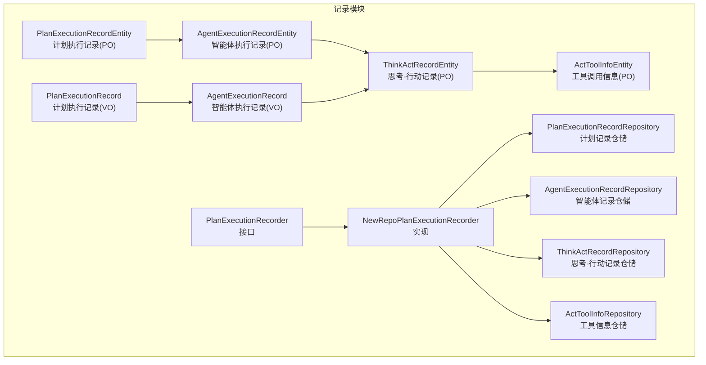
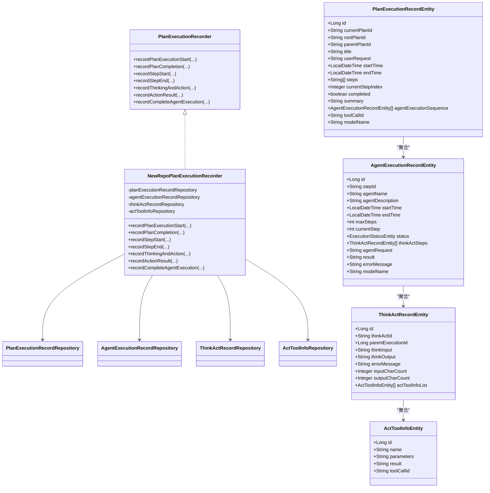
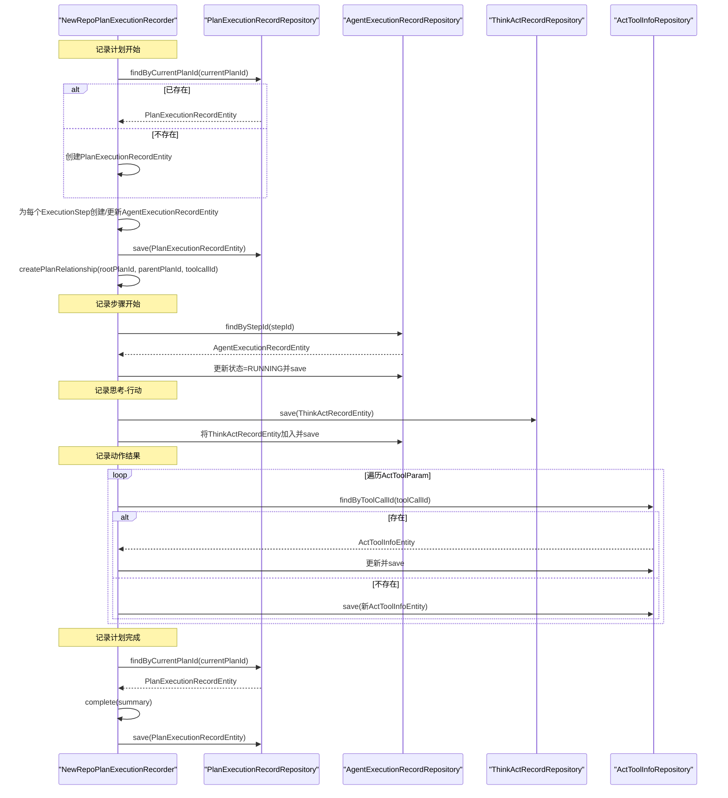
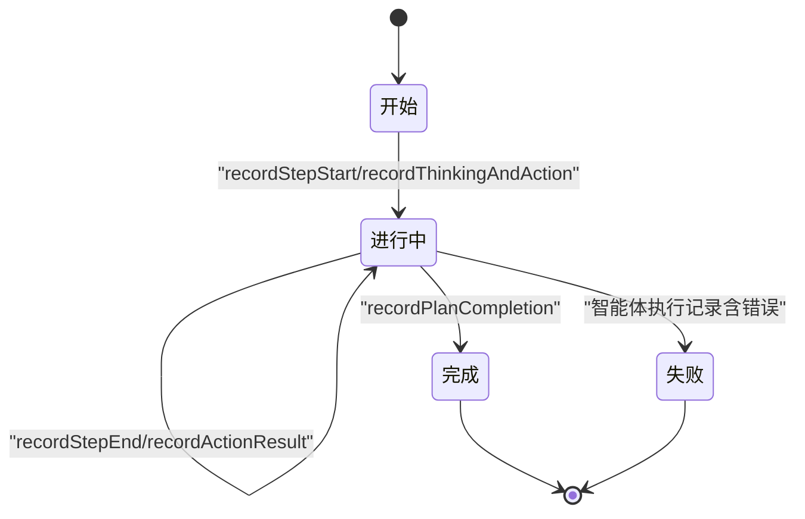
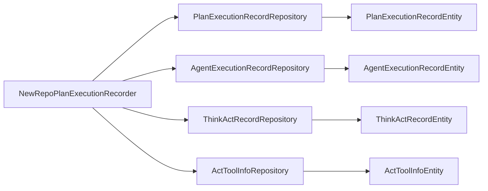

# 计划执行记录

<cite>
**本文引用的文件**
- [PlanExecutionRecordEntity.java](file://src/main/java/com/alibaba/cloud/ai/lynxe/recorder/entity/po/PlanExecutionRecordEntity.java)
- [PlanExecutionRecord.java](file://src/main/java/com/alibaba/cloud/ai/lynxe/recorder/entity/vo/PlanExecutionRecord.java)
- [PlanExecutionRecordRepository.java](file://src/main/java/com/alibaba/cloud/ai/lynxe/recorder/repository/PlanExecutionRecordRepository.java)
- [PlanExecutionRecorder.java](file://src/main/java/com/alibaba/cloud/ai/lynxe/recorder/service/PlanExecutionRecorder.java)
- [NewRepoPlanExecutionRecorder.java](file://src/main/java/com/alibaba/cloud/ai/lynxe/recorder/service/NewRepoPlanExecutionRecorder.java)
- [AgentExecutionRecordEntity.java](file://src/main/java/com/alibaba/cloud/ai/lynxe/recorder/entity/po/AgentExecutionRecordEntity.java)
- [ThinkActRecordEntity.java](file://src/main/java/com/alibaba/cloud/ai/lynxe/recorder/entity/po/ThinkActRecordEntity.java)
- [ActToolInfoEntity.java](file://src/main/java/com/alibaba/cloud/ai/lynxe/recorder/entity/po/ActToolInfoEntity.java)
- [AgentExecutionRecord.java](file://src/main/java/com/alibaba/cloud/ai/lynxe/recorder/entity/vo/AgentExecutionRecord.java)
</cite>

## 目录
1. [简介](#简介)
2. [项目结构](#项目结构)
3. [核心组件](#核心组件)
4. [架构总览](#架构总览)
5. [详细组件分析](#详细组件分析)
6. [依赖关系分析](#依赖关系分析)
7. [性能考量](#性能考量)
8. [故障排查指南](#故障排查指南)
9. [结论](#结论)
10. [附录](#附录)

## 简介
本文件面向Lynxe计划执行记录模块，系统化阐述其设计架构、存储策略、实体字段与业务含义、核心方法实现与调用时机、生命周期管理、查询与分页能力、以及与执行上下文和执行步骤的关系映射。同时给出监控面板展示与统计分析的落地建议。

## 项目结构
围绕“计划执行记录”主题，相关代码主要位于recorder子包下，采用“持久化对象PO + 视图对象VO + 仓储 + 服务”的分层组织方式：
- 实体层：PlanExecutionRecordEntity（持久化）、AgentExecutionRecordEntity、ThinkActRecordEntity、ActToolInfoEntity
- VO层：PlanExecutionRecord、AgentExecutionRecord
- 仓储层：PlanExecutionRecordRepository、AgentExecutionRecordRepository、ThinkActRecordRepository、ActToolInfoRepository
- 服务层：PlanExecutionRecorder接口、NewRepoPlanExecutionRecorder实现

图表来源
- [PlanExecutionRecordEntity.java:42-100](file://src/main/java/com/alibaba/cloud/ai/lynxe/recorder/entity/po/PlanExecutionRecordEntity.java#L42-L100)
- [AgentExecutionRecordEntity.java:61-106](file://src/main/java/com/alibaba/cloud/ai/lynxe/recorder/entity/po/AgentExecutionRecordEntity.java#L61-L106)
- [ThinkActRecordEntity.java:53-94](file://src/main/java/com/alibaba/cloud/ai/lynxe/recorder/entity/po/ThinkActRecordEntity.java#L53-L94)
- [ActToolInfoEntity.java:27-50](file://src/main/java/com/alibaba/cloud/ai/lynxe/recorder/entity/po/ActToolInfoEntity.java#L27-L50)
- [PlanExecutionRecord.java:46-95](file://src/main/java/com/alibaba/cloud/ai/lynxe/recorder/entity/vo/PlanExecutionRecord.java#L46-L95)
- [AgentExecutionRecord.java:55-107](file://src/main/java/com/alibaba/cloud/ai/lynxe/recorder/entity/vo/AgentExecutionRecord.java#L55-L107)
- [PlanExecutionRecordRepository.java:26-54](file://src/main/java/com/alibaba/cloud/ai/lynxe/recorder/repository/PlanExecutionRecordRepository.java#L26-L54)
- [PlanExecutionRecorder.java:26-107](file://src/main/java/com/alibaba/cloud/ai/lynxe/recorder/service/PlanExecutionRecorder.java#L26-L107)
- [NewRepoPlanExecutionRecorder.java:48-62](file://src/main/java/com/alibaba/cloud/ai/lynxe/recorder/service/NewRepoPlanExecutionRecorder.java#L48-L62)

章节来源
- [PlanExecutionRecordEntity.java:25-44](file://src/main/java/com/alibaba/cloud/ai/lynxe/recorder/entity/po/PlanExecutionRecordEntity.java#L25-L44)
- [PlanExecutionRecordRepository.java:26-54](file://src/main/java/com/alibaba/cloud/ai/lynxe/recorder/repository/PlanExecutionRecordRepository.java#L26-L54)

## 核心组件
- 计划执行记录实体（PO）：PlanExecutionRecordEntity，承载计划级元数据、步骤列表、执行序列、摘要与层级关系等。
- 计划执行记录视图（VO）：PlanExecutionRecord，用于前端展示与动态计算当前步骤索引。
- 智能体执行记录（PO）：AgentExecutionRecordEntity，记录单步智能体的思考-行动过程与结果。
- 思考-行动记录（PO）：ThinkActRecordEntity，记录单次思考与一次或多次工具调用。
- 工具调用信息（PO）：ActToolInfoEntity，记录工具名称、参数、结果与调用标识。
- 仓储接口：PlanExecutionRecordRepository等，提供按计划ID、父子层级等维度的查询与删除能力。
- 服务接口与实现：PlanExecutionRecorder定义统一的记录契约；NewRepoPlanExecutionRecorder提供完整事务性实现。

章节来源
- [PlanExecutionRecordEntity.java:42-100](file://src/main/java/com/alibaba/cloud/ai/lynxe/recorder/entity/po/PlanExecutionRecordEntity.java#L42-L100)
- [PlanExecutionRecord.java:46-95](file://src/main/java/com/alibaba/cloud/ai/lynxe/recorder/entity/vo/PlanExecutionRecord.java#L46-L95)
- [AgentExecutionRecordEntity.java:61-106](file://src/main/java/com/alibaba/cloud/ai/lynxe/recorder/entity/po/AgentExecutionRecordEntity.java#L61-L106)
- [ThinkActRecordEntity.java:53-94](file://src/main/java/com/alibaba/cloud/ai/lynxe/recorder/entity/po/ThinkActRecordEntity.java#L53-L94)
- [ActToolInfoEntity.java:27-50](file://src/main/java/com/alibaba/cloud/ai/lynxe/recorder/entity/po/ActToolInfoEntity.java#L27-L50)
- [PlanExecutionRecordRepository.java:26-54](file://src/main/java/com/alibaba/cloud/ai/lynxe/recorder/repository/PlanExecutionRecordRepository.java#L26-L54)
- [PlanExecutionRecorder.java:26-107](file://src/main/java/com/alibaba/cloud/ai/lynxe/recorder/service/PlanExecutionRecorder.java#L26-L107)
- [NewRepoPlanExecutionRecorder.java:48-62](file://src/main/java/com/alibaba/cloud/ai/lynxe/recorder/service/NewRepoPlanExecutionRecorder.java#L48-L62)

## 架构总览
计划执行记录模块遵循“接口-实现-仓储-实体”的分层架构，通过服务层协调多个实体之间的关系，确保事务一致性与可追踪性。

图表来源
- [PlanExecutionRecorder.java:26-107](file://src/main/java/com/alibaba/cloud/ai/lynxe/recorder/service/PlanExecutionRecorder.java#L26-L107)
- [NewRepoPlanExecutionRecorder.java:48-62](file://src/main/java/com/alibaba/cloud/ai/lynxe/recorder/service/NewRepoPlanExecutionRecorder.java#L48-L62)
- [PlanExecutionRecordEntity.java:42-100](file://src/main/java/com/alibaba/cloud/ai/lynxe/recorder/entity/po/PlanExecutionRecordEntity.java#L42-L100)
- [AgentExecutionRecordEntity.java:61-106](file://src/main/java/com/alibaba/cloud/ai/lynxe/recorder/entity/po/AgentExecutionRecordEntity.java#L61-L106)
- [ThinkActRecordEntity.java:53-94](file://src/main/java/com/alibaba/cloud/ai/lynxe/recorder/entity/po/ThinkActRecordEntity.java#L53-L94)
- [ActToolInfoEntity.java:27-50](file://src/main/java/com/alibaba/cloud/ai/lynxe/recorder/entity/po/ActToolInfoEntity.java#L27-L50)

## 详细组件分析

### PlanExecutionRecordEntity（计划执行记录实体）
- 职责：持久化存储计划执行的全量信息，支持层级关系（根计划、父计划、触发工具调用ID），维护步骤列表与当前步骤索引，记录完成态与摘要。
- 关键字段与业务含义
  - 基础信息：id、currentPlanId（唯一标识）、title、userRequest、startTime、endTime、modelName
  - 层级关系：rootPlanId（根计划ID）、parentPlanId（父计划ID）、toolCallId（触发该子计划的工具调用ID）
  - 执行结构：steps（步骤文本列表）、currentStepIndex（当前步骤索引）
  - 执行数据：agentExecutionSequence（智能体执行序列）
  - 执行结果：completed、summary
- 数据类型与约束
  - 时间字段：LocalDateTime
  - 步骤列表：List<String>，使用独立表存储
  - 聚合关系：一对多关联到AgentExecutionRecordEntity
  - 唯一性：currentPlanId唯一
- 方法要点
  - addStep/addAgentExecutionRecord：追加步骤与智能体执行记录
  - complete(summary)：设置结束时间、完成标志与摘要

章节来源
- [PlanExecutionRecordEntity.java:42-100](file://src/main/java/com/alibaba/cloud/ai/lynxe/recorder/entity/po/PlanExecutionRecordEntity.java#L42-L100)
- [PlanExecutionRecordEntity.java:135-166](file://src/main/java/com/alibaba/cloud/ai/lynxe/recorder/entity/po/PlanExecutionRecordEntity.java#L135-L166)

### PlanExecutionRecord（计划执行记录视图）
- 职责：面向前端展示与动态计算当前步骤索引，提供生成唯一ID、添加智能体执行记录、更新当前步骤索引等能力。
- 关键字段与业务含义
  - 基础信息：id、currentPlanId、title、userRequest、startTime、endTime、modelName
  - 层级关系：rootPlanId、parentPlanId、toolCallId
  - 执行数据：agentExecutionSequence、userInputWaitState、parentActToolCall、structureResult
  - 执行结果：completed、summary、currentStepIndex
- 动态逻辑
  - updateCurrentStepIndex：根据智能体执行序列的状态与完成情况动态推导当前步骤索引
  - complete(summary)：设置结束时间、完成标志与摘要，并同步更新当前步骤索引

章节来源
- [PlanExecutionRecord.java:46-95](file://src/main/java/com/alibaba/cloud/ai/lynxe/recorder/entity/vo/PlanExecutionRecord.java#L46-L95)
- [PlanExecutionRecord.java:154-186](file://src/main/java/com/alibaba/cloud/ai/lynxe/recorder/entity/vo/PlanExecutionRecord.java#L154-L186)
- [PlanExecutionRecord.java:142-148](file://src/main/java/com/alibaba/cloud/ai/lynxe/recorder/entity/vo/PlanExecutionRecord.java#L142-L148)

### AgentExecutionRecordEntity（智能体执行记录实体）
- 职责：记录单步智能体的执行状态、思考-行动步骤、请求内容、结果与错误信息。
- 关键字段
  - 基础信息：id、stepId（唯一）、agentName、agentDescription、modelName
  - 时间信息：startTime、endTime
  - 执行控制：maxSteps、currentStep、status（枚举）
  - 执行数据：thinkActSteps（思考-行动步骤列表）、agentRequest
  - 结果信息：result、errorMessage

章节来源
- [AgentExecutionRecordEntity.java:61-106](file://src/main/java/com/alibaba/cloud/ai/lynxe/recorder/entity/po/AgentExecutionRecordEntity.java#L61-L106)
- [AgentExecutionRecordEntity.java:144-150](file://src/main/java/com/alibaba/cloud/ai/lynxe/recorder/entity/po/AgentExecutionRecordEntity.java#L144-L150)

### ThinkActRecordEntity（思考-行动记录实体）
- 职责：记录单次思考与行动阶段的信息，包括思考输入输出、字符计数、错误信息，以及工具调用列表。
- 关键字段
  - 基础信息：id、thinkActId、parentExecutionId
  - 思考阶段：thinkInput、thinkOutput、errorMessage、inputCharCount、outputCharCount
  - 行动阶段：actToolInfoList（工具调用信息列表）

章节来源
- [ThinkActRecordEntity.java:53-94](file://src/main/java/com/alibaba/cloud/ai/lynxe/recorder/entity/po/ThinkActRecordEntity.java#L53-L94)

### ActToolInfoEntity（工具调用信息实体）
- 职责：记录工具名称、参数、执行结果与工具调用ID。
- 关键字段
  - name、parameters、result、toolCallId

章节来源
- [ActToolInfoEntity.java:27-50](file://src/main/java/com/alibaba/cloud/ai/lynxe/recorder/entity/po/ActToolInfoEntity.java#L27-L50)

### PlanExecutionRecordRepository（计划执行记录仓储）
- 职责：提供基于JPA的查询与操作能力，支持按currentPlanId、parentPlanId、rootPlanId查询与删除。
- 关键方法
  - findByCurrentPlanId、findByParentPlanId、findByRootPlanId
  - existsByCurrentPlanId、deleteByCurrentPlanId

章节来源
- [PlanExecutionRecordRepository.java:26-54](file://src/main/java/com/alibaba/cloud/ai/lynxe/recorder/repository/PlanExecutionRecordRepository.java#L26-L54)

### PlanExecutionRecorder接口与NewRepoPlanExecutionRecorder实现
- 接口职责：定义计划执行记录的统一入口，包括计划开始、完成、步骤开始/结束、思考-行动记录、动作结果记录、完整智能体执行记录等。
- 实现要点
  - recordPlanExecutionStart：创建或更新计划记录，填充步骤与层级关系，事务性保存
  - recordStepStart/recordStepEnd：更新智能体执行记录状态与时间
  - recordThinkingAndAction：创建思考-行动记录并挂载到智能体执行记录
  - recordActionResult：按toolCallId更新工具调用信息
  - recordCompleteAgentExecution：汇总智能体执行最终状态与结果
  - recordPlanCompletion：标记计划完成并写入摘要
  - createPlanRelationship：校验并建立父子/根计划层级关系

图表来源
- [PlanExecutionRecorder.java:26-107](file://src/main/java/com/alibaba/cloud/ai/lynxe/recorder/service/PlanExecutionRecorder.java#L26-L107)
- [NewRepoPlanExecutionRecorder.java:75-156](file://src/main/java/com/alibaba/cloud/ai/lynxe/recorder/service/NewRepoPlanExecutionRecorder.java#L75-L156)
- [NewRepoPlanExecutionRecorder.java:293-386](file://src/main/java/com/alibaba/cloud/ai/lynxe/recorder/service/NewRepoPlanExecutionRecorder.java#L293-L386)
- [NewRepoPlanExecutionRecorder.java:390-450](file://src/main/java/com/alibaba/cloud/ai/lynxe/recorder/service/NewRepoPlanExecutionRecorder.java#L390-L450)
- [NewRepoPlanExecutionRecorder.java:453-520](file://src/main/java/com/alibaba/cloud/ai/lynxe/recorder/service/NewRepoPlanExecutionRecorder.java#L453-L520)
- [NewRepoPlanExecutionRecorder.java:607-645](file://src/main/java/com/alibaba/cloud/ai/lynxe/recorder/service/NewRepoPlanExecutionRecorder.java#L607-L645)

章节来源
- [PlanExecutionRecorder.java:26-107](file://src/main/java/com/alibaba/cloud/ai/lynxe/recorder/service/PlanExecutionRecorder.java#L26-L107)
- [NewRepoPlanExecutionRecorder.java:75-156](file://src/main/java/com/alibaba/cloud/ai/lynxe/recorder/service/NewRepoPlanExecutionRecorder.java#L75-L156)
- [NewRepoPlanExecutionRecorder.java:293-386](file://src/main/java/com/alibaba/cloud/ai/lynxe/recorder/service/NewRepoPlanExecutionRecorder.java#L293-L386)
- [NewRepoPlanExecutionRecorder.java:390-450](file://src/main/java/com/alibaba/cloud/ai/lynxe/recorder/service/NewRepoPlanExecutionRecorder.java#L390-L450)
- [NewRepoPlanExecutionRecorder.java:453-520](file://src/main/java/com/alibaba/cloud/ai/lynxe/recorder/service/NewRepoPlanExecutionRecorder.java#L453-L520)
- [NewRepoPlanExecutionRecorder.java:607-645](file://src/main/java/com/alibaba/cloud/ai/lynxe/recorder/service/NewRepoPlanExecutionRecorder.java#L607-L645)

### 计划执行生命周期管理
- 状态模型
  - 开始：recordPlanExecutionStart创建并保存计划记录，设置开始时间
  - 进行中：recordStepStart/recordStepEnd更新智能体执行记录状态为RUNNING/FINISHED；recordThinkingAndAction/recordActionResult持续补充思考-行动与工具调用信息
  - 完成：recordPlanCompletion标记完成、设置结束时间与摘要
  - 失败：通过智能体执行记录的errorMessage与状态FINISHED体现
- 当前步骤索引
  - PlanExecutionRecord的updateCurrentStepIndex会根据智能体执行序列状态动态推导当前步骤索引，优先返回正在运行的步骤，否则返回首个未完成步骤，最后在完成时指向最后一个步骤

图表来源
- [PlanExecutionRecorder.java:26-107](file://src/main/java/com/alibaba/cloud/ai/lynxe/recorder/service/PlanExecutionRecorder.java#L26-L107)
- [PlanExecutionRecord.java:154-186](file://src/main/java/com/alibaba/cloud/ai/lynxe/recorder/entity/vo/PlanExecutionRecord.java#L154-L186)
- [NewRepoPlanExecutionRecorder.java:293-386](file://src/main/java/com/alibaba/cloud/ai/lynxe/recorder/service/NewRepoPlanExecutionRecorder.java#L293-L386)
- [NewRepoPlanExecutionRecorder.java:607-645](file://src/main/java/com/alibaba/cloud/ai/lynxe/recorder/service/NewRepoPlanExecutionRecorder.java#L607-L645)

章节来源
- [PlanExecutionRecord.java:154-186](file://src/main/java/com/alibaba/cloud/ai/lynxe/recorder/entity/vo/PlanExecutionRecord.java#L154-L186)
- [NewRepoPlanExecutionRecorder.java:293-386](file://src/main/java/com/alibaba/cloud/ai/lynxe/recorder/service/NewRepoPlanExecutionRecorder.java#L293-L386)
- [NewRepoPlanExecutionRecorder.java:607-645](file://src/main/java/com/alibaba/cloud/ai/lynxe/recorder/service/NewRepoPlanExecutionRecorder.java#L607-L645)

### 查询接口、分页查询与条件过滤
- 查询能力
  - 按currentPlanId查询：PlanExecutionRecordRepository.findByCurrentPlanId
  - 按parentPlanId查询：PlanExecutionRecordRepository.findByParentPlanId
  - 按rootPlanId查询：PlanExecutionRecordRepository.findByRootPlanId
  - 存在性检查：existsByCurrentPlanId
  - 删除：deleteByCurrentPlanId
- 分页与排序
  - 可直接复用JPA分页能力（Pageable）在上层控制器或服务中扩展
- 条件过滤
  - 可在上层组合上述查询方法实现复合过滤（如按时间范围、状态、模型名等）

章节来源
- [PlanExecutionRecordRepository.java:26-54](file://src/main/java/com/alibaba/cloud/ai/lynxe/recorder/repository/PlanExecutionRecordRepository.java#L26-L54)

### 与执行上下文、执行步骤的关系映射
- 执行上下文
  - PlanExecutionRecordEntity聚合AgentExecutionRecordEntity，形成“计划-步骤-思考-行动-工具调用”的完整链路
  - ThinkActRecordEntity通过parentExecutionId回指AgentExecutionRecordEntity，ActToolInfoEntity通过工具调用ID回指具体动作
- 执行步骤
  - ExecutionStep在服务层被转换为AgentExecutionRecordEntity，其中stepId作为唯一键，贯穿后续所有记录
  - recordStepStart/recordStepEnd通过stepId定位并更新状态与时间

章节来源
- [PlanExecutionRecordEntity.java:98-100](file://src/main/java/com/alibaba/cloud/ai/lynxe/recorder/entity/po/PlanExecutionRecordEntity.java#L98-L100)
- [AgentExecutionRecordEntity.java:104-106](file://src/main/java/com/alibaba/cloud/ai/lynxe/recorder/entity/po/AgentExecutionRecordEntity.java#L104-L106)
- [ThinkActRecordEntity.java:67-68](file://src/main/java/com/alibaba/cloud/ai/lynxe/recorder/entity/po/ThinkActRecordEntity.java#L67-L68)
- [NewRepoPlanExecutionRecorder.java:293-386](file://src/main/java/com/alibaba/cloud/ai/lynxe/recorder/service/NewRepoPlanExecutionRecorder.java#L293-L386)

### 监控面板展示与统计分析
- 展示逻辑建议
  - 计划概览：按rootPlanId聚合，展示标题、开始/结束时间、完成状态、摘要
  - 步骤详情：按currentPlanId查询，结合PlanExecutionRecord的currentStepIndex与AgentExecutionRecord的thinkActSteps展示当前执行点
  - 错误追踪：通过errorMessage与状态FINISHED定位失败步骤
- 统计分析建议
  - 平均执行时长：(endTime - startTime)按计划维度统计
  - 步骤成功率：thinkActSteps中FINISHED占比
  - 工具调用频次与耗时：按工具名统计调用次数与平均响应时间（若记录输入/输出字符数）
  - 失败率与失败原因分布：按errorMessage关键词聚类

[本节为概念性说明，不直接分析具体文件]

## 依赖关系分析
- 组件耦合
  - NewRepoPlanExecutionRecorder对多个仓储有强依赖，保证事务边界内的一致性
  - 实体间通过外键与聚合关系解耦，便于独立扩展
- 外部依赖
  - JPA/Hibernate：实体注解与关系映射
  - Spring Data JPA：仓储接口自动生成SQL
  - 日志框架：SLF4J用于记录关键事件与异常

图表来源
- [NewRepoPlanExecutionRecorder.java:50-61](file://src/main/java/com/alibaba/cloud/ai/lynxe/recorder/service/NewRepoPlanExecutionRecorder.java#L50-L61)
- [PlanExecutionRecordRepository.java:26-27](file://src/main/java/com/alibaba/cloud/ai/lynxe/recorder/repository/PlanExecutionRecordRepository.java#L26-L27)
- [AgentExecutionRecordEntity.java:61-106](file://src/main/java/com/alibaba/cloud/ai/lynxe/recorder/entity/po/AgentExecutionRecordEntity.java#L61-L106)
- [ThinkActRecordEntity.java:53-94](file://src/main/java/com/alibaba/cloud/ai/lynxe/recorder/entity/po/ThinkActRecordEntity.java#L53-L94)
- [ActToolInfoEntity.java:27-50](file://src/main/java/com/alibaba/cloud/ai/lynxe/recorder/entity/po/ActToolInfoEntity.java#L27-L50)

章节来源
- [NewRepoPlanExecutionRecorder.java:50-61](file://src/main/java/com/alibaba/cloud/ai/lynxe/recorder/service/NewRepoPlanExecutionRecorder.java#L50-L61)
- [PlanExecutionRecordRepository.java:26-27](file://src/main/java/com/alibaba/cloud/ai/lynxe/recorder/repository/PlanExecutionRecordRepository.java#L26-L27)

## 性能考量
- 事务边界
  - 计划开始与层级关系创建采用@Transactional，避免部分更新导致的数据不一致
- 查询优化
  - 使用JPA仓储的按主键/唯一键查询，减少复杂JOIN
  - 对高频查询（如按currentPlanId）可考虑缓存最近活跃计划
- 写入优化
  - 批量工具调用结果更新时，先查后改，避免重复插入
- 字段长度
  - LONGTEXT字段用于大文本（如用户请求、摘要、思考输出等），注意数据库索引策略与查询性能平衡

[本节提供通用指导，不直接分析具体文件]

## 故障排查指南
- 常见问题
  - 记录缺失：确认recordPlanExecutionStart是否正确传入currentPlanId与executionSteps
  - 状态异常：检查recordStepStart/recordStepEnd是否按顺序调用，stepId是否匹配
  - 层级关系异常：createPlanRelationship对parentPlanId、rootPlanId、toolcallId有严格校验，需确保三者一致性
  - 工具调用结果未更新：核对toolCallId是否一致且非空
- 日志定位
  - NewRepoPlanExecutionRecorder使用SLF4J记录关键流程与异常，可通过日志级别快速定位问题

章节来源
- [NewRepoPlanExecutionRecorder.java:75-156](file://src/main/java/com/alibaba/cloud/ai/lynxe/recorder/service/NewRepoPlanExecutionRecorder.java#L75-L156)
- [NewRepoPlanExecutionRecorder.java:293-386](file://src/main/java/com/alibaba/cloud/ai/lynxe/recorder/service/NewRepoPlanExecutionRecorder.java#L293-L386)
- [NewRepoPlanExecutionRecorder.java:390-450](file://src/main/java/com/alibaba/cloud/ai/lynxe/recorder/service/NewRepoPlanExecutionRecorder.java#L390-L450)
- [NewRepoPlanExecutionRecorder.java:453-520](file://src/main/java/com/alibaba/cloud/ai/lynxe/recorder/service/NewRepoPlanExecutionRecorder.java#L453-L520)
- [NewRepoPlanExecutionRecorder.java:607-645](file://src/main/java/com/alibaba/cloud/ai/lynxe/recorder/service/NewRepoPlanExecutionRecorder.java#L607-L645)
- [NewRepoPlanExecutionRecorder.java:782-854](file://src/main/java/com/alibaba/cloud/ai/lynxe/recorder/service/NewRepoPlanExecutionRecorder.java#L782-L854)

## 结论
计划执行记录模块以清晰的分层与实体聚合实现了从计划到步骤、从思考到行动、从工具调用到结果汇总的全链路追踪。通过统一的服务接口与严格的事务控制，确保了数据一致性与可观测性。配合仓储提供的查询能力与前端展示逻辑，可有效支撑监控面板与统计分析需求。

## 附录
- 关键调用时机建议
  - 计划开始：在规划流程启动时调用recordPlanExecutionStart
  - 步骤开始/结束：在每一步智能体执行前后分别调用recordStepStart与recordStepEnd
  - 思考-行动：在智能体思考阶段调用recordThinkingAndAction，在行动后调用recordActionResult
  - 计划完成：在流程结束时调用recordPlanCompletion
- 扩展建议
  - 引入审计日志与变更追踪
  - 增加指标埋点（执行时长、步骤数、工具调用次数等）
  - 提供批量查询与导出能力

[本节为概念性说明，不直接分析具体文件]