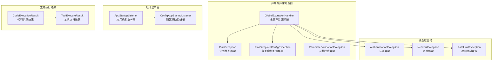
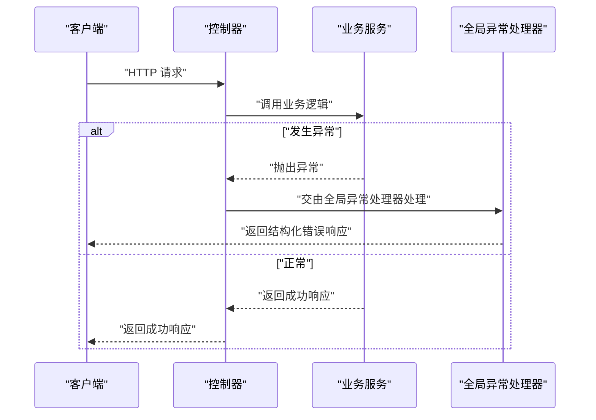
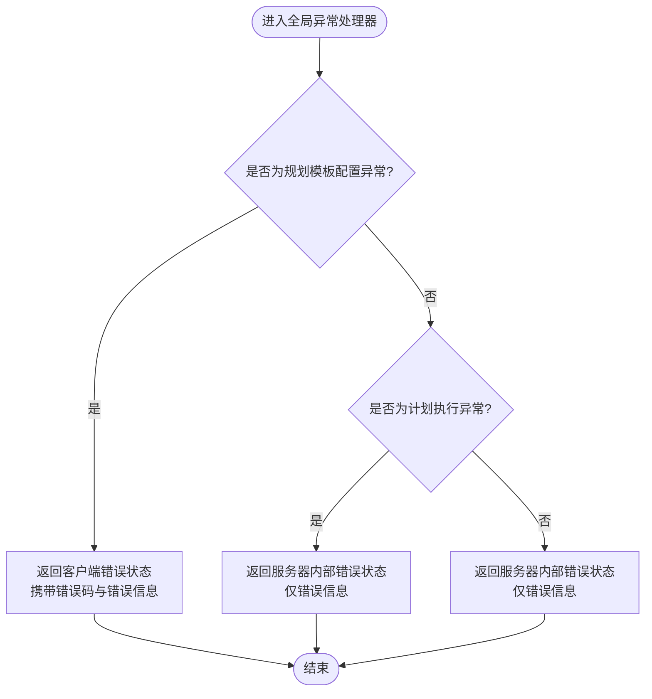
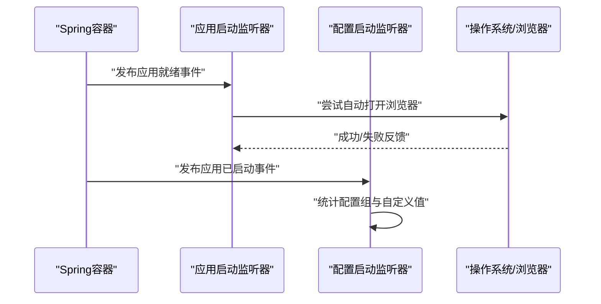
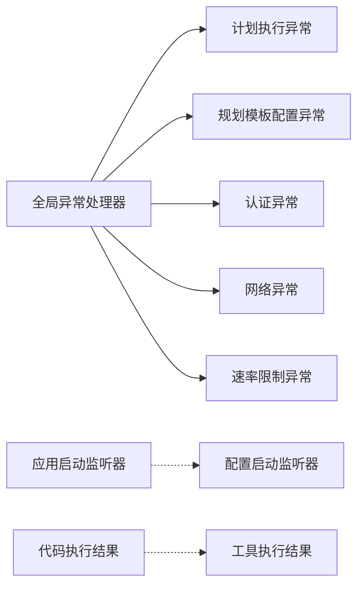

# 常见问题诊断

<cite>
**本文引用的文件**
- [GlobalExceptionHandler.java](file://src/main/java/com/alibaba/cloud/ai/lynxe/exception/handler/GlobalExceptionHandler.java)
- [PlanException.java](file://src/main/java/com/alibaba/cloud/ai/lynxe/exception/PlanException.java)
- [PlanTemplateConfigException.java](file://src/main/java/com/alibaba/cloud/ai/lynxe/planning/exception/PlanTemplateConfigException.java)
- [ParameterValidationException.java](file://src/main/java/com/alibaba/cloud/ai/lynxe/planning/exception/ParameterValidationException.java)
- [AuthenticationException.java](file://src/main/java/com/alibaba/cloud/ai/lynxe/model/exception/AuthenticationException.java)
- [NetworkException.java](file://src/main/java/com/alibaba/cloud/ai/lynxe/model/exception/NetworkException.java)
- [RateLimitException.java](file://src/main/java/com/alibaba/cloud/ai/lynxe/model/exception/RateLimitException.java)
- [AppStartupListener.java](file://src/main/java/com/alibaba/cloud/ai/lynxe/config/startUp/AppStartupListener.java)
- [ConfigAppStartupListener.java](file://src/main/java/com/alibaba/cloud/ai/lynxe/config/startUp/ConfigAppStartupListener.java)
- [CodeExecutionResult.java](file://src/main/java/com/alibaba/cloud/ai/lynxe/tool/code/CodeExecutionResult.java)
- [ToolExecuteResult.java](file://src/main/java/com/alibaba/cloud/ai/lynxe/tool/code/ToolExecuteResult.java)
</cite>

## 目录
1. [简介](#简介)
2. [项目结构](#项目结构)
3. [核心组件](#核心组件)
4. [架构总览](#架构总览)
5. [详细组件分析](#详细组件分析)
6. [依赖分析](#依赖分析)
7. [性能考虑](#性能考虑)
8. [故障排除指南](#故障排除指南)
9. [结论](#结论)
10. [附录](#附录)

## 简介
本文件面向Lynxe系统的运维与开发人员，提供一套系统化的“常见问题诊断”文档。内容覆盖运行时错误、配置错误、权限错误、认证失败、网络连接超时、速率限制等典型场景，解释全局异常处理器的工作原理与异常分类机制，并给出错误消息解读、异常堆栈分析思路、快速修复方案、问题自检清单、常见症状对照表以及预防措施建议。

## 项目结构
围绕异常处理与运行时诊断相关的关键模块如下：
- 异常与异常处理器：全局异常处理器、计划执行异常、规划模板配置异常、参数校验异常
- 模型层异常：认证异常、网络异常、速率限制异常
- 启动监听器：应用启动自动打开浏览器、配置初始化状态监听
- 工具执行结果模型：代码执行结果、工具执行结果

**图表来源**
- [GlobalExceptionHandler.java:32-66](file://src/main/java/com/alibaba/cloud/ai/lynxe/exception/handler/GlobalExceptionHandler.java#L32-L66)
- [PlanException.java:23-43](file://src/main/java/com/alibaba/cloud/ai/lynxe/exception/PlanException.java#L23-L43)
- [PlanTemplateConfigException.java:22-59](file://src/main/java/com/alibaba/cloud/ai/lynxe/planning/exception/PlanTemplateConfigException.java#L22-L59)
- [ParameterValidationException.java:23-43](file://src/main/java/com/alibaba/cloud/ai/lynxe/planning/exception/ParameterValidationException.java#L23-L43)
- [AuthenticationException.java:21-31](file://src/main/java/com/alibaba/cloud/ai/lynxe/model/exception/AuthenticationException.java#L21-L31)
- [NetworkException.java:21-31](file://src/main/java/com/alibaba/cloud/ai/lynxe/model/exception/NetworkException.java#L21-L31)
- [RateLimitException.java:21-31](file://src/main/java/com/alibaba/cloud/ai/lynxe/model/exception/RateLimitException.java#L21-L31)
- [AppStartupListener.java:32-111](file://src/main/java/com/alibaba/cloud/ai/lynxe/config/startUp/AppStartupListener.java#L32-L111)
- [ConfigAppStartupListener.java:33-83](file://src/main/java/com/alibaba/cloud/ai/lynxe/config/startUp/ConfigAppStartupListener.java#L33-L83)
- [CodeExecutionResult.java:18-50](file://src/main/java/com/alibaba/cloud/ai/lynxe/tool/code/CodeExecutionResult.java#L18-L50)
- [ToolExecuteResult.java:18-59](file://src/main/java/com/alibaba/cloud/ai/lynxe/tool/code/ToolExecuteResult.java#L18-L59)

**章节来源**
- [GlobalExceptionHandler.java:32-66](file://src/main/java/com/alibaba/cloud/ai/lynxe/exception/handler/GlobalExceptionHandler.java#L32-L66)
- [AppStartupListener.java:32-111](file://src/main/java/com/alibaba/cloud/ai/lynxe/config/startUp/AppStartupListener.java#L32-L111)
- [ConfigAppStartupListener.java:33-83](file://src/main/java/com/alibaba/cloud/ai/lynxe/config/startUp/ConfigAppStartupListener.java#L33-L83)
- [CodeExecutionResult.java:18-50](file://src/main/java/com/alibaba/cloud/ai/lynxe/tool/code/CodeExecutionResult.java#L18-L50)
- [ToolExecuteResult.java:18-59](file://src/main/java/com/alibaba/cloud/ai/lynxe/tool/code/ToolExecuteResult.java#L18-L59)

## 核心组件
- 全局异常处理器：统一捕获未处理异常，按异常类型返回结构化错误响应；对特定异常（如计划模板配置异常）附加错误码字段。
- 计划执行异常：用于执行阶段的非预期错误封装，便于上层统一处理。
- 规划模板配置异常：带错误码的配置类异常，便于前端或调用方根据错误码进行差异化处理。
- 参数校验异常：用于规划模板参数校验失败场景，便于定位缺失或不兼容参数。
- 模型层异常：认证异常、网络异常、速率限制异常，分别对应鉴权失败、网络不可达/超时、服务端限流等典型错误。
- 启动监听器：应用启动后尝试自动打开浏览器访问UI；记录配置系统初始化状态。
- 工具执行结果：封装工具执行输出、中断状态与可选图像结果，辅助定位工具执行失败原因。

**章节来源**
- [GlobalExceptionHandler.java:38-66](file://src/main/java/com/alibaba/cloud/ai/lynxe/exception/handler/GlobalExceptionHandler.java#L38-L66)
- [PlanException.java:23-43](file://src/main/java/com/alibaba/cloud/ai/lynxe/exception/PlanException.java#L23-L43)
- [PlanTemplateConfigException.java:22-59](file://src/main/java/com/alibaba/cloud/ai/lynxe/planning/exception/PlanTemplateConfigException.java#L22-L59)
- [ParameterValidationException.java:23-43](file://src/main/java/com/alibaba/cloud/ai/lynxe/planning/exception/ParameterValidationException.java#L23-L43)
- [AuthenticationException.java:21-31](file://src/main/java/com/alibaba/cloud/ai/lynxe/model/exception/AuthenticationException.java#L21-L31)
- [NetworkException.java:21-31](file://src/main/java/com/alibaba/cloud/ai/lynxe/model/exception/NetworkException.java#L21-L31)
- [RateLimitException.java:21-31](file://src/main/java/com/alibaba/cloud/ai/lynxe/model/exception/RateLimitException.java#L21-L31)
- [AppStartupListener.java:46-109](file://src/main/java/com/alibaba/cloud/ai/lynxe/config/startUp/AppStartupListener.java#L46-L109)
- [ConfigAppStartupListener.java:41-70](file://src/main/java/com/alibaba/cloud/ai/lynxe/config/startUp/ConfigAppStartupListener.java#L41-L70)
- [CodeExecutionResult.java:18-50](file://src/main/java/com/alibaba/cloud/ai/lynxe/tool/code/CodeExecutionResult.java#L18-L50)
- [ToolExecuteResult.java:18-59](file://src/main/java/com/alibaba/cloud/ai/lynxe/tool/code/ToolExecuteResult.java#L18-L59)

## 架构总览
下图展示全局异常处理器在请求生命周期中的作用，以及与各类异常的关系。

**图表来源**
- [GlobalExceptionHandler.java:38-66](file://src/main/java/com/alibaba/cloud/ai/lynxe/exception/handler/GlobalExceptionHandler.java#L38-L66)

## 详细组件分析

### 全局异常处理器
- 职责：统一拦截未处理异常，构造结构化错误响应；对计划模板配置异常附加错误码字段；对计划执行异常返回服务器内部错误状态。
- 处理策略：
  - 计划执行异常：返回服务器内部错误状态与错误信息。
  - 规划模板配置异常：返回客户端错误状态，携带错误码与错误信息。
  - 其他未匹配异常：返回服务器内部错误状态与错误信息。
- 适用范围：所有控制器层未显式捕获的异常均会进入该处理器。

**图表来源**
- [GlobalExceptionHandler.java:38-66](file://src/main/java/com/alibaba/cloud/ai/lynxe/exception/handler/GlobalExceptionHandler.java#L38-L66)

**章节来源**
- [GlobalExceptionHandler.java:38-66](file://src/main/java/com/alibaba/cloud/ai/lynxe/exception/handler/GlobalExceptionHandler.java#L38-L66)

### 计划执行异常
- 定义：封装执行阶段发生的非预期错误，便于统一处理与上报。
- 使用建议：在业务流程中捕获具体子异常后，包装为计划执行异常向上抛出，确保全局异常处理器能正确识别并返回一致的错误格式。

**章节来源**
- [PlanException.java:23-43](file://src/main/java/com/alibaba/cloud/ai/lynxe/exception/PlanException.java#L23-L43)

### 规划模板配置异常
- 定义：配置类异常，携带错误码与错误信息，便于前端或调用方根据错误码进行差异化处理。
- 错误码用途：区分“验证错误”“未找到”“内部错误”等场景，提升可观测性与可诊断性。
- 返回格式：包含错误信息与错误码字段。

**章节来源**
- [PlanTemplateConfigException.java:22-59](file://src/main/java/com/alibaba/cloud/ai/lynxe/planning/exception/PlanTemplateConfigException.java#L22-L59)
- [GlobalExceptionHandler.java:49-55](file://src/main/java/com/alibaba/cloud/ai/lynxe/exception/handler/GlobalExceptionHandler.java#L49-L55)

### 参数校验异常
- 定义：用于规划模板参数校验失败场景，帮助定位缺失或不兼容参数。
- 诊断要点：结合错误信息判断是必填参数缺失、类型不匹配还是取值范围错误。

**章节来源**
- [ParameterValidationException.java:23-43](file://src/main/java/com/alibaba/cloud/ai/lynxe/planning/exception/ParameterValidationException.java#L23-L43)

### 模型层异常
- 认证异常：通常由鉴权失败触发，检查密钥、令牌、权限范围等。
- 网络异常：通常由网络不可达、连接超时、DNS解析失败等引起。
- 速率限制异常：通常由上游服务限流触发，需降低请求频率或等待配额恢复。

**章节来源**
- [AuthenticationException.java:21-31](file://src/main/java/com/alibaba/cloud/ai/lynxe/model/exception/AuthenticationException.java#L21-L31)
- [NetworkException.java:21-31](file://src/main/java/com/alibaba/cloud/ai/lynxe/model/exception/NetworkException.java#L21-L31)
- [RateLimitException.java:21-31](file://src/main/java/com/alibaba/cloud/ai/lynxe/model/exception/RateLimitException.java#L21-L31)

### 启动监听器
- 应用启动监听器：在应用就绪后尝试自动打开浏览器访问UI，若失败则记录警告并提示手动访问。
- 配置启动监听器：记录配置系统初始化状态，统计各配置组数量与自定义值数量，便于诊断配置加载问题。

**图表来源**
- [AppStartupListener.java:46-109](file://src/main/java/com/alibaba/cloud/ai/lynxe/config/startUp/AppStartupListener.java#L46-L109)
- [ConfigAppStartupListener.java:41-70](file://src/main/java/com/alibaba/cloud/ai/lynxe/config/startUp/ConfigAppStartupListener.java#L41-L70)

**章节来源**
- [AppStartupListener.java:46-109](file://src/main/java/com/alibaba/cloud/ai/lynxe/config/startUp/AppStartupListener.java#L46-L109)
- [ConfigAppStartupListener.java:41-70](file://src/main/java/com/alibaba/cloud/ai/lynxe/config/startUp/ConfigAppStartupListener.java#L41-L70)

### 工具执行结果
- 代码执行结果：包含退出码、日志与可选图像结果，便于定位脚本执行失败原因。
- 工具执行结果：包含输出文本与中断标记，便于判断工具执行是否被中断或输出为空。

**章节来源**
- [CodeExecutionResult.java:18-50](file://src/main/java/com/alibaba/cloud/ai/lynxe/tool/code/CodeExecutionResult.java#L18-L50)
- [ToolExecuteResult.java:18-59](file://src/main/java/com/alibaba/cloud/ai/lynxe/tool/code/ToolExecuteResult.java#L18-L59)

## 依赖分析
- 全局异常处理器依赖于各类异常类型以实现差异化处理。
- 启动监听器之间无直接依赖，但共同参与应用生命周期管理。
- 工具执行结果模型独立存在，供工具执行链路使用。

**图表来源**
- [GlobalExceptionHandler.java:38-66](file://src/main/java/com/alibaba/cloud/ai/lynxe/exception/handler/GlobalExceptionHandler.java#L38-L66)
- [PlanException.java:23-43](file://src/main/java/com/alibaba/cloud/ai/lynxe/exception/PlanException.java#L23-L43)
- [PlanTemplateConfigException.java:22-59](file://src/main/java/com/alibaba/cloud/ai/lynxe/planning/exception/PlanTemplateConfigException.java#L22-L59)
- [AuthenticationException.java:21-31](file://src/main/java/com/alibaba/cloud/ai/lynxe/model/exception/AuthenticationException.java#L21-L31)
- [NetworkException.java:21-31](file://src/main/java/com/alibaba/cloud/ai/lynxe/model/exception/NetworkException.java#L21-L31)
- [RateLimitException.java:21-31](file://src/main/java/com/alibaba/cloud/ai/lynxe/model/exception/RateLimitException.java#L21-L31)
- [AppStartupListener.java:32-111](file://src/main/java/com/alibaba/cloud/ai/lynxe/config/startUp/AppStartupListener.java#L32-L111)
- [ConfigAppStartupListener.java:33-83](file://src/main/java/com/alibaba/cloud/ai/lynxe/config/startUp/ConfigAppStartupListener.java#L33-L83)
- [CodeExecutionResult.java:18-50](file://src/main/java/com/alibaba/cloud/ai/lynxe/tool/code/CodeExecutionResult.java#L18-L50)
- [ToolExecuteResult.java:18-59](file://src/main/java/com/alibaba/cloud/ai/lynxe/tool/code/ToolExecuteResult.java#L18-L59)

## 性能考虑
- 异常处理开销：全局异常处理器应避免在异常路径中执行重逻辑，优先返回简洁结构化响应。
- 日志级别：对可预期异常（如参数校验异常）使用较低日志级别，避免噪声；对未捕获异常使用较高日志级别以便快速发现。
- 启动监听器：自动打开浏览器失败时记录警告而非错误，减少噪音并保留可诊断信息。

[本节为通用指导，无需特定文件来源]

## 故障排除指南

### 一、运行时错误
- 症状：接口返回服务器内部错误，响应体包含错误信息。
- 可能原因：业务流程中抛出未捕获异常，或计划执行异常未被显式处理。
- 诊断步骤：
  - 查看全局异常处理器对计划执行异常的处理分支，确认是否返回服务器内部错误状态。
  - 检查最近变更的业务逻辑，定位可能的未捕获异常点。
  - 结合日志定位异常堆栈，确认异常类型与抛出位置。
- 快速修复：
  - 在业务层捕获具体异常并包装为计划执行异常，确保统一处理。
  - 对可预期异常增加显式处理，避免进入全局异常处理器。

**章节来源**
- [GlobalExceptionHandler.java:38-44](file://src/main/java/com/alibaba/cloud/ai/lynxe/exception/handler/GlobalExceptionHandler.java#L38-L44)
- [PlanException.java:23-43](file://src/main/java/com/alibaba/cloud/ai/lynxe/exception/PlanException.java#L23-L43)

### 二、配置错误
- 症状：接口返回客户端错误，响应体包含错误信息与错误码。
- 可能原因：规划模板配置异常，如参数校验失败、配置不存在或内部错误。
- 诊断步骤：
  - 检查全局异常处理器对规划模板配置异常的处理分支，确认返回了错误码与错误信息。
  - 根据错误码区分“验证错误”“未找到”“内部错误”，定位具体配置项。
  - 结合配置启动监听器的日志，确认配置系统初始化状态与自定义值数量。
- 快速修复：
  - 修正配置项值或结构，满足参数校验要求。
  - 如为未找到错误，补充缺失的配置项。
  - 如为内部错误，检查上游依赖与数据库状态。

**章节来源**
- [GlobalExceptionHandler.java:49-55](file://src/main/java/com/alibaba/cloud/ai/lynxe/exception/handler/GlobalExceptionHandler.java#L49-L55)
- [PlanTemplateConfigException.java:22-59](file://src/main/java/com/alibaba/cloud/ai/lynxe/planning/exception/PlanTemplateConfigException.java#L22-L59)
- [ParameterValidationException.java:23-43](file://src/main/java/com/alibaba/cloud/ai/lynxe/planning/exception/ParameterValidationException.java#L23-L43)
- [ConfigAppStartupListener.java:41-70](file://src/main/java/com/alibaba/cloud/ai/lynxe/config/startUp/ConfigAppStartupListener.java#L41-L70)

### 三、权限错误（认证失败）
- 症状：接口返回服务器内部错误或客户端错误，响应体包含错误信息。
- 可能原因：认证异常，通常由鉴权失败触发。
- 诊断步骤：
  - 检查全局异常处理器对认证异常的处理分支，确认返回状态与错误信息。
  - 核对鉴权凭据（如密钥、令牌）、权限范围与过期时间。
  - 检查上游服务的鉴权策略与白名单配置。
- 快速修复：
  - 更新有效的鉴权凭据。
  - 检查权限范围是否覆盖所需资源。
  - 如涉及第三方服务，确认配额与授权状态。

**章节来源**
- [GlobalExceptionHandler.java:38-66](file://src/main/java/com/alibaba/cloud/ai/lynxe/exception/handler/GlobalExceptionHandler.java#L38-L66)
- [AuthenticationException.java:21-31](file://src/main/java/com/alibaba/cloud/ai/lynxe/model/exception/AuthenticationException.java#L21-L31)

### 四、网络连接超时
- 症状：接口报错，响应体包含错误信息；或出现连接超时、DNS解析失败等日志。
- 可能原因：网络异常，通常由网络不可达、连接超时、DNS解析失败等引起。
- 诊断步骤：
  - 检查全局异常处理器对网络异常的处理分支，确认返回状态与错误信息。
  - 使用ping/traceroute/dig等工具验证网络连通性与DNS解析。
  - 检查代理设置、防火墙规则与安全组策略。
- 快速修复：
  - 修复网络路由或DNS配置。
  - 调整超时阈值或重试策略。
  - 配置代理或调整安全策略。

**章节来源**
- [GlobalExceptionHandler.java:38-66](file://src/main/java/com/alibaba/cloud/ai/lynxe/exception/handler/GlobalExceptionHandler.java#L38-L66)
- [NetworkException.java:21-31](file://src/main/java/com/alibaba/cloud/ai/lynxe/model/exception/NetworkException.java#L21-L31)

### 五、速率限制
- 症状：接口返回客户端错误，响应体包含错误信息；或频繁出现“请求过于频繁”的提示。
- 可能原因：速率限制异常，通常由上游服务限流触发。
- 诊断步骤：
  - 检查全局异常处理器对速率限制异常的处理分支，确认返回状态与错误信息。
  - 分析请求频率与配额使用情况，确认是否超过限流阈值。
  - 检查上游服务的限流策略与配额状态。
- 快速修复：
  - 降低请求频率或增加请求间隔。
  - 实现指数退避重试策略。
  - 申请提高配额或使用多实例分摊流量。

**章节来源**
- [GlobalExceptionHandler.java:38-66](file://src/main/java/com/alibaba/cloud/ai/lynxe/exception/handler/GlobalExceptionHandler.java#L38-L66)
- [RateLimitException.java:21-31](file://src/main/java/com/alibaba/cloud/ai/lynxe/model/exception/RateLimitException.java#L21-L31)

### 六、启动与UI访问问题
- 症状：应用启动后无法自动打开浏览器访问UI，或访问UI时出现空白页。
- 可能原因：启动监听器在不同操作系统下的自动打开失败；浏览器命令执行失败。
- 诊断步骤：
  - 检查应用启动监听器的日志，确认自动打开尝试与回退路径。
  - 手动访问本地UI地址，确认端口与静态资源可用性。
  - 检查配置启动监听器的日志，确认配置系统初始化状态。
- 快速修复：
  - 手动打开浏览器访问UI地址。
  - 调整系统默认浏览器或安装常用浏览器。
  - 检查端口占用与防火墙策略。

**章节来源**
- [AppStartupListener.java:46-109](file://src/main/java/com/alibaba/cloud/ai/lynxe/config/startUp/AppStartupListener.java#L46-L109)
- [ConfigAppStartupListener.java:41-70](file://src/main/java/com/alibaba/cloud/ai/lynxe/config/startUp/ConfigAppStartupListener.java#L41-L70)

### 七、工具执行失败
- 症状：工具执行结果为空、被中断或返回非零退出码。
- 可能原因：脚本/命令执行失败、权限不足、资源不可用。
- 诊断步骤：
  - 检查代码执行结果中的退出码与日志，定位执行失败原因。
  - 检查工具执行结果的中断标记，确认是否被外部中断。
  - 核对执行环境、权限与依赖资源。
- 快速修复：
  - 修正脚本语法或命令参数。
  - 提升执行权限或调整资源访问策略。
  - 优化执行环境与依赖安装。

**章节来源**
- [CodeExecutionResult.java:18-50](file://src/main/java/com/alibaba/cloud/ai/lynxe/tool/code/CodeExecutionResult.java#L18-L50)
- [ToolExecuteResult.java:18-59](file://src/main/java/com/alibaba/cloud/ai/lynxe/tool/code/ToolExecuteResult.java#L18-L59)

### 八、错误消息解读与异常堆栈分析
- 错误消息解读：
  - 包含错误信息与错误码的响应：优先依据错误码定位问题类型，再结合错误信息理解具体原因。
  - 仅包含错误信息的响应：结合异常类型与上下文定位问题来源。
- 异常堆栈分析：
  - 从全局异常处理器入口开始，追踪到具体的业务异常类型与抛出位置。
  - 对于计划模板配置异常，关注错误码与配置项名称。
  - 对于认证/网络/速率限制异常，关注上游服务与外部依赖。

**章节来源**
- [GlobalExceptionHandler.java:38-66](file://src/main/java/com/alibaba/cloud/ai/lynxe/exception/handler/GlobalExceptionHandler.java#L38-L66)
- [PlanTemplateConfigException.java:22-59](file://src/main/java/com/alibaba/cloud/ai/lynxe/planning/exception/PlanTemplateConfigException.java#L22-L59)

### 九、问题自检清单
- 运行时错误
  - 是否有未捕获异常导致进入全局异常处理器？
  - 最近是否有业务逻辑变更引入新异常？
- 配置错误
  - 是否存在参数校验失败或配置缺失？
  - 配置系统初始化状态是否正常？
- 权限错误
  - 鉴权凭据是否有效且未过期？
  - 权限范围是否覆盖所需资源？
- 网络错误
  - 网络连通性与DNS解析是否正常？
  - 代理与防火墙策略是否正确？
- 速率限制
  - 请求频率是否超过限流阈值？
  - 是否实现了合理的重试与退避策略？
- 启动与UI
  - 自动打开浏览器是否失败？是否能手动访问UI？
  - 端口占用与静态资源是否可用？
- 工具执行
  - 退出码与日志是否表明执行失败？
  - 是否被中断或缺少必要权限？

**章节来源**
- [GlobalExceptionHandler.java:38-66](file://src/main/java/com/alibaba/cloud/ai/lynxe/exception/handler/GlobalExceptionHandler.java#L38-L66)
- [ConfigAppStartupListener.java:41-70](file://src/main/java/com/alibaba/cloud/ai/lynxe/config/startUp/ConfigAppStartupListener.java#L41-L70)
- [AppStartupListener.java:46-109](file://src/main/java/com/alibaba/cloud/ai/lynxe/config/startUp/AppStartupListener.java#L46-L109)
- [CodeExecutionResult.java:18-50](file://src/main/java/com/alibaba/cloud/ai/lynxe/tool/code/CodeExecutionResult.java#L18-L50)
- [ToolExecuteResult.java:18-59](file://src/main/java/com/alibaba/cloud/ai/lynxe/tool/code/ToolExecuteResult.java#L18-L59)

### 十、常见症状对照表
- 接口返回服务器内部错误
  - 可能原因：未捕获异常、计划执行异常
  - 处理建议：检查业务逻辑与异常处理
- 接口返回客户端错误且包含错误码
  - 可能原因：规划模板配置异常
  - 处理建议：根据错误码修正配置
- 认证失败
  - 可能原因：鉴权凭据无效或权限不足
  - 处理建议：更新凭据与权限范围
- 网络超时/不可达
  - 可能原因：网络不通、DNS失败、代理阻断
  - 处理建议：检查网络与DNS、代理与防火墙
- 速率限制
  - 可能原因：请求过于频繁
  - 处理建议：降低频率或实现退避重试
- 启动后无法打开UI
  - 可能原因：自动打开失败或端口问题
  - 处理建议：手动访问UI或检查端口

**章节来源**
- [GlobalExceptionHandler.java:38-66](file://src/main/java/com/alibaba/cloud/ai/lynxe/exception/handler/GlobalExceptionHandler.java#L38-L66)
- [PlanTemplateConfigException.java:22-59](file://src/main/java/com/alibaba/cloud/ai/lynxe/planning/exception/PlanTemplateConfigException.java#L22-L59)
- [AuthenticationException.java:21-31](file://src/main/java/com/alibaba/cloud/ai/lynxe/model/exception/AuthenticationException.java#L21-L31)
- [NetworkException.java:21-31](file://src/main/java/com/alibaba/cloud/ai/lynxe/model/exception/NetworkException.java#L21-L31)
- [RateLimitException.java:21-31](file://src/main/java/com/alibaba/cloud/ai/lynxe/model/exception/RateLimitException.java#L21-L31)
- [AppStartupListener.java:46-109](file://src/main/java/com/alibaba/cloud/ai/lynxe/config/startUp/AppStartupListener.java#L46-L109)

### 十一、预防措施建议
- 异常处理
  - 在业务层捕获具体异常并包装为计划执行异常，避免未捕获异常进入全局处理器。
  - 对可预期异常（参数校验、配置错误）增加显式处理与用户友好提示。
- 配置管理
  - 使用规划模板配置异常并附带错误码，便于前端与调用方差异化处理。
  - 启动时记录配置系统状态，便于快速定位配置加载问题。
- 网络与限流
  - 对网络请求设置合理超时与重试策略，避免长时间阻塞。
  - 对上游服务实施退避重试与配额监控，防止突发流量冲击。
- 启动体验
  - 启动监听器失败时记录警告并提示手动访问，减少用户困惑。
- 工具执行
  - 在工具执行前校验权限与依赖，记录退出码与日志，便于快速定位失败原因。

**章节来源**
- [GlobalExceptionHandler.java:38-66](file://src/main/java/com/alibaba/cloud/ai/lynxe/exception/handler/GlobalExceptionHandler.java#L38-L66)
- [PlanTemplateConfigException.java:22-59](file://src/main/java/com/alibaba/cloud/ai/lynxe/planning/exception/PlanTemplateConfigException.java#L22-L59)
- [ConfigAppStartupListener.java:41-70](file://src/main/java/com/alibaba/cloud/ai/lynxe/config/startUp/ConfigAppStartupListener.java#L41-L70)
- [AppStartupListener.java:46-109](file://src/main/java/com/alibaba/cloud/ai/lynxe/config/startUp/AppStartupListener.java#L46-L109)
- [CodeExecutionResult.java:18-50](file://src/main/java/com/alibaba/cloud/ai/lynxe/tool/code/CodeExecutionResult.java#L18-L50)
- [ToolExecuteResult.java:18-59](file://src/main/java/com/alibaba/cloud/ai/lynxe/tool/code/ToolExecuteResult.java#L18-L59)

## 结论
通过全局异常处理器与各类异常类型的协同，Lynxe能够对运行时错误、配置错误、权限错误、网络错误与速率限制等常见问题进行统一识别与处理。配合启动监听器与工具执行结果模型，系统在诊断与修复方面具备良好的可观测性与可操作性。建议在日常运维中遵循本文提供的诊断步骤、自检清单与预防措施，以提升系统的稳定性与用户体验。

[本节为总结性内容，无需特定文件来源]

## 附录
- 关键异常类型一览
  - 计划执行异常：用于统一处理执行阶段的非预期错误
  - 规划模板配置异常：带错误码的配置类异常
  - 参数校验异常：用于参数校验失败场景
  - 认证异常：用于鉴权失败场景
  - 网络异常：用于网络不可达/超时场景
  - 速率限制异常：用于上游服务限流场景

**章节来源**
- [PlanException.java:23-43](file://src/main/java/com/alibaba/cloud/ai/lynxe/exception/PlanException.java#L23-L43)
- [PlanTemplateConfigException.java:22-59](file://src/main/java/com/alibaba/cloud/ai/lynxe/planning/exception/PlanTemplateConfigException.java#L22-L59)
- [ParameterValidationException.java:23-43](file://src/main/java/com/alibaba/cloud/ai/lynxe/planning/exception/ParameterValidationException.java#L23-L43)
- [AuthenticationException.java:21-31](file://src/main/java/com/alibaba/cloud/ai/lynxe/model/exception/AuthenticationException.java#L21-L31)
- [NetworkException.java:21-31](file://src/main/java/com/alibaba/cloud/ai/lynxe/model/exception/NetworkException.java#L21-L31)
- [RateLimitException.java:21-31](file://src/main/java/com/alibaba/cloud/ai/lynxe/model/exception/RateLimitException.java#L21-L31)