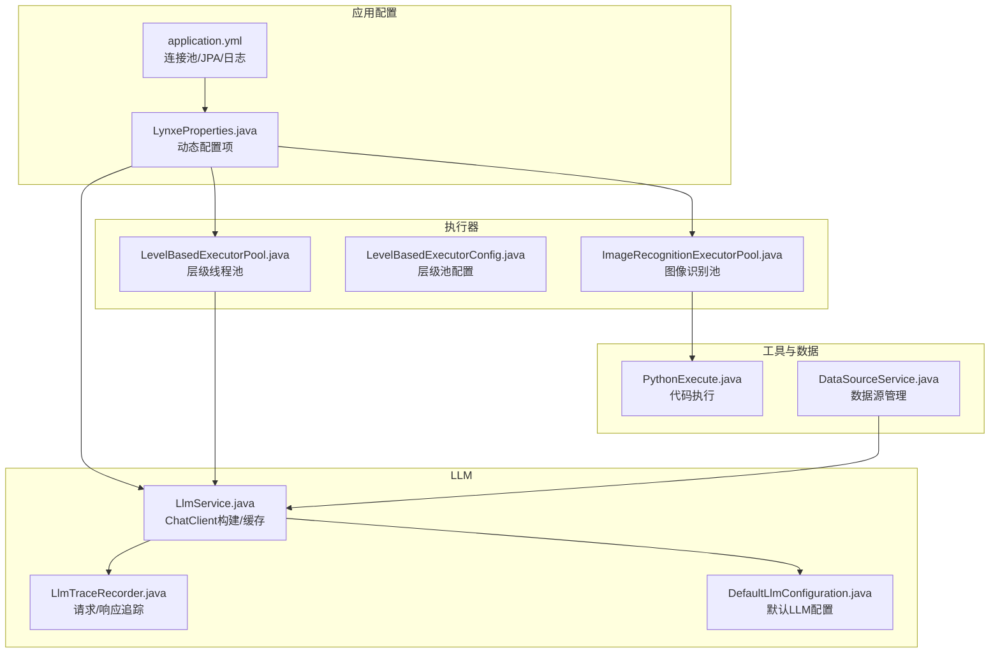
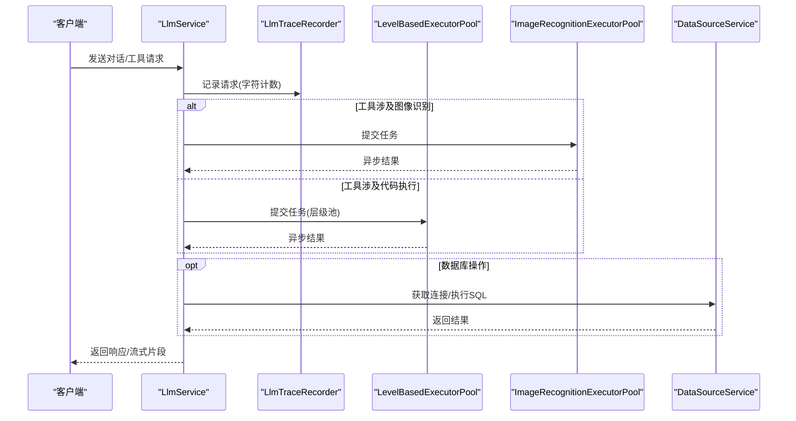
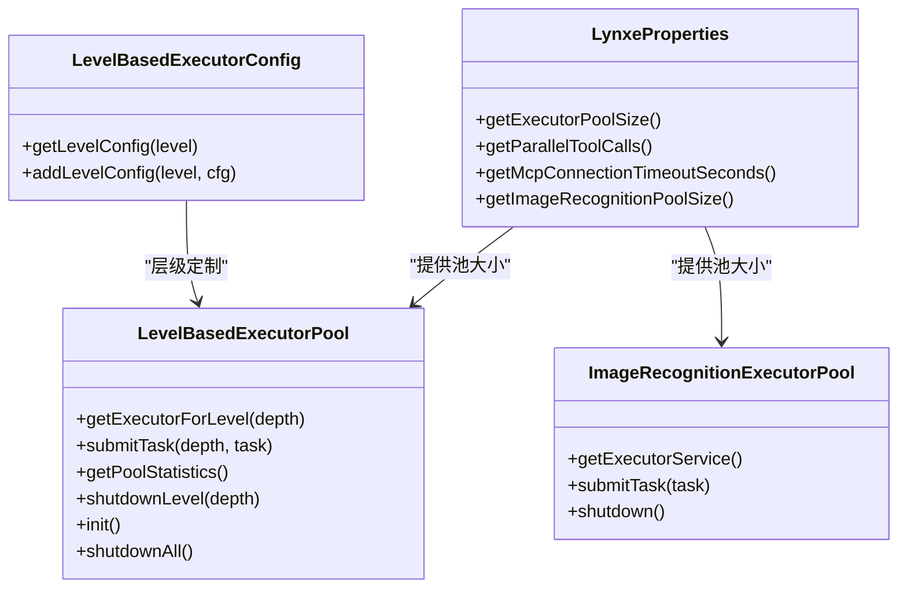
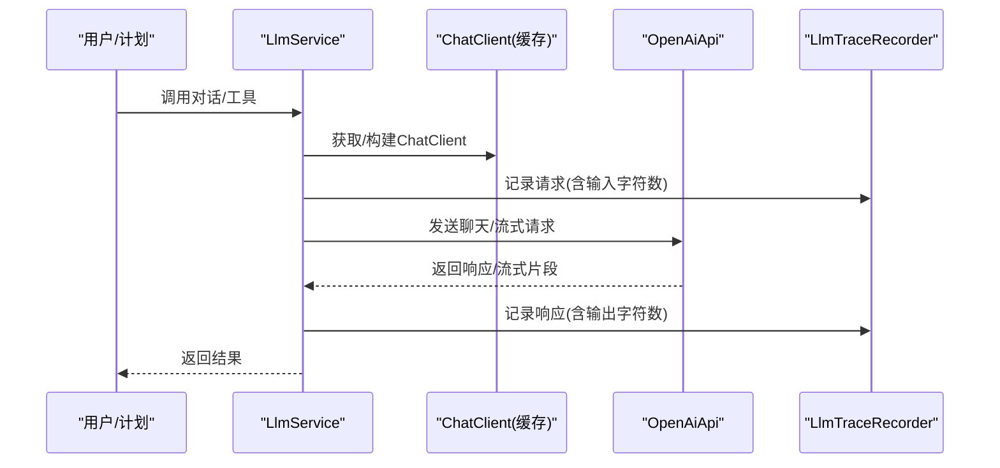
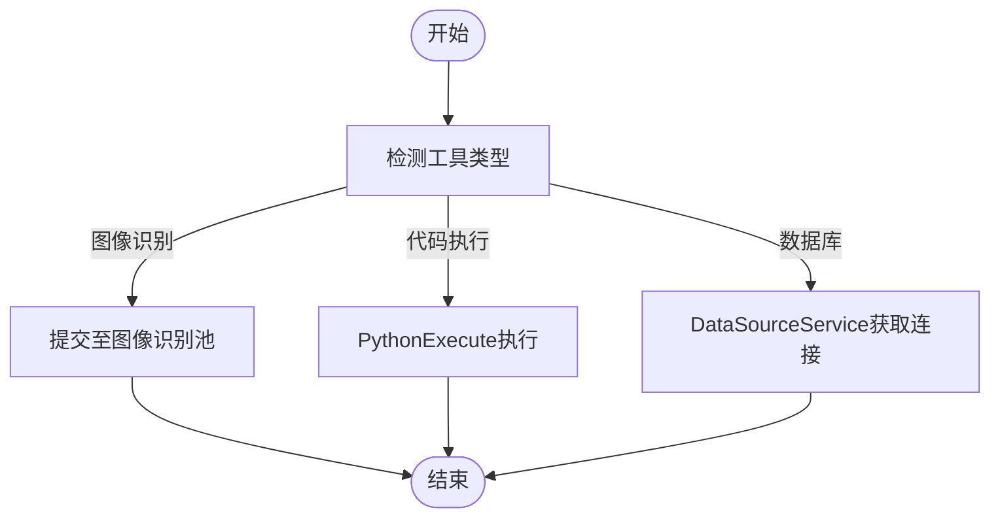
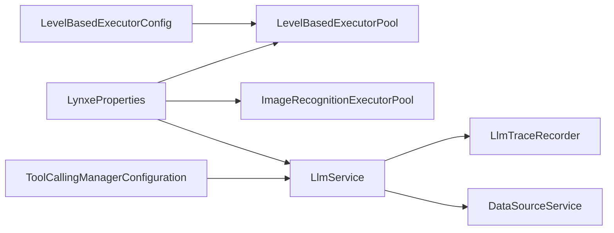

# 性能问题排查

<cite>
**本文引用的文件**
- [application.yml](file://src/main/resources/application.yml)
- [LynxeProperties.java](file://src/main/java/com/alibaba/cloud/ai/lynxe/config/LynxeProperties.java)
- [DefaultLlmConfiguration.java](file://src/main/java/com/alibaba/cloud/ai/lynxe/config/DefaultLlmConfiguration.java)
- [LevelBasedExecutorPool.java](file://src/main/java/com/alibaba/cloud/ai/lynxe/runtime/executor/LevelBasedExecutorPool.java)
- [LevelBasedExecutorConfig.java](file://src/main/java/com/alibaba/cloud/ai/lynxe/runtime/executor/LevelBasedExecutorConfig.java)
- [ImageRecognitionExecutorPool.java](file://src/main/java/com/alibaba/cloud/ai/lynxe/runtime/executor/ImageRecognitionExecutorPool.java)
- [LlmService.java](file://src/main/java/com/alibaba/cloud/ai/lynxe/llm/LlmService.java)
- [LlmTraceRecorder.java](file://src/main/java/com/alibaba/cloud/ai/lynxe/llm/LlmTraceRecorder.java)
- [ToolCallingManagerConfiguration.java](file://src/main/java/com/alibaba/cloud/ai/lynxe/config/ToolCallingManagerConfiguration.java)
- [MemoryConfig.java](file://src/main/java/com/alibaba/cloud/ai/lynxe/config/MemoryConfig.java)
- [PythonExecute.java](file://src/main/java/com/alibaba/cloud/ai/lynxe/tool/code/PythonExecute.java)
- [DataSourceService.java](file://src/main/java/com/alibaba/cloud/ai/lynxe/tool/database/DataSourceService.java)
</cite>

## 目录
1. [简介](#简介)
2. [项目结构](#项目结构)
3. [核心组件](#核心组件)
4. [架构总览](#架构总览)
5. [详细组件分析](#详细组件分析)
6. [依赖分析](#依赖分析)
7. [性能考量](#性能考量)
8. [故障排查指南](#故障排查指南)
9. [结论](#结论)
10. [附录](#附录)

## 简介
本文件面向Lynxe在生产环境中的性能问题排查与优化，聚焦以下方面：
- 系统性能瓶颈识别与定位
- 内存使用分析与对话记忆配置
- CPU占用监控与线程池并发控制
- LLM配置优化与请求追踪
- 工具调用延迟与数据库查询优化
- 基准测试、负载测试与压力测试方法
- 内存泄漏检测、GC调优与线程池配置建议
- 缓存策略、连接池管理与资源限制配置

## 项目结构
Lynxe采用Spring Boot工程，核心模块围绕“配置中心、运行时执行器、LLM服务、工具集、数据库访问”等展开。性能相关的关键点包括：
- 应用级资源配置（连接池、JPA、日志级别）
- 全局属性配置（线程池大小、LLM超时、浏览器行为等）
- 执行器池（层级化线程池、图像识别专用池）
- LLM客户端构建与追踪
- 数据源管理与连接池参数
- 工具执行（代码执行、数据库操作）

图表来源
- [application.yml:1-97](file://src/main/resources/application.yml#L1-L97)
- [LynxeProperties.java:1-654](file://src/main/java/com/alibaba/cloud/ai/lynxe/config/LynxeProperties.java#L1-L654)
- [LevelBasedExecutorPool.java:1-422](file://src/main/java/com/alibaba/cloud/ai/lynxe/runtime/executor/LevelBasedExecutorPool.java#L1-L422)
- [LevelBasedExecutorConfig.java:1-189](file://src/main/java/com/alibaba/cloud/ai/lynxe/runtime/executor/LevelBasedExecutorConfig.java#L1-L189)
- [ImageRecognitionExecutorPool.java:1-249](file://src/main/java/com/alibaba/cloud/ai/lynxe/runtime/executor/ImageRecognitionExecutorPool.java#L1-L249)
- [LlmService.java:1-482](file://src/main/java/com/alibaba/cloud/ai/lynxe/llm/LlmService.java#L1-L482)
- [LlmTraceRecorder.java:1-156](file://src/main/java/com/alibaba/cloud/ai/lynxe/llm/LlmTraceRecorder.java#L1-L156)
- [DefaultLlmConfiguration.java:1-52](file://src/main/java/com/alibaba/cloud/ai/lynxe/config/DefaultLlmConfiguration.java#L1-L52)
- [PythonExecute.java:1-246](file://src/main/java/com/alibaba/cloud/ai/lynxe/tool/code/PythonExecute.java#L1-L246)
- [DataSourceService.java:1-215](file://src/main/java/com/alibaba/cloud/ai/lynxe/tool/database/DataSourceService.java#L1-L215)

章节来源
- [application.yml:1-97](file://src/main/resources/application.yml#L1-L97)
- [LynxeProperties.java:1-654](file://src/main/java/com/alibaba/cloud/ai/lynxe/config/LynxeProperties.java#L1-L654)

## 核心组件
- 应用配置(application.yml)
  - Hikari连接池参数（最大池大小、空闲、生命周期、泄漏检测阈值）
  - JPA设置（关闭Open Session In View以避免性能问题）
  - 日志级别与输出路径
- 全局属性(LynxeProperties)
  - 浏览器/headless、请求超时
  - 代理/并发相关（如MCP连接、重试、并发连接）
  - 图像识别池大小、模型名称、DPI、重试次数
  - LLM读超时、对话记忆窗口大小、并行工具调用开关
  - 执行器池大小（全局统一）
- 执行器池
  - 层级线程池(LevelBasedExecutorPool)：按计划层级分配独立线程池，支持动态调整
  - 图像识别专用池(ImageRecognitionExecutorPool)：可热更新线程池大小
- LLM服务
  - ChatClient缓存、对话记忆、WebClient增强（DNS缓存或超时）
  - 请求/流式响应追踪记录
- 工具与数据
  - PythonExecute：代码执行工具
  - DataSourceService：多数据源注册与连接获取

章节来源
- [application.yml:1-97](file://src/main/resources/application.yml#L1-L97)
- [LynxeProperties.java:1-654](file://src/main/java/com/alibaba/cloud/ai/lynxe/config/LynxeProperties.java#L1-L654)
- [LevelBasedExecutorPool.java:1-422](file://src/main/java/com/alibaba/cloud/ai/lynxe/runtime/executor/LevelBasedExecutorPool.java#L1-L422)
- [ImageRecognitionExecutorPool.java:1-249](file://src/main/java/com/alibaba/cloud/ai/lynxe/runtime/executor/ImageRecognitionExecutorPool.java#L1-L249)
- [LlmService.java:1-482](file://src/main/java/com/alibaba/cloud/ai/lynxe/llm/LlmService.java#L1-L482)
- [LlmTraceRecorder.java:1-156](file://src/main/java/com/alibaba/cloud/ai/lynxe/llm/LlmTraceRecorder.java#L1-L156)
- [PythonExecute.java:1-246](file://src/main/java/com/alibaba/cloud/ai/lynxe/tool/code/PythonExecute.java#L1-L246)
- [DataSourceService.java:1-215](file://src/main/java/com/alibaba/cloud/ai/lynxe/tool/database/DataSourceService.java#L1-L215)

## 架构总览
下图展示从请求到执行器、LLM与数据库的关键路径及性能相关配置点。

图表来源
- [LlmService.java:1-482](file://src/main/java/com/alibaba/cloud/ai/lynxe/llm/LlmService.java#L1-L482)
- [LlmTraceRecorder.java:1-156](file://src/main/java/com/alibaba/cloud/ai/lynxe/llm/LlmTraceRecorder.java#L1-L156)
- [LevelBasedExecutorPool.java:1-422](file://src/main/java/com/alibaba/cloud/ai/lynxe/runtime/executor/LevelBasedExecutorPool.java#L1-L422)
- [ImageRecognitionExecutorPool.java:1-249](file://src/main/java/com/alibaba/cloud/ai/lynxe/runtime/executor/ImageRecognitionExecutorPool.java#L1-L249)
- [DataSourceService.java:1-215](file://src/main/java/com/alibaba/cloud/ai/lynxe/tool/database/DataSourceService.java#L1-L215)

## 详细组件分析

### 线程池与并发控制
- 层级线程池(LevelBasedExecutorPool)
  - 按深度层级(0~9)维护独立ThreadPoolExecutor
  - 支持动态调整所有层级池大小，周期性检查配置变化
  - 统一线程命名、守护线程策略、CallerRunsPolicy拒绝策略
  - 提供统计接口：核心/最大/当前池大小、活跃线程、队列长度、完成/总任务数
- 图像识别专用池(ImageRecognitionExecutorPool)
  - 可热更新线程池大小（定时检查配置变更）
  - 固定大小池，队列容量=池大小×2，保持背压
- 全局属性(LynxeProperties)
  - executorPoolSize：统一的全局执行器池大小
  - parallelToolCalls：是否允许并行工具调用
  - mcpServiceLoader.*：MCP连接/重试/并发连接上限
- 层级池配置(LevelBasedExecutorConfig)
  - 支持为特定层级设置core/max/队列/keepAlive
  - 默认最大深度20，便于精细化调优

图表来源
- [LevelBasedExecutorPool.java:1-422](file://src/main/java/com/alibaba/cloud/ai/lynxe/runtime/executor/LevelBasedExecutorPool.java#L1-L422)
- [ImageRecognitionExecutorPool.java:1-249](file://src/main/java/com/alibaba/cloud/ai/lynxe/runtime/executor/ImageRecognitionExecutorPool.java#L1-L249)
- [LynxeProperties.java:1-654](file://src/main/java/com/alibaba/cloud/ai/lynxe/config/LynxeProperties.java#L1-L654)
- [LevelBasedExecutorConfig.java:1-189](file://src/main/java/com/alibaba/cloud/ai/lynxe/runtime/executor/LevelBasedExecutorConfig.java#L1-L189)

章节来源
- [LevelBasedExecutorPool.java:1-422](file://src/main/java/com/alibaba/cloud/ai/lynxe/runtime/executor/LevelBasedExecutorPool.java#L1-L422)
- [ImageRecognitionExecutorPool.java:1-249](file://src/main/java/com/alibaba/cloud/ai/lynxe/runtime/executor/ImageRecognitionExecutorPool.java#L1-L249)
- [LynxeProperties.java:1-654](file://src/main/java/com/alibaba/cloud/ai/lynxe/config/LynxeProperties.java#L1-L654)
- [LevelBasedExecutorConfig.java:1-189](file://src/main/java/com/alibaba/cloud/ai/lynxe/runtime/executor/LevelBasedExecutorConfig.java#L1-L189)

### LLM配置与执行链路
- LlmService
  - ChatClient缓存：按模型名缓存，避免重复构建
  - 对话记忆：MessageWindowChatMemory，支持按消息条数限制
  - WebClient增强：DNS缓存或超时配置；默认10MB内存限制
  - 请求/流式响应：通过LlmTraceRecorder记录请求与响应字符数
- LlmTraceRecorder
  - 单请求作用域，记录请求体、响应体、错误详情
  - 输入/输出字符计数，便于吞吐与成本估算
- DefaultLlmConfiguration
  - 默认模型、基础URL、补全路径、描述信息

图表来源
- [LlmService.java:1-482](file://src/main/java/com/alibaba/cloud/ai/lynxe/llm/LlmService.java#L1-L482)
- [LlmTraceRecorder.java:1-156](file://src/main/java/com/alibaba/cloud/ai/lynxe/llm/LlmTraceRecorder.java#L1-L156)
- [DefaultLlmConfiguration.java:1-52](file://src/main/java/com/alibaba/cloud/ai/lynxe/config/DefaultLlmConfiguration.java#L1-L52)

章节来源
- [LlmService.java:1-482](file://src/main/java/com/alibaba/cloud/ai/lynxe/llm/LlmService.java#L1-L482)
- [LlmTraceRecorder.java:1-156](file://src/main/java/com/alibaba/cloud/ai/lynxe/llm/LlmTraceRecorder.java#L1-L156)
- [DefaultLlmConfiguration.java:1-52](file://src/main/java/com/alibaba/cloud/ai/lynxe/config/DefaultLlmConfiguration.java#L1-L52)

### 工具调用与数据库查询
- PythonExecute
  - 代码执行工具，支持打印输出捕获；错误类型识别与状态标记
- DataSourceService
  - 多数据源注册与连接获取；提供类型映射与连接测试
- 工具调用管理
  - ToolCallingManagerConfiguration：根据属性选择标准或可观测版本的ToolCallingManager

图表来源
- [PythonExecute.java:1-246](file://src/main/java/com/alibaba/cloud/ai/lynxe/tool/code/PythonExecute.java#L1-L246)
- [DataSourceService.java:1-215](file://src/main/java/com/alibaba/cloud/ai/lynxe/tool/database/DataSourceService.java#L1-L215)
- [ToolCallingManagerConfiguration.java:1-117](file://src/main/java/com/alibaba/cloud/ai/lynxe/config/ToolCallingManagerConfiguration.java#L1-L117)

章节来源
- [PythonExecute.java:1-246](file://src/main/java/com/alibaba/cloud/ai/lynxe/tool/code/PythonExecute.java#L1-L246)
- [DataSourceService.java:1-215](file://src/main/java/com/alibaba/cloud/ai/lynxe/tool/database/DataSourceService.java#L1-L215)
- [ToolCallingManagerConfiguration.java:1-117](file://src/main/java/com/alibaba/cloud/ai/lynxe/config/ToolCallingManagerConfiguration.java#L1-L117)

## 依赖分析
- 执行器池依赖LynxeProperties进行池大小配置，支持动态调整
- LlmService依赖WebClient增强、ChatClient缓存、对话记忆与追踪
- 数据源依赖DataSourceService进行连接获取与类型管理
- 工具调用依赖ToolCallingManagerConfiguration按需启用可观测版本

图表来源
- [LynxeProperties.java:1-654](file://src/main/java/com/alibaba/cloud/ai/lynxe/config/LynxeProperties.java#L1-L654)
- [LevelBasedExecutorPool.java:1-422](file://src/main/java/com/alibaba/cloud/ai/lynxe/runtime/executor/LevelBasedExecutorPool.java#L1-L422)
- [ImageRecognitionExecutorPool.java:1-249](file://src/main/java/com/alibaba/cloud/ai/lynxe/runtime/executor/ImageRecognitionExecutorPool.java#L1-L249)
- [LevelBasedExecutorConfig.java:1-189](file://src/main/java/com/alibaba/cloud/ai/lynxe/runtime/executor/LevelBasedExecutorConfig.java#L1-L189)
- [LlmService.java:1-482](file://src/main/java/com/alibaba/cloud/ai/lynxe/llm/LlmService.java#L1-L482)
- [LlmTraceRecorder.java:1-156](file://src/main/java/com/alibaba/cloud/ai/lynxe/llm/LlmTraceRecorder.java#L1-L156)
- [DataSourceService.java:1-215](file://src/main/java/com/alibaba/cloud/ai/lynxe/tool/database/DataSourceService.java#L1-L215)
- [ToolCallingManagerConfiguration.java:1-117](file://src/main/java/com/alibaba/cloud/ai/lynxe/config/ToolCallingManagerConfiguration.java#L1-L117)

章节来源
- [LynxeProperties.java:1-654](file://src/main/java/com/alibaba/cloud/ai/lynxe/config/LynxeProperties.java#L1-L654)
- [LevelBasedExecutorPool.java:1-422](file://src/main/java/com/alibaba/cloud/ai/lynxe/runtime/executor/LevelBasedExecutorPool.java#L1-L422)
- [ImageRecognitionExecutorPool.java:1-249](file://src/main/java/com/alibaba/cloud/ai/lynxe/runtime/executor/ImageRecognitionExecutorPool.java#L1-L249)
- [LevelBasedExecutorConfig.java:1-189](file://src/main/java/com/alibaba/cloud/ai/lynxe/runtime/executor/LevelBasedExecutorConfig.java#L1-L189)
- [LlmService.java:1-482](file://src/main/java/com/alibaba/cloud/ai/lynxe/llm/LlmService.java#L1-L482)
- [LlmTraceRecorder.java:1-156](file://src/main/java/com/alibaba/cloud/ai/lynxe/llm/LlmTraceRecorder.java#L1-L156)
- [DataSourceService.java:1-215](file://src/main/java/com/alibaba/cloud/ai/lynxe/tool/database/DataSourceService.java#L1-L215)
- [ToolCallingManagerConfiguration.java:1-117](file://src/main/java/com/alibaba/cloud/ai/lynxe/config/ToolCallingManagerConfiguration.java#L1-L117)

## 性能考量
- 线程池与并发
  - 使用层级线程池隔离不同计划层级的任务，避免相互阻塞
  - 动态调整池大小：在流量高峰前提升executorPoolSize，低峰期降低以节省CPU
  - 图像识别池独立于通用池，避免IO密集任务影响其他任务
  - 并行工具调用(parallelToolCalls)按场景开启，注意与MCP并发连接上限协调
- LLM与网络
  - ChatClient缓存减少模型初始化开销
  - WebClient增强与DNS缓存减少连接建立与解析开销
  - 请求/响应追踪记录字符数，用于评估吞吐与成本
  - llmReadTimeout合理设置，避免长尾请求占用资源
- 数据库与连接池
  - Hikari连接池参数已配置，关注泄漏检测阈值与最小空闲
  - 通过DataSourceService集中管理多数据源，避免连接泄露
- 工具执行
  - PythonExecute仅捕获print输出，避免大输出导致内存峰值
  - 代码执行失败时快速失败并记录错误，避免长时间挂起

章节来源
- [LevelBasedExecutorPool.java:1-422](file://src/main/java/com/alibaba/cloud/ai/lynxe/runtime/executor/LevelBasedExecutorPool.java#L1-L422)
- [ImageRecognitionExecutorPool.java:1-249](file://src/main/java/com/alibaba/cloud/ai/lynxe/runtime/executor/ImageRecognitionExecutorPool.java#L1-L249)
- [LynxeProperties.java:1-654](file://src/main/java/com/alibaba/cloud/ai/lynxe/config/LynxeProperties.java#L1-L654)
- [LlmService.java:1-482](file://src/main/java/com/alibaba/cloud/ai/lynxe/llm/LlmService.java#L1-L482)
- [application.yml:1-97](file://src/main/resources/application.yml#L1-L97)
- [PythonExecute.java:1-246](file://src/main/java/com/alibaba/cloud/ai/lynxe/tool/code/PythonExecute.java#L1-L246)
- [DataSourceService.java:1-215](file://src/main/java/com/alibaba/cloud/ai/lynxe/tool/database/DataSourceService.java#L1-L215)

## 故障排查指南
- 线程池相关
  - 症状：任务堆积、队列持续增长
  - 排查：查看getPoolStatistics输出，确认队列长度与活跃线程
  - 处理：提升executorPoolSize或拆分层级；必要时调整拒绝策略
- LLM请求异常
  - 症状：超时、响应慢、字符计数异常
  - 排查：检查llmReadTimeout、WebClient超时与DNS缓存配置
  - 处理：缩短超时或增加池大小；确认模型URL与路径规范化
- 数据库连接问题
  - 症状：连接耗尽、泄漏、慢查询
  - 排查：Hikari参数与泄漏检测阈值；DataSourceService连接测试
  - 处理：优化SQL与索引；调整最大池大小；启用连接池监控
- 工具执行失败
  - 症状：Python执行报错、无输出
  - 排查：查看错误信息与最近执行日志ID
  - 处理：修正语法/依赖；限制输出大小

章节来源
- [LevelBasedExecutorPool.java:1-422](file://src/main/java/com/alibaba/cloud/ai/lynxe/runtime/executor/LevelBasedExecutorPool.java#L1-L422)
- [LlmService.java:1-482](file://src/main/java/com/alibaba/cloud/ai/lynxe/llm/LlmService.java#L1-L482)
- [application.yml:1-97](file://src/main/resources/application.yml#L1-L97)
- [PythonExecute.java:1-246](file://src/main/java/com/alibaba/cloud/ai/lynxe/tool/code/PythonExecute.java#L1-L246)
- [DataSourceService.java:1-215](file://src/main/java/com/alibaba/cloud/ai/lynxe/tool/database/DataSourceService.java#L1-L215)

## 结论
通过层级线程池、专用图像识别池、LLM缓存与追踪、连接池参数与工具执行优化，Lynxe可在高并发场景下实现稳定与高性能。建议结合监控指标（队列长度、活跃线程、字符计数、连接池状态）进行持续调优，并在流量高峰前完成池大小与超时参数的预热与校准。

## 附录

### 性能基准/负载/压力测试方法
- 基准测试
  - 场景：单模型对话吞吐、流式响应延迟
  - 指标：QPS、P95/P99延迟、输入/输出字符数
  - 方法：固定并发、逐步提升并发，观察队列长度与错误率
- 负载测试
  - 场景：多模型切换、工具调用混合负载
  - 指标：线程池利用率、数据库连接池占用、LLM错误率
  - 方法：模拟真实业务序列，记录池统计与追踪日志
- 压力测试
  - 场景：突发流量、超时与错误注入
  - 指标：熔断/降级触发、拒绝策略生效、恢复时间
  - 方法：逐步加压至系统极限，记录失败点与恢复过程

[本节为通用方法论，不直接分析具体文件]

### 内存泄漏检测与GC调优
- 检测手段
  - JVM堆转储与对象快照对比
  - 监控线程池队列长度与活跃线程长期趋势
  - LLM缓存大小与对话记忆容量
- GC调优建议
  - 选择合适GC算法（G1/Parallel），调整新生代比例
  - 控制对象生命周期，避免大对象常驻老年代
  - 合理设置元空间与直接内存限额

[本节为通用指导，不直接分析具体文件]

### 线程池配置建议
- 通用池
  - 初值：executorPoolSize=5，随流量动态调整
  - 队列容量：池大小×10，避免过长等待
  - 拒绝策略：CallerRunsPolicy，保护系统稳定性
- 图像识别池
  - 池大小：依据OCR/图像处理吞吐与GPU/CPU资源
  - 队列容量：池大小×2，保证背压
- 层级池
  - 为高优先级层级设置更大池与更短队列
  - 低优先级层级共享较小池，避免抢占

[本节为通用指导，不直接分析具体文件]

### 缓存策略与连接池管理
- 缓存策略
  - ChatClient按模型名缓存，避免重复构建
  - 对话记忆窗口限制，防止无限增长
- 连接池管理
  - Hikari参数：最大池大小、空闲、生命周期、泄漏检测阈值
  - 多数据源：集中管理，定期测试连接有效性

章节来源
- [LlmService.java:1-482](file://src/main/java/com/alibaba/cloud/ai/lynxe/llm/LlmService.java#L1-L482)
- [application.yml:1-97](file://src/main/resources/application.yml#L1-L97)
- [DataSourceService.java:1-215](file://src/main/java/com/alibaba/cloud/ai/lynxe/tool/database/DataSourceService.java#L1-L215)