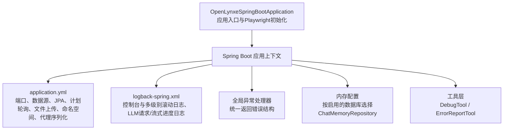
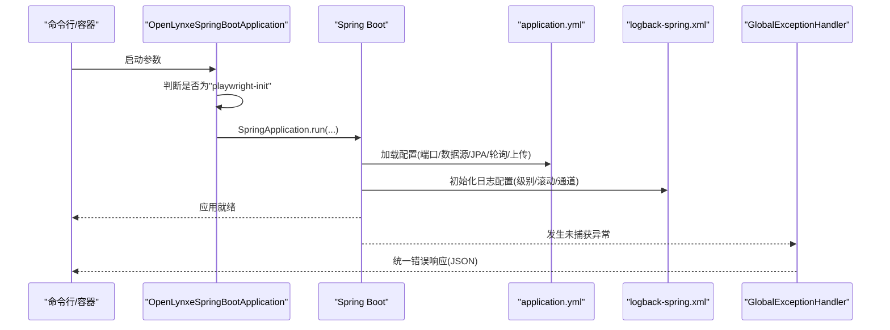
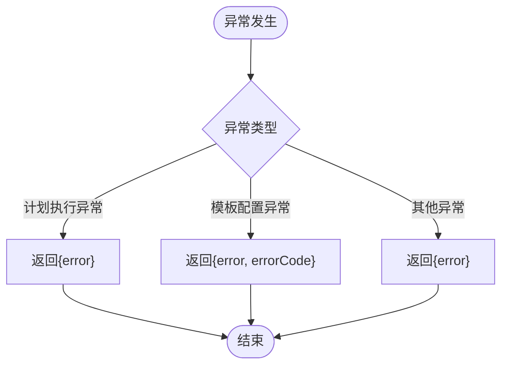
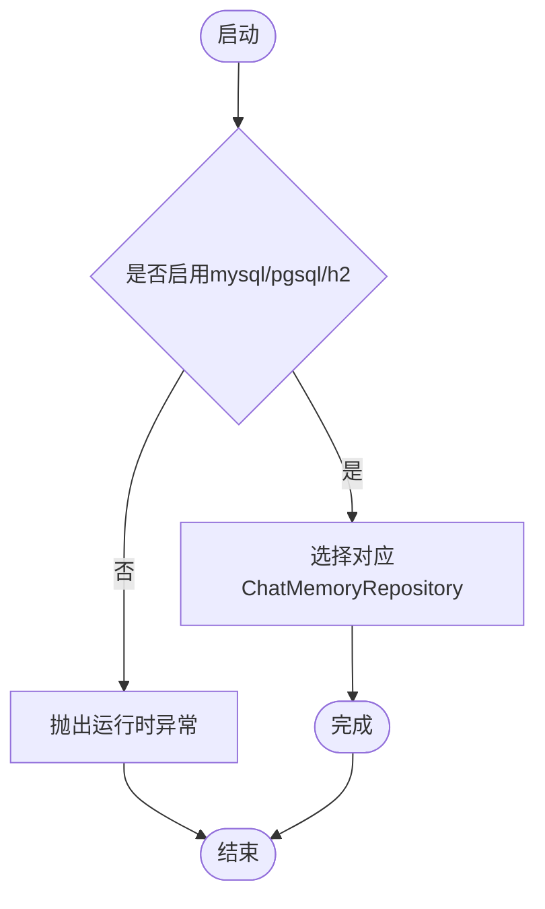
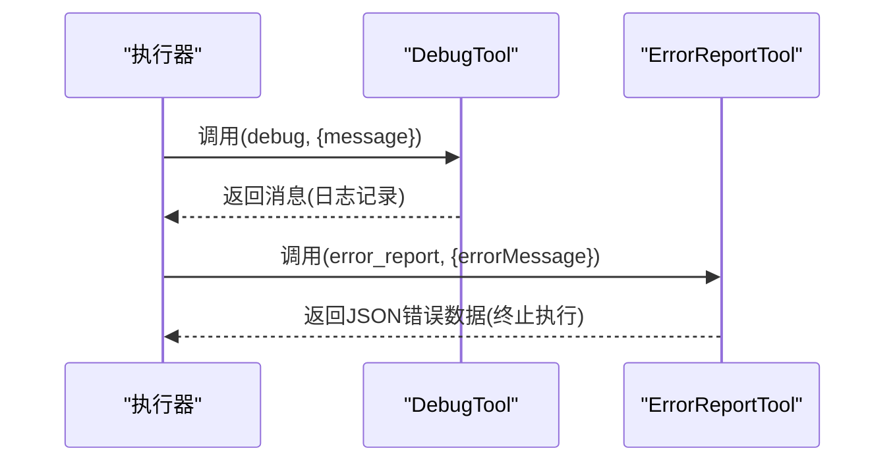
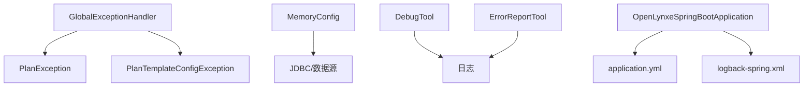

# 故障排除

<cite>
**本文引用的文件**   
- [OpenLynxeSpringBootApplication.java](file://src/main/java/com/alibaba/cloud/ai/lynxe/OpenLynxeSpringBootApplication.java)
- [application.yml](file://src/main/resources/application.yml)
- [logback-spring.xml](file://src/main/resources/logback-spring.xml)
- [GlobalExceptionHandler.java](file://src/main/java/com/alibaba/cloud/ai/lynxe/exception/handler/GlobalExceptionHandler.java)
- [PlanException.java](file://src/main/java/com/alibaba/cloud/ai/lynxe/exception/PlanException.java)
- [MemoryConfig.java](file://src/main/java/com/alibaba/cloud/ai/lynxe/config/MemoryConfig.java)
- [DebugTool.java](file://src/main/java/com/alibaba/cloud/ai/lynxe/tool/DebugTool.java)
- [ErrorReportTool.java](file://src/main/java/com/alibaba/cloud/ai/lynxe/tool/ErrorReportTool.java)
</cite>

## 目录
1. [简介](#简介)
2. [项目结构](#项目结构)
3. [核心组件](#核心组件)
4. [架构总览](#架构总览)
5. [详细组件分析](#详细组件分析)
6. [依赖分析](#依赖分析)
7. [性能考虑](#性能考虑)
8. [故障排除指南](#故障排除指南)
9. [结论](#结论)
10. [附录](#附录)

## 简介
本故障排除文档面向Lynxe系统的运维与开发人员，聚焦于常见问题的诊断方法、解决方案与预防措施。内容涵盖日志分析、错误追踪、性能监控、系统错误、网络问题、数据库连接等故障场景；并提供调试工具使用、性能分析与内存泄漏检测方法；最后给出监控指标解读、告警配置与应急响应流程，以及故障恢复、数据修复与系统重建指南。

## 项目结构
Lynxe采用Spring Boot应用，入口类负责启动与Playwright初始化；配置集中在application.yml与logback-spring.xml中；异常统一由全局异常处理器捕获；工具层提供调试与错误上报能力；内存配置支持多数据库后端。

**图表来源**
- [OpenLynxeSpringBootApplication.java:36-45](file://src/main/java/com/alibaba/cloud/ai/lynxe/OpenLynxeSpringBootApplication.java#L36-L45)
- [application.yml:1-97](file://src/main/resources/application.yml#L1-L97)
- [logback-spring.xml:1-185](file://src/main/resources/logback-spring.xml#L1-L185)
- [GlobalExceptionHandler.java:32-68](file://src/main/java/com/alibaba/cloud/ai/lynxe/exception/handler/GlobalExceptionHandler.java#L32-L68)
- [MemoryConfig.java:35-72](file://src/main/java/com/alibaba/cloud/ai/lynxe/config/MemoryConfig.java#L35-L72)
- [DebugTool.java:30-118](file://src/main/java/com/alibaba/cloud/ai/lynxe/tool/DebugTool.java#L30-L118)
- [ErrorReportTool.java:31-183](file://src/main/java/com/alibaba/cloud/ai/lynxe/tool/ErrorReportTool.java#L31-L183)

**章节来源**
- [OpenLynxeSpringBootApplication.java:36-45](file://src/main/java/com/alibaba/cloud/ai/lynxe/OpenLynxeSpringBootApplication.java#L36-L45)
- [application.yml:1-97](file://src/main/resources/application.yml#L1-L97)
- [logback-spring.xml:1-185](file://src/main/resources/logback-spring.xml#L1-L185)

## 核心组件
- 应用入口与启动
  - 入口类负责标准启动或Playwright初始化分支，确保浏览器自动化依赖可用。
- 配置中心
  - application.yml定义端口、数据源池参数、JPA行为、Spring AI自动装配排除、日志路径与级别、计划轮询策略、文件上传限制与策略、命名空间与代理序列化选项。
- 日志系统
  - logback-spring.xml提供控制台阈值过滤、多级别滚动文件、LLM请求与流式进度专用日志通道，便于定位模型交互与流式输出问题。
- 异常处理
  - 全局异常处理器对计划执行异常与模板配置异常进行结构化返回，并兜底所有未捕获异常。
- 内存配置
  - 根据启用项动态选择MySQL/PostgreSQL/H2聊天记忆仓库，若均未启用则抛出运行时异常，防止配置缺失导致的静默失败。
- 工具层
  - DebugTool用于记录输入并直接返回消息，便于快速验证调用链与参数传递。
  - ErrorReportTool用于在执行过程中上报错误并终止后续执行，同时持久化错误信息供前端展示。

**章节来源**
- [OpenLynxeSpringBootApplication.java:36-45](file://src/main/java/com/alibaba/cloud/ai/lynxe/OpenLynxeSpringBootApplication.java#L36-L45)
- [application.yml:1-97](file://src/main/resources/application.yml#L1-L97)
- [logback-spring.xml:150-183](file://src/main/resources/logback-spring.xml#L150-L183)
- [GlobalExceptionHandler.java:32-68](file://src/main/java/com/alibaba/cloud/ai/lynxe/exception/handler/GlobalExceptionHandler.java#L32-L68)
- [MemoryConfig.java:35-72](file://src/main/java/com/alibaba/cloud/ai/lynxe/config/MemoryConfig.java#L35-L72)
- [DebugTool.java:30-118](file://src/main/java/com/alibaba/cloud/ai/lynxe/tool/DebugTool.java#L30-L118)
- [ErrorReportTool.java:31-183](file://src/main/java/com/alibaba/cloud/ai/lynxe/tool/ErrorReportTool.java#L31-L183)

## 架构总览
下图展示了从启动到异常处理与日志输出的关键路径，帮助定位系统级故障。

**图表来源**
- [OpenLynxeSpringBootApplication.java:36-45](file://src/main/java/com/alibaba/cloud/ai/lynxe/OpenLynxeSpringBootApplication.java#L36-L45)
- [application.yml:1-97](file://src/main/resources/application.yml#L1-L97)
- [logback-spring.xml:150-183](file://src/main/resources/logback-spring.xml#L150-L183)
- [GlobalExceptionHandler.java:32-68](file://src/main/java/com/alibaba/cloud/ai/lynxe/exception/handler/GlobalExceptionHandler.java#L32-L68)

## 详细组件分析

### 全局异常处理与错误分类
- 异常类型
  - 计划执行异常：统一返回内部错误JSON，包含错误信息字段。
  - 计划模板配置异常：返回错误信息与错误码字段，便于前端识别配置问题。
  - 其他未捕获异常：兜底返回内部服务器错误。
- 处理策略
  - 统一响应结构，便于前端解析与用户提示。
  - 将异常栈与业务错误分离，避免泄露敏感信息。

**图表来源**
- [GlobalExceptionHandler.java:38-66](file://src/main/java/com/alibaba/cloud/ai/lynxe/exception/handler/GlobalExceptionHandler.java#L38-L66)
- [PlanException.java:23-45](file://src/main/java/com/alibaba/cloud/ai/lynxe/exception/PlanException.java#L23-L45)

**章节来源**
- [GlobalExceptionHandler.java:32-68](file://src/main/java/com/alibaba/cloud/ai/lynxe/exception/handler/GlobalExceptionHandler.java#L32-L68)
- [PlanException.java:16-46](file://src/main/java/com/alibaba/cloud/ai/lynxe/exception/PlanException.java#L16-L46)

### 内存配置与数据库选择
- 行为
  - 根据启用开关选择MySQL/PostgreSQL/H2聊天记忆仓库；若均未启用则抛出运行时异常。
- 故障风险
  - 未正确启用任一内存后端会导致启动失败。
- 排查要点
  - 检查对应属性开关状态与数据源连通性。
  - 若切换后仍报错，确认配置生效与重启应用。

**图表来源**
- [MemoryConfig.java:54-70](file://src/main/java/com/alibaba/cloud/ai/lynxe/config/MemoryConfig.java#L54-L70)

**章节来源**
- [MemoryConfig.java:35-72](file://src/main/java/com/alibaba/cloud/ai/lynxe/config/MemoryConfig.java#L35-L72)

### 调试工具与错误上报工具
- DebugTool
  - 记录输入并直接返回消息，适合快速验证工具链与参数传递。
- ErrorReportTool
  - 在执行中上报错误并终止后续执行，同时将错误信息格式化为JSON存储，便于前端展示。

**图表来源**
- [DebugTool.java:42-64](file://src/main/java/com/alibaba/cloud/ai/lynxe/tool/DebugTool.java#L42-L64)
- [ErrorReportTool.java:100-127](file://src/main/java/com/alibaba/cloud/ai/lynxe/tool/ErrorReportTool.java#L100-L127)

**章节来源**
- [DebugTool.java:30-118](file://src/main/java/com/alibaba/cloud/ai/lynxe/tool/DebugTool.java#L30-L118)
- [ErrorReportTool.java:31-183](file://src/main/java/com/alibaba/cloud/ai/lynxe/tool/ErrorReportTool.java#L31-L183)

## 依赖分析
- 组件耦合
  - 全局异常处理器依赖计划异常类型与模板配置异常类型，属于业务异常的集中出口。
  - 内存配置依赖外部数据源与JDBC模板，耦合于数据层。
  - 工具层通过日志与结果对象与上层交互，低耦合高内聚。
- 外部依赖
  - 数据库连接池(Hikari)、JPA、Spring Web、日志框架、Playwright(初始化)。

**图表来源**
- [GlobalExceptionHandler.java:26-27](file://src/main/java/com/alibaba/cloud/ai/lynxe/exception/handler/GlobalExceptionHandler.java#L26-L27)
- [PlanException.java:23-39](file://src/main/java/com/alibaba/cloud/ai/lynxe/exception/PlanException.java#L23-L39)
- [MemoryConfig.java:54-70](file://src/main/java/com/alibaba/cloud/ai/lynxe/config/MemoryConfig.java#L54-L70)
- [DebugTool.java:32-44](file://src/main/java/com/alibaba/cloud/ai/lynxe/tool/DebugTool.java#L32-L44)
- [ErrorReportTool.java:100-121](file://src/main/java/com/alibaba/cloud/ai/lynxe/tool/ErrorReportTool.java#L100-L121)
- [OpenLynxeSpringBootApplication.java:36-45](file://src/main/java/com/alibaba/cloud/ai/lynxe/OpenLynxeSpringBootApplication.java#L36-L45)
- [application.yml:1-97](file://src/main/resources/application.yml#L1-L97)
- [logback-spring.xml:150-183](file://src/main/resources/logback-spring.xml#L150-L183)

**章节来源**
- [GlobalExceptionHandler.java:32-68](file://src/main/java/com/alibaba/cloud/ai/lynxe/exception/handler/GlobalExceptionHandler.java#L32-L68)
- [MemoryConfig.java:35-72](file://src/main/java/com/alibaba/cloud/ai/lynxe/config/MemoryConfig.java#L35-L72)
- [DebugTool.java:30-118](file://src/main/java/com/alibaba/cloud/ai/lynxe/tool/DebugTool.java#L30-L118)
- [ErrorReportTool.java:31-183](file://src/main/java/com/alibaba/cloud/ai/lynxe/tool/ErrorReportTool.java#L31-L183)
- [OpenLynxeSpringBootApplication.java:36-45](file://src/main/java/com/alibaba/cloud/ai/lynxe/OpenLynxeSpringBootApplication.java#L36-L45)
- [application.yml:1-97](file://src/main/resources/application.yml#L1-L97)
- [logback-spring.xml:150-183](file://src/main/resources/logback-spring.xml#L150-L183)

## 性能考虑
- 数据库连接池
  - Hikari连接池参数影响并发与稳定性，建议结合实际QPS与慢查询调整最大池大小、空闲超时与生命周期。
- JPA与会话管理
  - 关闭Open Session In View可降低长事务风险与内存压力。
- 日志级别
  - 生产环境建议提升控制台阈值至WARN，避免过多DEBUG/INFO刷屏影响性能。
- 计划轮询
  - 指数退避与最大尝试次数需平衡响应速度与资源消耗，避免过度重试造成抖动。
- 文件上传
  - 合理设置单次最大文件数与总大小，避免内存溢出与磁盘压力。

[本节为通用指导，无需具体文件引用]

## 故障排除指南

### 一、系统启动与环境
- 现象
  - 启动即退出或无法进入主服务。
- 诊断
  - 检查启动参数是否为Playwright初始化分支；确认Spring应用上下文加载顺序。
- 解决
  - 正确传入启动参数；确保依赖库已安装。

**章节来源**
- [OpenLynxeSpringBootApplication.java:36-45](file://src/main/java/com/alibaba/cloud/ai/lynxe/OpenLynxeSpringBootApplication.java#L36-L45)

### 二、内存配置与数据库连接
- 现象
  - 启动时报“请启用mysql或postgres或h2内存”。
- 诊断
  - 检查对应启用开关；确认数据源连通性与驱动可用。
- 解决
  - 启用任一内存后端；修正配置后重启。

**章节来源**
- [MemoryConfig.java:66-68](file://src/main/java/com/alibaba/cloud/ai/lynxe/config/MemoryConfig.java#L66-L68)
- [application.yml:20-30](file://src/main/resources/application.yml#L20-L30)

### 三、全局异常与错误响应
- 现象
  - 接口返回统一错误结构，但信息不明确。
- 诊断
  - 查看日志中的异常堆栈；区分计划执行异常与模板配置异常。
- 解决
  - 对计划执行异常：完善计划参数与工具链；对模板配置异常：根据错误码修正配置。

**章节来源**
- [GlobalExceptionHandler.java:38-66](file://src/main/java/com/alibaba/cloud/ai/lynxe/exception/handler/GlobalExceptionHandler.java#L38-L66)
- [PlanException.java:23-45](file://src/main/java/com/alibaba/cloud/ai/lynxe/exception/PlanException.java#L23-L45)

### 四、日志分析与定位
- 日志通道
  - 控制台(WARN及以上)、DEBUG/INFO/WARN/ERROR滚动文件、LLM请求与流式进度专用日志。
- 分析步骤
  - 定位错误级别与时间窗口；结合线程与Logger名称缩小范围；关注异常堆栈与关键上下文。
- 建议
  - 生产环境提升控制台阈值；必要时临时开启DEBUG以获取更多细节。

**章节来源**
- [logback-spring.xml:177-183](file://src/main/resources/logback-spring.xml#L177-L183)
- [logback-spring.xml:114-140](file://src/main/resources/logback-spring.xml#L114-L140)

### 五、网络与上游服务
- 现象
  - 请求超时、连接失败、响应异常。
- 诊断
  - 检查连接/读取超时配置；确认上游服务可达性与限流策略。
- 解决
  - 调整超时参数；增加重试与熔断；优化上游依赖。

**章节来源**
- [application.yml:62-76](file://src/main/resources/application.yml#L62-L76)

### 六、文件上传与存储
- 现象
  - 上传失败、大小超限、类型校验失败。
- 诊断
  - 检查最大文件大小、单次文件数与存储目录权限；核对类型验证策略。
- 解决
  - 调整配置上限；修复存储目录；修正类型策略。

**章节来源**
- [application.yml:78-87](file://src/main/resources/application.yml#L78-L87)

### 七、调试工具与错误上报
- 使用DebugTool
  - 通过输入消息快速验证工具链；观察日志输出。
- 使用ErrorReportTool
  - 在执行中上报错误并终止；检查返回的JSON是否包含错误信息与时间戳。

**章节来源**
- [DebugTool.java:42-64](file://src/main/java/com/alibaba/cloud/ai/lynxe/tool/DebugTool.java#L42-L64)
- [ErrorReportTool.java:100-127](file://src/main/java/com/alibaba/cloud/ai/lynxe/tool/ErrorReportTool.java#L100-L127)

### 八、性能监控与告警
- 指标建议
  - 应用响应时间、错误率、数据库连接池活跃数、队列长度、文件上传吞吐。
- 告警配置
  - 错误率阈值、超时占比、连接池耗尽、磁盘空间与日志体积增长。
- 应急响应
  - 快速降级非关键功能、扩容实例、回滚变更、清理缓存与临时文件。

[本节为通用指导，无需具体文件引用]

### 九、故障恢复与数据修复
- 数据库
  - 备份与恢复脚本；一致性校验；索引重建；慢查询优化。
- 文件系统
  - 存储目录权限修复；磁盘空间清理；损坏文件迁移。
- 应用
  - 重启服务；回滚配置；清理缓存；重新初始化工具注册表。

[本节为通用指导，无需具体文件引用]

## 结论
通过统一的异常处理、完善的日志体系、可配置的数据库内存后端与实用的调试/错误上报工具，Lynxe具备了较强的自愈与可观测能力。建议在生产环境中严格控制日志级别、合理配置连接池与轮询策略，并建立完善的监控与告警机制，以实现快速定位、高效处置与稳定运行。

## 附录

### A. 错误代码与异常类型对照
- 计划执行异常
  - 触发条件：计划执行过程中的未捕获异常。
  - 处理方式：统一返回包含错误信息的响应。
- 模板配置异常
  - 触发条件：计划模板配置错误。
  - 处理方式：返回错误信息与错误码，便于前端识别与引导修复。

**章节来源**
- [GlobalExceptionHandler.java:38-55](file://src/main/java/com/alibaba/cloud/ai/lynxe/exception/handler/GlobalExceptionHandler.java#L38-L55)
- [PlanException.java:23-45](file://src/main/java/com/alibaba/cloud/ai/lynxe/exception/PlanException.java#L23-L45)

### B. 关键配置清单与默认值
- 服务器端口：18080
- 数据源池：最大池大小、最小空闲、连接超时、空闲超时、最大生命周期、泄漏检测阈值
- JPA：关闭Open Session In View、SQL输出级别
- 计划轮询：启用轮询、最大尝试次数、轮询间隔、连接/读取超时、指数退避
- 文件上传：最大文件大小、单次最大文件数、上传目录、类型验证策略
- 日志：根级别、各通道级别与滚动策略、LLM请求/流式进度通道

**章节来源**
- [application.yml:1-97](file://src/main/resources/application.yml#L1-L97)
- [logback-spring.xml:150-183](file://src/main/resources/logback-spring.xml#L150-L183)