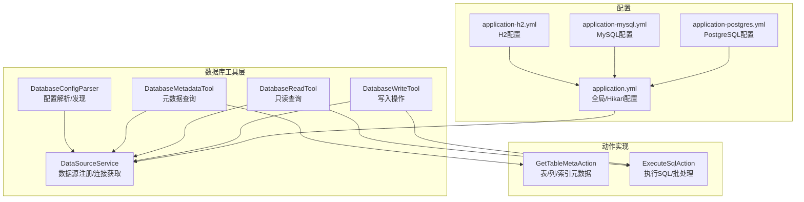
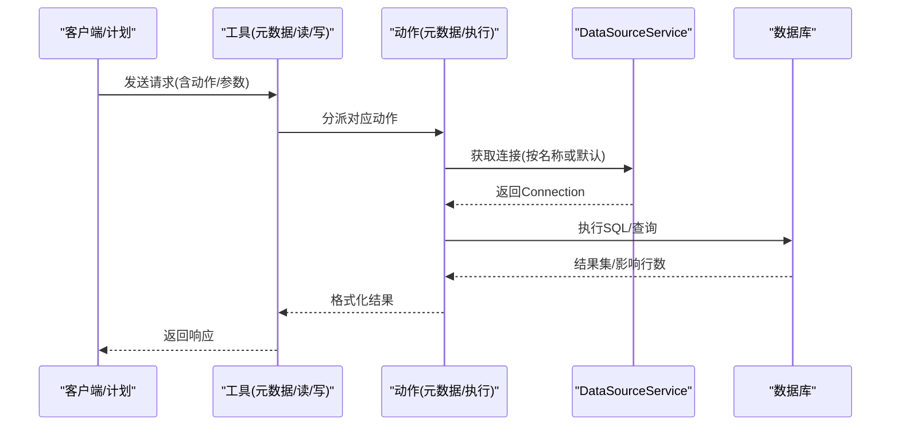
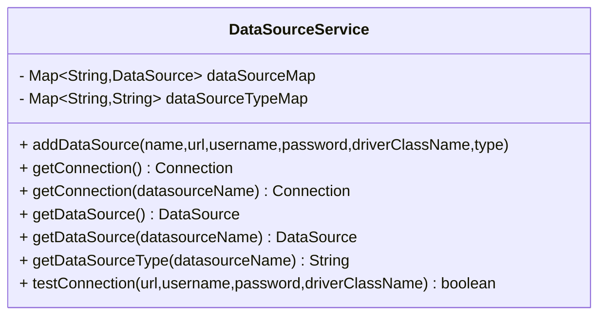
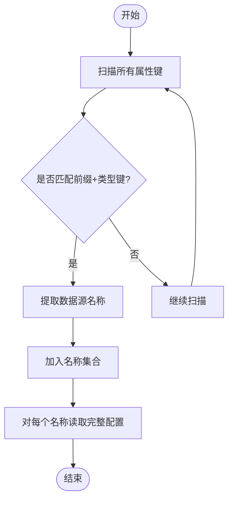
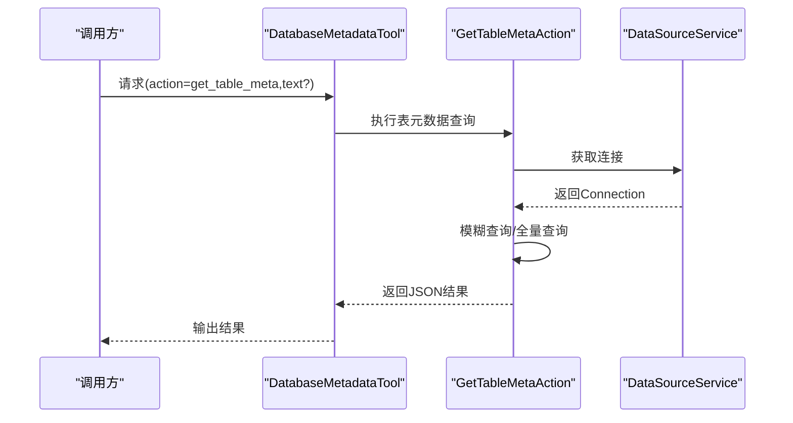
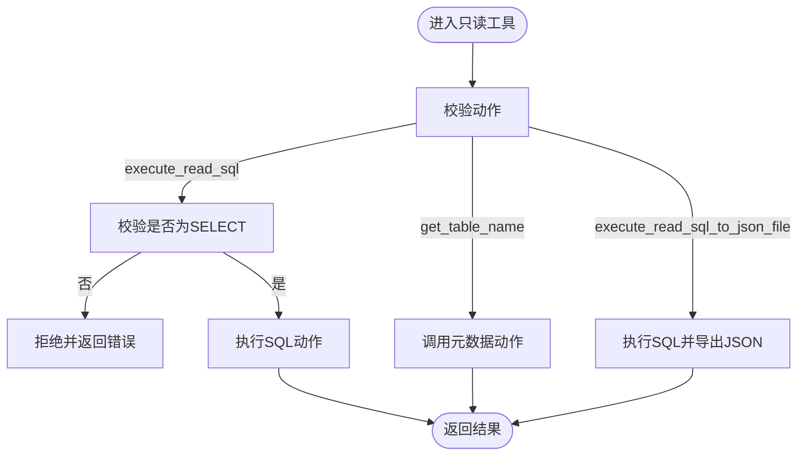
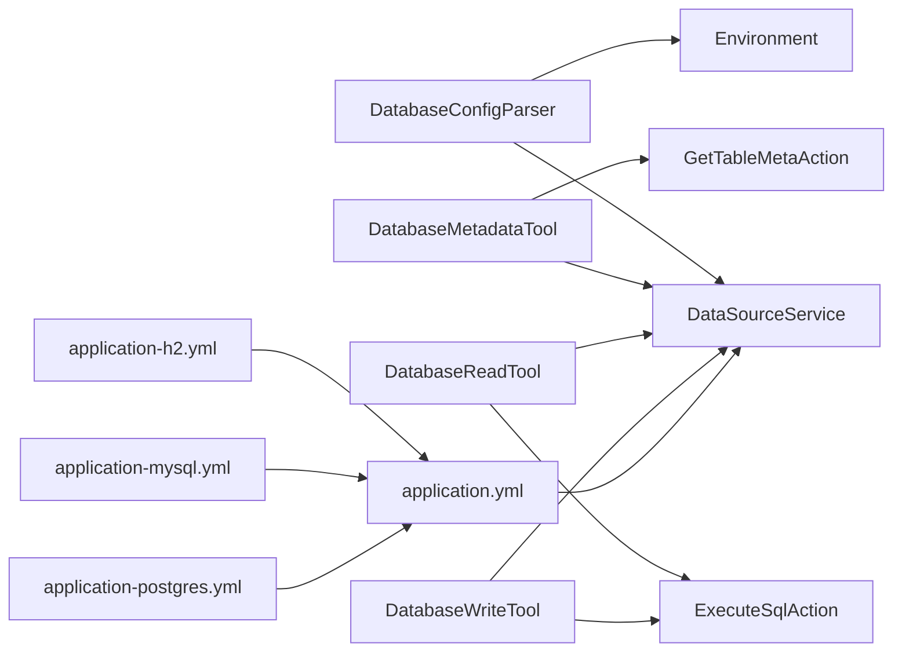

# 数据库问题排查

<cite>
**本文引用的文件**
- [DataSourceService.java](file://src/main/java/com/alibaba/cloud/ai/lynxe/tool/database/DataSourceService.java)
- [DatabaseConfigConstants.java](file://src/main/java/com/alibaba/cloud/ai/lynxe/tool/database/DatabaseConfigConstants.java)
- [DatabaseConfigParser.java](file://src/main/java/com/alibaba/cloud/ai/lynxe/tool/database/DatabaseConfigParser.java)
- [DatabaseMetadataTool.java](file://src/main/java/com/alibaba/cloud/ai/lynxe/tool/database/DatabaseMetadataTool.java)
- [DatabaseReadTool.java](file://src/main/java/com/alibaba/cloud/ai/lynxe/tool/database/DatabaseReadTool.java)
- [DatabaseWriteTool.java](file://src/main/java/com/alibaba/cloud/ai/lynxe/tool/database/DatabaseWriteTool.java)
- [GetTableMetaAction.java](file://src/main/java/com/alibaba/cloud/ai/lynxe/tool/database/action/GetTableMetaAction.java)
- [ExecuteSqlAction.java](file://src/main/java/com/alibaba/cloud/ai/lynxe/tool/database/action/ExecuteSqlAction.java)
- [application.yml](file://src/main/resources/application.yml)
- [application-h2.yml](file://src/main/resources/application-h2.yml)
- [application-mysql.yml](file://src/main/resources/application-mysql.yml)
- [application-postgres.yml](file://src/main/resources/application-postgres.yml)
</cite>

## 目录
1. [简介](#简介)
2. [项目结构](#项目结构)
3. [核心组件](#核心组件)
4. [架构总览](#架构总览)
5. [详细组件分析](#详细组件分析)
6. [依赖关系分析](#依赖关系分析)
7. [性能与连接池](#性能与连接池)
8. [故障排查指南](#故障排查指南)
9. [结论](#结论)
10. [附录](#附录)

## 简介
本文件面向Lynxe数据库问题排查，聚焦以下主题：
- 数据库连接问题、SQL执行错误与事务处理异常的诊断方法
- H2、MySQL、PostgreSQL的配置差异与连接池管理
- 元数据查询、表结构变更与索引优化策略
- 备份恢复、数据迁移与版本升级流程
- 慢查询分析、锁等待检测与死锁预防
- 监控指标、性能调优与容量规划建议

目标是帮助运维与开发人员快速定位并解决数据库相关问题，同时理解系统如何在不同数据库间切换与适配。

## 项目结构
围绕数据库能力的关键模块位于工具包“tool.database”下，核心包括：
- 数据源服务：统一管理多数据源、连接获取与连通性测试
- 配置解析：从环境变量动态发现与解析多数据源配置
- 工具封装：元数据查询、只读读取、写入操作三大工具
- 动作实现：具体SQL动作（如获取表元数据、执行SQL）
- 配置文件：默认H2、以及可选的MySQL与PostgreSQL配置

图表来源
- [DataSourceService.java:1-215](file://src/main/java/com/alibaba/cloud/ai/lynxe/tool/database/DataSourceService.java#L1-L215)
- [DatabaseConfigParser.java:1-194](file://src/main/java/com/alibaba/cloud/ai/lynxe/tool/database/DatabaseConfigParser.java#L1-L194)
- [DatabaseMetadataTool.java:1-188](file://src/main/java/com/alibaba/cloud/ai/lynxe/tool/database/DatabaseMetadataTool.java#L1-L188)
- [DatabaseReadTool.java:1-166](file://src/main/java/com/alibaba/cloud/ai/lynxe/tool/database/DatabaseReadTool.java#L1-L166)
- [DatabaseWriteTool.java:1-142](file://src/main/java/com/alibaba/cloud/ai/lynxe/tool/database/DatabaseWriteTool.java#L1-L142)
- [GetTableMetaAction.java:1-222](file://src/main/java/com/alibaba/cloud/ai/lynxe/tool/database/action/GetTableMetaAction.java#L1-L222)
- [ExecuteSqlAction.java:1-365](file://src/main/java/com/alibaba/cloud/ai/lynxe/tool/database/action/ExecuteSqlAction.java#L1-L365)
- [application.yml:1-97](file://src/main/resources/application.yml#L1-L97)
- [application-h2.yml:1-23](file://src/main/resources/application-h2.yml#L1-L23)
- [application-mysql.yml:1-15](file://src/main/resources/application-mysql.yml#L1-L15)
- [application-postgres.yml:1-15](file://src/main/resources/application-postgres.yml#L1-L15)

章节来源
- [application.yml:1-97](file://src/main/resources/application.yml#L1-L97)
- [application-h2.yml:1-23](file://src/main/resources/application-h2.yml#L1-L23)
- [application-mysql.yml:1-15](file://src/main/resources/application-mysql.yml#L1-L15)
- [application-postgres.yml:1-15](file://src/main/resources/application-postgres.yml#L1-L15)

## 核心组件
- 数据源服务（DataSourceService）
  - 支持按名称注册多个数据源，提供默认与指定名称的连接获取
  - 提供连通性测试方法，便于快速验证配置
  - 维护数据源类型映射，用于区分H2/MySQL/PostgreSQL等
- 配置解析器（DatabaseConfigParser）
  - 基于前缀扫描环境变量，自动发现多数据源配置键
  - 解析出每个数据源的类型、URL、驱动、用户名、密码等
- 元数据工具（DatabaseMetadataTool）
  - 支持获取表元数据、索引信息、数据源信息
  - 内置模糊匹配与回退逻辑，提升可用性
- 只读工具（DatabaseReadTool）
  - 限制仅执行SELECT语句，支持将结果导出到JSON文件
- 写入工具（DatabaseWriteTool）
  - 执行写入SQL，内部委托SQL执行动作
- SQL动作（GetTableMetaAction、ExecuteSqlAction）
  - 元数据动作：分步查询表、列、索引，并序列化输出
  - 执行动作：支持参数化单行/批量执行，兼容传统语句；格式化结果集输出

章节来源
- [DataSourceService.java:1-215](file://src/main/java/com/alibaba/cloud/ai/lynxe/tool/database/DataSourceService.java#L1-L215)
- [DatabaseConfigParser.java:1-194](file://src/main/java/com/alibaba/cloud/ai/lynxe/tool/database/DatabaseConfigParser.java#L1-L194)
- [DatabaseMetadataTool.java:1-188](file://src/main/java/com/alibaba/cloud/ai/lynxe/tool/database/DatabaseMetadataTool.java#L1-L188)
- [DatabaseReadTool.java:1-166](file://src/main/java/com/alibaba/cloud/ai/lynxe/tool/database/DatabaseReadTool.java#L1-L166)
- [DatabaseWriteTool.java:1-142](file://src/main/java/com/alibaba/cloud/ai/lynxe/tool/database/DatabaseWriteTool.java#L1-L142)
- [GetTableMetaAction.java:1-222](file://src/main/java/com/alibaba/cloud/ai/lynxe/tool/database/action/GetTableMetaAction.java#L1-L222)
- [ExecuteSqlAction.java:1-365](file://src/main/java/com/alibaba/cloud/ai/lynxe/tool/database/action/ExecuteSqlAction.java#L1-L365)

## 架构总览
系统通过配置文件选择数据库后端，运行时由DataSourceService统一管理连接；工具层根据请求动作调用相应动作实现，最终访问数据库并返回结构化结果。

图表来源
- [DatabaseMetadataTool.java:82-117](file://src/main/java/com/alibaba/cloud/ai/lynxe/tool/database/DatabaseMetadataTool.java#L82-L117)
- [DatabaseReadTool.java:87-120](file://src/main/java/com/alibaba/cloud/ai/lynxe/tool/database/DatabaseReadTool.java#L87-L120)
- [DatabaseWriteTool.java:78-96](file://src/main/java/com/alibaba/cloud/ai/lynxe/tool/database/DatabaseWriteTool.java#L78-L96)
- [GetTableMetaAction.java:53-219](file://src/main/java/com/alibaba/cloud/ai/lynxe/tool/database/action/GetTableMetaAction.java#L53-L219)
- [ExecuteSqlAction.java:39-273](file://src/main/java/com/alibaba/cloud/ai/lynxe/tool/database/action/ExecuteSqlAction.java#L39-L273)
- [DataSourceService.java:85-91](file://src/main/java/com/alibaba/cloud/ai/lynxe/tool/database/DataSourceService.java#L85-L91)

## 详细组件分析

### 数据源服务（DataSourceService）
- 设计要点
  - 使用并发安全的映射保存数据源与类型
  - 支持按名称获取连接，默认返回首个可用数据源
  - 提供连通性测试方法，便于在配置阶段快速验证
- 关键行为
  - 注册：接收URL、用户名、密码、驱动类名，创建数据源并登记类型
  - 查询：按名称或默认获取连接；不存在时抛出明确异常
  - 类型：记录并查询数据源类型，用于SQL方言与元数据适配
  - 测试：临时构造数据源尝试建立连接，返回布尔结果

图表来源
- [DataSourceService.java:32-215](file://src/main/java/com/alibaba/cloud/ai/lynxe/tool/database/DataSourceService.java#L32-L215)

章节来源
- [DataSourceService.java:1-215](file://src/main/java/com/alibaba/cloud/ai/lynxe/tool/database/DataSourceService.java#L1-L215)

### 配置解析器（DatabaseConfigParser）
- 设计要点
  - 基于固定前缀扫描所有属性键，识别形如“database_use.datasource.{name}.type”的键
  - 抽取数据源名称，拼装完整配置项（type/url/driver/username/password/enable）
- 关键行为
  - 发现：遍历所有属性源，提取符合模式的键，去重得到名称集合
  - 解析：对每个名称读取全部配置项，组装为映射
  - 单个：按名称返回该数据源的配置映射

图表来源
- [DatabaseConfigParser.java:44-167](file://src/main/java/com/alibaba/cloud/ai/lynxe/tool/database/DatabaseConfigParser.java#L44-L167)

章节来源
- [DatabaseConfigParser.java:1-194](file://src/main/java/com/alibaba/cloud/ai/lynxe/tool/database/DatabaseConfigParser.java#L1-L194)
- [DatabaseConfigConstants.java:1-50](file://src/main/java/com/alibaba/cloud/ai/lynxe/tool/database/DatabaseConfigConstants.java#L1-L50)

### 元数据工具（DatabaseMetadataTool）
- 设计要点
  - 将动作委派给具体动作类（表元数据、索引、数据源信息）
  - 在无匹配表时回退到全量查询，提升可用性
  - 提供当前状态字符串，包含已配置数据源、默认类型与连接状态
- 关键行为
  - 表元数据：先按文本模糊查询，失败则全量查询
  - 索引信息：基于表名集合批量查询索引并关联列
  - 数据源信息：返回当前可用数据源列表与类型

图表来源
- [DatabaseMetadataTool.java:83-117](file://src/main/java/com/alibaba/cloud/ai/lynxe/tool/database/DatabaseMetadataTool.java#L83-L117)
- [GetTableMetaAction.java:53-219](file://src/main/java/com/alibaba/cloud/ai/lynxe/tool/database/action/GetTableMetaAction.java#L53-L219)
- [DataSourceService.java:85-91](file://src/main/java/com/alibaba/cloud/ai/lynxe/tool/database/DataSourceService.java#L85-L91)

章节来源
- [DatabaseMetadataTool.java:1-188](file://src/main/java/com/alibaba/cloud/ai/lynxe/tool/database/DatabaseMetadataTool.java#L1-L188)
- [GetTableMetaAction.java:1-222](file://src/main/java/com/alibaba/cloud/ai/lynxe/tool/database/action/GetTableMetaAction.java#L1-L222)

### 只读工具（DatabaseReadTool）
- 设计要点
  - 严格限制为只读：非SELECT语句直接拒绝
  - 支持将查询结果导出为JSON文件，便于离线分析
- 关键行为
  - 执行SQL：参数化单行/批量执行，兼容传统语句
  - 获取表名：基于元数据动作查询
  - 导出JSON：将结果写入受控目录

图表来源
- [DatabaseReadTool.java:87-120](file://src/main/java/com/alibaba/cloud/ai/lynxe/tool/database/DatabaseReadTool.java#L87-L120)
- [ExecuteSqlAction.java:39-273](file://src/main/java/com/alibaba/cloud/ai/lynxe/tool/database/action/ExecuteSqlAction.java#L39-L273)

章节来源
- [DatabaseReadTool.java:1-166](file://src/main/java/com/alibaba/cloud/ai/lynxe/tool/database/DatabaseReadTool.java#L1-L166)
- [ExecuteSqlAction.java:1-365](file://src/main/java/com/alibaba/cloud/ai/lynxe/tool/database/action/ExecuteSqlAction.java#L1-L365)

### 写入工具（DatabaseWriteTool）
- 设计要点
  - 仅支持写入动作，内部复用SQL执行动作
  - 通过参数化执行降低注入风险
- 关键行为
  - 执行写入：委托ExecuteSqlAction完成
  - 状态输出：列出当前可用数据源

章节来源
- [DatabaseWriteTool.java:1-142](file://src/main/java/com/alibaba/cloud/ai/lynxe/tool/database/DatabaseWriteTool.java#L1-L142)
- [ExecuteSqlAction.java:1-365](file://src/main/java/com/alibaba/cloud/ai/lynxe/tool/database/action/ExecuteSqlAction.java#L1-L365)

### SQL动作实现（GetTableMetaAction）
- 设计要点
  - 分三步：表信息 → 列信息 → 索引信息，使用IN子句批量查询
  - 对表注释字段进行跨数据库兼容处理（优先TABLE_COMMENT，回退REMARKS）
  - 将结果序列化为JSON返回
- 关键行为
  - 生成SQL：依据数据源类型生成方言SQL
  - 批量查询：构建占位符串，一次性查询多表元数据
  - 结果聚合：将列与索引挂载到对应表上

章节来源
- [GetTableMetaAction.java:1-222](file://src/main/java/com/alibaba/cloud/ai/lynxe/tool/database/action/GetTableMetaAction.java#L1-L222)

### SQL动作实现（ExecuteSqlAction）
- 设计要点
  - 参数化执行：支持单行与批量两种模式
  - 结果格式化：将结果集转为Markdown表格，空结果返回列头声明
  - 错误处理：捕获SQL异常并返回可读错误信息
- 关键行为
  - 占位符计数：简单统计“?”数量，用于参数校验
  - 批处理：逐行设置参数并加入批次，最后统一执行
  - 传统语句：按分号拆分多条语句顺序执行

章节来源
- [ExecuteSqlAction.java:1-365](file://src/main/java/com/alibaba/cloud/ai/lynxe/tool/database/action/ExecuteSqlAction.java#L1-L365)

## 依赖关系分析
- 工具层依赖
  - DatabaseMetadataTool/DatabaseReadTool/DatabaseWriteTool均依赖DataSourceService
  - 元数据工具依赖GetTableMetaAction；读写工具依赖ExecuteSqlAction
- 配置层依赖
  - DatabaseConfigParser依赖Environment扫描属性
  - DataSourceService在运行期被工具层调用
- 配置文件依赖
  - application.yml定义全局Hikari连接池参数
  - application-{h2,mysql,postgres}.yml定义数据库URL、驱动、方言与DDL策略

图表来源
- [DatabaseConfigParser.java:37-191](file://src/main/java/com/alibaba/cloud/ai/lynxe/tool/database/DatabaseConfigParser.java#L37-L191)
- [DatabaseMetadataTool.java:44-49](file://src/main/java/com/alibaba/cloud/ai/lynxe/tool/database/DatabaseMetadataTool.java#L44-L49)
- [DatabaseReadTool.java:47-52](file://src/main/java/com/alibaba/cloud/ai/lynxe/tool/database/DatabaseReadTool.java#L47-L52)
- [DatabaseWriteTool.java:40-44](file://src/main/java/com/alibaba/cloud/ai/lynxe/tool/database/DatabaseWriteTool.java#L40-L44)
- [application.yml:20-30](file://src/main/resources/application.yml#L20-L30)
- [application-h2.yml:1-23](file://src/main/resources/application-h2.yml#L1-L23)
- [application-mysql.yml:1-15](file://src/main/resources/application-mysql.yml#L1-L15)
- [application-postgres.yml:1-15](file://src/main/resources/application-postgres.yml#L1-L15)

章节来源
- [DatabaseConfigParser.java:1-194](file://src/main/java/com/alibaba/cloud/ai/lynxe/tool/database/DatabaseConfigParser.java#L1-L194)
- [application.yml:1-97](file://src/main/resources/application.yml#L1-L97)

## 性能与连接池
- Hikari连接池参数（application.yml）
  - 最大池大小、最小空闲、连接超时、空闲超时、最大生存时间、验证超时、泄漏检测阈值
  - 连接测试查询：SELECT 1
  - 池名称：Lynxe-{profile}-Pool
- 数据库方言与DDL
  - H2：H2Dialect，DDL自动更新
  - MySQL：MySQLDialect，DDL自动更新
  - PostgreSQL：PostgreSQLDialect，DDL自动更新
- 工具层性能建议
  - 优先使用参数化执行，减少SQL注入风险与编译开销
  - 批量写入使用ExecuteSqlAction的批处理模式
  - 元数据查询使用IN子句批量查询，减少往返

章节来源
- [application.yml:20-38](file://src/main/resources/application.yml#L20-L38)
- [application-h2.yml:13-18](file://src/main/resources/application-h2.yml#L13-L18)
- [application-mysql.yml:7-11](file://src/main/resources/application-mysql.yml#L7-L11)
- [application-postgres.yml:11-15](file://src/main/resources/application-postgres.yml#L11-L15)
- [ExecuteSqlAction.java:63-176](file://src/main/java/com/alibaba/cloud/ai/lynxe/tool/database/action/ExecuteSqlAction.java#L63-L176)
- [GetTableMetaAction.java:112-152](file://src/main/java/com/alibaba/cloud/ai/lynxe/tool/database/action/GetTableMetaAction.java#L112-L152)

## 故障排查指南

### 一、数据库连接问题
- 现象
  - 工具提示“无可用数据源”或“数据源未找到”
  - 连接测试失败
- 排查步骤
  - 检查配置文件是否正确加载对应profile（H2/MySQL/PostgreSQL）
  - 使用DataSourceService的连通性测试方法验证URL、驱动、凭据
  - 查看工具状态输出，确认默认数据源类型与连接状态
- 建议
  - 在启动阶段增加连接测试与日志输出
  - 对多数据源场景，显式传入数据源名称以避免歧义

章节来源
- [DataSourceService.java:72-91](file://src/main/java/com/alibaba/cloud/ai/lynxe/tool/database/DataSourceService.java#L72-L91)
- [DataSourceService.java:192-212](file://src/main/java/com/alibaba/cloud/ai/lynxe/tool/database/DataSourceService.java#L192-L212)
- [DatabaseMetadataTool.java:134-180](file://src/main/java/com/alibaba/cloud/ai/lynxe/tool/database/DatabaseMetadataTool.java#L134-L180)

### 二、SQL执行错误
- 现象
  - 参数数量不匹配、占位符计数异常
  - 批处理中某行参数缺失或类型不符
  - 传统语句执行失败（语法错误、权限不足）
- 排查步骤
  - 核对SQL中的“?”占位符数量与提供的参数个数
  - 批处理模式下确保每行参数均为列表且长度一致
  - 对只读工具，确认SQL以SELECT开头
- 建议
  - 在调用前打印SQL与参数摘要，便于人工核对
  - 对复杂写入，先在数据库控制台验证

章节来源
- [ExecuteSqlAction.java:79-86](file://src/main/java/com/alibaba/cloud/ai/lynxe/tool/database/action/ExecuteSqlAction.java#L79-L86)
- [ExecuteSqlAction.java:184-192](file://src/main/java/com/alibaba/cloud/ai/lynxe/tool/database/action/ExecuteSqlAction.java#L184-L192)
- [ExecuteSqlAction.java:238-273](file://src/main/java/com/alibaba/cloud/ai/lynxe/tool/database/action/ExecuteSqlAction.java#L238-L273)
- [DatabaseReadTool.java:96-101](file://src/main/java/com/alibaba/cloud/ai/lynxe/tool/database/DatabaseReadTool.java#L96-L101)

### 三、事务处理异常
- 现象
  - 批处理部分失败但部分已生效
  - 并发写入导致唯一约束冲突
- 排查步骤
  - 检查批处理执行返回的影响行数组，定位失败批次
  - 核对唯一索引与业务幂等设计
  - 观察连接池参数，避免长时间事务占用连接
- 建议
  - 将批处理拆分为更小批次，提高可恢复性
  - 对高并发写入，使用幂等键与重试机制

章节来源
- [ExecuteSqlAction.java:150-161](file://src/main/java/com/alibaba/cloud/ai/lynxe/tool/database/action/ExecuteSqlAction.java#L150-L161)

### 四、数据库配置差异与切换
- H2
  - 方言：H2Dialect
  - DDL：自动更新
  - 控制台：开启并暴露路径
- MySQL
  - 方言：MySQLDialect
  - DDL：自动更新
- PostgreSQL
  - 方言：PostgreSQLDialect
  - DDL：自动更新
- 切换方式
  - 通过profiles激活对应配置文件
  - 如需多数据源，使用DatabaseConfigParser自动发现并注册

章节来源
- [application-h2.yml:13-23](file://src/main/resources/application-h2.yml#L13-L23)
- [application-mysql.yml:7-11](file://src/main/resources/application-mysql.yml#L7-L11)
- [application-postgres.yml:11-15](file://src/main/resources/application-postgres.yml#L11-L15)
- [DatabaseConfigParser.java:44-69](file://src/main/java/com/alibaba/cloud/ai/lynxe/tool/database/DatabaseConfigParser.java#L44-L69)

### 五、元数据查询与表结构变更
- 元数据查询
  - 使用DatabaseMetadataTool的“get_table_meta”动作
  - 支持模糊匹配与全量回退
- 表结构变更
  - 建议在测试环境先行验证DDL
  - 对生产变更采用灰度发布与回滚预案
- 索引优化
  - 基于GetTableMetaAction输出的索引信息，评估覆盖度与冗余
  - 针对高频过滤/连接列补充必要索引

章节来源
- [DatabaseMetadataTool.java:90-104](file://src/main/java/com/alibaba/cloud/ai/lynxe/tool/database/DatabaseMetadataTool.java#L90-L104)
- [GetTableMetaAction.java:151-203](file://src/main/java/com/alibaba/cloud/ai/lynxe/tool/database/action/GetTableMetaAction.java#L151-L203)

### 六、备份恢复、迁移与版本升级
- 备份恢复
  - H2：文件级备份（数据库文件与日志）
  - MySQL/PostgreSQL：使用官方逻辑备份工具
- 数据迁移
  - 使用DatabaseReadTool将查询结果导出为JSON文件，作为中间介质
  - 在目标库执行写入工具导入
- 版本升级
  - 先在测试环境验证DDL与应用配置
  - 逐步替换profile并观察连接池与SQL行为

章节来源
- [DatabaseReadTool.java:104-111](file://src/main/java/com/alibaba/cloud/ai/lynxe/tool/database/DatabaseReadTool.java#L104-L111)
- [DatabaseWriteTool.java:78-96](file://src/main/java/com/alibaba/cloud/ai/lynxe/tool/database/DatabaseWriteTool.java#L78-L96)

### 七、慢查询分析、锁等待与死锁预防
- 慢查询
  - 使用DatabaseReadTool导出结果并结合数据库慢查询日志定位
  - 对大结果集分页查询或限制返回行数
- 锁等待
  - 观察连接池占用情况，避免长事务
  - 对热点表使用读写分离或缓存
- 死锁预防
  - 统一更新顺序，避免循环依赖
  - 缩短事务范围，尽早提交

章节来源
- [ExecuteSqlAction.java:275-335](file://src/main/java/com/alibaba/cloud/ai/lynxe/tool/database/action/ExecuteSqlAction.java#L275-L335)

### 八、监控指标、性能调优与容量规划
- 监控指标
  - 连接池活跃/空闲/等待/泄漏计数
  - SQL执行耗时分布与错误率
- 性能调优
  - 合理设置最大池大小与空闲超时
  - 使用参数化与批处理减少编译与往返
- 容量规划
  - 基于峰值QPS与平均响应时间估算连接池规模
  - 预留缓冲应对突发流量

章节来源
- [application.yml:20-30](file://src/main/resources/application.yml#L20-L30)

## 结论
Lynxe通过统一的数据源服务与工具化的数据库能力，提供了连接管理、元数据查询、SQL执行与导出等完整能力。针对不同数据库后端，系统具备良好的可插拔性与可配置性。建议在生产环境中：
- 强化连接测试与状态监控
- 严格参数化与批处理
- 建立完善的备份、迁移与升级流程
- 持续关注慢查询与锁等待，优化索引与事务设计

## 附录
- 快速检查清单
  - 配置文件是否正确加载（H2/MySQL/PostgreSQL）
  - 数据源名称是否正确传递
  - SQL是否为SELECT（只读工具）
  - 参数个数与占位符是否一致
  - 连接池参数是否合理
  - 元数据查询是否成功返回