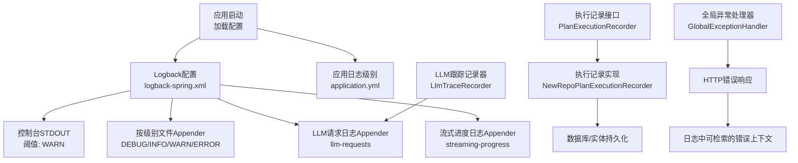
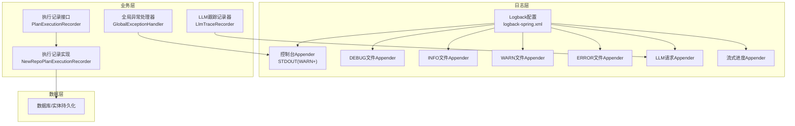
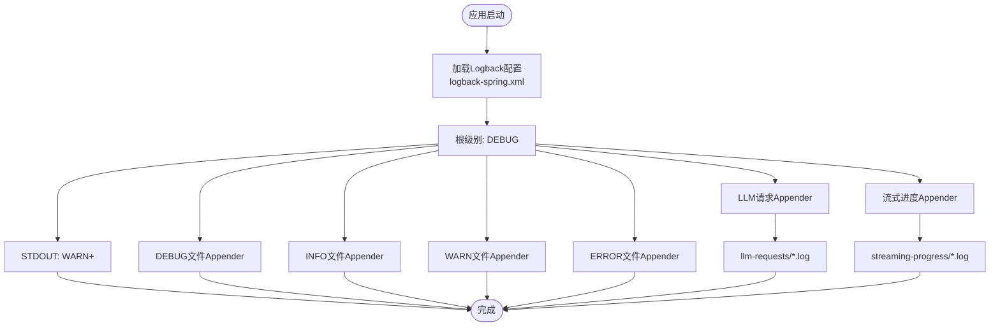
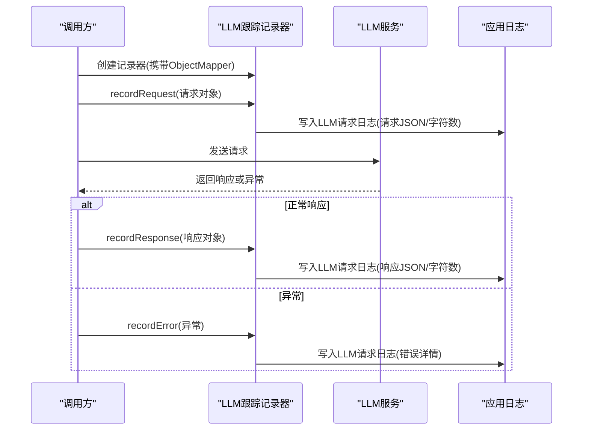
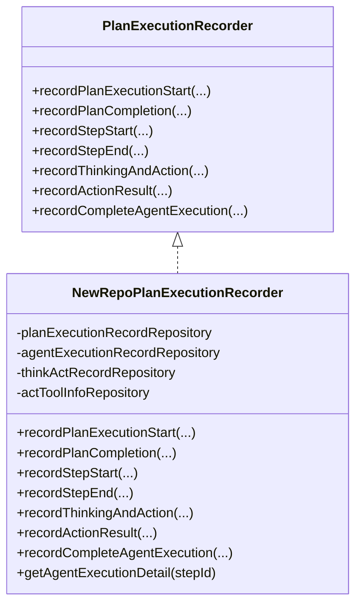
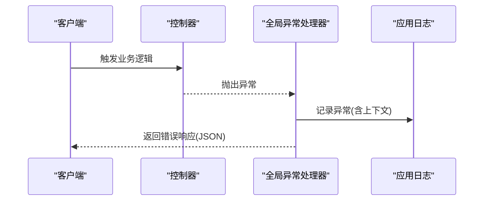
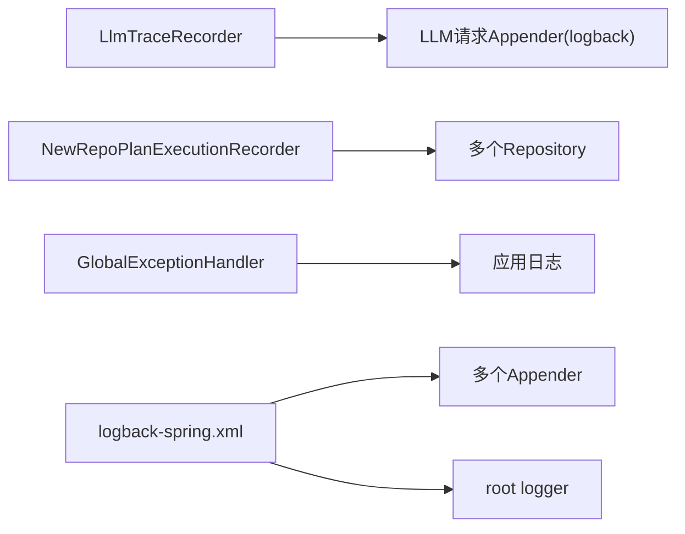

# 日志分析与监控

<cite>
**本文引用的文件**
- [logback-spring.xml](file://src/main/resources/logback-spring.xml)
- [application.yml](file://src/main/resources/application.yml)
- [LlmTraceRecorder.java](file://src/main/java/com/alibaba/cloud/ai/lynxe/llm/LlmTraceRecorder.java)
- [PlanExecutionRecorder.java](file://src/main/java/com/alibaba/cloud/ai/lynxe/recorder/service/PlanExecutionRecorder.java)
- [NewRepoPlanExecutionRecorder.java](file://src/main/java/com/alibaba/cloud/ai/lynxe/recorder/service/NewRepoPlanExecutionRecorder.java)
- [GlobalExceptionHandler.java](file://src/main/java/com/alibaba/cloud/ai/lynxe/exception/handler/GlobalExceptionHandler.java)
</cite>

## 目录
1. [简介](#简介)
2. [项目结构](#项目结构)
3. [核心组件](#核心组件)
4. [架构总览](#架构总览)
5. [详细组件分析](#详细组件分析)
6. [依赖分析](#依赖分析)
7. [性能考量](#性能考量)
8. [故障排查指南](#故障排查指南)
9. [结论](#结论)
10. [附录](#附录)

## 简介
本文件面向Lynxe的日志分析与监控，聚焦以下主题：
- Logback配置、日志级别与格式定制
- LLM跟踪记录器的使用与调试信息收集
- 执行记录序列化与持久化流程
- 性能指标监控与系统健康检查建议
- 日志文件位置、轮转策略与存储管理
- 日志查询技巧、关键指标解读与异常模式识别
- 监控告警配置、性能基准测试与容量规划方法

## 项目结构
围绕日志与监控的关键文件分布如下：
- 日志配置：logback-spring.xml（定义控制台与多文件Appender、按级别分桶、LLM专用日志Appender）
- 应用日志级别：application.yml（根级别与包级别日志级别）
- LLM追踪：LlmTraceRecorder（请求/响应/错误的结构化记录）
- 执行记录：PlanExecutionRecorder接口与NewRepoPlanExecutionRecorder实现（计划/思考-行动/工具调用的序列化与持久化）
- 全局异常处理：GlobalExceptionHandler（统一异常输出，便于日志关联）

图表来源
- [logback-spring.xml:1-185](file://src/main/resources/logback-spring.xml#L1-L185)
- [application.yml:46-58](file://src/main/resources/application.yml#L46-L58)
- [LlmTraceRecorder.java:31-156](file://src/main/java/com/alibaba/cloud/ai/lynxe/llm/LlmTraceRecorder.java#L31-L156)
- [PlanExecutionRecorder.java:26-242](file://src/main/java/com/alibaba/cloud/ai/lynxe/recorder/service/PlanExecutionRecorder.java#L26-L242)
- [NewRepoPlanExecutionRecorder.java:48-857](file://src/main/java/com/alibaba/cloud/ai/lynxe/recorder/service/NewRepoPlanExecutionRecorder.java#L48-L857)
- [GlobalExceptionHandler.java:32-69](file://src/main/java/com/alibaba/cloud/ai/lynxe/exception/handler/GlobalExceptionHandler.java#L32-L69)

章节来源
- [logback-spring.xml:1-185](file://src/main/resources/logback-spring.xml#L1-L185)
- [application.yml:1-97](file://src/main/resources/application.yml#L1-L97)

## 核心组件
- Logback配置与Appender
  - 控制台输出：仅输出WARN及以上级别，避免噪声干扰
  - 按级别滚动文件：DEBUG/INFO/WARN/ERROR四类日志分别落盘，支持按日期与大小轮转
  - LLM请求日志：独立Appender，记录请求/响应与字符计数，便于成本与性能分析
  - 流式进度日志：独立Appender，记录流式响应进度
  - MyBatis与数据库相关日志：按需开启DEBUG级别，便于SQL问题定位
- 应用日志级别
  - 根级别默认INFO；特定包（如agent、llm、工具等）提升至DEBUG，便于开发与排障
- LLM跟踪记录器
  - 基于请求ID串联请求、响应与错误，自动统计输入/输出字符数
  - 使用专用SLF4J Logger名称，确保路由到LLM请求日志Appender
- 执行记录器
  - 接口定义了计划/步骤/思考-行动/工具调用的生命周期记录方法
  - 实现负责将执行状态写入数据库实体，并维护层级关系与最终完成态
- 全局异常处理
  - 统一捕获未预期异常，返回JSON错误体，便于日志与告警联动

章节来源
- [logback-spring.xml:18-185](file://src/main/resources/logback-spring.xml#L18-L185)
- [application.yml:46-58](file://src/main/resources/application.yml#L46-L58)
- [LlmTraceRecorder.java:31-156](file://src/main/java/com/alibaba/cloud/ai/lynxe/llm/LlmTraceRecorder.java#L31-L156)
- [PlanExecutionRecorder.java:26-242](file://src/main/java/com/alibaba/cloud/ai/lynxe/recorder/service/PlanExecutionRecorder.java#L26-L242)
- [NewRepoPlanExecutionRecorder.java:48-857](file://src/main/java/com/alibaba/cloud/ai/lynxe/recorder/service/NewRepoPlanExecutionRecorder.java#L48-L857)
- [GlobalExceptionHandler.java:32-69](file://src/main/java/com/alibaba/cloud/ai/lynxe/exception/handler/GlobalExceptionHandler.java#L32-L69)

## 架构总览
下图展示日志与监控在系统中的交互关系：

图表来源
- [logback-spring.xml:18-185](file://src/main/resources/logback-spring.xml#L18-L185)
- [LlmTraceRecorder.java:31-156](file://src/main/java/com/alibaba/cloud/ai/lynxe/llm/LlmTraceRecorder.java#L31-L156)
- [PlanExecutionRecorder.java:26-242](file://src/main/java/com/alibaba/cloud/ai/lynxe/recorder/service/PlanExecutionRecorder.java#L26-L242)
- [NewRepoPlanExecutionRecorder.java:48-857](file://src/main/java/com/alibaba/cloud/ai/lynxe/recorder/service/NewRepoPlanExecutionRecorder.java#L48-L857)
- [GlobalExceptionHandler.java:32-69](file://src/main/java/com/alibaba/cloud/ai/lynxe/exception/handler/GlobalExceptionHandler.java#L32-L69)

## 详细组件分析

### Logback配置与日志级别
- 控制台输出
  - 通过阈值过滤器仅输出WARN及以上级别，降低控制台噪声
- 按级别文件输出
  - DEBUG/INFO/WARN/ERROR四个Appender，分别写入不同子目录，便于按严重程度筛选
  - 轮转策略：基于日期与文件大小，限制单日志文件最大尺寸与总归档保留天数/总量
- LLM与流式日志
  - LLM请求日志Appender：独立文件命名与编码，记录请求/响应与字符计数
  - 流式进度日志Appender：独立文件命名，记录流式响应进度
- 包级别日志
  - application.yml中对特定包设置DEBUG级别，便于开发与排障

图表来源
- [logback-spring.xml:3-185](file://src/main/resources/logback-spring.xml#L3-L185)

章节来源
- [logback-spring.xml:3-185](file://src/main/resources/logback-spring.xml#L3-L185)
- [application.yml:46-58](file://src/main/resources/application.yml#L46-L58)

### LLM跟踪记录器
- 功能要点
  - 为每次请求生成唯一请求ID，贯穿请求、响应与错误记录
  - 自动统计输入消息字符数（跳过非文本内容），记录输出响应字符数
  - 对WebClient异常进行结构化记录，包含状态码、响应体与URL
- 日志路由
  - 使用专用Logger名称，确保被LLM请求Appender消费
- 调试建议
  - 在application.yml中将相关包级别临时提升至DEBUG，结合LLM请求日志快速定位问题

图表来源
- [LlmTraceRecorder.java:31-156](file://src/main/java/com/alibaba/cloud/ai/lynxe/llm/LlmTraceRecorder.java#L31-L156)
- [logback-spring.xml:114-126](file://src/main/resources/logback-spring.xml#L114-L126)

章节来源
- [LlmTraceRecorder.java:31-156](file://src/main/java/com/alibaba/cloud/ai/lynxe/llm/LlmTraceRecorder.java#L31-L156)
- [logback-spring.xml:114-126](file://src/main/resources/logback-spring.xml#L114-L126)

### 执行记录序列化与持久化
- 接口职责
  - 定义计划开始/结束、步骤开始/结束、思考-行动、动作结果、完整代理执行等生命周期方法
- 实现逻辑
  - 将执行上下文映射为实体，维护层级关系（当前计划/父计划/根计划）
  - 记录思考-行动阶段的输入/输出与工具调用信息，支持后续查询与回放
  - 提供只读查询以获取代理执行详情（含思考-行动列表）
- 数据一致性
  - 关键操作采用事务性保存，保证执行状态与关系的一致性

图表来源
- [PlanExecutionRecorder.java:26-242](file://src/main/java/com/alibaba/cloud/ai/lynxe/recorder/service/PlanExecutionRecorder.java#L26-L242)
- [NewRepoPlanExecutionRecorder.java:48-857](file://src/main/java/com/alibaba/cloud/ai/lynxe/recorder/service/NewRepoPlanExecutionRecorder.java#L48-L857)

章节来源
- [PlanExecutionRecorder.java:26-242](file://src/main/java/com/alibaba/cloud/ai/lynxe/recorder/service/PlanExecutionRecorder.java#L26-L242)
- [NewRepoPlanExecutionRecorder.java:48-857](file://src/main/java/com/alibaba/cloud/ai/lynxe/recorder/service/NewRepoPlanExecutionRecorder.java#L48-L857)

### 全局异常处理与日志关联
- 统一异常响应
  - 对计划配置异常与通用异常返回结构化错误体，便于前端与日志侧关联
- 日志建议
  - 在异常处理器中记录异常堆栈与请求上下文，结合全局日志级别提升定位效率

图表来源
- [GlobalExceptionHandler.java:32-69](file://src/main/java/com/alibaba/cloud/ai/lynxe/exception/handler/GlobalExceptionHandler.java#L32-L69)

章节来源
- [GlobalExceptionHandler.java:32-69](file://src/main/java/com/alibaba/cloud/ai/lynxe/exception/handler/GlobalExceptionHandler.java#L32-L69)

## 依赖分析
- 组件耦合
  - LLM跟踪记录器与Logback的LLM请求Appender强耦合，确保结构化日志输出
  - 执行记录器实现依赖多个Repository，形成清晰的数据访问层
  - 全局异常处理器与日志输出解耦，通过HTTP响应体与日志共同支撑可观测性
- 外部依赖
  - Logback核心组件（ConsoleAppender、RollingFileAppender、PatternLayoutEncoder）
  - SLF4J Logger名称与Logback Logger配置的对应关系

图表来源
- [logback-spring.xml:18-185](file://src/main/resources/logback-spring.xml#L18-L185)
- [LlmTraceRecorder.java:31-156](file://src/main/java/com/alibaba/cloud/ai/lynxe/llm/LlmTraceRecorder.java#L31-L156)
- [NewRepoPlanExecutionRecorder.java:48-857](file://src/main/java/com/alibaba/cloud/ai/lynxe/recorder/service/NewRepoPlanExecutionRecorder.java#L48-L857)
- [GlobalExceptionHandler.java:32-69](file://src/main/java/com/alibaba/cloud/ai/lynxe/exception/handler/GlobalExceptionHandler.java#L32-L69)

章节来源
- [logback-spring.xml:18-185](file://src/main/resources/logback-spring.xml#L18-L185)
- [LlmTraceRecorder.java:31-156](file://src/main/java/com/alibaba/cloud/ai/lynxe/llm/LlmTraceRecorder.java#L31-L156)
- [NewRepoPlanExecutionRecorder.java:48-857](file://src/main/java/com/alibaba/cloud/ai/lynxe/recorder/service/NewRepoPlanExecutionRecorder.java#L48-L857)
- [GlobalExceptionHandler.java:32-69](file://src/main/java/com/alibaba/cloud/ai/lynxe/exception/handler/GlobalExceptionHandler.java#L32-L69)

## 性能考量
- 日志级别与开销
  - 生产环境建议保持根级别INFO，仅在排障时临时提升至DEBUG
  - 控制台仅输出WARN以上，避免高QPS下的控制台阻塞
- 轮转策略与磁盘占用
  - 合理设置maxFileSize、maxHistory与totalSizeCap，平衡历史保留与磁盘占用
  - LLM请求日志单独归档，避免与普通业务日志混合导致检索困难
- I/O与序列化
  - LLM跟踪记录器对请求/响应进行JSON序列化，建议在高并发场景下关注序列化成本
- 数据库写入
  - 执行记录涉及多表写入与事务，建议评估批量写入与索引策略，避免热点更新

## 故障排查指南
- 快速定位步骤
  - 确认应用日志级别是否满足当前排查需求（application.yml）
  - 检查Logback配置中各Appender是否正确挂载到root
  - 使用请求ID在LLM请求日志中串联请求/响应/错误
  - 结合执行记录器的数据库实体，核对计划/步骤/思考-行动链路
- 常见问题与建议
  - LLM请求无日志：确认Logger名称与Appender绑定、轮转策略未清理当日文件
  - 执行记录缺失：检查事务边界与异常吞吐，必要时开启DEBUG级别
  - 控制台噪声过大：确认ThresholdFilter生效与根级别设置
- 查询技巧
  - 使用请求ID聚合一次会话的所有日志
  - 按时间窗口与级别筛选，缩小范围后再深入
  - 利用字符计数字段评估输入/输出规模，识别异常长尾

章节来源
- [application.yml:46-58](file://src/main/resources/application.yml#L46-L58)
- [logback-spring.xml:18-185](file://src/main/resources/logback-spring.xml#L18-L185)
- [LlmTraceRecorder.java:31-156](file://src/main/java/com/alibaba/cloud/ai/lynxe/llm/LlmTraceRecorder.java#L31-L156)
- [NewRepoPlanExecutionRecorder.java:48-857](file://src/main/java/com/alibaba/cloud/ai/lynxe/recorder/service/NewRepoPlanExecutionRecorder.java#L48-L857)

## 结论
通过Logback的精细化配置、LLM专用日志通道、执行记录器的结构化持久化以及全局异常处理的统一输出，Lynxe构建了覆盖请求全生命周期的日志与监控体系。配合合理的轮转策略与查询实践，可在生产环境中高效定位问题、评估性能并持续优化。

## 附录

### 日志文件位置与轮转策略
- 默认日志根目录：由配置属性决定，通常位于应用工作目录下的logs子目录
- 按级别分桶：
  - debug、info、warn、error各自独立文件，按日期与大小轮转
- LLM请求与流式进度：
  - 单独目录与文件命名，便于专项检索
- 存储管理建议：
  - 设置合理的历史保留天数与总容量上限
  - 定期审计日志体积，必要时调整maxFileSize或增加归档策略

章节来源
- [logback-spring.xml:5-112](file://src/main/resources/logback-spring.xml#L5-L112)

### 关键指标与异常模式
- 关键指标
  - 请求/响应字符数：用于成本与性能评估
  - 错误率与错误类型分布：区分网络、鉴权、限流等
  - 执行时长与步骤数：评估计划复杂度与执行效率
- 异常模式
  - 高比例的流式中断或超时
  - 输入/输出字符数异常偏大
  - 执行记录缺失或状态不一致

### 监控告警与容量规划
- 告警建议
  - 错误率阈值、响应时间分位、日志体积增长速率
- 基准测试
  - 在受控环境下模拟不同规模的计划与工具调用，记录CPU/内存/IO与日志写入耗时
- 容量规划
  - 基于峰值QPS与日志体积增长趋势，预留磁盘空间与带宽