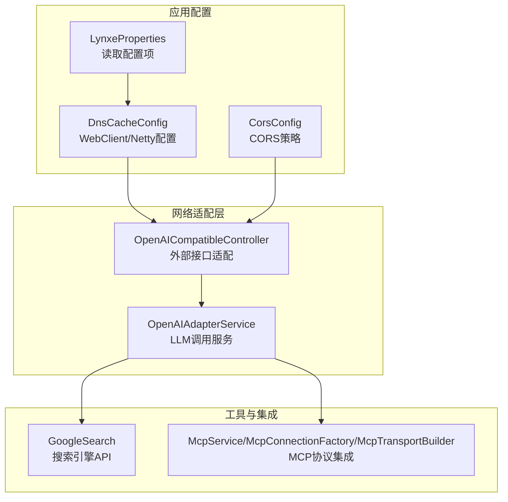
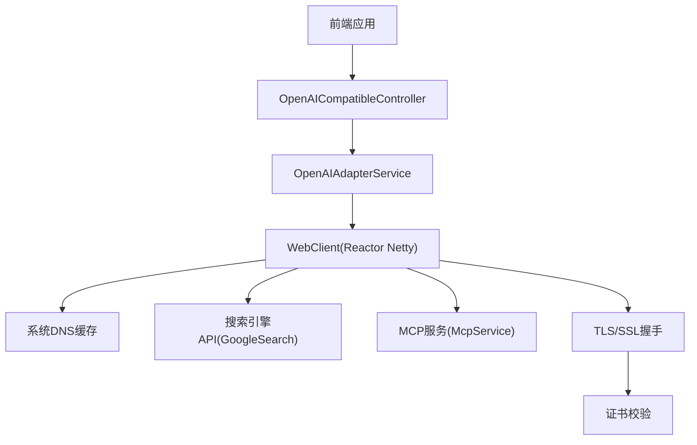
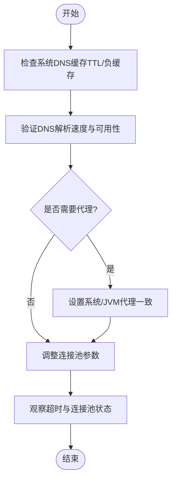
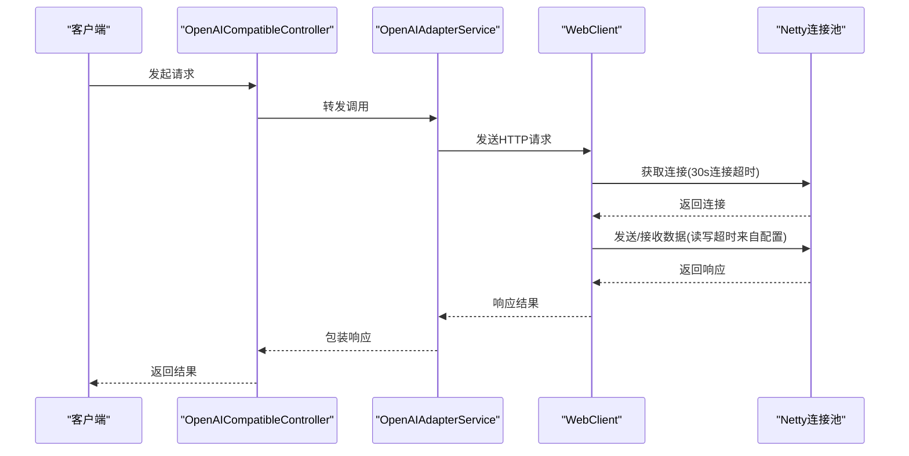
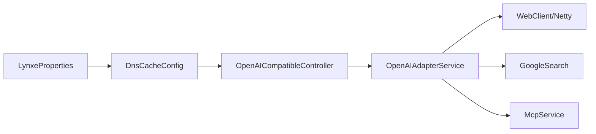

# 网络问题排查

<cite>
**本文引用的文件**
- [DnsCacheConfig.java](file://src/main/java/com/alibaba/cloud/ai/lynxe/config/DnsCacheConfig.java)
- [LynxeProperties.java](file://src/main/java/com/alibaba/cloud/ai/lynxe/config/LynxeProperties.java)
- [CorsConfig.java](file://src/main/java/com/alibaba/cloud/ai/lynxe/config/CorsConfig.java)
- [NetworkException.java](file://src/main/java/com/alibaba/cloud/ai/lynxe/model/exception/NetworkException.java)
- [OpenAICompatibleController.java](file://src/main/java/com/alibaba/cloud/ai/lynxe/adapter/controller/OpenAICompatibleController.java)
- [OpenAIAdapterService.java](file://src/main/java/com/alibaba/cloud/ai/lynxe/adapter/service/OpenAIAdapterService.java)
- [GoogleSearch.java](file://src/main/java/com/alibaba/cloud/ai/lynxe/tool/searchAPI/GoogleSearch.java)
- [serpapi](file://src/main/java/com/alibaba/cloud/ai/lynxe/tool/searchAPI/serpapi)
- [McpService.java](file://src/main/java/com/alibaba/cloud/ai/lynxe/mcp/service/McpService.java)
- [McpConnectionFactory.java](file://src/main/java/com/alibaba/cloud/ai/lynxe/mcp/service/McpConnectionFactory.java)
- [McpTransportBuilder.java](file://src/main/java/com/alibaba/cloud/ai/lynxe/mcp/service/McpTransportBuilder.java)
- [application.yml](file://src/main/resources/application.yml)
- [application-docker.yml](file://src/main/resources/application-docker.yml)
</cite>

## 目录
1. [简介](#简介)
2. [项目结构](#项目结构)
3. [核心组件](#核心组件)
4. [架构总览](#架构总览)
5. [详细组件分析](#详细组件分析)
6. [依赖分析](#依赖分析)
7. [性能考虑](#性能考虑)
8. [故障排除指南](#故障排除指南)
9. [结论](#结论)
10. [附录](#附录)

## 简介
本文件面向Lynxe网络问题排查与运维，聚焦以下关键场景：DNS解析异常（尤其在VPN环境）、HTTP连接超时、SSL/TLS证书错误；搜索引擎API调用与第三方服务集成；网络代理配置；防火墙与端口访问；网络安全策略；连通性测试、带宽与延迟分析；代理服务器、负载均衡与高可用部署建议；以及网络性能优化、连接池管理与超时重试机制。文档基于仓库中现有的网络相关配置与实现进行系统化梳理，并提供可操作的排障步骤与最佳实践。

## 项目结构
Lynxe后端采用Spring Boot + WebFlux（Reactor Netty）构建，网络层通过自定义WebClient与Netty连接池实现高性能HTTP通信。核心网络配置集中在DnsCacheConfig中，同时通过LynxeProperties集中管理各类超时与连接参数；前端跨域策略由CorsConfig统一配置；异常模型NetworkException用于统一网络类错误封装。

**图表来源**
- [DnsCacheConfig.java:64-97](file://src/main/java/com/alibaba/cloud/ai/lynxe/config/DnsCacheConfig.java#L64-L97)
- [LynxeProperties.java:334-354](file://src/main/java/com/alibaba/cloud/ai/lynxe/config/LynxeProperties.java#L334-L354)
- [CorsConfig.java:31-38](file://src/main/java/com/alibaba/cloud/ai/lynxe/config/CorsConfig.java#L31-L38)
- [OpenAICompatibleController.java](file://src/main/java/com/alibaba/cloud/ai/lynxe/adapter/controller/OpenAICompatibleController.java)
- [OpenAIAdapterService.java](file://src/main/java/com/alibaba/cloud/ai/lynxe/adapter/service/OpenAIAdapterService.java)
- [GoogleSearch.java](file://src/main/java/com/alibaba/cloud/ai/lynxe/tool/searchAPI/GoogleSearch.java)
- [McpService.java](file://src/main/java/com/alibaba/cloud/ai/lynxe/mcp/service/McpService.java)

**章节来源**
- [DnsCacheConfig.java:41-97](file://src/main/java/com/alibaba/cloud/ai/lynxe/config/DnsCacheConfig.java#L41-L97)
- [LynxeProperties.java:28-654](file://src/main/java/com/alibaba/cloud/ai/lynxe/config/LynxeProperties.java#L28-L654)
- [CorsConfig.java:28-40](file://src/main/java/com/alibaba/cloud/ai/lynxe/config/CorsConfig.java#L28-L40)

## 核心组件
- DNS缓存与连接池配置：通过DnsCacheConfig启用系统级DNS缓存与Netty连接池，设置连接超时、读写超时、TCP选项与连接池生命周期参数，缓解VPN等复杂网络环境下的DNS解析与连接抖动问题。
- 配置中心：LynxeProperties集中管理llmReadTimeout等网络相关配置项，支持运行时读取与默认值回退。
- 跨域策略：CorsConfig对/api/**路径开放跨域，便于前端直连后端API。
- 异常模型：NetworkException作为统一网络异常基类，便于上层捕获与日志记录。
- 外部服务适配：OpenAICompatibleController与OpenAIAdapterService负责对外LLM接口适配与调用。
- 搜索引擎集成：GoogleSearch与serpapi子包提供搜索引擎API调用能力。
- MCP协议集成：McpService、McpConnectionFactory、McpTransportBuilder负责与MCP服务的连接与传输构建。

**章节来源**
- [DnsCacheConfig.java:41-141](file://src/main/java/com/alibaba/cloud/ai/lynxe/config/DnsCacheConfig.java#L41-L141)
- [LynxeProperties.java:334-354](file://src/main/java/com/alibaba/cloud/ai/lynxe/config/LynxeProperties.java#L334-L354)
- [CorsConfig.java:28-40](file://src/main/java/com/alibaba/cloud/ai/lynxe/config/CorsConfig.java#L28-L40)
- [NetworkException.java:18-32](file://src/main/java/com/alibaba/cloud/ai/lynxe/model/exception/NetworkException.java#L18-L32)
- [OpenAICompatibleController.java](file://src/main/java/com/alibaba/cloud/ai/lynxe/adapter/controller/OpenAICompatibleController.java)
- [OpenAIAdapterService.java](file://src/main/java/com/alibaba/cloud/ai/lynxe/adapter/service/OpenAIAdapterService.java)
- [GoogleSearch.java](file://src/main/java/com/alibaba/cloud/ai/lynxe/tool/searchAPI/GoogleSearch.java)
- [McpService.java](file://src/main/java/com/alibaba/cloud/ai/lynxe/mcp/service/McpService.java)
- [McpConnectionFactory.java](file://src/main/java/com/alibaba/cloud/ai/lynxe/mcp/service/McpConnectionFactory.java)
- [McpTransportBuilder.java](file://src/main/java/com/alibaba/cloud/ai/lynxe/mcp/service/McpTransportBuilder.java)

## 架构总览
下图展示Lynxe网络栈的关键交互：前端通过/api/**访问后端控制器，控制器委托适配服务发起HTTP请求；WebClient使用Reactor Netty连接池，结合系统DNS缓存与超时配置；第三方服务（如搜索引擎、MCP）通过各自适配器接入。

**图表来源**
- [OpenAICompatibleController.java](file://src/main/java/com/alibaba/cloud/ai/lynxe/adapter/controller/OpenAICompatibleController.java)
- [OpenAIAdapterService.java](file://src/main/java/com/alibaba/cloud/ai/lynxe/adapter/service/OpenAIAdapterService.java)
- [DnsCacheConfig.java:64-97](file://src/main/java/com/alibaba/cloud/ai/lynxe/config/DnsCacheConfig.java#L64-L97)
- [GoogleSearch.java](file://src/main/java/com/alibaba/cloud/ai/lynxe/tool/searchAPI/GoogleSearch.java)
- [McpService.java](file://src/main/java/com/alibaba/cloud/ai/lynxe/mcp/service/McpService.java)

## 详细组件分析

### DNS解析问题诊断与修复
- 现象特征：DNS解析缓慢或失败，尤其在企业VPN、内网或DNS污染环境下；表现为连接建立慢、超时或解析失败。
- 已有配置要点：
  - 启用系统DNS缓存与负缓存，降低重复解析开销。
  - 使用默认地址解析组（包含DNS缓存）。
  - 设置连接超时、读写超时与TCP选项（keepalive、nodelay）。
  - 增大连接池容量与生命周期，提升并发稳定性。
- 排障步骤：
  - 检查系统DNS缓存TTL与负缓存配置是否生效。
  - 在目标主机验证DNS解析速度与可用性。
  - 如需代理，确认系统代理与JVM代理设置一致。
  - 观察连接池占用与超时统计，必要时调整最大连接数与空闲生命周期。
- 参考实现位置：
  - [DnsCacheConfig.java:102-138](file://src/main/java/com/alibaba/cloud/ai/lynxe/config/DnsCacheConfig.java#L102-L138)
  - [DnsCacheConfig.java:79-97](file://src/main/java/com/alibaba/cloud/ai/lynxe/config/DnsCacheConfig.java#L79-L97)

**图表来源**
- [DnsCacheConfig.java:102-138](file://src/main/java/com/alibaba/cloud/ai/lynxe/config/DnsCacheConfig.java#L102-L138)
- [DnsCacheConfig.java:79-97](file://src/main/java/com/alibaba/cloud/ai/lynxe/config/DnsCacheConfig.java#L79-L97)

**章节来源**
- [DnsCacheConfig.java:41-141](file://src/main/java/com/alibaba/cloud/ai/lynxe/config/DnsCacheConfig.java#L41-L141)

### HTTP连接超时与读写超时
- 现象特征：请求长时间无响应，最终触发读超时或连接超时；常见于远端服务不稳定或网络拥塞。
- 已有配置要点：
  - 连接超时固定为30秒。
  - 读/写超时来自LynxeProperties中的llmReadTimeout，默认120秒。
  - 连接池最大连接数、空闲/生命周期、获取超时与后台清理周期可调。
- 排障步骤：
  - 逐步降低llmReadTimeout以快速暴露超时问题。
  - 提升连接池上限并缩短空闲/生命周期，避免连接老化。
  - 结合Nginx/负载均衡器查看上游健康检查与超时设置。
- 参考实现位置：
  - [DnsCacheConfig.java:54-59](file://src/main/java/com/alibaba/cloud/ai/lynxe/config/DnsCacheConfig.java#L54-L59)
  - [DnsCacheConfig.java:84-91](file://src/main/java/com/alibaba/cloud/ai/lynxe/config/DnsCacheConfig.java#L84-L91)
  - [LynxeProperties.java:334-354](file://src/main/java/com/alibaba/cloud/ai/lynxe/config/LynxeProperties.java#L334-L354)

**图表来源**
- [OpenAICompatibleController.java](file://src/main/java/com/alibaba/cloud/ai/lynxe/adapter/controller/OpenAICompatibleController.java)
- [OpenAIAdapterService.java](file://src/main/java/com/alibaba/cloud/ai/lynxe/adapter/service/OpenAIAdapterService.java)
- [DnsCacheConfig.java:64-97](file://src/main/java/com/alibaba/cloud/ai/lynxe/config/DnsCacheConfig.java#L64-L97)
- [LynxeProperties.java:334-354](file://src/main/java/com/alibaba/cloud/ai/lynxe/config/LynxeProperties.java#L334-L354)

**章节来源**
- [DnsCacheConfig.java:54-91](file://src/main/java/com/alibaba/cloud/ai/lynxe/config/DnsCacheConfig.java#L54-L91)
- [LynxeProperties.java:334-354](file://src/main/java/com/alibaba/cloud/ai/lynxe/config/LynxeProperties.java#L334-L354)

### SSL证书错误诊断与修复
- 现象特征：HTTPS握手失败、证书链不被信任、域名不匹配等。
- 已有配置要点：
  - WebClient默认使用系统TrustManager与Keystore。
  - 若需自定义信任策略，可在WebClient或Netty层扩展（当前实现未显式覆盖）。
- 排障步骤：
  - 确认服务端证书链完整且域名匹配。
  - 检查系统时间与时区，避免证书时间窗口问题。
  - 如使用自签证书，确保导入到JVM信任库或在启动参数中指定。
  - 临时开启调试日志（JDK SSL日志）定位具体失败点。
- 参考实现位置：
  - [DnsCacheConfig.java:93-96](file://src/main/java/com/alibaba/cloud/ai/lynxe/config/DnsCacheConfig.java#L93-L96)

**章节来源**
- [DnsCacheConfig.java:93-96](file://src/main/java/com/alibaba/cloud/ai/lynxe/config/DnsCacheConfig.java#L93-L96)

### 搜索引擎API调用与第三方服务集成
- GoogleSearch：提供搜索引擎API调用能力，通常涉及HTTP GET/POST、查询参数与限流控制。
- serpapi子包：提供SerPAPI相关适配器，可能包含认证头、代理与速率限制处理。
- MCP协议：通过McpService、McpConnectionFactory与McpTransportBuilder构建与MCP服务的连接与传输。
- 排障步骤：
  - 核对API密钥与权限范围。
  - 检查第三方服务的可用性与限流阈值。
  - 对MCP连接进行握手与心跳检测，确认传输层稳定。
- 参考实现位置：
  - [GoogleSearch.java](file://src/main/java/com/alibaba/cloud/ai/lynxe/tool/searchAPI/GoogleSearch.java)
  - [serpapi](file://src/main/java/com/alibaba/cloud/ai/lynxe/tool/searchAPI/serpapi)
  - [McpService.java](file://src/main/java/com/alibaba/cloud/ai/lynxe/mcp/service/McpService.java)
  - [McpConnectionFactory.java](file://src/main/java/com/alibaba/cloud/ai/lynxe/mcp/service/McpConnectionFactory.java)
  - [McpTransportBuilder.java](file://src/main/java/com/alibaba/cloud/ai/lynxe/mcp/service/McpTransportBuilder.java)

**章节来源**
- [GoogleSearch.java](file://src/main/java/com/alibaba/cloud/ai/lynxe/tool/searchAPI/GoogleSearch.java)
- [McpService.java](file://src/main/java/com/alibaba/cloud/ai/lynxe/mcp/service/McpService.java)
- [McpConnectionFactory.java](file://src/main/java/com/alibaba/cloud/ai/lynxe/mcp/service/McpConnectionFactory.java)
- [McpTransportBuilder.java](file://src/main/java/com/alibaba/cloud/ai/lynxe/mcp/service/McpTransportBuilder.java)

### 网络代理配置
- 系统代理：DnsCacheConfig初始化阶段设置系统代理使用标志，有助于在代理环境中解析与连接。
- JVM代理：可通过JVM参数或系统属性统一配置HTTP/HTTPS代理。
- 应用侧：WebClient/Netty可结合系统代理自动转发请求。
- 排障步骤：
  - 确认系统代理与JVM代理一致。
  - 验证代理服务器可达与认证正确。
  - 在容器/云环境中检查代理注入与环境变量。
- 参考实现位置：
  - [DnsCacheConfig.java:112-118](file://src/main/java/com/alibaba/cloud/ai/lynxe/config/DnsCacheConfig.java#L112-L118)

**章节来源**
- [DnsCacheConfig.java:112-118](file://src/main/java/com/alibaba/cloud/ai/lynxe/config/DnsCacheConfig.java#L112-L118)

### 防火墙规则、端口访问与网络安全策略
- 端口访问：后端监听端口由Spring Boot配置决定；外部服务（搜索引擎、MCP）需开放出站端口（如443）。
- 防火墙：确保入站/出站策略允许必要的端口与协议。
- 安全策略：最小权限原则，仅开放必要端口；启用WAF/DDoS防护；定期更新证书与依赖。
- 参考实现位置：
  - [application.yml](file://src/main/resources/application.yml)
  - [application-docker.yml](file://src/main/resources/application-docker.yml)

**章节来源**
- [application.yml](file://src/main/resources/application.yml)
- [application-docker.yml](file://src/main/resources/application-docker.yml)

### 网络连通性测试、带宽监控与延迟分析
- 连通性测试：使用ping/traceroute/nc等工具验证主机与端口可达性。
- 延迟分析：结合系统网络工具与应用日志中的超时统计，定位瓶颈。
- 带宽监控：结合操作系统/容器监控（CPU、内存、网络I/O）与应用指标（连接池利用率、超时率）综合评估。
- 建议：在生产环境启用Prometheus/Grafana等监控体系，采集Netty连接池与HTTP请求指标。

[本节为通用指导，无需特定文件引用]

### 代理服务器配置、负载均衡与高可用部署建议
- 代理：统一通过系统/JVM代理配置，避免多处分散设置。
- 负载均衡：前置Nginx/HAProxy，配置健康检查与会话保持策略。
- 高可用：多副本部署，结合熔断与重试；数据库/缓存使用主从或集群。
- 参考实现位置：
  - [DnsCacheConfig.java:71-77](file://src/main/java/com/alibaba/cloud/ai/lynxe/config/DnsCacheConfig.java#L71-L77)
  - [CorsConfig.java:31-38](file://src/main/java/com/alibaba/cloud/ai/lynxe/config/CorsConfig.java#L31-L38)

**章节来源**
- [DnsCacheConfig.java:71-77](file://src/main/java/com/alibaba/cloud/ai/lynxe/config/DnsCacheConfig.java#L71-L77)
- [CorsConfig.java:31-38](file://src/main/java/com/alibaba/cloud/ai/lynxe/config/CorsConfig.java#L31-L38)

### 网络性能优化、连接池管理与超时重试机制
- 连接池优化：增大maxConnections、合理设置maxIdleTime/maxLifeTime、缩短pendingAcquireTimeout。
- 超时策略：根据业务特性分层设置连接超时、读写超时；对长耗时任务适当放宽读超时。
- 重试机制：对幂等请求引入指数退避重试，避免雪崩效应；结合熔断器使用。
- 参考实现位置：
  - [DnsCacheConfig.java:70-77](file://src/main/java/com/alibaba/cloud/ai/lynxe/config/DnsCacheConfig.java#L70-L77)
  - [LynxeProperties.java:334-354](file://src/main/java/com/alibaba/cloud/ai/lynxe/config/LynxeProperties.java#L334-L354)

**章节来源**
- [DnsCacheConfig.java:70-77](file://src/main/java/com/alibaba/cloud/ai/lynxe/config/DnsCacheConfig.java#L70-L77)
- [LynxeProperties.java:334-354](file://src/main/java/com/alibaba/cloud/ai/lynxe/config/LynxeProperties.java#L334-L354)

## 依赖分析
- 组件耦合：
  - DnsCacheConfig与LynxeProperties强关联（读取llmReadTimeout）。
  - OpenAICompatibleController依赖OpenAIAdapterService，间接使用WebClient。
  - GoogleSearch与MCP相关组件独立于核心网络配置，但同样受WebClient影响。
- 外部依赖：
  - Reactor Netty提供非阻塞网络栈。
  - Spring WebClient封装HTTP客户端行为。
- 循环依赖风险：当前模块间为单向依赖，无明显循环。

**图表来源**
- [LynxeProperties.java:334-354](file://src/main/java/com/alibaba/cloud/ai/lynxe/config/LynxeProperties.java#L334-L354)
- [DnsCacheConfig.java:64-97](file://src/main/java/com/alibaba/cloud/ai/lynxe/config/DnsCacheConfig.java#L64-L97)
- [OpenAICompatibleController.java](file://src/main/java/com/alibaba/cloud/ai/lynxe/adapter/controller/OpenAICompatibleController.java)
- [OpenAIAdapterService.java](file://src/main/java/com/alibaba/cloud/ai/lynxe/adapter/service/OpenAIAdapterService.java)
- [GoogleSearch.java](file://src/main/java/com/alibaba/cloud/ai/lynxe/tool/searchAPI/GoogleSearch.java)
- [McpService.java](file://src/main/java/com/alibaba/cloud/ai/lynxe/mcp/service/McpService.java)

**章节来源**
- [LynxeProperties.java:334-354](file://src/main/java/com/alibaba/cloud/ai/lynxe/config/LynxeProperties.java#L334-L354)
- [DnsCacheConfig.java:64-97](file://src/main/java/com/alibaba/cloud/ai/lynxe/config/DnsCacheConfig.java#L64-L97)

## 性能考虑
- DNS缓存与负缓存：减少重复解析与失败重试成本。
- 连接池参数：根据QPS与RT优化maxConnections与生命周期，避免连接泄漏与饥饿。
- 超时策略：区分连接超时与读写超时，避免全局过短导致误判。
- TCP选项：启用keepalive与nodelay提升连接稳定性与低延迟。
- 参考实现位置：
  - [DnsCacheConfig.java:115-134](file://src/main/java/com/alibaba/cloud/ai/lynxe/config/DnsCacheConfig.java#L115-L134)
  - [DnsCacheConfig.java:89-91](file://src/main/java/com/alibaba/cloud/ai/lynxe/config/DnsCacheConfig.java#L89-L91)

**章节来源**
- [DnsCacheConfig.java:115-134](file://src/main/java/com/alibaba/cloud/ai/lynxe/config/DnsCacheConfig.java#L115-L134)
- [DnsCacheConfig.java:89-91](file://src/main/java/com/alibaba/cloud/ai/lynxe/config/DnsCacheConfig.java#L89-L91)

## 故障排除指南
- DNS解析问题
  - 步骤：检查系统DNS缓存、验证解析速度、确认代理一致性、调整连接池参数。
  - 参考：[DnsCacheConfig.java:102-138](file://src/main/java/com/alibaba/cloud/ai/lynxe/config/DnsCacheConfig.java#L102-L138)
- HTTP连接超时
  - 步骤：降低llmReadTimeout定位问题、提升连接池上限、缩短空闲生命周期。
  - 参考：[DnsCacheConfig.java:54-59](file://src/main/java/com/alibaba/cloud/ai/lynxe/config/DnsCacheConfig.java#L54-L59)，[LynxeProperties.java:334-354](file://src/main/java/com/alibaba/cloud/ai/lynxe/config/LynxeProperties.java#L334-L354)
- SSL证书错误
  - 步骤：确认证书链完整、域名匹配、系统时间正确；必要时导入自签证书。
  - 参考：[DnsCacheConfig.java:93-96](file://src/main/java/com/alibaba/cloud/ai/lynxe/config/DnsCacheConfig.java#L93-L96)
- 第三方服务集成
  - 步骤：核对密钥与权限、检查可用性与限流、验证MCP连接与传输。
  - 参考：[GoogleSearch.java](file://src/main/java/com/alibaba/cloud/ai/lynxe/tool/searchAPI/GoogleSearch.java)，[McpService.java](file://src/main/java/com/alibaba/cloud/ai/lynxe/mcp/service/McpService.java)
- 网络代理
  - 步骤：统一系统/JVM代理、验证代理可达与认证。
  - 参考：[DnsCacheConfig.java:112-118](file://src/main/java/com/alibaba/cloud/ai/lynxe/config/DnsCacheConfig.java#L112-L118)
- 防火墙与端口
  - 步骤：开放必要端口、验证入/出站策略、检查安全组。
  - 参考：[application.yml](file://src/main/resources/application.yml)，[application-docker.yml](file://src/main/resources/application-docker.yml)
- 跨域问题
  - 步骤：确认/api/**路径已开放跨域、Origin/Method/Header允许。
  - 参考：[CorsConfig.java:31-38](file://src/main/java/com/alibaba/cloud/ai/lynxe/config/CorsConfig.java#L31-L38)
- 异常处理
  - 步骤：使用NetworkException统一捕获与记录，结合日志定位根因。
  - 参考：[NetworkException.java:18-32](file://src/main/java/com/alibaba/cloud/ai/lynxe/model/exception/NetworkException.java#L18-L32)

**章节来源**
- [DnsCacheConfig.java:54-138](file://src/main/java/com/alibaba/cloud/ai/lynxe/config/DnsCacheConfig.java#L54-L138)
- [LynxeProperties.java:334-354](file://src/main/java/com/alibaba/cloud/ai/lynxe/config/LynxeProperties.java#L334-L354)
- [GoogleSearch.java](file://src/main/java/com/alibaba/cloud/ai/lynxe/tool/searchAPI/GoogleSearch.java)
- [McpService.java](file://src/main/java/com/alibaba/cloud/ai/lynxe/mcp/service/McpService.java)
- [CorsConfig.java:31-38](file://src/main/java/com/alibaba/cloud/ai/lynxe/config/CorsConfig.java#L31-L38)
- [NetworkException.java:18-32](file://src/main/java/com/alibaba/cloud/ai/lynxe/model/exception/NetworkException.java#L18-L32)

## 结论
Lynxe在网络层面通过系统DNS缓存、Reactor Netty连接池与可配置超时策略，提供了稳健的HTTP通信基础。针对DNS解析、连接超时与SSL证书问题，建议优先检查系统DNS缓存与代理一致性，结合连接池参数与超时配置进行微调。第三方服务集成需关注密钥、限流与传输稳定性。配合完善的监控与告警体系，可有效提升网络性能与可用性。

[本节为总结性内容，无需特定文件引用]

## 附录
- 关键配置项参考：
  - llmReadTimeout：来自LynxeProperties，用于WebClient读/写超时。
  - 连接池参数：maxConnections、maxIdleTime、maxLifeTime、pendingAcquireTimeout。
  - DNS缓存：networkaddress.cache.ttl/negative.ttl与Netty DNS缓存。
- 参考实现位置：
  - [LynxeProperties.java:334-354](file://src/main/java/com/alibaba/cloud/ai/lynxe/config/LynxeProperties.java#L334-L354)
  - [DnsCacheConfig.java:70-77](file://src/main/java/com/alibaba/cloud/ai/lynxe/config/DnsCacheConfig.java#L70-L77)
  - [DnsCacheConfig.java:115-134](file://src/main/java/com/alibaba/cloud/ai/lynxe/config/DnsCacheConfig.java#L115-L134)

**章节来源**
- [LynxeProperties.java:334-354](file://src/main/java/com/alibaba/cloud/ai/lynxe/config/LynxeProperties.java#L334-L354)
- [DnsCacheConfig.java:70-77](file://src/main/java/com/alibaba/cloud/ai/lynxe/config/DnsCacheConfig.java#L70-L77)
- [DnsCacheConfig.java:115-134](file://src/main/java/com/alibaba/cloud/ai/lynxe/config/DnsCacheConfig.java#L115-L134)