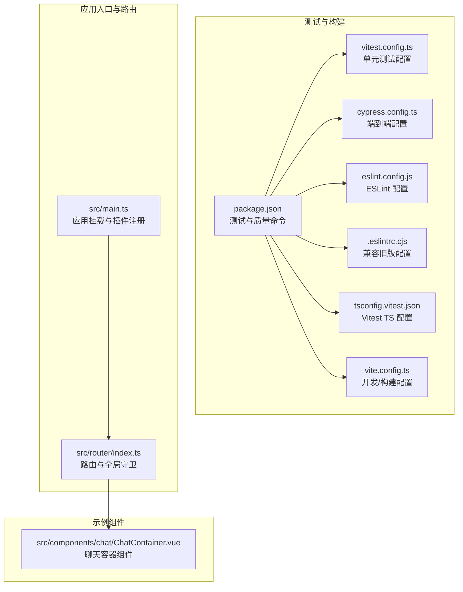
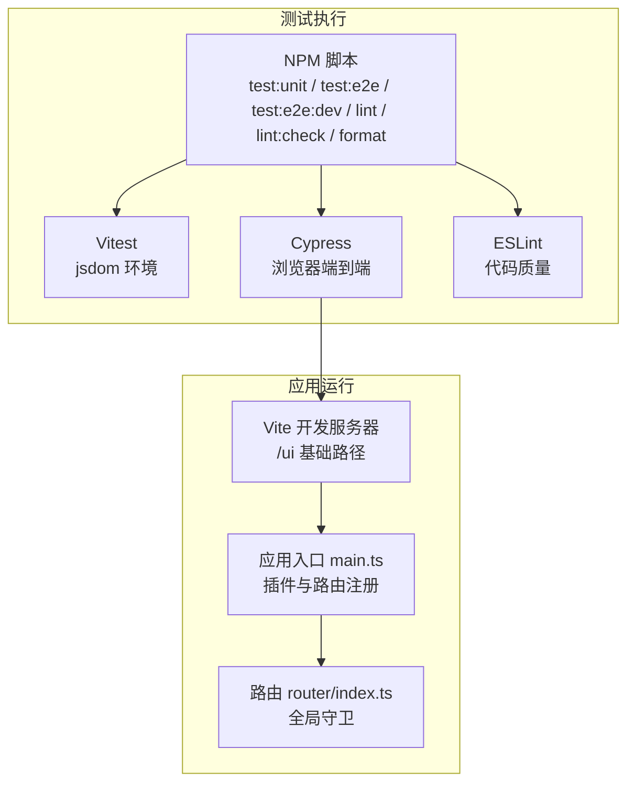
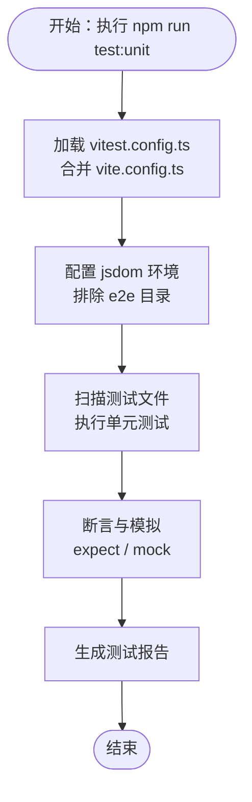
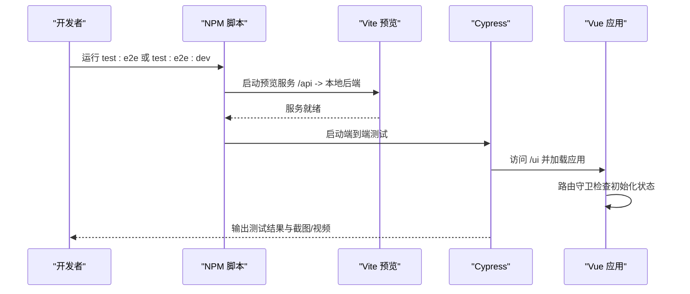
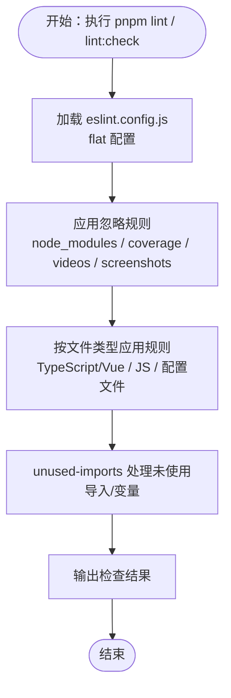
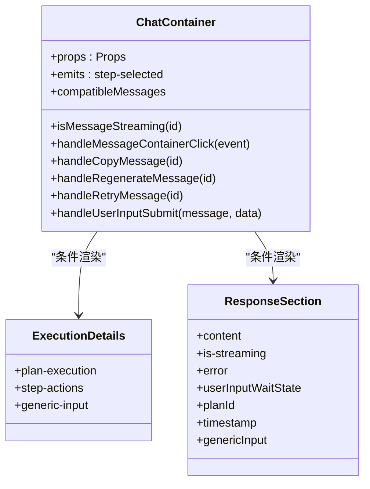
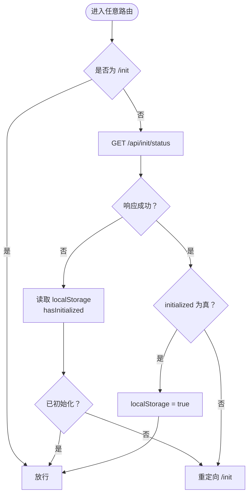
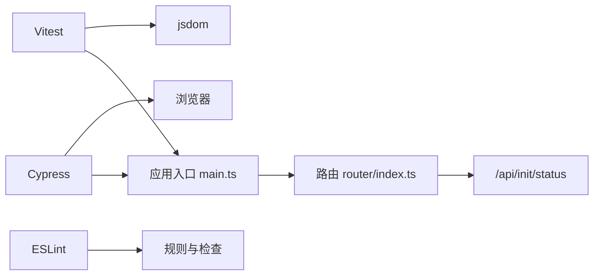

# 前端测试

<cite>
**本文引用的文件**
- [package.json](file://ui-vue3/package.json)
- [vitest.config.ts](file://ui-vue3/vitest.config.ts)
- [cypress.config.ts](file://ui-vue3/cypress.config.ts)
- [eslint.config.js](file://ui-vue3/eslint.config.js)
- [.eslintrc.cjs](file://ui-vue3/.eslintrc.cjs)
- [vite.config.ts](file://ui-vue3/vite.config.ts)
- [tsconfig.vitest.json](file://ui-vue3/tsconfig.vitest.json)
- [src/main.ts](file://ui-vue3/src/main.ts)
- [src/router/index.ts](file://ui-vue3/src/router/index.ts)
- [src/components/chat/ChatContainer.vue](file://ui-vue3/src/components/chat/ChatContainer.vue)
</cite>

## 目录
1. [简介](#简介)
2. [项目结构](#项目结构)
3. [核心组件](#核心组件)
4. [架构总览](#架构总览)
5. [详细组件分析](#详细组件分析)
6. [依赖关系分析](#依赖关系分析)
7. [性能考量](#性能考量)
8. [故障排查指南](#故障排查指南)
9. [结论](#结论)
10. [附录](#附录)

## 简介
本文件面向 Lynxe 前端（Vue 3 应用）的测试体系，系统化阐述端到端测试（Cypress）、单元测试（Vitest）与代码质量检查（ESLint）的配置与实施策略。内容覆盖测试环境搭建、测试命令运行、测试报告生成、UI 组件测试与用户交互测试、路由导航测试、测试数据准备、断言编写与维护策略，并提供性能测试与可访问性测试建议、覆盖率统计、CI/CD 集成与测试自动化流程的最佳实践。

## 项目结构
前端测试相关的关键文件集中在 ui-vue3 目录中，主要由以下几类组成：
- 测试运行脚本与工具：package.json 中定义的 test:unit、test:e2e、test:e2e:dev、lint、lint:check、format 等命令
- 单元测试配置：vitest.config.ts、tsconfig.vitest.json
- 端到端测试配置：cypress.config.ts
- 代码质量配置：eslint.config.js、.eslintrc.cjs
- 构建与开发服务器：vite.config.ts
- 应用入口与路由：src/main.ts、src/router/index.ts
- 示例组件：src/components/chat/ChatContainer.vue（用于演示测试场景）

**图表来源**
- [package.json:1-100](file://ui-vue3/package.json#L1-L100)
- [vitest.config.ts:1-31](file://ui-vue3/vitest.config.ts#L1-L31)
- [cypress.config.ts:1-24](file://ui-vue3/cypress.config.ts#L1-L24)
- [eslint.config.js:1-160](file://ui-vue3/eslint.config.js#L1-L160)
- [.eslintrc.cjs:1-107](file://ui-vue3/.eslintrc.cjs#L1-L107)
- [tsconfig.vitest.json:1-10](file://ui-vue3/tsconfig.vitest.json#L1-L10)
- [vite.config.ts:1-71](file://ui-vue3/vite.config.ts#L1-L71)
- [src/main.ts:1-57](file://ui-vue3/src/main.ts#L1-L57)
- [src/router/index.ts:1-62](file://ui-vue3/src/router/index.ts#L1-L62)
- [src/components/chat/ChatContainer.vue:1-200](file://ui-vue3/src/components/chat/ChatContainer.vue#L1-L200)

**章节来源**
- [package.json:1-100](file://ui-vue3/package.json#L1-L100)
- [vite.config.ts:1-71](file://ui-vue3/vite.config.ts#L1-L71)

## 核心组件
- 测试命令与脚本
  - 单元测试：通过 Vitest 执行，使用 jsdom 环境，排除 e2e 目录
  - 端到端测试：通过 Cypress 执行，支持本地预览服务启动后自动运行或在开发模式下打开交互式界面
  - 代码质量：ESLint 与 Prettier 配合，支持修复与检查两类命令
- 配置文件
  - Vitest：合并 Vite 配置，设置 jsdom 环境与根目录
  - Cypress：指定 e2e 规范路径与本地基地址
  - ESLint：采用 flat 配置格式，分层规则与忽略项，支持 TypeScript/Vue 项目
  - Vite：开发代理、构建输出、插件与别名等
- 运行时环境
  - 应用入口注册 Pinia、Ant Design Vue、颜色选择器、国际化与路由
  - 路由包含初始化状态校验的全局前置守卫，影响端到端测试的页面加载与导航

**章节来源**
- [package.json:6-27](file://ui-vue3/package.json#L6-L27)
- [vitest.config.ts:21-30](file://ui-vue3/vitest.config.ts#L21-L30)
- [cypress.config.ts:18-23](file://ui-vue3/cypress.config.ts#L18-L23)
- [eslint.config.js:28-159](file://ui-vue3/eslint.config.js#L28-L159)
- [src/main.ts:39-57](file://ui-vue3/src/main.ts#L39-L57)
- [src/router/index.ts:26-59](file://ui-vue3/src/router/index.ts#L26-L59)

## 架构总览
下图展示了测试体系在项目中的位置与交互关系，以及与应用入口和路由的关系。

**图表来源**
- [package.json:6-27](file://ui-vue3/package.json#L6-L27)
- [vite.config.ts:23-45](file://ui-vue3/vite.config.ts#L23-L45)
- [src/main.ts:39-57](file://ui-vue3/src/main.ts#L39-L57)
- [src/router/index.ts:26-59](file://ui-vue3/src/router/index.ts#L26-L59)

## 详细组件分析

### 单元测试（Vitest）
- 环境与配置
  - 使用 jsdom 作为 DOM 模拟环境，适合 Vue 组件与组合式函数的测试
  - 排除 e2e 目录，避免与端到端测试冲突
  - 合并 Vite 配置，确保测试与构建一致
- TypeScript 支持
  - 通过 tsconfig.vitest.json 注入 types: ["node", "jsdom"]，提供必要的类型声明
- 典型测试场景
  - 组合式函数：如 useMessageDialog、useScrollBehavior 等
  - 组件渲染与事件：对 ChatContainer 的消息列表、滚动行为、复制/重试等交互进行断言
  - 状态管理：结合 Pinia store 的读写与派发
- 断言与覆盖率
  - 使用 expect 与 Vitest 提供的匹配器进行断言
  - 可通过 Vitest 配置生成覆盖率报告（需在项目中启用 coverage 选项）

**图表来源**
- [vitest.config.ts:21-30](file://ui-vue3/vitest.config.ts#L21-L30)
- [tsconfig.vitest.json:1-10](file://ui-vue3/tsconfig.vitest.json#L1-L10)
- [package.json:10](file://ui-vue3/package.json#L10)

**章节来源**
- [vitest.config.ts:21-30](file://ui-vue3/vitest.config.ts#L21-L30)
- [tsconfig.vitest.json:1-10](file://ui-vue3/tsconfig.vitest.json#L1-L10)
- [package.json:10](file://ui-vue3/package.json#L10)

### 端到端测试（Cypress）
- 配置要点
  - e2e 规范路径：cypress/e2e/**/*.{cy,spec}.{js,jsx,ts,tsx}
  - 基地址：http://localhost:4173（与 Vite 预览端口一致）
- 运行方式
  - 自动模式：先启动预览服务，再运行 Cypress 执行 e2e 测试
  - 开发模式：启动 Vite 开发服务器并在 Cypress 中打开交互式界面
- 典型测试场景
  - 初始化流程：根据路由守卫逻辑，验证未初始化时跳转至初始化页
  - 聊天交互：向 ChatContainer 发送消息、查看响应、触发复制/重试/重新生成等操作
  - 导航测试：从首页到初始化页、从初始化页回到主页面的流程
- 数据准备与断言
  - 使用 Cypress 命令与自定义命令封装常用操作
  - 断言页面元素存在、文本内容、路由路径变化、本地存储状态等

**图表来源**
- [package.json:11-12](file://ui-vue3/package.json#L11-L12)
- [cypress.config.ts:19-22](file://ui-vue3/cypress.config.ts#L19-L22)
- [vite.config.ts:32-45](file://ui-vue3/vite.config.ts#L32-L45)
- [src/router/index.ts:26-59](file://ui-vue3/src/router/index.ts#L26-L59)

**章节来源**
- [cypress.config.ts:18-23](file://ui-vue3/cypress.config.ts#L18-L23)
- [package.json:11-12](file://ui-vue3/package.json#L11-L12)
- [vite.config.ts:32-45](file://ui-vue3/vite.config.ts#L32-L45)
- [src/router/index.ts:26-59](file://ui-vue3/src/router/index.ts#L26-L59)

### 代码质量检查（ESLint）
- 配置结构
  - 采用 flat 配置格式，按文件类型与用途分层
  - 忽略项覆盖 node_modules、dist、coverage、build、videos/screenshots 等
  - TypeScript/Vue 文件启用项目感知规则，配置文件禁用部分规则以降低复杂度
- 规则策略
  - 生产环境默认开启警告级别控制 console/debugger
  - 通过 unused-imports 插件统一处理未使用导入与变量
  - Vue 文件禁用多词组件名强制，放宽部分规则以提升开发体验
- 与构建/测试的协作
  - 与 Prettier 配置配合，保证格式一致性
  - 在 CI 中通过 lint:check 与 lint 命令进行质量门禁

**图表来源**
- [eslint.config.js:28-159](file://ui-vue3/eslint.config.js#L28-L159)
- [package.json:16-18](file://ui-vue3/package.json#L16-L18)

**章节来源**
- [eslint.config.js:28-159](file://ui-vue3/eslint.config.js#L28-L159)
- [.eslintrc.cjs:20-107](file://ui-vue3/.eslintrc.cjs#L20-L107)
- [package.json:16-18](file://ui-vue3/package.json#L16-L18)

### UI 组件测试与用户交互测试
- ChatContainer 组件测试要点
  - 渲染消息列表：基于消息数组渲染用户/助手消息，包含附件、时间戳与状态
  - 交互事件：复制、重试、重新生成、用户输入提交等事件回调
  - 滚动行为：自动滚动到底部与显示“回到底部”按钮
  - 加载态：流式响应时的加载指示器
- 测试实现建议
  - 使用 @vue/test-utils 渲染组件并与 jsdom 交互
  - 通过 mock 组合式函数与 store 返回值，隔离外部依赖
  - 断言 DOM 属性、类名、文本内容与事件触发次数

**图表来源**
- [src/components/chat/ChatContainer.vue:16-123](file://ui-vue3/src/components/chat/ChatContainer.vue#L16-L123)
- [src/components/chat/ChatContainer.vue:125-200](file://ui-vue3/src/components/chat/ChatContainer.vue#L125-L200)

**章节来源**
- [src/components/chat/ChatContainer.vue:16-123](file://ui-vue3/src/components/chat/ChatContainer.vue#L16-L123)
- [src/components/chat/ChatContainer.vue:125-200](file://ui-vue3/src/components/chat/ChatContainer.vue#L125-L200)

### 路由导航测试
- 全局守卫逻辑
  - 非初始化页：请求 /api/init/status 判断初始化状态，未初始化则重定向至 /init
  - 已初始化：将 hasInitialized 写入 localStorage
  - 异常回退：请求失败时依据 localStorage 决策
- 端到端测试策略
  - 准备不同初始化状态的后端响应，验证路由跳转
  - 断言当前路径、localStorage 状态与页面元素
  - 对 /init 页面进行独立测试，确保初始化流程可用

**图表来源**
- [src/router/index.ts:26-59](file://ui-vue3/src/router/index.ts#L26-L59)

**章节来源**
- [src/router/index.ts:26-59](file://ui-vue3/src/router/index.ts#L26-L59)

## 依赖关系分析
- 测试工具链
  - Vitest 与 jsdom：提供 DOM 模拟与快速测试能力
  - Cypress：提供真实浏览器环境下的端到端测试
  - ESLint：保障代码风格与潜在问题
- 与应用的耦合点
  - 路由守卫依赖后端接口 /api/init/status，端到端测试需考虑该接口状态
  - 应用入口注册了 Pinia、Ant Design Vue、国际化与路由，测试中应模拟或注入对应依赖
- 外部依赖与集成
  - Vite 代理 /api 与 /admin 指向本地后端，端到端测试需确保后端可用

**图表来源**
- [src/main.ts:39-57](file://ui-vue3/src/main.ts#L39-L57)
- [src/router/index.ts:36-37](file://ui-vue3/src/router/index.ts#L36-L37)
- [vite.config.ts:35-44](file://ui-vue3/vite.config.ts#L35-L44)

**章节来源**
- [src/main.ts:39-57](file://ui-vue3/src/main.ts#L39-L57)
- [src/router/index.ts:36-37](file://ui-vue3/src/router/index.ts#L36-L37)
- [vite.config.ts:35-44](file://ui-vue3/vite.config.ts#L35-L44)

## 性能考量
- 单元测试
  - 使用 jsdom 与最小化依赖注入，避免网络请求与大型第三方库
  - 将昂贵计算放入组合式函数并进行独立单元测试
- 端到端测试
  - 控制并发与并行度，减少浏览器实例数量
  - 使用固定视口尺寸与禁用动画，提高稳定性与速度
- 代码质量
  - 在 CI 中仅运行 lint:check，避免重复格式化导致的噪音
  - 将 ESLint 与 Vitest 并行执行，缩短流水线时间

## 故障排查指南
- 端到端测试无法连接本地服务
  - 确认 Vite 预览端口与 Cypress baseUrl 一致（默认 4173）
  - 检查代理配置是否正确转发 /api 与 /admin 请求
- 初始化状态导致路由异常
  - 在测试中模拟 /api/init/status 的返回值，确保可预测的初始化状态
  - 验证 localStorage 的 hasInitialized 是否按预期更新
- 单元测试报错缺少类型或 DOM 类型
  - 确保 tsconfig.vitest.json 包含 jsdom 类型
  - 检查 Vitest 配置是否合并了 Vite 配置
- ESLint 报错与格式不一致
  - 使用 pnpm format 与 pnpm lint:check 保持一致性
  - 检查 eslint.config.js 的忽略规则与文件类型覆盖

**章节来源**
- [cypress.config.ts:19-22](file://ui-vue3/cypress.config.ts#L19-L22)
- [vite.config.ts:35-44](file://ui-vue3/vite.config.ts#L35-L44)
- [src/router/index.ts:36-59](file://ui-vue3/src/router/index.ts#L36-L59)
- [tsconfig.vitest.json:4-8](file://ui-vue3/tsconfig.vitest.json#L4-L8)
- [eslint.config.js:28-55](file://ui-vue3/eslint.config.js#L28-L55)

## 结论
Lynxe 前端测试体系以 Vitest、Cypress 与 ESLint 为核心，结合 Vite 的开发与构建能力，形成了从单元到端到端再到代码质量的完整闭环。通过明确的配置与脚本约定、清晰的路由守卫与应用入口设计，测试具备良好的可维护性与可扩展性。建议在 CI 中引入覆盖率统计与可访问性检查，持续优化测试效率与质量。

## 附录
- 测试命令速查
  - 单元测试：npm run test:unit
  - 端到端测试（自动）：npm run test:e2e
  - 端到端测试（开发）：npm run test:e2e:dev
  - 代码质量检查：npm run lint:check；修复：npm run lint
  - 格式化：npm run format
- 覆盖率与报告
  - Vitest 可通过配置启用覆盖率统计与报告生成（需在项目中添加相应选项）
  - Cypress 默认生成视频与截图，可在 CI 中归档
- CI/CD 集成建议
  - 分阶段流水线：类型检查 → ESLint → 单元测试 → 端到端测试 → 构建
  - 缓存依赖与构建产物，提升流水线速度
  - 将测试报告与覆盖率上传至制品库或平台