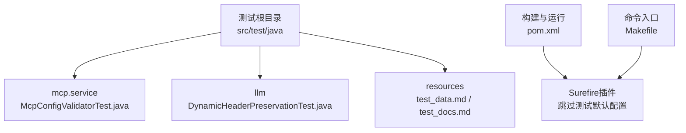
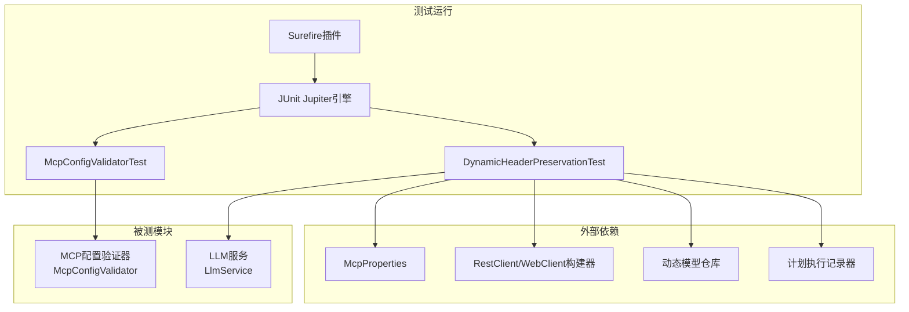
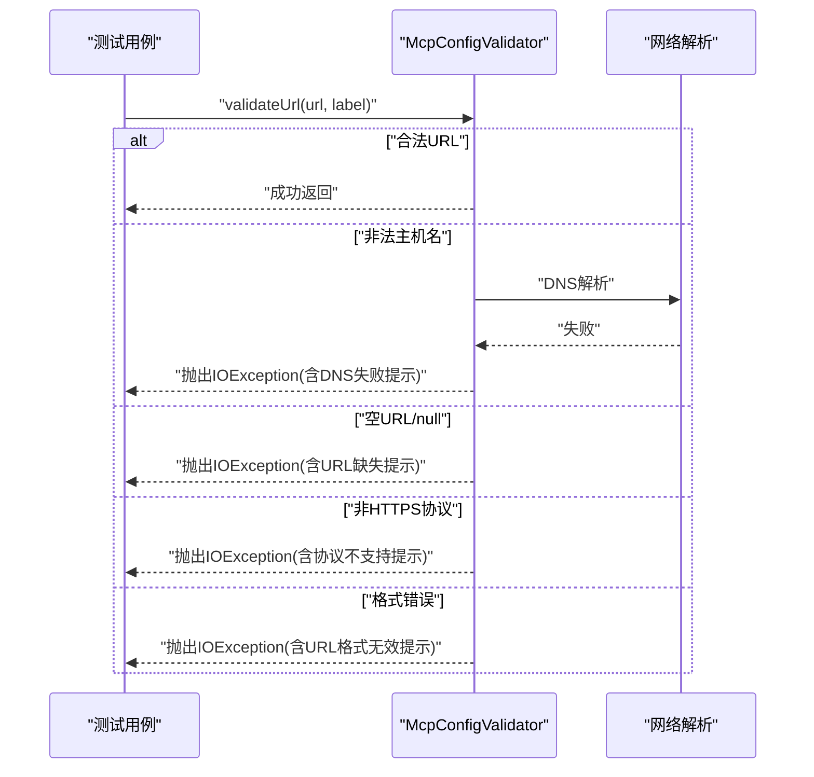
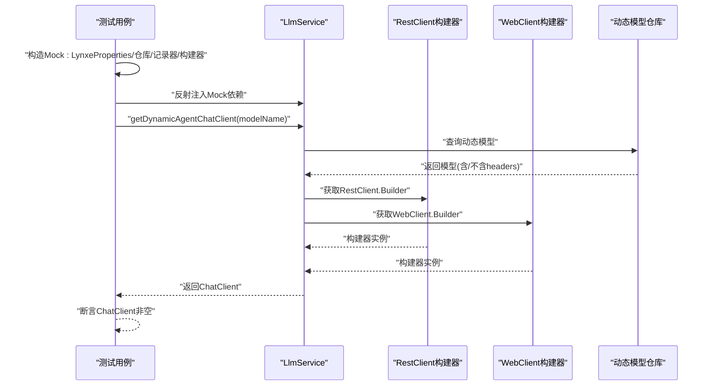

# 单元测试

<cite>
**本文引用的文件**
- [McpConfigValidatorTest.java](file://src/test/java/com/alibaba/cloud/ai/lynxe/mcp/service/McpConfigValidatorTest.java)
- [DynamicHeaderPreservationTest.java](file://src/test/java/com/alibaba/cloud/ai/lynxe/llm/DynamicHeaderPreservationTest.java)
- [pom.xml](file://pom.xml)
- [test_data.md](file://src/test/resources/test_data.md)
- [test_docs.md](file://src/test/resources/test_docs.md)
- [Makefile](file://Makefile)
</cite>

## 目录
1. [引言](#引言)
2. [项目结构](#项目结构)
3. [核心组件](#核心组件)
4. [架构总览](#架构总览)
5. [详细组件分析](#详细组件分析)
6. [依赖分析](#依赖分析)
7. [性能考虑](#性能考虑)
8. [故障排查指南](#故障排查指南)
9. [结论](#结论)
10. [附录](#附录)

## 引言
本文件为Lynxe项目的单元测试文档，聚焦于JUnit 5与Mockito在测试中的使用、断言最佳实践以及各模块的测试策略。当前仓库中已包含针对MCP配置验证器与动态头部保留功能的测试样例，本文将基于现有测试文件，补充测试设计原则、边界条件与异常处理策略，并给出测试数据准备、环境隔离与结果验证方法，同时提供可操作的编写指南、覆盖率目标与维护策略。

## 项目结构
单元测试位于标准的Maven结构下，采用Jupiter引擎与Mockito集成扩展。测试类按模块组织，分别位于mcp、llm等包路径下，便于定位与维护。

**图示来源**
- [McpConfigValidatorTest.java:1-95](file://src/test/java/com/alibaba/cloud/ai/lynxe/mcp/service/McpConfigValidatorTest.java#L1-L95)
- [DynamicHeaderPreservationTest.java:1-138](file://src/test/java/com/alibaba/cloud/ai/lynxe/llm/DynamicHeaderPreservationTest.java#L1-L138)
- [pom.xml:415-439](file://pom.xml#L415-L439)
- [Makefile:17-25](file://Makefile#L17-L25)

**章节来源**
- [McpConfigValidatorTest.java:1-95](file://src/test/java/com/alibaba/cloud/ai/lynxe/mcp/service/McpConfigValidatorTest.java#L1-L95)
- [DynamicHeaderPreservationTest.java:1-138](file://src/test/java/com/alibaba/cloud/ai/lynxe/llm/DynamicHeaderPreservationTest.java#L1-L138)
- [pom.xml:415-439](file://pom.xml#L415-L439)
- [Makefile:17-25](file://Makefile#L17-L25)

## 核心组件
- 测试框架与依赖
  - JUnit 5：提供测试生命周期、参数化与并发控制能力。
  - Mockito：提供桩对象、行为验证与注入式扩展。
  - Spring Boot Starter Test：集成Spring测试生态。
- 测试运行与配置
  - Surefire插件默认跳过测试执行，可通过命令行或CI配置启用。
  - JUnit Jupiter并行执行默认关闭，避免状态共享导致的不确定性。

**章节来源**
- [pom.xml:309-353](file://pom.xml#L309-L353)
- [pom.xml:415-439](file://pom.xml#L415-L439)

## 架构总览
下图展示当前已有的两个测试模块与其依赖关系，以及测试运行的整体流程。

**图示来源**
- [McpConfigValidatorTest.java:35-46](file://src/test/java/com/alibaba/cloud/ai/lynxe/mcp/service/McpConfigValidatorTest.java#L35-L46)
- [DynamicHeaderPreservationTest.java:40-105](file://src/test/java/com/alibaba/cloud/ai/lynxe/llm/DynamicHeaderPreservationTest.java#L40-L105)
- [pom.xml:316-335](file://pom.xml#L316-L335)

## 详细组件分析

### MCP配置验证器测试
- 测试目标
  - 验证URL格式、协议支持、DNS解析与空值/非法输入的错误处理。
- 关键断言策略
  - 使用断言确保在合法URL下不抛出异常；在非法主机名、空值、协议不支持、格式错误等场景下抛出预期异常并校验消息包含特定关键词。
- 边界与异常
  - 非法主机名触发DNS解析失败；空URL与null触发“无效或缺失MCP服务器URL”提示；非HTTPS协议触发“不受支持的协议”提示；畸形URL触发“URL格式无效”提示。
- 最佳实践
  - 将“期望异常+消息校验”的模式封装为断言辅助方法，减少重复代码。
  - 对网络相关断言建议通过隔离环境或使用Mock网络层的方式稳定执行。

**图示来源**
- [McpConfigValidatorTest.java:48-92](file://src/test/java/com/alibaba/cloud/ai/lynxe/mcp/service/McpConfigValidatorTest.java#L48-L92)

**章节来源**
- [McpConfigValidatorTest.java:1-95](file://src/test/java/com/alibaba/cloud/ai/lynxe/mcp/service/McpConfigValidatorTest.java#L1-L95)

### 动态头部保留测试
- 测试目标
  - 验证在存在与不存在自定义头部的情况下，动态ChatClient均能正确创建。
- 依赖注入策略
  - 通过Mockito扩展创建Mock对象，并使用反射注入到被测LlmService实例，以绕过Spring容器限制。
- 断言策略
  - 在两种场景下均断言ChatClient非空，确保动态客户端创建逻辑健壮。
- 注意事项
  - 反射注入仅用于测试目的，生产环境不应使用该模式；建议在可注入点进行重构以避免反射耦合。

**图示来源**
- [DynamicHeaderPreservationTest.java:69-135](file://src/test/java/com/alibaba/cloud/ai/lynxe/llm/DynamicHeaderPreservationTest.java#L69-L135)

**章节来源**
- [DynamicHeaderPreservationTest.java:1-138](file://src/test/java/com/alibaba/cloud/ai/lynxe/llm/DynamicHeaderPreservationTest.java#L1-L138)

### Excel处理器测试（待完善）
- 当前状态
  - 未发现对应测试文件，但项目中存在Excel处理相关工具与服务接口，建议尽快补齐。
- 建议策略
  - 使用内存数据库/H2与临时文件模拟真实场景，覆盖正常流程、空数据、格式异常、权限问题等边界。
  - 对EasyExcel读写流程进行行为验证，确保转换与导出逻辑正确。
- 数据准备
  - 可参考测试资源中的表格数据，构造多行多列的Excel输入，配合断言输出一致性。

**章节来源**
- [test_data.md:1-19](file://src/test/resources/test_data.md#L1-L19)

### JSX生成器集成测试（待完善）
- 当前状态
  - 未发现对应测试文件，但存在JsxGenerator相关服务与操作器。
- 建议策略
  - 以最小依赖启动方式运行，对生成结果进行结构与内容断言；对异常输入与边界条件进行覆盖。
  - 若涉及UI渲染，建议采用快照对比或结构化输出断言，避免脆弱的视觉断言。

**章节来源**
- [pom.xml:243-266](file://pom.xml#L243-L266)

## 依赖分析
- 测试框架与Mock
  - JUnit 5与Mockito JUnit Jupiter扩展共同提供注解驱动的测试与Mock能力。
- 运行时隔离
  - 通过ObjectProvider与Mock对象隔离外部依赖，保证测试的确定性。
- 构建与执行
  - Surefire默认跳过测试，需在本地或CI显式启用；并行执行默认关闭，避免竞态。

**图示来源**
- [pom.xml:316-335](file://pom.xml#L316-L335)
- [DynamicHeaderPreservationTest.java:40-105](file://src/test/java/com/alibaba/cloud/ai/lynxe/llm/DynamicHeaderPreservationTest.java#L40-L105)

**章节来源**
- [pom.xml:316-335](file://pom.xml#L316-L335)
- [pom.xml:415-439](file://pom.xml#L415-L439)

## 性能考虑
- 测试执行
  - 关闭并行执行可降低跨测试的共享状态干扰；在需要加速时可评估开启并行并做好隔离。
- 外部依赖
  - 对网络与IO的测试建议使用Mock或本地化替代，避免慢依赖影响整体吞吐。
- 资源占用
  - Excel与浏览器自动化测试可能消耗较多内存，建议在CI中限制并发并设置超时。

## 故障排查指南
- 常见问题
  - 测试无法运行：检查Surefire配置是否跳过测试，或确认JUnit引擎版本兼容。
  - Mock失效：确认扩展注解与依赖版本匹配，且Mock对象在setUp阶段正确初始化。
  - 反射注入失败：检查字段名与类型一致，必要时在被测类中暴露受控setter或构造器。
- 排查步骤
  - 打印关键对象引用与状态，定位Mock注入点。
  - 缩小用例范围，逐步排除外部依赖。
  - 对异常断言增加日志输出，明确失败原因。

**章节来源**
- [pom.xml:415-439](file://pom.xml#L415-L439)
- [DynamicHeaderPreservationTest.java:77-104](file://src/test/java/com/alibaba/cloud/ai/lynxe/llm/DynamicHeaderPreservationTest.java#L77-L104)

## 结论
当前Lynxe的单元测试已覆盖MCP配置验证与动态头部保留两大关键路径，展示了JUnit 5与Mockito在断言与依赖隔离方面的良好实践。建议后续补齐Excel处理器与JSX生成器的测试，完善边界与异常场景，并建立统一的测试数据与环境隔离规范，以提升整体质量与可维护性。

## 附录

### 测试用例设计原则
- 单一职责：每个测试聚焦一个行为或边界。
- 可重复性：避免随机性，使用Mock与固定输入。
- 明确断言：优先断言行为而非实现细节。
- 可读性：命名清晰，前置条件与期望明确。

### 边界条件与异常处理
- 输入为空/Null、格式错误、协议不支持、DNS不可达等。
- 外部依赖不可用（网络/文件系统）时的行为与回退。

### 测试数据准备
- 表格数据：参考测试资源中的示例，构造多行多列数据集。
- 文档数据：利用大文本资源进行解析与转换测试。

**章节来源**
- [test_data.md:1-19](file://src/test/resources/test_data.md#L1-L19)
- [test_docs.md:1-800](file://src/test/resources/test_docs.md#L1-L800)

### 测试环境隔离
- 使用内存数据库（如H2）与临时文件夹，避免持久化污染。
- 对网络请求使用Mock或本地代理，确保跨平台一致性。

### 测试结果验证方法
- 结构断言：对返回对象的关键字段进行断言。
- 行为断言：验证调用次数、顺序与参数匹配。
- 异常断言：捕获并校验异常类型与消息片段。

### 单元测试编写指南
- 优先使用Mockito注解与Jupiter生命周期方法。
- 将公共Mock与断言逻辑抽取为辅助类或扩展方法。
- 对复杂流程拆分为多个小用例，分别覆盖不同分支。

### 代码覆盖率要求
- 建议关键模块达到较高覆盖率（如>80%），核心路径与异常分支不低于中等覆盖率。
- 使用CI报告跟踪趋势，定期回溯低覆盖率区域。

### 测试维护策略
- 随着功能演进同步更新测试用例。
- 对重构后的接口保持测试稳定性，必要时迁移用例。
- 建立回归清单，确保重要缺陷不会再次出现。