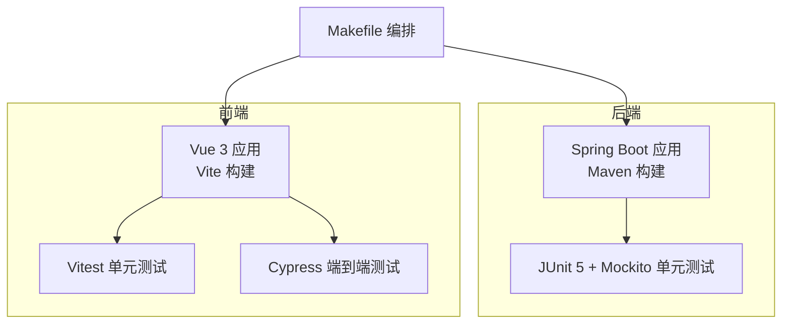
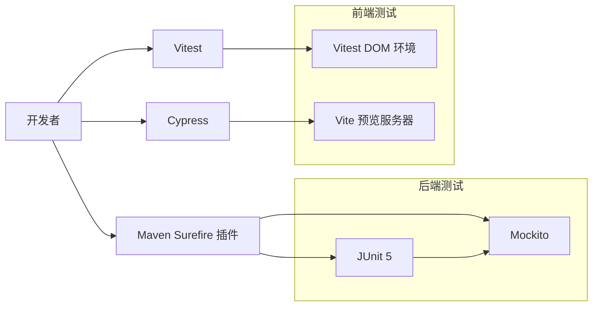
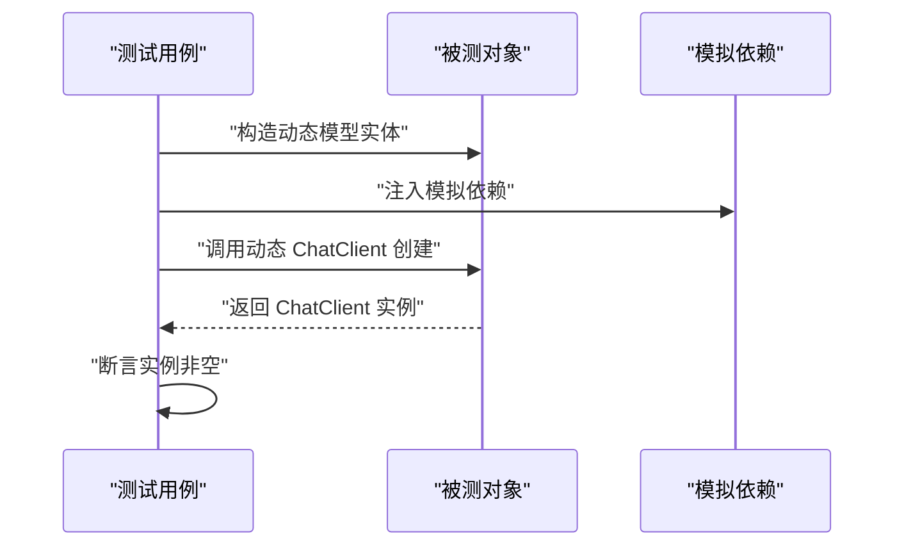
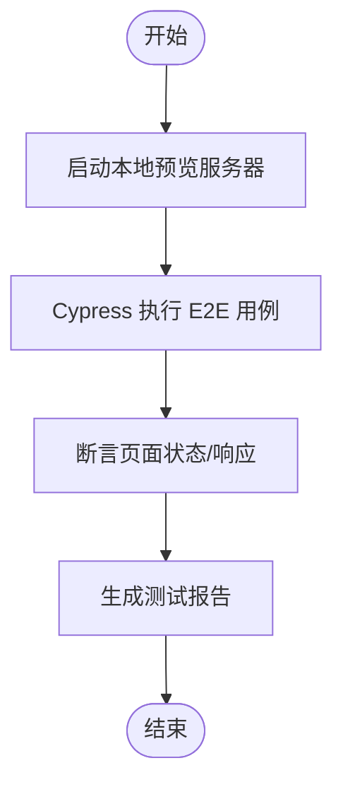
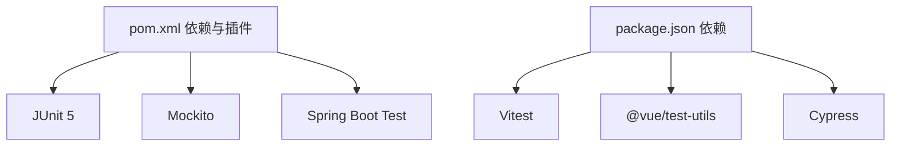

# 测试策略

<cite>
**本文引用的文件**
- [pom.xml](file://pom.xml)
- [package.json](file://ui-vue3/package.json)
- [vitest.config.ts](file://ui-vue3/vitest.config.ts)
- [cypress.config.ts](file://ui-vue3/cypress.config.ts)
- [Makefile](file://Makefile)
- [DynamicHeaderPreservationTest.java](file://src/test/java/com/alibaba/cloud/ai/lynxe/llm/DynamicHeaderPreservationTest.java)
- [McpConfigValidatorTest.java](file://src/test/java/com/alibaba/cloud/ai/lynxe/mcp/service/McpConfigValidatorTest.java)
- [test_data.md](file://src/test/resources/test_data.md)
- [test_docs.md](file://src/test/resources/test_docs.md)
</cite>

## 目录
1. [引言](#引言)
2. [项目结构](#项目结构)
3. [核心组件](#核心组件)
4. [架构总览](#架构总览)
5. [详细组件分析](#详细组件分析)
6. [依赖关系分析](#依赖关系分析)
7. [性能考量](#性能考量)
8. [故障排查指南](#故障排查指南)
9. [结论](#结论)
10. [附录](#附录)

## 引言
本测试策略文档面向 Lynxe 项目的测试体系，覆盖单元测试、集成测试与端到端测试的实施路径，明确测试覆盖率目标、测试数据管理与模拟对象使用规范，并给出前后端测试分工、自动化与持续集成配置建议、质量门禁设置、最佳实践、调试技巧、性能测试指南、测试环境搭建、测试数据准备与结果分析、测试报告生成、缺陷跟踪与回归测试策略。

## 项目结构
Lynxe 采用前后端分离架构：
- 后端基于 Spring Boot 3 + Spring WebFlux，使用 Maven 构建与测试。
- 前端基于 Vue 3 + Vite，使用 Vitest 进行单元测试，Cypress 进行端到端测试。
- 工程通过 Makefile 统一编排构建与脚本执行。

图示来源
- [pom.xml](file://pom.xml)
- [package.json](file://ui-vue3/package.json)
- [vitest.config.ts](file://ui-vue3/vitest.config.ts)
- [cypress.config.ts](file://ui-vue3/cypress.config.ts)
- [Makefile](file://Makefile)

章节来源
- [pom.xml](file://pom.xml)
- [package.json](file://ui-vue3/package.json)
- [Makefile](file://Makefile)

## 核心组件
- 单元测试框架
  - 后端：JUnit 5 + Mockito，用于模拟外部依赖与验证行为。
  - 前端：Vitest（DOM 环境），用于组件与工具函数测试。
- 集成测试方案
  - 使用 Spring Boot Test 与 @MockBean/@SpyBean 注入模拟对象，验证控制器、服务层交互。
  - 使用 H2 内存数据库与 @AutoConfigureTestDatabase 排除真实数据源，确保可重复性。
- 端到端测试策略
  - Cypress 负责浏览器级 E2E，通过本地预览服务器启动应用并进行交互验证。
- 测试覆盖率
  - 建议后端关键业务逻辑覆盖率不低于 80%，前端组件与核心工具函数不低于 85%。
- 测试数据管理
  - 使用 src/test/resources 下的测试文档与表格样例，结合临时数据生成器，避免污染真实数据。
- 模拟对象使用
  - 优先使用 Mockito 的 @Mock/@Spy/@InjectMocks，必要时使用 @TestConfiguration 提供替代实现。

章节来源
- [pom.xml](file://pom.xml)
- [package.json](file://ui-vue3/package.json)
- [vitest.config.ts](file://ui-vue3/vitest.config.ts)
- [cypress.config.ts](file://ui-vue3/cypress.config.ts)
- [DynamicHeaderPreservationTest.java](file://src/test/java/com/alibaba/cloud/ai/lynxe/llm/DynamicHeaderPreservationTest.java)
- [McpConfigValidatorTest.java](file://src/test/java/com/alibaba/cloud/ai/lynxe/mcp/service/McpConfigValidatorTest.java)
- [test_data.md](file://src/test/resources/test_data.md)
- [test_docs.md](file://src/test/resources/test_docs.md)

## 架构总览
下图展示测试栈在工程中的位置与调用关系：

图示来源
- [pom.xml](file://pom.xml)
- [package.json](file://ui-vue3/package.json)
- [vitest.config.ts](file://ui-vue3/vitest.config.ts)
- [cypress.config.ts](file://ui-vue3/cypress.config.ts)

## 详细组件分析

### 后端测试组件
- LLM 动态头部保留测试
  - 目标：验证动态模型 ChatClient 创建时对请求头的处理。
  - 方法：使用 Mockito 注入 LynxeProperties、DynamicModelRepository、ChatMemoryRepository、ObjectProvider<WebClient.Builder> 等依赖，通过反射注入简化测试。
  - 关键断言：ChatClient 实例非空，支持带/不带自定义头部场景。
- MCP 配置校验测试
  - 目标：验证 MCP 服务器 URL 的合法性与协议支持。
  - 方法：构造多种非法输入（空值、错误协议、格式错误、DNS 解析失败），断言抛出 IOException 并包含预期提示信息。

图示来源
- [DynamicHeaderPreservationTest.java](file://src/test/java/com/alibaba/cloud/ai/lynxe/llm/DynamicHeaderPreservationTest.java)

章节来源
- [DynamicHeaderPreservationTest.java](file://src/test/java/com/alibaba/cloud/ai/lynxe/llm/DynamicHeaderPreservationTest.java)
- [McpConfigValidatorTest.java](file://src/test/java/com/alibaba/cloud/ai/lynxe/mcp/service/McpConfigValidatorTest.java)

### 前端测试组件
- 单元测试（Vitest）
  - 环境：jsdom，排除 e2e 目录，专注于组件与工具函数。
  - 建议：为每个组件导出的组合式函数与纯工具函数编写独立用例，覆盖正常/异常分支。
- 端到端测试（Cypress）
  - 配置：指定 specPattern 与 baseUrl，配合本地预览服务器运行。
  - 建议：围绕关键用户旅程（如模板配置、计划执行、文件上传）编写 E2E 场景。

图示来源
- [cypress.config.ts](file://ui-vue3/cypress.config.ts)
- [package.json](file://ui-vue3/package.json)

章节来源
- [vitest.config.ts](file://ui-vue3/vitest.config.ts)
- [cypress.config.ts](file://ui-vue3/cypress.config.ts)
- [package.json](file://ui-vue3/package.json)

### API 测试与集成测试
- API 测试
  - 使用 Spring Boot Test 与 @WebMvcTest 或 @WebFluxTest 验证控制器行为。
  - 对外部 HTTP 客户端（RestClient/WebClient）进行模拟，确保测试隔离。
- 集成测试
  - 使用 H2 内存数据库与 @AutoConfigureTestDatabase 排除真实数据源。
  - 通过 @Import(TestDatabaseConfig.class) 注入测试专用配置，保证事务回滚与数据清理。

章节来源
- [pom.xml](file://pom.xml)

## 依赖关系分析
- 后端测试依赖
  - JUnit 5、Mockito、Spring Boot Starter Test。
  - Maven Surefire 插件负责扫描与执行测试类。
- 前端测试依赖
  - Vitest、@vue/test-utils、jsdom。
  - Cypress 作为 E2E 测试框架，通过脚本与本地预览服务器联动。

图示来源
- [pom.xml](file://pom.xml)
- [package.json](file://ui-vue3/package.json)

章节来源
- [pom.xml](file://pom.xml)
- [package.json](file://ui-vue3/package.json)

## 性能考量
- 单元测试
  - 避免网络与 I/O 操作，使用内存存储与模拟对象。
  - 控制测试粒度，优先小而精的原子用例。
- 集成测试
  - 使用 H2 内存数据库，减少初始化时间。
  - 合理拆分测试套件，按模块并行执行。
- 前端测试
  - Vitest 默认并发执行，注意 DOM 状态隔离。
  - E2E 用例数量控制在关键路径，避免长尾耗时。

## 故障排查指南
- 常见问题
  - 测试超时：检查模拟对象是否正确注入，避免阻塞式外部调用。
  - 断言失败：确认测试数据与期望一致，必要时打印中间状态。
  - CI 环境差异：统一时区与语言环境，确保测试稳定性。
- 调试技巧
  - 后端：使用 @TestConfiguration 提供最小化上下文，逐步缩小问题范围。
  - 前端：在 Vitest 中开启 verbose 日志，定位组件渲染与事件触发问题。
- 回归测试
  - 将关键用例纳入每日流水线，结合覆盖率阈值与失败重试策略。

章节来源
- [DynamicHeaderPreservationTest.java](file://src/test/java/com/alibaba/cloud/ai/lynxe/llm/DynamicHeaderPreservationTest.java)
- [McpConfigValidatorTest.java](file://src/test/java/com/alibaba/cloud/ai/lynxe/mcp/service/McpConfigValidatorTest.java)

## 结论
通过明确的测试分层与工具链配置，Lynxe 可以在快速迭代的同时保持高质量交付。建议以覆盖率与稳定性为目标，完善自动化与质量门禁，持续优化测试用例设计与执行效率。

## 附录

### 测试自动化与持续集成
- 自动化
  - 后端：Maven Surefire 执行 JUnit 5 测试。
  - 前端：Vitest 执行单元测试；Cypress 执行 E2E。
- 质量门禁
  - 设置覆盖率阈值（后端≥80%，前端≥85%），失败即阻断合并。
  - 代码风格与安全扫描（如 secrets 检查）纳入流水线。
- 脚本与编排
  - Makefile 统一入口，便于本地与 CI 环境一致执行。

章节来源
- [pom.xml](file://pom.xml)
- [package.json](file://ui-vue3/package.json)
- [Makefile](file://Makefile)

### 测试环境搭建与数据准备
- 后端
  - 使用 H2 内存数据库进行测试，避免真实数据污染。
  - 通过 application-h2.yml 或测试专用配置加载器注入。
- 前端
  - 本地开发使用 Vite，E2E 使用 Cypress 预览服务器。
  - 测试数据可来自 src/test/resources 的样例文档与表格。

章节来源
- [test_data.md](file://src/test/resources/test_data.md)
- [test_docs.md](file://src/test/resources/test_docs.md)

### 测试报告生成与缺陷跟踪
- 报告
  - 后端：Surefire 生成 XML 报告，可接入 CI 平台解析。
  - 前端：Vitest 与 Cypress 支持 JSON/HTML 报告输出。
- 缺陷跟踪
  - 使用 Issue 模板与 PR 模板规范缺陷描述与复现步骤。
  - 将失败用例编号与工单关联，便于回归验证。

章节来源
- [pom.xml](file://pom.xml)
- [package.json](file://ui-vue3/package.json)