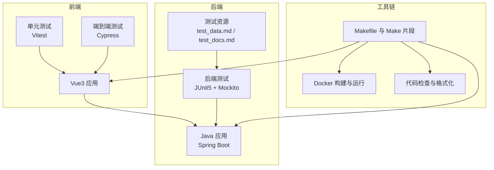
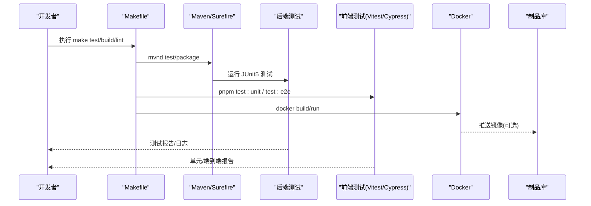
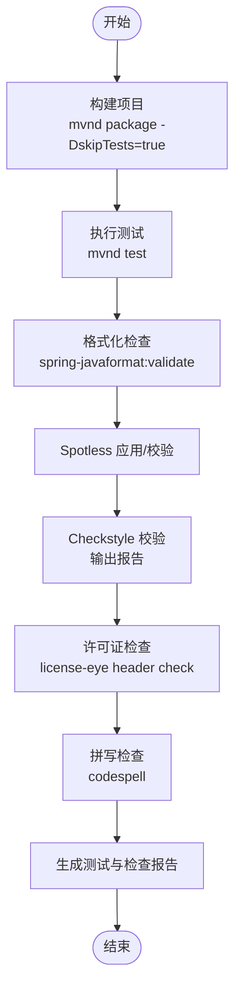
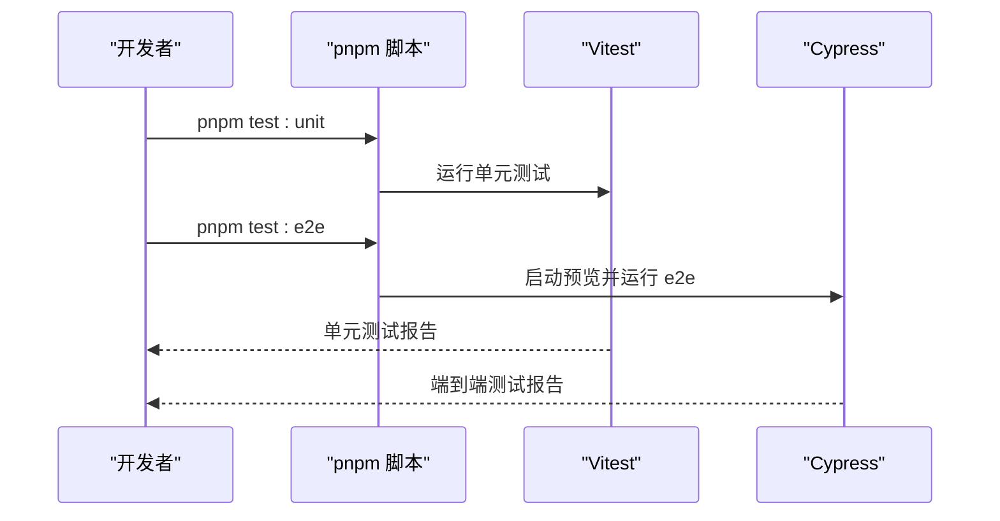
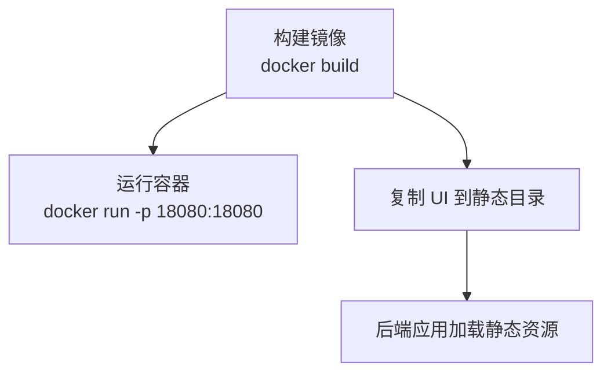
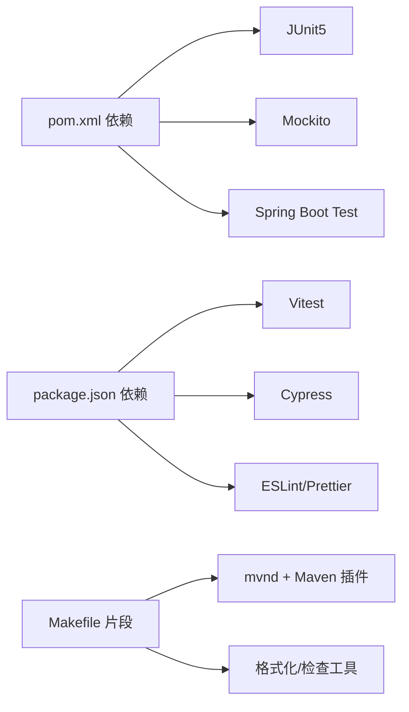

# 测试自动化

<cite>
**本文引用的文件**
- [Makefile](file://Makefile)
- [pom.xml](file://pom.xml)
- [common.mk](file://tools/make/common.mk)
- [java.mk](file://tools/make/java.mk)
- [linter.mk](file://tools/make/linter.mk)
- [docker.mk](file://tools/make/docker.mk)
- [ui.mk](file://tools/make/ui.mk)
- [test_data.md](file://src/test/resources/test_data.md)
- [test_docs.md](file://src/test/resources/test_docs.md)
- [DynamicHeaderPreservationTest.java](file://src/test/java/com/alibaba/cloud/ai/lynxe/llm/DynamicHeaderPreservationTest.java)
- [McpConfigValidatorTest.java](file://src/test/java/com/alibaba/cloud/ai/lynxe/mcp/service/McpConfigValidatorTest.java)
- [ExcelProcessingServiceTest.java](file://src/test/java/com/alibaba/cloud/ai/lynxe/tool/excelProcessor/ExcelProcessingServiceTest.java)
- [JsxGeneratorIntegrationTest.java](file://src/test/java/com/alibaba/cloud/ai/lynxe/tool/jsxGenerator/JsxGeneratorIntegrationTest.java)
- [PptGeneratorIntegrationTest.java](file://src/test/java/com/alibaba/cloud/ai/lynxe/tool/pptGenerator/PptGeneratorIntegrationTest.java)
- [SimpleHierarchicalFileAccessTest.java](file://src/test/java/com/alibaba/cloud/ai/lynxe/tool/textOperator/SimpleHierarchicalFileAccessTest.java)
- [package.json](file://ui-vue3/package.json)
- [cypress.config.ts](file://ui-vue3/cypress.config.ts)
</cite>

## 目录
1. [简介](#简介)
2. [项目结构](#项目结构)
3. [核心组件](#核心组件)
4. [架构总览](#架构总览)
5. [详细组件分析](#详细组件分析)
6. [依赖关系分析](#依赖关系分析)
7. [性能考量](#性能考量)
8. [故障排查指南](#故障排查指南)
9. [结论](#结论)
10. [附录](#附录)

## 简介
本文件为 Lynxe 测试自动化综合文档，围绕 CI/CD 流水线配置、自动化测试执行与质量门禁、Makefile 构建脚本中的测试命令与代码检查工具集成、安全扫描流程、GitHub Actions 工作流配置、测试并行与报告、测试环境自动部署与测试数据准备、测试结果分析、覆盖率监控、缺陷自动跟踪与回归测试自动化等方面进行系统化说明。文档同时提供最佳实践、持续集成策略与测试优化技巧，帮助团队建立稳定高效的测试自动化体系。

## 项目结构
Lynxe 采用多模块工程组织，包含后端 Java 应用、前端 Vue3 UI、测试资源与 Makefile 工具链。测试覆盖后端单元/集成测试与前端单元/端到端测试，配合 Docker 容器化与 UI 静态资源打包，形成可重复的自动化流水线。

图示来源
- [Makefile:17-30](file://Makefile#L17-L30)
- [java.mk:17-47](file://tools/make/java.mk#L17-L47)
- [ui.mk:17-51](file://tools/make/ui.mk#L17-L51)
- [docker.mk:24-46](file://tools/make/docker.mk#L24-L46)
- [linter.mk:17-65](file://tools/make/linter.mk#L17-L65)

章节来源
- [Makefile:17-30](file://Makefile#L17-L30)
- [common.mk:30-35](file://tools/make/common.mk#L30-L35)

## 核心组件
- 测试执行引擎
  - 后端：通过 Maven Surefire 插件执行 JUnit5 测试，支持跳过测试与并行配置参数。
  - 前端：Vitest 执行单元测试；Cypress 执行端到端测试。
- 代码检查与格式化
  - Java：Spring JavaFormat、Spotless、Checkstyle。
  - 文档与配置：Codespell、YamlLint、LicenseEye、Markdownlint。
- 容器化与部署
  - Docker 镜像构建与容器运行，支持 UI 静态资源复制。
- 测试数据与资源
  - 提供测试数据表格与长文档资源，用于工具链功能验证。

章节来源
- [pom.xml:414-439](file://pom.xml#L414-L439)
- [package.json:6-27](file://ui-vue3/package.json#L6-L27)
- [java.mk:17-47](file://tools/make/java.mk#L17-L47)
- [linter.mk:17-65](file://tools/make/linter.mk#L17-L65)
- [docker.mk:24-46](file://tools/make/docker.mk#L24-L46)
- [test_data.md:1-19](file://src/test/resources/test_data.md#L1-L19)
- [test_docs.md:1-800](file://src/test/resources/test_docs.md#L1-L800)

## 架构总览
下图展示从本地开发到 CI/CD 的测试自动化路径：开发者通过 Makefile 触发构建、格式化、检查与测试；CI 环境复用相同目标；Docker 用于服务与 UI 集成；前端通过 Vitest/Cypress 完成单元与端到端测试。

图示来源
- [Makefile:17-30](file://Makefile#L17-L30)
- [java.mk:17-47](file://tools/make/java.mk#L17-L47)
- [ui.mk:17-51](file://tools/make/ui.mk#L17-L51)
- [docker.mk:24-46](file://tools/make/docker.mk#L24-L46)
- [package.json:6-27](file://ui-vue3/package.json#L6-L27)

## 详细组件分析

### 后端测试执行与质量门禁
- 测试执行
  - 使用 Maven Surefire 插件，包含测试过滤、时区设置与 JUnit5 配置参数。
  - Makefile 中通过 mvnd 执行测试，支持并行关闭与条件激活禁用。
- 质量门禁
  - 格式化：Spring JavaFormat 与 Spotless。
  - 检查：Checkstyle 输出报告文件。
  - 许可证与拼写：LicenseEye 与 Codespell。
- 测试覆盖与结果
  - 可结合覆盖率工具（JaCoCo）在 CI 中生成覆盖率报告；当前仓库未直接集成，可在 CI 中补充。

图示来源
- [java.mk:17-47](file://tools/make/java.mk#L17-L47)
- [linter.mk:17-65](file://tools/make/linter.mk#L17-L65)
- [pom.xml:414-439](file://pom.xml#L414-L439)

章节来源
- [pom.xml:414-439](file://pom.xml#L414-L439)
- [java.mk:17-47](file://tools/make/java.mk#L17-L47)
- [linter.mk:17-65](file://tools/make/linter.mk#L17-L65)

### 前端测试执行与报告
- 单元测试：Vitest，支持类型检查与快速运行。
- 端到端测试：Cypress，提供预览与本地开发模式。
- 开发脚本：统一在 package.json 中定义，便于本地与 CI 复用。

图示来源
- [package.json:6-27](file://ui-vue3/package.json#L6-L27)
- [cypress.config.ts](file://ui-vue3/cypress.config.ts)

章节来源
- [package.json:6-27](file://ui-vue3/package.json#L6-L27)

### 测试数据与资源准备
- 测试数据表格：用于表格处理工具的验证。
- 长文档资源：用于文本/文档类工具的处理与解析测试。

章节来源
- [test_data.md:1-19](file://src/test/resources/test_data.md#L1-L19)
- [test_docs.md:1-800](file://src/test/resources/test_docs.md#L1-L800)

### 测试用例示例与覆盖点
- 动态头部保留测试：验证请求头在适配层的传递与保留。
- MCP 配置校验测试：验证 MCP 配置的合法性与有效性。
- Excel 处理服务测试：验证 Excel 数据读取与转换逻辑。
- JSX 生成集成测试：验证前端组件生成与渲染。
- PPT 生成集成测试：验证演示文稿生成流程。
- 文件层级访问测试：验证文件系统操作与权限。

章节来源
- [DynamicHeaderPreservationTest.java](file://src/test/java/com/alibaba/cloud/ai/lynxe/llm/DynamicHeaderPreservationTest.java)
- [McpConfigValidatorTest.java](file://src/test/java/com/alibaba/cloud/ai/lynxe/mcp/service/McpConfigValidatorTest.java)
- [ExcelProcessingServiceTest.java](file://src/test/java/com/alibaba/cloud/ai/lynxe/tool/excelProcessor/ExcelProcessingServiceTest.java)
- [JsxGeneratorIntegrationTest.java](file://src/test/java/com/alibaba/cloud/ai/lynxe/tool/jsxGenerator/JsxGeneratorIntegrationTest.java)
- [PptGeneratorIntegrationTest.java](file://src/test/java/com/alibaba/cloud/ai/lynxe/tool/pptGenerator/PptGeneratorIntegrationTest.java)
- [SimpleHierarchicalFileAccessTest.java](file://src/test/java/com/alibaba/cloud/ai/lynxe/tool/textOperator/SimpleHierarchicalFileAccessTest.java)

### 容器化与部署
- Docker 镜像构建与运行，支持端口映射与容器命名。
- UI 静态资源复制至后端静态目录，实现前后端一体化部署。

图示来源
- [docker.mk:24-46](file://tools/make/docker.mk#L24-L46)
- [ui.mk:41-51](file://tools/make/ui.mk#L41-L51)

章节来源
- [docker.mk:24-46](file://tools/make/docker.mk#L24-L46)
- [ui.mk:41-51](file://tools/make/ui.mk#L41-L51)

## 依赖关系分析
- 后端测试依赖
  - JUnit5、Mockito、Spring Boot Starter Test。
  - Maven Surefire 插件配置测试过滤与并行参数。
- 前端测试依赖
  - Vitest、Cypress、Vue Test Utils、ESLint、Prettier。
- 工具链依赖
  - mvnd（Maven Daemon）、Spring JavaFormat、Spotless、Checkstyle、Codespell、YamlLint、LicenseEye、Markdownlint。

图示来源
- [pom.xml:309-353](file://pom.xml#L309-L353)
- [package.json:28-81](file://ui-vue3/package.json#L28-L81)
- [java.mk:17-47](file://tools/make/java.mk#L17-L47)
- [linter.mk:17-65](file://tools/make/linter.mk#L17-L65)

章节来源
- [pom.xml:309-353](file://pom.xml#L309-L353)
- [package.json:28-81](file://ui-vue3/package.json#L28-L81)
- [java.mk:17-47](file://tools/make/java.mk#L17-L47)
- [linter.mk:17-65](file://tools/make/linter.mk#L17-L65)

## 性能考量
- 测试并行
  - 当前 JUnit5 并行执行被显式关闭，建议在 CI 中按任务类型拆分并开启并行以缩短总时长。
- 构建加速
  - 使用 mvnd 减少启动开销；分离 build 与 test 步骤，避免重复编译。
- 前端测试
  - Vitest 默认快速，建议在 CI 中缓存依赖与浏览器驱动，减少冷启动时间。
- 覆盖率
  - 建议引入 JaCoCo 在 CI 中生成覆盖率报告并与 PR 质量门禁联动。

## 故障排查指南
- 测试超时或失败
  - 检查时区与系统属性配置；确认 mvnd 连接超时参数是否合理。
- 格式化/检查失败
  - 优先执行修复目标（如 spring-javaformat:apply、spotless:apply、yamlfmt），再运行校验目标。
- 前端测试失败
  - 确认本地 Node 版本与依赖安装；使用 dev 模式先定位问题。
- 容器部署异常
  - 检查端口占用与镜像标签；确保静态资源复制步骤成功。

章节来源
- [java.mk:17-47](file://tools/make/java.mk#L17-L47)
- [linter.mk:17-65](file://tools/make/linter.mk#L17-L65)
- [ui.mk:17-51](file://tools/make/ui.mk#L17-L51)
- [package.json:6-27](file://ui-vue3/package.json#L6-L27)

## 结论
通过 Makefile 片段化组织、Maven 与前端脚本的统一调度、以及 Docker 的标准化部署，Lynxe 已具备完善的测试自动化基础。建议在 CI 中补充覆盖率统计、并行测试策略与缺陷自动跟踪机制，并将测试报告与质量门禁集成，持续提升交付质量与效率。

## 附录
- 最佳实践
  - 将测试与检查作为质量门禁强制执行；对关键路径开启并行测试。
  - 使用固定版本的工具链与锁文件，保证本地与 CI 一致性。
  - 将测试数据与资源纳入版本控制，便于回溯与复现。
- 持续集成策略
  - 分层流水线：格式化/检查 → 单元测试 → 集成/端到端测试 → 构建与部署。
  - 失败即停，尽早暴露问题；对慢任务进行缓存与并行化。
- 测试优化技巧
  - 前端测试使用 headless 模式；后端测试隔离数据库与外部依赖。
  - 使用参数化与数据驱动测试提高覆盖面；对 UI 测试进行稳定性优化。