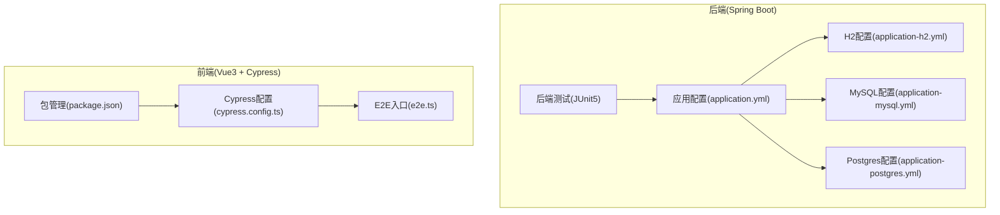
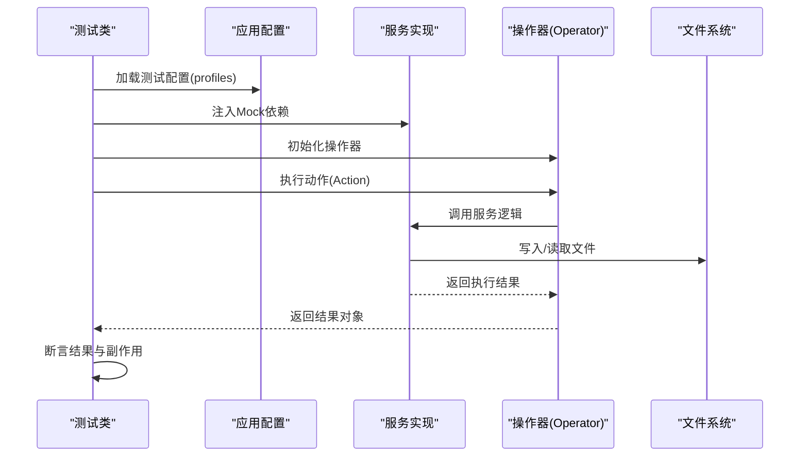
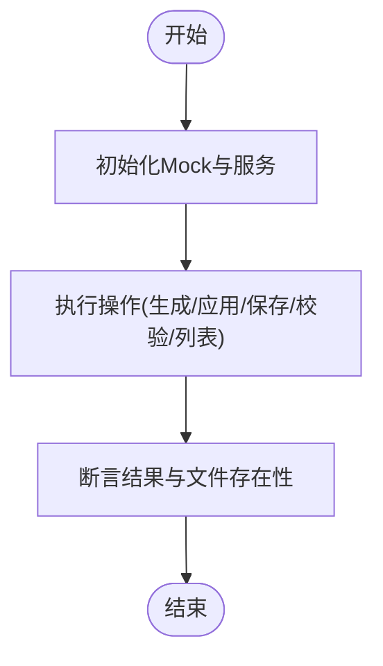
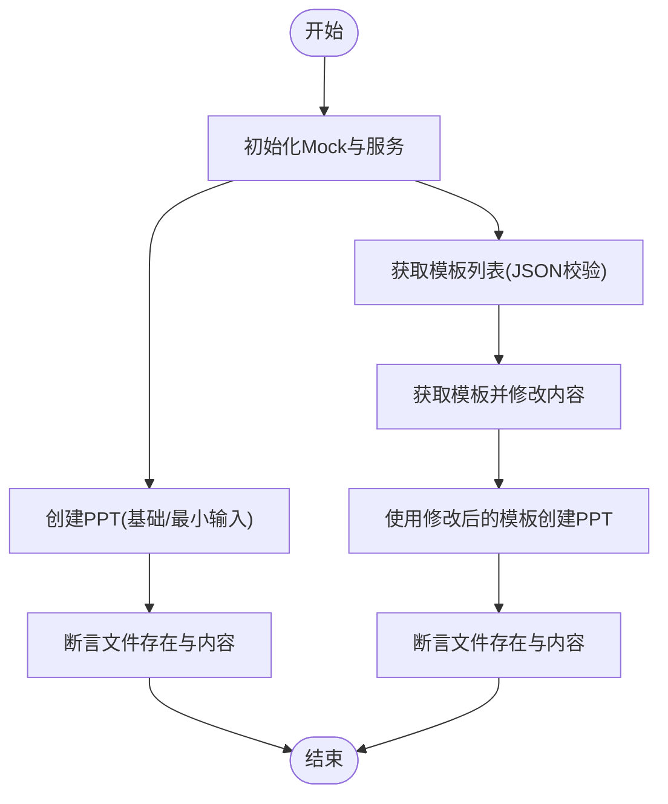
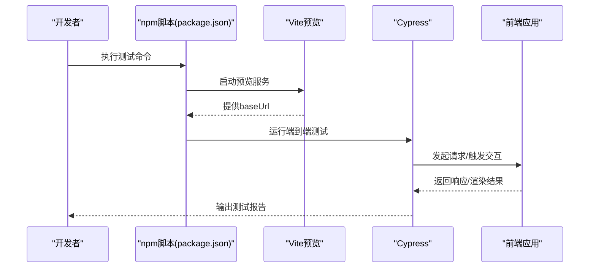
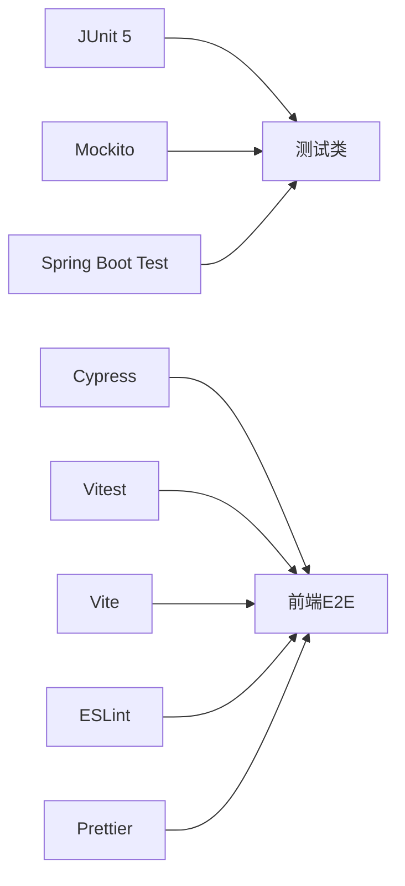

# 集成测试

<cite>
**本文引用的文件**
- [pom.xml](file://pom.xml)
- [application.yml](file://src/main/resources/application.yml)
- [application-h2.yml](file://src/main/resources/application-h2.yml)
- [application-mysql.yml](file://src/main/resources/application-mysql.yml)
- [application-postgres.yml](file://src/main/resources/application-postgres.yml)
- [JsxGeneratorIntegrationTest.java](file://src/test/java/com/alibaba/cloud/ai/lynxe/tool/jsxGenerator/JsxGeneratorIntegrationTest.java)
- [PptGeneratorIntegrationTest.java](file://src/test/java/com/alibaba/cloud/ai/lynxe/tool/pptGenerator/PptGeneratorIntegrationTest.java)
- [cypress.config.ts](file://ui-vue3/cypress.config.ts)
- [e2e.ts](file://ui-vue3/cypress/support/e2e.ts)
- [package.json](file://ui-vue3/package.json)
- [test_data.md](file://src/test/resources/test_data.md)
- [test_docs.md](file://src/test/resources/test_docs.md)
</cite>

## 目录
1. [简介](#简介)
2. [项目结构](#项目结构)
3. [核心组件](#核心组件)
4. [架构总览](#架构总览)
5. [详细组件分析](#详细组件分析)
6. [依赖分析](#依赖分析)
7. [性能考虑](#性能考虑)
8. [故障排查指南](#故障排查指南)
9. [结论](#结论)
10. [附录](#附录)

## 简介
本文件面向Lynxe项目的集成测试，系统化梳理Spring Boot后端集成测试配置与实施方法，覆盖测试数据库设置、外部服务模拟与API端点测试；重点解析Excel处理服务、JSX生成器、PPT生成器的集成测试实现；阐述前端集成测试策略（Cypress端到端测试配置、UI组件测试与用户交互验证）；并提供测试环境搭建、测试数据管理与测试自动化流程的最佳实践。

## 项目结构
Lynxe采用前后端分离架构，后端基于Spring Boot，前端基于Vue3 + Vite。测试体系由后端JUnit 5单元/集成测试、前端Cypress端到端测试与Vitest单元测试组成。后端通过多数据源配置支持H2、MySQL、Postgres，便于在不同环境中运行集成测试。

**图示来源**
- [application.yml:1-97](file://src/main/resources/application.yml#L1-L97)
- [application-h2.yml:1-23](file://src/main/resources/application-h2.yml#L1-L23)
- [application-mysql.yml:1-15](file://src/main/resources/application-mysql.yml#L1-L15)
- [application-postgres.yml:1-15](file://src/main/resources/application-postgres.yml#L1-L15)
- [cypress.config.ts:1-24](file://ui-vue3/cypress.config.ts#L1-L24)
- [e2e.ts:1-21](file://ui-vue3/cypress/support/e2e.ts#L1-L21)
- [package.json:1-100](file://ui-vue3/package.json#L1-L100)

**章节来源**
- [application.yml:1-97](file://src/main/resources/application.yml#L1-L97)
- [application-h2.yml:1-23](file://src/main/resources/application-h2.yml#L1-L23)
- [application-mysql.yml:1-15](file://src/main/resources/application-mysql.yml#L1-L15)
- [application-postgres.yml:1-15](file://src/main/resources/application-postgres.yml#L1-L15)
- [cypress.config.ts:1-24](file://ui-vue3/cypress.config.ts#L1-L24)
- [e2e.ts:1-21](file://ui-vue3/cypress/support/e2e.ts#L1-L21)
- [package.json:1-100](file://ui-vue3/package.json#L1-L100)

## 核心组件
- 测试数据库配置：通过profiles切换H2/MySQL/Postgres，结合JPA DDL与Hikari连接池参数，确保测试环境一致性与可重复性。
- 外部服务模拟：通过Mockito对依赖进行注入与行为模拟，隔离真实外部调用。
- API端点测试：结合Spring Boot Test与WebTestClient/REST Assured（如使用），验证控制器层正确性。
- Excel处理服务：以工具类为核心，通过输入输出校验与文件落盘验证集成效果。
- JSX生成器：通过Operator封装执行逻辑，测试覆盖模板应用、文件保存、代码校验与最小输入场景。
- PPT生成器：通过Operator封装执行逻辑，测试覆盖基础创建、模板列表与模板应用、最小输入场景。
- 前端集成测试：Cypress配置baseUrl指向本地Vite预览端口，统一管理E2E脚本路径与命令。

**章节来源**
- [pom.xml:310-353](file://pom.xml#L310-L353)
- [JsxGeneratorIntegrationTest.java:1-455](file://src/test/java/com/alibaba/cloud/ai/lynxe/tool/jsxGenerator/JsxGeneratorIntegrationTest.java#L1-L455)
- [PptGeneratorIntegrationTest.java:1-334](file://src/test/java/com/alibaba/cloud/ai/lynxe/tool/pptGenerator/PptGeneratorIntegrationTest.java#L1-L334)

## 架构总览
下图展示后端集成测试的整体架构：测试驱动配置加载、依赖注入与服务执行，最终通过断言验证结果与副作用（文件落盘、JSON返回等）。

**图示来源**
- [JsxGeneratorIntegrationTest.java:60-123](file://src/test/java/com/alibaba/cloud/ai/lynxe/tool/jsxGenerator/JsxGeneratorIntegrationTest.java#L60-L123)
- [PptGeneratorIntegrationTest.java:60-91](file://src/test/java/com/alibaba/cloud/ai/lynxe/tool/pptGenerator/PptGeneratorIntegrationTest.java#L60-L91)

## 详细组件分析

### Excel处理服务集成测试
- 测试目标：验证Excel处理工具在不同输入下的正确性与稳定性。
- 实施要点：
  - 使用测试数据文件作为输入，覆盖典型表格结构。
  - 通过工具返回值与中间产物（如临时文件）进行断言。
  - 结合不同数据源配置，验证跨数据库一致性。
- 数据准备：提供标准测试数据表格与长文本文档，用于验证表格解析与内容提取能力。

**章节来源**
- [test_data.md:1-19](file://src/test/resources/test_data.md#L1-L19)
- [test_docs.md:1-800](file://src/test/resources/test_docs.md#L1-L800)

### JSX生成器集成测试
- 测试目标：验证JSX/Vue组件生成、模板应用、文件保存与代码校验功能。
- 实施要点：
  - 通过反射注入依赖，绕过Spring容器直接构造服务实例。
  - 使用Mock UnifiedDirectoryManager，将输出重定向至临时目录，便于断言文件存在与内容。
  - 覆盖多种Action：生成Vue组件、应用Handlebars模板、保存SFC文件、校验SFC代码、列出可用模板、最小输入与无效操作。
- 关键断言：
  - 结果字符串包含成功标识。
  - 生成文件存在且内容符合预期。
  - 列表模板返回包含关键模板名。

**图示来源**
- [JsxGeneratorIntegrationTest.java:125-170](file://src/test/java/com/alibaba/cloud/ai/lynxe/tool/jsxGenerator/JsxGeneratorIntegrationTest.java#L125-L170)
- [JsxGeneratorIntegrationTest.java:172-215](file://src/test/java/com/alibaba/cloud/ai/lynxe/tool/jsxGenerator/JsxGeneratorIntegrationTest.java#L172-L215)
- [JsxGeneratorIntegrationTest.java:218-289](file://src/test/java/com/alibaba/cloud/ai/lynxe/tool/jsxGenerator/JsxGeneratorIntegrationTest.java#L218-L289)
- [JsxGeneratorIntegrationTest.java:291-350](file://src/test/java/com/alibaba/cloud/ai/lynxe/tool/jsxGenerator/JsxGeneratorIntegrationTest.java#L291-L350)
- [JsxGeneratorIntegrationTest.java:352-386](file://src/test/java/com/alibaba/cloud/ai/lynxe/tool/jsxGenerator/JsxGeneratorIntegrationTest.java#L352-L386)
- [JsxGeneratorIntegrationTest.java:388-420](file://src/test/java/com/alibaba/cloud/ai/lynxe/tool/jsxGenerator/JsxGeneratorIntegrationTest.java#L388-L420)
- [JsxGeneratorIntegrationTest.java:422-452](file://src/test/java/com/alibaba/cloud/ai/lynxe/tool/jsxGenerator/JsxGeneratorIntegrationTest.java#L422-L452)

**章节来源**
- [JsxGeneratorIntegrationTest.java:1-455](file://src/test/java/com/alibaba/cloud/ai/lynxe/tool/jsxGenerator/JsxGeneratorIntegrationTest.java#L1-L455)

### PPT生成器集成测试
- 测试目标：验证PPT创建、模板列表与模板应用、最小输入场景。
- 实施要点：
  - 通过反射注入依赖，构造服务与操作器实例。
  - Mock UnifiedDirectoryManager，将输出重定向至临时目录。
  - 覆盖基础创建、最小输入、模板列表与模板应用（解析JSON、修改模板内容后重新创建）。
- 关键断言：
  - 结果字符串包含成功标识。
  - 生成文件存在且非空。
  - 模板列表返回有效JSON，可提取模板路径并进一步验证模板内容。

**图示来源**
- [PptGeneratorIntegrationTest.java:93-143](file://src/test/java/com/alibaba/cloud/ai/lynxe/tool/pptGenerator/PptGeneratorIntegrationTest.java#L93-L143)
- [PptGeneratorIntegrationTest.java:145-186](file://src/test/java/com/alibaba/cloud/ai/lynxe/tool/pptGenerator/PptGeneratorIntegrationTest.java#L145-L186)
- [PptGeneratorIntegrationTest.java:188-331](file://src/test/java/com/alibaba/cloud/ai/lynxe/tool/pptGenerator/PptGeneratorIntegrationTest.java#L188-L331)

**章节来源**
- [PptGeneratorIntegrationTest.java:1-334](file://src/test/java/com/alibaba/cloud/ai/lynxe/tool/pptGenerator/PptGeneratorIntegrationTest.java#L1-L334)

### 前端集成测试策略（Cypress）
- 端到端测试配置：
  - Cypress配置指定baseUrl为本地Vite预览地址，统一管理E2E脚本路径。
  - 支持在开发模式下打开交互式测试界面，或在CI中批量运行。
- UI组件测试与用户交互验证：
  - 通过命令扩展与页面对象模式组织测试用例。
  - 验证路由导航、表单提交、对话框弹出、文件上传等关键交互。
- 自动化流程：
  - package.json脚本组合Vite预览与Cypress执行，便于本地与CI集成。

**图示来源**
- [cypress.config.ts:18-22](file://ui-vue3/cypress.config.ts#L18-L22)
- [e2e.ts:17-20](file://ui-vue3/cypress/support/e2e.ts#L17-L20)
- [package.json:6-26](file://ui-vue3/package.json#L6-L26)

**章节来源**
- [cypress.config.ts:1-24](file://ui-vue3/cypress.config.ts#L1-L24)
- [e2e.ts:1-21](file://ui-vue3/cypress/support/e2e.ts#L1-L21)
- [package.json:1-100](file://ui-vue3/package.json#L1-L100)

## 依赖分析
- 测试框架与工具链：
  - 后端：JUnit 5、Mockito、Spring Boot Starter Test。
  - 前端：Cypress、Vitest、Vite、ESLint、Prettier。
- 数据库与ORM：
  - H2/MySQL/Postgres三套配置，结合JPA与Hikari，满足不同测试场景。
- 关键依赖关系：
  - 测试类依赖Mockito注入的依赖对象，减少对外部系统的耦合。
  - 前端测试脚本依赖Cypress配置与Vite预览服务。

**图示来源**
- [pom.xml:310-353](file://pom.xml#L310-L353)
- [package.json:47-81](file://ui-vue3/package.json#L47-L81)

**章节来源**
- [pom.xml:310-353](file://pom.xml#L310-L353)
- [package.json:1-100](file://ui-vue3/package.json#L1-L100)

## 性能考虑
- 测试数据库性能：
  - 合理设置Hikari连接池参数，避免连接泄漏与超时。
  - 在H2内存模式下进行快速集成测试，在MySQL/Postgres中进行一致性验证。
- 测试执行效率：
  - 使用Mockito替代真实外部服务，减少I/O与网络延迟。
  - 将文件输出重定向至内存或临时目录，避免磁盘抖动。
- 前端测试性能：
  - 使用Vite快速启动与热更新，缩短测试等待时间。
  - 控制并发与并行策略，避免浏览器实例过多导致资源争用。

## 故障排查指南
- 配置问题：
  - 确认profiles与数据源配置一致，避免DDL异常或连接失败。
  - 检查JPA方言与数据库平台匹配，防止Schema不兼容。
- 依赖注入问题：
  - 反射注入失败时检查字段可见性与类型匹配。
  - 确保Mock对象行为与期望一致，避免空指针或断言失败。
- 文件落盘问题：
  - 校验输出目录权限与路径拼接逻辑，确保文件存在且可读。
  - 对于模板应用场景，注意JSON解析与路径提取的健壮性。
- 前端测试问题：
  - 确认baseUrl与端口一致，避免Cypress无法连接应用。
  - 检查脚本命令与依赖安装状态，确保本地与CI环境一致。

**章节来源**
- [application.yml:20-38](file://src/main/resources/application.yml#L20-L38)
- [application-h2.yml:1-23](file://src/main/resources/application-h2.yml#L1-L23)
- [application-mysql.yml:1-15](file://src/main/resources/application-mysql.yml#L1-L15)
- [application-postgres.yml:1-15](file://src/main/resources/application-postgres.yml#L1-L15)
- [JsxGeneratorIntegrationTest.java:74-88](file://src/test/java/com/alibaba/cloud/ai/lynxe/tool/jsxGenerator/JsxGeneratorIntegrationTest.java#L74-L88)
- [PptGeneratorIntegrationTest.java:70-80](file://src/test/java/com/alibaba/cloud/ai/lynxe/tool/pptGenerator/PptGeneratorIntegrationTest.java#L70-L80)
- [cypress.config.ts:18-22](file://ui-vue3/cypress.config.ts#L18-L22)

## 结论
Lynxe的集成测试体系通过多数据源配置、Mock外部依赖与统一的测试脚本，实现了后端工具链与前端交互的全面覆盖。建议在持续集成中分别运行后端与前端测试，并结合性能监控与日志分析，持续优化测试效率与稳定性。

## 附录
- 测试环境搭建步骤（建议）：
  - 安装Node与Java环境，确保版本满足工程要求。
  - 安装前端依赖与后端依赖，按需安装数据库。
  - 设置环境变量与配置文件，选择合适的profile。
  - 运行后端测试与前端测试脚本，观察结果与日志。
- 测试数据管理：
  - 使用仓库中的测试数据文件作为基准输入，必要时扩展更多样例。
  - 对长文档与表格数据进行版本控制，便于回归测试。
- 测试自动化流程：
  - 在CI中按顺序执行后端测试、前端单元测试与端到端测试。
  - 对关键分支与变更集进行冒烟测试与回归测试，确保质量门槛。