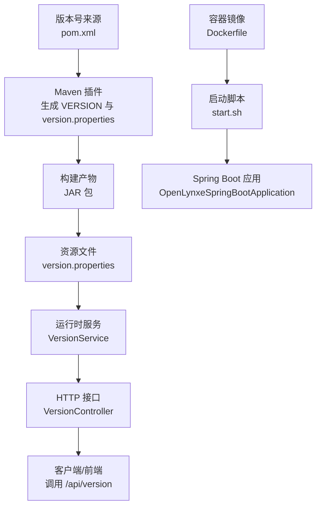
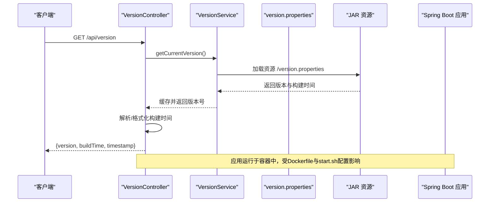
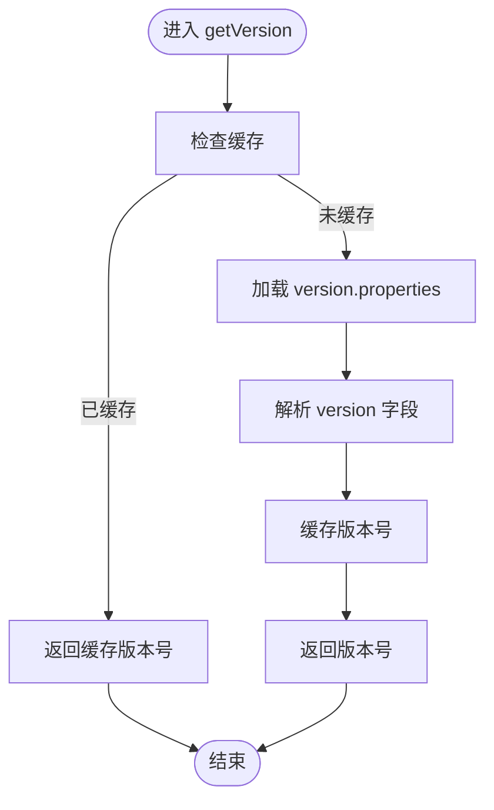
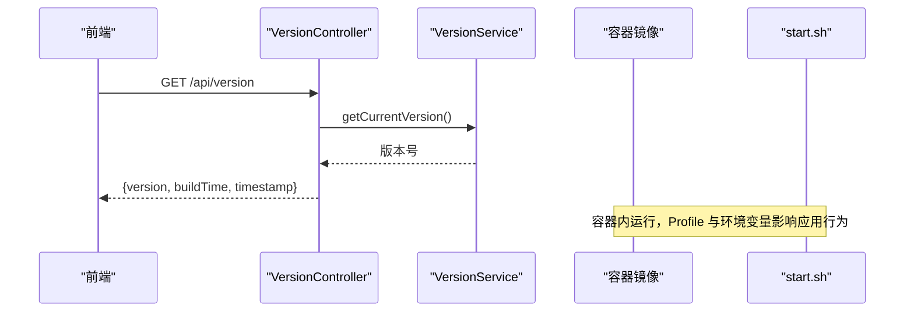
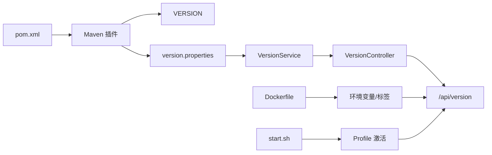

# 版本更新

<cite>
**本文引用的文件**   
- [pom.xml](file://pom.xml)
- [VERSION](file://VERSION)
- [version.properties](file://src/main/resources/version.properties)
- [VersionController.java](file://src/main/java/com/alibaba/cloud/ai/lynxe/runtime/controller/VersionController.java)
- [VersionService.java](file://src/main/java/com/alibaba/cloud/ai/lynxe/runtime/service/VersionService.java)
- [Dockerfile](file://deploy/Dockerfile)
- [start.sh](file://deploy/start.sh)
- [application.yml](file://src/main/resources/application.yml)
- [README.md](file://README.md)
- [git_initinal_new_branch.md](file://src/temp/git_initinal_new_branch.md)
- [git_push_tag.md](file://src/temp/git_push_tag.md)
</cite>

## 目录
1. [简介](#简介)
2. [项目结构](#项目结构)
3. [核心组件](#核心组件)
4. [架构总览](#架构总览)
5. [详细组件分析](#详细组件分析)
6. [依赖分析](#依赖分析)
7. [性能考虑](#性能考虑)
8. [故障排查指南](#故障排查指南)
9. [结论](#结论)
10. [附录](#附录)

## 简介
本文件面向Lynxe版本管理与发布，基于仓库中的构建与运行配置，系统化梳理版本号规则、发布周期与策略、版本历史与变更、升级与兼容性、破坏性变更与弃用处理、回滚与降级流程、预发布与稳定版本差异、发布检查清单、质量保证与用户通知机制等。文档同时给出可操作的升级与回滚步骤，并通过图示展示版本信息在系统中的采集与暴露路径。

## 项目结构
围绕版本管理的关键文件与职责如下：
- 版本号来源与打包产物
  - pom.xml：定义项目版本号与构建插件，生成版本属性文件与VERSION文件
  - VERSION：由Maven插件写入的纯文本版本号
  - version.properties：构建期注入版本与构建时间，随JAR资源分发
- 运行时版本查询
  - VersionController：对外提供版本信息接口
  - VersionService：从资源加载版本信息并缓存
- 容器镜像与部署
  - Dockerfile：多阶段构建，设置运行时环境变量与标签
  - start.sh：容器启动脚本，设置浏览器与JVM参数，激活Spring Profile
- 应用配置
  - application.yml：默认Profile与运行参数，影响版本信息的可用性与一致性

图表来源
- [pom.xml:356-552](file://pom.xml#L356-L552)
- [version.properties:1-6](file://src/main/resources/version.properties#L1-L6)
- [VersionController.java:65-82](file://src/main/java/com/alibaba/cloud/ai/lynxe/runtime/controller/VersionController.java#L65-L82)
- [VersionService.java:45-50](file://src/main/java/com/alibaba/cloud/ai/lynxe/runtime/service/VersionService.java#L45-L50)
- [Dockerfile:115-137](file://deploy/Dockerfile#L115-L137)
- [start.sh:89-91](file://deploy/start.sh#L89-L91)

章节来源
- [pom.xml:10](file://pom.xml#L10)
- [VERSION:1](file://VERSION#L1)
- [version.properties:1-6](file://src/main/resources/version.properties#L1-L6)
- [application.yml:6](file://src/main/resources/application.yml#L6)

## 核心组件
- 版本号来源与一致性
  - 项目版本号由pom.xml定义，构建时写入VERSION与version.properties，确保运行时与构建时一致
- 运行时版本信息
  - VersionService从classpath资源读取version.properties，缓存版本号；VersionController对外暴露GET /api/version，返回版本号与构建时间
- 容器化与环境变量
  - Dockerfile设置JAVA_OPTS、PLAYWRIGHT_BROWSERS_PATH等；start.sh激活h2,docker Profile并启动应用
- 默认Profile与运行参数
  - application.yml默认启用h2 Profile，影响数据库初始化与运行行为

章节来源
- [pom.xml:356-552](file://pom.xml#L356-L552)
- [VersionController.java:65-82](file://src/main/java/com/alibaba/cloud/ai/lynxe/runtime/controller/VersionController.java#L65-L82)
- [VersionService.java:45-50](file://src/main/java/com/alibaba/cloud/ai/lynxe/runtime/service/VersionService.java#L45-L50)
- [Dockerfile:115-137](file://deploy/Dockerfile#L115-L137)
- [start.sh:89-91](file://deploy/start.sh#L89-L91)
- [application.yml:6](file://src/main/resources/application.yml#L6)

## 架构总览
下图展示版本信息在系统中的采集与暴露路径，以及与容器运行时的关系。

图表来源
- [VersionController.java:65-82](file://src/main/java/com/alibaba/cloud/ai/lynxe/runtime/controller/VersionController.java#L65-L82)
- [VersionController.java:88-107](file://src/main/java/com/alibaba/cloud/ai/lynxe/runtime/controller/VersionController.java#L88-L107)
- [VersionService.java:45-50](file://src/main/java/com/alibaba/cloud/ai/lynxe/runtime/service/VersionService.java#L45-L50)
- [version.properties:1-6](file://src/main/resources/version.properties#L1-L6)
- [Dockerfile:115-137](file://deploy/Dockerfile#L115-L137)
- [start.sh:89-91](file://deploy/start.sh#L89-L91)

## 详细组件分析

### 组件A：版本号规则与来源
- 规则要点
  - 版本号由pom.xml定义，构建时写入VERSION与version.properties
  - 运行时通过VersionService读取version.properties中的version字段
  - 若资源缺失或读取失败，默认返回“unknown”
- 复杂度与性能
  - VersionService对版本号进行一次缓存，后续请求无需重复IO
  - VersionController对构建时间进行一次缓存，避免重复解析
- 错误处理
  - 资源不存在或IO异常时记录日志并返回默认值
- 优化建议
  - 在CI中校验VERSION与pom.xml一致性，避免运行时与构建时不一致

图表来源
- [VersionService.java:45-50](file://src/main/java/com/alibaba/cloud/ai/lynxe/runtime/service/VersionService.java#L45-L50)
- [VersionController.java:65-82](file://src/main/java/com/alibaba/cloud/ai/lynxe/runtime/controller/VersionController.java#L65-L82)

章节来源
- [pom.xml:10](file://pom.xml#L10)
- [VERSION:1](file://VERSION#L1)
- [version.properties:1-6](file://src/main/resources/version.properties#L1-L6)
- [VersionService.java:45-50](file://src/main/java/com/alibaba/cloud/ai/lynxe/runtime/service/VersionService.java#L45-L50)
- [VersionController.java:65-82](file://src/main/java/com/alibaba/cloud/ai/lynxe/runtime/controller/VersionController.java#L65-L82)

### 组件B：版本信息API与容器集成
- API行为
  - GET /api/version 返回版本号、构建时间与当前时间戳
  - 构建时间若为ISO格式会转换为本地可读格式
- 容器集成
  - Dockerfile设置JAVA_OPTS、PLAYWRIGHT_BROWSERS_PATH等
  - start.sh以h2,docker Profile启动应用，确保与默认配置一致
- 兼容性
  - 前端可通过该接口获取版本信息，用于显示与诊断

图表来源
- [VersionController.java:65-82](file://src/main/java/com/alibaba/cloud/ai/lynxe/runtime/controller/VersionController.java#L65-L82)
- [VersionService.java:45-50](file://src/main/java/com/alibaba/cloud/ai/lynxe/runtime/service/VersionService.java#L45-L50)
- [Dockerfile:115-137](file://deploy/Dockerfile#L115-L137)
- [start.sh:89-91](file://deploy/start.sh#L89-L91)

章节来源
- [VersionController.java:65-82](file://src/main/java/com/alibaba/cloud/ai/lynxe/runtime/controller/VersionController.java#L65-L82)
- [Dockerfile:115-137](file://deploy/Dockerfile#L115-L137)
- [start.sh:89-91](file://deploy/start.sh#L89-L91)

### 组件C：发布与版本策略（基于仓库实践）
- 发布周期与策略
  - 通过分支与标签管理版本：维护者使用git_push_tag.md中的流程打标签并推送
  - 分支命名与版本号同步：git_initinal_new_branch.md描述了从主干创建新分支并同步版本号的流程
- 预发布与稳定版本
  - 仓库未显式区分预发布标识（如alpha/beta/rc），当前以pom.xml中的正式版本号作为稳定版本依据
- 长期支持版本
  - 仓库未提供LTS策略说明；如需支持，请在发布前明确分支策略与维护窗口

章节来源
- [git_push_tag.md:1-7](file://src/temp/git_push_tag.md#L1-L7)
- [git_initinal_new_branch.md:1-8](file://src/temp/git_initinal_new_branch.md#L1-L8)
- [pom.xml:10](file://pom.xml#L10)

### 组件D：升级与兼容性
- 升级路径
  - 使用Docker镜像：README.md提供官方镜像与运行命令，按需切换版本标签
  - 使用JAR：README.md提供下载与运行方式
- 兼容性说明
  - 默认Profile为h2；若迁移到MySQL/PostgreSQL，需激活对应Profile并在application.yml中配置数据源
  - 运行时环境变量（如JAVA_OPTS）由Dockerfile与start.sh统一设置
- 迁移步骤
  - 数据库迁移：根据application.yml中的Profile切换与数据源配置进行迁移
  - 配置迁移：保留application.yml中的关键参数（如文件上传、计划轮询等）

章节来源
- [README.md:85-151](file://README.md#L85-L151)
- [application.yml:6](file://src/main/resources/application.yml#L6)
- [application.yml:170-196](file://src/main/resources/application.yml#L170-L196)

### 组件E：破坏性变更、弃用与向后兼容
- 破坏性变更通知
  - 仓库未提供专门的破坏性变更公告；建议在发布说明中明确标注
- 弃用功能处理
  - 未发现弃用标记或过渡期策略；建议在版本说明中标注弃用项与替代方案
- 向后兼容性
  - VersionController与VersionService保持稳定的API与资源加载逻辑，具备较好的向后兼容性

章节来源
- [VersionController.java:65-82](file://src/main/java/com/alibaba/cloud/ai/lynxe/runtime/controller/VersionController.java#L65-L82)
- [VersionService.java:45-50](file://src/main/java/com/alibaba/cloud/ai/lynxe/runtime/service/VersionService.java#L45-L50)

### 组件F：回滚、降级与紧急修复
- 回滚与降级
  - Docker镜像版本标签可直接回退到历史版本
  - 若使用JAR，可下载历史版本并替换运行
- 紧急修复流程
  - 基于git_push_tag.md的标签与分支流程，可在修复后重新打标签并发布

章节来源
- [README.md:85-151](file://README.md#L85-L151)
- [git_push_tag.md:1-7](file://src/temp/git_push_tag.md#L1-L7)

### 组件G：版本发布检查清单（基于仓库实践）
- 构建一致性
  - 确认VERSION与pom.xml版本一致
  - 执行mvn package并通过UI侧检查（参考git_push_tag.md）
- 文档与发布
  - 更新README与发布说明
  - 打标签并推送到上游仓库
- 质量保证
  - 本地CI与静态检查（如Spotless、Checkstyle）通过后再提交
- 用户通知
  - 通过README与发布页通知用户版本变更与注意事项

章节来源
- [git_push_tag.md:1-7](file://src/temp/git_push_tag.md#L1-L7)
- [CONTRIBUTING.md:72-82](file://CONTRIBUTING.md#L72-L82)
- [CONTRIBUTING.md:76-78](file://CONTRIBUTING.md#L76-L78)

## 依赖分析
- 版本信息依赖链
  - pom.xml → Maven插件 → 生成VERSION与version.properties → JAR资源 → VersionService → VersionController → 客户端
- 运行时依赖
  - Dockerfile与start.sh共同决定运行时环境变量与Profile，间接影响版本信息的可用性与一致性

图表来源
- [pom.xml:356-552](file://pom.xml#L356-L552)
- [VERSION:1](file://VERSION#L1)
- [version.properties:1-6](file://src/main/resources/version.properties#L1-L6)
- [VersionService.java:45-50](file://src/main/java/com/alibaba/cloud/ai/lynxe/runtime/service/VersionService.java#L45-L50)
- [VersionController.java:65-82](file://src/main/java/com/alibaba/cloud/ai/lynxe/runtime/controller/VersionController.java#L65-L82)
- [Dockerfile:115-137](file://deploy/Dockerfile#L115-L137)
- [start.sh:89-91](file://deploy/start.sh#L89-L91)

章节来源
- [pom.xml:356-552](file://pom.xml#L356-L552)
- [VersionController.java:65-82](file://src/main/java/com/alibaba/cloud/ai/lynxe/runtime/controller/VersionController.java#L65-L82)
- [VersionService.java:45-50](file://src/main/java/com/alibaba/cloud/ai/lynxe/runtime/service/VersionService.java#L45-L50)

## 性能考虑
- 版本信息缓存
  - VersionService与VersionController均对结果进行缓存，避免重复IO与解析
- 构建时间格式化
  - 对ISO格式构建时间进行本地化转换，减少前端格式化开销
- 容器启动参数
  - Dockerfile设置合理的JVM与浏览器参数，有助于整体运行时性能

## 故障排查指南
- 版本信息为空或为“unknown”
  - 检查version.properties是否随JAR打包
  - 确认VersionService加载资源路径正确
- 构建时间显示异常
  - 确认version.properties中的build.time格式是否符合预期
  - 检查系统时区与日志输出
- 容器启动异常
  - 检查start.sh中的Profile与环境变量是否与application.yml一致
  - 确认Dockerfile中的JVM与浏览器依赖安装完成

章节来源
- [VersionService.java:56-75](file://src/main/java/com/alibaba/cloud/ai/lynxe/runtime/service/VersionService.java#L56-L75)
- [VersionController.java:88-107](file://src/main/java/com/alibaba/cloud/ai/lynxe/runtime/controller/VersionController.java#L88-L107)
- [Dockerfile:115-137](file://deploy/Dockerfile#L115-L137)
- [start.sh:89-91](file://deploy/start.sh#L89-L91)

## 结论
Lynxe的版本管理以pom.xml为核心，结合Maven插件自动生成版本与构建时间信息，并通过VersionService与VersionController在运行时稳定暴露。发布流程基于分支与标签实践，容器化部署通过Dockerfile与start.sh统一环境。建议在后续版本中完善破坏性变更公告、弃用策略与LTS规划，并在发布检查清单中强化质量门禁与用户通知机制。

## 附录
- 关键文件索引
  - 版本号来源：pom.xml、VERSION
  - 版本信息资源：version.properties
  - 运行时接口：VersionController、VersionService
  - 容器化：Dockerfile、start.sh
  - 默认配置：application.yml
  - 发布流程：git_initinal_new_branch.md、git_push_tag.md
  - 快速开始与发布：README.md