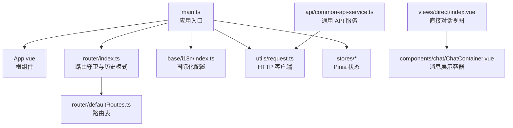
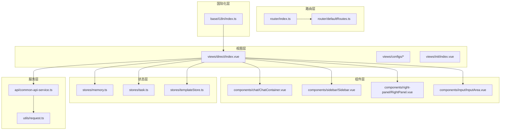
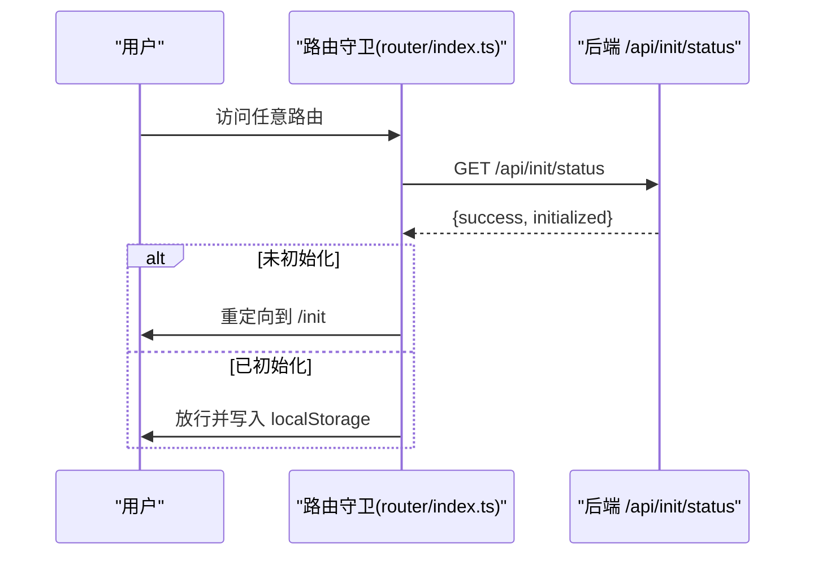
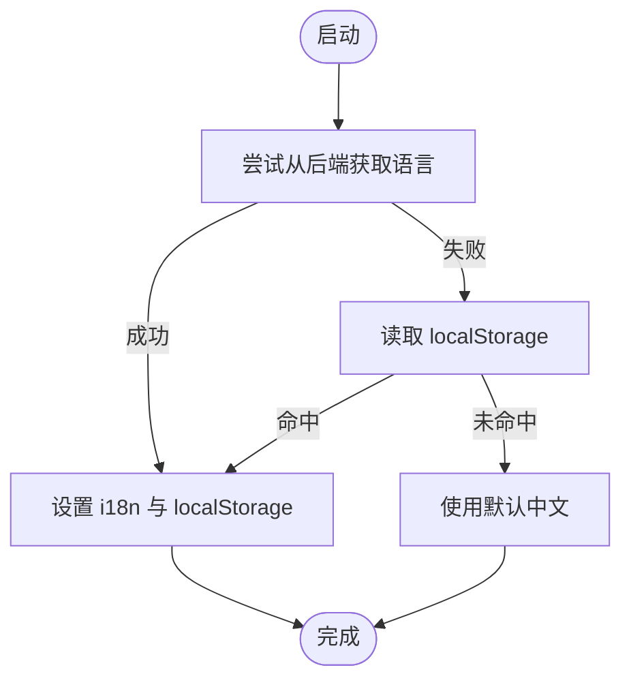
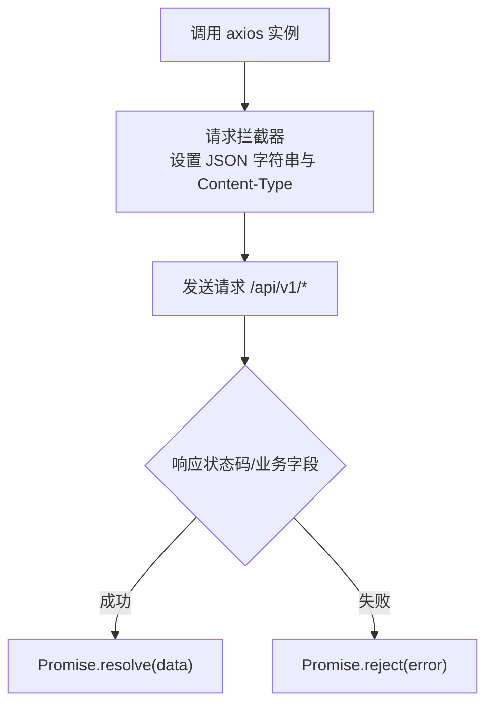
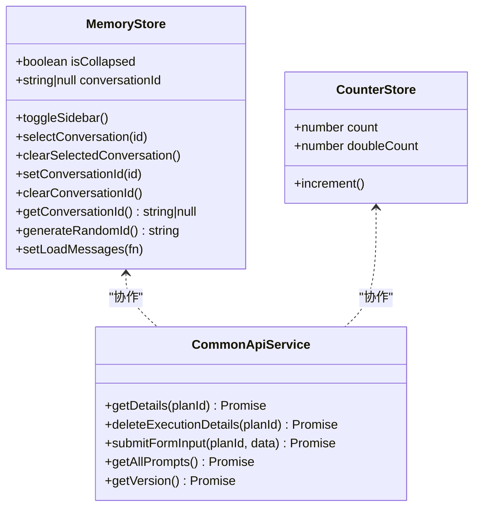
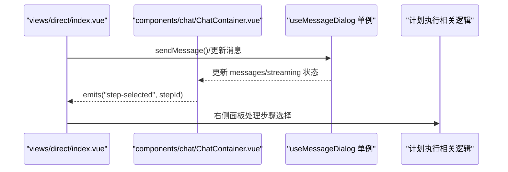
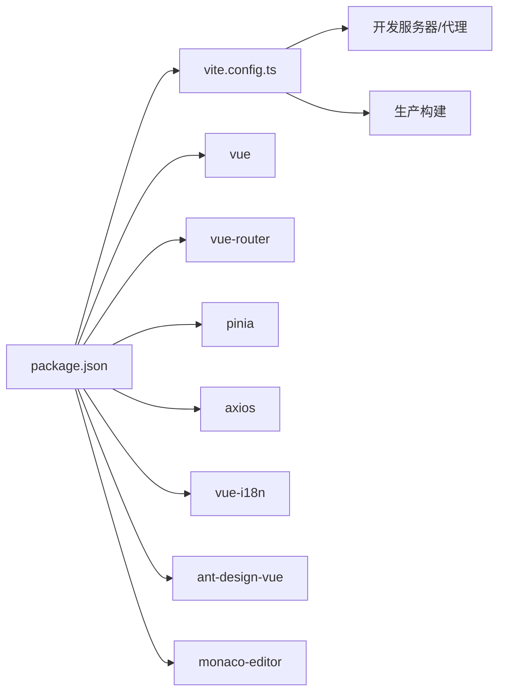

# 前端架构设计

<cite>
**本文引用的文件**
- [package.json](file://ui-vue3/package.json)
- [vite.config.ts](file://ui-vue3/vite.config.ts)
- [main.ts](file://ui-vue3/src/main.ts)
- [App.vue](file://ui-vue3/src/App.vue)
- [router/index.ts](file://ui-vue3/src/router/index.ts)
- [router/defaultRoutes.ts](file://ui-vue3/src/router/defaultRoutes.ts)
- [base/i18n/index.ts](file://ui-vue3/src/base/i18n/index.ts)
- [composables/useRequest.ts](file://ui-vue3/src/composables/useRequest.ts)
- [utils/request.ts](file://ui-vue3/src/utils/request.ts)
- [stores/counter.ts](file://ui-vue3/src/stores/counter.ts)
- [stores/memory.ts](file://ui-vue3/src/stores/memory.ts)
- [api/common-api-service.ts](file://ui-vue3/src/api/common-api-service.ts)
- [components/chat/ChatContainer.vue](file://ui-vue3/src/components/chat/ChatContainer.vue)
- [views/direct/index.vue](file://ui-vue3/src/views/direct/index.vue)
</cite>

## 目录
1. [简介](#简介)
2. [项目结构](#项目结构)
3. [核心组件](#核心组件)
4. [架构总览](#架构总览)
5. [详细组件分析](#详细组件分析)
6. [依赖关系分析](#依赖关系分析)
7. [性能考虑](#性能考虑)
8. [故障排查指南](#故障排查指南)
9. [结论](#结论)
10. [附录](#附录)

## 简介
本文件面向 Lynxe 前端（Vue.js 3 + TypeScript 单页应用）的架构设计，系统性阐述组件化架构、状态管理模式、路由设计与模块化组织；解释前端与后端的交互方式（REST API 调用、WebSocket 实时通信与文件上传下载机制）；总结 Pinia 状态管理、本地存储与缓存策略；并提供性能优化、构建与部署建议。

## 项目结构
前端位于 ui-vue3 目录，采用基于功能域的模块化组织：
- 根入口与框架装配：main.ts、App.vue
- 路由与导航：router/index.ts、router/defaultRoutes.ts
- 国际化：base/i18n/index.ts
- 组件库：components 下按功能拆分（聊天、侧边栏、编辑器等）
- 视图页面：views 下按业务页面组织（direct、configs、init 等）
- 状态管理：stores 下定义 Pinia Store
- 工具与请求：utils/request.ts 封装 axios；composables 提供可复用逻辑
- API 服务层：api 下按领域划分的服务封装（如 common-api-service.ts）

图表来源
- [main.ts:1-57](file://ui-vue3/src/main.ts#L1-L57)
- [App.vue:1-77](file://ui-vue3/src/App.vue#L1-L77)
- [router/index.ts:1-62](file://ui-vue3/src/router/index.ts#L1-L62)
- [router/defaultRoutes.ts:1-109](file://ui-vue3/src/router/defaultRoutes.ts#L1-L109)
- [base/i18n/index.ts:1-161](file://ui-vue3/src/base/i18n/index.ts#L1-L161)
- [utils/request.ts:1-65](file://ui-vue3/src/utils/request.ts#L1-L65)
- [stores/counter.ts:1-29](file://ui-vue3/src/stores/counter.ts#L1-L29)
- [stores/memory.ts:1-128](file://ui-vue3/src/stores/memory.ts#L1-L128)
- [views/direct/index.vue:1-881](file://ui-vue3/src/views/direct/index.vue#L1-L881)
- [components/chat/ChatContainer.vue:1-541](file://ui-vue3/src/components/chat/ChatContainer.vue#L1-L541)
- [api/common-api-service.ts:1-149](file://ui-vue3/src/api/common-api-service.ts#L1-L149)

章节来源
- [main.ts:1-57](file://ui-vue3/src/main.ts#L1-L57)
- [router/defaultRoutes.ts:1-109](file://ui-vue3/src/router/defaultRoutes.ts#L1-L109)

## 核心组件
- 应用入口与插件装配：在 main.ts 中注册 Pinia、Ant Design Vue、Vue Router、国际化、颜色选择器等，并初始化语言与消息对话单例。
- 根组件：App.vue 作为路由出口，承载全局样式与滚动条样式。
- 路由系统：使用 Hash 历史模式，结合全局前置守卫检查系统初始化状态，控制访问流程。
- 国际化：i18n 配置支持中英切换，持久化到 localStorage，并与后端语言设置联动。
- 请求层：统一 axios 实例，设置基础路径、超时、拦截器，规范化响应格式。
- 状态管理：Pinia Store 与自定义类式 Store 并存，用于计数、记忆会话与侧边栏状态等。
- 组件库：以功能域划分，如聊天组件、输入区、侧边栏、右侧面板等，职责清晰。
- API 服务层：对后端接口进行领域化封装，提供版本查询、执行详情、表单提交等方法。

章节来源
- [main.ts:1-57](file://ui-vue3/src/main.ts#L1-L57)
- [App.vue:1-77](file://ui-vue3/src/App.vue#L1-L77)
- [router/index.ts:1-62](file://ui-vue3/src/router/index.ts#L1-L62)
- [base/i18n/index.ts:1-161](file://ui-vue3/src/base/i18n/index.ts#L1-L161)
- [utils/request.ts:1-65](file://ui-vue3/src/utils/request.ts#L1-L65)
- [stores/counter.ts:1-29](file://ui-vue3/src/stores/counter.ts#L1-L29)
- [stores/memory.ts:1-128](file://ui-vue3/src/stores/memory.ts#L1-L128)
- [api/common-api-service.ts:1-149](file://ui-vue3/src/api/common-api-service.ts#L1-L149)

## 架构总览
前端采用“视图-组件-状态-服务”分层：
- 视图层：views 下页面负责编排组件与业务流程
- 组件层：components 下复用性强的 UI 与业务组件
- 状态层：stores 下集中管理应用状态（Pinia Store 与类式 Store）
- 服务层：api 与 utils 封装网络与工具能力
- 路由层：router 控制导航与初始化校验
- 国际化层：base/i18n 提供语言切换与持久化

图表来源
- [views/direct/index.vue:1-881](file://ui-vue3/src/views/direct/index.vue#L1-L881)
- [components/chat/ChatContainer.vue:1-541](file://ui-vue3/src/components/chat/ChatContainer.vue#L1-L541)
- [stores/memory.ts:1-128](file://ui-vue3/src/stores/memory.ts#L1-L128)
- [api/common-api-service.ts:1-149](file://ui-vue3/src/api/common-api-service.ts#L1-L149)
- [utils/request.ts:1-65](file://ui-vue3/src/utils/request.ts#L1-L65)
- [router/index.ts:1-62](file://ui-vue3/src/router/index.ts#L1-L62)
- [router/defaultRoutes.ts:1-109](file://ui-vue3/src/router/defaultRoutes.ts#L1-L109)
- [base/i18n/index.ts:1-161](file://ui-vue3/src/base/i18n/index.ts#L1-L161)

## 详细组件分析

### 路由与导航
- 历史模式：使用 Hash 模式，路径前缀为 /ui，适配后端静态资源映射。
- 全局守卫：进入任意路由前检查 /api/init/status，未初始化则重定向至 /init；已初始化则写入 localStorage。
- 路由表：defaultRoutes.ts 定义首页重定向、初始化页、直接对话页、配置页与兜底页。

图表来源
- [router/index.ts:26-59](file://ui-vue3/src/router/index.ts#L26-L59)

章节来源
- [router/index.ts:1-62](file://ui-vue3/src/router/index.ts#L1-L62)
- [router/defaultRoutes.ts:1-109](file://ui-vue3/src/router/defaultRoutes.ts#L1-L109)

### 国际化与本地存储
- 初始化优先从后端拉取语言，失败回退到 localStorage，最终默认中文。
- 切换语言时同时更新后端与本地存储，并在初始化流程中重置提示词与代理初始化。
- 使用 i18n 全局实例与配置对象，便于组件内直接使用。

图表来源
- [base/i18n/index.ts:128-160](file://ui-vue3/src/base/i18n/index.ts#L128-L160)

章节来源
- [base/i18n/index.ts:1-161](file://ui-vue3/src/base/i18n/index.ts#L1-L161)

### 请求与拦截器
- axios 实例：baseURL 指向 /api/v1，统一设置 Content-Type 为 application/json。
- 响应拦截：根据后端约定（code 或 status）判断成功/失败，统一抛错或透传数据。
- 与路由守卫配合：通过 /api/init/status 与 /api/version 等接口实现初始化与版本信息获取。

图表来源
- [utils/request.ts:26-64](file://ui-vue3/src/utils/request.ts#L26-L64)

章节来源
- [utils/request.ts:1-65](file://ui-vue3/src/utils/request.ts#L1-L65)

### 状态管理策略
- Pinia Store：示例 useCounterStore 展示基本计数与计算属性。
- 类式 Store：MemoryStore 封装会话 ID 的持久化、侧边栏轮询加载、事件触发等。
- 组合式 API：composables/useRequest.ts 提供加载态与错误处理模板。

图表来源
- [stores/memory.ts:22-127](file://ui-vue3/src/stores/memory.ts#L22-L127)
- [stores/counter.ts:20-28](file://ui-vue3/src/stores/counter.ts#L20-L28)
- [api/common-api-service.ts:21-148](file://ui-vue3/src/api/common-api-service.ts#L21-L148)

章节来源
- [stores/memory.ts:1-128](file://ui-vue3/src/stores/memory.ts#L1-L128)
- [stores/counter.ts:1-29](file://ui-vue3/src/stores/counter.ts#L1-L29)
- [composables/useRequest.ts:1-40](file://ui-vue3/src/composables/useRequest.ts#L1-L40)

### 聊天组件与消息流
- ChatContainer.vue：负责消息渲染、滚动行为、复制、重新生成/重试占位、附件显示与时间戳格式化。
- 与组合式逻辑解耦：消息列表与流式状态由 useMessageDialog 单例维护，ChatContainer 专注展示。
- 与计划执行联动：通过 emits 向父级传递步骤选择事件，交由右侧面板处理。

图表来源
- [views/direct/index.vue:104-130](file://ui-vue3/src/views/direct/index.vue#L104-L130)
- [components/chat/ChatContainer.vue:125-295](file://ui-vue3/src/components/chat/ChatContainer.vue#L125-L295)

章节来源
- [components/chat/ChatContainer.vue:1-541](file://ui-vue3/src/components/chat/ChatContainer.vue#L1-L541)
- [views/direct/index.vue:1-881](file://ui-vue3/src/views/direct/index.vue#L1-L881)

### API 服务层设计
- 领域化封装：common-api-service.ts 提供执行详情、删除、表单提交、提示词列表、版本信息等方法。
- 错误处理：对 404、非 2xx 等场景进行容错处理，避免中断轮询与交互。
- 与后端协议对接：遵循后端返回结构，必要时补充缺失字段（如 currentPlanId）。

章节来源
- [api/common-api-service.ts:1-149](file://ui-vue3/src/api/common-api-service.ts#L1-L149)

## 依赖关系分析
- 构建与开发：Vite 配置启用 Vue/JSX 插件、类型检查插件、代码检查与本地代理，base 设置为 /ui，便于后端统一静态资源路径。
- 运行时依赖：Vue 3、Vue Router、Pinia、Ant Design Vue、axios、vue-i18n、Monaco Editor、NProgress 等。
- 开发依赖：ESLint、Prettier、TypeScript、Vitest、Cypress 等。

图表来源
- [package.json:1-100](file://ui-vue3/package.json#L1-L100)
- [vite.config.ts:16-70](file://ui-vue3/vite.config.ts#L16-L70)

章节来源
- [package.json:1-100](file://ui-vue3/package.json#L1-L100)
- [vite.config.ts:1-71](file://ui-vue3/vite.config.ts#L1-L71)

## 性能考虑
- 资源体积与懒加载：路由与视图组件均采用动态导入，减少首屏包体。
- 滚动与渲染优化：聊天消息容器使用虚拟滚动与增量更新策略，避免全量重绘。
- 状态订阅最小化：通过 Pinia 与组合式状态，仅在需要时订阅与更新，降低响应开销。
- 缓存与持久化：localStorage 用于会话 ID、面板宽度等，减少重复请求与状态丢失。
- 构建优化：开启 Source Map 便于调试；生产构建启用 Source Map 以便问题定位与回溯。

## 故障排查指南
- 初始化失败：检查 /api/init/status 接口是否可达，确认后端初始化状态；若失败，路由守卫会回退到 localStorage 判断。
- 语言切换异常：确认后端语言设置接口可用；若失败，前端仍可回退到 localStorage。
- 请求失败：查看 axios 拦截器日志，关注响应状态与业务字段；确保 baseURL 与代理配置正确。
- 聊天消息不刷新：确认 useMessageDialog 单例的消息更新逻辑是否被调用；检查 ChatContainer 的 watch 与滚动行为。
- 版本信息为空：common-api-service.ts 对版本接口做了容错处理，返回默认值以保证 UI 正常。

章节来源
- [router/index.ts:34-59](file://ui-vue3/src/router/index.ts#L34-L59)
- [base/i18n/index.ts:56-122](file://ui-vue3/src/base/i18n/index.ts#L56-L122)
- [utils/request.ts:46-63](file://ui-vue3/src/utils/request.ts#L46-L63)
- [api/common-api-service.ts:127-147](file://ui-vue3/src/api/common-api-service.ts#L127-L147)

## 结论
Lynxe 前端采用清晰的分层架构与模块化组织，结合 Pinia 状态管理、路由守卫与国际化策略，形成稳定可扩展的 SPA 架构。通过领域化的 API 服务封装与统一的请求拦截器，前端与后端交互清晰可靠。建议在后续迭代中进一步完善 WebSocket 实时通信与文件上传下载的具体实现细节，并持续优化性能与用户体验。

## 附录
- 构建与预览：使用 Vite 开发服务器与预览命令；生产构建输出到 ui 目录，base 设为 /ui。
- 测试：单元测试与端到端测试分别通过 Vitest 与 Cypress 驱动。
- 代码质量：ESLint、Prettier、TypeScript 类型检查共同保障代码一致性与可维护性。

章节来源
- [vite.config.ts:24-28](file://ui-vue3/vite.config.ts#L24-L28)
- [package.json:6-26](file://ui-vue3/package.json#L6-L26)