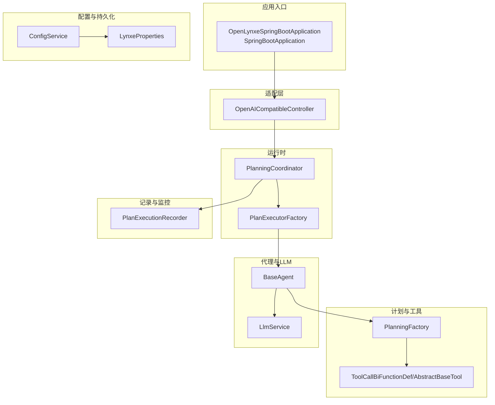
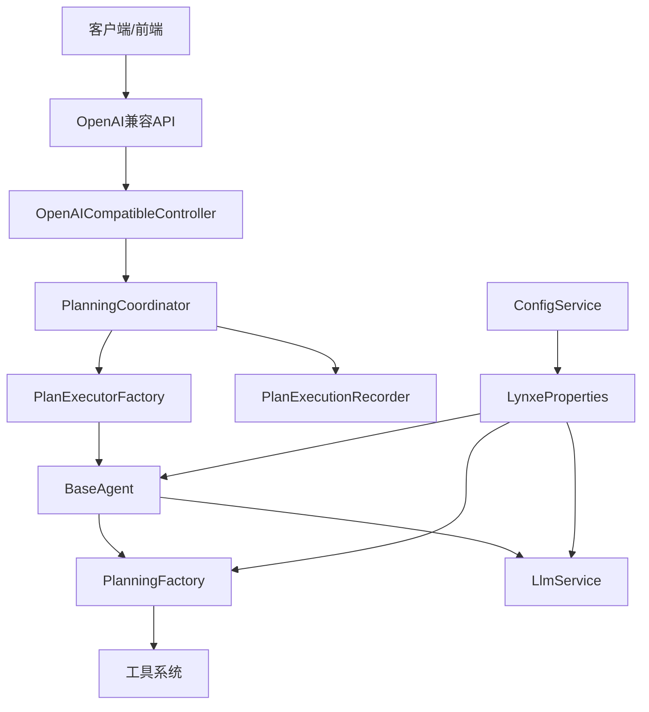
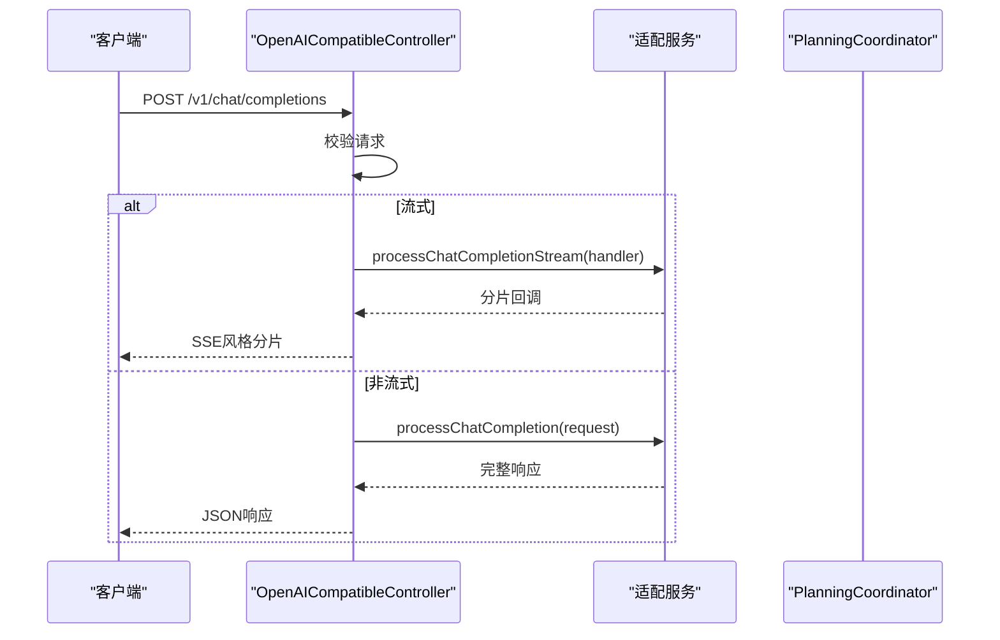
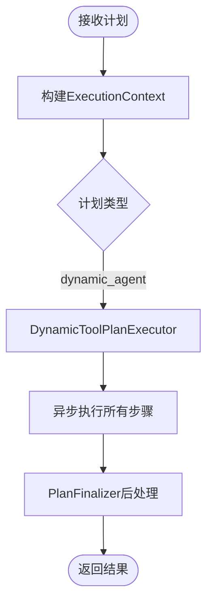
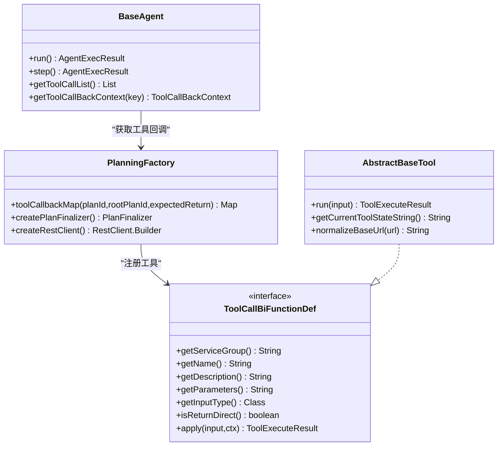
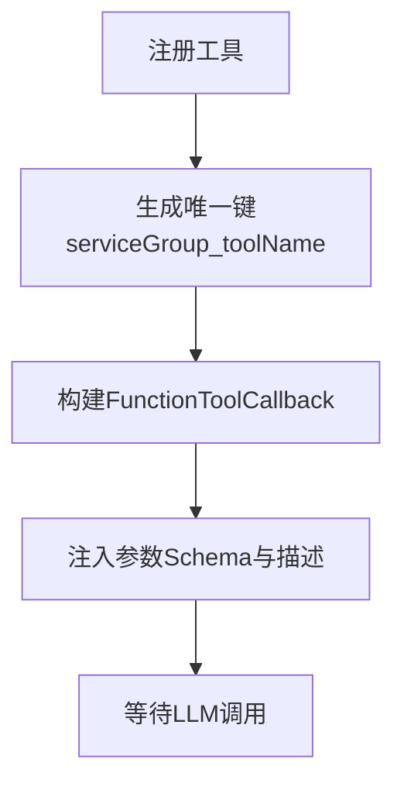
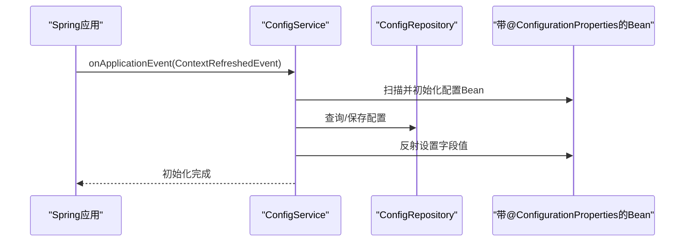
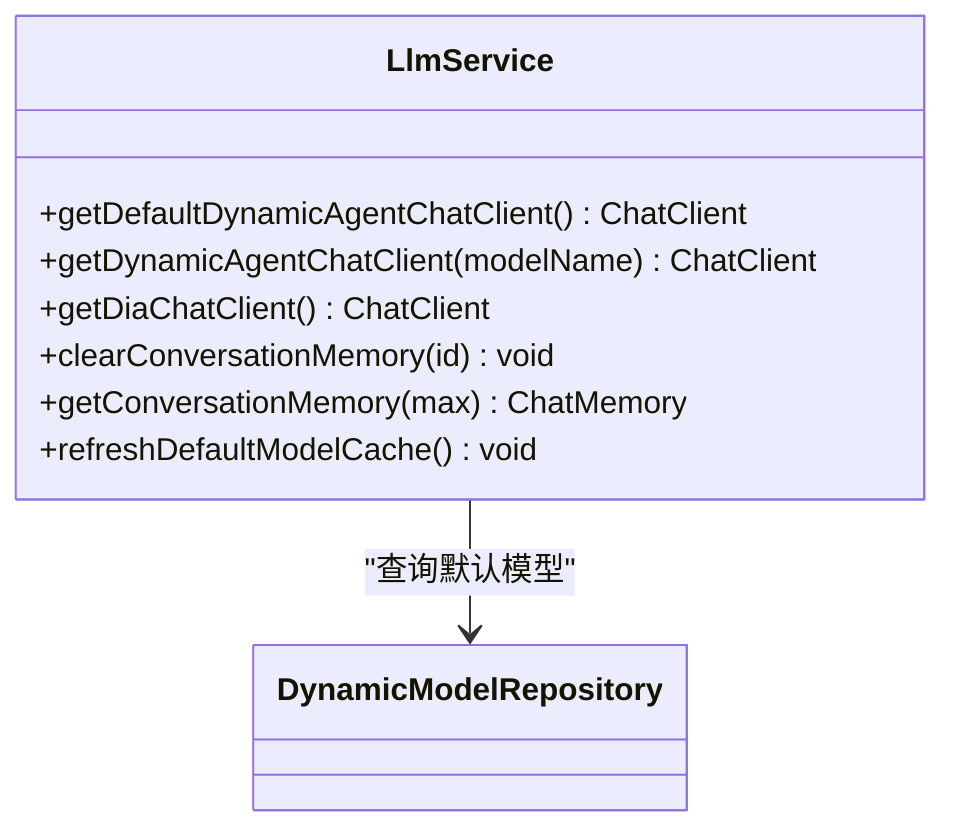
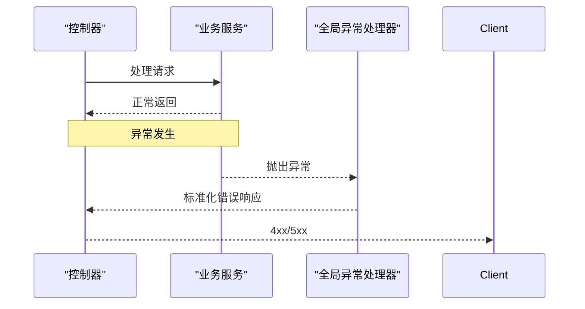
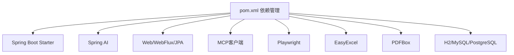

# 后端架构设计

<cite>
**本文档引用的文件**
- [OpenLynxeSpringBootApplication.java](file://src/main/java/com/alibaba/cloud/ai/lynxe/OpenLynxeSpringBootApplication.java)
- [pom.xml](file://pom.xml)
- [application.yml](file://src/main/resources/application.yml)
- [BaseAgent.java](file://src/main/java/com/alibaba/cloud/ai/lynxe/agent/BaseAgent.java)
- [PlanningFactory.java](file://src/main/java/com/alibaba/cloud/ai/lynxe/planning/PlanningFactory.java)
- [ConfigService.java](file://src/main/java/com/alibaba/cloud/ai/lynxe/config/ConfigService.java)
- [LynxeProperties.java](file://src/main/java/com/alibaba/cloud/ai/lynxe/config/LynxeProperties.java)
- [PlanningCoordinator.java](file://src/main/java/com/alibaba/cloud/ai/lynxe/runtime/service/PlanningCoordinator.java)
- [PlanExecutorFactory.java](file://src/main/java/com/alibaba/cloud/ai/lynxe/runtime/executor/factory/PlanExecutorFactory.java)
- [ToolCallBiFunctionDef.java](file://src/main/java/com/alibaba/cloud/ai/lynxe/tool/ToolCallBiFunctionDef.java)
- [AbstractBaseTool.java](file://src/main/java/com/alibaba/cloud/ai/lynxe/tool/AbstractBaseTool.java)
- [LlmService.java](file://src/main/java/com/alibaba/cloud/ai/lynxe/llm/LlmService.java)
- [PlanExecutionRecorder.java](file://src/main/java/com/alibaba/cloud/ai/lynxe/recorder/service/PlanExecutionRecorder.java)
- [OpenAICompatibleController.java](file://src/main/java/com/alibaba/cloud/ai/lynxe/adapter/controller/OpenAICompatibleController.java)
- [GlobalExceptionHandler.java](file://src/main/java/com/alibaba/cloud/ai/lynxe/exception/handler/GlobalExceptionHandler.java)
</cite>

## 目录
1. [引言](#引言)
2. [项目结构](#项目结构)
3. [核心组件](#核心组件)
4. [架构总览](#架构总览)
5. [详细组件分析](#详细组件分析)
6. [依赖关系分析](#依赖关系分析)
7. [性能考虑](#性能考虑)
8. [故障排查指南](#故障排查指南)
9. [结论](#结论)

## 引言
本架构文档面向Lynxe后端，基于Spring Boot与Spring AI构建的微服务化AI智能体管理系统。系统采用分层架构与依赖注入机制，围绕“计划-工具-代理-执行”的闭环设计，提供可扩展的代理执行引擎、工具系统、计划管理与配置管理能力，并支持OpenAI兼容接口适配、全局异常处理与监控观测。

## 项目结构
后端采用标准的Spring Boot多模块结构，按功能域划分包层次：
- adapter：对外适配层，提供OpenAI兼容API控制器
- agent：代理抽象与实现，统一代理生命周期与状态机
- config：配置中心与属性绑定，支持数据库持久化与热更新
- cron：定时任务与动态调度
- llm：大模型服务封装与对话记忆
- mcp：Model Context Protocol客户端集成
- model：动态模型实体与仓库
- planning：计划模板与工厂，负责工具回调注册与计划终结
- recorder：执行记录与追踪
- runtime：运行时协调器与执行器工厂
- tool：工具系统，覆盖文件、数据库、浏览器、图像生成、并行执行等
- workspace：工作区与会话记忆
- exception：全局异常处理
- 其他：事件总线、启动监听器、跨域配置等

**图表来源**
- [OpenLynxeSpringBootApplication.java:29-45](file://src/main/java/com/alibaba/cloud/ai/lynxe/OpenLynxeSpringBootApplication.java#L29-L45)
- [OpenAICompatibleController.java:50-80](file://src/main/java/com/alibaba/cloud/ai/lynxe/adapter/controller/OpenAICompatibleController.java#L50-L80)
- [PlanningCoordinator.java:40-58](file://src/main/java/com/alibaba/cloud/ai/lynxe/runtime/service/PlanningCoordinator.java#L40-L58)
- [PlanExecutorFactory.java:50-121](file://src/main/java/com/alibaba/cloud/ai/lynxe/runtime/executor/factory/PlanExecutorFactory.java#L50-L121)
- [PlanningFactory.java:112-229](file://src/main/java/com/alibaba/cloud/ai/lynxe/planning/PlanningFactory.java#L112-L229)
- [ToolCallBiFunctionDef.java:29-106](file://src/main/java/com/alibaba/cloud/ai/lynxe/tool/ToolCallBiFunctionDef.java#L29-L106)
- [BaseAgent.java:70-135](file://src/main/java/com/alibaba/cloud/ai/lynxe/agent/BaseAgent.java#L70-L135)
- [LlmService.java:56-104](file://src/main/java/com/alibaba/cloud/ai/lynxe/llm/LlmService.java#L56-L104)
- [ConfigService.java:42-74](file://src/main/java/com/alibaba/cloud/ai/lynxe/config/ConfigService.java#L42-L74)
- [LynxeProperties.java:27-654](file://src/main/java/com/alibaba/cloud/ai/lynxe/config/LynxeProperties.java#L27-L654)
- [PlanExecutionRecorder.java:26-107](file://src/main/java/com/alibaba/cloud/ai/lynxe/recorder/service/PlanExecutionRecorder.java#L26-L107)

**章节来源**
- [OpenLynxeSpringBootApplication.java:29-45](file://src/main/java/com/alibaba/cloud/ai/lynxe/OpenLynxeSpringBootApplication.java#L29-L45)
- [pom.xml:1-556](file://pom.xml#L1-L556)
- [application.yml:1-97](file://src/main/resources/application.yml#L1-L97)

## 核心组件
- 应用引导与扫描
  - 使用Spring Boot注解开启组件扫描、JPA扫描与调度；提供Playwright初始化入口。
- 控制器层（适配层）
  - 提供OpenAI兼容的聊天补全与模型列表接口，支持流式与非流式响应。
- 服务层（运行时协调）
  - PlanningCoordinator负责根据请求源与上下文创建执行上下文，并委派给PlanExecutorFactory选择合适的执行器。
- 执行器工厂
  - PlanExecutorFactory依据计划类型动态选择执行器，当前支持dynamic_agent类型。
- 代理与计划工厂
  - BaseAgent定义代理生命周期与状态机；PlanningFactory负责工具回调注册、RestClient构建与MCP工具桥接。
- 工具系统
  - ToolCallBiFunctionDef定义工具统一接口；AbstractBaseTool提供通用实现与状态上报能力。
- 配置管理
  - ConfigService通过数据库持久化配置并支持热更新；LynxeProperties以@ConfigurationProperties形式暴露配置项。
- LLM服务
  - LlmService封装ChatClient缓存、模型切换、对话记忆与DNS缓存增强。
- 记录与追踪
  - PlanExecutionRecorder定义统一的执行记录接口，支撑计划、步骤、思考-行动过程的持久化。

**章节来源**
- [OpenAICompatibleController.java:50-116](file://src/main/java/com/alibaba/cloud/ai/lynxe/adapter/controller/OpenAICompatibleController.java#L50-L116)
- [PlanningCoordinator.java:40-182](file://src/main/java/com/alibaba/cloud/ai/lynxe/runtime/service/PlanningCoordinator.java#L40-L182)
- [PlanExecutorFactory.java:50-186](file://src/main/java/com/alibaba/cloud/ai/lynxe/runtime/executor/factory/PlanExecutorFactory.java#L50-L186)
- [BaseAgent.java:70-589](file://src/main/java/com/alibaba/cloud/ai/lynxe/agent/BaseAgent.java#L70-L589)
- [PlanningFactory.java:112-427](file://src/main/java/com/alibaba/cloud/ai/lynxe/planning/PlanningFactory.java#L112-L427)
- [ToolCallBiFunctionDef.java:29-106](file://src/main/java/com/alibaba/cloud/ai/lynxe/tool/ToolCallBiFunctionDef.java#L29-L106)
- [AbstractBaseTool.java:30-193](file://src/main/java/com/alibaba/cloud/ai/lynxe/tool/AbstractBaseTool.java#L30-L193)
- [ConfigService.java:42-320](file://src/main/java/com/alibaba/cloud/ai/lynxe/config/ConfigService.java#L42-L320)
- [LynxeProperties.java:27-654](file://src/main/java/com/alibaba/cloud/ai/lynxe/config/LynxeProperties.java#L27-L654)
- [LlmService.java:56-482](file://src/main/java/com/alibaba/cloud/ai/lynxe/llm/LlmService.java#L56-L482)
- [PlanExecutionRecorder.java:26-242](file://src/main/java/com/alibaba/cloud/ai/lynxe/recorder/service/PlanExecutionRecorder.java#L26-L242)

## 架构总览
系统采用“控制器-协调器-执行器-代理-工具-LLM”的分层架构，配合配置中心与记录器形成闭环。适配层负责外部协议兼容，运行时协调器负责上下文与执行器选择，代理与计划工厂负责工具注册与计划终结，工具系统提供丰富的可插拔能力，LLM服务提供模型与对话记忆能力，记录器贯穿执行全过程。

**图表来源**
- [OpenAICompatibleController.java:50-357](file://src/main/java/com/alibaba/cloud/ai/lynxe/adapter/controller/OpenAICompatibleController.java#L50-L357)
- [PlanningCoordinator.java:40-182](file://src/main/java/com/alibaba/cloud/ai/lynxe/runtime/service/PlanningCoordinator.java#L40-L182)
- [PlanExecutorFactory.java:50-186](file://src/main/java/com/alibaba/cloud/ai/lynxe/runtime/executor/factory/PlanExecutorFactory.java#L50-L186)
- [BaseAgent.java:70-589](file://src/main/java/com/alibaba/cloud/ai/lynxe/agent/BaseAgent.java#L70-L589)
- [PlanningFactory.java:112-427](file://src/main/java/com/alibaba/cloud/ai/lynxe/planning/PlanningFactory.java#L112-L427)
- [LlmService.java:56-482](file://src/main/java/com/alibaba/cloud/ai/lynxe/llm/LlmService.java#L56-L482)
- [ConfigService.java:42-320](file://src/main/java/com/alibaba/cloud/ai/lynxe/config/ConfigService.java#L42-L320)
- [LynxeProperties.java:27-654](file://src/main/java/com/alibaba/cloud/ai/lynxe/config/LynxeProperties.java#L27-L654)
- [PlanExecutionRecorder.java:26-242](file://src/main/java/com/alibaba/cloud/ai/lynxe/recorder/service/PlanExecutionRecorder.java#L26-L242)

## 详细组件分析

### 适配层：OpenAI兼容控制器
- 职责
  - 对外提供/v1/chat/completions与/v1/models健康检查接口，支持流式与非流式响应。
  - 将请求参数转换为内部执行流程，调用适配服务处理。
- 关键点
  - 流式响应遵循OpenAI chunk格式，包含完成标记[data: [DONE]]。
  - 非法请求返回400，异常返回500，便于前端与外部工具集成。

**图表来源**
- [OpenAICompatibleController.java:85-185](file://src/main/java/com/alibaba/cloud/ai/lynxe/adapter/controller/OpenAICompatibleController.java#L85-L185)
- [PlanningCoordinator.java:76-179](file://src/main/java/com/alibaba/cloud/ai/lynxe/runtime/service/PlanningCoordinator.java#L76-L179)

**章节来源**
- [OpenAICompatibleController.java:50-357](file://src/main/java/com/alibaba/cloud/ai/lynxe/adapter/controller/OpenAICompatibleController.java#L50-L357)

### 运行时协调器与执行器工厂
- PlanningCoordinator
  - 负责构建ExecutionContext（标题、计划ID、深度、是否需要摘要、会话ID等），并委派执行器执行。
  - 支持不同请求源（HTTP/VUE侧边栏/VUE对话框）对会话ID与摘要生成的差异化处理。
- PlanExecutorFactory
  - 基于计划类型选择执行器，默认支持dynamic_agent；未来可扩展simple/direct等类型。

**图表来源**
- [PlanningCoordinator.java:76-179](file://src/main/java/com/alibaba/cloud/ai/lynxe/runtime/service/PlanningCoordinator.java#L76-L179)
- [PlanExecutorFactory.java:164-183](file://src/main/java/com/alibaba/cloud/ai/lynxe/runtime/executor/factory/PlanExecutorFactory.java#L164-L183)

**章节来源**
- [PlanningCoordinator.java:40-182](file://src/main/java/com/alibaba/cloud/ai/lynxe/runtime/service/PlanningCoordinator.java#L40-L182)
- [PlanExecutorFactory.java:50-186](file://src/main/java/com/alibaba/cloud/ai/lynxe/runtime/executor/factory/PlanExecutorFactory.java#L50-L186)

### 代理执行引擎与计划工厂
- BaseAgent
  - 统一代理生命周期：初始化、多轮执行、中断/失败/完成处理、最终总结与终止。
  - 支持调试模式、并行工具调用策略、环境变量注入与错误上报工具。
- PlanningFactory
  - 注册内置工具（浏览器、数据库、文件系统、并行执行、Markdown转换、图像生成等）与MCP工具回调。
  - 构建FunctionToolCallback并以“服务组_工具名”作为唯一键，便于LLM识别与调用。
  - 提供RestClient.Builder以统一HTTP超时配置。

**图表来源**
- [BaseAgent.java:70-589](file://src/main/java/com/alibaba/cloud/ai/lynxe/agent/BaseAgent.java#L70-L589)
- [PlanningFactory.java:261-393](file://src/main/java/com/alibaba/cloud/ai/lynxe/planning/PlanningFactory.java#L261-L393)
- [ToolCallBiFunctionDef.java:29-106](file://src/main/java/com/alibaba/cloud/ai/lynxe/tool/ToolCallBiFunctionDef.java#L29-L106)
- [AbstractBaseTool.java:30-193](file://src/main/java/com/alibaba/cloud/ai/lynxe/tool/AbstractBaseTool.java#L30-L193)

**章节来源**
- [BaseAgent.java:70-589](file://src/main/java/com/alibaba/cloud/ai/lynxe/agent/BaseAgent.java#L70-L589)
- [PlanningFactory.java:112-427](file://src/main/java/com/alibaba/cloud/ai/lynxe/planning/PlanningFactory.java#L112-L427)
- [ToolCallBiFunctionDef.java:29-106](file://src/main/java/com/alibaba/cloud/ai/lynxe/tool/ToolCallBiFunctionDef.java#L29-L106)
- [AbstractBaseTool.java:30-193](file://src/main/java/com/alibaba/cloud/ai/lynxe/tool/AbstractBaseTool.java#L30-L193)

### 工具系统与插件化设计
- 工具接口
  - ToolCallBiFunctionDef定义工具输入、输出、参数Schema与可选直接返回策略。
- 工具基类
  - AbstractBaseTool提供计划ID/根计划ID注入、状态字符串获取与URL规范化等通用能力。
- 插件化机制
  - PlanningFactory集中注册工具，支持服务组命名空间隔离与MCP动态回调注入。
  - 工具可声明为可选择（UI展示）或不可选择（内部使用）。

**图表来源**
- [PlanningFactory.java:341-377](file://src/main/java/com/alibaba/cloud/ai/lynxe/planning/PlanningFactory.java#L341-L377)
- [ToolCallBiFunctionDef.java:35-106](file://src/main/java/com/alibaba/cloud/ai/lynxe/tool/ToolCallBiFunctionDef.java#L35-L106)
- [AbstractBaseTool.java:56-144](file://src/main/java/com/alibaba/cloud/ai/lynxe/tool/AbstractBaseTool.java#L56-L144)

**章节来源**
- [ToolCallBiFunctionDef.java:29-106](file://src/main/java/com/alibaba/cloud/ai/lynxe/tool/ToolCallBiFunctionDef.java#L29-L106)
- [AbstractBaseTool.java:30-193](file://src/main/java/com/alibaba/cloud/ai/lynxe/tool/AbstractBaseTool.java#L30-L193)
- [PlanningFactory.java:261-393](file://src/main/java/com/alibaba/cloud/ai/lynxe/planning/PlanningFactory.java#L261-L393)

### 配置管理与启动初始化
- ConfigService
  - 在应用上下文刷新时扫描@ConfigurationProperties注解的Bean，初始化缺失配置并持久化到数据库。
  - 提供缓存、批量更新与重置默认值能力，确保配置变更可传播至各Bean字段。
- LynxeProperties
  - 以@ConfigurationProperties(prefix="lynxe")形式暴露大量运行时配置项，如代理步数、并发内存、浏览器行为、MCP连接参数等。
- 启动监听
  - 通过ContextRefreshedEvent触发初始化，清理过期配置并建立配置-属性映射。

**图表来源**
- [ConfigService.java:60-163](file://src/main/java/com/alibaba/cloud/ai/lynxe/config/ConfigService.java#L60-L163)
- [LynxeProperties.java:27-654](file://src/main/java/com/alibaba/cloud/ai/lynxe/config/LynxeProperties.java#L27-L654)

**章节来源**
- [ConfigService.java:42-320](file://src/main/java/com/alibaba/cloud/ai/lynxe/config/ConfigService.java#L42-L320)
- [LynxeProperties.java:27-654](file://src/main/java/com/alibaba/cloud/ai/lynxe/config/LynxeProperties.java#L27-L654)

### LLM服务与对话记忆
- ChatClient缓存
  - LlmService按模型名缓存ChatClient实例，支持默认模型懒初始化与模型切换时的缓存清理。
- 对话记忆
  - 提供MessageWindowChatMemory包装，支持按会话ID清理与容量限制。
- DNS缓存与超时
  - 增强WebClient Builder，优先使用DNS缓存实例，否则设置默认超时与缓冲区大小。
- 观测与追踪
  - 通过LlmTraceRecorder记录请求，结合Micrometer观测约定。

**图表来源**
- [LlmService.java:161-320](file://src/main/java/com/alibaba/cloud/ai/lynxe/llm/LlmService.java#L161-L320)
- [LlmService.java:441-479](file://src/main/java/com/alibaba/cloud/ai/lynxe/llm/LlmService.java#L441-L479)

**章节来源**
- [LlmService.java:56-482](file://src/main/java/com/alibaba/cloud/ai/lynxe/llm/LlmService.java#L56-L482)

### 记录与追踪
- PlanExecutionRecorder
  - 定义统一的记录接口：计划开始/结束、步骤开始/结束、完整代理执行、思考-行动过程与动作结果。
  - 参数类封装ThinkAct与ActTool信息，便于后续查询与可视化。

**章节来源**
- [PlanExecutionRecorder.java:26-242](file://src/main/java/com/alibaba/cloud/ai/lynxe/recorder/service/PlanExecutionRecorder.java#L26-L242)

### 安全架构、异常处理与监控
- 安全与跨域
  - 控制器层使用@CrossOrigin允许跨域访问，适配外部前端与工具链。
- 全局异常处理
  - GlobalExceptionHandler统一捕获PlanException、计划模板配置异常与通用异常，返回标准化错误响应。
- 监控与观测
  - LlmService集成ObservationRegistry与自定义观测约定，记录请求与流式响应轨迹。
  - 配置日志级别与文件路径，便于问题定位与审计。

**图表来源**
- [GlobalExceptionHandler.java:32-68](file://src/main/java/com/alibaba/cloud/ai/lynxe/exception/handler/GlobalExceptionHandler.java#L32-L68)

**章节来源**
- [OpenAICompatibleController.java:50-357](file://src/main/java/com/alibaba/cloud/ai/lynxe/adapter/controller/OpenAICompatibleController.java#L50-L357)
- [GlobalExceptionHandler.java:16-68](file://src/main/java/com/alibaba/cloud/ai/lynxe/exception/handler/GlobalExceptionHandler.java#L16-L68)
- [application.yml:46-58](file://src/main/resources/application.yml#L46-L58)

## 依赖关系分析
- 依赖管理
  - 使用Spring Boot 3.5.6与Spring AI 1.1.2，引入Web、WebFlux、JPA、MCP客户端、Playwright、EasyExcel、PDFBox等生态依赖。
- 运行时依赖
  - H2/MySQL/PostgreSQL数据库驱动，Hikari连接池配置，文件上传与Multipart配置。
- 启动与扫描
  - 组件扫描、JPA扫描、调度启用，Playwright初始化入口。

**图表来源**
- [pom.xml:60-353](file://pom.xml#L60-L353)

**章节来源**
- [pom.xml:1-556](file://pom.xml#L1-L556)
- [application.yml:1-97](file://src/main/resources/application.yml#L1-L97)

## 性能考虑
- 连接池与超时
  - Hikari连接池参数优化，JPA关闭OpenInView避免性能问题。
- LLM调用
  - ChatClient按模型名缓存，减少重复初始化开销；增强WebClient设置默认超时与缓冲区上限。
- 工具执行
  - 并行执行工具与线程池配置，支持多工具并发调用；工具状态字符串获取具备容错处理。
- 文件上传
  - 限制单次上传文件数量与总大小，避免资源耗尽。

[本节为通用指导，无需特定文件引用]

## 故障排查指南
- OpenAI兼容接口
  - 检查请求消息合法性与必填字段；确认流式响应的超时与完成标记。
- 代理执行
  - 查看代理最大步数、调试模式与并行工具调用开关；关注SystemErrorReportTool的错误回传。
- 配置变更
  - 通过ConfigService批量更新或重置默认值；确认缓存失效与Bean字段反射赋值成功。
- LLM模型
  - 刷新默认模型缓存，清理特定模型或全部缓存；检查DNS缓存WebClient可用性。
- 记录与追踪
  - 通过PlanExecutionRecorder接口查询执行详情，定位思考-行动过程与动作结果。

**章节来源**
- [OpenAICompatibleController.java:302-354](file://src/main/java/com/alibaba/cloud/ai/lynxe/adapter/controller/OpenAICompatibleController.java#L302-L354)
- [BaseAgent.java:336-449](file://src/main/java/com/alibaba/cloud/ai/lynxe/agent/BaseAgent.java#L336-L449)
- [ConfigService.java:182-317](file://src/main/java/com/alibaba/cloud/ai/lynxe/config/ConfigService.java#L182-L317)
- [LlmService.java:286-320](file://src/main/java/com/alibaba/cloud/ai/lynxe/llm/LlmService.java#L286-L320)
- [PlanExecutionRecorder.java:26-242](file://src/main/java/com/alibaba/cloud/ai/lynxe/recorder/service/PlanExecutionRecorder.java#L26-L242)

## 结论
Lynxe后端以Spring Boot为基础，构建了清晰的分层架构与可扩展的工具系统。通过适配层、运行时协调器、代理执行引擎与计划工厂的协同，实现了从OpenAI兼容接口到计划执行的完整闭环。配置中心与LLM服务提供了灵活的运行时控制与可观测能力，记录器保障了执行过程的可追溯性。整体设计兼顾易用性与扩展性，适合在多场景下进行二次开发与定制。