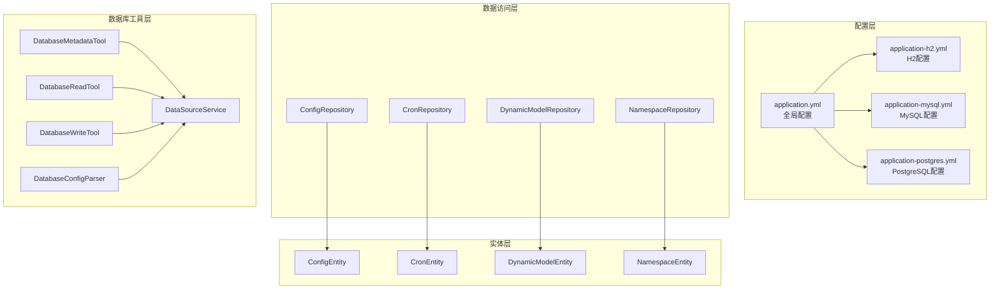
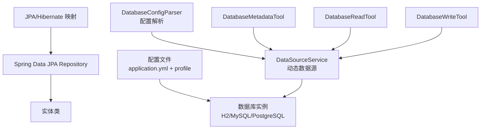
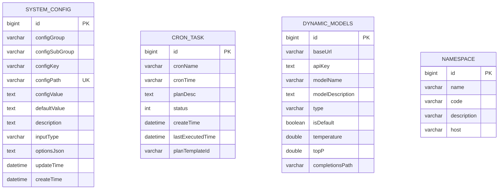
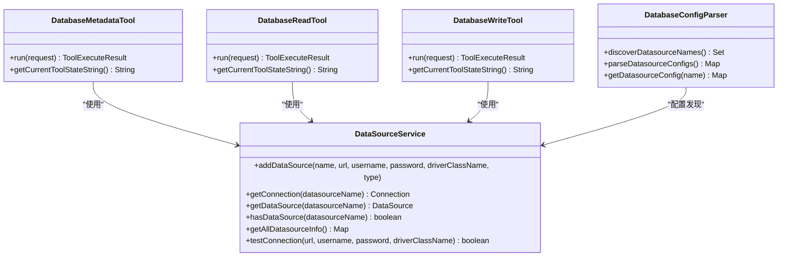
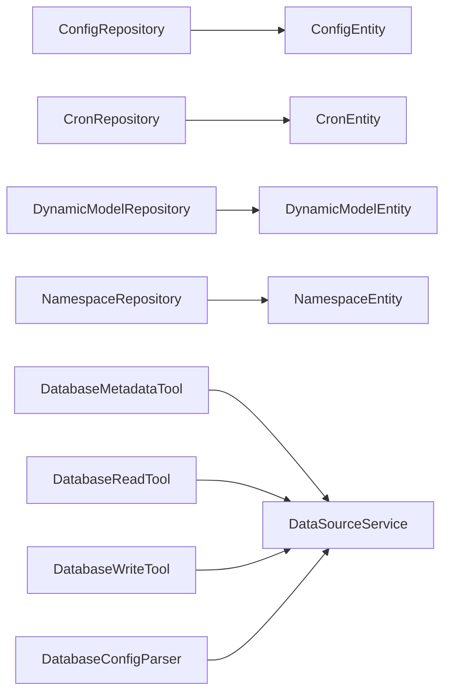

# 数据架构设计

<cite>
**本文引用的文件**
- [application.yml](file://src/main/resources/application.yml)
- [application-h2.yml](file://src/main/resources/application-h2.yml)
- [application-mysql.yml](file://src/main/resources/application-mysql.yml)
- [application-postgres.yml](file://src/main/resources/application-postgres.yml)
- [ConfigRepository.java](file://src/main/java/com/alibaba/cloud/ai/lynxe/config/repository/ConfigRepository.java)
- [CronRepository.java](file://src/main/java/com/alibaba/cloud/ai/lynxe/cron/repository/CronRepository.java)
- [DynamicModelRepository.java](file://src/main/java/com/alibaba/cloud/ai/lynxe/model/repository/DynamicModelRepository.java)
- [NamespaceRepository.java](file://src/main/java/com/alibaba/cloud/ai/lynxe/namespace/repository/NamespaceRepository.java)
- [ConfigEntity.java](file://src/main/java/com/alibaba/cloud/ai/lynxe/config/entity/ConfigEntity.java)
- [CronEntity.java](file://src/main/java/com/alibaba/cloud/ai/lynxe/cron/entity/CronEntity.java)
- [DynamicModelEntity.java](file://src/main/java/com/alibaba/cloud/ai/lynxe/model/entity/DynamicModelEntity.java)
- [NamespaceEntity.java](file://src/main/java/com/alibaba/cloud/ai/lynxe/namespace/entity/NamespaceEntity.java)
- [DataSourceService.java](file://src/main/java/com/alibaba/cloud/ai/lynxe/tool/database/DataSourceService.java)
- [DatabaseConfigParser.java](file://src/main/java/com/alibaba/cloud/ai/lynxe/tool/database/DatabaseConfigParser.java)
- [DatabaseMetadataTool.java](file://src/main/java/com/alibaba/cloud/ai/lynxe/tool/database/DatabaseMetadataTool.java)
- [DatabaseReadTool.java](file://src/main/java/com/alibaba/cloud/ai/lynxe/tool/database/DatabaseReadTool.java)
- [DatabaseWriteTool.java](file://src/main/java/com/alibaba/cloud/ai/lynxe/tool/database/DatabaseWriteTool.java)
</cite>

## 目录
1. [引言](#引言)
2. [项目结构](#项目结构)
3. [核心组件](#核心组件)
4. [架构总览](#架构总览)
5. [详细组件分析](#详细组件分析)
6. [依赖分析](#依赖分析)
7. [性能考虑](#性能考虑)
8. [故障排查指南](#故障排查指南)
9. [结论](#结论)
10. [附录](#附录)

## 引言
本文件面向Lynxe数据架构设计，系统性阐述其数据存储与访问架构，覆盖多数据库支持策略（H2内存数据库、MySQL、PostgreSQL）、数据模型设计原则（实体关系、字段与约束）、数据访问层（JPA Repository模式、数据源配置与连接池）、持久化策略（实体映射、查询优化与缓存）、数据迁移与备份恢复、数据安全与合规，以及扩展性与性能优化策略。文档同时提供可视化图示，帮助读者快速理解系统在不同环境下的运行方式。

## 项目结构
Lynxe采用Spring Boot应用结构，数据相关配置位于resources目录，实体与仓库位于java源码目录，数据库工具位于tool.database包中。核心配置通过profile切换实现多数据库支持；JPA/Hibernate负责ORM映射；Spring JDBC DataSource用于动态多数据源连接管理。

图表来源
- [application.yml:1-97](file://src/main/resources/application.yml#L1-L97)
- [application-h2.yml:1-23](file://src/main/resources/application-h2.yml#L1-L23)
- [application-mysql.yml:1-15](file://src/main/resources/application-mysql.yml#L1-L15)
- [application-postgres.yml:1-15](file://src/main/resources/application-postgres.yml#L1-L15)
- [ConfigRepository.java:1-101](file://src/main/java/com/alibaba/cloud/ai/lynxe/config/repository/ConfigRepository.java#L1-L101)
- [CronRepository.java:1-35](file://src/main/java/com/alibaba/cloud/ai/lynxe/cron/repository/CronRepository.java#L1-L35)
- [DynamicModelRepository.java:1-31](file://src/main/java/com/alibaba/cloud/ai/lynxe/model/repository/DynamicModelRepository.java#L1-L31)
- [NamespaceRepository.java:1-31](file://src/main/java/com/alibaba/cloud/ai/lynxe/namespace/repository/NamespaceRepository.java#L1-L31)
- [ConfigEntity.java:1-218](file://src/main/java/com/alibaba/cloud/ai/lynxe/config/entity/ConfigEntity.java#L1-L218)
- [CronEntity.java:1-145](file://src/main/java/com/alibaba/cloud/ai/lynxe/cron/entity/CronEntity.java#L1-L145)
- [DynamicModelEntity.java:1-190](file://src/main/java/com/alibaba/cloud/ai/lynxe/model/entity/DynamicModelEntity.java#L1-L190)
- [NamespaceEntity.java:1-107](file://src/main/java/com/alibaba/cloud/ai/lynxe/namespace/entity/NamespaceEntity.java#L1-L107)
- [DataSourceService.java:1-215](file://src/main/java/com/alibaba/cloud/ai/lynxe/tool/database/DataSourceService.java#L1-L215)
- [DatabaseConfigParser.java:1-194](file://src/main/java/com/alibaba/cloud/ai/lynxe/tool/database/DatabaseConfigParser.java#L1-L194)
- [DatabaseMetadataTool.java:1-188](file://src/main/java/com/alibaba/cloud/ai/lynxe/tool/database/DatabaseMetadataTool.java#L1-L188)
- [DatabaseReadTool.java:1-166](file://src/main/java/com/alibaba/cloud/ai/lynxe/tool/database/DatabaseReadTool.java#L1-L166)
- [DatabaseWriteTool.java:1-142](file://src/main/java/com/alibaba/cloud/ai/lynxe/tool/database/DatabaseWriteTool.java#L1-L142)

章节来源
- [application.yml:1-97](file://src/main/resources/application.yml#L1-L97)
- [application-h2.yml:1-23](file://src/main/resources/application-h2.yml#L1-L23)
- [application-mysql.yml:1-15](file://src/main/resources/application-mysql.yml#L1-L15)
- [application-postgres.yml:1-15](file://src/main/resources/application-postgres.yml#L1-L15)

## 核心组件
- 多数据库支持与配置
  - 通过spring.profiles.active切换至h2/mysql/postgres，分别加载对应profile配置文件，设置数据源URL、驱动、方言与DDL策略等。
  - H2配置启用Web控制台，便于开发调试。
- JPA/Hibernate与Repository模式
  - 使用Spring Data JPA接口作为Repository，结合自定义查询方法与@Query注解，实现强类型的CRUD与复杂查询。
  - 实体类使用Jakarta Persistence注解定义表结构、主键、列定义与枚举映射。
- 动态多数据源与数据库工具
  - DataSourceService基于Spring JDBC DriverManagerDataSource动态注册多个数据源，支持按名称获取连接、类型映射与连通性测试。
  - DatabaseConfigParser从Environment解析以固定前缀命名的数据源配置，自动发现可用数据源。
  - DatabaseMetadataTool/DatabaseReadTool/DatabaseWriteTool封装元数据查询、只读查询与写入操作，统一执行入口。

章节来源
- [application.yml:1-97](file://src/main/resources/application.yml#L1-L97)
- [application-h2.yml:1-23](file://src/main/resources/application-h2.yml#L1-L23)
- [application-mysql.yml:1-15](file://src/main/resources/application-mysql.yml#L1-L15)
- [application-postgres.yml:1-15](file://src/main/resources/application-postgres.yml#L1-L15)
- [ConfigRepository.java:1-101](file://src/main/java/com/alibaba/cloud/ai/lynxe/config/repository/ConfigRepository.java#L1-L101)
- [CronRepository.java:1-35](file://src/main/java/com/alibaba/cloud/ai/lynxe/cron/repository/CronRepository.java#L1-L35)
- [DynamicModelRepository.java:1-31](file://src/main/java/com/alibaba/cloud/ai/lynxe/model/repository/DynamicModelRepository.java#L1-L31)
- [NamespaceRepository.java:1-31](file://src/main/java/com/alibaba/cloud/ai/lynxe/namespace/repository/NamespaceRepository.java#L1-L31)
- [ConfigEntity.java:1-218](file://src/main/java/com/alibaba/cloud/ai/lynxe/config/entity/ConfigEntity.java#L1-L218)
- [CronEntity.java:1-145](file://src/main/java/com/alibaba/cloud/ai/lynxe/cron/entity/CronEntity.java#L1-L145)
- [DynamicModelEntity.java:1-190](file://src/main/java/com/alibaba/cloud/ai/lynxe/model/entity/DynamicModelEntity.java#L1-L190)
- [NamespaceEntity.java:1-107](file://src/main/java/com/alibaba/cloud/ai/lynxe/namespace/entity/NamespaceEntity.java#L1-L107)
- [DataSourceService.java:1-215](file://src/main/java/com/alibaba/cloud/ai/lynxe/tool/database/DataSourceService.java#L1-L215)
- [DatabaseConfigParser.java:1-194](file://src/main/java/com/alibaba/cloud/ai/lynxe/tool/database/DatabaseConfigParser.java#L1-L194)
- [DatabaseMetadataTool.java:1-188](file://src/main/java/com/alibaba/cloud/ai/lynxe/tool/database/DatabaseMetadataTool.java#L1-L188)
- [DatabaseReadTool.java:1-166](file://src/main/java/com/alibaba/cloud/ai/lynxe/tool/database/DatabaseReadTool.java#L1-L166)
- [DatabaseWriteTool.java:1-142](file://src/main/java/com/alibaba/cloud/ai/lynxe/tool/database/DatabaseWriteTool.java#L1-L142)

## 架构总览
下图展示Lynxe在不同数据库配置下的数据流与组件交互，包括配置加载、实体映射、Repository访问、动态数据源管理与工具执行。

图表来源
- [application.yml:1-97](file://src/main/resources/application.yml#L1-L97)
- [application-h2.yml:1-23](file://src/main/resources/application-h2.yml#L1-L23)
- [application-mysql.yml:1-15](file://src/main/resources/application-mysql.yml#L1-L15)
- [application-postgres.yml:1-15](file://src/main/resources/application-postgres.yml#L1-L15)
- [DataSourceService.java:1-215](file://src/main/java/com/alibaba/cloud/ai/lynxe/tool/database/DataSourceService.java#L1-L215)
- [DatabaseConfigParser.java:1-194](file://src/main/java/com/alibaba/cloud/ai/lynxe/tool/database/DatabaseConfigParser.java#L1-L194)
- [DatabaseMetadataTool.java:1-188](file://src/main/java/com/alibaba/cloud/ai/lynxe/tool/database/DatabaseMetadataTool.java#L1-L188)
- [DatabaseReadTool.java:1-166](file://src/main/java/com/alibaba/cloud/ai/lynxe/tool/database/DatabaseReadTool.java#L1-L166)
- [DatabaseWriteTool.java:1-142](file://src/main/java/com/alibaba/cloud/ai/lynxe/tool/database/DatabaseWriteTool.java#L1-L142)

## 详细组件分析

### 数据库配置与多数据库支持
- 配置加载顺序
  - application.yml设置默认活动profile为h2，并配置Hikari连接池参数、JPA属性与日志级别。
  - 各profile文件分别设置数据源URL、驱动类名、方言与DDL策略，确保在不同环境下自动适配。
- H2特性
  - 开启Web控制台路径与权限设置，便于本地开发与调试。
- MySQL与PostgreSQL
  - 分别设置方言与DDL策略，保证Schema生成与兼容性。

章节来源
- [application.yml:1-97](file://src/main/resources/application.yml#L1-L97)
- [application-h2.yml:1-23](file://src/main/resources/application-h2.yml#L1-L23)
- [application-mysql.yml:1-15](file://src/main/resources/application-mysql.yml#L1-L15)
- [application-postgres.yml:1-15](file://src/main/resources/application-postgres.yml#L1-L15)

### 数据访问层与Repository模式
- JPA Repository接口
  - ConfigRepository/CronRepository/DynamicModelRepository/NamespaceRepository均继承JpaRepository，获得基础CRUD能力，并通过自定义方法签名与@Query实现复杂查询。
- 查询优化要点
  - 使用原生JPQL或SQL进行批量更新与分组查询，减少Java侧聚合开销。
  - 对高频查询建立合适的索引（建议在DDL阶段完成），避免N+1问题。
- 事务管理
  - 建议在服务层使用@Transactional标注关键业务流程，确保跨多个Repository的原子性。

章节来源
- [ConfigRepository.java:1-101](file://src/main/java/com/alibaba/cloud/ai/lynxe/config/repository/ConfigRepository.java#L1-L101)
- [CronRepository.java:1-35](file://src/main/java/com/alibaba/cloud/ai/lynxe/cron/repository/CronRepository.java#L1-L35)
- [DynamicModelRepository.java:1-31](file://src/main/java/com/alibaba/cloud/ai/lynxe/model/repository/DynamicModelRepository.java#L1-L31)
- [NamespaceRepository.java:1-31](file://src/main/java/com/alibaba/cloud/ai/lynxe/namespace/repository/NamespaceRepository.java#L1-L31)

### 数据模型设计与实体映射
- 设计原则
  - 表名与列名清晰表达业务含义；主键统一使用自增策略；非空字段明确标注。
  - TEXT类型用于长文本存储；枚举使用@Enumerated(STRING)保证可读性。
  - 时间戳字段在实体层面维护创建与更新时间，避免业务层重复逻辑。
- 字段与约束
  - 唯一性：如配置路径唯一，防止重复配置。
  - 默认值：敏感字段（如API密钥）在实体层进行脱敏显示处理。
- 关系设计
  - 当前实体间为独立表设计，未见显式外键关系；若后续引入关联，建议通过@JoinColumn或@ManyToOne/@OneToMany明确映射。

图表来源
- [ConfigEntity.java:1-218](file://src/main/java/com/alibaba/cloud/ai/lynxe/config/entity/ConfigEntity.java#L1-L218)
- [CronEntity.java:1-145](file://src/main/java/com/alibaba/cloud/ai/lynxe/cron/entity/CronEntity.java#L1-L145)
- [DynamicModelEntity.java:1-190](file://src/main/java/com/alibaba/cloud/ai/lynxe/model/entity/DynamicModelEntity.java#L1-L190)
- [NamespaceEntity.java:1-107](file://src/main/java/com/alibaba/cloud/ai/lynxe/namespace/entity/NamespaceEntity.java#L1-L107)

章节来源
- [ConfigEntity.java:1-218](file://src/main/java/com/alibaba/cloud/ai/lynxe/config/entity/ConfigEntity.java#L1-L218)
- [CronEntity.java:1-145](file://src/main/java/com/alibaba/cloud/ai/lynxe/cron/entity/CronEntity.java#L1-L145)
- [DynamicModelEntity.java:1-190](file://src/main/java/com/alibaba/cloud/ai/lynxe/model/entity/DynamicModelEntity.java#L1-L190)
- [NamespaceEntity.java:1-107](file://src/main/java/com/alibaba/cloud/ai/lynxe/namespace/entity/NamespaceEntity.java#L1-L107)

### 数据持久化策略与缓存
- 实体映射
  - 使用JPA注解定义表结构与列属性；对Map类型使用@Convert转换器持久化为字符串。
- 查询优化
  - Repository中使用@Query与IN子句进行批量查询；对分组统计使用原生查询减少ORM开销。
- 缓存机制
  - 当前未见Spring Cache或二级缓存配置；可在高频读取的实体上引入@Cacheable与@CacheEvict，结合Redis或Caffeine提升性能。
- 连接池与并发
  - HikariCP连接池参数已在application.yml中配置，建议根据QPS与并发线程数调优maximum-pool-size与idle-timeout。

章节来源
- [application.yml:1-97](file://src/main/resources/application.yml#L1-L97)
- [ConfigRepository.java:1-101](file://src/main/java/com/alibaba/cloud/ai/lynxe/config/repository/ConfigRepository.java#L1-L101)
- [DynamicModelRepository.java:1-31](file://src/main/java/com/alibaba/cloud/ai/lynxe/model/repository/DynamicModelRepository.java#L1-L31)

### 数据库工具与动态数据源
- DataSourceService
  - 提供addDataSource、getConnection、getDataSource、hasDataSource、getAllDatasourceInfo等能力，支持多数据源注册与按名获取。
  - 支持类型映射与连通性测试，便于工具层选择合适数据源。
- DatabaseConfigParser
  - 从Environment解析以固定前缀命名的数据源配置，自动发现可用数据源集合。
- 工具层职责
  - DatabaseMetadataTool：元数据查询、索引信息、数据源信息。
  - DatabaseReadTool：只读SQL执行、表名检索、结果导出为JSON文件。
  - DatabaseWriteTool：写入SQL执行（仅限指定动作）。

图表来源
- [DataSourceService.java:1-215](file://src/main/java/com/alibaba/cloud/ai/lynxe/tool/database/DataSourceService.java#L1-L215)
- [DatabaseConfigParser.java:1-194](file://src/main/java/com/alibaba/cloud/ai/lynxe/tool/database/DatabaseConfigParser.java#L1-L194)
- [DatabaseMetadataTool.java:1-188](file://src/main/java/com/alibaba/cloud/ai/lynxe/tool/database/DatabaseMetadataTool.java#L1-L188)
- [DatabaseReadTool.java:1-166](file://src/main/java/com/alibaba/cloud/ai/lynxe/tool/database/DatabaseReadTool.java#L1-L166)
- [DatabaseWriteTool.java:1-142](file://src/main/java/com/alibaba/cloud/ai/lynxe/tool/database/DatabaseWriteTool.java#L1-L142)

章节来源
- [DataSourceService.java:1-215](file://src/main/java/com/alibaba/cloud/ai/lynxe/tool/database/DataSourceService.java#L1-L215)
- [DatabaseConfigParser.java:1-194](file://src/main/java/com/alibaba/cloud/ai/lynxe/tool/database/DatabaseConfigParser.java#L1-L194)
- [DatabaseMetadataTool.java:1-188](file://src/main/java/com/alibaba/cloud/ai/lynxe/tool/database/DatabaseMetadataTool.java#L1-L188)
- [DatabaseReadTool.java:1-166](file://src/main/java/com/alibaba/cloud/ai/lynxe/tool/database/DatabaseReadTool.java#L1-L166)
- [DatabaseWriteTool.java:1-142](file://src/main/java/com/alibaba/cloud/ai/lynxe/tool/database/DatabaseWriteTool.java#L1-L142)

### 数据迁移与备份恢复
- 迁移策略
  - DDL策略使用update，适合开发与测试环境；生产环境建议改为validate或手动迁移脚本，配合Flyway/Liquibase进行版本化管理。
- 备份与恢复
  - H2：可通过文件级备份h2-data目录；MySQL/PostgreSQL：使用各自官方工具进行逻辑或物理备份，定期校验恢复流程。
- 版本演进
  - 在新增字段或表时，优先在DDL中声明约束与索引，避免仅依赖JPA自动生成导致的不一致。

章节来源
- [application-h2.yml:1-23](file://src/main/resources/application-h2.yml#L1-L23)
- [application-mysql.yml:1-15](file://src/main/resources/application-mysql.yml#L1-L15)
- [application-postgres.yml:1-15](file://src/main/resources/application-postgres.yml#L1-L15)

### 数据安全与合规
- 敏感信息处理
  - 实体层对敏感字段（如API密钥）进行脱敏显示；工具层在状态输出中避免泄露完整凭证。
- 访问控制
  - H2控制台开启web-allow-others需谨慎，建议仅在受控网络内使用。
- 审计与日志
  - 合理设置日志级别，避免在生产打印敏感数据；对关键操作记录审计日志。

章节来源
- [DynamicModelEntity.java:175-189](file://src/main/java/com/alibaba/cloud/ai/lynxe/model/entity/DynamicModelEntity.java#L175-L189)
- [application-h2.yml:7-13](file://src/main/resources/application-h2.yml#L7-L13)
- [application.yml:46-58](file://src/main/resources/application.yml#L46-L58)

## 依赖分析
- 组件耦合
  - Repository与实体强绑定，耦合度高但职责清晰；工具层依赖DataSourceService，通过接口隔离具体数据源实现。
- 外部依赖
  - HikariCP连接池、Hibernate方言、Spring Data JPA、Spring JDBC。
- 潜在风险
  - 多数据源场景下需关注连接泄漏与资源回收；建议在工具清理阶段统一关闭资源。

图表来源
- [ConfigRepository.java:1-101](file://src/main/java/com/alibaba/cloud/ai/lynxe/config/repository/ConfigRepository.java#L1-L101)
- [CronRepository.java:1-35](file://src/main/java/com/alibaba/cloud/ai/lynxe/cron/repository/CronRepository.java#L1-L35)
- [DynamicModelRepository.java:1-31](file://src/main/java/com/alibaba/cloud/ai/lynxe/model/repository/DynamicModelRepository.java#L1-L31)
- [NamespaceRepository.java:1-31](file://src/main/java/com/alibaba/cloud/ai/lynxe/namespace/repository/NamespaceRepository.java#L1-L31)
- [ConfigEntity.java:1-218](file://src/main/java/com/alibaba/cloud/ai/lynxe/config/entity/ConfigEntity.java#L1-L218)
- [CronEntity.java:1-145](file://src/main/java/com/alibaba/cloud/ai/lynxe/cron/entity/CronEntity.java#L1-L145)
- [DynamicModelEntity.java:1-190](file://src/main/java/com/alibaba/cloud/ai/lynxe/model/entity/DynamicModelEntity.java#L1-L190)
- [NamespaceEntity.java:1-107](file://src/main/java/com/alibaba/cloud/ai/lynxe/namespace/entity/NamespaceEntity.java#L1-L107)
- [DatabaseMetadataTool.java:1-188](file://src/main/java/com/alibaba/cloud/ai/lynxe/tool/database/DatabaseMetadataTool.java#L1-L188)
- [DatabaseReadTool.java:1-166](file://src/main/java/com/alibaba/cloud/ai/lynxe/tool/database/DatabaseReadTool.java#L1-L166)
- [DatabaseWriteTool.java:1-142](file://src/main/java/com/alibaba/cloud/ai/lynxe/tool/database/DatabaseWriteTool.java#L1-L142)
- [DataSourceService.java:1-215](file://src/main/java/com/alibaba/cloud/ai/lynxe/tool/database/DataSourceService.java#L1-L215)
- [DatabaseConfigParser.java:1-194](file://src/main/java/com/alibaba/cloud/ai/lynxe/tool/database/DatabaseConfigParser.java#L1-L194)

## 性能考虑
- 连接池与并发
  - 根据峰值QPS调整maximum-pool-size；合理设置validation-timeout与leak-detection-threshold。
- 查询与索引
  - 对常用过滤字段（如配置路径、计划模板ID、命名空间编码）建立索引；避免SELECT *，仅返回必要列。
- 缓存策略
  - 对只读配置与模型列表引入缓存；对热点数据使用本地缓存+分布式缓存双写。
- 批量操作
  - 使用Repository的批量更新/删除方法，减少事务次数；对大结果集分页查询。
- 工具执行
  - 读取工具限制为SELECT语句，避免阻塞与锁竞争；写入工具严格校验SQL类型。

章节来源
- [application.yml:19-31](file://src/main/resources/application.yml#L19-L31)
- [ConfigRepository.java:73-98](file://src/main/java/com/alibaba/cloud/ai/lynxe/config/repository/ConfigRepository.java#L73-L98)
- [CronRepository.java:28-32](file://src/main/java/com/alibaba/cloud/ai/lynxe/cron/repository/CronRepository.java#L28-L32)
- [DatabaseReadTool.java:94-111](file://src/main/java/com/alibaba/cloud/ai/lynxe/tool/database/DatabaseReadTool.java#L94-L111)

## 故障排查指南
- 数据源不可用
  - 使用DataSourceService.testConnection进行连通性测试；检查URL、驱动类名与凭据是否正确。
- 查询异常
  - 检查Repository自定义查询语法与参数绑定；确认实体字段名与表列名一致。
- 工具执行失败
  - 查看工具的错误返回消息；核对action参数与SQL合法性（只读工具仅允许SELECT）。
- H2控制台访问
  - 确认console.enabled与web-allow-others设置；仅在受信网络开放。

章节来源
- [DataSourceService.java:190-212](file://src/main/java/com/alibaba/cloud/ai/lynxe/tool/database/DataSourceService.java#L190-L212)
- [DatabaseReadTool.java:94-111](file://src/main/java/com/alibaba/cloud/ai/lynxe/tool/database/DatabaseReadTool.java#L94-L111)
- [application-h2.yml:7-13](file://src/main/resources/application-h2.yml#L7-L13)

## 结论
Lynxe采用多数据库配置与JPA Repository模式构建了灵活的数据层，结合动态多数据源工具实现了对外部数据库的统一接入。通过合理的实体设计、查询优化与连接池配置，系统在开发与生产环境中均具备良好的可维护性与扩展性。建议在生产环境引入版本化迁移、缓存与监控体系，并完善备份与安全策略，以进一步提升可靠性与安全性。

## 附录
- 配置项速览
  - 数据库方言：H2/MySQL/PostgreSQL对应不同方言类。
  - DDL策略：开发环境update，生产环境建议改为validate或手工迁移。
  - 连接池：HikariCP参数已在application.yml中配置，可根据实际负载调整。
- 工具使用建议
  - 元数据查询优先使用DatabaseMetadataTool；只读场景使用DatabaseReadTool；写入场景使用DatabaseWriteTool并严格校验SQL类型。