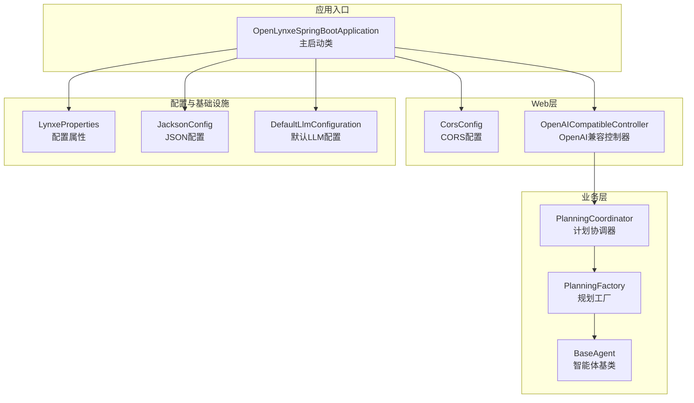
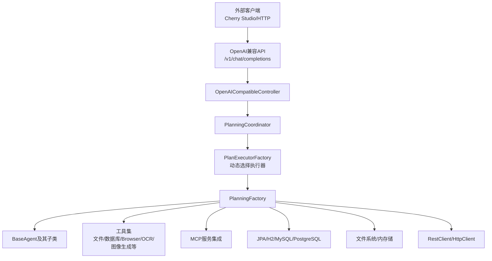
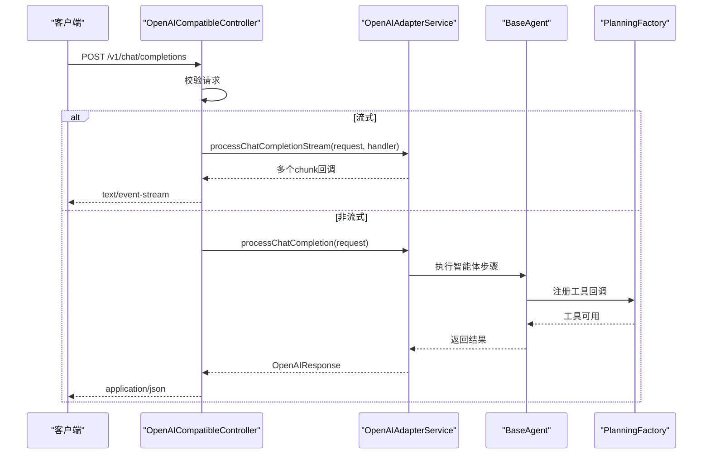
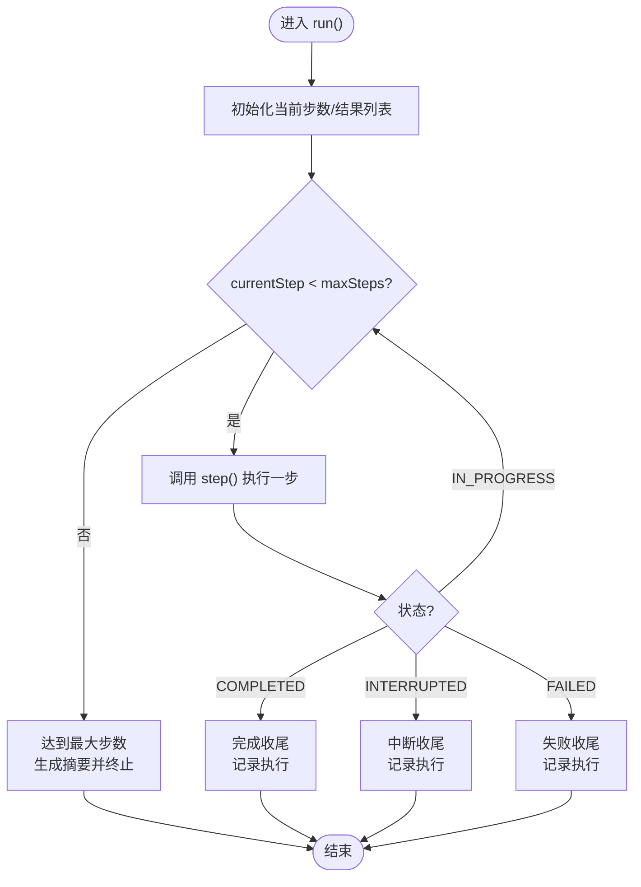
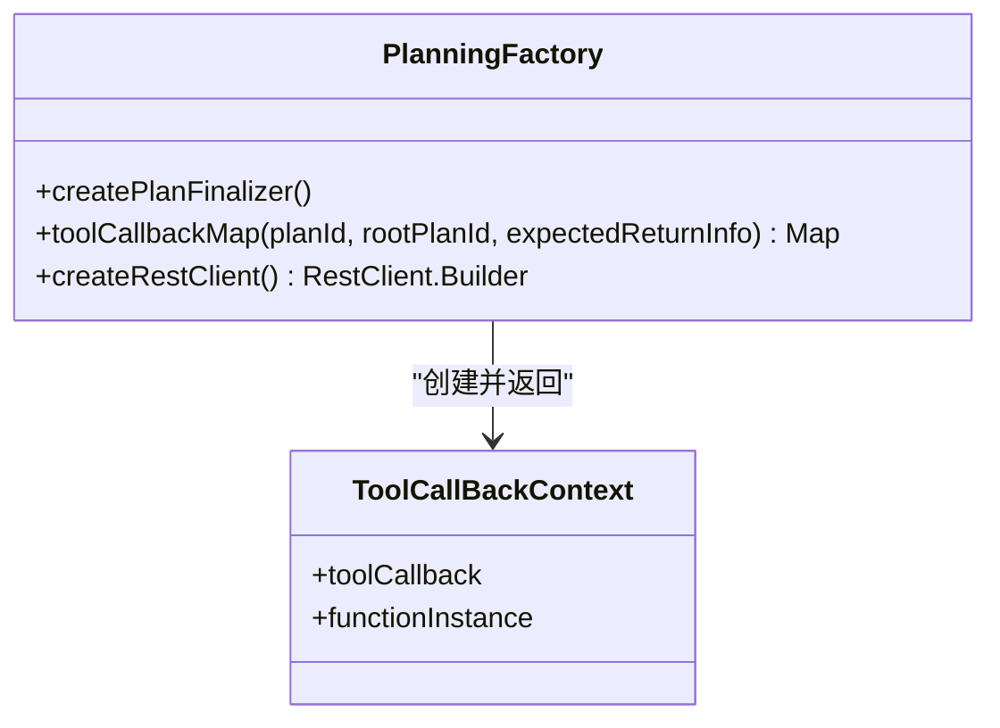
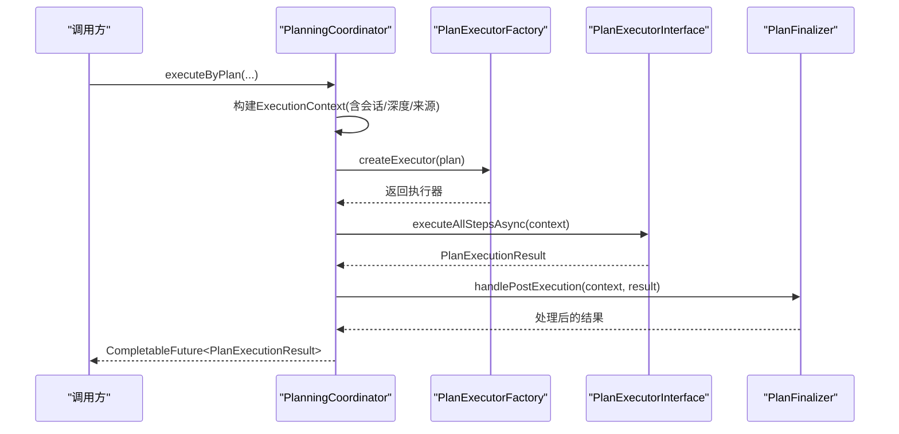
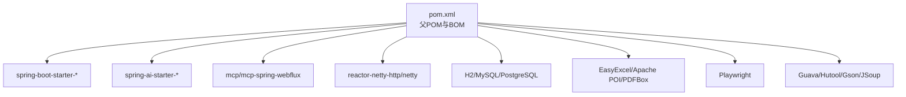

# 整体架构设计

<cite>
**本文档引用的文件**
- [OpenLynxeSpringBootApplication.java](file://src/main/java/com/alibaba/cloud/ai/lynxe/OpenLynxeSpringBootApplication.java)
- [pom.xml](file://pom.xml)
- [application.yml](file://src/main/resources/application.yml)
- [Dockerfile](file://deploy/Dockerfile)
- [README.md](file://README.md)
- [LynxeProperties.java](file://src/main/java/com/alibaba/cloud/ai/lynxe/config/LynxeProperties.java)
- [DefaultLlmConfiguration.java](file://src/main/java/com/alibaba/cloud/ai/lynxe/config/DefaultLlmConfiguration.java)
- [CorsConfig.java](file://src/main/java/com/alibaba/cloud/ai/lynxe/config/CorsConfig.java)
- [JacksonConfig.java](file://src/main/java/com/alibaba/cloud/ai/lynxe/config/JacksonConfig.java)
- [OpenAICompatibleController.java](file://src/main/java/com/alibaba/cloud/ai/lynxe/adapter/controller/OpenAICompatibleController.java)
- [BaseAgent.java](file://src/main/java/com/alibaba/cloud/ai/lynxe/agent/BaseAgent.java)
- [PlanningFactory.java](file://src/main/java/com/alibaba/cloud/ai/lynxe/planning/PlanningFactory.java)
- [PlanningCoordinator.java](file://src/main/java/com/alibaba/cloud/ai/lynxe/runtime/service/PlanningCoordinator.java)
</cite>

## 目录
1. [引言](#引言)
2. [项目结构](#项目结构)
3. [核心组件](#核心组件)
4. [架构总览](#架构总览)
5. [详细组件分析](#详细组件分析)
6. [依赖分析](#依赖分析)
7. [性能考量](#性能考量)
8. [故障排查指南](#故障排查指南)
9. [结论](#结论)
10. [附录](#附录)

## 引言
本架构文档面向Lynxe整体系统，聚焦于其基于Spring Boot与Spring AI的多代理协作平台设计。文档从分层架构、模块化设计与微服务理念出发，系统阐述主启动类配置、组件扫描范围、自动配置机制；解释模块划分原则与技术栈选择；总结核心设计模式与第三方依赖集成策略，并给出版本兼容性与部署建议。

## 项目结构
Lynxe采用标准的Spring Boot工程布局，核心源码位于src/main/java下，按功能域划分包结构，典型模块包括：
- adapter：适配层，提供OpenAI兼容接口控制器
- agent：智能体抽象与实现（ReActAgent、DynamicAgent等）
- config：配置中心与属性绑定、Web MVC与Jackson配置
- cron：定时任务与动态加载
- event：事件发布与监听
- llm：大模型服务封装与流式响应处理
- mcp：Model Context Protocol客户端集成
- model/namespace/planning/recorder/runtime/tool/workspace：业务域模块
- resources：配置文件、静态资源与国际化文案

图表来源
- [OpenLynxeSpringBootApplication.java:29-45](file://src/main/java/com/alibaba/cloud/ai/lynxe/OpenLynxeSpringBootApplication.java#L29-L45)
- [CorsConfig.java:28-40](file://src/main/java/com/alibaba/cloud/ai/lynxe/config/CorsConfig.java#L28-L40)
- [OpenAICompatibleController.java:50-53](file://src/main/java/com/alibaba/cloud/ai/lynxe/adapter/controller/OpenAICompatibleController.java#L50-L53)
- [PlanningCoordinator.java:39-58](file://src/main/java/com/alibaba/cloud/ai/lynxe/runtime/service/PlanningCoordinator.java#L39-L58)
- [PlanningFactory.java:112-229](file://src/main/java/com/alibaba/cloud/ai/lynxe/planning/PlanningFactory.java#L112-L229)
- [BaseAgent.java:70-135](file://src/main/java/com/alibaba/cloud/ai/lynxe/agent/BaseAgent.java#L70-L135)
- [LynxeProperties.java:26-28](file://src/main/java/com/alibaba/cloud/ai/lynxe/config/LynxeProperties.java#L26-L28)
- [JacksonConfig.java:30-48](file://src/main/java/com/alibaba/cloud/ai/lynxe/config/JacksonConfig.java#L30-L48)
- [DefaultLlmConfiguration.java:24-51](file://src/main/java/com/alibaba/cloud/ai/lynxe/config/DefaultLlmConfiguration.java#L24-L51)

章节来源
- [OpenLynxeSpringBootApplication.java:29-45](file://src/main/java/com/alibaba/cloud/ai/lynxe/OpenLynxeSpringBootApplication.java#L29-L45)
- [application.yml:1-97](file://src/main/resources/application.yml#L1-L97)
- [pom.xml:12-46](file://pom.xml#L12-L46)

## 核心组件
- 主启动类与自动装配
  - 启动类通过@SpringBootApplication启用组件扫描、JPA仓库与实体扫描，并开启调度支持，确保定时任务与数据库访问可用。
  - 启动类内置Playwright初始化逻辑，便于容器内预热浏览器依赖。
- 配置体系
  - 基于@ConfigurationProperties的LynxeProperties集中管理运行参数，支持动态读取与回填。
  - JacksonConfig统一注册JavaTimeModule与UTF-8支持，修复Spring AI内部ObjectMapper问题。
  - DefaultLlmConfiguration提供DashScope默认模型与兼容路径。
  - CorsConfig开放API跨域访问。
- 控制器与适配层
  - OpenAICompatibleController提供/v1/chat/completions与/v1/models等端点，兼容外部客户端（如Cherry Studio），支持流式与非流式响应。
- 执行编排
  - PlanningCoordinator负责根据请求来源与上下文生成执行上下文，委派给PlanExecutorFactory选择具体执行器，最终由PlanFinalizer进行后处理。
  - PlanningFactory负责工具回调注册、RestClient构建与MCP工具桥接。
  - BaseAgent定义智能体生命周期、步进控制与异常兜底流程。

章节来源
- [OpenLynxeSpringBootApplication.java:29-45](file://src/main/java/com/alibaba/cloud/ai/lynxe/OpenLynxeSpringBootApplication.java#L29-L45)
- [LynxeProperties.java:26-654](file://src/main/java/com/alibaba/cloud/ai/lynxe/config/LynxeProperties.java#L26-L654)
- [JacksonConfig.java:30-81](file://src/main/java/com/alibaba/cloud/ai/lynxe/config/JacksonConfig.java#L30-L81)
- [DefaultLlmConfiguration.java:24-51](file://src/main/java/com/alibaba/cloud/ai/lynxe/config/DefaultLlmConfiguration.java#L24-L51)
- [CorsConfig.java:28-40](file://src/main/java/com/alibaba/cloud/ai/lynxe/config/CorsConfig.java#L28-L40)
- [OpenAICompatibleController.java:50-357](file://src/main/java/com/alibaba/cloud/ai/lynxe/adapter/controller/OpenAICompatibleController.java#L50-L357)
- [PlanningCoordinator.java:39-182](file://src/main/java/com/alibaba/cloud/ai/lynxe/runtime/service/PlanningCoordinator.java#L39-L182)
- [PlanningFactory.java:112-427](file://src/main/java/com/alibaba/cloud/ai/lynxe/planning/PlanningFactory.java#L112-L427)
- [BaseAgent.java:70-589](file://src/main/java/com/alibaba/cloud/ai/lynxe/agent/BaseAgent.java#L70-L589)

## 架构总览
Lynxe采用“分层+模块化+微服务理念”的混合架构：
- 分层架构：表现层（Web）、业务编排层（Coordinator/Factory）、工具与智能体层（Agent/Tool）、基础设施层（DB/Jackson/RestClient）。
- 模块化设计：以功能域划分模块，如adapter、agent、planning、runtime、tool等，职责清晰、边界明确。
- 微服务理念：通过MCP与外部服务解耦，工具注册与回调机制支持动态扩展；同时在单JAR内聚合，便于部署与运维。

图表来源
- [OpenAICompatibleController.java:85-116](file://src/main/java/com/alibaba/cloud/ai/lynxe/adapter/controller/OpenAICompatibleController.java#L85-L116)
- [PlanningCoordinator.java:76-179](file://src/main/java/com/alibaba/cloud/ai/lynxe/runtime/service/PlanningCoordinator.java#L76-L179)
- [PlanningFactory.java:261-393](file://src/main/java/com/alibaba/cloud/ai/lynxe/planning/PlanningFactory.java#L261-L393)
- [BaseAgent.java:281-357](file://src/main/java/com/alibaba/cloud/ai/lynxe/agent/BaseAgent.java#L281-L357)

## 详细组件分析

### 组件A：OpenAI兼容控制器
- 职责：提供OpenAI兼容端点，支持流式与非流式响应；校验请求合法性；健康检查与模型列表。
- 关键流程：POST /v1/chat/completions根据stream参数选择处理分支；流式响应通过自定义chunk格式拼接；非流式直接返回JSON。
- 错误处理：捕获异常并返回标准错误响应；流式场景构造OpenAI风格错误chunk。

图表来源
- [OpenAICompatibleController.java:85-116](file://src/main/java/com/alibaba/cloud/ai/lynxe/adapter/controller/OpenAICompatibleController.java#L85-L116)
- [OpenAICompatibleController.java:121-185](file://src/main/java/com/alibaba/cloud/ai/lynxe/adapter/controller/OpenAICompatibleController.java#L121-L185)
- [OpenAICompatibleController.java:246-261](file://src/main/java/com/alibaba/cloud/ai/lynxe/adapter/controller/OpenAICompatibleController.java#L246-L261)
- [PlanningFactory.java:341-377](file://src/main/java/com/alibaba/cloud/ai/lynxe/planning/PlanningFactory.java#L341-L377)
- [BaseAgent.java:281-357](file://src/main/java/com/alibaba/cloud/ai/lynxe/agent/BaseAgent.java#L281-L357)

章节来源
- [OpenAICompatibleController.java:50-357](file://src/main/java/com/alibaba/cloud/ai/lynxe/adapter/controller/OpenAICompatibleController.java#L50-L357)

### 组件B：智能体基类与执行流程
- 职责：定义智能体生命周期、最大步数限制、环境变量与记录器注入；提供异常兜底与终止流程。
- 关键流程：run循环执行step，依据状态（完成/中断/失败）进行不同收尾；达到最大步数生成摘要并终止；异常通过SystemErrorReportTool包装上报。

图表来源
- [BaseAgent.java:281-357](file://src/main/java/com/alibaba/cloud/ai/lynxe/agent/BaseAgent.java#L281-L357)
- [BaseAgent.java:399-449](file://src/main/java/com/alibaba/cloud/ai/lynxe/agent/BaseAgent.java#L399-L449)
- [BaseAgent.java:569-586](file://src/main/java/com/alibaba/cloud/ai/lynxe/agent/BaseAgent.java#L569-L586)

章节来源
- [BaseAgent.java:70-589](file://src/main/java/com/alibaba/cloud/ai/lynxe/agent/BaseAgent.java#L70-L589)

### 组件C：规划工厂与工具回调
- 职责：集中注册各类工具回调（文件、数据库、浏览器、OCR、图像生成、并行执行、Cron等），并支持MCP服务组工具桥接；构建RestClient并设置长超时。
- 设计要点：使用FunctionToolCallback为每个工具生成带限定键的回调，保证LLM调用时的唯一标识；支持空实现以在MCP禁用时优雅降级。

图表来源
- [PlanningFactory.java:112-427](file://src/main/java/com/alibaba/cloud/ai/lynxe/planning/PlanningFactory.java#L112-L427)
- [PlanningFactory.java:240-259](file://src/main/java/com/alibaba/cloud/ai/lynxe/planning/PlanningFactory.java#L240-L259)

章节来源
- [PlanningFactory.java:112-427](file://src/main/java/com/alibaba/cloud/ai/lynxe/planning/PlanningFactory.java#L112-L427)

### 组件D：计划协调器
- 职责：根据请求来源与上下文构建ExecutionContext，委派执行器执行计划，完成后交由PlanFinalizer进行后处理。
- 设计要点：区分Vue侧请求与HTTP请求对会话记忆的影响；支持为Vue侧生成会话ID以复用对话记忆。

图表来源
- [PlanningCoordinator.java:76-179](file://src/main/java/com/alibaba/cloud/ai/lynxe/runtime/service/PlanningCoordinator.java#L76-L179)

章节来源
- [PlanningCoordinator.java:39-182](file://src/main/java/com/alibaba/cloud/ai/lynxe/runtime/service/PlanningCoordinator.java#L39-L182)

## 依赖分析
- 技术栈与版本
  - Spring Boot 3.5.6、Spring AI 1.1.2、Spring AI Alibaba 1.0.0.4-SNAPSHOT（快照版用于适配M8，存在运行风险提示）
  - WebFlux + Reactor Netty、Playwright、H2/MySQL/PostgreSQL、EasyExcel、Apache POI、PDFBox、cron-utils等
- 依赖管理
  - 使用dependencyManagement导入spring-ai-bom，统一依赖版本
  - 显式排除commons-logging、POI相关传递依赖，避免冲突
- 部署与容器化
  - Dockerfile采用多阶段构建，预装Playwright浏览器依赖，容器内启动时执行playwright-init以缓存浏览器二进制
  - 支持H2/MySQL/PostgreSQL三种数据源，通过profile切换

图表来源
- [pom.xml:48-58](file://pom.xml#L48-L58)
- [pom.xml:60-353](file://pom.xml#L60-L353)
- [Dockerfile:15-138](file://deploy/Dockerfile#L15-L138)

章节来源
- [pom.xml:12-46](file://pom.xml#L12-L46)
- [pom.xml:48-58](file://pom.xml#L48-L58)
- [pom.xml:60-353](file://pom.xml#L60-L353)
- [Dockerfile:15-138](file://deploy/Dockerfile#L15-L138)

## 性能考量
- 并发与线程池
  - 工具执行支持并行调用（可配置），并提供基于层级的执行器池与并行执行服务，提升复杂任务吞吐。
- I/O与存储
  - 文件系统统一管理、符号链接检测与.gitignore匹配，避免越权与冗余扫描；内存储服务支持智能内容保存。
- 网络与超时
  - RestClient设置较长连接/响应/请求超时，适配长耗时工具调用；HttpClient默认超时10分钟。
- 数据库与缓存
  - JPA配置禁用OpenSessionInView，减少事务持有期；Hikari连接池参数可调，满足高并发场景。
- 序列化
  - Jackson注册JavaTimeModule与UTF-8支持，修复Spring AI内部ObjectMapper问题，避免反序列化异常。

章节来源
- [PlanningFactory.java:395-414](file://src/main/java/com/alibaba/cloud/ai/lynxe/planning/PlanningFactory.java#L395-L414)
- [JacksonConfig.java:30-81](file://src/main/java/com/alibaba/cloud/ai/lynxe/config/JacksonConfig.java#L30-L81)
- [application.yml:20-31](file://src/main/resources/application.yml#L20-L31)

## 故障排查指南
- 启动与容器化
  - 容器启动时需先执行playwright-init以安装浏览器；若浏览器不可用，检查PLAYWRIGHT_BROWSERS_PATH与权限。
  - 如出现DNS解析问题，可启用macOS原生DNS解析依赖（可选）。
- API与跨域
  - CORS已开放/api/**，如遇跨域问题，确认前端域名与请求头是否符合配置。
- JSON与日期
  - 若遇到日期反序列化异常，确认ObjectMapper已注册JavaTimeModule；框架已自动修复Spring AI内部实例。
- 数据库
  - 默认DDL策略为update，首次启动自动建表；如需其他行为，请调整JPA配置。
- MCP与工具
  - MCP禁用时使用空ToolCallbackProvider降级；工具注册失败时查看日志定位具体工具名称。

章节来源
- [Dockerfile:92-109](file://deploy/Dockerfile#L92-L109)
- [CorsConfig.java:28-40](file://src/main/java/com/alibaba/cloud/ai/lynxe/config/CorsConfig.java#L28-L40)
- [JacksonConfig.java:54-78](file://src/main/java/com/alibaba/cloud/ai/lynxe/config/JacksonConfig.java#L54-L78)
- [application.yml:32-38](file://src/main/resources/application.yml#L32-L38)
- [PlanningFactory.java:420-424](file://src/main/java/com/alibaba/cloud/ai/lynxe/planning/PlanningFactory.java#L420-L424)

## 结论
Lynxe以Spring Boot为核心，结合Spring AI与MCP实现多代理协作与工具生态扩展。通过清晰的分层与模块化设计、完善的配置与序列化体系、以及对网络与I/O的优化，系统在易用性、可扩展性与稳定性之间取得平衡。建议在生产环境中关注MCP适配版本与浏览器依赖的容器化部署细节，并根据业务负载调整线程池与数据库连接参数。

## 附录
- 快速启动与部署
  - 支持JAR直跑与Docker部署；Docker镜像预装Playwright浏览器，推荐使用官方镜像以降低环境差异。
- 配置参考
  - application.yml中包含端口、文件上传、计划轮询、命名空间与代理序列化等关键配置项。

章节来源
- [README.md:49-151](file://README.md#L49-L151)
- [application.yml:1-97](file://src/main/resources/application.yml#L1-L97)