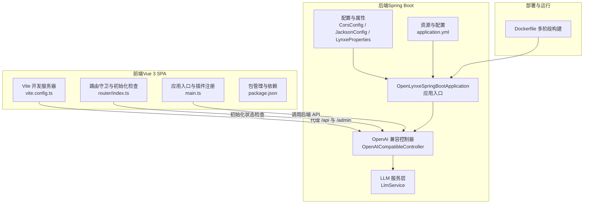
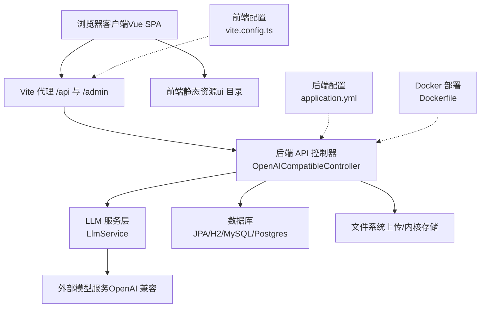
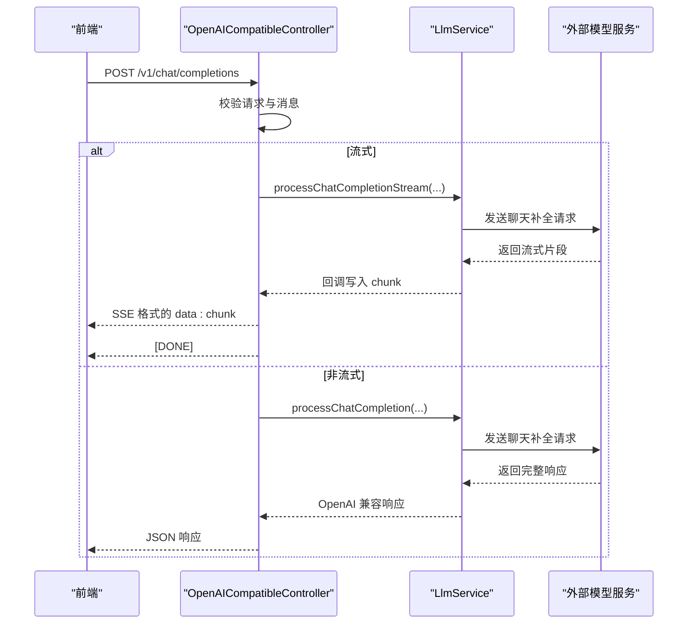
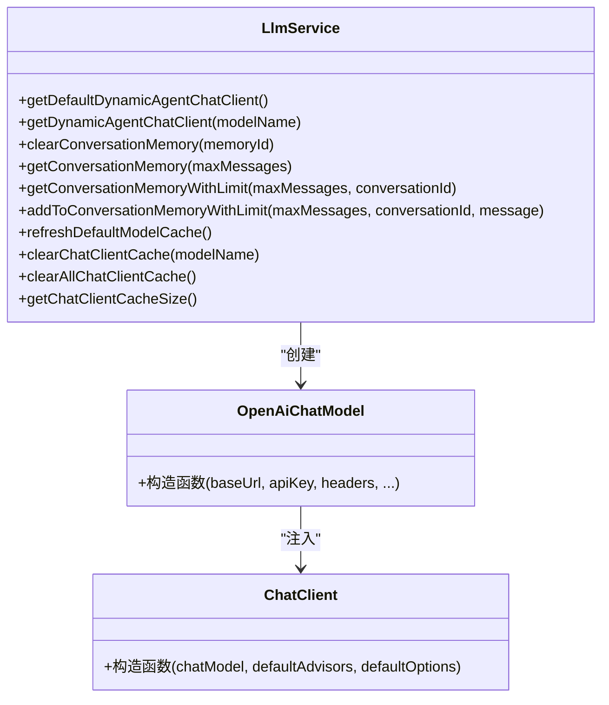
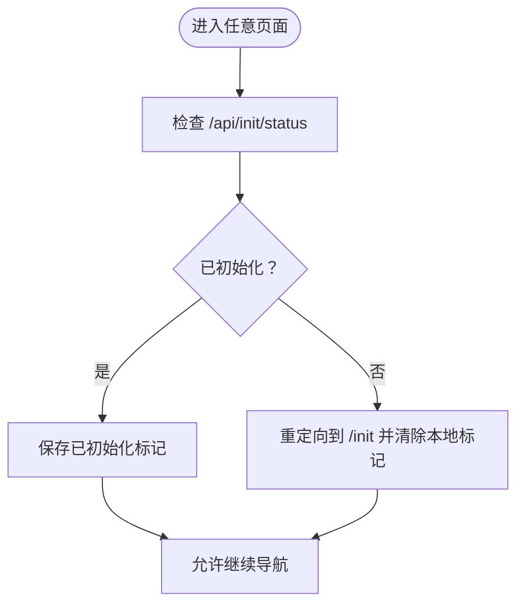
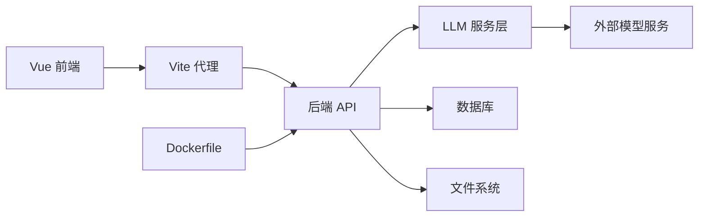

# 系统架构

<cite>
**本文引用的文件**
- [pom.xml](file://pom.xml)
- [OpenLynxeSpringBootApplication.java](file://src/main/java/com/alibaba/cloud/ai/lynxe/OpenLynxeSpringBootApplication.java)
- [application.yml](file://src/main/resources/application.yml)
- [CorsConfig.java](file://src/main/java/com/alibaba/cloud/ai/lynxe/config/CorsConfig.java)
- [JacksonConfig.java](file://src/main/java/com/alibaba/cloud/ai/lynxe/config/JacksonConfig.java)
- [LynxeProperties.java](file://src/main/java/com/alibaba/cloud/ai/lynxe/config/LynxeProperties.java)
- [OpenAICompatibleController.java](file://src/main/java/com/alibaba/cloud/ai/lynxe/adapter/controller/OpenAICompatibleController.java)
- [LlmService.java](file://src/main/java/com/alibaba/cloud/ai/lynxe/llm/LlmService.java)
- [Dockerfile](file://deploy/Dockerfile)
- [package.json](file://ui-vue3/package.json)
- [vite.config.ts](file://ui-vue3/vite.config.ts)
- [main.ts](file://ui-vue3/src/main.ts)
- [index.ts](file://ui-vue3/src/router/index.ts)
</cite>

## 目录
1. [引言](#引言)
2. [项目结构](#项目结构)
3. [核心组件](#核心组件)
4. [架构总览](#架构总览)
5. [详细组件分析](#详细组件分析)
6. [依赖分析](#依赖分析)
7. [性能考量](#性能考量)
8. [故障排查指南](#故障排查指南)
9. [结论](#结论)
10. [附录](#附录)

## 引言
本架构文档面向 Lynxe 系统，目标是提供从高层到实现细节的完整视图，覆盖前后端分离架构、微服务化后端与单页前端应用、组件交互、数据流、集成模式、技术决策与权衡、基础设施与可扩展性、部署拓扑以及横切关注点（安全、监控、灾备）。Lynxe 以 Spring Boot 为基础，采用 Spring AI 与 MCP 协议能力，提供 OpenAI 兼容接口，并通过 Vue.js 前端提供可视化管理与执行界面。

## 项目结构
Lynxe 采用多模块布局：后端为 Spring Boot 应用，前端为 Vue 3 单页应用（SPA），并通过 Vite 构建与代理开发服务器对接后端 API；容器化部署使用多阶段 Dockerfile，内置 Playwright 浏览器依赖与启动脚本。

**图表来源**
- [OpenLynxeSpringBootApplication.java:29-45](file://src/main/java/com/alibaba/cloud/ai/lynxe/OpenLynxeSpringBootApplication.java#L29-L45)
- [OpenAICompatibleController.java:50-116](file://src/main/java/com/alibaba/cloud/ai/lynxe/adapter/controller/OpenAICompatibleController.java#L50-L116)
- [LlmService.java:56-210](file://src/main/java/com/alibaba/cloud/ai/lynxe/llm/LlmService.java#L56-L210)
- [CorsConfig.java:28-40](file://src/main/java/com/alibaba/cloud/ai/lynxe/config/CorsConfig.java#L28-L40)
- [JacksonConfig.java:30-80](file://src/main/java/com/alibaba/cloud/ai/lynxe/config/JacksonConfig.java#L30-L80)
- [LynxeProperties.java:26-654](file://src/main/java/com/alibaba/cloud/ai/lynxe/config/LynxeProperties.java#L26-L654)
- [application.yml:1-97](file://src/main/resources/application.yml#L1-L97)
- [vite.config.ts:23-71](file://ui-vue3/vite.config.ts#L23-L71)
- [index.ts:17-62](file://ui-vue3/src/router/index.ts#L17-L62)
- [main.ts:17-57](file://ui-vue3/src/main.ts#L17-L57)
- [Dockerfile:15-138](file://deploy/Dockerfile#L15-L138)

**章节来源**
- [OpenLynxeSpringBootApplication.java:29-45](file://src/main/java/com/alibaba/cloud/ai/lynxe/OpenLynxeSpringBootApplication.java#L29-L45)
- [application.yml:1-97](file://src/main/resources/application.yml#L1-L97)
- [vite.config.ts:23-71](file://ui-vue3/vite.config.ts#L23-L71)
- [index.ts:17-62](file://ui-vue3/src/router/index.ts#L17-L62)
- [main.ts:17-57](file://ui-vue3/src/main.ts#L17-L57)
- [Dockerfile:15-138](file://deploy/Dockerfile#L15-L138)

## 核心组件
- 后端核心
  - 应用入口与扫描：Spring Boot 启动类负责组件扫描、JPA 启用与调度开启。
  - OpenAI 兼容控制器：提供 /v1/chat/completions 与 /v1/models 等 OpenAI 兼容端点，支持流式与非流式响应。
  - LLM 服务层：统一构建 ChatClient、模型选项、对话记忆、工具执行策略与重试机制，支持动态模型切换与缓存。
  - 配置与属性：跨域、Jackson 时间模块与 UTF-8 支持、系统级 Lynxe 属性（浏览器、代理、并发、图像识别等）。
- 前端核心
  - Vite 开发服务器：本地代理后端 /api 与 /admin，输出静态资源至 ui 目录。
  - 路由守卫：在访问除初始化页外的页面前，检查后端初始化状态，未初始化则重定向至初始化页。
  - 应用入口：注册 Pinia、Ant Design Vue、国际化、颜色选择器等插件，初始化语言与消息提示。
- 部署与运行
  - Docker 多阶段构建：安装 Node.js 与 Playwright 依赖，预装浏览器，设置 JVM 容器参数与环境变量，暴露端口并以启动脚本作为入口。

**章节来源**
- [OpenLynxeSpringBootApplication.java:29-45](file://src/main/java/com/alibaba/cloud/ai/lynxe/OpenLynxeSpringBootApplication.java#L29-L45)
- [OpenAICompatibleController.java:50-116](file://src/main/java/com/alibaba/cloud/ai/lynxe/adapter/controller/OpenAICompatibleController.java#L50-L116)
- [LlmService.java:56-210](file://src/main/java/com/alibaba/cloud/ai/lynxe/llm/LlmService.java#L56-L210)
- [CorsConfig.java:28-40](file://src/main/java/com/alibaba/cloud/ai/lynxe/config/CorsConfig.java#L28-L40)
- [JacksonConfig.java:30-80](file://src/main/java/com/alibaba/cloud/ai/lynxe/config/JacksonConfig.java#L30-L80)
- [LynxeProperties.java:26-654](file://src/main/java/com/alibaba/cloud/ai/lynxe/config/LynxeProperties.java#L26-L654)
- [vite.config.ts:23-71](file://ui-vue3/vite.config.ts#L23-L71)
- [index.ts:17-62](file://ui-vue3/src/router/index.ts#L17-L62)
- [main.ts:17-57](file://ui-vue3/src/main.ts#L17-L57)
- [Dockerfile:15-138](file://deploy/Dockerfile#L15-L138)

## 架构总览
Lynxe 采用“前端 SPA + 后端微服务”架构。前端通过 Vite 本地开发服务器代理请求到后端，生产环境将前端构建产物嵌入后端资源路径；后端提供 OpenAI 兼容接口与内部业务接口，内部通过 LLM 服务层与外部模型服务交互，同时管理对话记忆、工具调用与执行。

**图表来源**
- [OpenAICompatibleController.java:50-116](file://src/main/java/com/alibaba/cloud/ai/lynxe/adapter/controller/OpenAICompatibleController.java#L50-L116)
- [LlmService.java:56-210](file://src/main/java/com/alibaba/cloud/ai/lynxe/llm/LlmService.java#L56-L210)
- [application.yml:1-97](file://src/main/resources/application.yml#L1-L97)
- [vite.config.ts:23-71](file://ui-vue3/vite.config.ts#L23-L71)
- [Dockerfile:15-138](file://deploy/Dockerfile#L15-L138)

## 详细组件分析

### 后端应用入口与扫描
- 启动类启用调度、JPA 扫描与组件扫描，确保所有子包被纳入容器管理。
- 提供 Playwright 初始化入口，便于容器内预装浏览器。

**章节来源**
- [OpenLynxeSpringBootApplication.java:29-45](file://src/main/java/com/alibaba/cloud/ai/lynxe/OpenLynxeSpringBootApplication.java#L29-L45)

### OpenAI 兼容控制器
- 提供 /v1/chat/completions（流式与非流式）、/v1/models、/v1/health 等端点。
- 对请求进行校验、日志记录与错误处理；流式响应遵循 OpenAI chunk 格式，非流式返回标准 JSON。
- 统一转换为 OpenAI 兼容格式，便于外部工具（如 Cherry Studio）直接接入。

**图表来源**
- [OpenAICompatibleController.java:82-185](file://src/main/java/com/alibaba/cloud/ai/lynxe/adapter/controller/OpenAICompatibleController.java#L82-L185)
- [LlmService.java:322-482](file://src/main/java/com/alibaba/cloud/ai/lynxe/llm/LlmService.java#L322-L482)

**章节来源**
- [OpenAICompatibleController.java:50-357](file://src/main/java/com/alibaba/cloud/ai/lynxe/adapter/controller/OpenAICompatibleController.java#L50-L357)

### LLM 服务层
- 统一构建 ChatClient，支持默认模型与按模型名缓存实例，避免重复创建。
- 动态模型切换与事件监听，当默认模型变更时清理缓存并重建。
- 对话记忆管理，支持带上限检查的记忆窗口与消息添加后的自动限制。
- 增强 WebClient 构建，支持 DNS 缓存或超时配置，避免网络抖动影响。
- 规范化模型服务 URL，避免重复 /v1 路径导致的错误。

**图表来源**
- [LlmService.java:56-482](file://src/main/java/com/alibaba/cloud/ai/lynxe/llm/LlmService.java#L56-L482)

**章节来源**
- [LlmService.java:56-482](file://src/main/java/com/alibaba/cloud/ai/lynxe/llm/LlmService.java#L56-L482)

### 配置与属性
- 跨域配置：对 /api/** 开放所有来源、方法与头，禁用凭据。
- Jackson 配置：注册 JavaTimeModule，支持 UTF-8 与未知字段忽略等特性，并修复 Spring AI 内部 ObjectMapper 使用问题。
- 系统属性：集中定义浏览器、代理、并发、图像识别、图像生成等可配置项，通过注解驱动的属性绑定与配置服务读取。

**章节来源**
- [CorsConfig.java:28-40](file://src/main/java/com/alibaba/cloud/ai/lynxe/config/CorsConfig.java#L28-L40)
- [JacksonConfig.java:30-80](file://src/main/java/com/alibaba/cloud/ai/lynxe/config/JacksonConfig.java#L30-L80)
- [LynxeProperties.java:26-654](file://src/main/java/com/alibaba/cloud/ai/lynxe/config/LynxeProperties.java#L26-L654)
- [application.yml:1-97](file://src/main/resources/application.yml#L1-L97)

### 前端路由与初始化流程
- 路由守卫在进入任意受保护页面前，向 /api/init/status 检查系统初始化状态；若未初始化则重定向至 /init。
- 应用入口注册全局插件与国际化，保证语言初始化成功后再挂载应用。

**图表来源**
- [index.ts:26-62](file://ui-vue3/src/router/index.ts#L26-L62)

**章节来源**
- [index.ts:17-62](file://ui-vue3/src/router/index.ts#L17-L62)
- [main.ts:17-57](file://ui-vue3/src/main.ts#L17-L57)

### 部署与运行
- 多阶段 Dockerfile：安装系统依赖与 Node.js，预装 Playwright 浏览器，复制配置与启动脚本，设置 JVM 容器参数与环境变量，暴露端口并以启动脚本为入口。
- 生产环境建议：结合反向代理（如 Nginx）提供静态资源服务与 TLS 终止，后端通过容器编排（Kubernetes/Docker Compose）进行扩缩容与健康检查。

**章节来源**
- [Dockerfile:15-138](file://deploy/Dockerfile#L15-L138)

## 依赖分析
- 技术栈与版本要点
  - 后端：Spring Boot 3.5.6、Spring AI 1.1.2、WebFlux、Reactor Netty、JPA/H2/MySQL/Postgres、MCP 客户端、Playwright。
  - 前端：Vue 3、Vite、Axios、Ant Design Vue、Pinia、Vue Router、Monaco Editor、NProgress 等。
- 关键依赖关系
  - OpenAI 兼容控制器依赖 LLM 服务层；LLM 服务层依赖外部模型服务与配置。
  - 前端通过 Vite 代理与后端通信，路由守卫依赖后端初始化状态接口。
  - Dockerfile 将前端构建产物与后端打包结合，提供运行时环境。

**图表来源**
- [pom.xml:60-353](file://pom.xml#L60-L353)
- [package.json:28-100](file://ui-vue3/package.json#L28-L100)
- [Dockerfile:15-138](file://deploy/Dockerfile#L15-L138)

**章节来源**
- [pom.xml:60-353](file://pom.xml#L60-L353)
- [package.json:28-100](file://ui-vue3/package.json#L28-L100)

## 性能考量
- 连接池与超时
  - Hikari 连接池参数（最大池大小、空闲、生命周期、泄漏检测阈值）需根据并发与资源情况调整。
  - LLM 请求默认超时与流式读取超时，建议结合业务场景与外部模型服务 SLA 调整。
- 缓存与内存
  - ChatClient 实例按模型名缓存，减少重复创建开销；对话记忆窗口与字符上限控制降低内存压力。
- 并发与工具调用
  - 可配置的并发工具调用与执行池大小，需结合 CPU 与 I/O 资源评估。
- 前端性能
  - Vite 生产构建启用 Source Map 与 CSS Source Map，便于调试但会增加体积；可按需关闭。
- 网络与 DNS
  - 增强 WebClient 构建支持 DNS 缓存或超时配置，有助于提升网络稳定性。

**章节来源**
- [application.yml:19-31](file://src/main/resources/application.yml#L19-L31)
- [LlmService.java:366-388](file://src/main/java/com/alibaba/cloud/ai/lynxe/llm/LlmService.java#L366-L388)
- [LynxeProperties.java:312-354](file://src/main/java/com/alibaba/cloud/ai/lynxe/config/LynxeProperties.java#L312-L354)

## 故障排查指南
- OpenAI 兼容接口异常
  - 检查请求体是否包含合法 messages；查看控制器日志与错误响应。
  - 流式响应失败时，确认外部模型服务可用性与网络连通性。
- 初始化状态异常
  - 前端路由守卫依赖 /api/init/status；若失败，检查后端初始化流程与数据库连接。
- 跨域与前端代理
  - 确认 /api 与 /admin 代理指向正确端口；生产环境需确保反向代理正确转发。
- Docker 运行问题
  - Playwright 浏览器安装失败时，检查多阶段构建步骤与缓存路径；确认 JVM 参数与容器资源配额。

**章节来源**
- [OpenAICompatibleController.java:82-116](file://src/main/java/com/alibaba/cloud/ai/lynxe/adapter/controller/OpenAICompatibleController.java#L82-L116)
- [index.ts:26-62](file://ui-vue3/src/router/index.ts#L26-L62)
- [vite.config.ts:32-45](file://ui-vue3/vite.config.ts#L32-L45)
- [Dockerfile:92-124](file://deploy/Dockerfile#L92-L124)

## 结论
Lynxe 通过前后端分离架构实现了高内聚、低耦合的系统设计：后端以 Spring Boot 为核心，提供 OpenAI 兼容接口与 LLM 能力，前端以 Vue 3 提供直观的管理与执行界面。通过合理的配置、缓存与并发策略，系统具备良好的扩展性与可维护性；结合容器化与代理部署，满足生产环境的可用性与可观测性要求。

## 附录
- 系统边界
  - 外部边界：浏览器客户端、外部模型服务（OpenAI 兼容）、文件系统、数据库。
  - 内部边界：后端 API 控制器、LLM 服务层、配置与属性模块、前端 SPA。
- 集成模式
  - OpenAI 兼容协议：统一消息格式与流式响应，便于生态工具接入。
  - MCP 客户端：用于与外部服务建立连接与传输。
- 横切关注点
  - 安全：CORS 开放范围与凭据策略、后端认证与授权（如需）。
  - 监控：Micrometer 观察与追踪（ChatModelObservationConvention）、日志级别与文件输出。
  - 灾难恢复：数据库多选型（H2/MySQL/Postgres）、容器健康检查与重启策略。