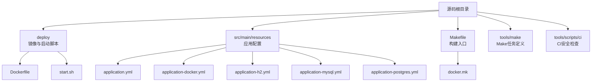
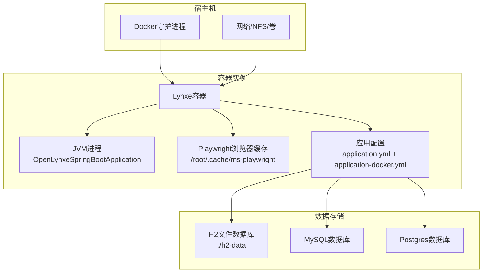
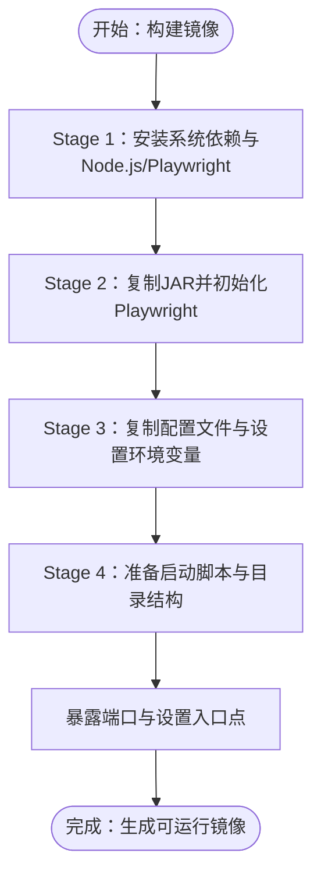
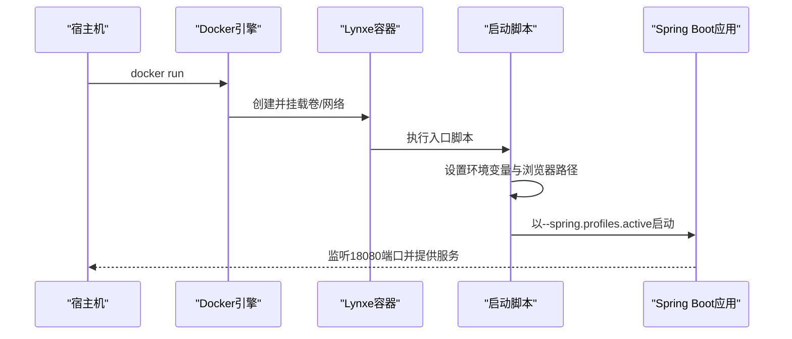
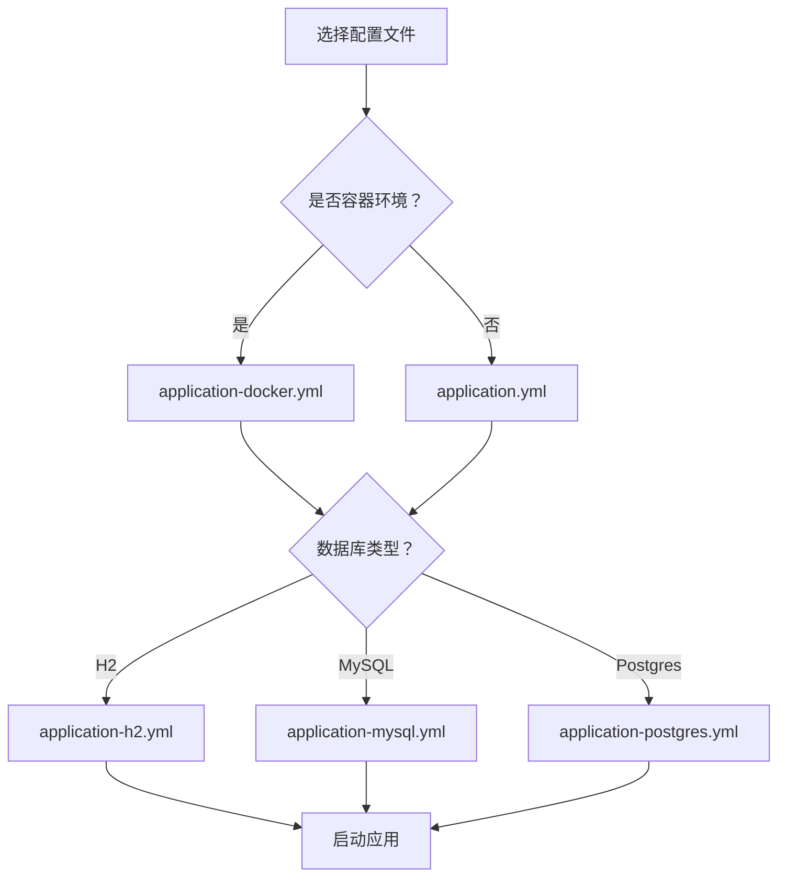
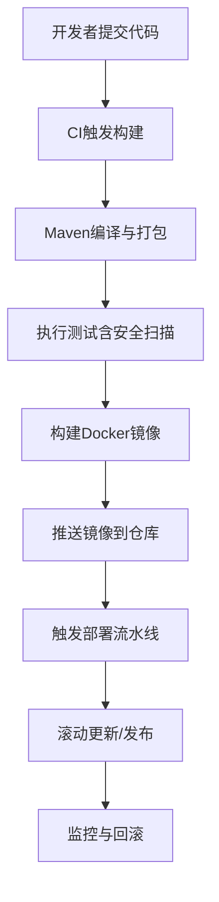
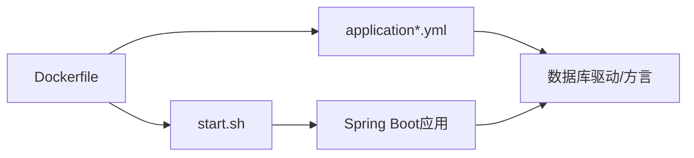

# 部署架构设计

<cite>
**本文引用的文件**
- [Dockerfile](file://deploy/Dockerfile)
- [启动脚本](file://deploy/start.sh)
- [部署说明](file://deploy/README.md)
- [主配置文件](file://src/main/resources/application.yml)
- [Docker专用配置](file://src/main/resources/application-docker.yml)
- [H2数据库配置](file://src/main/resources/application-h2.yml)
- [MySQL配置](file://src/main/resources/application-mysql.yml)
- [Postgres配置](file://src/main/resources/application-postgres.yml)
- [Makefile](file://Makefile)
- [Maven构建配置](file://pom.xml)
- [Docker任务定义](file://tools/make/docker.mk)
- [CI安全检查脚本](file://tools/scripts/ci/check-secrets.sh)
</cite>

## 目录
1. [简介](#简介)
2. [项目结构](#项目结构)
3. [核心组件](#核心组件)
4. [架构总览](#架构总览)
5. [详细组件分析](#详细组件分析)
6. [依赖关系分析](#依赖关系分析)
7. [性能考虑](#性能考虑)
8. [故障排查指南](#故障排查指南)
9. [结论](#结论)
10. [附录](#附录)

## 简介
本文件面向Lynxe项目的容器化部署与运维，系统性阐述从镜像构建、容器运行到集群部署的完整架构设计。内容涵盖单机部署、集群部署与云原生部署模式，部署配置管理（环境变量、配置文件、密钥管理），以及CI/CD流水线、高可用与故障恢复、监控告警与日志收集等运维要点。目标是帮助读者快速理解并安全高效地部署Lynxe。

## 项目结构
Lynxe采用多阶段Docker镜像构建，结合Spring Boot应用与Playwright浏览器自动化能力。部署相关的关键位置如下：
- 镜像构建：deploy/Dockerfile
- 启动入口：deploy/start.sh
- 应用配置：src/main/resources/application*.yml
- 构建编排：Makefile + tools/make/docker.mk
- CI安全检查：tools/scripts/ci/check-secrets.sh

图表来源
- [Dockerfile:1-138](file://deploy/Dockerfile#L1-L138)
- [启动脚本:1-91](file://deploy/start.sh#L1-L91)
- [主配置文件:1-97](file://src/main/resources/application.yml#L1-L97)
- [Docker专用配置:1-20](file://src/main/resources/application-docker.yml#L1-L20)
- [H2数据库配置:1-23](file://src/main/resources/application-h2.yml#L1-L23)
- [MySQL配置:1-15](file://src/main/resources/application-mysql.yml#L1-L15)
- [Postgres配置:1-15](file://src/main/resources/application-postgres.yml#L1-L15)
- [Makefile:1-30](file://Makefile#L1-L30)
- [Docker任务定义:1-46](file://tools/make/docker.mk#L1-L46)

章节来源
- [Dockerfile:1-138](file://deploy/Dockerfile#L1-L138)
- [启动脚本:1-91](file://deploy/start.sh#L1-L91)
- [主配置文件:1-97](file://src/main/resources/application.yml#L1-L97)
- [Docker专用配置:1-20](file://src/main/resources/application-docker.yml#L1-L20)
- [H2数据库配置:1-23](file://src/main/resources/application-h2.yml#L1-L23)
- [MySQL配置:1-15](file://src/main/resources/application-mysql.yml#L1-L15)
- [Postgres配置:1-15](file://src/main/resources/application-postgres.yml#L1-L15)
- [Makefile:1-30](file://Makefile#L1-L30)
- [Docker任务定义:1-46](file://tools/make/docker.mk#L1-L46)

## 核心组件
- 容器镜像层
  - 基于多阶段构建，使用多架构基础镜像，安装系统依赖、Node.js与Playwright浏览器依赖，预装浏览器缓存，确保容器内可无头运行。
  - 通过环境变量控制JVM参数、显示设备与Playwright路径，暴露服务端口。
- 启动脚本层
  - 提供平台信息打印、浏览器状态检测、环境变量设置与应用启动命令拼装，激活Spring Profile以适配容器环境。
- 配置管理层
  - application.yml提供默认配置；application-docker.yml覆盖容器环境优化；application-h2/mysql/postgres.yml切换数据源与方言。
- 构建与发布层
  - Makefile聚合各模块Make任务，docker.mk定义镜像构建、运行与清理流程，支持本地一键式操作。

章节来源
- [Dockerfile:15-138](file://deploy/Dockerfile#L15-L138)
- [启动脚本:42-91](file://deploy/start.sh#L42-L91)
- [主配置文件:1-97](file://src/main/resources/application.yml#L1-L97)
- [Docker专用配置:1-20](file://src/main/resources/application-docker.yml#L1-L20)
- [H2数据库配置:1-23](file://src/main/resources/application-h2.yml#L1-L23)
- [MySQL配置:1-15](file://src/main/resources/application-mysql.yml#L1-L15)
- [Postgres配置:1-15](file://src/main/resources/application-postgres.yml#L1-L15)
- [Makefile:17-30](file://Makefile#L17-L30)
- [Docker任务定义:24-46](file://tools/make/docker.mk#L24-L46)

## 架构总览
下图展示Lynxe在容器化环境中的部署拓扑与交互关系：

图表来源
- [Dockerfile:92-126](file://deploy/Dockerfile#L92-L126)
- [启动脚本:78-91](file://deploy/start.sh#L78-L91)
- [主配置文件:1-97](file://src/main/resources/application.yml#L1-L97)
- [Docker专用配置:1-20](file://src/main/resources/application-docker.yml#L1-L20)
- [H2数据库配置:1-23](file://src/main/resources/application-h2.yml#L1-L23)
- [MySQL配置:1-15](file://src/main/resources/application-mysql.yml#L1-L15)
- [Postgres配置:1-15](file://src/main/resources/application-postgres.yml#L1-L15)

## 详细组件分析

### 容器镜像构建
- 多阶段与多架构
  - 使用多架构基础镜像，便于跨平台分发；通过构建参数TARGETPLATFORM/TARGETARCH实现平台感知。
- 系统与运行时依赖
  - 安装必要系统库、Node.js 18与Playwright依赖；预装浏览器缓存，提升首次启动速度。
- 配置注入与启动
  - 将配置文件复制至BOOT-INF/classes，设置环境变量（如JAVA_OPTS、DISPLAY、PLAYWRIGHT_BROWSERS_PATH），设置入口点为启动脚本。
- 端口与标签
  - 暴露18080端口，添加OCI兼容标签，便于镜像管理与溯源。

图表来源
- [Dockerfile:15-138](file://deploy/Dockerfile#L15-L138)

章节来源
- [Dockerfile:15-138](file://deploy/Dockerfile#L15-L138)

### 启动流程与配置加载
- 启动脚本职责
  - 打印系统与浏览器信息，设置PLAYWRIGHT_BROWSERS_PATH与DOCKER_ENV，最终以指定JVM参数与Spring Profile启动应用。
- 配置优先级
  - application.yml为默认配置；application-docker.yml在容器环境启用headless模式并优化日志级别；按需选择H2/MySQL/Postgres配置文件。

图表来源
- [启动脚本:78-91](file://deploy/start.sh#L78-L91)
- [主配置文件:6-7](file://src/main/resources/application.yml#L6-L7)
- [Docker专用配置:4-8](file://src/main/resources/application-docker.yml#L4-L8)

章节来源
- [启动脚本:42-91](file://deploy/start.sh#L42-L91)
- [主配置文件:1-97](file://src/main/resources/application.yml#L1-L97)
- [Docker专用配置:1-20](file://src/main/resources/application-docker.yml#L1-L20)

### 数据存储与配置切换
- H2（开发/单机）
  - 文件型数据库，内置H2 Console，适合本地开发与演示。
- MySQL/Postgres（生产）
  - 通过配置文件切换数据源与方言，配合Hibernate DDL与连接池参数，满足生产稳定性需求。

图表来源
- [主配置文件:6-7](file://src/main/resources/application.yml#L6-L7)
- [Docker专用配置:1-20](file://src/main/resources/application-docker.yml#L1-L20)
- [H2数据库配置:1-23](file://src/main/resources/application-h2.yml#L1-L23)
- [MySQL配置:1-15](file://src/main/resources/application-mysql.yml#L1-L15)
- [Postgres配置:1-15](file://src/main/resources/application-postgres.yml#L1-L15)

章节来源
- [主配置文件:1-97](file://src/main/resources/application.yml#L1-L97)
- [Docker专用配置:1-20](file://src/main/resources/application-docker.yml#L1-L20)
- [H2数据库配置:1-23](file://src/main/resources/application-h2.yml#L1-L23)
- [MySQL配置:1-15](file://src/main/resources/application-mysql.yml#L1-L15)
- [Postgres配置:1-15](file://src/main/resources/application-postgres.yml#L1-L15)

### 部署拓扑与模式
- 单机部署
  - 使用docker run在单台主机上启动容器，映射18080端口，挂载h2-data与日志目录，适合开发与小规模测试。
- 集群部署
  - 使用容器编排工具（如Kubernetes或Docker Swarm）部署多副本，结合反向代理/负载均衡对外提供服务，实现水平扩展与高可用。
- 云原生部署
  - 将镜像推送到容器镜像仓库，通过声明式编排在云平台上自动扩缩容、滚动更新与健康检查，结合Secrets管理敏感配置。

章节来源
- [Docker任务定义:24-46](file://tools/make/docker.mk#L24-L46)
- [Dockerfile:115-126](file://deploy/Dockerfile#L115-L126)

### 部署配置管理
- 环境变量
  - 通过Dockerfile设置JAVA_OPTS、DISPLAY、PLAYWRIGHT_BROWSERS_PATH与DOCKER_ENV；可通过docker run -e覆盖。
- 配置文件管理
  - 将application*.yml复制进镜像；生产环境建议通过ConfigMap/挂载卷注入，避免硬编码。
- 密钥管理
  - 数据库密码等敏感信息应通过Secrets/密钥管理服务注入，避免写入镜像或版本库。

章节来源
- [Dockerfile:115-119](file://deploy/Dockerfile#L115-L119)
- [启动脚本:70-75](file://deploy/start.sh#L70-L75)
- [H2数据库配置:2-6](file://src/main/resources/application-h2.yml#L2-L6)
- [MySQL配置:2-6](file://src/main/resources/application-mysql.yml#L2-L6)
- [Postgres配置:2-6](file://src/main/resources/application-postgres.yml#L2-L6)

### CI/CD流水线设计
- 构建阶段
  - 使用Maven进行编译与打包，生成可执行JAR；Makefile统一入口，docker.mk负责镜像构建与运行。
- 测试阶段
  - 可集成单元测试与UI测试；CI中建议增加安全扫描（如check-secrets.sh）。
- 发布阶段
  - 推送镜像至镜像仓库，触发部署流水线，实现蓝绿/金丝雀发布与回滚。

图表来源
- [Maven构建配置:496-512](file://pom.xml#L496-L512)
- [Makefile:17-30](file://Makefile#L17-L30)
- [Docker任务定义:24-46](file://tools/make/docker.mk#L24-L46)
- [CI安全检查脚本](file://tools/scripts/ci/check-secrets.sh)

章节来源
- [Maven构建配置:496-512](file://pom.xml#L496-L512)
- [Makefile:17-30](file://Makefile#L17-L30)
- [Docker任务定义:24-46](file://tools/make/docker.mk#L24-L46)
- [CI安全检查脚本](file://tools/scripts/ci/check-secrets.sh)

### 高可用性、负载均衡与故障恢复
- 高可用
  - 多副本部署，结合健康检查与就绪探针；数据库使用外部MySQL/Postgres以实现持久化与主从备份。
- 负载均衡
  - 通过反向代理或云负载均衡分发请求，开启会话亲和或无状态设计以提升扩展性。
- 故障恢复
  - 滚动更新策略，结合失败阈值与回滚机制；容器异常重启策略与日志采集支撑快速定位问题。

章节来源
- [MySQL配置:1-15](file://src/main/resources/application-mysql.yml#L1-L15)
- [Postgres配置:1-15](file://src/main/resources/application-postgres.yml#L1-L15)
- [Docker任务定义:35-46](file://tools/make/docker.mk#L35-L46)

### 监控告警、日志与性能
- 监控与告警
  - 收集应用指标（CPU/内存/请求量/错误率）、容器资源与数据库性能；设置阈值告警与通知。
- 日志
  - 应用日志输出至文件，建议通过集中式日志系统采集；容器标准输出与文件双通道保障可观测性。
- 性能
  - JVM参数调优（G1GC、容器支持）、连接池参数、Playwright浏览器缓存复用与无头模式降低资源消耗。

章节来源
- [主配置文件:46-58](file://src/main/resources/application.yml#L46-L58)
- [Docker专用配置:17-20](file://src/main/resources/application-docker.yml#L17-L20)
- [Dockerfile:115-119](file://deploy/Dockerfile#L115-L119)

## 依赖关系分析
- 组件耦合
  - 启动脚本依赖Docker环境变量与Playwright缓存；应用通过Spring Profiles加载不同配置文件；数据库驱动由对应配置文件决定。
- 外部依赖
  - Playwright浏览器、数据库驱动、Spring Boot生态组件；构建期依赖Maven与Node.js工具链。

图表来源
- [Dockerfile:92-126](file://deploy/Dockerfile#L92-L126)
- [启动脚本:78-91](file://deploy/start.sh#L78-L91)
- [主配置文件:1-97](file://src/main/resources/application.yml#L1-L97)
- [Docker专用配置:1-20](file://src/main/resources/application-docker.yml#L1-L20)
- [H2数据库配置:1-23](file://src/main/resources/application-h2.yml#L1-L23)
- [MySQL配置:1-15](file://src/main/resources/application-mysql.yml#L1-L15)
- [Postgres配置:1-15](file://src/main/resources/application-postgres.yml#L1-L15)

章节来源
- [Dockerfile:92-126](file://deploy/Dockerfile#L92-L126)
- [启动脚本:78-91](file://deploy/start.sh#L78-L91)
- [主配置文件:1-97](file://src/main/resources/application.yml#L1-L97)
- [Docker专用配置:1-20](file://src/main/resources/application-docker.yml#L1-L20)
- [H2数据库配置:1-23](file://src/main/resources/application-h2.yml#L1-L23)
- [MySQL配置:1-15](file://src/main/resources/application-mysql.yml#L1-L15)
- [Postgres配置:1-15](file://src/main/resources/application-postgres.yml#L1-L15)

## 性能考虑
- JVM与容器
  - 启用G1GC与容器支持参数，合理设置堆大小，避免过度分配导致OOM。
- 数据库
  - 生产环境使用外部MySQL/Postgres，调整连接池参数与DDL策略，减少锁竞争。
- 浏览器自动化
  - 无头模式与浏览器缓存复用，缩短冷启动时间；限制并发与超时参数，避免资源耗尽。

章节来源
- [Dockerfile:115-119](file://deploy/Dockerfile#L115-L119)
- [主配置文件:19-30](file://src/main/resources/application.yml#L19-L30)
- [Docker专用配置:4-8](file://src/main/resources/application-docker.yml#L4-L8)

## 故障排查指南
- 启动失败
  - 检查启动脚本输出与容器日志；确认PLAYWRIGHT_BROWSERS_PATH与JVM参数；验证端口占用。
- 浏览器问题
  - 确认Playwright缓存存在且可执行权限；容器内无显示设备时需启用无头模式。
- 数据库连接
  - 核对配置文件中的URL、用户名与密码；确认数据库可达与驱动正确。
- 配置注入
  - 生产环境优先使用挂载卷或环境变量注入，避免硬编码；敏感信息使用Secrets管理。

章节来源
- [启动脚本:50-76](file://deploy/start.sh#L50-L76)
- [Docker专用配置:4-8](file://src/main/resources/application-docker.yml#L4-L8)
- [H2数据库配置:2-6](file://src/main/resources/application-h2.yml#L2-L6)
- [MySQL配置:2-6](file://src/main/resources/application-mysql.yml#L2-L6)
- [Postgres配置:2-6](file://src/main/resources/application-postgres.yml#L2-L6)

## 结论
Lynxe的容器化部署架构以多阶段Docker镜像为核心，结合Spring Boot的Profile机制与Playwright浏览器能力，实现了开箱即用的Web自动化平台。通过合理的配置管理、CI/CD流水线与高可用设计，可在单机、集群与云原生环境中稳定运行。建议在生产环境中进一步完善密钥管理、监控告警与日志体系，持续优化JVM与数据库参数，确保系统在高并发场景下的可靠性与性能。

## 附录
- 快速开始
  - 使用Makefile提供的docker-run目标即可启动容器，默认映射18080端口。
- 常见问题
  - 如遇端口冲突，请修改host端映射端口；如需持久化数据，请挂载h2-data与日志目录。

章节来源
- [部署说明:1-4](file://deploy/README.md#L1-L4)
- [Docker任务定义:35-46](file://tools/make/docker.mk#L35-L46)