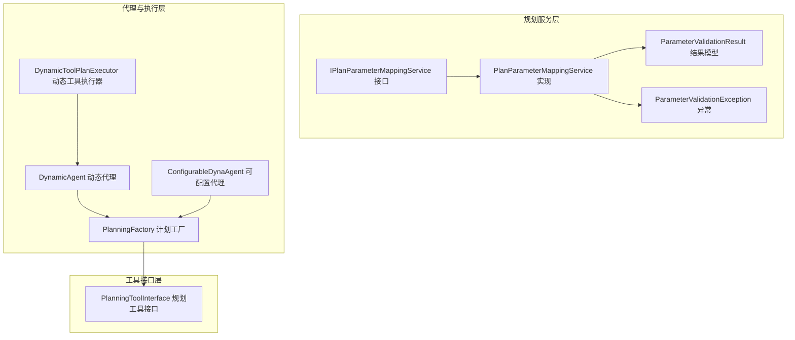
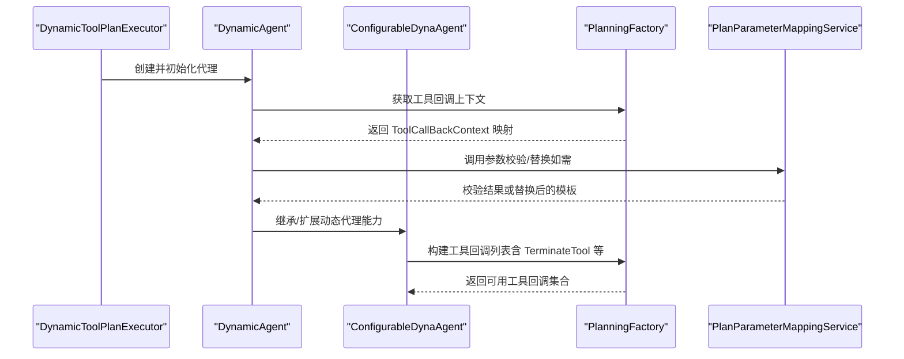
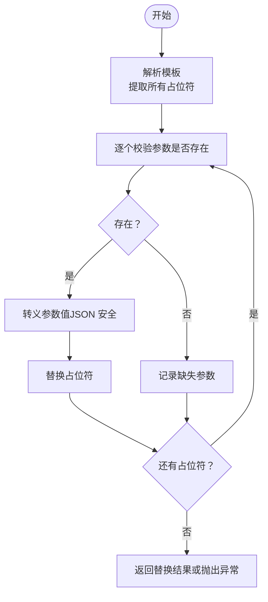
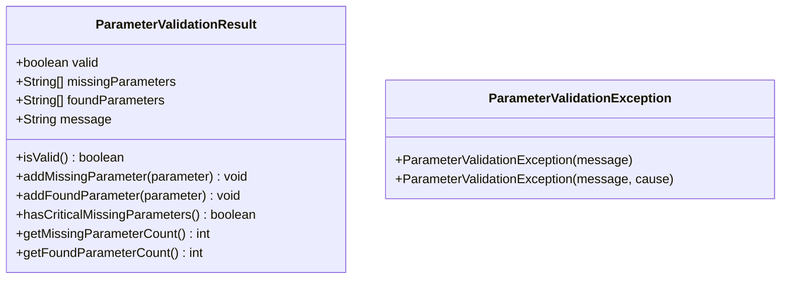
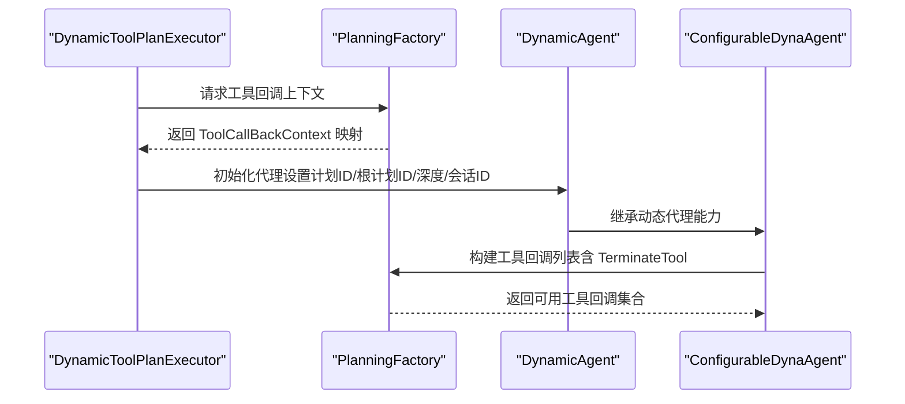
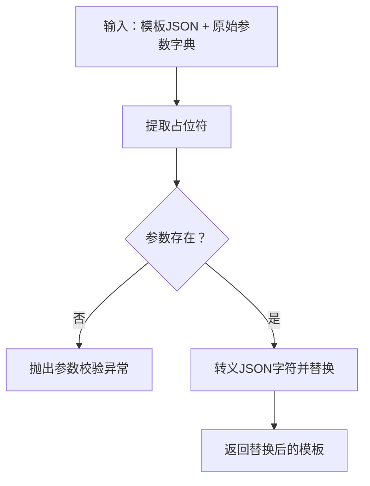
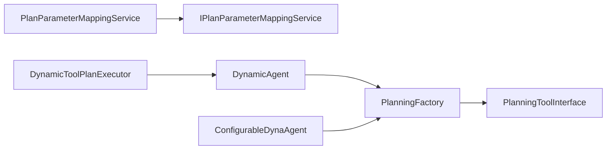

# 参数映射机制

<cite>
**本文档引用的文件**
- [IPlanParameterMappingService.java](file://src/main/java/com/alibaba/cloud/ai/lynxe/planning/service/IPlanParameterMappingService.java)
- [PlanParameterMappingService.java](file://src/main/java/com/alibaba/cloud/ai/lynxe/planning/service/PlanParameterMappingService.java)
- [ParameterValidationResult.java](file://src/main/java/com/alibaba/cloud/ai/lynxe/planning/model/vo/ParameterValidationResult.java)
- [ParameterValidationException.java](file://src/main/java/com/alibaba/cloud/ai/lynxe/planning/exception/ParameterValidationException.java)
- [DynamicAgent.java](file://src/main/java/com/alibaba/cloud/ai/lynxe/agent/DynamicAgent.java)
- [ConfigurableDynaAgent.java](file://src/main/java/com/alibaba/cloud/ai/lynxe/agent/ConfigurableDynaAgent.java)
- [PlanningFactory.java](file://src/main/java/com/alibaba/cloud/ai/lynxe/planning/PlanningFactory.java)
- [DynamicToolPlanExecutor.java](file://src/main/java/com/alibaba/cloud/ai/lynxe/runtime/executor/DynamicToolPlanExecutor.java)
- [PlanningToolInterface.java](file://src/main/java/com/alibaba/cloud/ai/lynxe/tool/PlanningToolInterface.java)
</cite>

## 目录
1. [引言](#引言)
2. [项目结构](#项目结构)
3. [核心组件](#核心组件)
4. [架构总览](#架构总览)
5. [详细组件分析](#详细组件分析)
6. [依赖关系分析](#依赖关系分析)
7. [性能考量](#性能考量)
8. [故障排查指南](#故障排查指南)
9. [结论](#结论)
10. [附录](#附录)

## 引言
本文件系统性阐述 Lynxe 的参数映射机制，聚焦于计划模板中占位符参数的提取、校验、替换与验证流程，解释动态参数绑定、变量替换与表达式求值的实现方式，并给出参数传递方式、作用域管理与生命周期控制的最佳实践。同时，结合计划执行与工具调用的集成关系，提供性能优化、缓存策略与并发安全建议。

## 项目结构
参数映射能力主要由规划服务层的接口与实现类提供，配合代理（Agent）与执行器在运行时完成参数注入与工具回调上下文构建。关键模块包括：
- 规划服务：参数映射接口与实现、参数校验结果模型、参数校验异常
- 代理与执行：动态代理、可配置动态代理、计划工厂、动态工具执行器
- 工具接口：规划工具通用接口，定义当前计划与函数工具回调

**图表来源**
- [IPlanParameterMappingService.java:29-86](file://src/main/java/com/alibaba/cloud/ai/lynxe/planning/service/IPlanParameterMappingService.java#L29-L86)
- [PlanParameterMappingService.java:37-334](file://src/main/java/com/alibaba/cloud/ai/lynxe/planning/service/PlanParameterMappingService.java#L37-L334)
- [ParameterValidationResult.java:24-147](file://src/main/java/com/alibaba/cloud/ai/lynxe/planning/model/vo/ParameterValidationResult.java#L24-L147)
- [ParameterValidationException.java:23-43](file://src/main/java/com/alibaba/cloud/ai/lynxe/planning/exception/ParameterValidationException.java#L23-L43)
- [DynamicAgent.java:83-201](file://src/main/java/com/alibaba/cloud/ai/lynxe/agent/DynamicAgent.java#L83-L201)
- [ConfigurableDynaAgent.java:51-89](file://src/main/java/com/alibaba/cloud/ai/lynxe/agent/ConfigurableDynaAgent.java#L51-L89)
- [PlanningFactory.java:113-200](file://src/main/java/com/alibaba/cloud/ai/lynxe/planning/PlanningFactory.java#L113-L200)
- [DynamicToolPlanExecutor.java:56-115](file://src/main/java/com/alibaba/cloud/ai/lynxe/runtime/executor/DynamicToolPlanExecutor.java#L56-L115)
- [PlanningToolInterface.java:26-53](file://src/main/java/com/alibaba/cloud/ai/lynxe/tool/PlanningToolInterface.java#L26-L53)

**章节来源**
- [IPlanParameterMappingService.java:29-86](file://src/main/java/com/alibaba/cloud/ai/lynxe/planning/service/IPlanParameterMappingService.java#L29-L86)
- [PlanParameterMappingService.java:37-334](file://src/main/java/com/alibaba/cloud/ai/lynxe/planning/service/PlanParameterMappingService.java#L37-L334)
- [DynamicAgent.java:83-201](file://src/main/java/com/alibaba/cloud/ai/lynxe/agent/DynamicAgent.java#L83-L201)
- [ConfigurableDynaAgent.java:51-89](file://src/main/java/com/alibaba/cloud/ai/lynxe/agent/ConfigurableDynaAgent.java#L51-L89)
- [PlanningFactory.java:113-200](file://src/main/java/com/alibaba/cloud/ai/lynxe/planning/PlanningFactory.java#L113-L200)
- [DynamicToolPlanExecutor.java:56-115](file://src/main/java/com/alibaba/cloud/ai/lynxe/runtime/executor/DynamicToolPlanExecutor.java#L56-L115)
- [PlanningToolInterface.java:26-53](file://src/main/java/com/alibaba/cloud/ai/lynxe/tool/PlanningToolInterface.java#L26-L53)

## 核心组件
- 参数映射接口与实现：提供占位符提取、参数校验、安全替换、前置校验、参数需求说明等能力
- 参数校验结果模型：封装校验状态、缺失/已发现参数列表与消息
- 参数校验异常：统一的参数校验失败异常类型
- 代理与执行：在执行阶段通过工厂与代理构建工具回调上下文，完成参数到工具调用的绑定
- 工具接口：定义规划工具的当前计划、执行回调等契约

**章节来源**
- [IPlanParameterMappingService.java:29-86](file://src/main/java/com/alibaba/cloud/ai/lynxe/planning/service/IPlanParameterMappingService.java#L29-L86)
- [PlanParameterMappingService.java:37-334](file://src/main/java/com/alibaba/cloud/ai/lynxe/planning/service/PlanParameterMappingService.java#L37-L334)
- [ParameterValidationResult.java:24-147](file://src/main/java/com/alibaba/cloud/ai/lynxe/planning/model/vo/ParameterValidationResult.java#L24-L147)
- [ParameterValidationException.java:23-43](file://src/main/java/com/alibaba/cloud/ai/lynxe/planning/exception/ParameterValidationException.java#L23-L43)
- [PlanningToolInterface.java:26-53](file://src/main/java/com/alibaba/cloud/ai/lynxe/tool/PlanningToolInterface.java#L26-L53)

## 架构总览
参数映射贯穿“计划模板解析 → 参数校验 → 安全替换 → 工具回调上下文构建 → 执行”的完整链路。下图展示从执行器到代理再到工厂的关键交互：

**图表来源**
- [DynamicToolPlanExecutor.java:128-199](file://src/main/java/com/alibaba/cloud/ai/lynxe/runtime/executor/DynamicToolPlanExecutor.java#L128-L199)
- [DynamicAgent.java:617-777](file://src/main/java/com/alibaba/cloud/ai/lynxe/agent/DynamicAgent.java#L617-L777)
- [ConfigurableDynaAgent.java:97-200](file://src/main/java/com/alibaba/cloud/ai/lynxe/agent/ConfigurableDynaAgent.java#L97-L200)
- [PlanningFactory.java:113-200](file://src/main/java/com/alibaba/cloud/ai/lynxe/planning/PlanningFactory.java#L113-L200)
- [PlanParameterMappingService.java:51-101](file://src/main/java/com/alibaba/cloud/ai/lynxe/planning/service/PlanParameterMappingService.java#L51-L101)

## 详细组件分析

### 参数映射服务接口与实现
- 占位符格式：使用双尖括号包裹的参数名，支持所有 Unicode 字符
- 核心方法：
  - 提取占位符：返回模板中所有 <<param>> 的参数名列表
  - 校验参数：遍历模板中的占位符，检查是否在原始参数字典中存在
  - 安全替换：对匹配到的参数进行 JSON 转义后替换，缺失则抛出异常
  - 前置校验：在替换前显式校验，确保替换过程的安全性
  - 安全替换封装：先校验再替换，避免异常传播
  - 参数需求说明：生成人类可读的参数清单与命名规范提示
- 参数名合法性：仅允许字母、数字、下划线，且不能以数字开头
- 错误信息：构建详细的缺失参数列表、已发现参数列表与解决方案说明

**图表来源**
- [PlanParameterMappingService.java:51-101](file://src/main/java/com/alibaba/cloud/ai/lynxe/planning/service/PlanParameterMappingService.java#L51-L101)
- [PlanParameterMappingService.java:188-246](file://src/main/java/com/alibaba/cloud/ai/lynxe/planning/service/PlanParameterMappingService.java#L188-L246)

**章节来源**
- [IPlanParameterMappingService.java:39-84](file://src/main/java/com/alibaba/cloud/ai/lynxe/planning/service/IPlanParameterMappingService.java#L39-L84)
- [PlanParameterMappingService.java:41-49](file://src/main/java/com/alibaba/cloud/ai/lynxe/planning/service/PlanParameterMappingService.java#L41-L49)
- [PlanParameterMappingService.java:51-101](file://src/main/java/com/alibaba/cloud/ai/lynxe/planning/service/PlanParameterMappingService.java#L51-L101)
- [PlanParameterMappingService.java:188-246](file://src/main/java/com/alibaba/cloud/ai/lynxe/planning/service/PlanParameterMappingService.java#L188-L246)
- [PlanParameterMappingService.java:248-300](file://src/main/java/com/alibaba/cloud/ai/lynxe/planning/service/PlanParameterMappingService.java#L248-L300)

### 参数校验结果与异常
- 参数校验结果模型：包含校验状态、缺失参数列表、已发现参数列表与消息
- 参数校验异常：统一的运行时异常类型，便于上层捕获与处理

**图表来源**
- [ParameterValidationResult.java:24-147](file://src/main/java/com/alibaba/cloud/ai/lynxe/planning/model/vo/ParameterValidationResult.java#L24-L147)
- [ParameterValidationException.java:23-43](file://src/main/java/com/alibaba/cloud/ai/lynxe/planning/exception/ParameterValidationException.java#L23-L43)

**章节来源**
- [ParameterValidationResult.java:24-147](file://src/main/java/com/alibaba/cloud/ai/lynxe/planning/model/vo/ParameterValidationResult.java#L24-L147)
- [ParameterValidationException.java:23-43](file://src/main/java/com/alibaba/cloud/ai/lynxe/planning/exception/ParameterValidationException.java#L23-L43)

### 代理与执行器中的参数绑定
- 动态代理与可配置动态代理：在执行阶段通过工厂构建工具回调上下文，代理负责工具选择与执行
- 计划工厂：提供工具回调映射，支持 TerminateTool 等终止工具的自动注入
- 动态工具执行器：根据步骤要求创建合适的代理实例，设置计划 ID、根计划 ID、深度、会话 ID 等上下文

**图表来源**
- [DynamicToolPlanExecutor.java:128-199](file://src/main/java/com/alibaba/cloud/ai/lynxe/runtime/executor/DynamicToolPlanExecutor.java#L128-L199)
- [PlanningFactory.java:113-200](file://src/main/java/com/alibaba/cloud/ai/lynxe/planning/PlanningFactory.java#L113-L200)
- [DynamicAgent.java:617-777](file://src/main/java/com/alibaba/cloud/ai/lynxe/agent/DynamicAgent.java#L617-L777)
- [ConfigurableDynaAgent.java:97-200](file://src/main/java/com/alibaba/cloud/ai/lynxe/agent/ConfigurableDynaAgent.java#L97-L200)

**章节来源**
- [DynamicAgent.java:83-201](file://src/main/java/com/alibaba/cloud/ai/lynxe/agent/DynamicAgent.java#L83-L201)
- [ConfigurableDynaAgent.java:51-89](file://src/main/java/com/alibaba/cloud/ai/lynxe/agent/ConfigurableDynaAgent.java#L51-L89)
- [PlanningFactory.java:113-200](file://src/main/java/com/alibaba/cloud/ai/lynxe/planning/PlanningFactory.java#L113-L200)
- [DynamicToolPlanExecutor.java:128-199](file://src/main/java/com/alibaba/cloud/ai/lynxe/runtime/executor/DynamicToolPlanExecutor.java#L128-L199)

### 参数提取、类型转换与值验证流程
- 提取：正则匹配模板中的 <<param>>，返回参数名列表
- 类型转换：将原始参数值转换为字符串后进行 JSON 转义，确保替换后的内容在 JSON 中合法
- 值验证：若参数缺失，立即抛出参数校验异常；若全部存在，则进行安全替换
- 前置校验：在替换前显式校验，保证替换阶段不会出现缺失参数

**图表来源**
- [PlanParameterMappingService.java:134-149](file://src/main/java/com/alibaba/cloud/ai/lynxe/planning/service/PlanParameterMappingService.java#L134-L149)
- [PlanParameterMappingService.java:188-246](file://src/main/java/com/alibaba/cloud/ai/lynxe/planning/service/PlanParameterMappingService.java#L188-L246)

**章节来源**
- [PlanParameterMappingService.java:134-149](file://src/main/java/com/alibaba/cloud/ai/lynxe/planning/service/PlanParameterMappingService.java#L134-L149)
- [PlanParameterMappingService.java:174-186](file://src/main/java/com/alibaba/cloud/ai/lynxe/planning/service/PlanParameterMappingService.java#L174-L186)
- [PlanParameterMappingService.java:188-246](file://src/main/java/com/alibaba/cloud/ai/lynxe/planning/service/PlanParameterMappingService.java#L188-L246)

### 动态参数绑定、变量替换与表达式求值
- 绑定：通过工具回调上下文将参数与工具调用关联，代理在执行阶段按需注入
- 替换：在模板层面进行占位符替换，确保后续工具调用接收到已注入的参数
- 表达式求值：当前实现不包含模板内的表达式求值，仅支持静态参数替换

**章节来源**
- [PlanningFactory.java:113-200](file://src/main/java/com/alibaba/cloud/ai/lynxe/planning/PlanningFactory.java#L113-L200)
- [DynamicAgent.java:617-777](file://src/main/java/com/alibaba/cloud/ai/lynxe/agent/DynamicAgent.java#L617-L777)
- [ConfigurableDynaAgent.java:97-200](file://src/main/java/com/alibaba/cloud/ai/lynxe/agent/ConfigurableDynaAgent.java#L97-L200)

### 参数验证规则、约束检查与错误处理策略
- 验证规则：参数名必须符合命名规范；模板中所有占位符都必须在原始参数中提供
- 约束检查：空参数字典、空模板、缺失参数均触发校验失败
- 错误处理：构建详细错误信息，包含缺失参数、已发现参数与解决方案，并在必要时抛出异常

**章节来源**
- [PlanParameterMappingService.java:248-267](file://src/main/java/com/alibaba/cloud/ai/lynxe/planning/service/PlanParameterMappingService.java#L248-L267)
- [PlanParameterMappingService.java:302-332](file://src/main/java/com/alibaba/cloud/ai/lynxe/planning/service/PlanParameterMappingService.java#L302-L332)

### 参数传递方式、作用域管理与生命周期控制
- 传递方式：通过代理初始化时的设置项与执行器的上下文传递，确保每个步骤拥有独立的计划 ID、根计划 ID、深度与会话 ID
- 作用域管理：代理持有当前步骤的环境数据，工具回调上下文限定在单次执行范围内
- 生命周期控制：代理在清理阶段释放工具回调上下文资源，避免内存泄漏

**章节来源**
- [DynamicToolPlanExecutor.java:128-199](file://src/main/java/com/alibaba/cloud/ai/lynxe/runtime/executor/DynamicToolPlanExecutor.java#L128-L199)
- [DynamicAgent.java:151-168](file://src/main/java/com/alibaba/cloud/ai/lynxe/agent/DynamicAgent.java#L151-L168)

## 依赖关系分析
参数映射服务与代理/执行器之间的耦合度低，通过接口与工厂解耦，便于扩展与测试。

**图表来源**
- [IPlanParameterMappingService.java:29-86](file://src/main/java/com/alibaba/cloud/ai/lynxe/planning/service/IPlanParameterMappingService.java#L29-L86)
- [PlanParameterMappingService.java:37-334](file://src/main/java/com/alibaba/cloud/ai/lynxe/planning/service/PlanParameterMappingService.java#L37-L334)
- [DynamicAgent.java:83-201](file://src/main/java/com/alibaba/cloud/ai/lynxe/agent/DynamicAgent.java#L83-L201)
- [ConfigurableDynaAgent.java:51-89](file://src/main/java/com/alibaba/cloud/ai/lynxe/agent/ConfigurableDynaAgent.java#L51-L89)
- [PlanningFactory.java:113-200](file://src/main/java/com/alibaba/cloud/ai/lynxe/planning/PlanningFactory.java#L113-L200)
- [DynamicToolPlanExecutor.java:56-115](file://src/main/java/com/alibaba/cloud/ai/lynxe/runtime/executor/DynamicToolPlanExecutor.java#L56-L115)
- [PlanningToolInterface.java:26-53](file://src/main/java/com/alibaba/cloud/ai/lynxe/tool/PlanningToolInterface.java#L26-L53)

**章节来源**
- [IPlanParameterMappingService.java:29-86](file://src/main/java/com/alibaba/cloud/ai/lynxe/planning/service/IPlanParameterMappingService.java#L29-L86)
- [PlanParameterMappingService.java:37-334](file://src/main/java/com/alibaba/cloud/ai/lynxe/planning/service/PlanParameterMappingService.java#L37-L334)
- [DynamicAgent.java:83-201](file://src/main/java/com/alibaba/cloud/ai/lynxe/agent/DynamicAgent.java#L83-L201)
- [ConfigurableDynaAgent.java:51-89](file://src/main/java/com/alibaba/cloud/ai/lynxe/agent/ConfigurableDynaAgent.java#L51-L89)
- [PlanningFactory.java:113-200](file://src/main/java/com/alibaba/cloud/ai/lynxe/planning/PlanningFactory.java#L113-L200)
- [DynamicToolPlanExecutor.java:56-115](file://src/main/java/com/alibaba/cloud/ai/lynxe/runtime/executor/DynamicToolPlanExecutor.java#L56-L115)
- [PlanningToolInterface.java:26-53](file://src/main/java/com/alibaba/cloud/ai/lynxe/tool/PlanningToolInterface.java#L26-L53)

## 性能考量
- 正则匹配：占位符提取与替换使用单次扫描，时间复杂度近似 O(n)，其中 n 为模板长度
- JSON 转义：对每个匹配参数进行转义，避免重复转义开销；建议在高并发场景下复用转义结果
- 缓存策略：可缓存模板中已提取的占位符列表与参数校验结果，减少重复计算
- 并发安全：参数映射服务为无状态实现，天然线程安全；在多线程环境下可直接共享实例
- I/O 优化：替换完成后尽量避免不必要的字符串拼接，优先使用可变缓冲区

[本节为通用性能指导，无需特定文件引用]

## 故障排查指南
- 参数缺失：查看参数校验异常中的缺失参数列表与模板内容，确认参数名拼写与大小写
- 命名不合法：检查参数名是否包含非法字符或以数字开头
- JSON 注入问题：确认参数值经过 JSON 转义，避免替换后导致 JSON 解析错误
- 工具回调缺失：检查代理的工具回调上下文构建逻辑，确保 TerminateTool 等终止工具被正确注入

**章节来源**
- [ParameterValidationException.java:23-43](file://src/main/java/com/alibaba/cloud/ai/lynxe/planning/exception/ParameterValidationException.java#L23-L43)
- [PlanParameterMappingService.java:302-332](file://src/main/java/com/alibaba/cloud/ai/lynxe/planning/service/PlanParameterMappingService.java#L302-L332)
- [ConfigurableDynaAgent.java:139-165](file://src/main/java/com/alibaba/cloud/ai/lynxe/agent/ConfigurableDynaAgent.java#L139-L165)

## 结论
Lynxe 的参数映射机制以简洁稳定的接口设计为核心，通过严格的参数校验与 JSON 安全替换，确保计划模板在执行前具备完整的参数注入。配合代理与工厂的解耦设计，参数映射与工具调用紧密衔接，既满足了灵活性又保证了安全性。建议在生产环境中启用前置校验与参数需求说明功能，并结合缓存与并发安全策略提升整体性能与稳定性。

## 附录
- 参数命名规范：仅允许字母、数字、下划线，且不能以数字开头
- 模板占位符格式：使用双尖括号包裹参数名，如 <<param>>
- 工具回调上下文：由工厂统一构建，代理在执行阶段按需注入

[本节为概念性总结，无需特定文件引用]