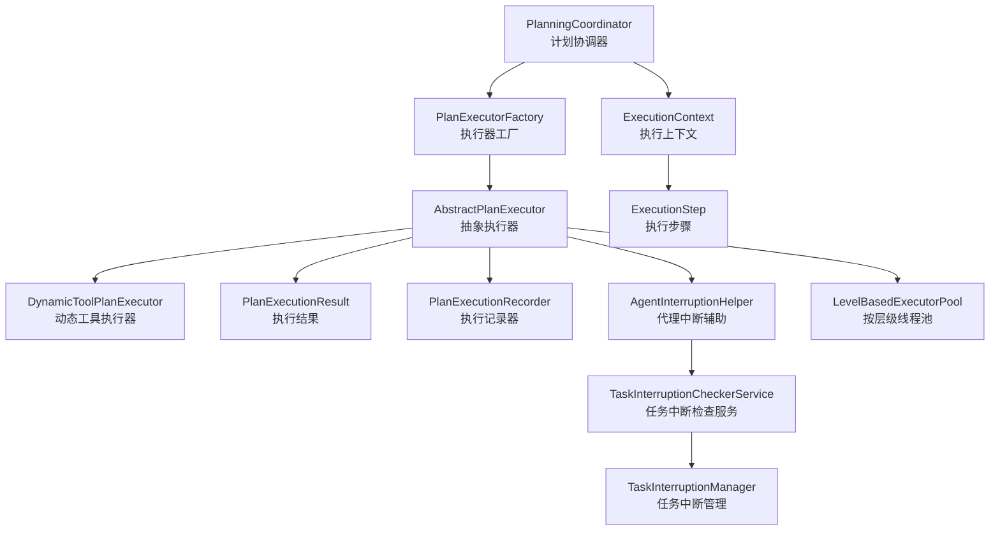
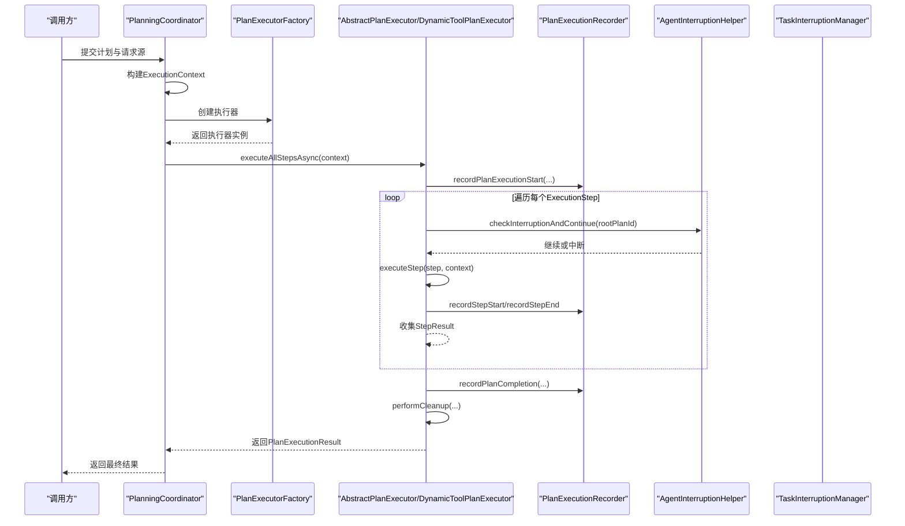
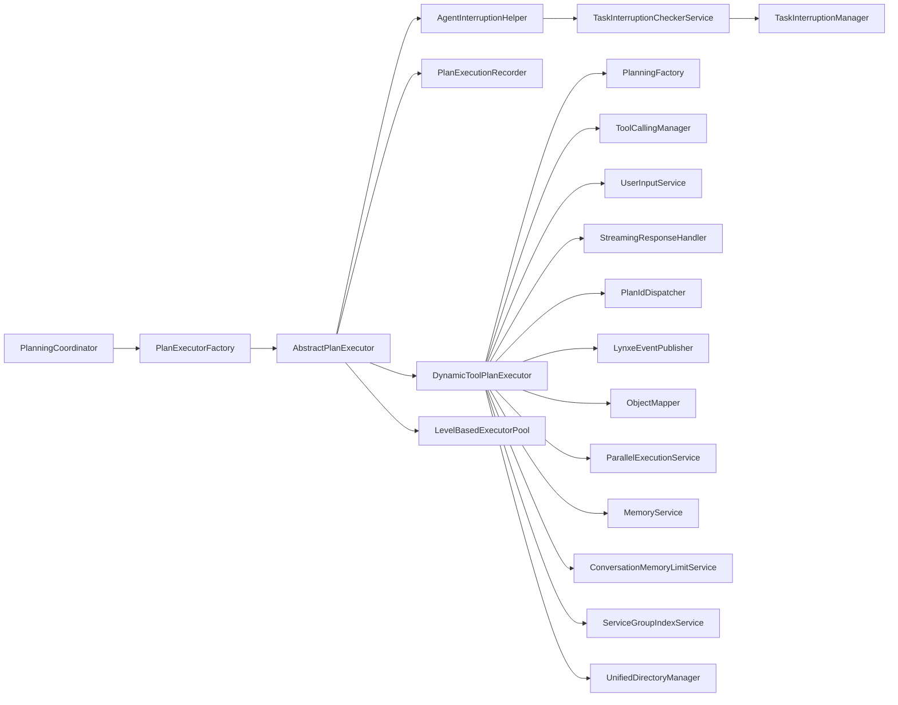

# 执行流程控制

<cite>
**本文引用的文件**   
- [AbstractPlanExecutor.java](file://src/main/java/com/alibaba/cloud/ai/lynxe/runtime/executor/AbstractPlanExecutor.java)
- [DynamicToolPlanExecutor.java](file://src/main/java/com/alibaba/cloud/ai/lynxe/runtime/executor/DynamicToolPlanExecutor.java)
- [PlanningCoordinator.java](file://src/main/java/com/alibaba/cloud/ai/lynxe/runtime/service/PlanningCoordinator.java)
- [ExecutionContext.java](file://src/main/java/com/alibaba/cloud/ai/lynxe/runtime/entity/vo/ExecutionContext.java)
- [ExecutionStep.java](file://src/main/java/com/alibaba/cloud/ai/lynxe/runtime/entity/vo/ExecutionStep.java)
- [PlanExecutionResult.java](file://src/main/java/com/alibaba/cloud/ai/lynxe/runtime/entity/vo/PlanExecutionResult.java)
- [PlanExecutorFactory.java](file://src/main/java/com/alibaba/cloud/ai/lynxe/runtime/executor/factory/PlanExecutorFactory.java)
- [LevelBasedExecutorPool.java](file://src/main/java/com/alibaba/cloud/ai/lynxe/runtime/executor/LevelBasedExecutorPool.java)
- [PlanExecutorInterface.java](file://src/main/java/com/alibaba/cloud/ai/lynxe/runtime/executor/PlanExecutorInterface.java)
- [PlanExecutionRecorder.java](file://src/main/java/com/alibaba/cloud/ai/lynxe/recorder/service/PlanExecutionRecorder.java)
- [AgentInterruptionHelper.java](file://src/main/java/com/alibaba/cloud/ai/lynxe/runtime/service/AgentInterruptionHelper.java)
- [TaskInterruptionCheckerService.java](file://src/main/java/com/alibaba/cloud/ai/lynxe/runtime/service/TaskInterruptionCheckerService.java)
- [TaskInterruptionManager.java](file://src/main/java/com/alibaba/cloud/ai/lynxe/runtime/service/TaskInterruptionManager.java)
</cite>

## 目录
1. [引言](#引言)
2. [项目结构](#项目结构)
3. [核心组件](#核心组件)
4. [架构总览](#架构总览)
5. [详细组件分析](#详细组件分析)
6. [依赖关系分析](#依赖关系分析)
7. [性能考量](#性能考量)
8. [故障排查指南](#故障排查指南)
9. [结论](#结论)
10. [附录](#附录)

## 引言
本技术文档围绕 Lynxe 的“执行流程控制系统”展开，系统性梳理从计划（Plan）到步骤（Step）的完整生命周期与控制流程，重点覆盖以下方面：
- 计划执行的启动、上下文创建与传递、状态与结果管理
- 步骤级执行的调度、中断与异常处理、资源清理
- 分支控制、循环与条件判断在执行中的体现
- 超时与中断的协同机制、文件上传同步与符号链接管理
- 性能监控、日志记录与调试支持
- 执行流程与工具调用、代理执行的协调与最佳实践

## 项目结构
执行流程控制相关代码主要位于 runtime 模块，围绕“计划协调器（PlanningCoordinator）—执行器工厂（PlanExecutorFactory）—抽象执行器（AbstractPlanExecutor）—具体执行器（DynamicToolPlanExecutor）—执行上下文（ExecutionContext）—步骤（ExecutionStep）—结果（PlanExecutionResult）—记录器（PlanExecutionRecorder）—中断检查（AgentInterruptionHelper/TaskInterruptionCheckerService/TaskInterruptionManager）—线程池（LevelBasedExecutorPool）”等组件协作。

图表来源
- [PlanningCoordinator.java:76-179](file://src/main/java/com/alibaba/cloud/ai/lynxe/runtime/service/PlanningCoordinator.java#L76-L179)
- [PlanExecutorFactory.java:164-183](file://src/main/java/com/alibaba/cloud/ai/lynxe/runtime/executor/factory/PlanExecutorFactory.java#L164-L183)
- [AbstractPlanExecutor.java:285-434](file://src/main/java/com/alibaba/cloud/ai/lynxe/runtime/executor/AbstractPlanExecutor.java#L285-L434)
- [DynamicToolPlanExecutor.java:128-158](file://src/main/java/com/alibaba/cloud/ai/lynxe/runtime/executor/DynamicToolPlanExecutor.java#L128-L158)
- [ExecutionContext.java:34-251](file://src/main/java/com/alibaba/cloud/ai/lynxe/runtime/entity/vo/ExecutionContext.java#L34-L251)
- [ExecutionStep.java:28-179](file://src/main/java/com/alibaba/cloud/ai/lynxe/runtime/entity/vo/ExecutionStep.java#L28-L179)
- [PlanExecutionResult.java:24-72](file://src/main/java/com/alibaba/cloud/ai/lynxe/runtime/entity/vo/PlanExecutionResult.java#L24-L72)
- [PlanExecutionRecorder.java:26-108](file://src/main/java/com/alibaba/cloud/ai/lynxe/recorder/service/PlanExecutionRecorder.java#L26-L108)
- [AgentInterruptionHelper.java:31-84](file://src/main/java/com/alibaba/cloud/ai/lynxe/runtime/service/AgentInterruptionHelper.java#L31-L84)
- [TaskInterruptionCheckerService.java:32-97](file://src/main/java/com/alibaba/cloud/ai/lynxe/runtime/service/TaskInterruptionCheckerService.java#L32-L97)
- [TaskInterruptionManager.java:37-120](file://src/main/java/com/alibaba/cloud/ai/lynxe/runtime/service/TaskInterruptionManager.java#L37-L120)
- [LevelBasedExecutorPool.java:49-103](file://src/main/java/com/alibaba/cloud/ai/lynxe/runtime/executor/LevelBasedExecutorPool.java#L49-L103)

章节来源
- [PlanningCoordinator.java:76-179](file://src/main/java/com/alibaba/cloud/ai/lynxe/runtime/service/PlanningCoordinator.java#L76-L179)
- [PlanExecutorFactory.java:164-183](file://src/main/java/com/alibaba/cloud/ai/lynxe/runtime/executor/factory/PlanExecutorFactory.java#L164-L183)
- [AbstractPlanExecutor.java:285-434](file://src/main/java/com/alibaba/cloud/ai/lynxe/runtime/executor/AbstractPlanExecutor.java#L285-L434)
- [DynamicToolPlanExecutor.java:128-158](file://src/main/java/com/alibaba/cloud/ai/lynxe/runtime/executor/DynamicToolPlanExecutor.java#L128-L158)
- [ExecutionContext.java:34-251](file://src/main/java/com/alibaba/cloud/ai/lynxe/runtime/entity/vo/ExecutionContext.java#L34-L251)
- [ExecutionStep.java:28-179](file://src/main/java/com/alibaba/cloud/ai/lynxe/runtime/entity/vo/ExecutionStep.java#L28-L179)
- [PlanExecutionResult.java:24-72](file://src/main/java/com/alibaba/cloud/ai/lynxe/runtime/entity/vo/PlanExecutionResult.java#L24-L72)
- [PlanExecutionRecorder.java:26-108](file://src/main/java/com/alibaba/cloud/ai/lynxe/recorder/service/PlanExecutionRecorder.java#L26-L108)
- [AgentInterruptionHelper.java:31-84](file://src/main/java/com/alibaba/cloud/ai/lynxe/runtime/service/AgentInterruptionHelper.java#L31-L84)
- [TaskInterruptionCheckerService.java:32-97](file://src/main/java/com/alibaba/cloud/ai/lynxe/runtime/service/TaskInterruptionCheckerService.java#L32-L97)
- [TaskInterruptionManager.java:37-120](file://src/main/java/com/alibaba/cloud/ai/lynxe/runtime/service/TaskInterruptionManager.java#L37-L120)
- [LevelBasedExecutorPool.java:49-103](file://src/main/java/com/alibaba/cloud/ai/lynxe/runtime/executor/LevelBasedExecutorPool.java#L49-L103)

## 核心组件
- 计划协调器（PlanningCoordinator）：负责创建执行上下文、选择执行器、触发执行、后处理与结果汇总。
- 执行器工厂（PlanExecutorFactory）：根据计划类型动态选择合适的执行器实现。
- 抽象执行器（AbstractPlanExecutor）：统一的执行框架，封装步骤调度、中断检查、异常处理、清理与记录。
- 动态工具执行器（DynamicToolPlanExecutor）：面向动态代理的执行器，负责将步骤需求解析为可配置代理实例，并注入工具回调上下文。
- 执行上下文（ExecutionContext）：贯穿执行全程的状态载体，包含计划信息、会话、上传键、摘要生成开关、深度等。
- 执行步骤（ExecutionStep）：单步执行的输入、状态、结果与代理引用。
- 执行结果（PlanExecutionResult）：聚合所有步骤结果与最终结果。
- 执行记录器（PlanExecutionRecorder）：记录计划与步骤的开始、结束、思考-行动过程与工具调用结果。
- 中断辅助与检查（AgentInterruptionHelper、TaskInterruptionCheckerService、TaskInterruptionManager）：提供跨机器的数据库驱动式中断信号检查与状态管理。
- 线程池（LevelBasedExecutorPool）：按计划层级分配独立线程池，支持动态调整大小与统计。

章节来源
- [PlanningCoordinator.java:76-179](file://src/main/java/com/alibaba/cloud/ai/lynxe/runtime/service/PlanningCoordinator.java#L76-L179)
- [PlanExecutorFactory.java:164-183](file://src/main/java/com/alibaba/cloud/ai/lynxe/runtime/executor/factory/PlanExecutorFactory.java#L164-L183)
- [AbstractPlanExecutor.java:285-434](file://src/main/java/com/alibaba/cloud/ai/lynxe/runtime/executor/AbstractPlanExecutor.java#L285-L434)
- [DynamicToolPlanExecutor.java:128-158](file://src/main/java/com/alibaba/cloud/ai/lynxe/runtime/executor/DynamicToolPlanExecutor.java#L128-L158)
- [ExecutionContext.java:34-251](file://src/main/java/com/alibaba/cloud/ai/lynxe/runtime/entity/vo/ExecutionContext.java#L34-L251)
- [ExecutionStep.java:28-179](file://src/main/java/com/alibaba/cloud/ai/lynxe/runtime/entity/vo/ExecutionStep.java#L28-L179)
- [PlanExecutionResult.java:24-72](file://src/main/java/com/alibaba/cloud/ai/lynxe/runtime/entity/vo/PlanExecutionResult.java#L24-L72)
- [PlanExecutionRecorder.java:26-108](file://src/main/java/com/alibaba/cloud/ai/lynxe/recorder/service/PlanExecutionRecorder.java#L26-L108)
- [AgentInterruptionHelper.java:31-84](file://src/main/java/com/alibaba/cloud/ai/lynxe/runtime/service/AgentInterruptionHelper.java#L31-L84)
- [TaskInterruptionCheckerService.java:32-97](file://src/main/java/com/alibaba/cloud/ai/lynxe/runtime/service/TaskInterruptionCheckerService.java#L32-L97)
- [TaskInterruptionManager.java:37-120](file://src/main/java/com/alibaba/cloud/ai/lynxe/runtime/service/TaskInterruptionManager.java#L37-L120)
- [LevelBasedExecutorPool.java:49-103](file://src/main/java/com/alibaba/cloud/ai/lynxe/runtime/executor/LevelBasedExecutorPool.java#L49-L103)

## 架构总览
下图展示从计划提交到执行完成的关键交互路径，包括上下文构建、执行器选择、步骤调度、记录与中断检查、以及清理与收尾。

图表来源
- [PlanningCoordinator.java:76-179](file://src/main/java/com/alibaba/cloud/ai/lynxe/runtime/service/PlanningCoordinator.java#L76-L179)
- [PlanExecutorFactory.java:164-183](file://src/main/java/com/alibaba/cloud/ai/lynxe/runtime/executor/factory/PlanExecutorFactory.java#L164-L183)
- [AbstractPlanExecutor.java:285-434](file://src/main/java/com/alibaba/cloud/ai/lynxe/runtime/executor/AbstractPlanExecutor.java#L285-L434)
- [PlanExecutionRecorder.java:26-108](file://src/main/java/com/alibaba/cloud/ai/lynxe/recorder/service/PlanExecutionRecorder.java#L26-L108)
- [AgentInterruptionHelper.java:44-53](file://src/main/java/com/alibaba/cloud/ai/lynxe/runtime/service/AgentInterruptionHelper.java#L44-L53)
- [TaskInterruptionManager.java:49-67](file://src/main/java/com/alibaba/cloud/ai/lynxe/runtime/service/TaskInterruptionManager.java#L49-L67)

## 详细组件分析

### 执行上下文（ExecutionContext）
- 角色与职责：作为执行期间的核心数据载体，贯穿计划、步骤、结果与记录的全链路；承载计划ID、根计划ID、父计划ID、工具调用ID、标题、是否需要摘要、成功标志、执行深度、会话ID、上传键等。
- 关键点：
  - 会话控制：根据请求来源与配置决定是否启用会话与生成会话ID。
  - 摘要生成：针对特定来源（如前端侧边栏/对话）自动设置摘要生成开关。
  - 上传同步：通过上传键与根计划ID在执行前同步上传文件至计划目录。
- 复杂度：读写操作 O(1)，整体为轻量对象，适合在多线程中传递。

章节来源
- [ExecutionContext.java:34-251](file://src/main/java/com/alibaba/cloud/ai/lynxe/runtime/entity/vo/ExecutionContext.java#L34-L251)
- [PlanningCoordinator.java:82-144](file://src/main/java/com/alibaba/cloud/ai/lynxe/runtime/service/PlanningCoordinator.java#L82-L144)

### 执行步骤（ExecutionStep）
- 角色与职责：描述单步执行的输入要求、代理名称、所选工具集合、模型名、结果、错误信息、状态、终止列等；提供字符串化输出便于日志与展示。
- 关键点：
  - 状态机：NOT_STARTED/COMPLETED/FAILED/INTERRUPTED 等状态由代理运行结果更新。
  - 唯一标识：每步拥有唯一 stepId，便于记录与追踪。
- 复杂度：字段访问 O(1)，字符串化 O(n)（n 为内容长度）。

章节来源
- [ExecutionStep.java:28-179](file://src/main/java/com/alibaba/cloud/ai/lynxe/runtime/entity/vo/ExecutionStep.java#L28-L179)

### 执行结果（PlanExecutionResult）
- 角色与职责：聚合所有步骤结果，保存最终结果与错误信息；提供添加步骤结果的接口。
- 关键点：
  - 结果收集：顺序追加步骤结果，便于后续汇总与后处理。
  - 成功标志：由执行器在完成后统一设置。
- 复杂度：添加步骤结果 O(1)，遍历 O(k)（k 为步骤数）。

章节来源
- [PlanExecutionResult.java:24-72](file://src/main/java/com/alibaba/cloud/ai/lynxe/runtime/entity/vo/PlanExecutionResult.java#L24-L72)

### 计划协调器（PlanningCoordinator）
- 角色与职责：接收计划与上下文参数，构建 ExecutionContext，选择执行器，异步执行计划，执行后处理并返回结果。
- 关键点：
  - 请求源感知：根据请求来源决定是否生成摘要与会话ID。
  - 执行器选择：通过工厂按计划类型创建执行器。
  - 后处理：使用 PlanFinalizer 对执行结果进行后处理。
- 复杂度：主要为异步调度与串行化开销，受线程池与步骤数量影响。

章节来源
- [PlanningCoordinator.java:76-179](file://src/main/java/com/alibaba/cloud/ai/lynxe/runtime/service/PlanningCoordinator.java#L76-L179)

### 执行器工厂（PlanExecutorFactory）
- 角色与职责：根据计划类型动态创建执行器实例，默认支持 dynamic_agent 类型。
- 关键点：
  - 类型校验：规范化并校验计划类型。
  - 实例化：注入 LLM、记录器、线程池、文件上传、事件发布、内存服务等依赖。
- 复杂度：常量时间，按计划类型分派。

章节来源
- [PlanExecutorFactory.java:164-183](file://src/main/java/com/alibaba/cloud/ai/lynxe/runtime/executor/factory/PlanExecutorFactory.java#L164-L183)

### 抽象执行器（AbstractPlanExecutor）
- 角色与职责：统一的执行框架，负责：
  - 初始化执行环境（符号链接、上传文件同步）
  - 步骤调度与执行（逐个调用代理执行器）
  - 中断检查与异常捕获
  - 记录开始/结束与清理
- 关键点：
  - 步骤执行：记录开始、调用代理、记录结束；根据状态更新上下文与结果。
  - 中断处理：在每步前检查中断，若被中断则停止后续步骤。
  - 异常处理：捕获并记录异常，设置失败标志与错误信息。
  - 清理：执行器完成后清理资源，根计划结束后移除符号链接。
- 复杂度：O(s) 步骤数，每步包含 IO（记录、文件同步）与 CPU（代理执行），受线程池与外部服务影响。

章节来源
- [AbstractPlanExecutor.java:285-434](file://src/main/java/com/alibaba/cloud/ai/lynxe/runtime/executor/AbstractPlanExecutor.java#L285-L434)

### 动态工具执行器（DynamicToolPlanExecutor）
- 角色与职责：面向动态代理的执行器，负责：
  - 解析步骤需求，提取步骤类型与索引
  - 构造可配置动态代理（ConfigurableDynaAgent），注入工具回调上下文
  - 设置最大步数、会话ID、计划深度等
- 关键点：
  - 工具键转换：将前端格式的工具键转换为后端查找格式。
  - 回调上下文：通过 PlanningFactory 注入工具回调映射。
- 复杂度：构造代理与注入上下文为 O(1)，实际执行取决于代理行为。

章节来源
- [DynamicToolPlanExecutor.java:128-199](file://src/main/java/com/alibaba/cloud/ai/lynxe/runtime/executor/DynamicToolPlanExecutor.java#L128-L199)

### 中断机制（AgentInterruptionHelper / TaskInterruptionCheckerService / TaskInterruptionManager）
- 角色与职责：提供跨机器的数据库驱动式中断能力：
  - 数据库状态：TaskInterruptionManager 维护任务期望状态（START/STOP/CANCEL/PAUSE/RESUME）与结束时间。
  - 检查服务：TaskInterruptionCheckerService 定期查询状态并抛出中断异常。
  - 辅助组件：AgentInterruptionHelper 在代理执行关键点进行检查并返回继续/中断。
- 关键点：
  - 可靠性：即使检查服务异常，也不会误中断（默认不中断）。
  - 生命周期：支持暂停、恢复、清理已完成任务。
- 复杂度：数据库查询为 O(1)，异常抛出与捕获为 O(1)。

章节来源
- [AgentInterruptionHelper.java:44-53](file://src/main/java/com/alibaba/cloud/ai/lynxe/runtime/service/AgentInterruptionHelper.java#L44-L53)
- [TaskInterruptionCheckerService.java:46-82](file://src/main/java/com/alibaba/cloud/ai/lynxe/runtime/service/TaskInterruptionCheckerService.java#L46-L82)
- [TaskInterruptionManager.java:49-120](file://src/main/java/com/alibaba/cloud/ai/lynxe/runtime/service/TaskInterruptionManager.java#L49-L120)

### 线程池（LevelBasedExecutorPool）
- 角色与职责：按计划层级分配独立线程池，支持动态调整大小与统计。
- 关键点：
  - 层级隔离：不同层级使用不同线程池，避免相互干扰。
  - 动态调整：根据配置定期检查并调整所有现有线程池大小。
  - 统计接口：提供各层级池的容量、活跃线程、队列长度、任务计数等。
- 复杂度：创建与调整为 O(1)/次，查询统计为 O(L)（L 为已创建层级数）。

章节来源
- [LevelBasedExecutorPool.java:77-103](file://src/main/java/com/alibaba/cloud/ai/lynxe/runtime/executor/LevelBasedExecutorPool.java#L77-L103)
- [LevelBasedExecutorPool.java:209-280](file://src/main/java/com/alibaba/cloud/ai/lynxe/runtime/executor/LevelBasedExecutorPool.java#L209-L280)
- [LevelBasedExecutorPool.java:148-171](file://src/main/java/com/alibaba/cloud/ai/lynxe/runtime/executor/LevelBasedExecutorPool.java#L148-L171)

### 执行记录器（PlanExecutionRecorder）
- 角色与职责：定义并实现计划与步骤的记录接口，包括：
  - 计划开始/结束
  - 步骤开始/结束
  - 思考-行动过程与工具调用结果
- 关键点：
  - 参数化：提供 ThinkActRecordParams 与 ActToolParam 封装，便于记录输入输出与工具调用详情。
  - 无暴露内部实体：仅暴露必要方法，隐藏持久层细节。
- 复杂度：记录为 IO 密集，受存储介质与事务影响。

章节来源
- [PlanExecutionRecorder.java:26-108](file://src/main/java/com/alibaba/cloud/ai/lynxe/recorder/service/PlanExecutionRecorder.java#L26-L108)

## 依赖关系分析
- 协调器依赖工厂与记录器；工厂依赖 LLM、记录器、线程池、文件上传、事件发布、内存服务等；抽象执行器依赖记录器、中断辅助、文件上传、目录管理与线程池；动态执行器依赖规划工厂、工具调用管理、用户输入、流式响应处理器、计划ID分发、事件发布、并行执行服务、内存服务、对话记忆限制、服务组索引与统一目录管理；中断相关组件形成闭环，贯穿执行器与执行器工厂。

图表来源
- [PlanningCoordinator.java:52-58](file://src/main/java/com/alibaba/cloud/ai/lynxe/runtime/service/PlanningCoordinator.java#L52-L58)
- [PlanExecutorFactory.java:93-121](file://src/main/java/com/alibaba/cloud/ai/lynxe/runtime/executor/factory/PlanExecutorFactory.java#L93-L121)
- [AbstractPlanExecutor.java:83-95](file://src/main/java/com/alibaba/cloud/ai/lynxe/runtime/executor/AbstractPlanExecutor.java#L83-L95)
- [DynamicToolPlanExecutor.java:92-115](file://src/main/java/com/alibaba/cloud/ai/lynxe/runtime/executor/DynamicToolPlanExecutor.java#L92-L115)

章节来源
- [PlanningCoordinator.java:52-58](file://src/main/java/com/alibaba/cloud/ai/lynxe/runtime/service/PlanningCoordinator.java#L52-L58)
- [PlanExecutorFactory.java:93-121](file://src/main/java/com/alibaba/cloud/ai/lynxe/runtime/executor/factory/PlanExecutorFactory.java#L93-L121)
- [AbstractPlanExecutor.java:83-95](file://src/main/java/com/alibaba/cloud/ai/lynxe/runtime/executor/AbstractPlanExecutor.java#L83-L95)
- [DynamicToolPlanExecutor.java:92-115](file://src/main/java/com/alibaba/cloud/ai/lynxe/runtime/executor/DynamicToolPlanExecutor.java#L92-L115)

## 性能考量
- 线程池分层：按计划层级隔离执行，避免深层子计划阻塞根计划；动态调整大小减少拥塞。
- 异步执行：使用 CompletableFuture 并结合线程池，提升吞吐与响应性。
- 记录与IO：记录器为IO密集操作，建议合理批量化与异步化；对频繁记录场景考虑缓冲与批量提交。
- 文件同步：上传文件同步在执行前进行，避免步骤中阻塞；失败时降级继续执行。
- 中断检查频率：在关键点检查中断，避免过于频繁导致额外开销。
- 日志级别：生产环境建议使用 INFO/WARN/ERROR，避免 DEBUG 过度输出。

## 故障排查指南
- 执行失败定位
  - 查看步骤状态与错误消息：步骤对象包含状态与错误信息，有助于快速定位失败步骤。
  - 检查记录器：确认 recordPlanExecutionStart/recordStepStart/recordStepEnd 是否正常落库。
- 中断问题
  - 确认 TaskInterruptionManager 的期望状态是否为 STOP/CANCEL/PAUSE；检查 AgentInterruptionHelper 的检查点是否被调用。
  - 若中断异常，确认 TaskInterruptionCheckerService 的数据库查询是否成功。
- 资源清理
  - 根计划结束后应移除符号链接；若失败，查看清理日志并重试。
- 线程池问题
  - 使用 getPoolStatistics 获取各层级池统计，观察队列积压与活跃线程数；必要时调整配置。

章节来源
- [AbstractPlanExecutor.java:117-181](file://src/main/java/com/alibaba/cloud/ai/lynxe/runtime/executor/AbstractPlanExecutor.java#L117-L181)
- [AbstractPlanExecutor.java:402-471](file://src/main/java/com/alibaba/cloud/ai/lynxe/runtime/executor/AbstractPlanExecutor.java#L402-L471)
- [TaskInterruptionCheckerService.java:46-82](file://src/main/java/com/alibaba/cloud/ai/lynxe/runtime/service/TaskInterruptionCheckerService.java#L46-L82)
- [TaskInterruptionManager.java:97-120](file://src/main/java/com/alibaba/cloud/ai/lynxe/runtime/service/TaskInterruptionManager.java#L97-L120)
- [LevelBasedExecutorPool.java:148-171](file://src/main/java/com/alibaba/cloud/ai/lynxe/runtime/executor/LevelBasedExecutorPool.java#L148-L171)

## 结论
Lynxe 的执行流程控制系统以“计划协调器 + 执行器工厂 + 抽象执行器 + 具体执行器”的分层设计为核心，配合执行上下文、步骤与结果的数据模型，实现了可扩展、可中断、可观测的执行生命周期管理。通过数据库驱动的中断机制与按层级的线程池隔离，系统在分布式与高并发场景下具备良好的稳定性与可控性。建议在生产环境中结合日志与记录器进行持续观测，并根据业务负载动态调整线程池配置与中断策略。

## 附录
- 最佳实践
  - 明确计划类型与执行深度，合理设置最大步数与线程池大小。
  - 在关键节点插入中断检查，确保及时响应外部指令。
  - 使用记录器完整记录思考-行动与工具调用，便于回溯与审计。
  - 对上传文件同步进行降级处理，保证主流程不受阻塞。
  - 对异常与中断进行统一处理，避免泄漏资源与状态不一致。