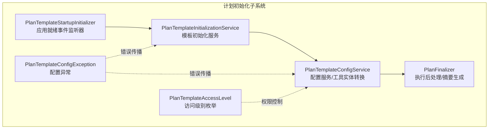
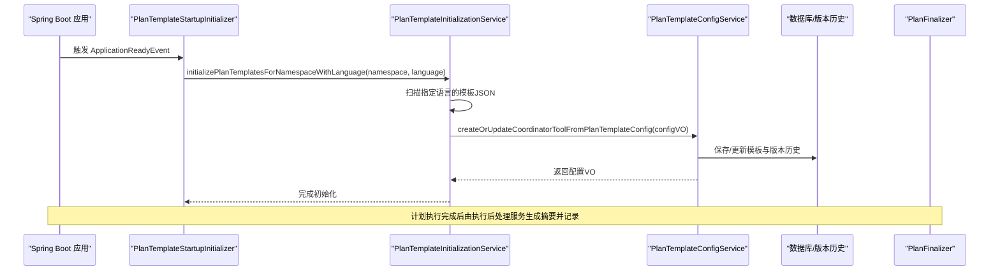
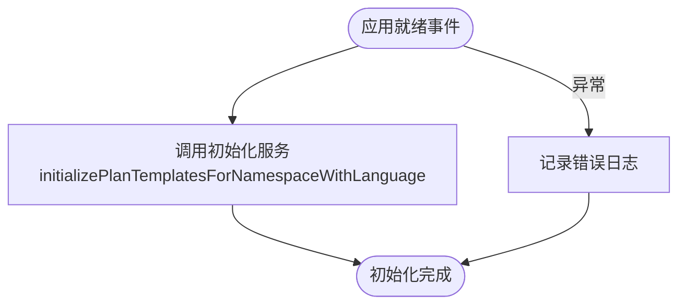
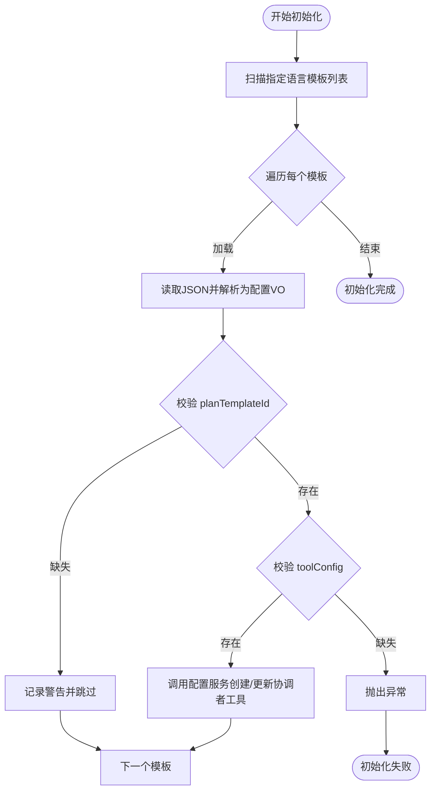
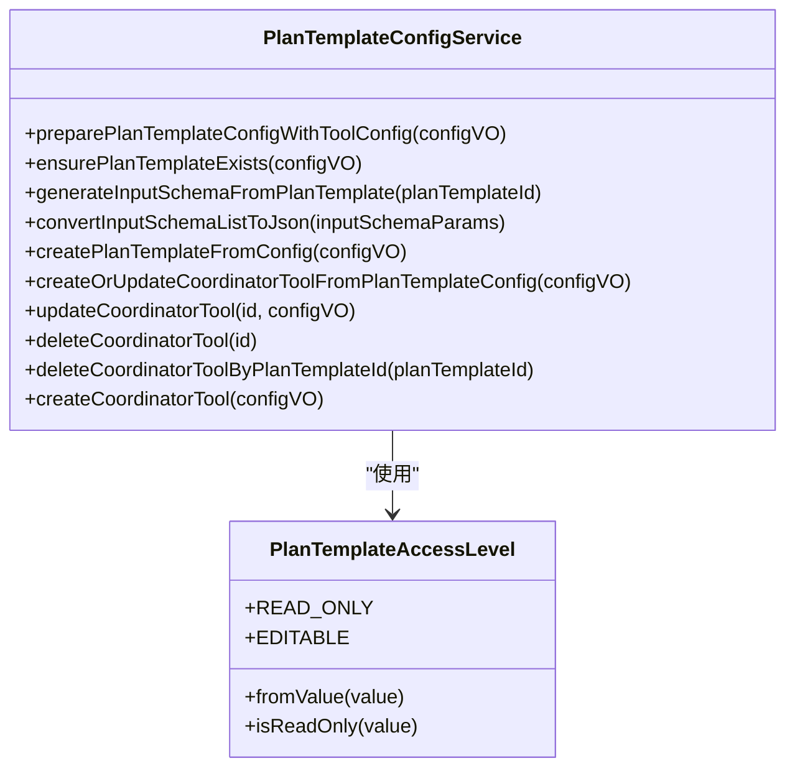
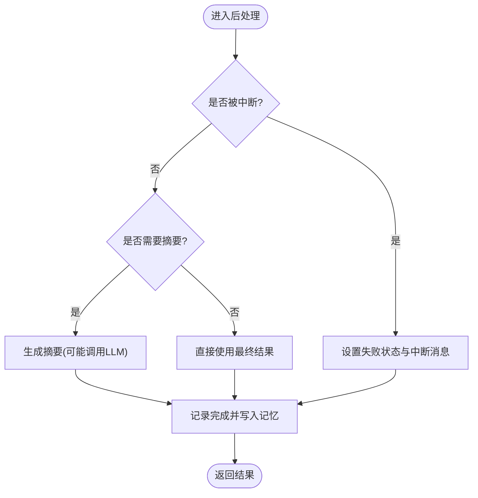
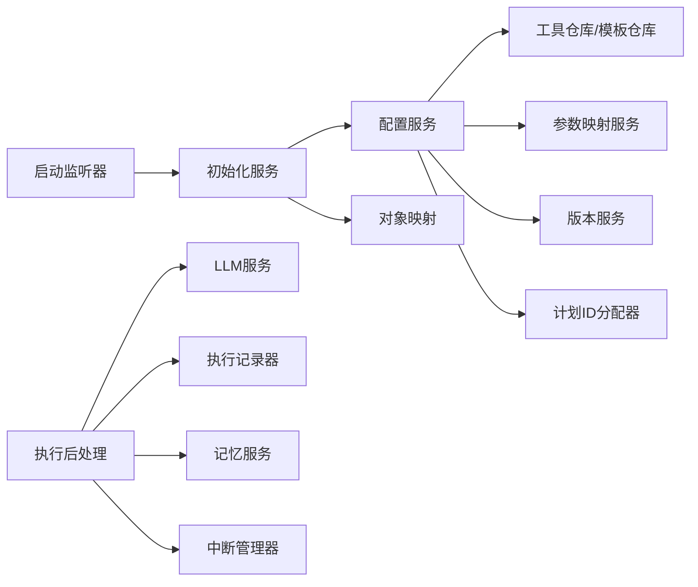

# 计划初始化

<cite>
**本文引用的文件**
- [PlanTemplateStartupInitializer.java](file://src/main/java/com/alibaba/cloud/ai/lynxe/planning/initializer/PlanTemplateStartupInitializer.java)
- [PlanTemplateInitializationService.java](file://src/main/java/com/alibaba/cloud/ai/lynxe/planning/service/PlanTemplateInitializationService.java)
- [PlanTemplateConfigService.java](file://src/main/java/com/alibaba/cloud/ai/lynxe/planning/service/PlanTemplateConfigService.java)
- [PlanFinalizer.java](file://src/main/java/com/alibaba/cloud/ai/lynxe/planning/service/PlanFinalizer.java)
- [PlanTemplateConfigException.java](file://src/main/java/com/alibaba/cloud/ai/lynxe/planning/exception/PlanTemplateConfigException.java)
- [PlanTemplateAccessLevel.java](file://src/main/java/com/alibaba/cloud/ai/lynxe/planning/model/enums/PlanTemplateAccessLevel.java)
- [application.yml](file://src/main/resources/application.yml)
</cite>

## 目录
1. [简介](#简介)
2. [项目结构](#项目结构)
3. [核心组件](#核心组件)
4. [架构总览](#架构总览)
5. [详细组件分析](#详细组件分析)
6. [依赖分析](#依赖分析)
7. [性能考虑](#性能考虑)
8. [故障排查指南](#故障排查指南)
9. [结论](#结论)
10. [附录](#附录)

## 简介
本技术文档围绕 Lynxe 计划初始化系统，系统性阐述启动流程、模板加载与验证、预处理机制、初始化服务的职责与协作、访问级别与权限控制、安全检查、失败处理与重试、降级策略、性能优化与并行处理、资源管理，以及与系统启动和配置加载的集成关系与最佳实践。目标是帮助开发者与运维人员快速理解并高效维护该初始化子系统。

## 项目结构
与“计划初始化”直接相关的核心模块位于后端 Java 包中，主要涉及：
- 初始化监听器：在应用就绪事件触发时执行初始化
- 初始化服务：扫描、加载、解析、校验与入库
- 配置服务：将配置转换为工具实体，生成输入参数 Schema，维护版本历史
- 结束处理服务：负责执行后的摘要生成、结果记录与会话记忆写入
- 异常与枚举：统一错误码与访问级别定义

图表来源
- [PlanTemplateStartupInitializer.java:48-61](file://src/main/java/com/alibaba/cloud/ai/lynxe/planning/initializer/PlanTemplateStartupInitializer.java#L48-L61)
- [PlanTemplateInitializationService.java:75-135](file://src/main/java/com/alibaba/cloud/ai/lynxe/planning/service/PlanTemplateInitializationService.java#L75-L135)
- [PlanTemplateConfigService.java:497-561](file://src/main/java/com/alibaba/cloud/ai/lynxe/planning/service/PlanTemplateConfigService.java#L497-L561)
- [PlanFinalizer.java:201-247](file://src/main/java/com/alibaba/cloud/ai/lynxe/planning/service/PlanFinalizer.java#L201-L247)

章节来源
- [PlanTemplateStartupInitializer.java:1-64](file://src/main/java/com/alibaba/cloud/ai/lynxe/planning/initializer/PlanTemplateStartupInitializer.java#L1-L64)
- [PlanTemplateInitializationService.java:1-293](file://src/main/java/com/alibaba/cloud/ai/lynxe/planning/service/PlanTemplateInitializationService.java#L1-L293)
- [PlanTemplateConfigService.java:1-800](file://src/main/java/com/alibaba/cloud/ai/lynxe/planning/service/PlanTemplateConfigService.java#L1-L800)
- [PlanFinalizer.java:1-548](file://src/main/java/com/alibaba/cloud/ai/lynxe/planning/service/PlanFinalizer.java#L1-L548)

## 核心组件
- 启动监听器：在应用启动完成后监听 ApplicationReadyEvent，调用初始化服务对指定命名空间与语言的计划模板进行批量初始化。
- 初始化服务：扫描 classpath 下的启动模板配置，按语言维度解析 JSON，校验关键字段，确保具备工具配置后创建或更新协调者工具与模板版本。
- 配置服务：将配置对象转换为工具实体，自动生成输入 Schema，维护版本历史，支持访问级别控制与唯一约束兼容处理。
- 执行后处理：在计划执行结束后根据上下文生成摘要、记录完成状态、写入会话记忆，并处理中断场景。
- 异常与权限：统一的配置异常类型与访问级别枚举，用于控制模板可编辑性与只读性。

章节来源
- [PlanTemplateStartupInitializer.java:48-61](file://src/main/java/com/alibaba/cloud/ai/lynxe/planning/initializer/PlanTemplateStartupInitializer.java#L48-L61)
- [PlanTemplateInitializationService.java:75-135](file://src/main/java/com/alibaba/cloud/ai/lynxe/planning/service/PlanTemplateInitializationService.java#L75-L135)
- [PlanTemplateConfigService.java:497-561](file://src/main/java/com/alibaba/cloud/ai/lynxe/planning/service/PlanTemplateConfigService.java#L497-L561)
- [PlanFinalizer.java:201-247](file://src/main/java/com/alibaba/cloud/ai/lynxe/planning/service/PlanFinalizer.java#L201-L247)
- [PlanTemplateConfigException.java:22-59](file://src/main/java/com/alibaba/cloud/ai/lynxe/planning/exception/PlanTemplateConfigException.java#L22-L59)
- [PlanTemplateAccessLevel.java:24-79](file://src/main/java/com/alibaba/cloud/ai/lynxe/planning/model/enums/PlanTemplateAccessLevel.java#L24-L79)

## 架构总览
下图展示从应用启动到模板初始化、入库与后续处理的整体流程：

图表来源
- [PlanTemplateStartupInitializer.java:48-61](file://src/main/java/com/alibaba/cloud/ai/lynxe/planning/initializer/PlanTemplateStartupInitializer.java#L48-L61)
- [PlanTemplateInitializationService.java:75-135](file://src/main/java/com/alibaba/cloud/ai/lynxe/planning/service/PlanTemplateInitializationService.java#L75-L135)
- [PlanTemplateConfigService.java:497-561](file://src/main/java/com/alibaba/cloud/ai/lynxe/planning/service/PlanTemplateConfigService.java#L497-L561)
- [PlanFinalizer.java:201-247](file://src/main/java/com/alibaba/cloud/ai/lynxe/planning/service/PlanFinalizer.java#L201-L247)

## 详细组件分析

### 组件一：启动监听器（PlanTemplateStartupInitializer）
- 职责：在应用启动完成后，基于命名空间与默认语言触发模板初始化流程。
- 关键点：使用应用事件驱动，避免阻塞启动；捕获异常并记录日志，保证启动不中断。
- 与系统集成：依赖命名空间配置项，确保初始化作用域明确。

图表来源
- [PlanTemplateStartupInitializer.java:48-61](file://src/main/java/com/alibaba/cloud/ai/lynxe/planning/initializer/PlanTemplateStartupInitializer.java#L48-L61)

章节来源
- [PlanTemplateStartupInitializer.java:42-61](file://src/main/java/com/alibaba/cloud/ai/lynxe/planning/initializer/PlanTemplateStartupInitializer.java#L42-L61)

### 组件二：初始化服务（PlanTemplateInitializationService）
- 职责：扫描 classpath 下的启动模板配置，按语言维度加载 JSON，校验模板标识与工具配置，调用配置服务创建/更新协调者工具与模板版本。
- 关键流程：
  - 扫描可用模板名称（按语言过滤）
  - 构建配置路径并读取 JSON
  - 校验 planTemplateId 与 toolConfig 必填
  - 调用配置服务创建/更新协调者工具
- 并发与事务：方法标注事务，确保单个模板初始化的原子性；整体循环逐个处理，避免并发冲突。
- 错误处理：对单个模板失败进行日志记录并抛出异常，使初始化过程可感知失败。

图表来源
- [PlanTemplateInitializationService.java:75-135](file://src/main/java/com/alibaba/cloud/ai/lynxe/planning/service/PlanTemplateInitializationService.java#L75-L135)
- [PlanTemplateInitializationService.java:253-290](file://src/main/java/com/alibaba/cloud/ai/lynxe/planning/service/PlanTemplateInitializationService.java#L253-L290)

章节来源
- [PlanTemplateInitializationService.java:64-135](file://src/main/java/com/alibaba/cloud/ai/lynxe/planning/service/PlanTemplateInitializationService.java#L64-L135)
- [PlanTemplateInitializationService.java:141-185](file://src/main/java/com/alibaba/cloud/ai/lynxe/planning/service/PlanTemplateInitializationService.java#L141-L185)
- [PlanTemplateInitializationService.java:210-246](file://src/main/java/com/alibaba/cloud/ai/lynxe/planning/service/PlanTemplateInitializationService.java#L210-L246)
- [PlanTemplateInitializationService.java:253-290](file://src/main/java/com/alibaba/cloud/ai/lynxe/planning/service/PlanTemplateInitializationService.java#L253-L290)

### 组件三：配置服务（PlanTemplateConfigService）
- 职责：将配置对象转换为工具实体，生成输入 Schema，维护版本历史，处理唯一约束冲突与兼容性迁移。
- 关键能力：
  - 自动生成输入 Schema（从模板参数占位符提取）
  - 创建/更新模板与版本历史（去重保存）
  - 创建/更新协调者工具（强制启用内部工具调用）
  - 处理唯一约束冲突（同组同名工具的兼容删除与重试）
- 访问级别：支持只读与可编辑两种级别，影响前端可操作性。

图表来源
- [PlanTemplateConfigService.java:76-151](file://src/main/java/com/alibaba/cloud/ai/lynxe/planning/service/PlanTemplateConfigService.java#L76-L151)
- [PlanTemplateConfigService.java:159-184](file://src/main/java/com/alibaba/cloud/ai/lynxe/planning/service/PlanTemplateConfigService.java#L159-L184)
- [PlanTemplateConfigService.java:192-227](file://src/main/java/com/alibaba/cloud/ai/lynxe/planning/service/PlanTemplateConfigService.java#L192-L227)
- [PlanTemplateConfigService.java:268-421](file://src/main/java/com/alibaba/cloud/ai/lynxe/planning/service/PlanTemplateConfigService.java#L268-L421)
- [PlanTemplateConfigService.java:497-561](file://src/main/java/com/alibaba/cloud/ai/lynxe/planning/service/PlanTemplateConfigService.java#L497-L561)
- [PlanTemplateConfigService.java:570-667](file://src/main/java/com/alibaba/cloud/ai/lynxe/planning/service/PlanTemplateConfigService.java#L570-L667)
- [PlanTemplateConfigService.java:722-800](file://src/main/java/com/alibaba/cloud/ai/lynxe/planning/service/PlanTemplateConfigService.java#L722-L800)
- [PlanTemplateAccessLevel.java:24-79](file://src/main/java/com/alibaba/cloud/ai/lynxe/planning/model/enums/PlanTemplateAccessLevel.java#L24-L79)

章节来源
- [PlanTemplateConfigService.java:76-151](file://src/main/java/com/alibaba/cloud/ai/lynxe/planning/service/PlanTemplateConfigService.java#L76-L151)
- [PlanTemplateConfigService.java:159-184](file://src/main/java/com/alibaba/cloud/ai/lynxe/planning/service/PlanTemplateConfigService.java#L159-L184)
- [PlanTemplateConfigService.java:192-227](file://src/main/java/com/alibaba/cloud/ai/lynxe/planning/service/PlanTemplateConfigService.java#L192-L227)
- [PlanTemplateConfigService.java:268-421](file://src/main/java/com/alibaba/cloud/ai/lynxe/planning/service/PlanTemplateConfigService.java#L268-L421)
- [PlanTemplateConfigService.java:497-561](file://src/main/java/com/alibaba/cloud/ai/lynxe/planning/service/PlanTemplateConfigService.java#L497-L561)
- [PlanTemplateConfigService.java:570-667](file://src/main/java/com/alibaba/cloud/ai/lynxe/planning/service/PlanTemplateConfigService.java#L570-L667)
- [PlanTemplateConfigService.java:722-800](file://src/main/java/com/alibaba/cloud/ai/lynxe/planning/service/PlanTemplateConfigService.java#L722-L800)
- [PlanTemplateAccessLevel.java:24-79](file://src/main/java/com/alibaba/cloud/ai/lynxe/planning/model/enums/PlanTemplateAccessLevel.java#L24-L79)

### 组件四：执行后处理（PlanFinalizer）
- 职责：在计划执行完成后生成摘要、记录完成状态、写入会话记忆，并处理任务中断场景。
- 关键逻辑：
  - 判断是否需要摘要（上下文标志）
  - 从结果中抽取简单文本或结构化数据，决定是否调用 LLM 生成摘要
  - 将最终结果写入会话记忆（用户消息与助手消息）
  - 中断检测与中断消息生成
- 容错：后处理异常不会导致执行失败，仅记录告警并继续返回结果。

图表来源
- [PlanFinalizer.java:201-247](file://src/main/java/com/alibaba/cloud/ai/lynxe/planning/service/PlanFinalizer.java#L201-L247)
- [PlanFinalizer.java:85-136](file://src/main/java/com/alibaba/cloud/ai/lynxe/planning/service/PlanFinalizer.java#L85-L136)
- [PlanFinalizer.java:412-451](file://src/main/java/com/alibaba/cloud/ai/lynxe/planning/service/PlanFinalizer.java#L412-L451)
- [PlanFinalizer.java:495-545](file://src/main/java/com/alibaba/cloud/ai/lynxe/planning/service/PlanFinalizer.java#L495-L545)

章节来源
- [PlanFinalizer.java:85-136](file://src/main/java/com/alibaba/cloud/ai/lynxe/planning/service/PlanFinalizer.java#L85-L136)
- [PlanFinalizer.java:201-247](file://src/main/java/com/alibaba/cloud/ai/lynxe/planning/service/PlanFinalizer.java#L201-L247)
- [PlanFinalizer.java:412-451](file://src/main/java/com/alibaba/cloud/ai/lynxe/planning/service/PlanFinalizer.java#L412-L451)
- [PlanFinalizer.java:495-545](file://src/main/java/com/alibaba/cloud/ai/lynxe/planning/service/PlanFinalizer.java#L495-L545)

## 依赖分析
- 组件耦合：
  - 启动监听器依赖初始化服务
  - 初始化服务依赖配置服务与对象映射
  - 配置服务依赖工具仓库、模板服务、参数映射服务、版本服务与计划 ID 分配器
  - 执行后处理依赖 LLM 服务、记录器、属性配置、流式响应处理器、中断管理器与记忆服务
- 外部依赖：
  - Spring Boot 应用事件模型
  - Spring 资源模式解析（classpath 扫描）
  - 数据库连接池与 JPA 配置（来自 application.yml）

图表来源
- [PlanTemplateStartupInitializer.java:39-40](file://src/main/java/com/alibaba/cloud/ai/lynxe/planning/initializer/PlanTemplateStartupInitializer.java#L39-L40)
- [PlanTemplateInitializationService.java:51-55](file://src/main/java/com/alibaba/cloud/ai/lynxe/planning/service/PlanTemplateInitializationService.java#L51-L55)
- [PlanTemplateConfigService.java:48-67](file://src/main/java/com/alibaba/cloud/ai/lynxe/planning/service/PlanTemplateConfigService.java#L48-L67)
- [PlanFinalizer.java:56-79](file://src/main/java/com/alibaba/cloud/ai/lynxe/planning/service/PlanFinalizer.java#L56-L79)

章节来源
- [PlanTemplateStartupInitializer.java:39-40](file://src/main/java/com/alibaba/cloud/ai/lynxe/planning/initializer/PlanTemplateStartupInitializer.java#L39-L40)
- [PlanTemplateInitializationService.java:51-55](file://src/main/java/com/alibaba/cloud/ai/lynxe/planning/service/PlanTemplateInitializationService.java#L51-L55)
- [PlanTemplateConfigService.java:48-67](file://src/main/java/com/alibaba/cloud/ai/lynxe/planning/service/PlanTemplateConfigService.java#L48-L67)
- [PlanFinalizer.java:56-79](file://src/main/java/com/alibaba/cloud/ai/lynxe/planning/service/PlanFinalizer.java#L56-L79)

## 性能考虑
- 扫描与解析：
  - 使用 Spring 资源模式解析进行 classpath 扫描，避免手动 IO 操作，提升可移植性。
  - JSON 解析采用流式读取与对象映射，减少内存抖动。
- 事务与一致性：
  - 初始化与工具更新均在事务内执行，确保单模板原子性；整体循环顺序处理，避免并发竞争。
- I/O 与网络：
  - 执行后处理调用 LLM 时采用流式响应处理，降低内存占用；同时根据配置决定是否开启调试模式以平衡性能与可观测性。
- 资源管理：
  - application.yml 中配置了连接池参数与 JPA 行为，建议结合实际负载调整最大连接数与空闲超时等参数。

章节来源
- [PlanTemplateInitializationService.java:141-185](file://src/main/java/com/alibaba/cloud/ai/lynxe/planning/service/PlanTemplateInitializationService.java#L141-L185)
- [PlanTemplateInitializationService.java:253-290](file://src/main/java/com/alibaba/cloud/ai/lynxe/planning/service/PlanTemplateInitializationService.java#L253-L290)
- [PlanFinalizer.java:141-160](file://src/main/java/com/alibaba/cloud/ai/lynxe/planning/service/PlanFinalizer.java#L141-L160)
- [application.yml:20-31](file://src/main/resources/application.yml#L20-L31)

## 故障排查指南
- 初始化失败：
  - 单模板失败：记录警告并继续下一个模板；若出现异常，需检查模板 JSON 的完整性与必填字段（如 planTemplateId、toolConfig）。
  - 全局失败：监听器捕获异常并记录错误日志，不影响应用启动。
- 唯一约束冲突：
  - 当存在同组同名工具但 ID 不一致时，配置服务会删除旧记录并重试；若仍冲突，检查 serviceGroup 与 toolName 的唯一性。
- 访问级别问题：
  - 若模板被标记为只读，前端不可修改；可通过访问级别枚举调整。
- 执行后处理异常：
  - 后处理异常不会影响执行结果，仅记录告警；若摘要生成失败，系统会回退到直接使用最终结果。

章节来源
- [PlanTemplateInitializationService.java:121-126](file://src/main/java/com/alibaba/cloud/ai/lynxe/planning/service/PlanTemplateInitializationService.java#L121-L126)
- [PlanTemplateStartupInitializer.java:58-60](file://src/main/java/com/alibaba/cloud/ai/lynxe/planning/initializer/PlanTemplateStartupInitializer.java#L58-L60)
- [PlanTemplateConfigService.java:425-487](file://src/main/java/com/alibaba/cloud/ai/lynxe/planning/service/PlanTemplateConfigService.java#L425-L487)
- [PlanTemplateConfigService.java:456-472](file://src/main/java/com/alibaba/cloud/ai/lynxe/planning/service/PlanTemplateConfigService.java#L456-L472)
- [PlanTemplateAccessLevel.java:75-79](file://src/main/java/com/alibaba/cloud/ai/lynxe/planning/model/enums/PlanTemplateAccessLevel.java#L75-L79)
- [PlanFinalizer.java:240-247](file://src/main/java/com/alibaba/cloud/ai/lynxe/planning/service/PlanFinalizer.java#L240-L247)

## 结论
Lynxe 计划初始化系统通过“事件驱动 + 服务编排”的方式，在应用启动阶段完成模板扫描、校验与入库，并在执行后阶段提供摘要生成与记忆写入等增强能力。其设计强调：
- 明确的职责边界与清晰的错误传播
- 可扩展的访问级别与兼容性处理
- 对性能与资源的合理配置
- 容错与可观测性的平衡

## 附录
- 集成关系与最佳实践：
  - 在 application.yml 中配置命名空间与相关属性，确保初始化作用域正确。
  - 启动监听器与初始化服务解耦，便于扩展其他初始化场景。
  - 建议在 CI/CD 中对模板 JSON 进行静态校验，减少运行期失败概率。
  - 对于大规模模板，可考虑分批初始化与异步化改造（当前实现为顺序处理，适合作为启动阶段的轻量初始化）。

章节来源
- [application.yml:89-97](file://src/main/resources/application.yml#L89-L97)
- [PlanTemplateStartupInitializer.java:48-61](file://src/main/java/com/alibaba/cloud/ai/lynxe/planning/initializer/PlanTemplateStartupInitializer.java#L48-L61)
- [PlanTemplateInitializationService.java:75-135](file://src/main/java/com/alibaba/cloud/ai/lynxe/planning/service/PlanTemplateInitializationService.java#L75-L135)