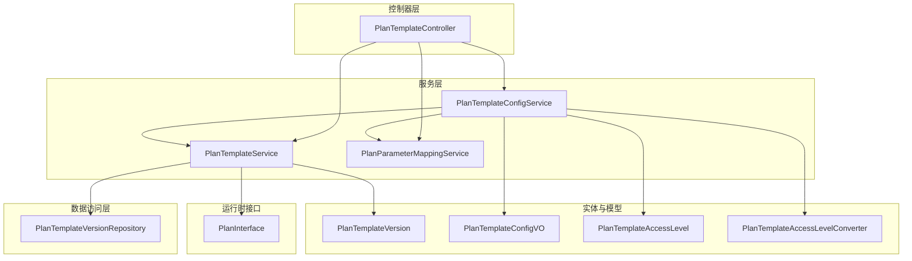
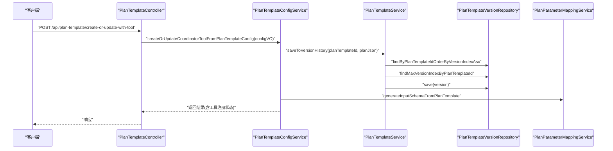
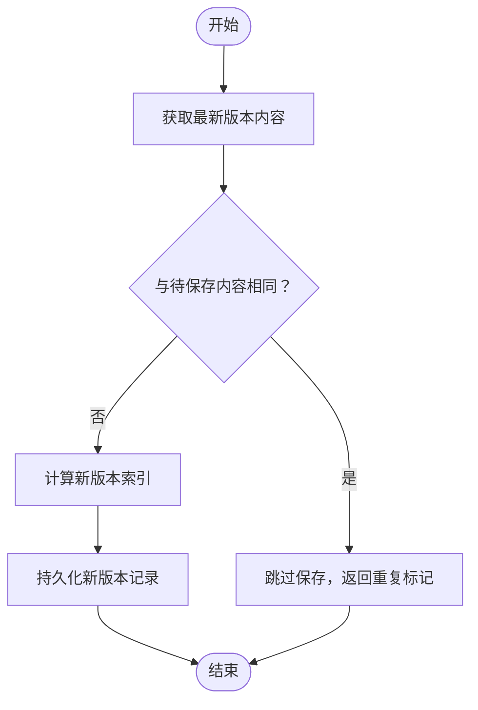
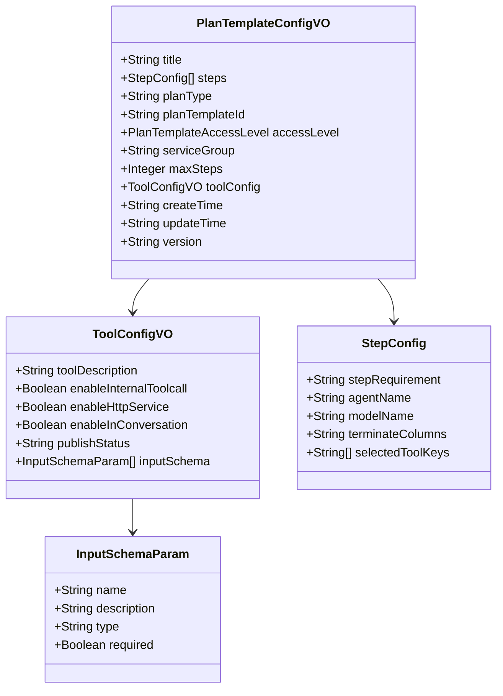
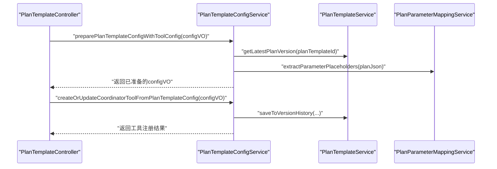
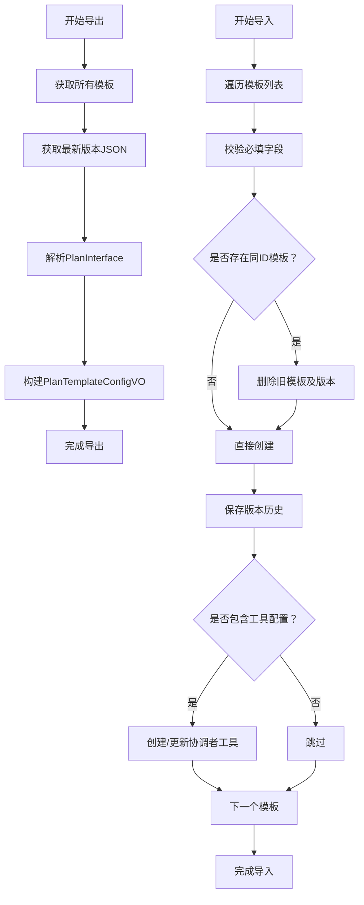
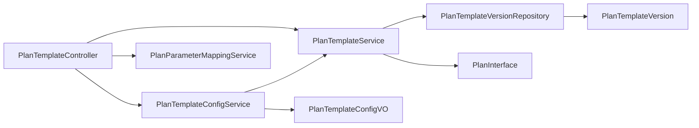

# 计划模板管理

<cite>
**本文引用的文件**
- [PlanTemplateController.java](file://src/main/java/com/alibaba/cloud/ai/lynxe/planning/controller/PlanTemplateController.java)
- [IPlanTemplateService.java](file://src/main/java/com/alibaba/cloud/ai/lynxe/planning/service/IPlanTemplateService.java)
- [PlanTemplateService.java](file://src/main/java/com/alibaba/cloud/ai/lynxe/planning/service/PlanTemplateService.java)
- [PlanTemplateConfigService.java](file://src/main/java/com/alibaba/cloud/ai/lynxe/planning/service/PlanTemplateConfigService.java)
- [PlanTemplateVersion.java](file://src/main/java/com/alibaba/cloud/ai/lynxe/planning/model/po/PlanTemplateVersion.java)
- [PlanTemplateVersionRepository.java](file://src/main/java/com/alibaba/cloud/ai/lynxe/planning/repository/PlanTemplateVersionRepository.java)
- [PlanTemplateConfigVO.java](file://src/main/java/com/alibaba/cloud/ai/lynxe/planning/model/vo/PlanTemplateConfigVO.java)
- [IPlanParameterMappingService.java](file://src/main/java/com/alibaba/cloud/ai/lynxe/planning/service/IPlanParameterMappingService.java)
- [PlanParameterMappingService.java](file://src/main/java/com/alibaba/cloud/ai/lynxe/planning/service/PlanParameterMappingService.java)
- [PlanTemplateAccessLevel.java](file://src/main/java/com/alibaba/cloud/ai/lynxe/planning/model/enums/PlanTemplateAccessLevel.java)
- [PlanTemplateAccessLevelConverter.java](file://src/main/java/com/alibaba/cloud/ai/lynxe/planning/model/converter/PlanTemplateAccessLevelConverter.java)
- [PlanTemplateConfigException.java](file://src/main/java/com/alibaba/cloud/ai/lynxe/planning/exception/PlanTemplateConfigException.java)
- [PlanInterface.java](file://src/main/java/com/alibaba/cloud/ai/lynxe/runtime/entity/vo/PlanInterface.java)
</cite>

## 目录
1. [简介](#简介)
2. [项目结构](#项目结构)
3. [核心组件](#核心组件)
4. [架构总览](#架构总览)
5. [详细组件分析](#详细组件分析)
6. [依赖关系分析](#依赖关系分析)
7. [性能考量](#性能考量)
8. [故障排查指南](#故障排查指南)
9. [结论](#结论)
10. [附录](#附录)

## 简介
本技术文档围绕 Lynxe 的“计划模板管理”能力展开，系统性阐述模板的设计架构、实现原理与使用流程。重点覆盖以下方面：
- 模板的创建、编辑、版本管理与发布
- 模板配置项的定义、参数化机制与动态配置支持
- 版本控制策略、变更追踪与回滚机制
- 模板导入导出、JSON 结构校验与标准化
- 模板与工具系统的集成关系与执行上下文管理
- 开发最佳实践、性能优化建议与常见问题处理

## 项目结构
计划模板管理位于后端模块的 planning 子系统中，采用分层设计：控制器层负责对外接口；服务层封装业务逻辑；仓储层负责版本历史持久化；模型层定义配置与枚举。

**图表来源**
- [PlanTemplateController.java:1-637](file://src/main/java/com/alibaba/cloud/ai/lynxe/planning/controller/PlanTemplateController.java#L1-L637)
- [PlanTemplateService.java:1-206](file://src/main/java/com/alibaba/cloud/ai/lynxe/planning/service/PlanTemplateService.java#L1-L206)
- [PlanTemplateConfigService.java:1-1220](file://src/main/java/com/alibaba/cloud/ai/lynxe/planning/service/PlanTemplateConfigService.java#L1-L1220)
- [PlanTemplateVersionRepository.java:1-65](file://src/main/java/com/alibaba/cloud/ai/lynxe/planning/repository/PlanTemplateVersionRepository.java#L1-L65)
- [PlanTemplateVersion.java:1-104](file://src/main/java/com/alibaba/cloud/ai/lynxe/planning/model/po/PlanTemplateVersion.java#L1-L104)
- [PlanTemplateConfigVO.java:1-435](file://src/main/java/com/alibaba/cloud/ai/lynxe/planning/model/vo/PlanTemplateConfigVO.java#L1-L435)
- [PlanTemplateAccessLevel.java:1-80](file://src/main/java/com/alibaba/cloud/ai/lynxe/planning/model/enums/PlanTemplateAccessLevel.java#L1-L80)
- [PlanTemplateAccessLevelConverter.java:1-44](file://src/main/java/com/alibaba/cloud/ai/lynxe/planning/model/converter/PlanTemplateAccessLevelConverter.java#L1-L44)
- [PlanInterface.java:1-184](file://src/main/java/com/alibaba/cloud/ai/lynxe/runtime/entity/vo/PlanInterface.java#L1-L184)

**章节来源**
- [PlanTemplateController.java:1-637](file://src/main/java/com/alibaba/cloud/ai/lynxe/planning/controller/PlanTemplateController.java#L1-L637)
- [PlanTemplateService.java:1-206](file://src/main/java/com/alibaba/cloud/ai/lynxe/planning/service/PlanTemplateService.java#L1-L206)
- [PlanTemplateConfigService.java:1-1220](file://src/main/java/com/alibaba/cloud/ai/lynxe/planning/service/PlanTemplateConfigService.java#L1-L1220)

## 核心组件
- 控制器层：PlanTemplateController 提供模板列表、版本查询、删除、参数需求解析、创建/更新模板并注册为工具、导出/导入等接口。
- 服务层：
  - PlanTemplateService：版本历史存取、去重比较、版本索引计算与等价性判断。
  - PlanTemplateConfigService：模板与工具配置的准备、创建/更新、输入模式生成、导出/导入、唯一性约束处理。
  - PlanParameterMappingService：参数占位符提取、替换、验证与要求描述。
- 数据访问层：PlanTemplateVersionRepository 基于 JPA 提供版本记录的增删查改。
- 实体与模型：PlanTemplateVersion（版本实体）、PlanTemplateConfigVO（模板配置 VO）、PlanTemplateAccessLevel（访问级别枚举及 JPA 转换器）。
- 运行时接口：PlanInterface 定义了计划的通用结构，用于从模板 JSON 中抽取关键元信息（如 planType、maxSteps、步骤列表等）。

**章节来源**
- [PlanTemplateController.java:1-637](file://src/main/java/com/alibaba/cloud/ai/lynxe/planning/controller/PlanTemplateController.java#L1-L637)
- [PlanTemplateService.java:1-206](file://src/main/java/com/alibaba/cloud/ai/lynxe/planning/service/PlanTemplateService.java#L1-L206)
- [PlanTemplateConfigService.java:1-1220](file://src/main/java/com/alibaba/cloud/ai/lynxe/planning/service/PlanTemplateConfigService.java#L1-L1220)
- [PlanTemplateVersionRepository.java:1-65](file://src/main/java/com/alibaba/cloud/ai/lynxe/planning/repository/PlanTemplateVersionRepository.java#L1-L65)
- [PlanTemplateVersion.java:1-104](file://src/main/java/com/alibaba/cloud/ai/lynxe/planning/model/po/PlanTemplateVersion.java#L1-L104)
- [PlanTemplateConfigVO.java:1-435](file://src/main/java/com/alibaba/cloud/ai/lynxe/planning/model/vo/PlanTemplateConfigVO.java#L1-L435)
- [PlanTemplateAccessLevel.java:1-80](file://src/main/java/com/alibaba/cloud/ai/lynxe/planning/model/enums/PlanTemplateAccessLevel.java#L1-L80)
- [PlanTemplateAccessLevelConverter.java:1-44](file://src/main/java/com/alibaba/cloud/ai/lynxe/planning/model/converter/PlanTemplateAccessLevelConverter.java#L1-L44)
- [PlanInterface.java:1-184](file://src/main/java/com/alibaba/cloud/ai/lynxe/runtime/entity/vo/PlanInterface.java#L1-L184)

## 架构总览
下图展示控制器到服务、仓储与实体之间的交互关系，以及模板与工具系统的集成点。

**图表来源**
- [PlanTemplateController.java:339-391](file://src/main/java/com/alibaba/cloud/ai/lynxe/planning/controller/PlanTemplateController.java#L339-L391)
- [PlanTemplateConfigService.java:497-561](file://src/main/java/com/alibaba/cloud/ai/lynxe/planning/service/PlanTemplateConfigService.java#L497-L561)
- [PlanTemplateService.java:90-120](file://src/main/java/com/alibaba/cloud/ai/lynxe/planning/service/PlanTemplateService.java#L90-L120)
- [PlanTemplateVersionRepository.java:39-56](file://src/main/java/com/alibaba/cloud/ai/lynxe/planning/repository/PlanTemplateVersionRepository.java#L39-L56)
- [PlanParameterMappingService.java:192-246](file://src/main/java/com/alibaba/cloud/ai/lynxe/planning/service/PlanParameterMappingService.java#L192-L246)

## 详细组件分析

### 组件一：版本历史与版本控制
- 设计要点
  - 使用 PlanTemplateVersion 实体存储每个版本的 planJson，并以 version_index 递增。
  - 通过 PlanTemplateService 的 isContentSameAsLatestVersion 与 isJsonContentEquivalent 判断是否需要新增版本，避免重复保存。
  - 提供 getPlanVersions、getPlanVersion、getLatestPlanVersion 等查询接口。
- 关键流程
  - 保存版本：先比较最新版本内容，若不同则自动生成下一个版本索引并持久化。
  - 查询版本：按升序列出所有版本 JSON；支持按索引获取指定版本。
- 性能与一致性
  - 使用事务保证保存原子性。
  - JSON 比较优先字符串相等，再降级为解析树比较，失败时回退字符串比较。

**图表来源**
- [PlanTemplateService.java:90-120](file://src/main/java/com/alibaba/cloud/ai/lynxe/planning/service/PlanTemplateService.java#L90-L120)
- [PlanTemplateService.java:168-203](file://src/main/java/com/alibaba/cloud/ai/lynxe/planning/service/PlanTemplateService.java#L168-L203)

**章节来源**
- [PlanTemplateService.java:1-206](file://src/main/java/com/alibaba/cloud/ai/lynxe/planning/service/PlanTemplateService.java#L1-L206)
- [PlanTemplateVersion.java:1-104](file://src/main/java/com/alibaba/cloud/ai/lynxe/planning/model/po/PlanTemplateVersion.java#L1-L104)
- [PlanTemplateVersionRepository.java:1-65](file://src/main/java/com/alibaba/cloud/ai/lynxe/planning/repository/PlanTemplateVersionRepository.java#L1-L65)

### 组件二：模板配置与参数化
- 配置项定义
  - PlanTemplateConfigVO 定义模板标题、步骤、类型、访问级别、服务组、最大步数、工具配置、时间戳与版本号等字段。
  - ToolConfigVO 定义工具描述、启用内部调用、HTTP 服务、会话内调用、发布状态与输入模式。
  - StepConfig 定义每步的执行要求、代理名、模型名、终止列与选中工具键集合。
- 参数化机制
  - 通过 <<param>> 占位符语法在模板 JSON 中声明参数。
  - PlanParameterMappingService 支持提取占位符、替换参数、验证完整性与生成参数要求文本。
- 动态配置支持
  - 输入模式（inputSchema）可由模板参数自动推导生成，也可手动维护。
  - 工具配置在创建/更新时自动刷新输入模式，确保与当前模板一致。

**图表来源**
- [PlanTemplateConfigVO.java:1-435](file://src/main/java/com/alibaba/cloud/ai/lynxe/planning/model/vo/PlanTemplateConfigVO.java#L1-L435)

**章节来源**
- [PlanTemplateConfigVO.java:1-435](file://src/main/java/com/alibaba/cloud/ai/lynxe/planning/model/vo/PlanTemplateConfigVO.java#L1-L435)
- [PlanParameterMappingService.java:1-335](file://src/main/java/com/alibaba/cloud/ai/lynxe/planning/service/PlanParameterMappingService.java#L1-L335)

### 组件三：模板创建/更新与工具注册
- 创建/更新流程
  - 接收 PlanTemplateConfigVO，若前端传入 planTemplateId 以 "new-" 前缀开头，则由后端生成真实 ID 并替换。
  - 先保存模板到版本历史，再准备工具配置（生成或填充 inputSchema），最后创建或更新协调者工具。
- 唯一性与兼容性
  - 若同一服务组与名称存在冲突，先清理旧记录再写入，保证唯一约束。
  - 自动刷新输入模式，确保参数变化即时生效。
- 错误处理
  - 使用 PlanTemplateConfigException 提供错误码与消息，便于前端定位问题。

**图表来源**
- [PlanTemplateController.java:339-391](file://src/main/java/com/alibaba/cloud/ai/lynxe/planning/controller/PlanTemplateController.java#L339-L391)
- [PlanTemplateConfigService.java:76-151](file://src/main/java/com/alibaba/cloud/ai/lynxe/planning/service/PlanTemplateConfigService.java#L76-L151)
- [PlanTemplateConfigService.java:497-561](file://src/main/java/com/alibaba/cloud/ai/lynxe/planning/service/PlanTemplateConfigService.java#L497-L561)
- [PlanTemplateService.java:90-120](file://src/main/java/com/alibaba/cloud/ai/lynxe/planning/service/PlanTemplateService.java#L90-L120)
- [PlanParameterMappingService.java:192-246](file://src/main/java/com/alibaba/cloud/ai/lynxe/planning/service/PlanParameterMappingService.java#L192-L246)

**章节来源**
- [PlanTemplateConfigService.java:1-1220](file://src/main/java/com/alibaba/cloud/ai/lynxe/planning/service/PlanTemplateConfigService.java#L1-L1220)
- [PlanTemplateConfigException.java:1-60](file://src/main/java/com/alibaba/cloud/ai/lynxe/planning/exception/PlanTemplateConfigException.java#L1-L60)

### 组件四：导入/导出与标准化
- 导出
  - 读取所有模板，结合最新版本 JSON 与工具配置，组装为标准格式的 PlanTemplateConfigVO 列表。
- 导入
  - 对每个模板进行校验与清理（若已存在则删除旧记录），然后重建模板与版本历史，并可选地创建/更新协调者工具。
- 标准化
  - 通过 PlanInterface 抽取 planType、maxSteps、步骤列表等元信息，确保导出/导入的数据结构一致。

**图表来源**
- [PlanTemplateConfigService.java:1000-1083](file://src/main/java/com/alibaba/cloud/ai/lynxe/planning/service/PlanTemplateConfigService.java#L1000-L1083)
- [PlanTemplateConfigService.java:1090-1154](file://src/main/java/com/alibaba/cloud/ai/lynxe/planning/service/PlanTemplateConfigService.java#L1090-L1154)
- [PlanInterface.java:1-184](file://src/main/java/com/alibaba/cloud/ai/lynxe/runtime/entity/vo/PlanInterface.java#L1-L184)

**章节来源**
- [PlanTemplateConfigService.java:1000-1154](file://src/main/java/com/alibaba/cloud/ai/lynxe/planning/service/PlanTemplateConfigService.java#L1000-L1154)
- [PlanInterface.java:1-184](file://src/main/java/com/alibaba/cloud/ai/lynxe/runtime/entity/vo/PlanInterface.java#L1-L184)

### 组件五：访问级别与权限控制
- 访问级别
  - READ_ONLY：模板不可在前端被修改或删除。
  - EDITABLE：默认级别，允许编辑与删除。
- JPA 转换
  - 使用 PlanTemplateAccessLevelConverter 将枚举持久化为字符串值，反向转换时容错默认为 EDITABLE。

**章节来源**
- [PlanTemplateAccessLevel.java:1-80](file://src/main/java/com/alibaba/cloud/ai/lynxe/planning/model/enums/PlanTemplateAccessLevel.java#L1-L80)
- [PlanTemplateAccessLevelConverter.java:1-44](file://src/main/java/com/alibaba/cloud/ai/lynxe/planning/model/converter/PlanTemplateAccessLevelConverter.java#L1-L44)

## 依赖关系分析
- 控制器依赖服务：PlanTemplateController 注入 PlanTemplateService、PlanTemplateConfigService、IPlanParameterMappingService、PlanIdDispatcher 等。
- 服务间耦合：PlanTemplateConfigService 依赖 PlanTemplateService 与 PlanParameterMappingService；PlanTemplateService 依赖 PlanTemplateVersionRepository。
- 实体与仓储：PlanTemplateVersionRepository 提供基于 plan_template_id 的查询与删除，支撑版本历史管理。
- 运行时接口：PlanInterface 作为模板 JSON 的统一抽象，驱动导出/导入与配置 VO 的组装。

**图表来源**
- [PlanTemplateController.java:1-637](file://src/main/java/com/alibaba/cloud/ai/lynxe/planning/controller/PlanTemplateController.java#L1-L637)
- [PlanTemplateService.java:1-206](file://src/main/java/com/alibaba/cloud/ai/lynxe/planning/service/PlanTemplateService.java#L1-L206)
- [PlanTemplateConfigService.java:1-1220](file://src/main/java/com/alibaba/cloud/ai/lynxe/planning/service/PlanTemplateConfigService.java#L1-L1220)
- [PlanTemplateVersionRepository.java:1-65](file://src/main/java/com/alibaba/cloud/ai/lynxe/planning/repository/PlanTemplateVersionRepository.java#L1-L65)
- [PlanTemplateVersion.java:1-104](file://src/main/java/com/alibaba/cloud/ai/lynxe/planning/model/po/PlanTemplateVersion.java#L1-L104)
- [PlanTemplateConfigVO.java:1-435](file://src/main/java/com/alibaba/cloud/ai/lynxe/planning/model/vo/PlanTemplateConfigVO.java#L1-L435)
- [PlanInterface.java:1-184](file://src/main/java/com/alibaba/cloud/ai/lynxe/runtime/entity/vo/PlanInterface.java#L1-L184)

**章节来源**
- [PlanTemplateController.java:1-637](file://src/main/java/com/alibaba/cloud/ai/lynxe/planning/controller/PlanTemplateController.java#L1-L637)
- [PlanTemplateService.java:1-206](file://src/main/java/com/alibaba/cloud/ai/lynxe/planning/service/PlanTemplateService.java#L1-L206)
- [PlanTemplateConfigService.java:1-1220](file://src/main/java/com/alibaba/cloud/ai/lynxe/planning/service/PlanTemplateConfigService.java#L1-L1220)

## 性能考量
- 版本比较优化
  - 优先字符串快速相等判断，失败后再解析 JSON 树，降低 CPU 与内存开销。
- 批量导入
  - 导入流程逐条处理并记录错误明细，便于定位失败项；建议批量导入时分批提交以控制事务时长。
- 查询路径
  - 版本查询按索引升序返回，避免全表扫描；最大版本索引查询使用聚合函数，减少网络往返。
- 参数替换
  - 正则匹配占位符，替换前先做参数完整性校验，避免无效替换导致的二次解析。

[本节为通用指导，无需特定文件引用]

## 故障排查指南
- 常见错误与处理
  - 唯一性冲突：当服务组+工具名或标题冲突时，系统会尝试删除旧记录并重试；若仍失败，检查唯一约束与数据一致性。
  - 输入模式生成失败：自动回退为空数组；可在日志中查看具体失败原因并修正模板参数。
  - 导入失败：导入结果包含错误列表，逐条核对 planTemplateId 与错误消息。
  - 参数缺失：参数校验失败会抛出详细异常，包含缺失参数清单与模板内容，便于修复。
- 日志与可观测性
  - 控制器与服务均记录关键操作日志，包括版本保存、模板创建/更新、导入/导出与参数替换过程。
- 异常类型
  - PlanTemplateConfigException：提供错误码与消息，便于前端统一处理。

**章节来源**
- [PlanTemplateConfigService.java:425-487](file://src/main/java/com/alibaba/cloud/ai/lynxe/planning/service/PlanTemplateConfigService.java#L425-L487)
- [PlanTemplateConfigService.java:1090-1154](file://src/main/java/com/alibaba/cloud/ai/lynxe/planning/service/PlanTemplateConfigService.java#L1090-L1154)
- [PlanParameterMappingService.java:302-332](file://src/main/java/com/alibaba/cloud/ai/lynxe/planning/service/PlanParameterMappingService.java#L302-L332)
- [PlanTemplateConfigException.java:1-60](file://src/main/java/com/alibaba/cloud/ai/lynxe/planning/exception/PlanTemplateConfigException.java#L1-L60)

## 结论
Lynxe 的计划模板管理以清晰的分层架构实现了模板的创建、编辑、版本控制、参数化与工具注册的闭环。通过版本历史与等价性比较避免冗余存储，借助输入模式自动生成与刷新保障参数一致性，配合完善的导入/导出与错误处理机制，满足生产环境下的可运维性与可扩展性需求。建议在实际使用中遵循参数命名规范、合理设置访问级别与服务组，并利用版本历史进行变更追踪与回滚。

[本节为总结性内容，无需特定文件引用]

## 附录

### API 概览（接口路径与用途）
- 获取版本列表：POST /api/plan-template/versions
- 获取指定版本：POST /api/plan-template/get-version
- 获取模板列表：GET /api/plan-template/list
- 删除模板：POST /api/plan-template/delete
- 获取参数需求：GET /api/plan-template/{planTemplateId}/parameters
- 创建/更新模板并注册为工具：POST /api/plan-template/create-or-update-with-tool
- 获取所有模板配置：GET /api/plan-template/list-config
- 导出全部模板：GET /api/plan-template/export-all
- 导入模板列表：POST /api/plan-template/import-all
- 获取单个模板配置：GET /api/plan-template/{planTemplateId}/config
- 生成模板ID：GET /api/plan-template/generate-plan-template-id

**章节来源**
- [PlanTemplateController.java:150-634](file://src/main/java/com/alibaba/cloud/ai/lynxe/planning/controller/PlanTemplateController.java#L150-L634)