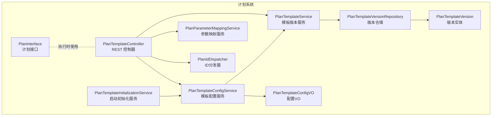
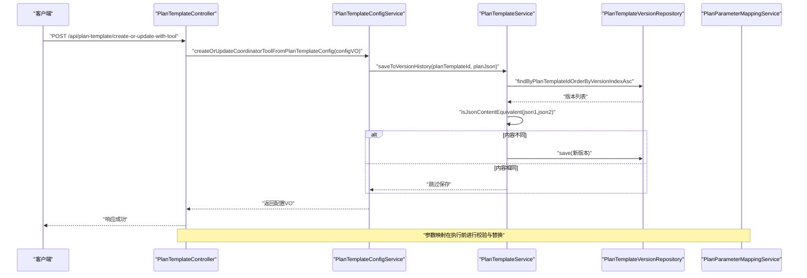
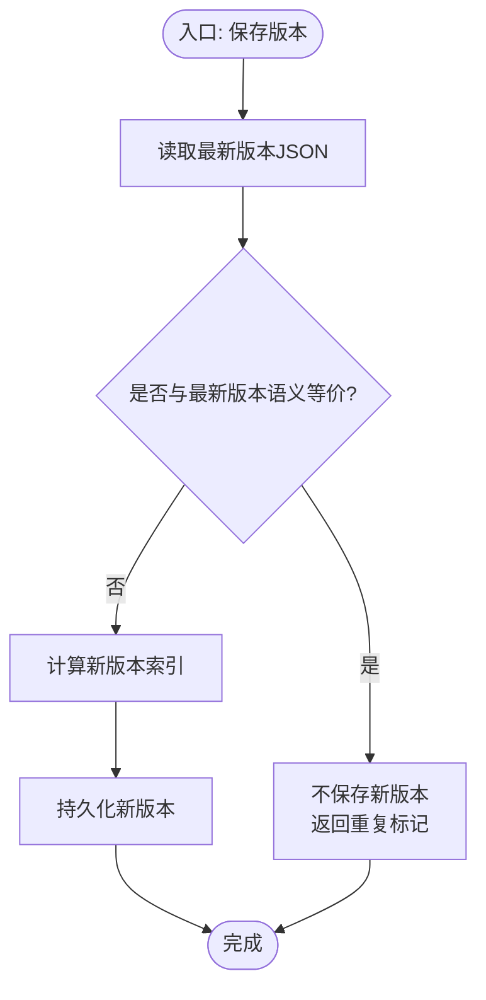
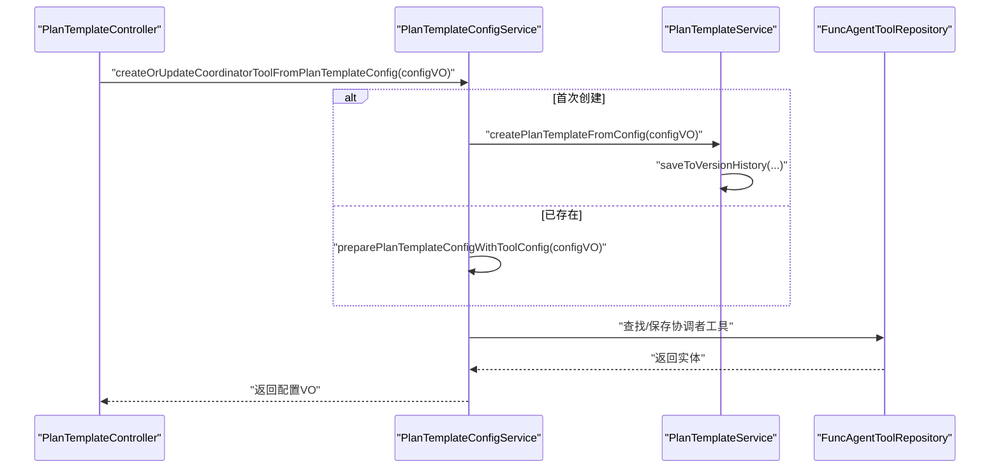
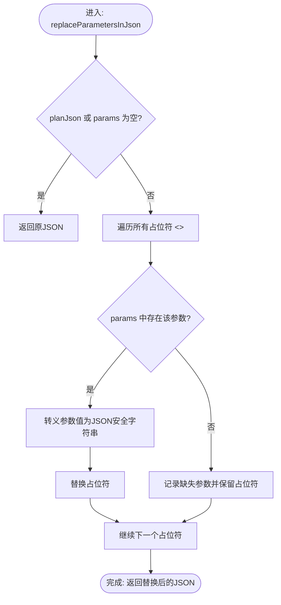
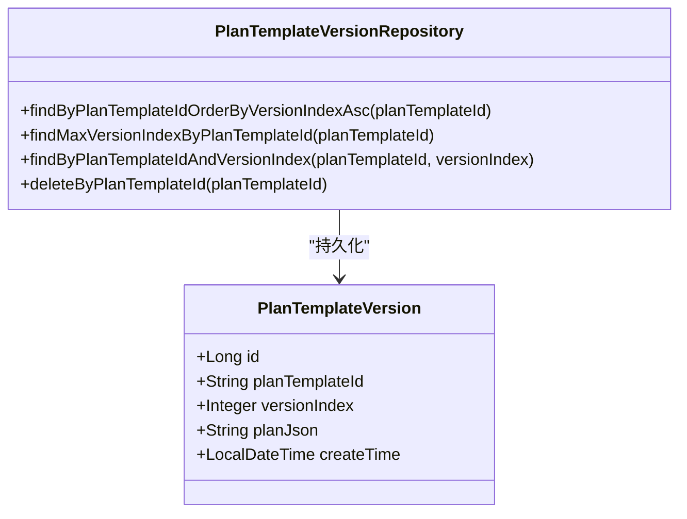
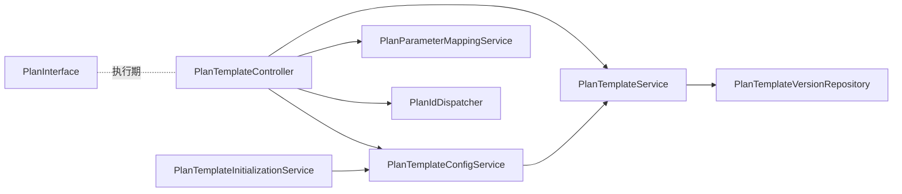

# 计划系统

<cite>
**本文引用的文件**
- [PlanTemplateController.java](file://src/main/java/com/alibaba/cloud/ai/lynxe/planning/controller/PlanTemplateController.java)
- [IPlanTemplateService.java](file://src/main/java/com/alibaba/cloud/ai/lynxe/planning/service/IPlanTemplateService.java)
- [PlanTemplateService.java](file://src/main/java/com/alibaba/cloud/ai/lynxe/planning/service/PlanTemplateService.java)
- [PlanTemplateConfigService.java](file://src/main/java/com/alibaba/cloud/ai/lynxe/planning/service/PlanTemplateConfigService.java)
- [PlanParameterMappingService.java](file://src/main/java/com/alibaba/cloud/ai/lynxe/planning/service/PlanParameterMappingService.java)
- [PlanTemplateConfigVO.java](file://src/main/java/com/alibaba/cloud/ai/lynxe/planning/model/vo/PlanTemplateConfigVO.java)
- [PlanTemplateVersionRepository.java](file://src/main/java/com/alibaba/cloud/ai/lynxe/planning/repository/PlanTemplateVersionRepository.java)
- [PlanTemplateVersion.java](file://src/main/java/com/alibaba/cloud/ai/lynxe/planning/model/po/PlanTemplateVersion.java)
- [PlanTemplateInitializationService.java](file://src/main/java/com/alibaba/cloud/ai/lynxe/planning/service/PlanTemplateInitializationService.java)
- [PlanIdDispatcher.java](file://src/main/java/com/alibaba/cloud/ai/lynxe/runtime/service/PlanIdDispatcher.java)
- [PlanInterface.java](file://src/main/java/com/alibaba/cloud/ai/lynxe/runtime/entity/vo/PlanInterface.java)
- [PlanTemplateConfigException.java](file://src/main/java/com/alibaba/cloud/ai/lynxe/planning/exception/PlanTemplateConfigException.java)
</cite>

## 目录
1. [简介](#简介)
2. [项目结构](#项目结构)
3. [核心组件](#核心组件)
4. [架构总览](#架构总览)
5. [详细组件分析](#详细组件分析)
6. [依赖分析](#依赖分析)
7. [性能考虑](#性能考虑)
8. [故障排查指南](#故障排查指南)
9. [结论](#结论)
10. [附录](#附录)

## 简介
本文件面向Lynxe计划系统，围绕“计划模板”的设计与执行展开，系统性阐述以下主题：
- 计划模板的设计理念与执行机制
- 模板的创建、配置与管理流程
- 参数映射机制、变量替换与动态参数处理
- 计划执行流程、状态跟踪与结果记录
- 模板的导入导出、版本管理与发布流程
- 开发指南与最佳实践
- 与代理执行、工具调用的集成关系
- 监控、调试与性能优化策略

## 项目结构
计划系统位于后端模块的planning子包中，采用分层架构：控制器层负责对外接口；服务层承载业务逻辑（模板配置、参数映射、版本管理、初始化等）；模型层定义配置与持久化实体；仓库层提供数据访问。

图表来源
- [PlanTemplateController.java:1-637](file://src/main/java/com/alibaba/cloud/ai/lynxe/planning/controller/PlanTemplateController.java#L1-L637)
- [PlanTemplateConfigService.java:1-800](file://src/main/java/com/alibaba/cloud/ai/lynxe/planning/service/PlanTemplateConfigService.java#L1-L800)
- [PlanTemplateService.java:1-206](file://src/main/java/com/alibaba/cloud/ai/lynxe/planning/service/PlanTemplateService.java#L1-L206)
- [PlanParameterMappingService.java:1-335](file://src/main/java/com/alibaba/cloud/ai/lynxe/planning/service/PlanParameterMappingService.java#L1-L335)
- [PlanTemplateVersionRepository.java:1-65](file://src/main/java/com/alibaba/cloud/ai/lynxe/planning/repository/PlanTemplateVersionRepository.java#L1-L65)
- [PlanTemplateVersion.java:1-104](file://src/main/java/com/alibaba/cloud/ai/lynxe/planning/model/po/PlanTemplateVersion.java#L1-L104)
- [PlanTemplateInitializationService.java:1-293](file://src/main/java/com/alibaba/cloud/ai/lynxe/planning/service/PlanTemplateInitializationService.java#L1-L293)
- [PlanIdDispatcher.java:1-292](file://src/main/java/com/alibaba/cloud/ai/lynxe/runtime/service/PlanIdDispatcher.java#L1-L292)
- [PlanInterface.java:1-184](file://src/main/java/com/alibaba/cloud/ai/lynxe/runtime/entity/vo/PlanInterface.java#L1-L184)

章节来源
- [PlanTemplateController.java:1-637](file://src/main/java/com/alibaba/cloud/ai/lynxe/planning/controller/PlanTemplateController.java#L1-L637)
- [PlanTemplateConfigService.java:1-800](file://src/main/java/com/alibaba/cloud/ai/lynxe/planning/service/PlanTemplateConfigService.java#L1-L800)
- [PlanTemplateService.java:1-206](file://src/main/java/com/alibaba/cloud/ai/lynxe/planning/service/PlanTemplateService.java#L1-L206)
- [PlanParameterMappingService.java:1-335](file://src/main/java/com/alibaba/cloud/ai/lynxe/planning/service/PlanParameterMappingService.java#L1-L335)
- [PlanTemplateVersionRepository.java:1-65](file://src/main/java/com/alibaba/cloud/ai/lynxe/planning/repository/PlanTemplateVersionRepository.java#L1-L65)
- [PlanTemplateVersion.java:1-104](file://src/main/java/com/alibaba/cloud/ai/lynxe/planning/model/po/PlanTemplateVersion.java#L1-L104)
- [PlanTemplateInitializationService.java:1-293](file://src/main/java/com/alibaba/cloud/ai/lynxe/planning/service/PlanTemplateInitializationService.java#L1-L293)
- [PlanIdDispatcher.java:1-292](file://src/main/java/com/alibaba/cloud/ai/lynxe/runtime/service/PlanIdDispatcher.java#L1-L292)
- [PlanInterface.java:1-184](file://src/main/java/com/alibaba/cloud/ai/lynxe/runtime/entity/vo/PlanInterface.java#L1-L184)

## 核心组件
- 计划模板控制器：提供模板列表、版本查询、删除、参数需求解析、导入导出、生成模板ID等接口。
- 模板配置服务：负责从配置对象创建/更新模板、生成输入Schema、注册协调者工具、处理唯一性约束冲突、初始化内置模板。
- 模板版本服务：提供版本保存、去重比较、版本列表与指定版本读取、最新版本获取与内容等价性判断。
- 参数映射服务：提取占位符、校验参数完整性、安全替换、构建参数要求说明。
- 版本仓储与实体：持久化版本索引与JSON内容，支持按模板ID与版本索引检索。
- 启动初始化服务：扫描类路径中的默认模板配置，按命名空间与语言批量初始化。
- ID分发器：在planId与planTemplateId之间转换与生成，保证唯一性与兼容性。
- 计划接口：统一的计划抽象，定义根计划ID、当前计划ID、类型、标题、思考过程、步骤集合、最大步数等。

章节来源
- [PlanTemplateController.java:1-637](file://src/main/java/com/alibaba/cloud/ai/lynxe/planning/controller/PlanTemplateController.java#L1-L637)
- [PlanTemplateConfigService.java:1-800](file://src/main/java/com/alibaba/cloud/ai/lynxe/planning/service/PlanTemplateConfigService.java#L1-L800)
- [PlanTemplateService.java:1-206](file://src/main/java/com/alibaba/cloud/ai/lynxe/planning/service/PlanTemplateService.java#L1-L206)
- [PlanParameterMappingService.java:1-335](file://src/main/java/com/alibaba/cloud/ai/lynxe/planning/service/PlanParameterMappingService.java#L1-L335)
- [PlanTemplateVersionRepository.java:1-65](file://src/main/java/com/alibaba/cloud/ai/lynxe/planning/repository/PlanTemplateVersionRepository.java#L1-L65)
- [PlanTemplateVersion.java:1-104](file://src/main/java/com/alibaba/cloud/ai/lynxe/planning/model/po/PlanTemplateVersion.java#L1-L104)
- [PlanTemplateInitializationService.java:1-293](file://src/main/java/com/alibaba/cloud/ai/lynxe/planning/service/PlanTemplateInitializationService.java#L1-L293)
- [PlanIdDispatcher.java:1-292](file://src/main/java/com/alibaba/cloud/ai/lynxe/runtime/service/PlanIdDispatcher.java#L1-L292)
- [PlanInterface.java:1-184](file://src/main/java/com/alibaba/cloud/ai/lynxe/runtime/entity/vo/PlanInterface.java#L1-L184)

## 架构总览
计划系统的控制流以控制器为中心，围绕模板配置与版本管理两条主线展开，并通过参数映射服务实现动态参数注入。执行阶段由计划接口抽象统一，配合ID分发器与仓储层完成持久化与追踪。

图表来源
- [PlanTemplateController.java:339-391](file://src/main/java/com/alibaba/cloud/ai/lynxe/planning/controller/PlanTemplateController.java#L339-L391)
- [PlanTemplateConfigService.java:497-561](file://src/main/java/com/alibaba/cloud/ai/lynxe/planning/service/PlanTemplateConfigService.java#L497-L561)
- [PlanTemplateService.java:90-110](file://src/main/java/com/alibaba/cloud/ai/lynxe/planning/service/PlanTemplateService.java#L90-L110)
- [PlanTemplateVersionRepository.java:39-56](file://src/main/java/com/alibaba/cloud/ai/lynxe/planning/repository/PlanTemplateVersionRepository.java#L39-L56)
- [PlanParameterMappingService.java:52-101](file://src/main/java/com/alibaba/cloud/ai/lynxe/planning/service/PlanParameterMappingService.java#L52-L101)

## 详细组件分析

### 组件A：计划模板控制器（API与管理）
职责与能力
- 列表与详情：列出所有模板、按ID获取配置与版本历史。
- 版本管理：查询版本列表、获取指定版本、保存版本历史（自动去重）。
- 删除与导入导出：删除模板及其全部版本；导出全部模板配置；导入模板配置并统计结果。
- 参数需求：解析模板JSON，提取占位符与参数要求。
- 协调者工具注册：将模板注册为可被调用的工具，自动生成或更新输入Schema。
- ID生成：生成新的模板ID，兼容前端传入的“new-”前缀。

关键流程示意（版本保存与去重）

图表来源
- [PlanTemplateService.java:90-110](file://src/main/java/com/alibaba/cloud/ai/lynxe/planning/service/PlanTemplateService.java#L90-L110)
- [PlanTemplateService.java:168-171](file://src/main/java/com/alibaba/cloud/ai/lynxe/planning/service/PlanTemplateService.java#L168-L171)
- [PlanTemplateService.java:180-203](file://src/main/java/com/alibaba/cloud/ai/lynxe/planning/service/PlanTemplateService.java#L180-L203)

章节来源
- [PlanTemplateController.java:145-292](file://src/main/java/com/alibaba/cloud/ai/lynxe/planning/controller/PlanTemplateController.java#L145-L292)
- [PlanTemplateController.java:294-634](file://src/main/java/com/alibaba/cloud/ai/lynxe/planning/controller/PlanTemplateController.java#L294-L634)

### 组件B：模板配置服务（创建、注册与初始化）
职责与能力
- 从配置对象创建/更新模板：确保模板存在，写入版本历史，设置服务组与访问级别。
- 自动生成输入Schema：基于模板JSON中的占位符生成工具输入参数结构。
- 注册协调者工具：将模板作为工具注册到系统，强制启用内部工具调用，自动刷新版本号。
- 唯一性约束处理：当同服务组+名称冲突时，删除旧记录后重试，避免重复。
- 初始化内置模板：扫描类路径资源，按命名空间与语言批量初始化带工具配置的模板。

关键流程示意（创建或更新协调者工具）

图表来源
- [PlanTemplateConfigService.java:497-561](file://src/main/java/com/alibaba/cloud/ai/lynxe/planning/service/PlanTemplateConfigService.java#L497-L561)
- [PlanTemplateConfigService.java:268-488](file://src/main/java/com/alibaba/cloud/ai/lynxe/planning/service/PlanTemplateConfigService.java#L268-L488)
- [PlanTemplateConfigService.java:76-151](file://src/main/java/com/alibaba/cloud/ai/lynxe/planning/service/PlanTemplateConfigService.java#L76-L151)

章节来源
- [PlanTemplateConfigService.java:1-800](file://src/main/java/com/alibaba/cloud/ai/lynxe/planning/service/PlanTemplateConfigService.java#L1-L800)

### 组件C：参数映射服务（占位符、校验与替换）
职责与能力
- 提取占位符：从模板JSON中识别形如“<<参数名>>”的占位符。
- 参数校验：在替换前验证是否提供完整参数集，缺失则抛出异常。
- 安全替换：对参数值进行JSON转义，防止解析错误；替换完成后返回新JSON。
- 参数要求说明：生成人类可读的参数清单与格式规范。
- 名称合法性：仅允许字母、数字、下划线，且不能以数字开头。

参数替换流程

图表来源
- [PlanParameterMappingService.java:188-246](file://src/main/java/com/alibaba/cloud/ai/lynxe/planning/service/PlanParameterMappingService.java#L188-L246)
- [PlanParameterMappingService.java:52-101](file://src/main/java/com/alibaba/cloud/ai/lynxe/planning/service/PlanParameterMappingService.java#L52-L101)

章节来源
- [PlanParameterMappingService.java:1-335](file://src/main/java/com/alibaba/cloud/ai/lynxe/planning/service/PlanParameterMappingService.java#L1-L335)

### 组件D：版本管理与持久化
职责与能力
- 版本保存：若内容与最新版本不同，则新增版本；否则跳过。
- 版本读取：按模板ID排序返回版本列表；按索引读取指定版本；获取最新版本。
- 内容等价性：先尝试字符串比较，失败则解析为JSON树再比较，忽略格式差异。

实体与仓储

图表来源
- [PlanTemplateVersion.java:1-104](file://src/main/java/com/alibaba/cloud/ai/lynxe/planning/model/po/PlanTemplateVersion.java#L1-L104)
- [PlanTemplateVersionRepository.java:1-65](file://src/main/java/com/alibaba/cloud/ai/lynxe/planning/repository/PlanTemplateVersionRepository.java#L1-L65)

章节来源
- [PlanTemplateService.java:1-206](file://src/main/java/com/alibaba/cloud/ai/lynxe/planning/service/PlanTemplateService.java#L1-L206)
- [PlanTemplateVersionRepository.java:1-65](file://src/main/java/com/alibaba/cloud/ai/lynxe/planning/repository/PlanTemplateVersionRepository.java#L1-L65)
- [PlanTemplateVersion.java:1-104](file://src/main/java/com/alibaba/cloud/ai/lynxe/planning/model/po/PlanTemplateVersion.java#L1-L104)

### 组件E：启动初始化与模板发布
职责与能力
- 扫描类路径资源：按语言扫描默认模板配置文件，仅处理带有工具配置的模板。
- 初始化：逐个创建或更新模板与协调者工具，失败即中断，便于定位问题。
- 发布流程：通过工具配置的输入Schema与发布状态字段，实现模板的可发现与可调用。

章节来源
- [PlanTemplateInitializationService.java:1-293](file://src/main/java/com/alibaba/cloud/ai/lynxe/planning/service/PlanTemplateInitializationService.java#L1-L293)

### 组件F：ID分发与兼容性
职责与能力
- 在planId与planTemplateId之间双向转换，支持“new-”前缀生成真实ID。
- 生成多种唯一标识：子计划ID、工具调用ID、步骤ID、think-act ID、并行执行ID，满足并发场景。

章节来源
- [PlanIdDispatcher.java:1-292](file://src/main/java/com/alibaba/cloud/ai/lynxe/runtime/service/PlanIdDispatcher.java#L1-L292)

### 组件G：计划接口与执行抽象
职责与能力
- 统一计划抽象：定义根计划ID、当前计划ID、类型、标题、思考过程、步骤集合、最大步数等。
- 执行状态输出：支持仅输出已完成与首个进行中的步骤，便于UI展示。
- 步骤索引更新：提供统一的步骤索引重排方法。

章节来源
- [PlanInterface.java:1-184](file://src/main/java/com/alibaba/cloud/ai/lynxe/runtime/entity/vo/PlanInterface.java#L1-L184)

## 依赖分析
- 控制器依赖服务：控制器通过构造函数注入多个服务，形成清晰的职责边界。
- 配置服务依赖版本服务与仓储：创建模板时需保存版本，同时需要读取最新版本进行等价性判断。
- 参数映射服务独立于持久化：专注于模板JSON的占位符处理，便于复用与测试。
- 初始化服务依赖配置服务：批量初始化时直接调用配置服务的创建/更新方法。
- ID分发器与控制器协作：控制器在保存版本时可能使用生成的模板ID，保证前后端一致性。

图表来源
- [PlanTemplateController.java:57-74](file://src/main/java/com/alibaba/cloud/ai/lynxe/planning/controller/PlanTemplateController.java#L57-L74)
- [PlanTemplateConfigService.java:48-67](file://src/main/java/com/alibaba/cloud/ai/lynxe/planning/service/PlanTemplateConfigService.java#L48-L67)
- [PlanTemplateService.java:40-44](file://src/main/java/com/alibaba/cloud/ai/lynxe/planning/service/PlanTemplateService.java#L40-L44)
- [PlanTemplateInitializationService.java:51-55](file://src/main/java/com/alibaba/cloud/ai/lynxe/planning/service/PlanTemplateInitializationService.java#L51-L55)
- [PlanIdDispatcher.java:28-28](file://src/main/java/com/alibaba/cloud/ai/lynxe/runtime/service/PlanIdDispatcher.java#L28-L28)

章节来源
- [PlanTemplateController.java:1-637](file://src/main/java/com/alibaba/cloud/ai/lynxe/planning/controller/PlanTemplateController.java#L1-L637)
- [PlanTemplateConfigService.java:1-800](file://src/main/java/com/alibaba/cloud/ai/lynxe/planning/service/PlanTemplateConfigService.java#L1-L800)
- [PlanTemplateService.java:1-206](file://src/main/java/com/alibaba/cloud/ai/lynxe/planning/service/PlanTemplateService.java#L1-L206)
- [PlanTemplateInitializationService.java:1-293](file://src/main/java/com/alibaba/cloud/ai/lynxe/planning/service/PlanTemplateInitializationService.java#L1-L293)
- [PlanIdDispatcher.java:1-292](file://src/main/java/com/alibaba/cloud/ai/lynxe/runtime/service/PlanIdDispatcher.java#L1-L292)
- [PlanInterface.java:1-184](file://src/main/java/com/alibaba/cloud/ai/lynxe/runtime/entity/vo/PlanInterface.java#L1-L184)

## 性能考虑
- 版本保存去重：通过内容等价性判断避免重复存储，减少数据库写入与IO开销。
- JSON比较策略：优先字符串快速比较，失败再解析为树比较，兼顾性能与准确性。
- 批量初始化：扫描类路径资源时逐条处理，遇到异常立即中断，避免无效重试。
- 并发ID生成：多类ID生成器采用时间戳+随机+线程ID组合，降低冲突概率。
- 参数替换：仅在执行前进行一次校验与替换，避免重复解析与替换。

## 故障排查指南
常见异常与处理
- 参数校验失败：当模板包含占位符但未提供对应参数时，抛出参数校验异常，需检查参数名称与大小写、必填性与格式。
- 模板配置异常：创建/更新模板过程中出现唯一性冲突或数据完整性异常，需根据错误码定位（如重复标题、同服务组+名称冲突），必要时清理冲突记录后重试。
- 版本保存异常：JSON解析失败时回退到字符串比较，若仍失败需检查模板JSON格式。
- 初始化失败：扫描不到配置文件或解析失败时会记录警告并跳过，需确认资源路径与文件内容。

章节来源
- [PlanParameterMappingService.java:302-332](file://src/main/java/com/alibaba/cloud/ai/lynxe/planning/service/PlanParameterMappingService.java#L302-L332)
- [PlanTemplateConfigException.java:1-60](file://src/main/java/com/alibaba/cloud/ai/lynxe/planning/exception/PlanTemplateConfigException.java#L1-L60)
- [PlanTemplateConfigService.java:425-487](file://src/main/java/com/alibaba/cloud/ai/lynxe/planning/service/PlanTemplateConfigService.java#L425-L487)
- [PlanTemplateService.java:193-203](file://src/main/java/com/alibaba/cloud/ai/lynxe/planning/service/PlanTemplateService.java#L193-L203)
- [PlanTemplateInitializationService.java:253-290](file://src/main/java/com/alibaba/cloud/ai/lynxe/planning/service/PlanTemplateInitializationService.java#L253-L290)

## 结论
Lynxe计划系统以“模板+版本+参数映射+工具注册”为核心，实现了模板的可演进、可复用与可发布。通过严格的参数校验与安全替换、完善的版本去重与持久化策略、以及启动时的批量初始化，系统在易用性与可靠性之间取得平衡。建议在实际使用中遵循参数命名规范、保持模板JSON结构稳定、合理规划版本变更策略，并结合监控与日志持续优化执行性能。

## 附录
- 开发与最佳实践
  - 参数命名：仅使用字母、数字、下划线，且不以数字开头；保持大小写一致。
  - 模板结构：尽量将动态部分以占位符形式表达，便于参数映射与版本管理。
  - 版本策略：频繁修改的模板应谨慎合并，利用版本历史回溯变更。
  - 工具注册：模板需包含工具配置方可被系统识别为可调用工具，注意输入Schema与发布状态。
  - 初始化：默认模板应放置于类路径资源目录，命名规范与语言标签需与扫描规则匹配。
- 监控与调试
  - 关注参数映射日志：替换前后对比与缺失参数提示。
  - 观察版本保存：重复保存与新版本创建的区分有助于评估模板变更频率。
  - 异常分类：依据错误码快速定位问题类型（校验、唯一性、解析等）。
- 性能优化
  - 减少不必要的模板变更：通过参数映射实现动态行为，避免频繁创建新版本。
  - 合理拆分步骤：控制最大步数与步骤数量，提升执行效率与可观测性。
  - 使用合适的ID生成策略：在高并发场景下避免ID冲突与重复生成。