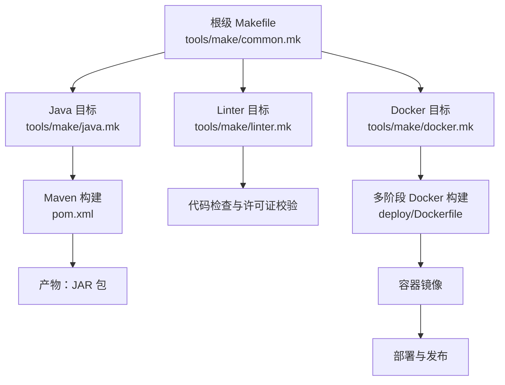
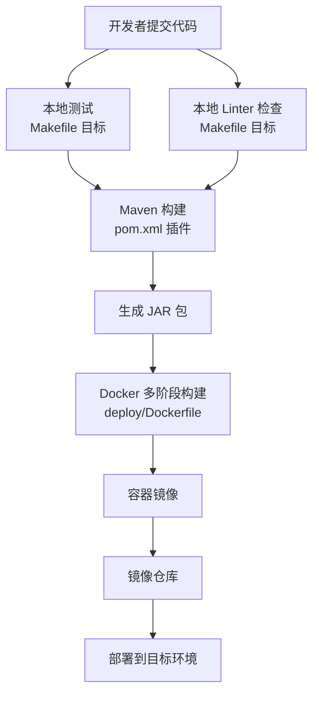
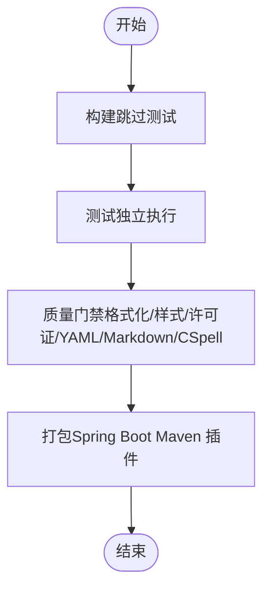
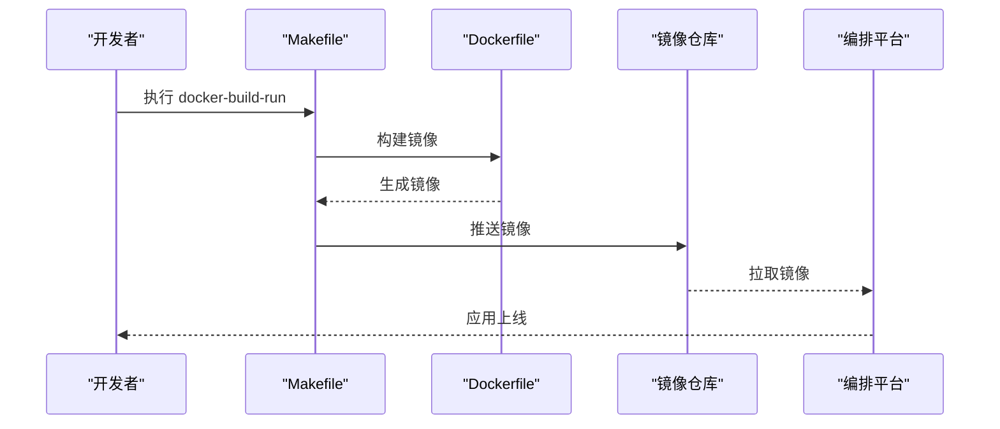
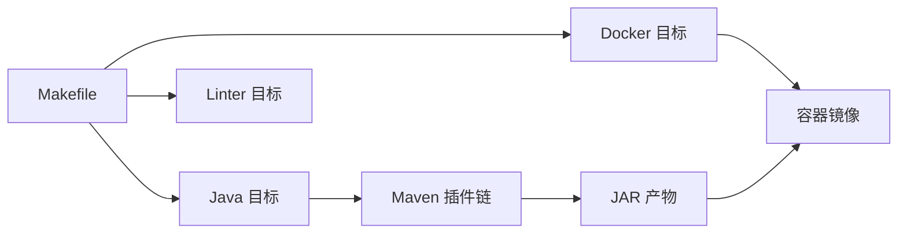

# CI/CD流水线

<cite>
**本文引用的文件**   
- [README.md](file://README.md)
- [README-dev.md](file://README-dev.md)
- [CONTRIBUTING.md](file://CONTRIBUTING.md)
- [Makefile](file://Makefile)
- [tools/make/common.mk](file://tools/make/common.mk)
- [tools/make/java.mk](file://tools/make/java.mk)
- [tools/make/linter.mk](file://tools/make/linter.mk)
- [tools/make/docker.mk](file://tools/make/docker.mk)
- [deploy/Dockerfile](file://deploy/Dockerfile)
- [pom.xml](file://pom.xml)
</cite>

## 目录
1. [简介](#简介)
2. [项目结构](#项目结构)
3. [核心组件](#核心组件)
4. [架构总览](#架构总览)
5. [详细组件分析](#详细组件分析)
6. [依赖关系分析](#依赖关系分析)
7. [性能考量](#性能考量)
8. [故障排查指南](#故障排查指南)
9. [结论](#结论)
10. [附录](#附录)

## 简介
本文件面向Lynxe项目的DevOps团队与贡献者，系统化梳理CI/CD流水线的设计与实践，覆盖GitOps工作流、分支策略与合并规则、自动化构建与测试、容器化与部署、质量门禁与安全扫描、多环境与发布策略（蓝绿/金丝雀）、监控与回滚、依赖管理与版本控制、以及发布自动化。文档基于仓库内现有配置与脚本进行归纳总结，帮助团队建立稳定、可追溯、可审计的交付体系。

## 项目结构
Lynxe采用多模块工程与多阶段Docker构建，结合本地Makefile与Maven插件，形成“本地开发-质量门禁-容器化打包-部署”的闭环。关键位置如下：
- 根级Makefile聚合各模块Make目标，统一入口
- tools/make子模块提供Java、Linter、Docker、UI等目标
- deploy/Dockerfile定义多阶段镜像构建与运行时环境
- pom.xml集中管理依赖、插件与打包配置
- README与README-dev提供使用与开发指引，便于回归验证

图表来源
- [Makefile:17-30](file://Makefile#L17-L30)
- [tools/make/common.mk:30-35](file://tools/make/common.mk#L30-L35)
- [tools/make/java.mk:17-47](file://tools/make/java.mk#L17-L47)
- [tools/make/linter.mk:17-65](file://tools/make/linter.mk#L17-L65)
- [tools/make/docker.mk:17-46](file://tools/make/docker.mk#L17-L46)
- [deploy/Dockerfile:15-138](file://deploy/Dockerfile#L15-L138)
- [pom.xml:356-556](file://pom.xml#L356-L556)

章节来源
- [README.md:1-276](file://README.md#L1-L276)
- [README-dev.md:1-279](file://README-dev.md#L1-L279)
- [Makefile:1-30](file://Makefile#L1-L30)
- [tools/make/common.mk:1-35](file://tools/make/common.mk#L1-L35)
- [tools/make/java.mk:1-47](file://tools/make/java.mk#L1-L47)
- [tools/make/linter.mk:1-65](file://tools/make/linter.mk#L1-L65)
- [tools/make/docker.mk:1-46](file://tools/make/docker.mk#L1-L46)
- [deploy/Dockerfile:1-138](file://deploy/Dockerfile#L1-L138)
- [pom.xml:1-556](file://pom.xml#L1-L556)

## 核心组件
- 本地CI与质量门禁
  - Makefile统一入口，聚合Java构建、测试、格式化、检查样式、许可证校验、YAML/Markdown/CSpell检查、Docker构建与运行等目标
  - Java目标通过Maven Wrapper（mvnd）执行，分离构建与测试阶段以提升效率
  - Linter目标涵盖YAML、CSpell、许可证头检查、Markdown规范检查与自动修复
- 容器化与运行时
  - 多阶段Dockerfile安装JDK、Node.js与Playwright浏览器依赖，预热浏览器缓存，设置运行时环境变量与端口暴露
  - 提供启动脚本与镜像标签，便于在不同环境中运行
- 依赖与打包
  - pom.xml集中声明依赖与插件，启用Spring JavaFormat、Spotless、Surefire、Moditect等插件，配置资源过滤与版本属性注入
  - Spring Boot Maven插件负责打包与主类配置，支持多环境配置文件

章节来源
- [Makefile:17-30](file://Makefile#L17-L30)
- [tools/make/java.mk:17-47](file://tools/make/java.mk#L17-L47)
- [tools/make/linter.mk:17-65](file://tools/make/linter.mk#L17-L65)
- [tools/make/docker.mk:17-46](file://tools/make/docker.mk#L17-L46)
- [deploy/Dockerfile:15-138](file://deploy/Dockerfile#L15-L138)
- [pom.xml:356-556](file://pom.xml#L356-L556)

## 架构总览
下图展示从代码提交到容器部署的关键路径，体现质量门禁、容器化与部署的关系。

图表来源
- [Makefile:17-30](file://Makefile#L17-L30)
- [tools/make/linter.mk:17-65](file://tools/make/linter.mk#L17-L65)
- [tools/make/java.mk:17-47](file://tools/make/java.mk#L17-L47)
- [pom.xml:356-556](file://pom.xml#L356-L556)
- [deploy/Dockerfile:15-138](file://deploy/Dockerfile#L15-L138)

## 详细组件分析

### GitOps 工作流与分支策略
- 建议采用GitOps理念，以“变更即声明”为核心：任何环境变更通过受控分支与PR合并实现，确保可追溯与可审计
- 分支策略建议
  - main：生产就绪，只允许通过PR合并
  - develop：集成分支，日常开发在此合并
  - feature/*：功能开发分支，按功能命名
  - hotfix/*：紧急修复分支
  - release/*：发布准备分支，冻结变更
- 合并规则
  - PR必须通过本地CI（Makefile目标）与自动化检查
  - 至少一名维护者审查与批准
  - 合并前要求通过测试与质量门禁
  - 禁止直接push到受保护分支

章节来源
- [CONTRIBUTING.md:55-108](file://CONTRIBUTING.md#L55-L108)

### 自动化构建、测试与打包
- 构建与测试分离
  - 构建：跳过测试，快速产出工件
  - 测试：独立执行，保证覆盖率与稳定性
- 本地CI建议
  - 在PR与推送前执行：格式化校验、检查样式、许可证头检查、YAML/Markdown/CSpell检查
  - 通过Makefile统一触发，减少环境差异
- Maven插件要点
  - Spring JavaFormat与Spotless：统一代码风格与清理无用导入
  - Surefire：JUnit测试执行，支持时区与并行配置
  - Moditect：模块化支持
  - Spring Boot Maven插件：打包与主类配置

图表来源
- [tools/make/java.mk:17-47](file://tools/make/java.mk#L17-L47)
- [tools/make/linter.mk:17-65](file://tools/make/linter.mk#L17-L65)
- [pom.xml:356-556](file://pom.xml#L356-L556)

章节来源
- [tools/make/java.mk:17-47](file://tools/make/java.mk#L17-L47)
- [tools/make/linter.mk:17-65](file://tools/make/linter.mk#L17-L65)
- [pom.xml:356-556](file://pom.xml#L356-L556)

### 容器化与部署
- 多阶段构建
  - 安装JDK、Node.js与Playwright浏览器依赖，预热浏览器缓存，设置运行时环境变量
  - 复制应用配置文件与启动脚本，暴露端口，设置镜像标签与元数据
- 本地运行
  - 提供docker-build-run与docker-run目标，便于本地验证
- 生产部署建议
  - 使用镜像仓库托管镜像，结合编排平台（Kubernetes/Helm）进行部署
  - 通过环境变量与配置文件切换数据库与外部服务

图表来源
- [tools/make/docker.mk:17-46](file://tools/make/docker.mk#L17-L46)
- [deploy/Dockerfile:15-138](file://deploy/Dockerfile#L15-L138)

章节来源
- [tools/make/docker.mk:17-46](file://tools/make/docker.mk#L17-L46)
- [deploy/Dockerfile:15-138](file://deploy/Dockerfile#L15-L138)

### 代码质量检查、安全扫描与合规性验证
- 代码风格与静态检查
  - Spring JavaFormat与Spotless：统一风格与清理无用导入
  - Checkstyle：通过Maven插件执行，输出报告
- 文档与许可证
  - YAML/Markdown规范检查与自动修复
  - 许可证头检查与自动修复，确保开源合规
- 安全扫描建议
  - 依赖漏洞扫描：结合Maven插件或第三方工具（如OWASP Dependency-Check）
  - 机密泄露扫描：在CI中集成Secrets检测脚本
  - 容器镜像安全扫描：在镜像推送后进行扫描

章节来源
- [tools/make/java.mk:28-47](file://tools/make/java.mk#L28-L47)
- [tools/make/linter.mk:23-65](file://tools/make/linter.mk#L23-L65)
- [CONTRIBUTING.md:72-82](file://CONTRIBUTING.md#L72-L82)

### 多环境部署策略、蓝绿部署与金丝雀发布
- 多环境
  - 通过Spring Profiles与配置文件隔离不同环境（H2/MySQL/PostgreSQL）
  - 通过环境变量与挂载卷实现配置与数据持久化
- 蓝绿部署
  - 两套完全相同的生产环境（蓝/绿），通过负载均衡器切换流量
  - 新版本先部署至备用环境，健康检查通过后切换流量
- 金丝雀发布
  - 逐步将部分流量引入新版本，观察指标与日志
  - 失败时快速回切，降低影响面

章节来源
- [README.md:170-198](file://README.md#L170-L198)
- [deploy/Dockerfile:115-124](file://deploy/Dockerfile#L115-L124)

### 流水线监控、回滚机制与故障恢复
- 监控
  - 应用层面：健康检查端点、日志采集与指标上报
  - 基础设施层面：容器运行状态、资源使用率、网络连通性
- 回滚
  - 快速回滚至上一稳定版本镜像
  - 配置回滚：通过版本化的配置文件与GitOps声明实现
- 故障恢复
  - 自愈：副本数与重启策略
  - 限流与熔断：在流量高峰时保护系统
  - 备份与恢复：数据库与配置备份策略

### 依赖管理、版本控制与发布自动化
- 依赖管理
  - 通过Maven统一管理依赖与插件版本，避免冲突
  - 使用BOM与版本属性集中管理
- 版本控制
  - 语义化版本：主版本号.次版本号.修订号
  - 标签策略：发布标签与版本号一致，便于追踪
- 发布自动化
  - CI中自动构建镜像并推送到镜像仓库
  - 通过编排平台自动化部署与滚动更新
  - 变更日志与发布说明自动生成

章节来源
- [pom.xml:20-46](file://pom.xml#L20-L46)
- [pom.xml:514-532](file://pom.xml#L514-L532)
- [CONTRIBUTING.md:72-82](file://CONTRIBUTING.md#L72-L82)

## 依赖关系分析
- 组件耦合
  - Makefile作为统一入口，解耦各子模块目标
  - Java与Linter目标相互独立，互不影响
  - Docker构建依赖Maven产物，形成清晰的上下游关系
- 外部依赖
  - Spring Boot、Spring AI、WebFlux、Playwright等
  - Maven插件链路：JavaFormat、Spotless、Surefire、Moditect、Spring Boot Maven插件

图表来源
- [Makefile:17-30](file://Makefile#L17-L30)
- [tools/make/java.mk:17-47](file://tools/make/java.mk#L17-L47)
- [tools/make/linter.mk:17-65](file://tools/make/linter.mk#L17-L65)
- [tools/make/docker.mk:17-46](file://tools/make/docker.mk#L17-L46)
- [pom.xml:356-556](file://pom.xml#L356-L556)

章节来源
- [Makefile:17-30](file://Makefile#L17-L30)
- [tools/make/java.mk:17-47](file://tools/make/java.mk#L17-L47)
- [tools/make/linter.mk:17-65](file://tools/make/linter.mk#L17-L65)
- [tools/make/docker.mk:17-46](file://tools/make/docker.mk#L17-L46)
- [pom.xml:356-556](file://pom.xml#L356-L556)

## 性能考量
- 并行与缓存
  - 分离构建与测试阶段，充分利用缓存与并行能力
  - Docker多阶段构建优化层缓存，减少最终镜像体积
- 资源与启动
  - 运行时JVM参数与容器资源限制需结合负载评估
  - Playwright浏览器预热与权限设置减少首次启动延迟
- 测试效率
  - 本地优先执行轻量检查，CI中再执行完整测试矩阵

## 故障排查指南
- 本地CI失败
  - 使用Makefile目标逐项排查：格式化、检查样式、许可证、YAML/Markdown/CSpell
  - 确认Maven与mvnd版本兼容性
- 构建失败
  - 检查Maven插件配置与依赖版本
  - 关注资源过滤与版本属性注入
- 容器启动异常
  - 检查JDK、Node.js与Playwright依赖安装
  - 核对端口占用与环境变量
- 回滚与恢复
  - 快速拉起上一稳定版本镜像
  - 检查配置文件与数据库迁移状态

章节来源
- [tools/make/linter.mk:17-65](file://tools/make/linter.mk#L17-L65)
- [tools/make/java.mk:17-47](file://tools/make/java.mk#L17-L47)
- [deploy/Dockerfile:15-138](file://deploy/Dockerfile#L15-L138)
- [pom.xml:356-556](file://pom.xml#L356-L556)

## 结论
Lynxe的CI/CD体系以Makefile为统一入口，结合Maven插件链与多阶段Docker构建，实现了从本地开发到容器部署的高效闭环。建议在此基础上完善GitOps分支策略与合并规则、强化安全扫描与合规性检查、落地蓝绿/金丝雀发布与自动化监控回滚，持续提升交付质量与稳定性。

## 附录
- 术语
  - GitOps：以Git为单一事实来源的基础设施与应用程序声明式管理方式
  - 蓝绿部署：通过两套环境交替切换实现零停机发布
  - 金丝雀发布：逐步放量新版本，降低风险
- 参考文档
  - 项目使用与开发指南：[README.md](file://README.md)、[README-dev.md](file://README-dev.md)
  - 贡献与CLA流程：[CONTRIBUTING.md](file://CONTRIBUTING.md)