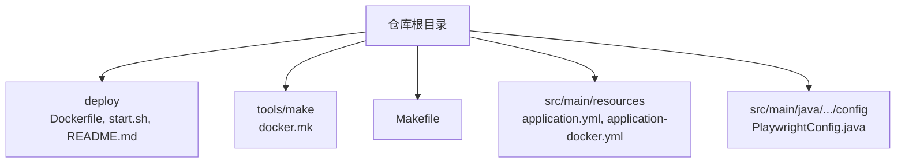
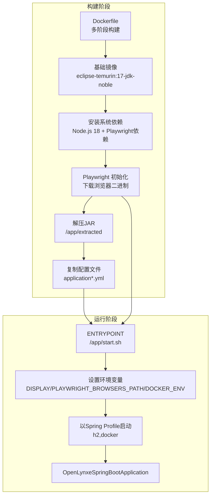
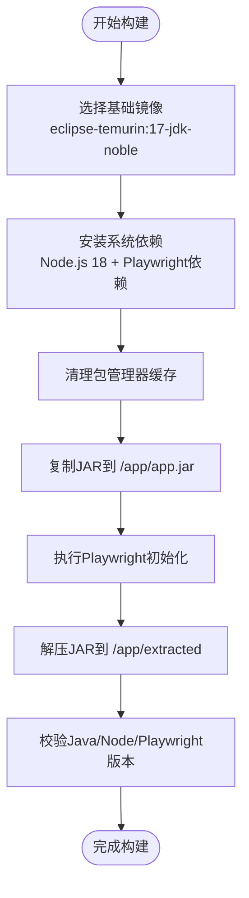
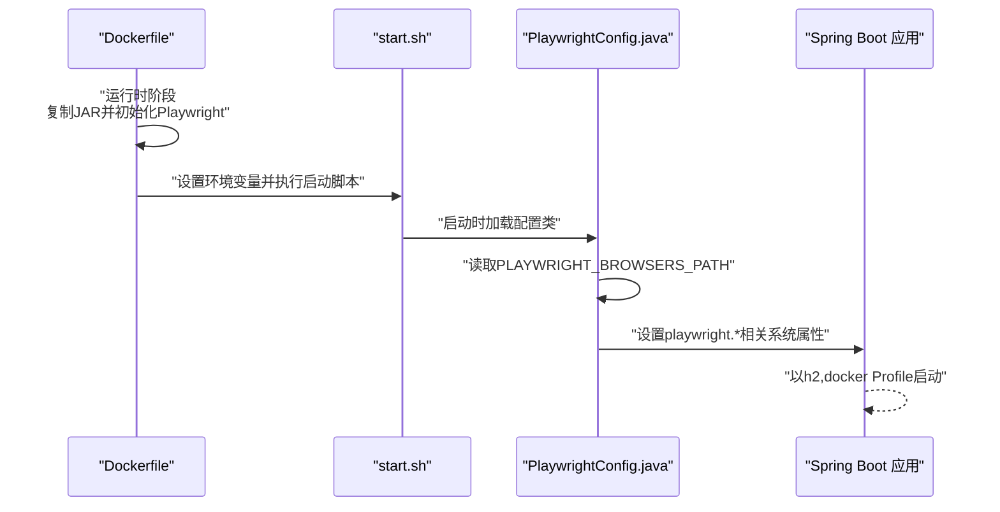
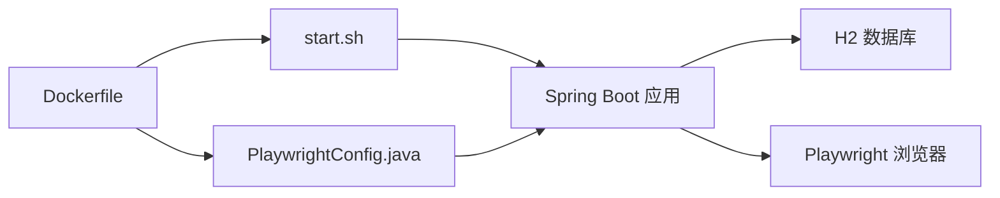

# Docker容器化部署

<cite>
**本文引用的文件**
- [Dockerfile](file://deploy/Dockerfile)
- [启动脚本 start.sh](file://deploy/start.sh)
- [Docker 使用说明](file://deploy/README.md)
- [Makefile](file://Makefile)
- [docker.mk](file://tools/make/docker.mk)
- [application.yml](file://src/main/resources/application.yml)
- [application-docker.yml](file://src/main/resources/application-docker.yml)
- [PlaywrightConfig.java](file://src/main/java/com/alibaba/cloud/ai/lynxe/config/PlaywrightConfig.java)
</cite>

## 目录
1. [简介](#简介)
2. [项目结构](#项目结构)
3. [核心组件](#核心组件)
4. [架构总览](#架构总览)
5. [详细组件分析](#详细组件分析)
6. [依赖关系分析](#依赖关系分析)
7. [性能考量](#性能考量)
8. [故障排查指南](#故障排查指南)
9. [结论](#结论)
10. [附录](#附录)

## 简介
本文件面向Lynxe项目的Docker容器化部署，围绕多阶段构建、基础镜像选择与分层缓存优化、系统依赖与浏览器依赖安装、容器启动流程与JVM参数调优、运行时配置（端口、卷挂载）、健康检查与资源限制建议、性能监控、多架构支持与镜像标签管理、以及CI/CD集成方案进行系统性说明。文档同时提供可视化图示帮助理解组件交互与数据流。

## 项目结构
与容器化部署直接相关的目录与文件包括：
- 部署与构建：deploy/Dockerfile、deploy/start.sh、deploy/README.md
- 构建编排：Makefile、tools/make/docker.mk
- 应用配置：src/main/resources/application.yml、src/main/resources/application-docker.yml
- 浏览器与Playwright配置：src/main/java/.../config/PlaywrightConfig.java

图表来源
- [Dockerfile:1-138](file://deploy/Dockerfile#L1-L138)
- [启动脚本 start.sh:1-91](file://deploy/start.sh#L1-L91)
- [Makefile:1-30](file://Makefile#L1-L30)
- [docker.mk:1-46](file://tools/make/docker.mk#L1-L46)
- [application.yml:1-97](file://src/main/resources/application.yml#L1-L97)
- [application-docker.yml:1-20](file://src/main/resources/application-docker.yml#L1-L20)
- [PlaywrightConfig.java:1-150](file://src/main/java/com/alibaba/cloud/ai/lynxe/config/PlaywrightConfig.java#L1-L150)

章节来源
- [Dockerfile:1-138](file://deploy/Dockerfile#L1-L138)
- [启动脚本 start.sh:1-91](file://deploy/start.sh#L1-L91)
- [Makefile:1-30](file://Makefile#L1-L30)
- [docker.mk:1-46](file://tools/make/docker.mk#L1-L46)
- [application.yml:1-97](file://src/main/resources/application.yml#L1-L97)
- [application-docker.yml:1-20](file://src/main/resources/application-docker.yml#L1-L20)
- [PlaywrightConfig.java:1-150](file://src/main/java/com/alibaba/cloud/ai/lynxe/config/PlaywrightConfig.java#L1-L150)

## 核心组件
- 多阶段构建与基础镜像
  - 基础镜像采用多架构支持的Eclipse Temurin 17（含JDK），便于跨平台部署与容器运行时兼容。
  - 构建版本通过ARG传入，便于在CI中统一管理版本号。
- 系统依赖与浏览器依赖
  - 在单一层中安装系统依赖、Node.js 18与Playwright所需依赖，减少层数与缓存失效概率。
  - 安装完成后清理包管理器缓存，进一步减小镜像体积。
- Playwright初始化与JAR解压
  - 启动前通过Java命令执行Playwright初始化，确保浏览器二进制可用；随后解压JAR至可执行目录以提升启动速度。
- 环境变量与JVM参数
  - 设置DISPLAY、PLAYWRIGHT_BROWSERS_PATH、DOCKER_ENV等关键环境变量。
  - 默认JAVA_OPTS包含堆大小、GC策略、容器支持、Netty相关参数等，适合容器内稳定运行。
- 启动脚本与入口
  - 启动脚本负责打印系统信息、校验浏览器安装、设置环境变量并以指定Spring Profile启动应用。
  - 入口点指向启动脚本，确保所有前置条件满足后再进入主程序。

章节来源
- [Dockerfile:15-138](file://deploy/Dockerfile#L15-L138)
- [启动脚本 start.sh:42-91](file://deploy/start.sh#L42-L91)
- [application-docker.yml:1-20](file://src/main/resources/application-docker.yml#L1-L20)

## 架构总览
下图展示从镜像构建到容器运行的关键步骤与组件交互：

图表来源
- [Dockerfile:15-138](file://deploy/Dockerfile#L15-L138)
- [启动脚本 start.sh:78-91](file://deploy/start.sh#L78-L91)
- [application-docker.yml:1-20](file://src/main/resources/application-docker.yml#L1-L20)

## 详细组件分析

### 多阶段构建与分层缓存优化
- 分层策略
  - 将系统依赖安装、Node.js与Playwright依赖安装合并到单一层，降低因依赖变更导致的缓存失效。
  - 清理包管理器缓存，避免冗余层增大镜像体积。
- 版本与平台参数
  - 通过ARG传递BUILD_VERSION与多架构参数，便于在不同平台构建镜像时保持一致性。
- 最终镜像
  - 运行时使用JDK基础镜像，结合解压后的JAR结构，减少启动时的类加载开销。

图表来源
- [Dockerfile:15-138](file://deploy/Dockerfile#L15-L138)

章节来源
- [Dockerfile:15-138](file://deploy/Dockerfile#L15-L138)

### 基础镜像选择与多架构支持
- 基础镜像
  - 采用Eclipse Temurin 17 JDK镜像，具备良好的容器运行时支持与长期维护。
- 多架构参数
  - 通过TARGETPLATFORM/TARGETARCH等ARG注入，配合构建工具（如Buildx）实现多架构镜像构建。
- 实践建议
  - 在CI中使用buildx进行多架构构建，并推送至镜像仓库（如ghcr.io）。

章节来源
- [Dockerfile:18-26](file://deploy/Dockerfile#L18-L26)

### 系统依赖安装、Node.js与Playwright依赖配置
- 系统依赖
  - 包括证书、下载工具、窗口系统与字体库等，确保浏览器渲染与无头模式正常工作。
- Node.js 18
  - 通过官方源安装，保证版本稳定性与安全性。
- Playwright依赖
  - 安装浏览器运行时所需的GTK、NSS、ALSA、X11等库，避免运行时缺少依赖。
- Playwright CLI
  - 全局安装以支持后续初始化与调试。
- 清理与校验
  - 构建后清理缓存并校验版本，确保镜像最小化且功能完备。

章节来源
- [Dockerfile:31-87](file://deploy/Dockerfile#L31-L87)

### Playwright浏览器初始化与路径配置
- 初始化流程
  - 通过Java命令触发Playwright初始化，确保浏览器二进制可用。
  - 解压JAR后设置权限，确保可执行文件可被调用。
- 路径与环境变量
  - 通过PLAYWRIGHT_BROWSERS_PATH指向预安装的浏览器缓存目录。
  - 在Docker环境下设置跳过下载标志，避免重复下载。
- Spring配置联动
  - PlaywrightConfig根据环境变量动态设置浏览器路径与无头模式、沙箱等参数，确保容器内稳定运行。

图表来源
- [Dockerfile:92-109](file://deploy/Dockerfile#L92-L109)
- [启动脚本 start.sh:78-91](file://deploy/start.sh#L78-L91)
- [PlaywrightConfig.java:37-77](file://src/main/java/com/alibaba/cloud/ai/lynxe/config/PlaywrightConfig.java#L37-L77)

章节来源
- [Dockerfile:92-109](file://deploy/Dockerfile#L92-L109)
- [启动脚本 start.sh:78-91](file://deploy/start.sh#L78-L91)
- [PlaywrightConfig.java:37-77](file://src/main/java/com/alibaba/cloud/ai/lynxe/config/PlaywrightConfig.java#L37-L77)

### 容器启动脚本工作原理
- 启动脚本职责
  - 打印系统信息与浏览器状态，校验Chromium是否存在。
  - 设置PLAYWRIGHT_BROWSERS_PATH与DOCKER_ENV，确保应用侧能正确识别容器环境。
  - 切换工作目录并以指定JVM参数与Spring Profile启动主类。
- 参数与日志
  - 输出当前平台、架构、Java与Playwright版本，便于排障。
  - 通过标准输出输出引导信息，便于容器日志采集。

章节来源
- [启动脚本 start.sh:26-91](file://deploy/start.sh#L26-L91)

### 环境变量与JVM参数调优
- 关键环境变量
  - DISPLAY：用于虚拟显示服务，满足某些浏览器渲染需求。
  - PLAYWRIGHT_BROWSERS_PATH：指向已安装的浏览器缓存目录。
  - DOCKER_ENV：标记容器环境，驱动Playwright配置。
- JVM参数（JAVA_OPTS）
  - 堆大小：初始与最大内存设置，避免容器OOM或频繁GC。
  - GC策略：启用G1GC，适配容器内存模型。
  - 容器支持：开启容器感知，提升资源调度效率。
  - Netty安全：禁用unsafe访问以增强容器安全性。
- 生产建议
  - 根据容器CPU/内存配额调整堆大小与线程池参数。
  - 结合Prometheus/Grafana进行JVM指标采集与告警。

章节来源
- [Dockerfile:115-119](file://deploy/Dockerfile#L115-L119)
- [application.yml:20-30](file://src/main/resources/application.yml#L20-L30)

### 运行时配置、端口映射与卷挂载策略
- 端口暴露
  - 容器暴露18080端口，对应应用配置中的server.port。
- 端口映射
  - 默认运行命令将宿主机18080映射到容器18080，便于外部访问。
- 卷挂载建议
  - 日志目录：/app/logs（持久化日志，便于采集与分析）。
  - 数据目录：/app/h2-data（持久化H2数据库文件）。
  - Playwright缓存：/root/.cache/ms-playwright（可选挂载，加速重复启动）。
- 配置文件
  - application-docker.yml启用无头浏览器与性能优化项，适合容器环境。

章节来源
- [Dockerfile:125-126](file://deploy/Dockerfile#L125-L126)
- [docker.mk:35-39](file://tools/make/docker.mk#L35-L39)
- [application.yml:1-2](file://src/main/resources/application.yml#L1-L2)
- [application-docker.yml:1-20](file://src/main/resources/application-docker.yml#L1-L20)

### 健康检查、资源限制与性能监控
- 健康检查
  - 建议在Kubernetes中添加HTTP GET探针至应用健康端点，周期性探测服务可用性。
  - 探针失败时触发重启，保障服务可用性。
- 资源限制
  - CPU/内存配额应与JAVA_OPTS堆大小匹配，避免容器被OOM Killer终止。
  - 可结合HPA实现基于CPU利用率的自动扩缩容。
- 性能监控
  - JVM层面：启用Micrometer与Prometheus导出，采集GC、堆、线程等指标。
  - 应用层面：记录请求耗时、错误率、吞吐量，结合APM工具进行链路追踪。
  - 浏览器层面：统计页面加载时间、截图/PDF生成耗时等业务指标。

[本节为通用实践建议，不直接分析具体文件]

### 多架构支持、镜像标签管理与CI/CD集成
- 多架构支持
  - 使用Buildx在本地或CI中构建多架构镜像（如linux/amd64与linux/arm64），并推送至ghcr.io。
- 镜像标签管理
  - 建议采用语义化版本（vX.Y.Z）与latest标签，配合构建版本ARG统一管理。
- CI/CD集成
  - Makefile与docker.mk提供一键构建与运行目标，可在流水线中复用。
  - 推荐在流水线中加入测试、安全扫描与镜像推送步骤，确保质量与可追溯性。

章节来源
- [Makefile:17-25](file://Makefile#L17-L25)
- [docker.mk:19-45](file://tools/make/docker.mk#L19-L45)
- [Dockerfile:16-26](file://deploy/Dockerfile#L16-L26)

## 依赖关系分析
- 组件耦合
  - Dockerfile定义了构建与运行时依赖链，start.sh作为运行时入口，PlaywrightConfig在应用启动时对浏览器路径与容器特性进行适配。
- 外部依赖
  - Eclipse Temurin JDK、Node.js 18、Playwright浏览器二进制、H2数据库（由Spring Profile激活）。
- 潜在风险
  - 浏览器依赖库较多，升级需关注兼容性；JVM参数需随容器资源变化而调整。

图表来源
- [Dockerfile:15-138](file://deploy/Dockerfile#L15-L138)
- [启动脚本 start.sh:78-91](file://deploy/start.sh#L78-L91)
- [PlaywrightConfig.java:37-77](file://src/main/java/com/alibaba/cloud/ai/lynxe/config/PlaywrightConfig.java#L37-L77)

章节来源
- [Dockerfile:15-138](file://deploy/Dockerfile#L15-L138)
- [启动脚本 start.sh:78-91](file://deploy/start.sh#L78-L91)
- [PlaywrightConfig.java:37-77](file://src/main/java/com/alibaba/cloud/ai/lynxe/config/PlaywrightConfig.java#L37-L77)

## 性能考量
- 启动性能
  - 解压JAR至可执行目录减少启动时的类加载与解压开销。
  - 无头浏览器与禁用SQL格式化等配置降低容器内I/O与CPU消耗。
- 运行性能
  - G1GC与容器支持参数提升内存回收效率；合理设置堆大小避免Full GC。
  - 通过卷挂载持久化日志与数据，避免频繁写盘。
- 资源利用
  - 结合HPA与资源配额，按流量弹性伸缩；监控JVM与业务指标，及时发现异常。

章节来源
- [Dockerfile:92-109](file://deploy/Dockerfile#L92-L109)
- [application.yml:11-16](file://src/main/resources/application.yml#L11-L16)
- [application.yml:31-30](file://src/main/resources/application.yml#L31-L30)

## 故障排查指南
- 浏览器不可用
  - 检查PLAYWRIGHT_BROWSERS_PATH是否正确设置，确认浏览器缓存目录存在且包含可执行文件。
  - 在启动脚本中查看浏览器检测输出，定位缺失的二进制。
- 启动失败
  - 查看启动脚本输出的系统信息与JVM参数，确认Java与Playwright版本。
  - 检查容器日志目录与权限，确保应用可写。
- 端口冲突
  - 确认宿主机18080未被占用，或修改映射端口。
- 配置问题
  - 确认Spring Profile为h2,docker，且application-docker.yml生效。

章节来源
- [启动脚本 start.sh:50-76](file://deploy/start.sh#L50-L76)
- [application-docker.yml:1-20](file://src/main/resources/application-docker.yml#L1-L20)

## 结论
Lynxe的Docker容器化方案通过多阶段构建与系统依赖整合、Playwright预安装与路径适配、合理的JVM参数与容器化配置，实现了稳定、可扩展的容器运行体验。结合多架构支持与CI/CD集成，可在不同环境中一致地交付与运维。建议在生产环境中完善健康检查、资源限制与监控体系，持续优化JVM与业务指标，确保高可用与高性能。

## 附录
- 快速运行
  - 使用Makefile提供的目标一键构建与运行容器。
- 配置参考
  - application.yml与application-docker.yml分别定义默认与容器环境专用配置。

章节来源
- [Docker 使用说明:1-4](file://deploy/README.md#L1-L4)
- [Makefile:17-25](file://Makefile#L17-L25)
- [docker.mk:24-45](file://tools/make/docker.mk#L24-L45)
- [application.yml:1-97](file://src/main/resources/application.yml#L1-L97)
- [application-docker.yml:1-20](file://src/main/resources/application-docker.yml#L1-L20)