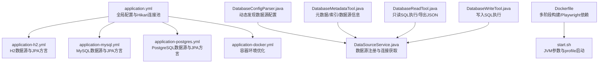
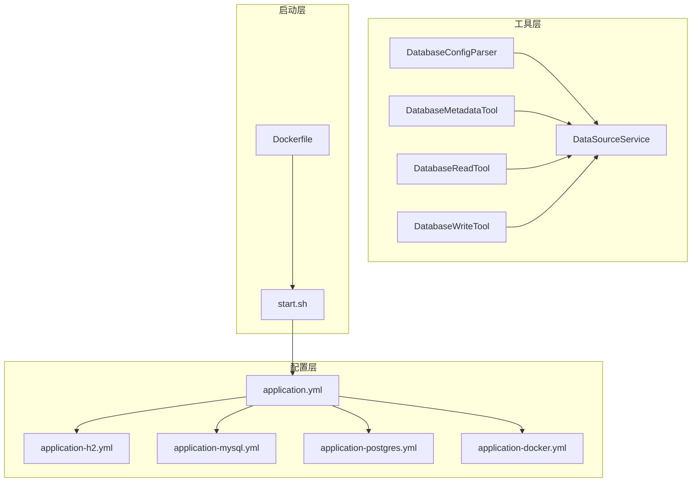
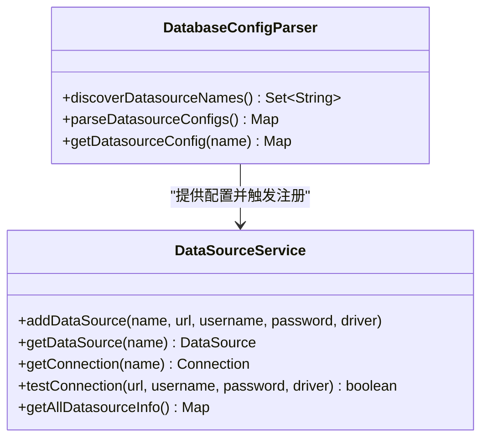
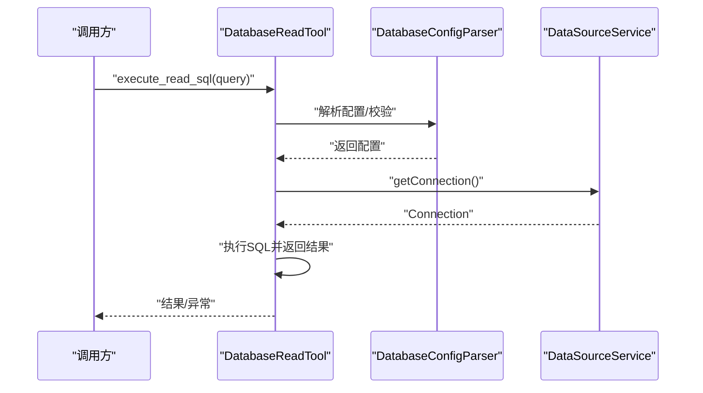
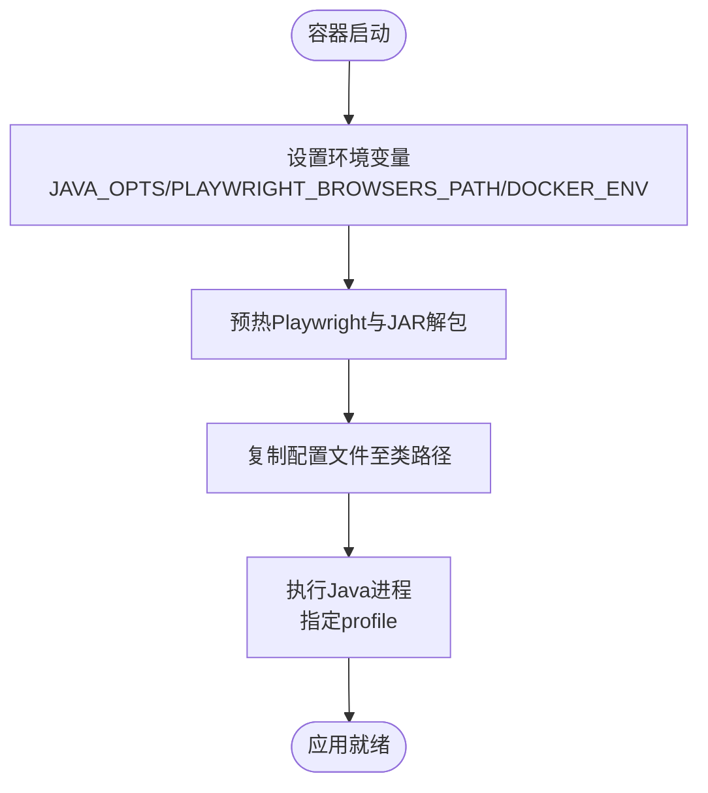
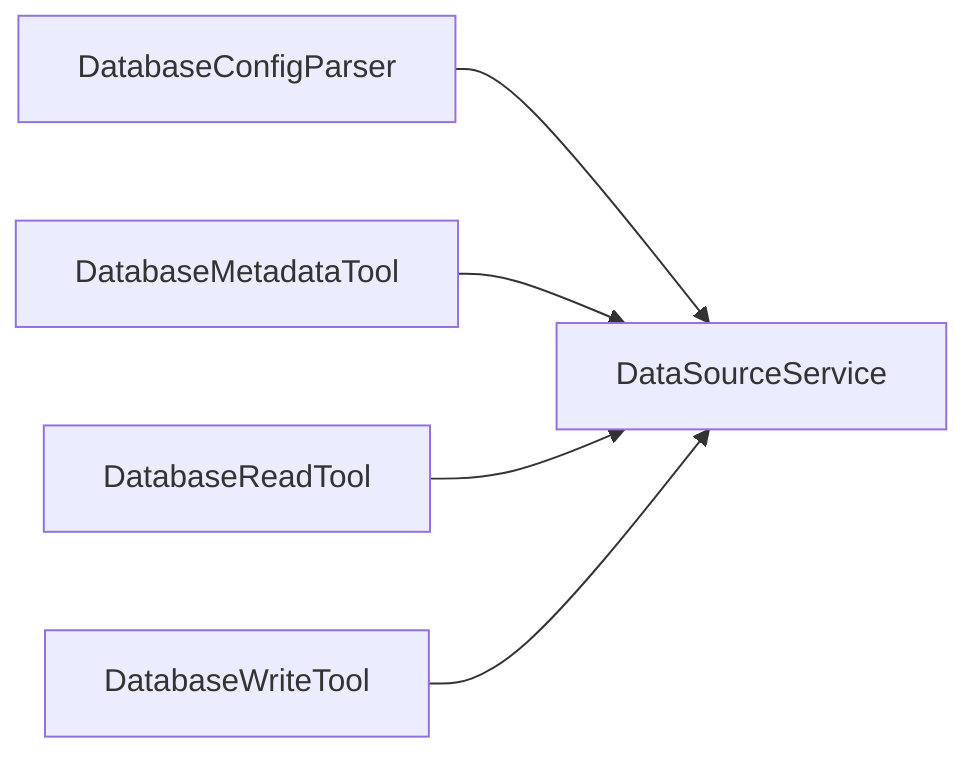

# 数据库部署

<cite>
**本文引用的文件**
- [application.yml](file://src/main/resources/application.yml)
- [application-h2.yml](file://src/main/resources/application-h2.yml)
- [application-mysql.yml](file://src/main/resources/application-mysql.yml)
- [application-postgres.yml](file://src/main/resources/application-postgres.yml)
- [application-docker.yml](file://src/main/resources/application-docker.yml)
- [DataSourceService.java](file://src/main/java/com/alibaba/cloud/ai/lynxe/tool/database/DataSourceService.java)
- [DatabaseConfigParser.java](file://src/main/java/com/alibaba/cloud/ai/lynxe/tool/database/DatabaseConfigParser.java)
- [DatabaseMetadataTool.java](file://src/main/java/com/alibaba/cloud/ai/lynxe/tool/database/DatabaseMetadataTool.java)
- [DatabaseReadTool.java](file://src/main/java/com/alibaba/cloud/ai/lynxe/tool/database/DatabaseReadTool.java)
- [DatabaseWriteTool.java](file://src/main/java/com/alibaba/cloud/ai/lynxe/tool/database/DatabaseWriteTool.java)
- [DatabaseConfigConstants.java](file://src/main/java/com/alibaba/cloud/ai/lynxe/tool/database/DatabaseConfigConstants.java)
- [start.sh](file://deploy/start.sh)
- [Dockerfile](file://deploy/Dockerfile)
</cite>

## 目录
1. [简介](#简介)
2. [项目结构](#项目结构)
3. [核心组件](#核心组件)
4. [架构总览](#架构总览)
5. [详细组件分析](#详细组件分析)
6. [依赖分析](#依赖分析)
7. [性能考虑](#性能考虑)
8. [故障排查指南](#故障排查指南)
9. [结论](#结论)
10. [附录](#附录)

## 简介
本文件面向Lynxe数据库部署与运维，系统性说明H2内存数据库、MySQL与PostgreSQL三种后端的部署配置、连接池与JPA/Hibernate行为、初始化与元数据能力、读写工具链、以及在容器环境中的启动流程。同时给出性能监控、慢查询定位、容量规划、备份恢复、增量迁移与版本升级的实践建议，并对主从复制、读写分离与高可用集群进行概念性说明与落地要点。

## 项目结构
围绕数据库相关的关键位置如下：
- 配置层：application.yml为主配置，按profile加载application-{h2|mysql|postgres|docker}.yml覆盖具体数据源与JPA方言、DDL策略等。
- 工具层：数据库元数据、只读查询、写入操作通过三个工具类统一编排，底层依赖DataSourceService与DatabaseConfigParser。
- 启动层：Dockerfile与start.sh负责容器内浏览器与JVM参数设置、应用启动。

图表来源
- [application.yml:1-97](file://src/main/resources/application.yml#L1-L97)
- [application-h2.yml:1-23](file://src/main/resources/application-h2.yml#L1-L23)
- [application-mysql.yml:1-15](file://src/main/resources/application-mysql.yml#L1-L15)
- [application-postgres.yml:1-15](file://src/main/resources/application-postgres.yml#L1-L15)
- [application-docker.yml:1-20](file://src/main/resources/application-docker.yml#L1-L20)
- [DatabaseConfigParser.java:1-194](file://src/main/java/com/alibaba/cloud/ai/lynxe/tool/database/DatabaseConfigParser.java#L1-L194)
- [DataSourceService.java:1-215](file://src/main/java/com/alibaba/cloud/ai/lynxe/tool/database/DataSourceService.java#L1-L215)
- [DatabaseMetadataTool.java:1-188](file://src/main/java/com/alibaba/cloud/ai/lynxe/tool/database/DatabaseMetadataTool.java#L1-L188)
- [DatabaseReadTool.java:1-166](file://src/main/java/com/alibaba/cloud/ai/lynxe/tool/database/DatabaseReadTool.java#L1-L166)
- [DatabaseWriteTool.java:1-142](file://src/main/java/com/alibaba/cloud/ai/lynxe/tool/database/DatabaseWriteTool.java#L1-L142)
- [Dockerfile:1-138](file://deploy/Dockerfile#L1-L138)
- [start.sh:1-91](file://deploy/start.sh#L1-L91)

章节来源
- [application.yml:1-97](file://src/main/resources/application.yml#L1-L97)
- [application-h2.yml:1-23](file://src/main/resources/application-h2.yml#L1-L23)
- [application-mysql.yml:1-15](file://src/main/resources/application-mysql.yml#L1-L15)
- [application-postgres.yml:1-15](file://src/main/resources/application-postgres.yml#L1-L15)
- [application-docker.yml:1-20](file://src/main/resources/application-docker.yml#L1-L20)
- [Dockerfile:1-138](file://deploy/Dockerfile#L1-L138)
- [start.sh:1-91](file://deploy/start.sh#L1-L91)

## 核心组件
- 全局配置与连接池
  - Hikari连接池参数集中于application.yml，包括最大池大小、最小空闲、连接超时、空闲超时、最大生存时间、泄漏检测阈值等。
  - JPA/Hibernate默认关闭Open Session In View，格式化SQL可按环境切换。
- 数据源配置
  - H2：本地文件型数据库，开启H2 Console，DDL策略为update；AI内存模块可启用H2。
  - MySQL：使用MySQL方言，DDL策略为update；AI内存模块可启用MySQL。
  - PostgreSQL：使用PostgreSQL方言，DDL策略为update；AI内存模块可启用PostgreSQL。
  - 容器环境：禁用SQL格式化以提升性能，启用无头浏览器模式。
- 动态数据源解析
  - DatabaseConfigParser基于约定前缀扫描并解析数据源配置，支持按名称获取配置与启用状态。
- 数据源服务
  - DataSourceService提供数据源注册、按名获取、连接测试、类型映射与统计等能力。
- 数据库工具
  - DatabaseMetadataTool：支持获取表元数据、索引、数据源信息。
  - DatabaseReadTool：支持只读SQL执行、导出结果为JSON文件。
  - DatabaseWriteTool：支持写入SQL执行。
- 启动与容器化
  - Dockerfile安装Playwright依赖与浏览器缓存，start.sh设置JVM参数并以profile启动应用。

章节来源
- [application.yml:19-38](file://src/main/resources/application.yml#L19-L38)
- [application-h2.yml:1-23](file://src/main/resources/application-h2.yml#L1-L23)
- [application-mysql.yml:1-15](file://src/main/resources/application-mysql.yml#L1-L15)
- [application-postgres.yml:1-15](file://src/main/resources/application-postgres.yml#L1-L15)
- [application-docker.yml:1-20](file://src/main/resources/application-docker.yml#L1-L20)
- [DatabaseConfigParser.java:44-69](file://src/main/java/com/alibaba/cloud/ai/lynxe/tool/database/DatabaseConfigParser.java#L44-L69)
- [DataSourceService.java:43-67](file://src/main/java/com/alibaba/cloud/ai/lynxe/tool/database/DataSourceService.java#L43-L67)
- [DatabaseMetadataTool.java:83-117](file://src/main/java/com/alibaba/cloud/ai/lynxe/tool/database/DatabaseMetadataTool.java#L83-L117)
- [DatabaseReadTool.java:87-120](file://src/main/java/com/alibaba/cloud/ai/lynxe/tool/database/DatabaseReadTool.java#L87-L120)
- [DatabaseWriteTool.java:78-96](file://src/main/java/com/alibaba/cloud/ai/lynxe/tool/database/DatabaseWriteTool.java#L78-L96)
- [Dockerfile:32-87](file://deploy/Dockerfile#L32-L87)
- [start.sh:80-91](file://deploy/start.sh#L80-L91)

## 架构总览
下图展示数据库相关组件在运行时的交互关系与职责边界。

图表来源
- [application.yml:1-97](file://src/main/resources/application.yml#L1-L97)
- [application-h2.yml:1-23](file://src/main/resources/application-h2.yml#L1-L23)
- [application-mysql.yml:1-15](file://src/main/resources/application-mysql.yml#L1-L15)
- [application-postgres.yml:1-15](file://src/main/resources/application-postgres.yml#L1-L15)
- [application-docker.yml:1-20](file://src/main/resources/application-docker.yml#L1-L20)
- [DatabaseConfigParser.java:1-194](file://src/main/java/com/alibaba/cloud/ai/lynxe/tool/database/DatabaseConfigParser.java#L1-L194)
- [DataSourceService.java:1-215](file://src/main/java/com/alibaba/cloud/ai/lynxe/tool/database/DataSourceService.java#L1-L215)
- [DatabaseMetadataTool.java:1-188](file://src/main/java/com/alibaba/cloud/ai/lynxe/tool/database/DatabaseMetadataTool.java#L1-L188)
- [DatabaseReadTool.java:1-166](file://src/main/java/com/alibaba/cloud/ai/lynxe/tool/database/DatabaseReadTool.java#L1-L166)
- [DatabaseWriteTool.java:1-142](file://src/main/java/com/alibaba/cloud/ai/lynxe/tool/database/DatabaseWriteTool.java#L1-L142)
- [Dockerfile:1-138](file://deploy/Dockerfile#L1-L138)
- [start.sh:1-91](file://deploy/start.sh#L1-L91)

## 详细组件分析

### 配置与连接池
- Hikari连接池关键参数
  - 最大池大小、最小空闲、连接超时、空闲超时、最大生存时间、验证超时、泄漏检测阈值等，均在application.yml中集中配置。
  - 连接测试查询固定为“SELECT 1”，确保健康检查有效。
- JPA/Hibernate行为
  - 默认关闭Open Session In View，避免潜在性能问题。
  - DDL策略统一为update，便于开发与测试环境快速演进。
  - 容器环境下可关闭SQL格式化以降低开销。
- 数据源方言
  - H2使用H2Dialect，MySQL使用MySQLDialect，PostgreSQL使用PostgreSQLDialect，确保SQL兼容与功能一致性。

章节来源
- [application.yml:19-38](file://src/main/resources/application.yml#L19-L38)
- [application-h2.yml:14-18](file://src/main/resources/application-h2.yml#L14-L18)
- [application-mysql.yml:7-11](file://src/main/resources/application-mysql.yml#L7-L11)
- [application-postgres.yml:11-14](file://src/main/resources/application-postgres.yml#L11-L14)
- [application-docker.yml:12-15](file://src/main/resources/application-docker.yml#L12-L15)

### 动态数据源解析与注册
- 解析规则
  - 基于约定前缀与属性键，扫描Environment中的所有配置项，提取数据源名称集合。
  - 支持按名称获取完整配置（类型、启用、URL、驱动、用户名、密码）。
- 注册与使用
  - DataSourceService提供addDataSource方法注册数据源，并维护名称到类型的映射。
  - 支持按名称获取DataSource或Connection，提供连接测试与统计信息。

图表来源
- [DatabaseConfigParser.java:44-69](file://src/main/java/com/alibaba/cloud/ai/lynxe/tool/database/DatabaseConfigParser.java#L44-L69)
- [DatabaseConfigParser.java:136-167](file://src/main/java/com/alibaba/cloud/ai/lynxe/tool/database/DatabaseConfigParser.java#L136-L167)
- [DataSourceService.java:43-67](file://src/main/java/com/alibaba/cloud/ai/lynxe/tool/database/DataSourceService.java#L43-L67)
- [DataSourceService.java:109-115](file://src/main/java/com/alibaba/cloud/ai/lynxe/tool/database/DataSourceService.java#L109-L115)
- [DataSourceService.java:192-212](file://src/main/java/com/alibaba/cloud/ai/lynxe/tool/database/DataSourceService.java#L192-L212)

章节来源
- [DatabaseConfigParser.java:44-69](file://src/main/java/com/alibaba/cloud/ai/lynxe/tool/database/DatabaseConfigParser.java#L44-L69)
- [DatabaseConfigParser.java:136-167](file://src/main/java/com/alibaba/cloud/ai/lynxe/tool/database/DatabaseConfigParser.java#L136-L167)
- [DataSourceService.java:43-67](file://src/main/java/com/alibaba/cloud/ai/lynxe/tool/database/DataSourceService.java#L43-L67)
- [DataSourceService.java:109-115](file://src/main/java/com/alibaba/cloud/ai/lynxe/tool/database/DataSourceService.java#L109-L115)
- [DataSourceService.java:192-212](file://src/main/java/com/alibaba/cloud/ai/lynxe/tool/database/DataSourceService.java#L192-L212)

### 数据库工具链（只读/写入/元数据）
- DatabaseReadTool
  - 仅允许SELECT语句，支持执行SQL与导出为JSON文件。
- DatabaseWriteTool
  - 仅支持写入SQL执行。
- DatabaseMetadataTool
  - 支持获取表元数据、索引、数据源信息；若按文本搜索无匹配则回退至全量列表。

图表来源
- [DatabaseReadTool.java:87-120](file://src/main/java/com/alibaba/cloud/ai/lynxe/tool/database/DatabaseReadTool.java#L87-L120)
- [DatabaseConfigParser.java:136-167](file://src/main/java/com/alibaba/cloud/ai/lynxe/tool/database/DatabaseConfigParser.java#L136-L167)
- [DataSourceService.java:85-91](file://src/main/java/com/alibaba/cloud/ai/lynxe/tool/database/DataSourceService.java#L85-L91)

章节来源
- [DatabaseReadTool.java:87-120](file://src/main/java/com/alibaba/cloud/ai/lynxe/tool/database/DatabaseReadTool.java#L87-L120)
- [DatabaseWriteTool.java:78-96](file://src/main/java/com/alibaba/cloud/ai/lynxe/tool/database/DatabaseWriteTool.java#L78-L96)
- [DatabaseMetadataTool.java:83-117](file://src/main/java/com/alibaba/cloud/ai/lynxe/tool/database/DatabaseMetadataTool.java#L83-L117)

### 容器化启动流程
- Dockerfile
  - 多阶段构建，安装Playwright依赖与浏览器缓存，预热JAR并设置必要目录。
  - 设置JAVA_OPTS、PLAYWRIGHT_BROWSERS_PATH、DOCKER_ENV等环境变量。
- start.sh
  - 输出系统与浏览器信息，设置PLAYWRIGHT_BROWSERS_PATH与DOCKER_ENV，以profile启动应用。

图表来源
- [Dockerfile:115-124](file://deploy/Dockerfile#L115-L124)
- [Dockerfile:92-109](file://deploy/Dockerfile#L92-L109)
- [start.sh:69-86](file://deploy/start.sh#L69-L86)
- [start.sh:89-91](file://deploy/start.sh#L89-L91)

章节来源
- [Dockerfile:115-124](file://deploy/Dockerfile#L115-L124)
- [Dockerfile:92-109](file://deploy/Dockerfile#L92-L109)
- [start.sh:69-86](file://deploy/start.sh#L69-L86)
- [start.sh:89-91](file://deploy/start.sh#L89-L91)

## 依赖分析
- 组件耦合
  - DatabaseConfigParser与DataSourceService松耦合，前者负责解析，后者负责注册与连接管理。
  - DatabaseMetadataTool/DatabaseReadTool/DatabaseWriteTool均依赖DataSourceService，形成统一入口。
- 外部依赖
  - H2/MySQL/PostgreSQL驱动由各profile配置注入，JPA方言随数据库类型切换。
- 潜在风险
  - DDL策略为update，适合开发环境；生产需谨慎，建议改为validate或手动迁移。
  - Hikari参数需结合业务QPS与RT调优，避免连接池耗尽或泄露。

图表来源
- [DatabaseConfigParser.java:1-194](file://src/main/java/com/alibaba/cloud/ai/lynxe/tool/database/DatabaseConfigParser.java#L1-L194)
- [DataSourceService.java:1-215](file://src/main/java/com/alibaba/cloud/ai/lynxe/tool/database/DataSourceService.java#L1-L215)
- [DatabaseMetadataTool.java:1-188](file://src/main/java/com/alibaba/cloud/ai/lynxe/tool/database/DatabaseMetadataTool.java#L1-L188)
- [DatabaseReadTool.java:1-166](file://src/main/java/com/alibaba/cloud/ai/lynxe/tool/database/DatabaseReadTool.java#L1-L166)
- [DatabaseWriteTool.java:1-142](file://src/main/java/com/alibaba/cloud/ai/lynxe/tool/database/DatabaseWriteTool.java#L1-L142)

章节来源
- [DatabaseConfigParser.java:1-194](file://src/main/java/com/alibaba/cloud/ai/lynxe/tool/database/DatabaseConfigParser.java#L1-L194)
- [DataSourceService.java:1-215](file://src/main/java/com/alibaba/cloud/ai/lynxe/tool/database/DataSourceService.java#L1-L215)
- [DatabaseMetadataTool.java:1-188](file://src/main/java/com/alibaba/cloud/ai/lynxe/tool/database/DatabaseMetadataTool.java#L1-L188)
- [DatabaseReadTool.java:1-166](file://src/main/java/com/alibaba/cloud/ai/lynxe/tool/database/DatabaseReadTool.java#L1-L166)
- [DatabaseWriteTool.java:1-142](file://src/main/java/com/alibaba/cloud/ai/lynxe/tool/database/DatabaseWriteTool.java#L1-L142)

## 性能考虑
- 连接池与线程
  - 结合业务峰值QPS与平均RT，调整maximum-pool-size与minimum-idle；合理设置connection-timeout与idle-timeout，避免连接风暴与资源浪费。
- SQL与JPA
  - 生产环境建议关闭show-sql与format_sql，减少日志与序列化开销。
  - 使用分页查询、批量写入、合适的索引，避免全表扫描。
- 缓存与会话
  - 关闭Open Session In View，避免长事务持有连接。
- 容器性能
  - 在容器环境禁用SQL格式化，合理设置JVM堆与GC参数，启用容器感知GC。
- 监控与诊断
  - 使用HikariCP指标（活跃连接、空闲连接、等待时间、连接泄漏计数）与数据库慢查询日志配合定位瓶颈。

[本节为通用性能建议，无需列出章节来源]

## 故障排查指南
- 连接失败
  - 使用DataSourceService.testConnection进行连通性验证，核对URL、驱动、用户名与密码。
  - 检查Hikari连接池参数是否过严（如超时过短），适当放宽。
- 配置未生效
  - 确认profile正确激活（H2/MySQL/PostgreSQL），检查application-{h2|mysql|postgres}.yml是否被加载。
  - 使用DatabaseConfigParser.discoverDatasourceNames确认动态发现是否识别到目标数据源。
- 只读/写入限制
  - DatabaseReadTool仅允许SELECT；DatabaseWriteTool仅支持写入动作。请根据需求选择对应工具。
- 容器环境
  - 确认PLAYWRIGHT_BROWSERS_PATH与DOCKER_ENV已设置；检查start.sh输出的系统信息与浏览器状态。

章节来源
- [DataSourceService.java:192-212](file://src/main/java/com/alibaba/cloud/ai/lynxe/tool/database/DataSourceService.java#L192-L212)
- [DatabaseReadTool.java:96-101](file://src/main/java/com/alibaba/cloud/ai/lynxe/tool/database/DatabaseReadTool.java#L96-L101)
- [DatabaseWriteTool.java:85-87](file://src/main/java/com/alibaba/cloud/ai/lynxe/tool/database/DatabaseWriteTool.java#L85-L87)
- [start.sh:69-86](file://deploy/start.sh#L69-L86)

## 结论
Lynxe通过profile化的数据源配置与统一的工具链，实现了对H2、MySQL与PostgreSQL的灵活适配。结合HikariCP与JPA/Hibernate的合理配置，可在不同环境中获得稳定性能。生产落地建议以validate或手工迁移替代update，完善监控与慢查询分析，并在容器中启用无头浏览器与合理的JVM参数。

[本节为总结性内容，无需列出章节来源]

## 附录

### 部署配置清单（按数据库类型）
- H2（开发/测试）
  - 数据源：本地文件型，开启H2 Console，DDL策略update。
  - JPA方言：H2Dialect。
  - AI内存：可启用H2。
- MySQL（通用）
  - 数据源：远程主机，DDL策略update。
  - JPA方言：MySQLDialect。
  - AI内存：可启用MySQL。
- PostgreSQL（企业级）
  - 数据源：远程主机，DDL策略update。
  - JPA方言：PostgreSQLDialect。
  - AI内存：可启用PostgreSQL。

章节来源
- [application-h2.yml:1-23](file://src/main/resources/application-h2.yml#L1-L23)
- [application-mysql.yml:1-15](file://src/main/resources/application-mysql.yml#L1-L15)
- [application-postgres.yml:1-15](file://src/main/resources/application-postgres.yml#L1-L15)

### 初始化脚本与表结构设计
- 初始化策略
  - 当前采用JPA自动DDL（update），适用于快速迭代；生产建议改为validate或通过Flyway/Liquibase进行受控迁移。
- 表结构与索引
  - 建议遵循业务主键/外键约束，为高频查询字段建立合适索引；避免过度索引导致写入成本上升。
  - 对时间范围查询、模糊匹配与聚合场景分别设计索引策略。

[本节为通用设计建议，无需列出章节来源]

### 连接池、事务与并发控制
- 连接池
  - HikariCP参数需结合QPS、RT与数据库承载能力调优；关注连接泄漏检测阈值与空闲回收策略。
- 事务隔离级别
  - 默认隔离级别由数据库与驱动决定；对于强一致要求的场景，建议显式设置事务隔离级别并控制事务范围。
- 并发控制
  - 使用行级锁、乐观锁或分布式锁应对高并发写入；对热点表实施分片或读写分离。

[本节为通用实践建议，无需列出章节来源]

### 备份、恢复、增量迁移与版本升级
- 备份与恢复
  - H2：定期备份文件型数据库目录；MySQL/PostgreSQL：使用官方逻辑/物理备份工具，制定恢复演练计划。
- 增量迁移
  - 使用Flyway/Liquibase管理版本与迁移脚本，确保迁移幂等与可回滚。
- 版本升级
  - 分批滚动升级，先灰度节点，再切换流量；升级前后进行兼容性与性能回归测试。

[本节为通用运维建议，无需列出章节来源]

### 主从复制、读写分离与高可用集群
- 主从复制
  - MySQL：基于binlog的异步/半同步复制；PostgreSQL：逻辑复制或物理复制。
- 读写分离
  - 通过中间件或应用侧路由实现；写入走主库，读取走从库；注意最终一致性与读偏移。
- 高可用集群
  - MySQL：Group Replication或MGR；PostgreSQL：Patroni+HAProxy；H2：单实例或共享存储方案（不推荐生产）。

[本节为概念性说明，无需列出章节来源]