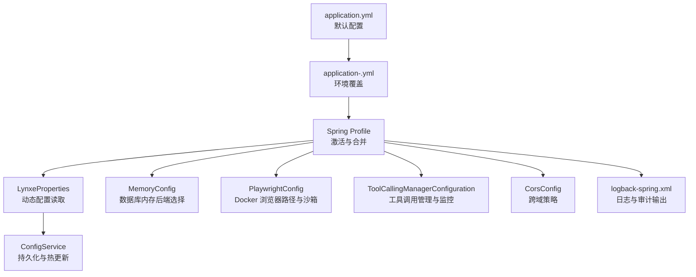
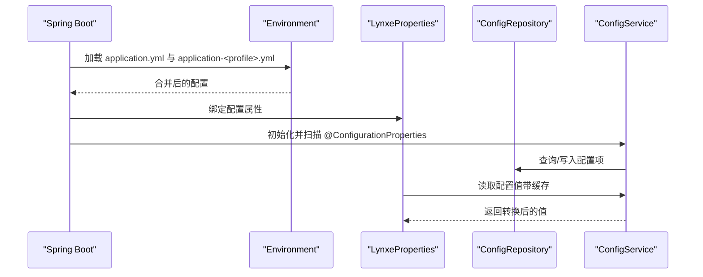
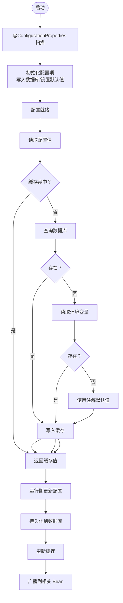
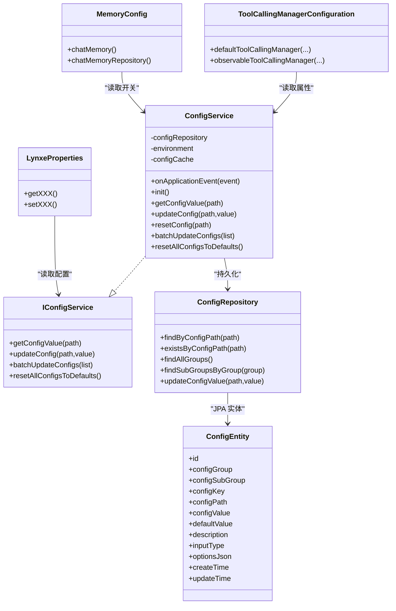

# 环境配置管理

<cite>
**本文引用的文件**
- [application.yml](file://src/main/resources/application.yml)
- [application-docker.yml](file://src/main/resources/application-docker.yml)
- [application-h2.yml](file://src/main/resources/application-h2.yml)
- [application-mysql.yml](file://src/main/resources/application-mysql.yml)
- [application-postgres.yml](file://src/main/resources/application-postgres.yml)
- [logback-spring.xml](file://src/main/resources/logback-spring.xml)
- [LynxeProperties.java](file://src/main/java/com/alibaba/cloud/ai/lynxe/config/LynxeProperties.java)
- [ConfigService.java](file://src/main/java/com/alibaba/cloud/ai/lynxe/config/ConfigService.java)
- [IConfigService.java](file://src/main/java/com/alibaba/cloud/ai/lynxe/config/IConfigService.java)
- [ConfigEntity.java](file://src/main/java/com/alibaba/cloud/ai/lynxe/config/entity/ConfigEntity.java)
- [ConfigRepository.java](file://src/main/java/com/alibaba/cloud/ai/lynxe/config/repository/ConfigRepository.java)
- [MemoryConfig.java](file://src/main/java/com/alibaba/cloud/ai/lynxe/config/MemoryConfig.java)
- [CorsConfig.java](file://src/main/java/com/alibaba/cloud/ai/lynxe/config/CorsConfig.java)
- [PlaywrightConfig.java](file://src/main/java/com/alibaba/cloud/ai/lynxe/config/PlaywrightConfig.java)
- [ToolCallingManagerConfiguration.java](file://src/main/java/com/alibaba/cloud/ai/lynxe/config/ToolCallingManagerConfiguration.java)
</cite>

## 目录
1. [简介](#简介)
2. [项目结构](#项目结构)
3. [核心组件](#核心组件)
4. [架构总览](#架构总览)
5. [详细组件分析](#详细组件分析)
6. [依赖分析](#依赖分析)
7. [性能考虑](#性能考虑)
8. [故障排查指南](#故障排查指南)
9. [结论](#结论)
10. [附录](#附录)

## 简介
本文件系统性梳理 Lynxe 的环境配置管理，涵盖多环境配置文件结构、配置优先级与覆盖规则、数据库配置切换与连接池参数、事务管理、缓存与会话、安全与 CORS、日志级别与审计、性能监控、配置热更新与动态配置、以及环境变量注入与敏感信息保护策略。目标是帮助运维与开发人员在不同部署环境（本地、容器、生产）下快速正确地完成配置与调优。

## 项目结构
Lynxe 的配置体系由以下层次构成：
- 多环境 YAML 配置文件：定义默认配置与各环境覆盖项
- Spring Boot 自动装配与条件化配置：按 profile 切换数据库、内存、浏览器等行为
- 动态配置服务：运行期持久化与热更新配置项
- 日志与监控：统一的日志输出与可选的可观测性集成
- 安全与跨域：CORS 与浏览器安全设置

图表来源
- [application.yml:1-97](file://src/main/resources/application.yml#L1-L97)
- [application-docker.yml:1-20](file://src/main/resources/application-docker.yml#L1-L20)
- [application-h2.yml:1-23](file://src/main/resources/application-h2.yml#L1-L23)
- [application-mysql.yml:1-15](file://src/main/resources/application-mysql.yml#L1-L15)
- [application-postgres.yml:1-15](file://src/main/resources/application-postgres.yml#L1-L15)
- [LynxeProperties.java:27-654](file://src/main/java/com/alibaba/cloud/ai/lynxe/config/LynxeProperties.java#L27-L654)
- [ConfigService.java:41-320](file://src/main/java/com/alibaba/cloud/ai/lynxe/config/ConfigService.java#L41-L320)
- [MemoryConfig.java:35-73](file://src/main/java/com/alibaba/cloud/ai/lynxe/config/MemoryConfig.java#L35-L73)
- [PlaywrightConfig.java:29-150](file://src/main/java/com/alibaba/cloud/ai/lynxe/config/PlaywrightConfig.java#L29-L150)
- [ToolCallingManagerConfiguration.java:39-117](file://src/main/java/com/alibaba/cloud/ai/lynxe/config/ToolCallingManagerConfiguration.java#L39-L117)
- [CorsConfig.java:28-41](file://src/main/java/com/alibaba/cloud/ai/lynxe/config/CorsConfig.java#L28-L41)
- [logback-spring.xml:1-185](file://src/main/resources/logback-spring.xml#L1-L185)

章节来源
- [application.yml:1-97](file://src/main/resources/application.yml#L1-L97)
- [application-docker.yml:1-20](file://src/main/resources/application-docker.yml#L1-L20)
- [application-h2.yml:1-23](file://src/main/resources/application-h2.yml#L1-L23)
- [application-mysql.yml:1-15](file://src/main/resources/application-mysql.yml#L1-L15)
- [application-postgres.yml:1-15](file://src/main/resources/application-postgres.yml#L1-L15)

## 核心组件
- 多环境配置文件
  - 默认配置：端口、Spring 主配置、文件上传、计划轮询、命名空间、代理序列化等
  - 环境覆盖：Docker 环境下的 Headless 浏览器与 SQL 格式化优化、H2/MySQL/Postgres 数据源与方言
- 动态配置系统
  - 基于注解的配置属性定义与读取
  - 运行期持久化、缓存与批量更新
- 日志与审计
  - 多级别滚动日志、LLM 请求与流式进度专项日志
- 安全与跨域
  - CORS 全开放策略（注意生产环境建议收紧）
  - Playwright Docker 环境安全与沙箱配置
- 性能监控
  - 工具调用管理器的可选可观测性实现

章节来源
- [LynxeProperties.java:27-654](file://src/main/java/com/alibaba/cloud/ai/lynxe/config/LynxeProperties.java#L27-L654)
- [ConfigService.java:41-320](file://src/main/java/com/alibaba/cloud/ai/lynxe/config/ConfigService.java#L41-L320)
- [logback-spring.xml:1-185](file://src/main/resources/logback-spring.xml#L1-L185)
- [CorsConfig.java:28-41](file://src/main/java/com/alibaba/cloud/ai/lynxe/config/CorsConfig.java#L28-L41)
- [PlaywrightConfig.java:29-150](file://src/main/java/com/alibaba/cloud/ai/lynxe/config/PlaywrightConfig.java#L29-L150)
- [ToolCallingManagerConfiguration.java:39-117](file://src/main/java/com/alibaba/cloud/ai/lynxe/config/ToolCallingManagerConfiguration.java#L39-L117)

## 架构总览
Lynxe 的配置管理采用“YAML 层 + 运行时动态层”的双层架构：
- YAML 层：通过 Spring Profile 激活与合并，决定数据源、JPA 方言、浏览器模式、日志级别等
- 动态层：基于注解扫描与持久化，支持运行期修改并即时生效到业务对象

图表来源
- [application.yml:1-97](file://src/main/resources/application.yml#L1-L97)
- [application-docker.yml:1-20](file://src/main/resources/application-docker.yml#L1-L20)
- [LynxeProperties.java:27-654](file://src/main/java/com/alibaba/cloud/ai/lynxe/config/LynxeProperties.java#L27-L654)
- [ConfigService.java:41-320](file://src/main/java/com/alibaba/cloud/ai/lynxe/config/ConfigService.java#L41-L320)
- [ConfigRepository.java:31-101](file://src/main/java/com/alibaba/cloud/ai/lynxe/config/repository/ConfigRepository.java#L31-L101)

## 详细组件分析

### 多环境配置文件结构与优先级
- 优先级顺序（从低到高）：
  1) application.yml（默认）
  2) application-<profile>.yml（如 application-docker.yml、application-h2.yml、application-mysql.yml、application-postgres.yml）
  3) 环境变量与命令行参数（Spring Boot 默认覆盖规则）
- 关键覆盖点：
  - 数据源：通过 profile 切换 H2/MySQL/Postgres，并设置方言与 DDL 行为
  - JPA：H2 开启控制台，其他数据库关闭 SQL 格式化以提升容器性能
  - 浏览器：Docker 下默认 Headless，请求超时可调
  - 日志：Docker 环境下根日志级别提升至 INFO

章节来源
- [application.yml:1-97](file://src/main/resources/application.yml#L1-L97)
- [application-docker.yml:1-20](file://src/main/resources/application-docker.yml#L1-L20)
- [application-h2.yml:1-23](file://src/main/resources/application-h2.yml#L1-L23)
- [application-mysql.yml:1-15](file://src/main/resources/application-mysql.yml#L1-L15)
- [application-postgres.yml:1-15](file://src/main/resources/application-postgres.yml#L1-L15)

### 数据库配置切换、连接池与事务
- 数据源切换
  - H2：内置控制台、文件型数据库、DDL 自动更新
  - MySQL/Postgres：指定驱动、URL、用户名与密码、方言与 DDL
- 连接池（HikariCP）
  - 参数：最大池大小、最小空闲、连接超时、空闲超时、最大生存时间、泄漏检测阈值、校验超时、测试查询
  - 名称：包含当前 profile 的连接池名称，便于区分
- 事务管理
  - 默认使用 Spring 声明式事务；JPA 配置中未显式声明事务管理器 Bean，使用默认实现
  - 建议：在生产环境明确配置事务传播与回滚规则，确保数据一致性

章节来源
- [application.yml:19-31](file://src/main/resources/application.yml#L19-L31)
- [application-h2.yml:1-23](file://src/main/resources/application-h2.yml#L1-L23)
- [application-mysql.yml:1-15](file://src/main/resources/application-mysql.yml#L1-L15)
- [application-postgres.yml:1-15](file://src/main/resources/application-postgres.yml#L1-L15)

### 缓存、会话与聊天记忆
- 聊天记忆后端
  - 通过 spring.ai.memory.<db>.enabled 开关选择 MySQL/Postgres/H2
  - 未启用任何后端时抛出异常，需至少启用一种
- 会话与缓存
  - 未发现显式的分布式缓存或会话持久化配置
  - 如需扩展，建议结合 Redis 或数据库实现

章节来源
- [MemoryConfig.java:35-73](file://src/main/java/com/alibaba/cloud/ai/lynxe/config/MemoryConfig.java#L35-L73)
- [application-h2.yml:20-23](file://src/main/resources/application-h2.yml#L20-L23)
- [application-mysql.yml:11-15](file://src/main/resources/application-mysql.yml#L11-L15)
- [application-postgres.yml:7-11](file://src/main/resources/application-postgres.yml#L7-L11)

### 安全与跨域
- CORS
  - 对 /api/** 开放所有来源、方法与头，不支持凭据
  - 生产环境建议限制来源、方法与头，并开启凭据支持
- Playwright（Docker）
  - 自动设置浏览器路径、跳过下载、启用无头与沙箱
  - 可通过环境变量注入浏览器路径与行为

章节来源
- [CorsConfig.java:28-41](file://src/main/java/com/alibaba/cloud/ai/lynxe/config/CorsConfig.java#L28-L41)
- [PlaywrightConfig.java:29-150](file://src/main/java/com/alibaba/cloud/ai/lynxe/config/PlaywrightConfig.java#L29-L150)
- [application-docker.yml:4-9](file://src/main/resources/application-docker.yml#L4-L9)

### 日志级别、审计与性能监控
- 日志输出
  - 控制台：阈值 WARN
  - 文件：DEBUG/INFO/WARN/ERROR 分级滚动，大小与历史保留策略
  - 专项日志：LLM 请求与流式进度独立文件，便于审计与问题定位
- 性能监控
  - 工具调用管理器支持可选的可观测性实现（通过属性开关启用）
  - 未启用时使用默认实现

章节来源
- [logback-spring.xml:1-185](file://src/main/resources/logback-spring.xml#L1-L185)
- [ToolCallingManagerConfiguration.java:39-117](file://src/main/java/com/alibaba/cloud/ai/lynxe/config/ToolCallingManagerConfiguration.java#L39-L117)

### 配置热更新、动态配置与覆盖规则
- 动态配置模型
  - ConfigEntity：持久化配置项（分组、子组、键、路径、默认值、描述、输入类型、选项 JSON）
  - ConfigRepository：按路径、分组查询与批量更新
  - IConfigService/ConfigService：初始化、清理过时配置、缓存、类型转换、批量更新、重置默认值
- 覆盖规则
  - 启动阶段：扫描 @ConfigurationProperties 注解的 Bean，生成配置项并写入数据库
  - 运行期：优先读取数据库值，其次读取环境变量，最后回退到注解默认值
  - 缓存：命中即返回，未命中或过期则查询数据库并写入缓存
- 热更新流程

图表来源
- [ConfigService.java:67-163](file://src/main/java/com/alibaba/cloud/ai/lynxe/config/ConfigService.java#L67-L163)
- [ConfigService.java:165-245](file://src/main/java/com/alibaba/cloud/ai/lynxe/config/ConfigService.java#L165-L245)
- [ConfigEntity.java:33-218](file://src/main/java/com/alibaba/cloud/ai/lynxe/config/entity/ConfigEntity.java#L33-L218)
- [ConfigRepository.java:31-101](file://src/main/java/com/alibaba/cloud/ai/lynxe/config/repository/ConfigRepository.java#L31-L101)

章节来源
- [LynxeProperties.java:27-654](file://src/main/java/com/alibaba/cloud/ai/lynxe/config/LynxeProperties.java#L27-L654)
- [ConfigService.java:41-320](file://src/main/java/com/alibaba/cloud/ai/lynxe/config/ConfigService.java#L41-L320)
- [IConfigService.java:27-81](file://src/main/java/com/alibaba/cloud/ai/lynxe/config/IConfigService.java#L27-L81)
- [ConfigEntity.java:33-218](file://src/main/java/com/alibaba/cloud/ai/lynxe/config/entity/ConfigEntity.java#L33-L218)
- [ConfigRepository.java:31-101](file://src/main/java/com/alibaba/cloud/ai/lynxe/config/repository/ConfigRepository.java#L31-L101)

### 环境变量注入、密钥管理与敏感信息保护
- 环境变量注入
  - 动态配置：ConfigService 在初始化时从 Environment 读取同名配置路径的值作为默认值
  - Playwright：通过环境变量注入浏览器路径与跳过下载行为
- 敏感信息保护
  - 当前未见专用的密钥管理或配置加密实现
  - 建议：在 CI/CD 中使用受控密钥管理服务注入敏感值，避免硬编码在仓库中

章节来源
- [ConfigService.java:125-133](file://src/main/java/com/alibaba/cloud/ai/lynxe/config/ConfigService.java#L125-L133)
- [PlaywrightConfig.java:37-77](file://src/main/java/com/alibaba/cloud/ai/lynxe/config/PlaywrightConfig.java#L37-L77)

## 依赖分析
- 组件耦合
  - LynxeProperties 依赖 IConfigService 提供运行期配置值
  - ConfigService 依赖 ConfigRepository 与 Environment，负责初始化、缓存与广播更新
  - MemoryConfig 依赖 spring.ai.memory.* 开关选择具体 ChatMemoryRepository 实现
  - ToolCallingManagerConfiguration 条件化注册工具调用管理器 Bean
- 外部依赖
  - Spring Boot、Spring Data JPA、HikariCP、Logback、Spring AI（工具调用与聊天记忆）

图表来源
- [LynxeProperties.java:27-654](file://src/main/java/com/alibaba/cloud/ai/lynxe/config/LynxeProperties.java#L27-L654)
- [IConfigService.java:27-81](file://src/main/java/com/alibaba/cloud/ai/lynxe/config/IConfigService.java#L27-L81)
- [ConfigService.java:41-320](file://src/main/java/com/alibaba/cloud/ai/lynxe/config/ConfigService.java#L41-L320)
- [ConfigRepository.java:31-101](file://src/main/java/com/alibaba/cloud/ai/lynxe/config/repository/ConfigRepository.java#L31-L101)
- [ConfigEntity.java:33-218](file://src/main/java/com/alibaba/cloud/ai/lynxe/config/entity/ConfigEntity.java#L33-L218)
- [MemoryConfig.java:35-73](file://src/main/java/com/alibaba/cloud/ai/lynxe/config/MemoryConfig.java#L35-L73)
- [ToolCallingManagerConfiguration.java:39-117](file://src/main/java/com/alibaba/cloud/ai/lynxe/config/ToolCallingManagerConfiguration.java#L39-L117)

章节来源
- [LynxeProperties.java:27-654](file://src/main/java/com/alibaba/cloud/ai/lynxe/config/LynxeProperties.java#L27-L654)
- [ConfigService.java:41-320](file://src/main/java/com/alibaba/cloud/ai/lynxe/config/ConfigService.java#L41-L320)
- [ConfigRepository.java:31-101](file://src/main/java/com/alibaba/cloud/ai/lynxe/config/repository/ConfigRepository.java#L31-L101)
- [ConfigEntity.java:33-218](file://src/main/java/com/alibaba/cloud/ai/lynxe/config/entity/ConfigEntity.java#L33-L218)
- [MemoryConfig.java:35-73](file://src/main/java/com/alibaba/cloud/ai/lynxe/config/MemoryConfig.java#L35-L73)
- [ToolCallingManagerConfiguration.java:39-117](file://src/main/java/com/alibaba/cloud/ai/lynxe/config/ToolCallingManagerConfiguration.java#L39-L117)

## 性能考虑
- 连接池参数建议
  - 根据并发与数据库能力调整最大池大小与空闲阈值
  - 设置合理的连接超时与空闲超时，避免资源泄露
- JPA 与 SQL
  - 容器环境下关闭 SQL 格式化以减少开销
  - 合理设置 DDL 行为，避免频繁迁移影响启动时间
- 日志
  - 生产环境建议降低 DEBUG/INFO 输出量，仅保留必要级别
  - 使用滚动策略控制磁盘占用
- 工具调用与监控
  - 在高负载场景启用可观测性实现，但需评估额外开销

[本节为通用指导，无需列出章节来源]

## 故障排查指南
- 配置未生效
  - 检查是否正确激活 profile（如 h2、mysql、postgres、docker）
  - 确认运行期更新后是否触发了缓存失效与 Bean 广播
- 数据库无法连接
  - 核对 URL、驱动、用户名与密码
  - 检查连接池参数与网络连通性
- CORS 导致跨域失败
  - 生产环境请限制允许来源与方法，避免使用通配符
- 日志过大或磁盘不足
  - 调整滚动策略与保留天数，或降低日志级别
- Docker 环境浏览器问题
  - 确认 PLAYWRIGHT_BROWSERS_PATH 与 PLAYWRIGHT_SKIP_BROWSER_DOWNLOAD 环境变量设置
  - 检查无头模式与沙箱参数

章节来源
- [application.yml:6-7](file://src/main/resources/application.yml#L6-L7)
- [application-docker.yml:4-9](file://src/main/resources/application-docker.yml#L4-L9)
- [application-docker.yml:11-15](file://src/main/resources/application-docker.yml#L11-L15)
- [logback-spring.xml:46-55](file://src/main/resources/logback-spring.xml#L46-L55)
- [logback-spring.xml:58-74](file://src/main/resources/logback-spring.xml#L58-L74)
- [PlaywrightConfig.java:37-77](file://src/main/java/com/alibaba/cloud/ai/lynxe/config/PlaywrightConfig.java#L37-L77)

## 结论
Lynxe 的配置体系通过“YAML 多环境 + 运行时动态配置”实现了灵活的环境适配与在线调优。建议在生产环境中：
- 明确限制 CORS 策略
- 使用受控密钥管理注入敏感信息
- 结合监控与日志策略进行容量与性能规划
- 严格控制数据库 DDL 行为与连接池参数

[本节为总结性内容，无需列出章节来源]

## 附录
- 常用配置路径示例（来源于注解与 YAML）
  - 数据库：spring.datasource.*、spring.jpa.*
  - 连接池：spring.datasource.hikari.*
  - 计划轮询：lynxe.plan.polling.*
  - 文件上传：lynxe.file-upload.*
  - 浏览览器：lynxe.browser.*
  - 日志：logging.level.*

[本节为概览性内容，无需列出章节来源]