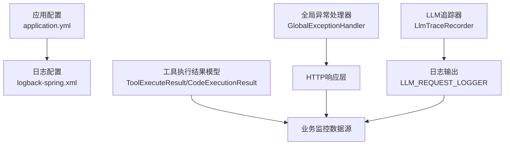
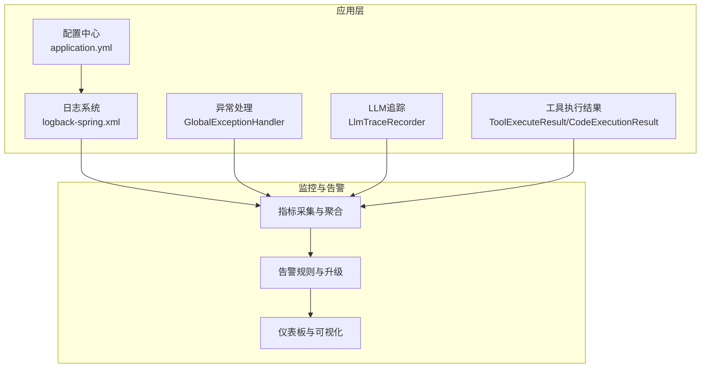
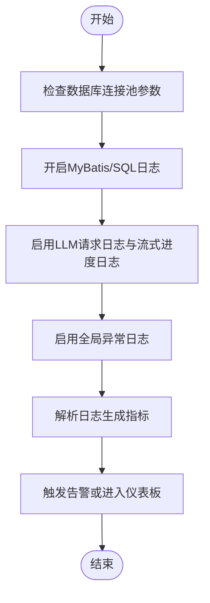
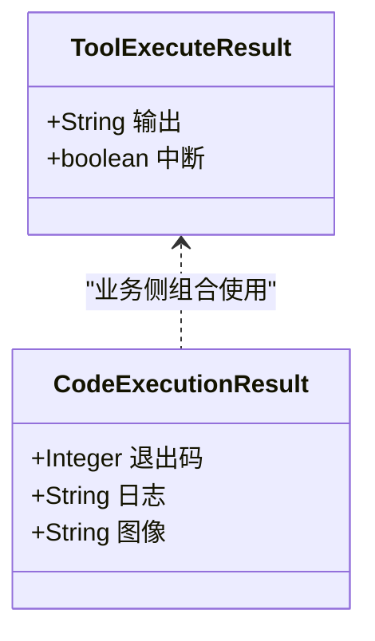
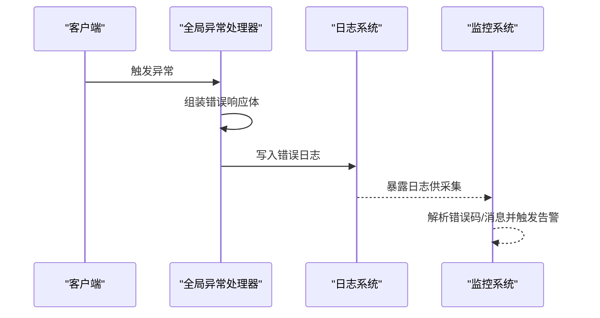
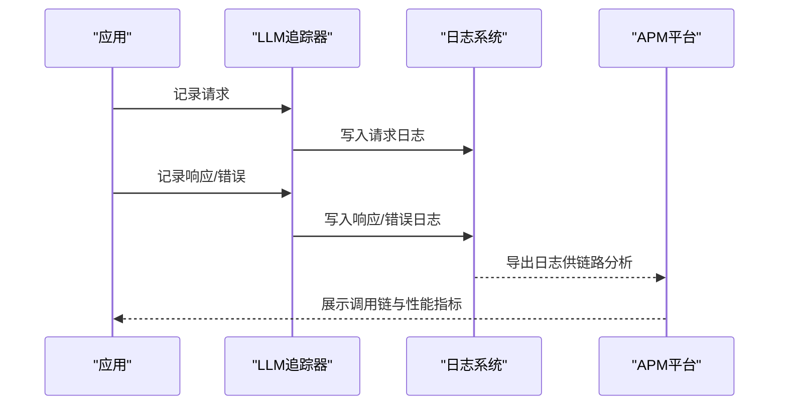
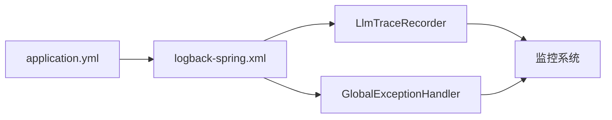

# 监控告警

<cite>
**本文引用的文件**
- [application.yml](file://src/main/resources/application.yml)
- [logback-spring.xml](file://src/main/resources/logback-spring.xml)
- [GlobalExceptionHandler.java](file://src/main/java/com/alibaba/cloud/ai/lynxe/exception/handler/GlobalExceptionHandler.java)
- [LlmTraceRecorder.java](file://src/main/java/com/alibaba/cloud/ai/lynxe/llm/LlmTraceRecorder.java)
- [CodeExecutionResult.java](file://src/main/java/com/alibaba/cloud/ai/lynxe/tool/code/CodeExecutionResult.java)
- [ToolExecuteResult.java](file://src/main/java/com/alibaba/cloud/ai/lynxe/tool/code/ToolExecuteResult.java)
</cite>

## 目录
1. [简介](#简介)
2. [项目结构](#项目结构)
3. [核心组件](#核心组件)
4. [架构总览](#架构总览)
5. [详细组件分析](#详细组件分析)
6. [依赖关系分析](#依赖关系分析)
7. [性能考量](#性能考量)
8. [故障排查指南](#故障排查指南)
9. [结论](#结论)
10. [附录](#附录)

## 简介
本文件面向Lynxe监控告警系统的运维与开发人员，系统性梳理应用指标采集、性能监控、业务监控配置；日志聚合、错误追踪与异常告警机制；APM工具集成、分布式链路追踪与调用链分析；系统资源监控、数据库性能监控与第三方服务监控；告警规则配置、通知渠道设置与告警升级策略；以及监控仪表板、可视化展示与趋势分析能力。本文所有技术细节均基于仓库中现有实现进行归纳与扩展建议。

## 项目结构
Lynxe后端采用Spring Boot工程，监控相关能力主要由以下模块构成：
- 应用配置与日志：通过application.yml与logback-spring.xml统一管理运行参数与日志输出策略
- 全局异常处理：统一捕获未预期异常并返回标准化错误响应
- LLM请求追踪：对LLM请求/响应与错误进行结构化记录
- 工具执行结果：封装代码类工具的执行状态与输出，便于监控与告警

图表来源
- [application.yml:1-97](file://src/main/resources/application.yml#L1-L97)
- [logback-spring.xml:1-185](file://src/main/resources/logback-spring.xml#L1-L185)
- [GlobalExceptionHandler.java:1-69](file://src/main/java/com/alibaba/cloud/ai/lynxe/exception/handler/GlobalExceptionHandler.java#L1-L69)
- [LlmTraceRecorder.java:1-156](file://src/main/java/com/alibaba/cloud/ai/lynxe/llm/LlmTraceRecorder.java#L1-L156)
- [ToolExecuteResult.java:1-60](file://src/main/java/com/alibaba/cloud/ai/lynxe/tool/code/ToolExecuteResult.java#L1-L60)
- [CodeExecutionResult.java:1-51](file://src/main/java/com/alibaba/cloud/ai/lynxe/tool/code/CodeExecutionResult.java#L1-L51)

章节来源
- [application.yml:1-97](file://src/main/resources/application.yml#L1-L97)
- [logback-spring.xml:1-185](file://src/main/resources/logback-spring.xml#L1-L185)

## 核心组件
- 应用配置与日志
  - application.yml集中定义服务器端口、数据库连接池参数、JPA行为、日志路径与级别、计划轮询策略、文件上传限制等
  - logback-spring.xml定义控制台与多文件Appender，按级别分片滚动，并为LLM请求与流式进度单独配置专用日志通道
- 全局异常处理
  - GlobalExceptionHandler统一拦截计划执行异常与模板配置异常，返回结构化错误信息，便于前端与监控系统识别
- LLM请求追踪
  - LlmTraceRecorder在请求生命周期内记录请求/响应JSON与字符计数，并对第三方API错误进行结构化记录
- 工具执行结果
  - ToolExecuteResult与CodeExecutionResult封装工具执行输出与中断状态，作为业务监控与告警的数据来源

章节来源
- [application.yml:46-58](file://src/main/resources/application.yml#L46-L58)
- [logback-spring.xml:114-158](file://src/main/resources/logback-spring.xml#L114-L158)
- [GlobalExceptionHandler.java:29-68](file://src/main/java/com/alibaba/cloud/ai/lynxe/exception/handler/GlobalExceptionHandler.java#L29-L68)
- [LlmTraceRecorder.java:31-155](file://src/main/java/com/alibaba/cloud/ai/lynxe/llm/LlmTraceRecorder.java#L31-L155)
- [ToolExecuteResult.java:18-59](file://src/main/java/com/alibaba/cloud/ai/lynxe/tool/code/ToolExecuteResult.java#L18-L59)
- [CodeExecutionResult.java:18-50](file://src/main/java/com/alibaba/cloud/ai/lynxe/tool/code/CodeExecutionResult.java#L18-L50)

## 架构总览
下图展示了监控告警体系在Lynxe中的关键交互：应用配置驱动日志与运行参数；日志系统承载业务与错误信息；异常处理器保障错误可见性；LLM追踪器提供链路与性能数据；工具执行结果作为业务指标输入。

图表来源
- [application.yml:1-97](file://src/main/resources/application.yml#L1-L97)
- [logback-spring.xml:1-185](file://src/main/resources/logback-spring.xml#L1-L185)
- [GlobalExceptionHandler.java:1-69](file://src/main/java/com/alibaba/cloud/ai/lynxe/exception/handler/GlobalExceptionHandler.java#L1-L69)
- [LlmTraceRecorder.java:1-156](file://src/main/java/com/alibaba/cloud/ai/lynxe/llm/LlmTraceRecorder.java#L1-L156)
- [ToolExecuteResult.java:1-60](file://src/main/java/com/alibaba/cloud/ai/lynxe/tool/code/ToolExecuteResult.java#L1-L60)
- [CodeExecutionResult.java:1-51](file://src/main/java/com/alibaba/cloud/ai/lynxe/tool/code/CodeExecutionResult.java#L1-L51)

## 详细组件分析

### 应用指标与性能监控
- 指标采集点
  - 数据库连接池健康：maximum-pool-size、minimum-idle、connection-timeout、idle-timeout、max-lifetime、validation-timeout、leak-detection-threshold
  - SQL与ORM日志：MyBatis与SQL相关logger级别，便于慢查询与异常SQL识别
  - LLM请求/响应与字符计数：通过LLM_REQUEST_LOGGER与STREAMING_PROGRESS_LOGGER输出
  - 全局异常：统一错误响应体，便于统计错误率与错误类型分布
- 性能监控建议
  - 基于日志中的请求/响应JSON与字符计数，可构建吞吐量、平均响应时长、字符输入/输出比等指标
  - 结合异常处理器输出的错误码与消息，建立错误分类与Top-N统计

图表来源
- [application.yml:20-38](file://src/main/resources/application.yml#L20-L38)
- [logback-spring.xml:143-178](file://src/main/resources/logback-spring.xml#L143-L178)
- [LlmTraceRecorder.java:56-121](file://src/main/java/com/alibaba/cloud/ai/lynxe/llm/LlmTraceRecorder.java#L56-L121)
- [GlobalExceptionHandler.java:38-66](file://src/main/java/com/alibaba/cloud/ai/lynxe/exception/handler/GlobalExceptionHandler.java#L38-L66)

章节来源
- [application.yml:20-38](file://src/main/resources/application.yml#L20-L38)
- [logback-spring.xml:143-178](file://src/main/resources/logback-spring.xml#L143-L178)
- [LlmTraceRecorder.java:56-121](file://src/main/java/com/alibaba/cloud/ai/lynxe/llm/LlmTraceRecorder.java#L56-L121)
- [GlobalExceptionHandler.java:38-66](file://src/main/java/com/alibaba/cloud/ai/lynxe/exception/handler/GlobalExceptionHandler.java#L38-L66)

### 业务监控配置
- 工具执行监控
  - ToolExecuteResult与CodeExecutionResult封装输出与中断状态，可用于统计工具成功率、失败率、平均执行时长与中断比例
- 计划轮询监控
  - application.yml中的计划轮询参数可用于评估任务调度稳定性与重试策略有效性

图表来源
- [ToolExecuteResult.java:18-59](file://src/main/java/com/alibaba/cloud/ai/lynxe/tool/code/ToolExecuteResult.java#L18-L59)
- [CodeExecutionResult.java:18-50](file://src/main/java/com/alibaba/cloud/ai/lynxe/tool/code/CodeExecutionResult.java#L18-L50)

章节来源
- [ToolExecuteResult.java:18-59](file://src/main/java/com/alibaba/cloud/ai/lynxe/tool/code/ToolExecuteResult.java#L18-L59)
- [CodeExecutionResult.java:18-50](file://src/main/java/com/alibaba/cloud/ai/lynxe/tool/code/CodeExecutionResult.java#L18-L50)
- [application.yml:59-77](file://src/main/resources/application.yml#L59-L77)

### 日志聚合、错误追踪与异常告警
- 日志聚合
  - logback-spring.xml按级别分片滚动，支持DEBUG/INFO/WARN/ERROR与LLM专用日志通道，便于集中采集与检索
- 错误追踪
  - GlobalExceptionHandler统一捕获计划执行异常与模板配置异常，返回结构化错误体，便于前端与监控系统识别
  - LlmTraceRecorder对WebClient异常进行结构化记录，包含状态码、响应体与URL，便于快速定位上游问题
- 异常告警机制
  - 建议以ERROR级别日志与异常处理器输出为告警源，结合错误码与消息内容进行分级与去重

图表来源
- [GlobalExceptionHandler.java:38-66](file://src/main/java/com/alibaba/cloud/ai/lynxe/exception/handler/GlobalExceptionHandler.java#L38-L66)
- [logback-spring.xml:95-112](file://src/main/resources/logback-spring.xml#L95-L112)

章节来源
- [logback-spring.xml:95-112](file://src/main/resources/logback-spring.xml#L95-L112)
- [GlobalExceptionHandler.java:38-66](file://src/main/java/com/alibaba/cloud/ai/lynxe/exception/handler/GlobalExceptionHandler.java#L38-L66)
- [LlmTraceRecorder.java:106-121](file://src/main/java/com/alibaba/cloud/ai/lynxe/llm/LlmTraceRecorder.java#L106-L121)

### APM工具集成、分布式链路追踪与调用链分析
- 集成建议
  - 利用LLM_REQUEST_LOGGER输出的请求/响应JSON与字符计数，作为链路追踪的Span事件
  - 将请求ID注入到下游调用头中，结合日志聚合实现跨服务调用链关联
- 调用链分析
  - 通过请求ID串联“请求进入—LLM调用—响应返回—异常记录”，形成完整调用链
  - 对异常场景，优先从WebClient异常记录中提取状态码与URL，辅助定位上游服务问题

图表来源
- [LlmTraceRecorder.java:56-121](file://src/main/java/com/alibaba/cloud/ai/lynxe/llm/LlmTraceRecorder.java#L56-L121)
- [logback-spring.xml:114-140](file://src/main/resources/logback-spring.xml#L114-L140)

章节来源
- [LlmTraceRecorder.java:56-121](file://src/main/java/com/alibaba/cloud/ai/lynxe/llm/LlmTraceRecorder.java#L56-L121)
- [logback-spring.xml:114-140](file://src/main/resources/logback-spring.xml#L114-L140)

### 系统资源监控、数据库性能监控与第三方服务监控
- 系统资源监控
  - 建议结合操作系统级监控（CPU、内存、磁盘IO）与JVM指标（堆栈、GC、线程），通过日志与指标系统联动
- 数据库性能监控
  - application.yml中的Hikari参数与logback-spring.xml中的SQL日志，可作为慢查询与连接池健康度的观测依据
- 第三方服务监控
  - LlmTraceRecorder对WebClient异常的结构化记录，可作为第三方LLM服务可用性与响应质量的观测入口

章节来源
- [application.yml:20-38](file://src/main/resources/application.yml#L20-L38)
- [logback-spring.xml:143-178](file://src/main/resources/logback-spring.xml#L143-L178)
- [LlmTraceRecorder.java:106-121](file://src/main/java/com/alibaba/cloud/ai/lynxe/llm/LlmTraceRecorder.java#L106-L121)

### 告警规则配置、通知渠道设置与告警升级策略
- 告警规则建议
  - 错误率阈值：基于异常处理器输出的错误体与日志级别统计
  - LLM耗时与错误：基于LLM_REQUEST_LOGGER与响应/错误日志
  - 连接池异常：基于Hikari参数与SQL日志中的异常SQL
- 通知渠道
  - 建议对接企业微信、钉钉、邮件或IM机器人，将告警推送到值班群组
- 升级策略
  - 一级告警（即时通知）、二级告警（10分钟内未恢复升级）、三级告警（1小时内未恢复升级）

[本节为通用实践建议，不直接分析具体文件]

### 监控仪表板、可视化展示与趋势分析
- 仪表板建议
  - 错误趋势、LLM吞吐与耗时、连接池使用率、工具执行成功率与中断率
- 可视化展示
  - 使用Grafana/Prometheus或日志型可视化方案（如ELK/Kibana）接入logback输出
- 趋势分析
  - 基于日志时间序列与指标聚合，识别周期性波动与异常尖峰

[本节为通用实践建议，不直接分析具体文件]

## 依赖关系分析
- 组件耦合
  - LlmTraceRecorder依赖日志系统与JSON序列化，输出结构化日志
  - GlobalExceptionHandler依赖Spring MVC异常处理机制，输出结构化错误响应
  - application.yml与logback-spring.xml共同决定日志输出与采集范围
- 外部依赖
  - LLM服务调用通过WebClient发起，异常通过LlmTraceRecorder结构化记录
  - 工具执行结果作为业务侧可观测性数据源

图表来源
- [application.yml:1-97](file://src/main/resources/application.yml#L1-L97)
- [logback-spring.xml:1-185](file://src/main/resources/logback-spring.xml#L1-L185)
- [LlmTraceRecorder.java:1-156](file://src/main/java/com/alibaba/cloud/ai/lynxe/llm/LlmTraceRecorder.java#L1-L156)
- [GlobalExceptionHandler.java:1-69](file://src/main/java/com/alibaba/cloud/ai/lynxe/exception/handler/GlobalExceptionHandler.java#L1-L69)

章节来源
- [application.yml:1-97](file://src/main/resources/application.yml#L1-L97)
- [logback-spring.xml:1-185](file://src/main/resources/logback-spring.xml#L1-L185)
- [LlmTraceRecorder.java:1-156](file://src/main/java/com/alibaba/cloud/ai/lynxe/llm/LlmTraceRecorder.java#L1-L156)
- [GlobalExceptionHandler.java:1-69](file://src/main/java/com/alibaba/cloud/ai/lynxe/exception/handler/GlobalExceptionHandler.java#L1-L69)

## 性能考量
- 日志级别与开销
  - DEBUG/INFO/WARN/ERROR分片滚动与大小/历史限制，平衡可观测性与磁盘占用
- LLM追踪成本
  - 请求/响应JSON序列化与字符计数会带来额外开销，建议在生产环境按需采样
- 数据库连接池
  - 合理设置最大池大小与空闲超时，结合泄漏检测阈值，避免连接泄漏导致性能下降

[本节为通用性能建议，不直接分析具体文件]

## 故障排查指南
- 常见问题定位
  - 错误率高：检查GlobalExceptionHandler输出与ERROR级别日志
  - LLM调用失败：查看LLM_REQUEST_LOGGER与WebClient异常记录
  - SQL异常：开启MyBatis/SQL日志，定位异常SQL与慢查询
- 快速恢复步骤
  - 临时降低日志级别以减少I/O压力
  - 检查连接池参数与数据库可用性
  - 对异常上游服务进行降级或限流

章节来源
- [GlobalExceptionHandler.java:38-66](file://src/main/java/com/alibaba/cloud/ai/lynxe/exception/handler/GlobalExceptionHandler.java#L38-L66)
- [LlmTraceRecorder.java:106-121](file://src/main/java/com/alibaba/cloud/ai/lynxe/llm/LlmTraceRecorder.java#L106-L121)
- [logback-spring.xml:143-178](file://src/main/resources/logback-spring.xml#L143-L178)

## 结论
Lynxe当前已具备完善的日志与异常可观测性基础：结构化的LLM请求/响应日志、统一的异常处理与错误响应、以及针对数据库与SQL的可观测性配置。在此基础上，建议补充指标采集与APM链路追踪，完善告警规则与通知升级策略，并通过仪表板实现可视化与趋势分析，从而形成闭环的监控告警体系。

## 附录
- 关键配置项参考
  - 数据库连接池参数：maximum-pool-size、minimum-idle、connection-timeout、idle-timeout、max-lifetime、validation-timeout、leak-detection-threshold
  - 日志路径与级别：logging.file.name、logging.level.*
  - 计划轮询参数：enable-polling、max-attempts、poll-interval、connect-timeout、read-timeout、base-backoff-delay、max-backoff-delay
  - 文件上传参数：max-file-size、max-files-per-upload、upload-directory、validation-strategy

章节来源
- [application.yml:20-38](file://src/main/resources/application.yml#L20-L38)
- [application.yml:46-58](file://src/main/resources/application.yml#L46-L58)
- [application.yml:59-77](file://src/main/resources/application.yml#L59-L77)
- [application.yml:78-87](file://src/main/resources/application.yml#L78-L87)