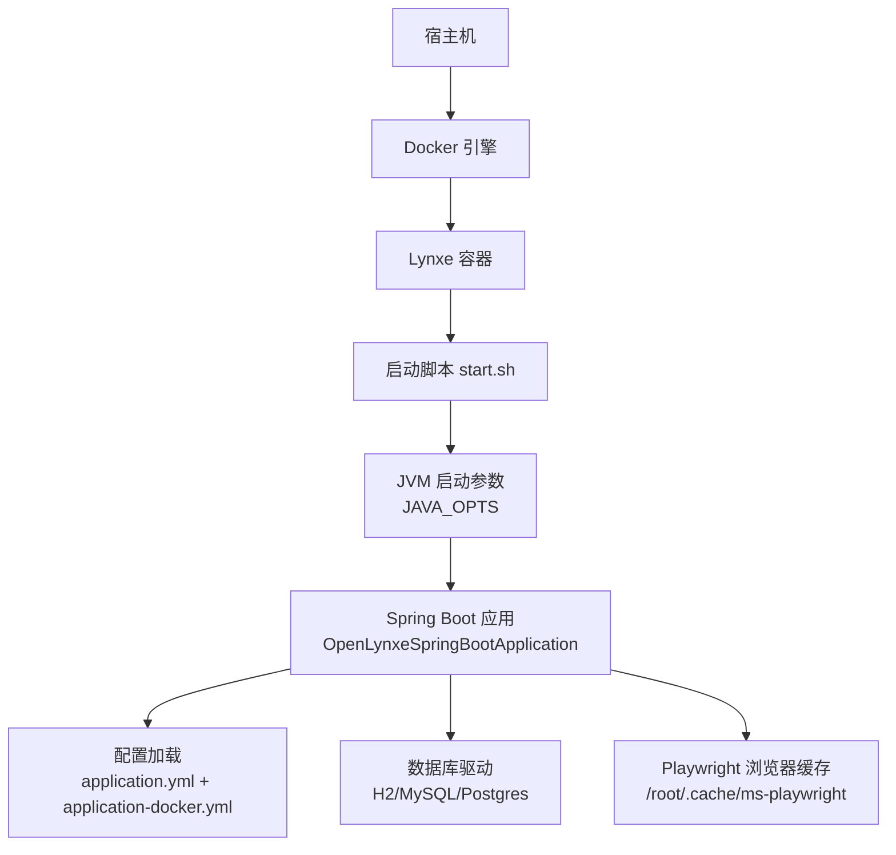
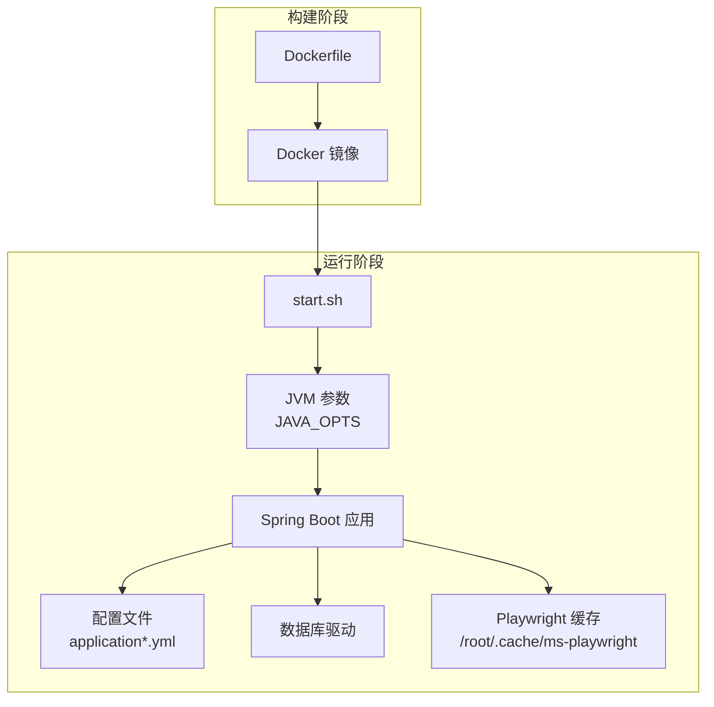
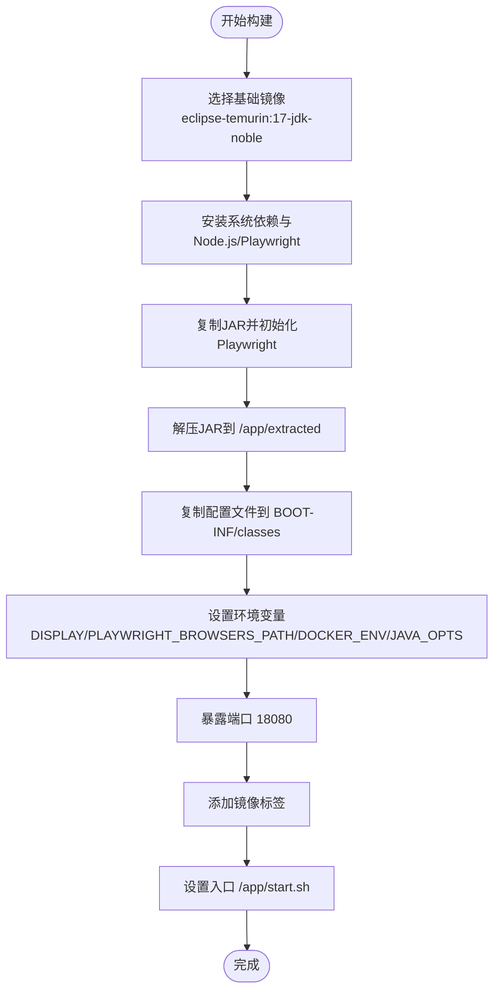
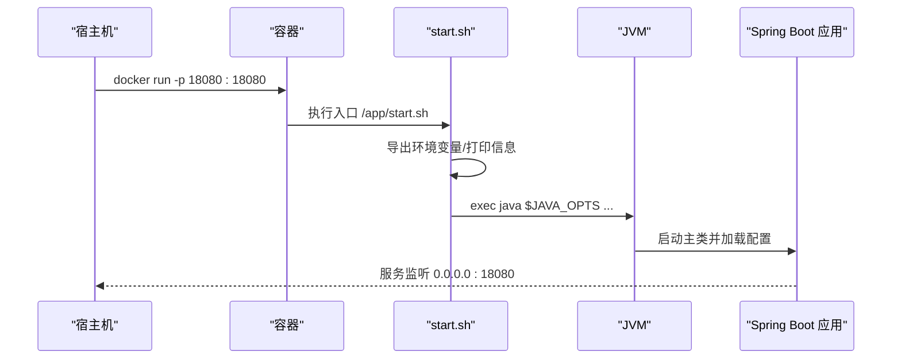
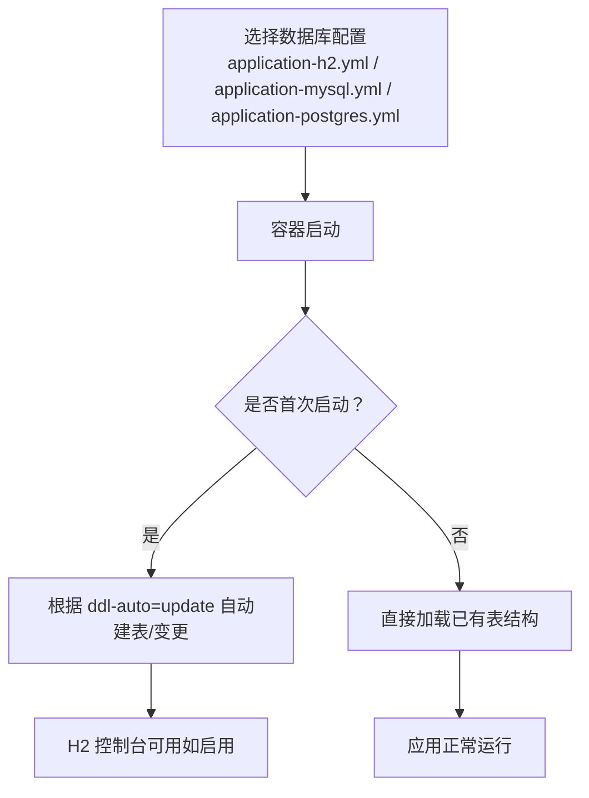
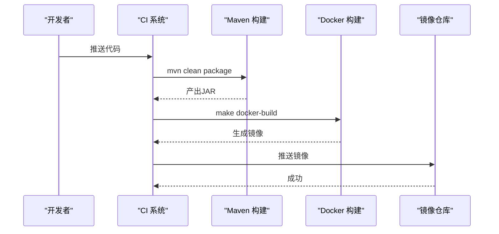
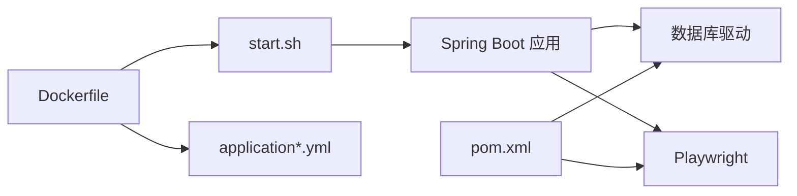

# 部署运维

<cite>
**本文引用的文件**
- [Dockerfile](file://deploy/Dockerfile)
- [启动脚本 start.sh](file://deploy/start.sh)
- [部署说明 README.md](file://deploy/README.md)
- [主配置 application.yml](file://src/main/resources/application.yml)
- [Docker专用配置 application-docker.yml](file://src/main/resources/application-docker.yml)
- [H2 数据库配置 application-h2.yml](file://src/main/resources/application-h2.yml)
- [MySQL 数据库配置 application-mysql.yml](file://src/main/resources/application-mysql.yml)
- [Postgres 数据库配置 application-postgres.yml](file://src/main/resources/application-postgres.yml)
- [Makefile](file://Makefile)
- [Docker 目标 Makefile 片段](file://tools/make/docker.mk)
- [通用 Makefile 片段](file://tools/make/common.mk)
- [Maven 构建配置 pom.xml](file://pom.xml)
- [CI 安全检查脚本 check-secrets.sh](file://tools/scripts/ci/check-secrets.sh)
</cite>

## 目录
1. [简介](#简介)
2. [项目结构](#项目结构)
3. [核心组件](#核心组件)
4. [架构总览](#架构总览)
5. [详细组件分析](#详细组件分析)
6. [依赖关系分析](#依赖关系分析)
7. [性能考量](#性能考量)
8. [故障排查指南](#故障排查指南)
9. [结论](#结论)
10. [附录](#附录)

## 简介
本文件面向Lynxe项目的部署与运维团队，提供从容器化打包到运行时配置、数据库初始化与迁移、高可用与故障转移、监控告警与日志、以及CI/CD与安全加固的完整运维指南。内容基于仓库中的Dockerfile、启动脚本、配置文件与Makefile等实际文件进行梳理与总结。

## 项目结构
Lynxe采用多阶段Docker镜像构建，容器内通过启动脚本加载配置并以JVM参数启动Spring Boot应用。配置文件按环境拆分，支持H2、MySQL、Postgres三类数据库，并在Docker环境下默认启用无头浏览器模式。

图表来源
- [Dockerfile:115-137](file://deploy/Dockerfile#L115-L137)
- [启动脚本 start.sh:79-90](file://deploy/start.sh#L79-L90)
- [主配置 application.yml:1-97](file://src/main/resources/application.yml#L1-L97)
- [Docker专用配置 application-docker.yml:1-20](file://src/main/resources/application-docker.yml#L1-L20)

章节来源
- [Dockerfile:1-138](file://deploy/Dockerfile#L1-L138)
- [启动脚本 start.sh:1-91](file://deploy/start.sh#L1-L91)
- [主配置 application.yml:1-97](file://src/main/resources/application.yml#L1-L97)
- [Docker专用配置 application-docker.yml:1-20](file://src/main/resources/application-docker.yml#L1-L20)

## 核心组件
- 容器镜像与构建
  - 多阶段构建，使用Eclipse Temurin 17作为运行时基础镜像，安装系统依赖、Node.js与Playwright浏览器依赖，预装浏览器并设置缓存路径。
  - 在容器内执行JAR解包与浏览器初始化，复制配置文件至BOOT-INF/classes，设置环境变量与端口暴露。
- 启动流程
  - 启动脚本打印系统与浏览器信息，导出PLAYWRIGHT_BROWSERS_PATH与DOCKER_ENV，最终以指定JVM参数与激活profiles启动应用。
- 配置体系
  - application.yml定义服务端口、文件上传限制、Hikari连接池、JPA、日志级别、计划轮询与文件上传策略等。
  - application-docker.yml在容器环境启用headless模式、关闭SQL格式化、调整日志级别。
  - application-h2.yml、application-mysql.yml、application-postgres.yml分别定义不同数据库方言、URL、凭据与DDL策略。
- 数据库与初始化
  - 默认使用H2文件数据库，开启Web控制台；MySQL与Postgres提供对应配置模板，DDL策略为update。
- CI/CD与工具链
  - Makefile统一编排构建目标，docker.mk提供镜像构建与运行命令；pom.xml定义Maven插件与资源过滤；CI安全检查脚本用于扫描机密。

章节来源
- [Dockerfile:15-138](file://deploy/Dockerfile#L15-L138)
- [启动脚本 start.sh:68-90](file://deploy/start.sh#L68-L90)
- [主配置 application.yml:1-97](file://src/main/resources/application.yml#L1-L97)
- [Docker专用配置 application-docker.yml:1-20](file://src/main/resources/application-docker.yml#L1-L20)
- [H2 数据库配置 application-h2.yml:1-23](file://src/main/resources/application-h2.yml#L1-L23)
- [MySQL 数据库配置 application-mysql.yml:1-15](file://src/main/resources/application-mysql.yml#L1-L15)
- [Postgres 数据库配置 application-postgres.yml:1-15](file://src/main/resources/application-postgres.yml#L1-L15)
- [Makefile:1-30](file://Makefile#L1-L30)
- [Docker 目标 Makefile 片段:24-45](file://tools/make/docker.mk#L24-L45)
- [通用 Makefile 片段:30-35](file://tools/make/common.mk#L30-L35)
- [Maven 构建配置 pom.xml:356-553](file://pom.xml#L356-L553)
- [CI 安全检查脚本 check-secrets.sh](file://tools/scripts/ci/check-secrets.sh)

## 架构总览
下图展示容器化部署的关键交互：构建阶段生成镜像，运行阶段通过启动脚本加载配置并启动应用，Playwright浏览器缓存位于容器内，数据库可选H2/MySQL/Postgres。

图表来源
- [Dockerfile:89-123](file://deploy/Dockerfile#L89-L123)
- [启动脚本 start.sh:79-90](file://deploy/start.sh#L79-L90)

章节来源
- [Dockerfile:89-123](file://deploy/Dockerfile#L89-L123)
- [启动脚本 start.sh:79-90](file://deploy/start.sh#L79-L90)

## 详细组件分析

### 容器镜像与构建
- 基础镜像与平台参数
  - 使用多架构基础镜像，构建参数包含TARGETPLATFORM、TARGETOS、TARGETARCH等，便于跨平台镜像构建。
- 系统依赖与浏览器
  - 安装ca-certificates、curl、Node.js 18、Playwright所需系统库，并全局安装Playwright CLI。
  - 容器内执行playwright初始化，解压JAR以便更快启动，设置浏览器缓存权限与必要目录。
- 配置注入与环境变量
  - 将application*.yml复制到解包后的BOOT-INF/classes，设置DISPLAY、PLAYWRIGHT_BROWSERS_PATH、DOCKER_ENV与JAVA_OPTS。
- 入口与标签
  - ENTRYPOINT指向启动脚本，添加OCI镜像标签便于镜像管理与溯源。

图表来源
- [Dockerfile:18-137](file://deploy/Dockerfile#L18-L137)

章节来源
- [Dockerfile:18-137](file://deploy/Dockerfile#L18-L137)

### 启动脚本与运行时
- 启动流程
  - 打印系统信息与浏览器状态，导出PLAYWRIGHT_BROWSERS_PATH与DOCKER_ENV，设置工作目录为/app/extracted。
  - 以--spring.profiles.active=h2,docker方式启动主类，JVM参数由JAVA_OPTS传入。
- 运行参数建议
  - 可根据生产环境调整-Xmx/-Xms、GC策略与Netty相关参数，确保容器资源限制与JVM内存匹配。

图表来源
- [启动脚本 start.sh:79-90](file://deploy/start.sh#L79-L90)

章节来源
- [启动脚本 start.sh:68-90](file://deploy/start.sh#L68-L90)

### 配置管理与敏感信息保护
- 配置文件组织
  - application.yml为核心配置，定义端口、文件上传、连接池、JPA、日志与计划轮询等。
  - application-docker.yml覆盖容器环境下的浏览器与日志级别优化。
  - application-h2.yml启用H2控制台与文件数据库；application-mysql.yml与application-postgres.yml提供MySQL与Postgres模板。
- 敏感信息保护
  - 建议将数据库密码等敏感值通过环境变量或Kubernetes Secret注入，避免硬编码在配置文件中。
  - 在容器运行时可通过-e或--env-file传入敏感变量，启动脚本中可读取并注入到JAVA_OPTS或Spring属性。
- 配置热更新与灰度
  - 生产环境建议将配置置于外部挂载卷或配置中心，结合Spring Profiles实现灰度切换。

章节来源
- [主配置 application.yml:1-97](file://src/main/resources/application.yml#L1-L97)
- [Docker专用配置 application-docker.yml:1-20](file://src/main/resources/application-docker.yml#L1-L20)
- [H2 数据库配置 application-h2.yml:1-23](file://src/main/resources/application-h2.yml#L1-L23)
- [MySQL 数据库配置 application-mysql.yml:1-15](file://src/main/resources/application-mysql.yml#L1-L15)
- [Postgres 数据库配置 application-postgres.yml:1-15](file://src/main/resources/application-postgres.yml#L1-L15)

### 数据库部署与初始化
- H2（默认）
  - 使用文件型H2数据库，开启Web控制台，DDL策略为update，适合开发与演示环境。
- MySQL
  - 提供URL、驱动、用户名与密码模板，DDL策略为update；生产需替换为真实地址与凭据。
- Postgres
  - 提供URL、驱动、用户名与密码模板，DDL策略为update；生产需替换为真实地址与凭据。
- 初始化与迁移
  - 当前配置采用hibernate.ddl-auto=update，适用于快速迭代；生产建议引入Flyway/Liquibase进行受控迁移，并在CI中强制校验。

图表来源
- [H2 数据库配置 application-h2.yml:14-18](file://src/main/resources/application-h2.yml#L14-L18)
- [MySQL 数据库配置 application-mysql.yml:7-10](file://src/main/resources/application-mysql.yml#L7-L10)
- [Postgres 数据库配置 application-postgres.yml:11-14](file://src/main/resources/application-postgres.yml#L11-L14)

章节来源
- [H2 数据库配置 application-h2.yml:1-23](file://src/main/resources/application-h2.yml#L1-L23)
- [MySQL 数据库配置 application-mysql.yml:1-15](file://src/main/resources/application-mysql.yml#L1-L15)
- [Postgres 数据库配置 application-postgres.yml:1-15](file://src/main/resources/application-postgres.yml#L1-L15)

### 负载均衡、高可用与故障转移
- 负载均衡
  - 建议在容器外层使用反向代理（如Nginx、Envoy或云厂商LB）将流量分发至多个Lynxe实例。
- 高可用
  - 使用多副本部署，结合健康检查（/actuator/health）实现滚动升级与自动恢复。
- 故障转移
  - 对于有状态组件（如H2文件数据库），建议迁移到外部持久化数据库（MySQL/Postgres）并配合主从或集群方案。
  - 无状态应用可利用容器编排平台的重启策略与Pod亲和性实现故障隔离与快速恢复。

[本节为概念性指导，不直接分析具体文件，故无“章节来源”]

### 监控告警、日志收集与性能分析
- 监控指标
  - 开启Spring Boot Actuator，暴露健康检查、指标与线程dump接口，结合Prometheus/Grafana采集JVM与业务指标。
- 日志
  - application.yml已配置日志文件路径与根级别；建议在容器中将日志输出到stdout/stderr并由Kubernetes收集。
- 性能分析
  - 结合JVM GC日志与容器CPU/内存指标，定位慢查询与资源瓶颈；对Playwright浏览器进程进行资源限制与隔离。

[本节为概念性指导，不直接分析具体文件，故无“章节来源”]

### CI/CD流水线、自动化测试与发布策略
- 构建与打包
  - 使用Maven插件完成编译、测试与打包；Makefile提供docker-build与docker-run目标，便于本地与CI复现。
- 自动化测试
  - pom.xml中配置了JUnit与Surefire插件，测试默认跳过，可在CI中显式启用。
- 发布策略
  - Docker镜像推送至镜像仓库（如ghcr.io/spring-ai-alibaba/lynxe），版本标签与Git提交关联。
- 安全检查
  - CI中集成check-secrets.sh扫描潜在机密泄露风险。

图表来源
- [Makefile:17-25](file://Makefile#L17-L25)
- [Docker 目标 Makefile 片段:24-33](file://tools/make/docker.mk#L24-L33)
- [Maven 构建配置 pom.xml:496-512](file://pom.xml#L496-L512)

章节来源
- [Makefile:17-25](file://Makefile#L17-L25)
- [Docker 目标 Makefile 片段:24-33](file://tools/make/docker.mk#L24-L33)
- [通用 Makefile 片段:30-35](file://tools/make/common.mk#L30-L35)
- [Maven 构建配置 pom.xml:496-512](file://pom.xml#L496-L512)
- [CI 安全检查脚本 check-secrets.sh](file://tools/scripts/ci/check-secrets.sh)

## 依赖关系分析
- 组件耦合
  - Dockerfile与启动脚本强耦合：启动脚本依赖容器内JAR解包与Playwright缓存；配置文件通过复制进入BOOT-INF/classes。
  - 应用通过Spring Profiles选择数据库配置，不同数据库驱动在pom.xml中声明。
- 外部依赖
  - Playwright浏览器依赖与Node.js版本需与容器系统兼容；JVM参数需与容器资源限制匹配。

图表来源
- [Dockerfile:89-123](file://deploy/Dockerfile#L89-L123)
- [启动脚本 start.sh:79-90](file://deploy/start.sh#L79-L90)
- [Maven 构建配置 pom.xml:280-300](file://pom.xml#L280-L300)

章节来源
- [Dockerfile:89-123](file://deploy/Dockerfile#L89-L123)
- [启动脚本 start.sh:79-90](file://deploy/start.sh#L79-L90)
- [Maven 构建配置 pom.xml:280-300](file://pom.xml#L280-L300)

## 性能考量
- JVM与容器
  - 建议在JAVA_OPTS中明确堆大小与GC策略，结合容器CPU/内存限制避免OOM与频繁GC。
- 数据库连接池
  - Hikari连接池参数已在application.yml中配置，可根据并发与响应时间调优。
- 浏览器与UI
  - Docker环境默认headless模式，减少图形开销；如需可视化调试，可在非生产环境临时关闭。

[本节为通用指导，不直接分析具体文件，故无“章节来源”]

## 故障排查指南
- 启动失败
  - 检查启动脚本输出的系统与浏览器信息，确认Playwright缓存存在且可执行。
  - 查看JVM参数与端口占用，确保18080未被占用。
- 数据库问题
  - 若使用H2，确认h2-data目录可写；若使用MySQL/Postgres，核对URL、凭据与网络连通性。
- 配置问题
  - 确认激活的Profiles与配置文件一致；敏感信息通过环境变量注入而非硬编码。
- CI问题
  - 使用Make目标复现构建过程；检查check-secrets.sh是否发现机密泄露。

章节来源
- [启动脚本 start.sh:50-76](file://deploy/start.sh#L50-L76)
- [H2 数据库配置 application-h2.yml:1-23](file://src/main/resources/application-h2.yml#L1-L23)
- [MySQL 数据库配置 application-mysql.yml:1-15](file://src/main/resources/application-mysql.yml#L1-L15)
- [Postgres 数据库配置 application-postgres.yml:1-15](file://src/main/resources/application-postgres.yml#L1-L15)
- [CI 安全检查脚本 check-secrets.sh](file://tools/scripts/ci/check-secrets.sh)

## 结论
Lynxe提供了完整的容器化部署基线：多阶段Dockerfile、可执行的启动脚本、按环境拆分的配置文件与数据库模板。建议在生产环境中：
- 使用外部持久化数据库并引入受控迁移；
- 通过环境变量注入敏感信息；
- 配置反向代理与健康检查实现高可用；
- 建立CI/CD流水线与安全扫描；
- 结合监控与日志体系进行持续优化。

[本节为总结性内容，不直接分析具体文件，故无“章节来源”]

## 附录

### 快速开始（本地）
- 使用Make目标一键构建与运行容器：
  - make docker-build
  - make docker-run
- 访问服务端口：18080
- 如需切换数据库，修改或挂载对应application-*.yml并重启动容器。

章节来源
- [部署说明 README.md:1-4](file://deploy/README.md#L1-L4)
- [Docker 目标 Makefile 片段:24-39](file://tools/make/docker.mk#L24-L39)

### 配置清单（关键项）
- 服务端口：18080
- 文件上传限制：单文件1GB，每次最多10个文件
- 数据库：H2（默认）、MySQL、Postgres
- Playwright：容器内缓存路径与headless模式
- JVM：JAVA_OPTS由启动脚本注入

章节来源
- [主配置 application.yml:1-97](file://src/main/resources/application.yml#L1-L97)
- [Docker专用配置 application-docker.yml:1-20](file://src/main/resources/application-docker.yml#L1-L20)
- [启动脚本 start.sh:115-119](file://deploy/start.sh#L115-L119)