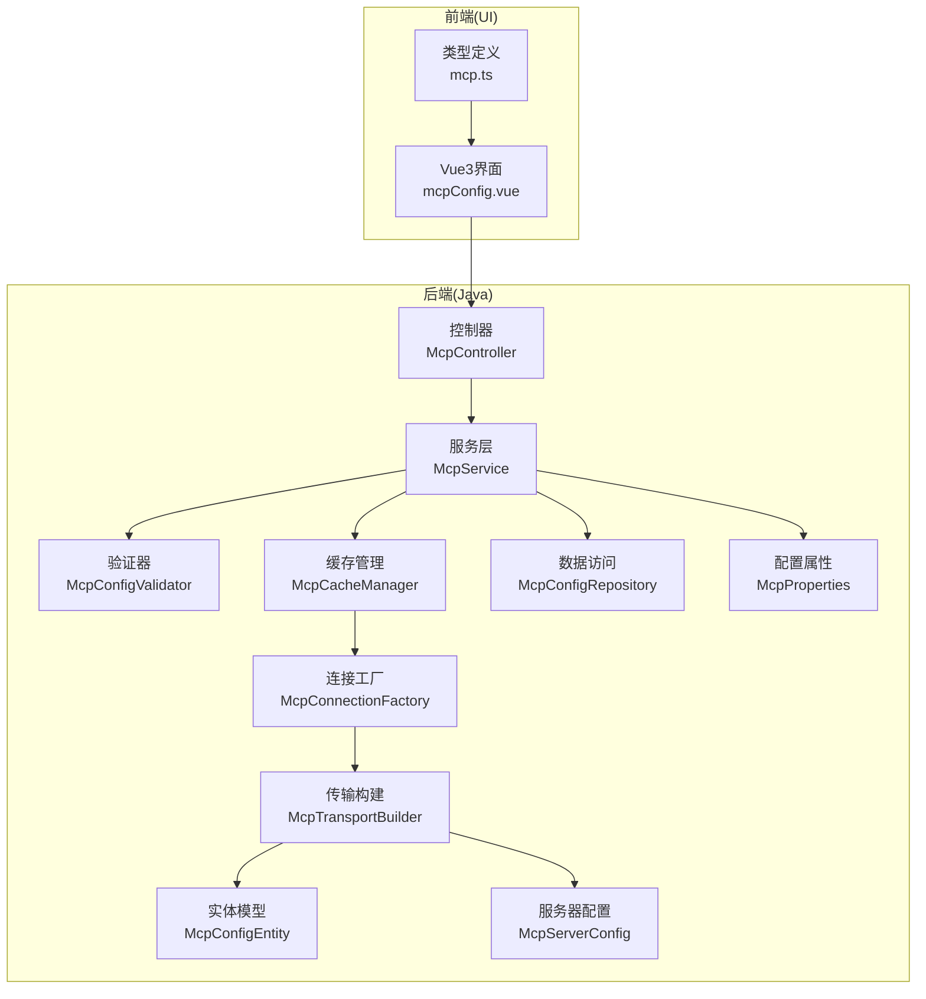
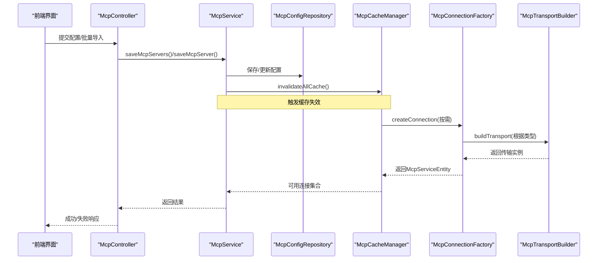
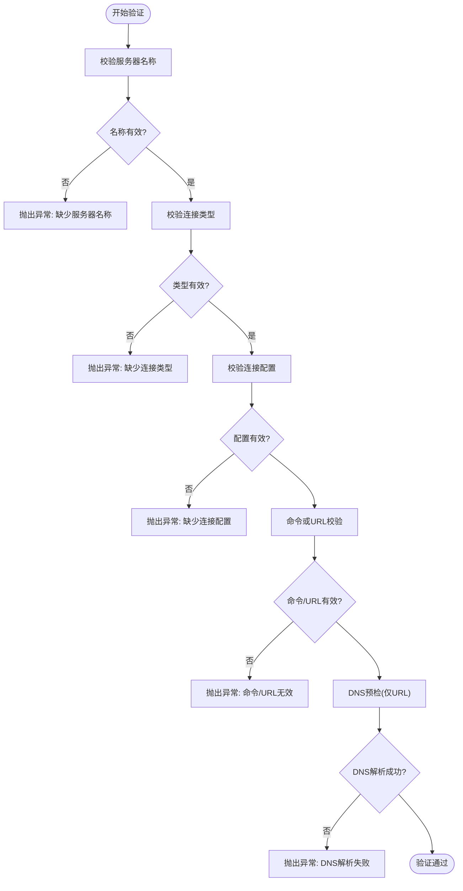
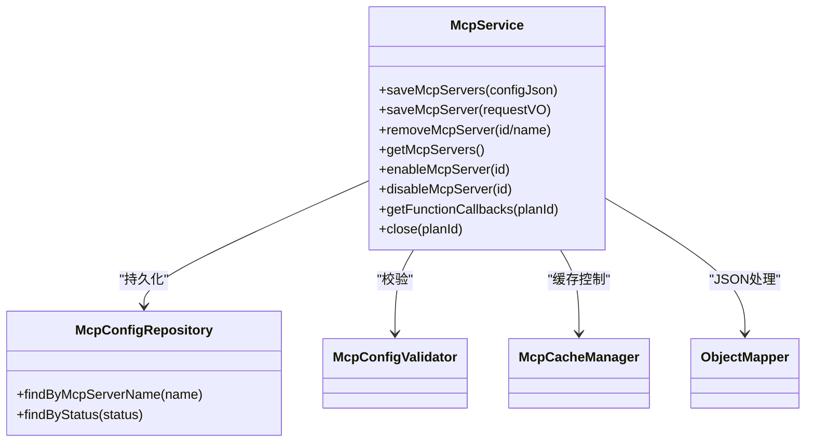
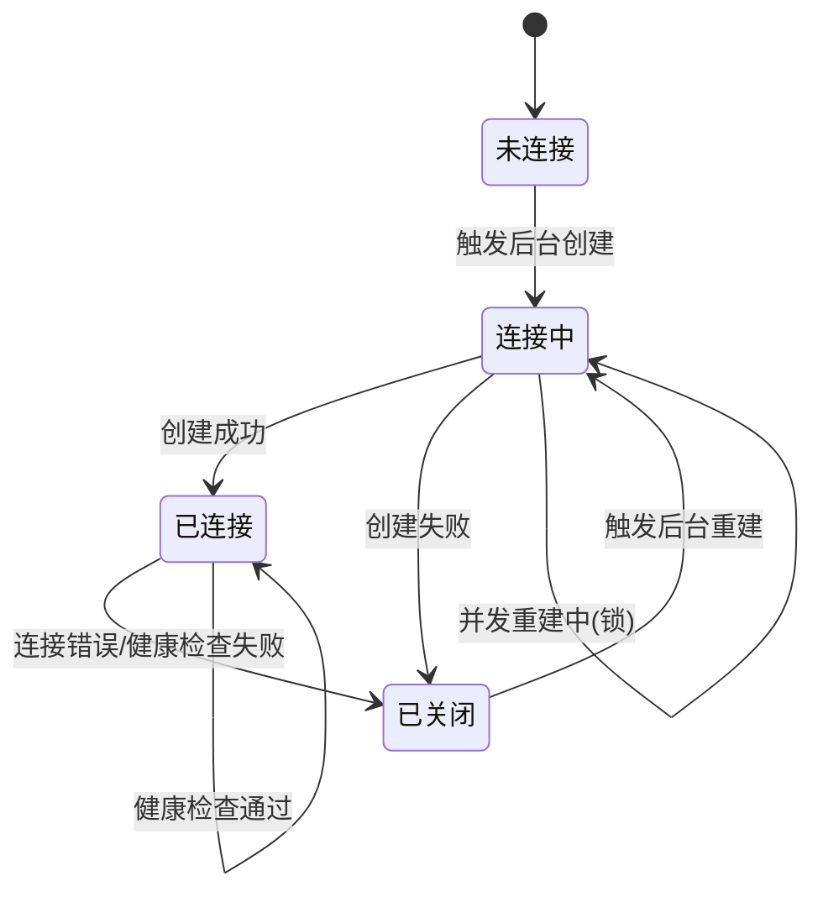
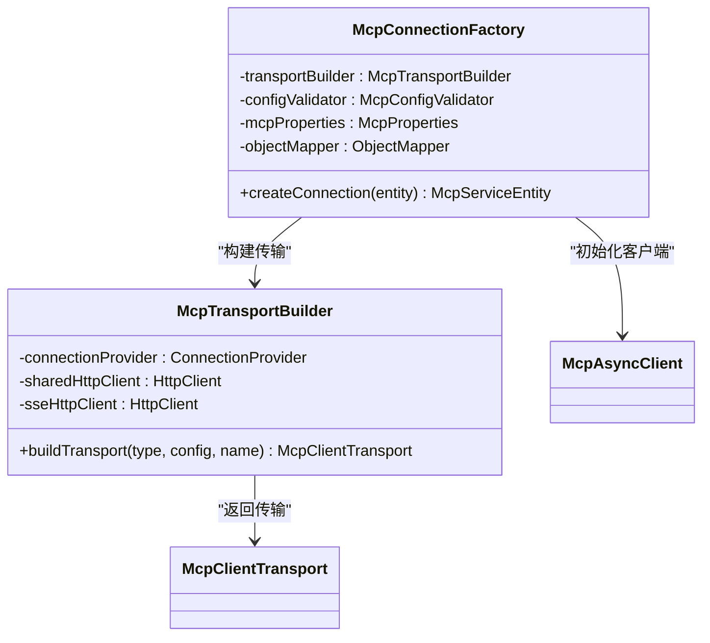
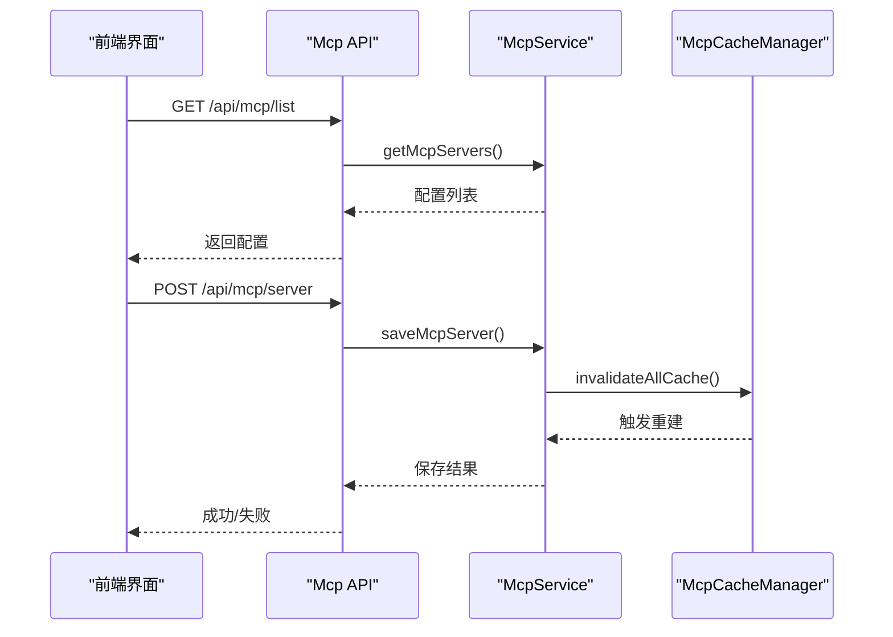
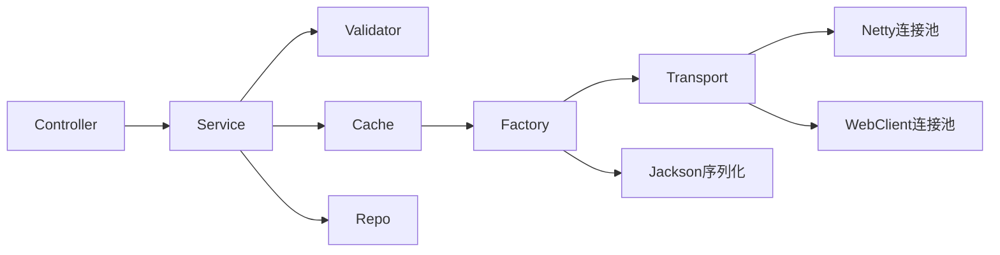
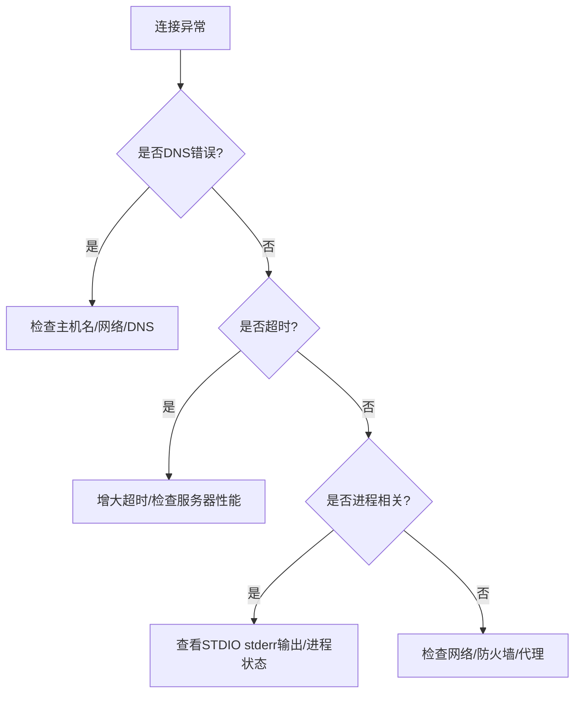
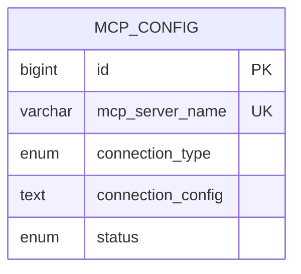

# MCP配置管理

<cite>
**本文档引用的文件**
- [McpProperties.java](file://src/main/java/com/alibaba/cloud/ai/lynxe/mcp/config/McpProperties.java)
- [McpConfigValidator.java](file://src/main/java/com/alibaba/cloud/ai/lynxe/mcp/service/McpConfigValidator.java)
- [McpService.java](file://src/main/java/com/alibaba/cloud/ai/lynxe/mcp/service/McpService.java)
- [McpCacheManager.java](file://src/main/java/com/alibaba/cloud/ai/lynxe/mcp/service/McpCacheManager.java)
- [McpConnectionFactory.java](file://src/main/java/com/alibaba/cloud/ai/lynxe/mcp/service/McpConnectionFactory.java)
- [McpTransportBuilder.java](file://src/main/java/com/alibaba/cloud/ai/lynxe/mcp/service/McpTransportBuilder.java)
- [McpConfigRepository.java](file://src/main/java/com/alibaba/cloud/ai/lynxe/mcp/repository/McpConfigRepository.java)
- [McpController.java](file://src/main/java/com/alibaba/cloud/ai/lynxe/mcp/controller/McpController.java)
- [McpConfigEntity.java](file://src/main/java/com/alibaba/cloud/ai/lynxe/mcp/model/po/McpConfigEntity.java)
- [McpServerConfig.java](file://src/main/java/com/alibaba/cloud/ai/lynxe/mcp/model/vo/McpServerConfig.java)
- [McpConfigType.java](file://src/main/java/com/alibaba/cloud/ai/lynxe/mcp/model/po/McpConfigType.java)
- [McpConfigStatus.java](file://src/main/java/com/alibaba/cloud/ai/lynxe/mcp/model/po/McpConfigStatus.java)
- [application.yml](file://src/main/resources/application.yml)
- [McpConfigValidatorTest.java](file://src/test/java/com/alibaba/cloud/ai/lynxe/mcp/service/McpConfigValidatorTest.java)
- [mcpConfig.vue](file://ui-vue3/src/views/configs/mcpConfig.vue)
- [mcp.ts](file://ui-vue3/src/types/mcp.ts)
</cite>

## 目录
1. [简介](#简介)
2. [项目结构](#项目结构)
3. [核心组件](#核心组件)
4. [架构概览](#架构概览)
5. [详细组件分析](#详细组件分析)
6. [依赖关系分析](#依赖关系分析)
7. [性能考量](#性能考量)
8. [故障排除指南](#故障排除指南)
9. [结论](#结论)
10. [附录](#附录)

## 简介
本文件为Lynxe MCP（Model Context Protocol）配置管理系统的技术文档，全面阐述MCP配置的定义、加载与验证机制，解析MCP服务器配置的关键参数体系（连接信息、认证方式、协议版本等），说明配置的生命周期管理、连接池与故障转移策略，以及动态更新、热重载与配置同步机制。同时提供安全考虑、网络配置与性能调优方案，并给出调试方法与故障排除指南，最后解释MCP配置与工具系统、代理执行的集成方式。

## 项目结构
Lynxe项目采用分层架构，MCP配置管理位于后端服务层，前端通过Vue3界面进行可视化配置管理。核心模块包括：
- 配置属性层：MCP全局配置参数（超时、重试、SSE参数等）
- 验证层：配置合法性校验与DNS预检
- 服务层：统一业务接口，负责配置持久化与缓存管理
- 缓存与连接层：单连接、失败快速返回、后台重建、健康检查
- 传输层：SSE/STDIO/HTTP流式传输构建与共享连接池
- 控制器层：REST API对外暴露配置管理能力
- 数据访问层：JPA仓库访问数据库
- 前端界面：可视化配置导入导出、编辑与状态切换

**图表来源**
- [McpController.java:38-196](file://src/main/java/com/alibaba/cloud/ai/lynxe/mcp/controller/McpController.java#L38-L196)
- [McpService.java:43-352](file://src/main/java/com/alibaba/cloud/ai/lynxe/mcp/service/McpService.java#L43-L352)
- [McpCacheManager.java:54-977](file://src/main/java/com/alibaba/cloud/ai/lynxe/mcp/service/McpCacheManager.java#L54-L977)
- [McpConnectionFactory.java:44-437](file://src/main/java/com/alibaba/cloud/ai/lynxe/mcp/service/McpConnectionFactory.java#L44-L437)
- [McpTransportBuilder.java:54-393](file://src/main/java/com/alibaba/cloud/ai/lynxe/mcp/service/McpTransportBuilder.java#L54-L393)
- [McpConfigRepository.java:29-42](file://src/main/java/com/alibaba/cloud/ai/lynxe/mcp/repository/McpConfigRepository.java#L29-L42)
- [McpConfigEntity.java:27-107](file://src/main/java/com/alibaba/cloud/ai/lynxe/mcp/model/po/McpConfigEntity.java#L27-L107)
- [McpServerConfig.java:28-251](file://src/main/java/com/alibaba/cloud/ai/lynxe/mcp/model/vo/McpServerConfig.java#L28-L251)
- [McpProperties.java:26-191](file://src/main/java/com/alibaba/cloud/ai/lynxe/mcp/config/McpProperties.java#L26-L191)

**章节来源**
- [McpController.java:38-196](file://src/main/java/com/alibaba/cloud/ai/lynxe/mcp/controller/McpController.java#L38-L196)
- [McpService.java:43-352](file://src/main/java/com/alibaba/cloud/ai/lynxe/mcp/service/McpService.java#L43-L352)
- [McpCacheManager.java:54-977](file://src/main/java/com/alibaba/cloud/ai/lynxe/mcp/service/McpCacheManager.java#L54-L977)
- [McpConnectionFactory.java:44-437](file://src/main/java/com/alibaba/cloud/ai/lynxe/mcp/service/McpConnectionFactory.java#L44-L437)
- [McpTransportBuilder.java:54-393](file://src/main/java/com/alibaba/cloud/ai/lynxe/mcp/service/McpTransportBuilder.java#L54-L393)
- [McpConfigRepository.java:29-42](file://src/main/java/com/alibaba/cloud/ai/lynxe/mcp/repository/McpConfigRepository.java#L29-L42)
- [McpConfigEntity.java:27-107](file://src/main/java/com/alibaba/cloud/ai/lynxe/mcp/model/po/McpConfigEntity.java#L27-L107)
- [McpServerConfig.java:28-251](file://src/main/java/com/alibaba/cloud/ai/lynxe/mcp/model/vo/McpServerConfig.java#L28-L251)
- [McpProperties.java:26-191](file://src/main/java/com/alibaba/cloud/ai/lynxe/mcp/config/McpProperties.java#L26-L191)

## 核心组件
- 配置属性类：集中管理MCP客户端超时、重试、SSE连接参数、用户代理等全局配置
- 验证器：对服务器名称、连接类型、命令/URL格式、DNS可解析性进行严格校验
- 服务层：提供批量导入、单个保存、删除、启停、查询等统一接口，并触发缓存失效
- 缓存管理：单连接、失败快速返回、后台重建、健康检查、请求计数阈值控制
- 连接工厂：基于传输类型构建MCP客户端，支持重试与初始化超时
- 传输构建：共享连接池、SSE专用超时配置、STDIO错误输出捕获
- 数据访问：JPA仓库，按状态查询与唯一名称查询
- 实体与配置模型：数据库实体与内部配置对象，支持序列化/反序列化与类型推断

**章节来源**
- [McpProperties.java:26-191](file://src/main/java/com/alibaba/cloud/ai/lynxe/mcp/config/McpProperties.java#L26-L191)
- [McpConfigValidator.java:40-391](file://src/main/java/com/alibaba/cloud/ai/lynxe/mcp/service/McpConfigValidator.java#L40-L391)
- [McpService.java:43-352](file://src/main/java/com/alibaba/cloud/ai/lynxe/mcp/service/McpService.java#L43-L352)
- [McpCacheManager.java:54-977](file://src/main/java/com/alibaba/cloud/ai/lynxe/mcp/service/McpCacheManager.java#L54-L977)
- [McpConnectionFactory.java:44-437](file://src/main/java/com/alibaba/cloud/ai/lynxe/mcp/service/McpConnectionFactory.java#L44-L437)
- [McpTransportBuilder.java:54-393](file://src/main/java/com/alibaba/cloud/ai/lynxe/mcp/service/McpTransportBuilder.java#L54-L393)
- [McpConfigRepository.java:29-42](file://src/main/java/com/alibaba/cloud/ai/lynxe/mcp/repository/McpConfigRepository.java#L29-L42)
- [McpConfigEntity.java:27-107](file://src/main/java/com/alibaba/cloud/ai/lynxe/mcp/model/po/McpConfigEntity.java#L27-L107)
- [McpServerConfig.java:28-251](file://src/main/java/com/alibaba/cloud/ai/lynxe/mcp/model/vo/McpServerConfig.java#L28-L251)

## 架构概览
MCP配置管理采用“控制器-服务-缓存-工厂-传输”的分层设计，确保配置变更后能快速生效且不影响主线程性能。核心流程：
- 前端提交配置或批量导入
- 控制器调用服务层保存/更新
- 服务层持久化并触发缓存失效
- 缓存管理器在需要时异步建立/重建连接
- 传输层使用共享连接池，区分SSE长连接与短连接场景
- 工厂层负责客户端初始化与重试

**图表来源**
- [McpController.java:54-193](file://src/main/java/com/alibaba/cloud/ai/lynxe/mcp/controller/McpController.java#L54-L193)
- [McpService.java:70-213](file://src/main/java/com/alibaba/cloud/ai/lynxe/mcp/service/McpService.java#L70-L213)
- [McpCacheManager.java:191-297](file://src/main/java/com/alibaba/cloud/ai/lynxe/mcp/service/McpCacheManager.java#L191-L297)
- [McpConnectionFactory.java:80-175](file://src/main/java/com/alibaba/cloud/ai/lynxe/mcp/service/McpConnectionFactory.java#L80-L175)
- [McpTransportBuilder.java:167-186](file://src/main/java/com/alibaba/cloud/ai/lynxe/mcp/service/McpTransportBuilder.java#L167-L186)

## 详细组件分析

### 配置属性与参数体系
- 全局超时与重试：请求超时、初始化超时、最大重试次数、重试等待倍数
- SSE连接参数：路径后缀、读写超时、连接超时、用户代理
- 连接重建：超时后的重建延迟
- 缓存策略：访问后过期时间
- 请求重试：单次请求的自动重试次数

这些参数通过@ConfigurationProperties绑定到mcp.*前缀，便于集中管理与热更新。

**章节来源**
- [McpProperties.java:26-191](file://src/main/java/com/alibaba/cloud/ai/lynxe/mcp/config/McpProperties.java#L26-L191)

### 配置验证机制
验证器负责：
- 必填字段校验：服务器名称、连接类型、连接配置
- 命令/URL校验：命令必须为可执行或绝对路径；URL协议必须为http/https，路径包含sse时需符合SSE规范
- DNS预检：在URL校验阶段进行DNS解析，避免运行时连接失败
- 状态判断：启用/禁用状态检查
- 去重校验：新增时检查同名服务器是否存在

**图表来源**
- [McpConfigValidator.java:53-107](file://src/main/java/com/alibaba/cloud/ai/lynxe/mcp/service/McpConfigValidator.java#L53-L107)
- [McpConfigValidator.java:121-149](file://src/main/java/com/alibaba/cloud/ai/lynxe/mcp/service/McpConfigValidator.java#L121-L149)
- [McpConfigValidator.java:271-297](file://src/main/java/com/alibaba/cloud/ai/lynxe/mcp/service/McpConfigValidator.java#L271-L297)
- [McpConfigValidator.java:305-323](file://src/main/java/com/alibaba/cloud/ai/lynxe/mcp/service/McpConfigValidator.java#L305-L323)

**章节来源**
- [McpConfigValidator.java:40-391](file://src/main/java/com/alibaba/cloud/ai/lynxe/mcp/service/McpConfigValidator.java#L40-L391)

### 服务层与生命周期管理
服务层提供：
- 批量导入：解析JSON，逐个校验并保存
- 单个保存：表单校验、类型推断、保存与状态设置
- 删除：按ID或名称删除
- 启停：按ID切换启用/禁用状态
- 查询：列出所有配置
- 缓存失效：保存/删除/启停后清空缓存，触发重新加载

**图表来源**
- [McpService.java:43-352](file://src/main/java/com/alibaba/cloud/ai/lynxe/mcp/service/McpService.java#L43-L352)
- [McpConfigRepository.java:29-42](file://src/main/java/com/alibaba/cloud/ai/lynxe/mcp/repository/McpConfigRepository.java#L29-L42)

**章节来源**
- [McpService.java:43-352](file://src/main/java/com/alibaba/cloud/ai/lynxe/mcp/service/McpService.java#L43-L352)
- [McpConfigRepository.java:29-42](file://src/main/java/com/alibaba/cloud/ai/lynxe/mcp/repository/McpConfigRepository.java#L29-L42)

### 缓存管理与连接池
缓存管理器实现“失败快速返回、后台重建、健康检查”的设计：
- 单连接模型：每个服务器名对应一个连接包装器
- 失败快速返回：主流程不阻塞，立即返回null并触发后台重建
- 后台重建：连接关闭/重建时加锁，避免并发重建
- 健康检查：定时任务检查连接状态与待处理请求数
- 执行重试：对连接错误进行指数回退与特殊处理
- 缓存失效：全量失效时重新加载配置并重建所有连接

**图表来源**
- [McpCacheManager.java:62-120](file://src/main/java/com/alibaba/cloud/ai/lynxe/mcp/service/McpCacheManager.java#L62-L120)
- [McpCacheManager.java:213-242](file://src/main/java/com/alibaba/cloud/ai/lynxe/mcp/service/McpCacheManager.java#L213-L242)
- [McpCacheManager.java:349-426](file://src/main/java/com/alibaba/cloud/ai/lynxe/mcp/service/McpCacheManager.java#L349-L426)

**章节来源**
- [McpCacheManager.java:54-977](file://src/main/java/com/alibaba/cloud/ai/lynxe/mcp/service/McpCacheManager.java#L54-L977)

### 连接工厂与传输构建
连接工厂：
- 解析配置实体，校验启用状态
- 根据连接类型构建传输（SSE/STDIO/STREAMING）
- 初始化MCP客户端，设置请求与初始化超时
- 支持多尝试初始化，增强健壮性

传输构建：
- 共享连接提供者与HttpClient，限制最大连接数、空闲/生命周期
- SSE专用连接器：可配置读/写/连接超时，长连接场景更友好
- STDIO传输：捕获stderr输出，便于调试
- HTTP流式传输：支持可恢复流与按需打开连接

**图表来源**
- [McpConnectionFactory.java:80-175](file://src/main/java/com/alibaba/cloud/ai/lynxe/mcp/service/McpConnectionFactory.java#L80-L175)
- [McpTransportBuilder.java:97-157](file://src/main/java/com/alibaba/cloud/ai/lynxe/mcp/service/McpTransportBuilder.java#L97-L157)
- [McpTransportBuilder.java:167-186](file://src/main/java/com/alibaba/cloud/ai/lynxe/mcp/service/McpTransportBuilder.java#L167-L186)

**章节来源**
- [McpConnectionFactory.java:44-437](file://src/main/java/com/alibaba/cloud/ai/lynxe/mcp/service/McpConnectionFactory.java#L44-L437)
- [McpTransportBuilder.java:54-393](file://src/main/java/com/alibaba/cloud/ai/lynxe/mcp/service/McpTransportBuilder.java#L54-L393)

### 前端集成与配置同步
前端通过Vue3界面提供：
- 服务器列表展示与搜索
- 新增/编辑/删除/启用/禁用操作
- 批量JSON导入/导出
- 表单校验与JSON格式化
- 与后端API交互，实时刷新配置

**图表来源**
- [mcpConfig.vue:766-786](file://ui-vue3/src/views/configs/mcpConfig.vue#L766-L786)
- [mcp.ts:4-49](file://ui-vue3/src/types/mcp.ts#L4-L49)

**章节来源**
- [mcpConfig.vue:1-800](file://ui-vue3/src/views/configs/mcpConfig.vue#L1-L800)
- [mcp.ts:1-98](file://ui-vue3/src/types/mcp.ts#L1-L98)

## 依赖关系分析
- 组件内聚：各层职责清晰，控制器仅负责路由与参数封装，服务层聚合业务逻辑，缓存/工厂/传输层专注基础设施
- 组件耦合：服务层依赖验证器、缓存管理器与数据访问层；缓存管理器依赖工厂；工厂依赖传输构建器
- 外部依赖：Spring Boot、Spring Data JPA、Reactor Netty、Jackson、MCP客户端库
- 循环依赖：未发现循环依赖，整体呈单向依赖链

**图表来源**
- [McpController.java:44-48](file://src/main/java/com/alibaba/cloud/ai/lynxe/mcp/controller/McpController.java#L44-L48)
- [McpService.java:56-62](file://src/main/java/com/alibaba/cloud/ai/lynxe/mcp/service/McpService.java#L56-L62)
- [McpCacheManager.java:181-186](file://src/main/java/com/alibaba/cloud/ai/lynxe/mcp/service/McpCacheManager.java#L181-L186)
- [McpConnectionFactory.java:66-72](file://src/main/java/com/alibaba/cloud/ai/lynxe/mcp/service/McpConnectionFactory.java#L66-L72)
- [McpTransportBuilder.java:97-157](file://src/main/java/com/alibaba/cloud/ai/lynxe/mcp/service/McpTransportBuilder.java#L97-L157)

**章节来源**
- [McpController.java:38-196](file://src/main/java/com/alibaba/cloud/ai/lynxe/mcp/controller/McpController.java#L38-L196)
- [McpService.java:43-352](file://src/main/java/com/alibaba/cloud/ai/lynxe/mcp/service/McpService.java#L43-L352)
- [McpCacheManager.java:54-977](file://src/main/java/com/alibaba/cloud/ai/lynxe/mcp/service/McpCacheManager.java#L54-L977)
- [McpConnectionFactory.java:44-437](file://src/main/java/com/alibaba/cloud/ai/lynxe/mcp/service/McpConnectionFactory.java#L44-L437)
- [McpTransportBuilder.java:54-393](file://src/main/java/com/alibaba/cloud/ai/lynxe/mcp/service/McpTransportBuilder.java#L54-L393)

## 性能考量
- 连接池优化：共享连接提供者，限制最大连接数、空闲/生命周期，避免线程泄漏
- SSE长连接：可配置读/写/连接超时，建议SSE读超时设为禁用以适配长连接
- 初始化超时：独立于请求超时，允许慢启动的MCP服务器完成握手
- 失败快速返回：主线程不阻塞，后台重建，降低请求延迟
- 健康检查：定期检查连接状态与待处理请求数，及时隔离异常连接
- 序列化开销：使用Jackson统一处理，避免重复创建解析器

**章节来源**
- [McpTransportBuilder.java:97-157](file://src/main/java/com/alibaba/cloud/ai/lynxe/mcp/service/McpTransportBuilder.java#L97-L157)
- [McpProperties.java:38-91](file://src/main/java/com/alibaba/cloud/ai/lynxe/mcp/config/McpProperties.java#L38-L91)
- [McpCacheManager.java:540-605](file://src/main/java/com/alibaba/cloud/ai/lynxe/mcp/service/McpCacheManager.java#L540-L605)

## 故障排除指南
常见问题与诊断：
- DNS解析失败：URL校验阶段会进行DNS预检，若失败直接抛出异常，检查主机名与网络连通性
- 协议不支持：仅支持http/https，SSE路径需包含"sse"
- 进程启动失败：STDIO传输捕获stderr输出，查看日志定位命令/权限问题
- 连接超时：检查初始化超时与请求超时配置，确认服务器启动时间与网络状况
- 传输队列错误：出现“无法入队”错误通常表示进程退出或流被关闭，需重启服务器
- JSON解析错误：检查配置JSON格式，确保mcpServers字段存在且结构正确

**图表来源**
- [McpConfigValidator.java:364-388](file://src/main/java/com/alibaba/cloud/ai/lynxe/mcp/service/McpConfigValidator.java#L364-L388)
- [McpConnectionFactory.java:243-294](file://src/main/java/com/alibaba/cloud/ai/lynxe/mcp/service/McpConnectionFactory.java#L243-L294)
- [McpCacheManager.java:433-508](file://src/main/java/com/alibaba/cloud/ai/lynxe/mcp/service/McpCacheManager.java#L433-L508)

**章节来源**
- [McpConfigValidatorTest.java:48-94](file://src/test/java/com/alibaba/cloud/ai/lynxe/mcp/service/McpConfigValidatorTest.java#L48-L94)
- [McpConfigValidator.java:364-388](file://src/main/java/com/alibaba/cloud/ai/lynxe/mcp/service/McpConfigValidator.java#L364-L388)
- [McpConnectionFactory.java:243-294](file://src/main/java/com/alibaba/cloud/ai/lynxe/mcp/service/McpConnectionFactory.java#L243-L294)
- [McpCacheManager.java:433-508](file://src/main/java/com/alibaba/cloud/ai/lynxe/mcp/service/McpCacheManager.java#L433-L508)

## 结论
Lynxe的MCP配置管理系统通过严格的验证、高效的缓存与连接池、完善的健康检查与故障转移机制，实现了配置的高可用与高性能。前端提供直观的配置界面，后端保证配置变更后的快速生效与稳定运行。结合合理的超时与重试策略，系统能够在复杂网络环境中保持可靠的服务质量。

## 附录

### 配置参数参考
- 全局超时与重试：maxRetries、timeout、initializationTimeout、requestRetryCount、retryWaitMultiplier
- SSE参数：ssePathSuffix、userAgent、sseReadTimeoutSeconds、sseWriteTimeoutSeconds、sseConnectTimeoutMillis
- 连接重建：connectionRebuildDelayMillis
- 缓存策略：cacheExpireAfterAccess

**章节来源**
- [McpProperties.java:33-188](file://src/main/java/com/alibaba/cloud/ai/lynxe/mcp/config/McpProperties.java#L33-L188)

### 数据模型

**图表来源**
- [McpConfigEntity.java:29-107](file://src/main/java/com/alibaba/cloud/ai/lynxe/mcp/model/po/McpConfigEntity.java#L29-L107)

**章节来源**
- [McpConfigEntity.java:27-107](file://src/main/java/com/alibaba/cloud/ai/lynxe/mcp/model/po/McpConfigEntity.java#L27-L107)
- [McpConfigType.java:18-22](file://src/main/java/com/alibaba/cloud/ai/lynxe/mcp/model/po/McpConfigType.java#L18-L22)
- [McpConfigStatus.java:21-25](file://src/main/java/com/alibaba/cloud/ai/lynxe/mcp/model/po/McpConfigStatus.java#L21-L25)

### 安全与网络配置
- 用户代理：统一设置userAgent便于服务器识别
- 自定义头部：支持在服务器配置中添加自定义头部（注意敏感信息掩码记录）
- DNS预检：在保存阶段进行DNS解析，避免运行时连接失败
- 连接池：共享连接提供者，限制最大连接数，防止资源耗尽

**章节来源**
- [McpTransportBuilder.java:350-374](file://src/main/java/com/alibaba/cloud/ai/lynxe/mcp/service/McpTransportBuilder.java#L350-L374)
- [McpConfigValidator.java:291-297](file://src/main/java/com/alibaba/cloud/ai/lynxe/mcp/service/McpConfigValidator.java#L291-L297)
- [McpTransportBuilder.java:97-104](file://src/main/java/com/alibaba/cloud/ai/lynxe/mcp/service/McpTransportBuilder.java#L97-L104)

### 性能调优建议
- SSE长连接：读超时设为禁用，写超时按实际需求配置
- 初始化超时：根据服务器启动时间适当增大
- 连接池：根据MCP服务器数量与并发需求调整最大连接数
- 健康检查：合理设置检查间隔与待处理请求数阈值

**章节来源**
- [McpTransportBuilder.java:119-157](file://src/main/java/com/alibaba/cloud/ai/lynxe/mcp/service/McpTransportBuilder.java#L119-L157)
- [McpProperties.java:40-44](file://src/main/java/com/alibaba/cloud/ai/lynxe/mcp/config/McpProperties.java#L40-L44)
- [McpCacheManager.java:174-179](file://src/main/java/com/alibaba/cloud/ai/lynxe/mcp/service/McpCacheManager.java#L174-L179)