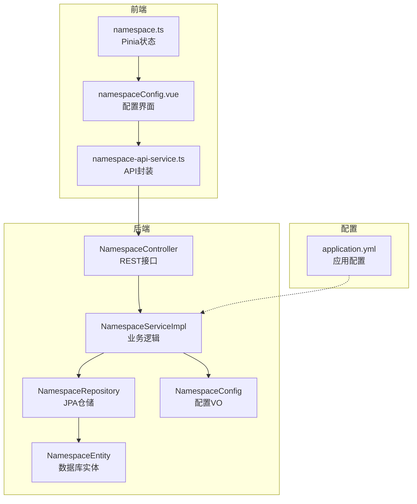
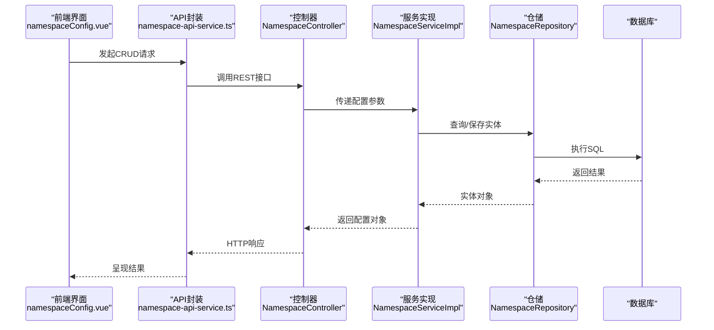
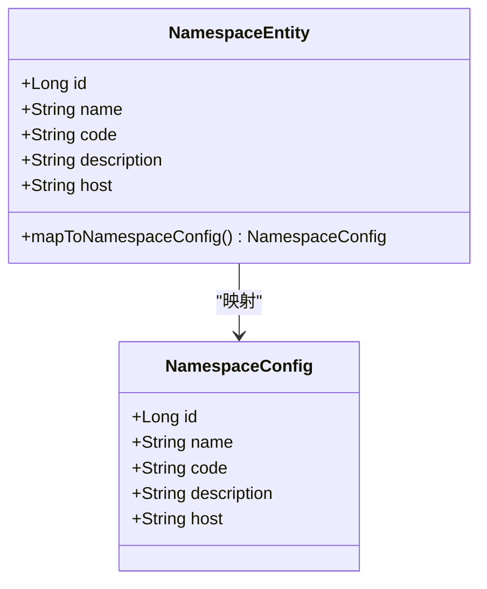
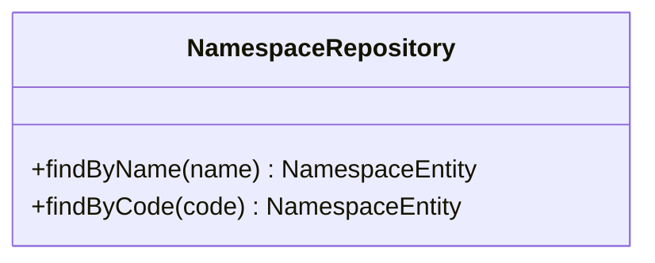
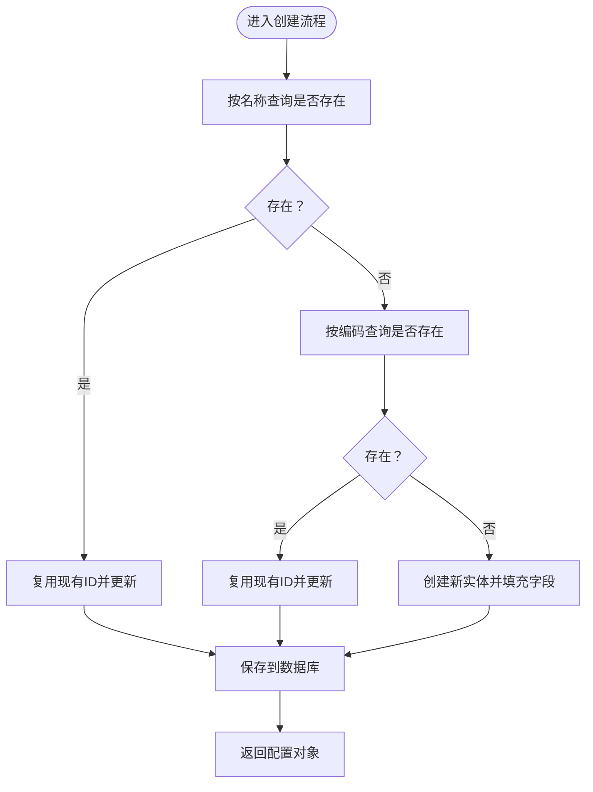
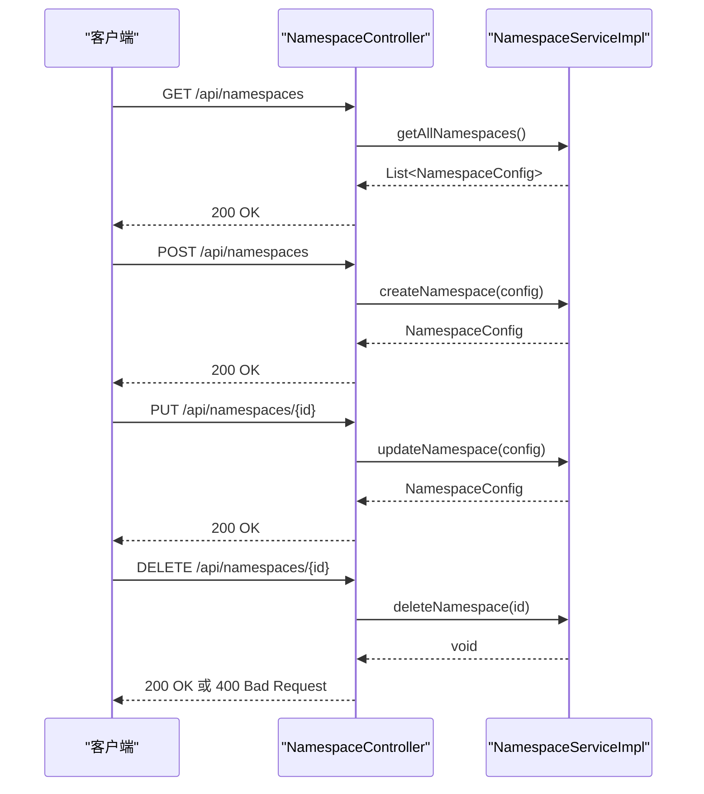
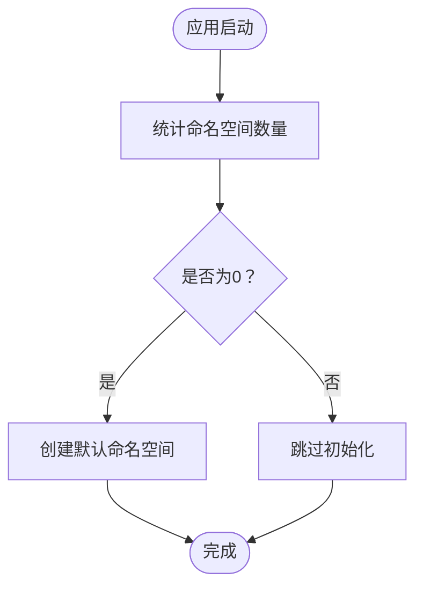
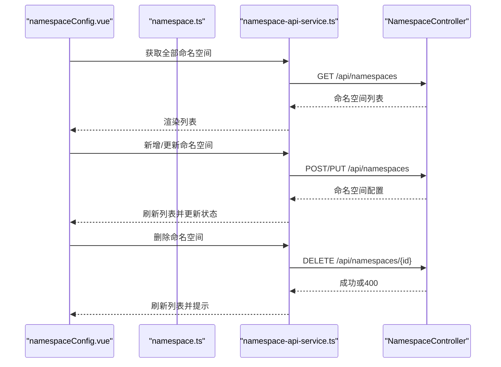
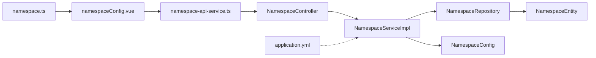

# 命名空间配置管理

<cite>
**本文引用的文件**
- [NamespaceController.java](file://src/main/java/com/alibaba/cloud/ai/lynxe/namespace/controller/NamespaceController.java)
- [NamespaceService.java](file://src/main/java/com/alibaba/cloud/ai/lynxe/namespace/service/NamespaceService.java)
- [NamespaceServiceImpl.java](file://src/main/java/com/alibaba/cloud/ai/lynxe/namespace/service/NamespaceServiceImpl.java)
- [NamespaceRepository.java](file://src/main/java/com/alibaba/cloud/ai/lynxe/namespace/repository/NamespaceRepository.java)
- [NamespaceEntity.java](file://src/main/java/com/alibaba/cloud/ai/lynxe/namespace/entity/NamespaceEntity.java)
- [NamespaceConfig.java](file://src/main/java/com/alibaba/cloud/ai/lynxe/namespace/namespace/vo/NamespaceConfig.java)
- [NamespaceDataInitialization.java](file://src/main/java/com/alibaba/cloud/ai/lynxe/namspace/service/NamespaceDataInitialization.java)
- [application.yml](file://src/main/resources/application.yml)
- [namespaceConfig.vue](file://ui-vue3/src/views/configs/namespaceConfig.vue)
- [namespace.ts](file://ui-vue3/src/stores/namespace.ts)
- [namespace-api-service.ts](file://ui-vue3/src/api/namespace-api-service.ts)
</cite>

## 目录
1. [简介](#简介)
2. [项目结构](#项目结构)
3. [核心组件](#核心组件)
4. [架构总览](#架构总览)
5. [详细组件分析](#详细组件分析)
6. [依赖关系分析](#依赖关系分析)
7. [性能考量](#性能考量)
8. [故障排查指南](#故障排查指南)
9. [结论](#结论)
10. [附录](#附录)

## 简介
本文件面向Lynxe命名空间配置管理系统，系统性阐述命名空间的概念、作用与重要性，并详细说明命名空间配置的创建、修改、删除与查询操作流程；解释命名空间的隔离机制、权限控制与资源限制策略；梳理命名空间配置的继承关系、覆盖规则与优先级处理；给出命名空间的生命周期管理、状态监控与异常处理机制；提供命名空间配置的使用场景与最佳实践指南，并说明命名空间配置与用户管理、工具权限的关联关系。

## 项目结构
命名空间模块位于后端Java工程的namespace包下，采用经典的分层架构：控制器层负责HTTP接口暴露，服务层实现业务逻辑，仓储层负责数据持久化，实体与VO模型用于数据传输与映射。前端Vue3侧提供命名空间配置界面、API服务封装与Pinia状态管理。

**图表来源**
- [NamespaceController.java:35-76](file://src/main/java/com/alibaba/cloud/ai/lynxe/namespace/controller/NamespaceController.java#L35-L76)
- [NamespaceServiceImpl.java:29-115](file://src/main/java/com/alibaba/cloud/ai/lynxe/namespace/service/NamespaceServiceImpl.java#L29-L115)
- [NamespaceRepository.java:18-30](file://src/main/java/com/alibaba/cloud/ai/lynxe/namespace/repository/NamespaceRepository.java#L18-L30)
- [NamespaceEntity.java:27-106](file://src/main/java/com/alibaba/cloud/ai/lynxe/namespace/entity/NamespaceEntity.java#L27-L106)
- [NamespaceConfig.java:18-74](file://src/main/java/com/alibaba/cloud/ai/lynxe/namespace/namespace/vo/NamespaceConfig.java#L18-L74)
- [namespaceConfig.vue:202-437](file://ui-vue3/src/views/configs/namespaceConfig.vue#L202-L437)
- [namespace-api-service.ts:25-128](file://ui-vue3/src/api/namespace-api-service.ts#L25-L128)
- [namespace.ts:20-32](file://ui-vue3/src/stores/namespace.ts#L20-L32)
- [application.yml:89-91](file://src/main/resources/application.yml#L89-L91)

**章节来源**
- [NamespaceController.java:35-76](file://src/main/java/com/alibaba/cloud/ai/lynxe/namespace/controller/NamespaceController.java#L35-L76)
- [NamespaceServiceImpl.java:29-115](file://src/main/java/com/alibaba/cloud/ai/lynxe/namespace/service/NamespaceServiceImpl.java#L29-L115)
- [NamespaceRepository.java:18-30](file://src/main/java/com/alibaba/cloud/ai/lynxe/namespace/repository/NamespaceRepository.java#L18-L30)
- [NamespaceEntity.java:27-106](file://src/main/java/com/alibaba/cloud/ai/lynxe/namespace/entity/NamespaceEntity.java#L27-L106)
- [NamespaceConfig.java:18-74](file://src/main/java/com/alibaba/cloud/ai/lynxe/namespace/namespace/vo/NamespaceConfig.java#L18-L74)
- [namespaceConfig.vue:202-437](file://ui-vue3/src/views/configs/namespaceConfig.vue#L202-L437)
- [namespace-api-service.ts:25-128](file://ui-vue3/src/api/namespace-api-service.ts#L25-L128)
- [namespace.ts:20-32](file://ui-vue3/src/stores/namespace.ts#L20-L32)
- [application.yml:89-91](file://src/main/resources/application.yml#L89-L91)

## 核心组件
- 控制器层：提供REST接口，统一处理命名空间的增删改查请求，返回标准响应。
- 服务层：实现业务规则，包括唯一性校验、更新合并、默认命名空间初始化等。
- 仓储层：基于JPA的数据访问接口，提供按名称与编码查询能力。
- 实体与VO：定义命名空间的数据库实体与传输对象，支持双向映射。
- 前端界面：提供命名空间列表、详情编辑、新增与删除交互，调用API服务完成CRUD。
- 前端状态：通过Pinia维护当前命名空间与可用命名空间列表，供全局使用。
- 应用配置：提供默认命名空间值与系统参数，支撑命名空间初始化与运行时行为。

**章节来源**
- [NamespaceController.java:35-76](file://src/main/java/com/alibaba/cloud/ai/lynxe/namespace/controller/NamespaceController.java#L35-L76)
- [NamespaceService.java:18-34](file://src/main/java/com/alibaba/cloud/ai/lynxe/namespace/service/NamespaceService.java#L18-L34)
- [NamespaceServiceImpl.java:29-115](file://src/main/java/com/alibaba/cloud/ai/lynxe/namespace/service/NamespaceServiceImpl.java#L29-L115)
- [NamespaceRepository.java:18-30](file://src/main/java/com/alibaba/cloud/ai/lynxe/namespace/repository/NamespaceRepository.java#L18-L30)
- [NamespaceEntity.java:27-106](file://src/main/java/com/alibaba/cloud/ai/lynxe/namespace/entity/NamespaceEntity.java#L27-L106)
- [NamespaceConfig.java:18-74](file://src/main/java/com/alibaba/cloud/ai/lynxe/namespace/namespace/vo/NamespaceConfig.java#L18-L74)
- [namespaceConfig.vue:202-437](file://ui-vue3/src/views/configs/namespaceConfig.vue#L202-L437)
- [namespace-api-service.ts:25-128](file://ui-vue3/src/api/namespace-api-service.ts#L25-L128)
- [namespace.ts:20-32](file://ui-vue3/src/stores/namespace.ts#L20-L32)
- [application.yml:89-91](file://src/main/resources/application.yml#L89-L91)

## 架构总览
命名空间配置管理遵循“控制器-服务-仓储-实体”的分层设计，前端通过API服务调用后端接口，后端以事务与日志保障一致性与可观测性。

**图表来源**
- [namespaceConfig.vue:238-345](file://ui-vue3/src/views/configs/namespaceConfig.vue#L238-L345)
- [namespace-api-service.ts:46-127](file://ui-vue3/src/api/namespace-api-service.ts#L46-L127)
- [NamespaceController.java:43-74](file://src/main/java/com/alibaba/cloud/ai/lynxe/namespace/controller/NamespaceController.java#L43-L74)
- [NamespaceServiceImpl.java:40-106](file://src/main/java/com/alibaba/cloud/ai/lynxe/namespace/service/NamespaceServiceImpl.java#L40-L106)
- [NamespaceRepository.java:24-29](file://src/main/java/com/alibaba/cloud/ai/lynxe/namespace/repository/NamespaceRepository.java#L24-L29)

## 详细组件分析

### 命名空间实体与模型
命名空间实体包含标识、名称、编码、描述与主机地址字段；配置VO用于对外传输；二者通过映射方法进行转换。

**图表来源**
- [NamespaceEntity.java:27-106](file://src/main/java/com/alibaba/cloud/ai/lynxe/namespace/entity/NamespaceEntity.java#L27-L106)
- [NamespaceConfig.java:18-74](file://src/main/java/com/alibaba/cloud/ai/lynxe/namespace/namespace/vo/NamespaceConfig.java#L18-L74)

**章节来源**
- [NamespaceEntity.java:27-106](file://src/main/java/com/alibaba/cloud/ai/lynxe/namespace/entity/NamespaceEntity.java#L27-L106)
- [NamespaceConfig.java:18-74](file://src/main/java/com/alibaba/cloud/ai/lynxe/namespace/namespace/vo/NamespaceConfig.java#L18-L74)

### 仓储与数据访问
仓储接口提供按名称与编码查询的能力，便于在创建时进行唯一性检查与幂等更新。

**图表来源**
- [NamespaceRepository.java:18-30](file://src/main/java/com/alibaba/cloud/ai/lynxe/namespace/repository/NamespaceRepository.java#L18-L30)

**章节来源**
- [NamespaceRepository.java:18-30](file://src/main/java/com/alibaba/cloud/ai/lynxe/namespace/repository/NamespaceRepository.java#L18-L30)

### 服务层业务逻辑
服务层实现以下关键逻辑：
- 查询所有命名空间并映射为配置对象。
- 按ID查询命名空间，不存在时抛出非法参数异常。
- 创建命名空间：先按名称与编码查找，若存在则转为更新；否则新建并保存；捕获唯一约束异常时尝试返回已存在记录。
- 更新命名空间：根据ID查找并更新字段后保存。
- 删除命名空间：按ID删除。

**图表来源**
- [NamespaceServiceImpl.java:53-92](file://src/main/java/com/alibaba/cloud/ai/lynxe/namespace/service/NamespaceServiceImpl.java#L53-L92)

**章节来源**
- [NamespaceService.java:18-34](file://src/main/java/com/alibaba/cloud/ai/lynxe/namespace/service/NamespaceService.java#L18-L34)
- [NamespaceServiceImpl.java:40-115](file://src/main/java/com/alibaba/cloud/ai/lynxe/namespace/service/NamespaceServiceImpl.java#L40-L115)

### 控制器接口与异常处理
控制器提供GET/POST/PUT/DELETE接口，统一返回标准响应；删除接口对非法参数进行400响应。

**图表来源**
- [NamespaceController.java:43-74](file://src/main/java/com/alibaba/cloud/ai/lynxe/namespace/controller/NamespaceController.java#L43-L74)
- [NamespaceServiceImpl.java:40-106](file://src/main/java/com/alibaba/cloud/ai/lynxe/namespace/service/NamespaceServiceImpl.java#L40-L106)

**章节来源**
- [NamespaceController.java:35-76](file://src/main/java/com/alibaba/cloud/ai/lynxe/namespace/controller/NamespaceController.java#L35-L76)

### 默认命名空间初始化
应用启动时通过命令行运行器检查命名空间数量，若为空则创建默认命名空间，确保系统具备初始命名空间。

**图表来源**
- [NamespaceDataInitialization.java:35-59](file://src/main/java/com/alibaba/cloud/ai/lynxe/namespace/service/NamespaceDataInitialization.java#L35-L59)

**章节来源**
- [NamespaceDataInitialization.java:27-61](file://src/main/java/com/alibaba/cloud/ai/lynxe/namespace/service/NamespaceDataInitialization.java#L27-L61)

### 前端交互与状态管理
前端提供命名空间配置界面，支持列表展示、详情编辑、新增与删除；通过API服务封装HTTP请求；通过Pinia状态管理当前命名空间与可用命名空间列表。

**图表来源**
- [namespaceConfig.vue:238-345](file://ui-vue3/src/views/configs/namespaceConfig.vue#L238-L345)
- [namespace-api-service.ts:46-127](file://ui-vue3/src/api/namespace-api-service.ts#L46-L127)
- [namespace.ts:20-32](file://ui-vue3/src/stores/namespace.ts#L20-L32)

**章节来源**
- [namespaceConfig.vue:202-437](file://ui-vue3/src/views/configs/namespaceConfig.vue#L202-L437)
- [namespace-api-service.ts:25-128](file://ui-vue3/src/api/namespace-api-service.ts#L25-L128)
- [namespace.ts:20-32](file://ui-vue3/src/stores/namespace.ts#L20-L32)

## 依赖关系分析
- 控制器依赖服务接口；服务实现依赖仓储接口；仓储接口依赖JPA；实体与VO相互映射。
- 前端依赖API服务封装；API服务封装依赖后端REST接口；状态管理依赖Pinia。
- 应用配置提供默认命名空间值，影响初始化行为。

**图表来源**
- [NamespaceController.java:35-76](file://src/main/java/com/alibaba/cloud/ai/lynxe/namespace/controller/NamespaceController.java#L35-L76)
- [NamespaceServiceImpl.java:29-115](file://src/main/java/com/alibaba/cloud/ai/lynxe/namespace/service/NamespaceServiceImpl.java#L29-L115)
- [NamespaceRepository.java:18-30](file://src/main/java/com/alibaba/cloud/ai/lynxe/namespace/repository/NamespaceRepository.java#L18-L30)
- [NamespaceEntity.java:27-106](file://src/main/java/com/alibaba/cloud/ai/lynxe/namespace/entity/NamespaceEntity.java#L27-L106)
- [NamespaceConfig.java:18-74](file://src/main/java/com/alibaba/cloud/ai/lynxe/namespace/namespace/vo/NamespaceConfig.java#L18-L74)
- [namespaceConfig.vue:202-437](file://ui-vue3/src/views/configs/namespaceConfig.vue#L202-L437)
- [namespace-api-service.ts:25-128](file://ui-vue3/src/api/namespace-api-service.ts#L25-L128)
- [namespace.ts:20-32](file://ui-vue3/src/stores/namespace.ts#L20-L32)
- [application.yml:89-91](file://src/main/resources/application.yml#L89-L91)

**章节来源**
- [NamespaceController.java:35-76](file://src/main/java/com/alibaba/cloud/ai/lynxe/namespace/controller/NamespaceController.java#L35-L76)
- [NamespaceServiceImpl.java:29-115](file://src/main/java/com/alibaba/cloud/ai/lynxe/namespace/service/NamespaceServiceImpl.java#L29-L115)
- [NamespaceRepository.java:18-30](file://src/main/java/com/alibaba/cloud/ai/lynxe/namespace/repository/NamespaceRepository.java#L18-L30)
- [NamespaceEntity.java:27-106](file://src/main/java/com/alibaba/cloud/ai/lynxe/namespace/entity/NamespaceEntity.java#L27-L106)
- [NamespaceConfig.java:18-74](file://src/main/java/com/alibaba/cloud/ai/lynxe/namespace/namespace/vo/NamespaceConfig.java#L18-L74)
- [namespaceConfig.vue:202-437](file://ui-vue3/src/views/configs/namespaceConfig.vue#L202-L437)
- [namespace-api-service.ts:25-128](file://ui-vue3/src/api/namespace-api-service.ts#L25-L128)
- [namespace.ts:20-32](file://ui-vue3/src/stores/namespace.ts#L20-L32)
- [application.yml:89-91](file://src/main/resources/application.yml#L89-L91)

## 性能考量
- 数据库访问：仓储接口提供按名称与编码查询，建议在对应字段建立索引以提升唯一性检查效率。
- 事务与日志：服务层使用日志记录关键操作，便于问题定位；建议在高并发场景下结合连接池参数与超时设置优化吞吐。
- 前端渲染：列表与详情交互频繁，建议在前端做必要的防抖与节流，减少重复请求。
- 初始化策略：默认命名空间仅在空表时创建，避免重复初始化带来的开销。

[本节为通用指导，无需具体文件引用]

## 故障排查指南
- 创建失败：服务层在捕获唯一约束异常时会尝试返回已存在记录；若仍失败，请检查请求参数与数据库约束。
- 删除失败：默认命名空间不可删除；前端API封装对400响应有明确提示。
- 查询异常：按ID查询不存在时会抛出非法参数异常；请确认ID有效性。
- 日志定位：服务层记录创建成功与异常信息，可通过日志快速定位问题。

**章节来源**
- [NamespaceServiceImpl.java:53-92](file://src/main/java/com/alibaba/cloud/ai/lynxe/namespace/service/NamespaceServiceImpl.java#L53-L92)
- [namespace-api-service.ts:114-127](file://ui-vue3/src/api/namespace-api-service.ts#L114-L127)
- [NamespaceController.java:65-74](file://src/main/java/com/alibaba/cloud/ai/lynxe/namespace/controller/NamespaceController.java#L65-L74)

## 结论
命名空间配置管理模块以清晰的分层架构实现了完整的CRUD能力，并通过默认命名空间初始化保障系统可用性。前后端协作良好，前端提供直观的配置界面与状态管理，后端通过服务层实现幂等创建与严谨的异常处理。建议在生产环境中配合数据库索引、连接池参数与日志监控，持续优化性能与稳定性。

[本节为总结性内容，无需具体文件引用]

## 附录

### 命名空间概念与作用
- 概念：命名空间用于对系统资源进行逻辑隔离与组织，便于多租户或多环境下的资源划分。
- 作用：隔离不同用户或环境的配置与工具，降低耦合，提升可维护性与安全性。
- 重要性：为后续权限控制、资源限制与继承覆盖奠定基础。

[本节为概念性内容，无需具体文件引用]

### 命名空间配置的创建、修改、删除与查询
- 创建：前端提交名称与编码，后端进行唯一性检查并幂等更新或新建。
- 修改：前端提交完整配置，后端按ID更新并保存。
- 删除：前端发起删除请求，后端按ID删除；默认命名空间不可删除。
- 查询：支持全量查询与按ID查询，返回标准化配置对象。

**章节来源**
- [NamespaceController.java:43-74](file://src/main/java/com/alibaba/cloud/ai/lynxe/namespace/controller/NamespaceController.java#L43-L74)
- [NamespaceServiceImpl.java:40-106](file://src/main/java/com/alibaba/cloud/ai/lynxe/namespace/service/NamespaceServiceImpl.java#L40-L106)
- [namespace-api-service.ts:46-127](file://ui-vue3/src/api/namespace-api-service.ts#L46-L127)

### 隔离机制、权限控制与资源限制策略
- 隔离机制：通过命名空间区分不同用户或环境的配置与工具集合。
- 权限控制：建议在后续扩展中引入基于命名空间的访问控制策略，如RBAC或ABAC。
- 资源限制：可在命名空间维度设置配额与速率限制，防止资源滥用。

[本节为扩展性建议，无需具体文件引用]

### 继承关系、覆盖规则与优先级处理
- 继承关系：建议在命名空间层级上定义父/子关系，子命名空间可继承父命名空间的部分配置。
- 覆盖规则：同一层级内，显式配置优先于继承配置；未显式配置时采用继承值。
- 优先级处理：系统级默认值 < 父命名空间继承值 < 子命名空间显式值。

[本节为扩展性建议，无需具体文件引用]

### 生命周期管理、状态监控与异常处理
- 生命周期：初始化（默认命名空间）、运行期（增删改查）、回收（删除命名空间）。
- 状态监控：建议在控制器与服务层增加指标埋点与链路追踪。
- 异常处理：对非法参数与唯一约束异常进行明确响应与日志记录。

**章节来源**
- [NamespaceDataInitialization.java:35-59](file://src/main/java/com/alibaba/cloud/ai/lynxe/namespace/service/NamespaceDataInitialization.java#L35-L59)
- [NamespaceServiceImpl.java:53-92](file://src/main/java/com/alibaba/cloud/ai/lynxe/namespace/service/NamespaceServiceImpl.java#L53-L92)
- [NamespaceController.java:65-74](file://src/main/java/com/alibaba/cloud/ai/lynxe/namespace/controller/NamespaceController.java#L65-L74)

### 使用场景与最佳实践
- 多租户场景：为不同租户分配独立命名空间，隔离配置与工具。
- 环境隔离：开发/测试/生产使用不同命名空间，避免交叉污染。
- 最佳实践：保持名称与编码唯一；在变更前做好备份；对敏感字段（如主机地址）进行格式校验。

**章节来源**
- [namespaceConfig.vue:411-422](file://ui-vue3/src/views/configs/namespaceConfig.vue#L411-L422)
- [namespace-api-service.ts:114-127](file://ui-vue3/src/api/namespace-api-service.ts#L114-L127)

### 与用户管理、工具权限的关联关系
- 用户管理：建议将用户与命名空间绑定，实现按命名空间的资源访问控制。
- 工具权限：在命名空间维度定义工具白名单与调用策略，结合用户角色进行授权。

[本节为扩展性建议，无需具体文件引用]