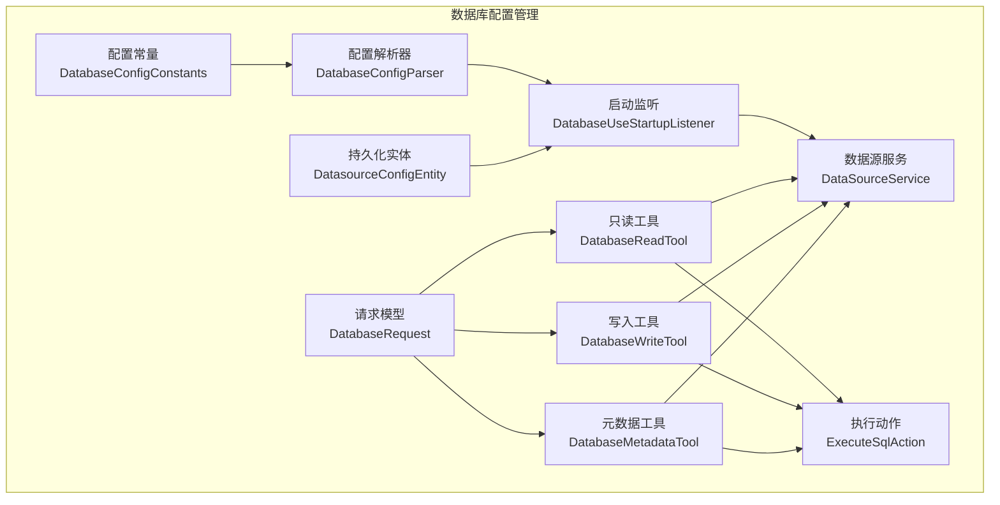
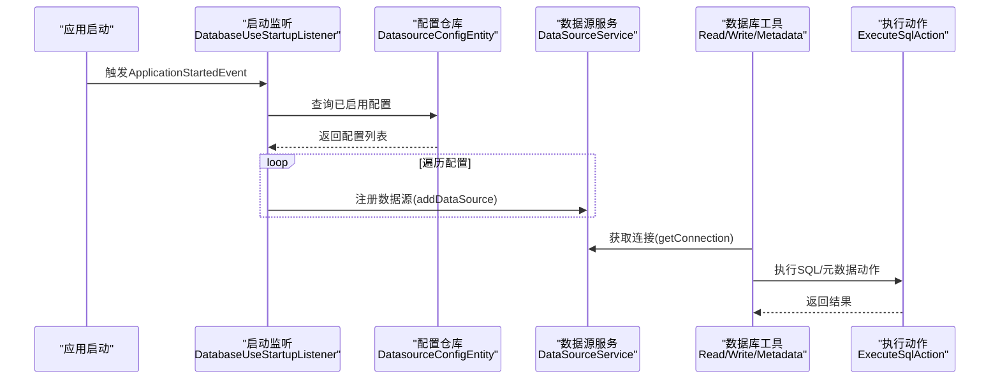
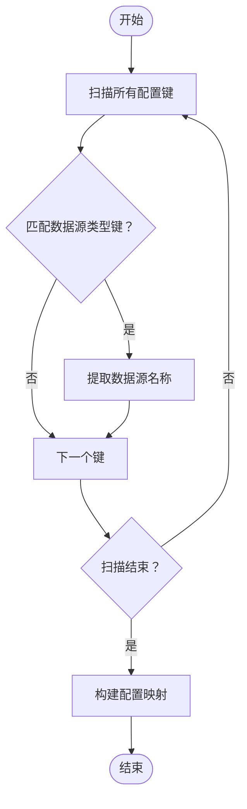
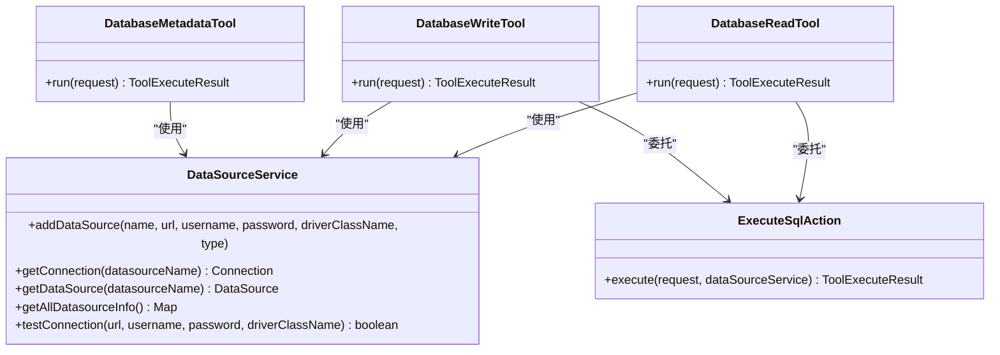
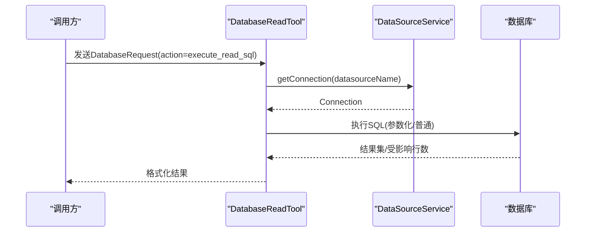
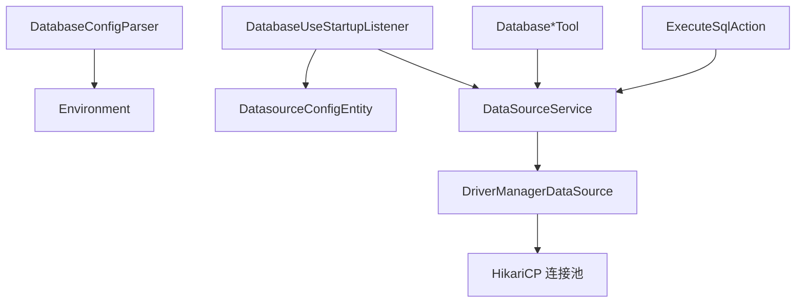

# 数据库配置管理

<cite>
**本文档引用的文件**
- [DataSourceService.java](file://src/main/java/com/alibaba/cloud/ai/lynxe/tool/database/DataSourceService.java)
- [DatabaseConfigParser.java](file://src/main/java/com/alibaba/cloud/ai/lynxe/tool/database/DatabaseConfigParser.java)
- [DatabaseConfigConstants.java](file://src/main/java/com/alibaba/cloud/ai/lynxe/tool/database/DatabaseConfigConstants.java)
- [DatabaseReadTool.java](file://src/main/java/com/alibaba/cloud/ai/lynxe/tool/database/DatabaseReadTool.java)
- [DatabaseWriteTool.java](file://src/main/java/com/alibaba/cloud/ai/lynxe/tool/database/DatabaseWriteTool.java)
- [DatabaseMetadataTool.java](file://src/main/java/com/alibaba/cloud/ai/lynxe/tool/database/DatabaseMetadataTool.java)
- [DatabaseRequest.java](file://src/main/java/com/alibaba/cloud/ai/lynxe/tool/database/DatabaseRequest.java)
- [DatabaseUseStartupListener.java](file://src/main/java/com/alibaba/cloud/ai/lynxe/tool/database/DatabaseUseStartupListener.java)
- [ExecuteSqlAction.java](file://src/main/java/com/alibaba/cloud/ai/lynxe/tool/database/action/ExecuteSqlAction.java)
- [DatasourceConfigEntity.java](file://src/main/java/com/alibaba/cloud/ai/lynxe/tool/database/model/po/DatasourceConfigEntity.java)
- [application.yml](file://src/main/resources/application.yml)
- [application-mysql.yml](file://src/main/resources/application-mysql.yml)
- [application-postgres.yml](file://src/main/resources/application-postgres.yml)
</cite>

## 目录
1. [简介](#简介)
2. [项目结构](#项目结构)
3. [核心组件](#核心组件)
4. [架构总览](#架构总览)
5. [详细组件分析](#详细组件分析)
6. [依赖关系分析](#依赖关系分析)
7. [性能考虑](#性能考虑)
8. [故障排查指南](#故障排查指南)
9. [结论](#结论)
10. [附录](#附录)

## 简介
本文件面向Lynxe数据库配置管理系统，系统性阐述数据库配置的定义、解析与验证机制，数据库连接配置的关键参数（连接URL、用户名、密码、驱动类名等），连接池与健康检查能力，以及与数据库工具、元数据查询的集成关系。文档同时覆盖多数据源支持、只读/读写工具划分、参数化执行与批量处理、以及可扩展的配置发现与启动初始化流程。

## 项目结构
数据库配置管理相关代码主要位于工具模块的database包下，并通过Spring Boot的配置文件进行全局连接池与JPA设置。核心文件包括：
- 配置常量与解析器：DatabaseConfigConstants、DatabaseConfigParser
- 数据源服务：DataSourceService
- 工具入口：DatabaseReadTool、DatabaseWriteTool、DatabaseMetadataTool
- 请求模型：DatabaseRequest
- 启动监听与持久化实体：DatabaseUseStartupListener、DatasourceConfigEntity
- 执行动作：ExecuteSqlAction
- 应用配置：application.yml、application-mysql.yml、application-postgres.yml

**图表来源**
- [DatabaseConfigConstants.java:22-47](file://src/main/java/com/alibaba/cloud/ai/lynxe/tool/database/DatabaseConfigConstants.java#L22-L47)
- [DatabaseConfigParser.java:31-193](file://src/main/java/com/alibaba/cloud/ai/lynxe/tool/database/DatabaseConfigParser.java#L31-L193)
- [DataSourceService.java:32-214](file://src/main/java/com/alibaba/cloud/ai/lynxe/tool/database/DataSourceService.java#L32-L214)
- [DatabaseReadTool.java:35-165](file://src/main/java/com/alibaba/cloud/ai/lynxe/tool/database/DatabaseReadTool.java#L35-L165)
- [DatabaseWriteTool.java:32-141](file://src/main/java/com/alibaba/cloud/ai/lynxe/tool/database/DatabaseWriteTool.java#L32-L141)
- [DatabaseMetadataTool.java:34-187](file://src/main/java/com/alibaba/cloud/ai/lynxe/tool/database/DatabaseMetadataTool.java#L34-L187)
- [DatabaseRequest.java:32-201](file://src/main/java/com/alibaba/cloud/ai/lynxe/tool/database/DatabaseRequest.java#L32-L201)
- [DatabaseUseStartupListener.java:32-149](file://src/main/java/com/alibaba/cloud/ai/lynxe/tool/database/DatabaseUseStartupListener.java#L32-L149)
- [ExecuteSqlAction.java:34-364](file://src/main/java/com/alibaba/cloud/ai/lynxe/tool/database/action/ExecuteSqlAction.java#L34-L364)
- [DatasourceConfigEntity.java:31-173](file://src/main/java/com/alibaba/cloud/ai/lynxe/tool/database/model/po/DatasourceConfigEntity.java#L31-L173)

**章节来源**
- [DatabaseConfigConstants.java:22-47](file://src/main/java/com/alibaba/cloud/ai/lynxe/tool/database/DatabaseConfigConstants.java#L22-L47)
- [DatabaseConfigParser.java:31-193](file://src/main/java/com/alibaba/cloud/ai/lynxe/tool/database/DatabaseConfigParser.java#L31-L193)
- [DataSourceService.java:32-214](file://src/main/java/com/alibaba/cloud/ai/lynxe/tool/database/DataSourceService.java#L32-L214)
- [DatabaseUseStartupListener.java:32-149](file://src/main/java/com/alibaba/cloud/ai/lynxe/tool/database/DatabaseUseStartupListener.java#L32-L149)

## 核心组件
- 配置常量与前缀：统一定义配置键前缀与属性名，确保解析一致性。
- 配置解析器：从Environment动态扫描并提取所有数据源配置，形成标准化配置映射。
- 数据源服务：以名称为键管理DataSource实例，提供连接获取、类型查询、连接测试等能力。
- 工具层：按功能拆分为只读、写入、元数据三类工具，均通过DataSourceService执行SQL或元数据查询。
- 请求模型：封装操作类型、SQL语句、文本过滤、数据源名称、参数列表、结果落盘文件名等。
- 启动监听：应用启动后从数据库加载已启用的数据源配置，动态注册到DataSourceService。
- 执行动作：实现参数化SQL执行、批量插入、结果集格式化输出等。
- 持久化实体：记录数据源配置的实体模型，用于数据库存储与管理。

**章节来源**
- [DatabaseConfigConstants.java:22-47](file://src/main/java/com/alibaba/cloud/ai/lynxe/tool/database/DatabaseConfigConstants.java#L22-L47)
- [DatabaseConfigParser.java:136-191](file://src/main/java/com/alibaba/cloud/ai/lynxe/tool/database/DatabaseConfigParser.java#L136-L191)
- [DataSourceService.java:43-212](file://src/main/java/com/alibaba/cloud/ai/lynxe/tool/database/DataSourceService.java#L43-L212)
- [DatabaseReadTool.java:87-120](file://src/main/java/com/alibaba/cloud/ai/lynxe/tool/database/DatabaseReadTool.java#L87-L120)
- [DatabaseWriteTool.java:78-96](file://src/main/java/com/alibaba/cloud/ai/lynxe/tool/database/DatabaseWriteTool.java#L78-L96)
- [DatabaseMetadataTool.java:83-117](file://src/main/java/com/alibaba/cloud/ai/lynxe/tool/database/DatabaseMetadataTool.java#L83-L117)
- [DatabaseRequest.java:32-201](file://src/main/java/com/alibaba/cloud/ai/lynxe/tool/database/DatabaseRequest.java#L32-L201)
- [DatabaseUseStartupListener.java:47-104](file://src/main/java/com/alibaba/cloud/ai/lynxe/tool/database/DatabaseUseStartupListener.java#L47-L104)
- [ExecuteSqlAction.java:38-273](file://src/main/java/com/alibaba/cloud/ai/lynxe/tool/database/action/ExecuteSqlAction.java#L38-L273)
- [DatasourceConfigEntity.java:31-173](file://src/main/java/com/alibaba/cloud/ai/lynxe/tool/database/model/po/DatasourceConfigEntity.java#L31-L173)

## 架构总览
系统采用“配置发现/加载—数据源注册—工具执行—动作编排”的分层架构。配置解析器负责从运行环境发现数据源；启动监听器从持久化配置加载并注册到数据源服务；工具层根据请求选择对应动作，最终由执行动作完成SQL执行与结果格式化。

**图表来源**
- [DatabaseUseStartupListener.java:43-74](file://src/main/java/com/alibaba/cloud/ai/lynxe/tool/database/DatabaseUseStartupListener.java#L43-L74)
- [DatasourceConfigEntity.java:31-173](file://src/main/java/com/alibaba/cloud/ai/lynxe/tool/database/model/po/DatasourceConfigEntity.java#L31-L173)
- [DataSourceService.java:43-91](file://src/main/java/com/alibaba/cloud/ai/lynxe/tool/database/DataSourceService.java#L43-L91)
- [DatabaseReadTool.java:87-101](file://src/main/java/com/alibaba/cloud/ai/lynxe/tool/database/DatabaseReadTool.java#L87-L101)
- [DatabaseWriteTool.java:78-90](file://src/main/java/com/alibaba/cloud/ai/lynxe/tool/database/DatabaseWriteTool.java#L78-L90)
- [DatabaseMetadataTool.java:83-108](file://src/main/java/com/alibaba/cloud/ai/lynxe/tool/database/DatabaseMetadataTool.java#L83-L108)
- [ExecuteSqlAction.java:38-57](file://src/main/java/com/alibaba/cloud/ai/lynxe/tool/database/action/ExecuteSqlAction.java#L38-L57)

## 详细组件分析

### 配置定义与解析机制
- 配置前缀与属性：通过常量定义统一前缀与属性名，保证解析器与工具层一致识别。
- 动态发现：解析器遍历Environment中的所有属性键，匹配形如“前缀+名称+“.type”的键，提取数据源名称集合。
- 配置提取：对每个数据源名称，拼接完整键读取type、enable、url、driver-class-name、username、password等字段，形成标准化配置映射。
- 安全与健壮性：在解析过程中捕获异常并返回空集合，避免影响启动流程。

**图表来源**
- [DatabaseConfigParser.java:44-68](file://src/main/java/com/alibaba/cloud/ai/lynxe/tool/database/DatabaseConfigParser.java#L44-L68)
- [DatabaseConfigParser.java:104-131](file://src/main/java/com/alibaba/cloud/ai/lynxe/tool/database/DatabaseConfigParser.java#L104-L131)
- [DatabaseConfigParser.java:136-167](file://src/main/java/com/alibaba/cloud/ai/lynxe/tool/database/DatabaseConfigParser.java#L136-L167)

**章节来源**
- [DatabaseConfigConstants.java:24-38](file://src/main/java/com/alibaba/cloud/ai/lynxe/tool/database/DatabaseConfigConstants.java#L24-L38)
- [DatabaseConfigParser.java:44-68](file://src/main/java/com/alibaba/cloud/ai/lynxe/tool/database/DatabaseConfigParser.java#L44-L68)
- [DatabaseConfigParser.java:136-167](file://src/main/java/com/alibaba/cloud/ai/lynxe/tool/database/DatabaseConfigParser.java#L136-L167)

### 数据库连接配置参数体系
- 关键参数
  - 类型(type)：标识数据源类型，用于工具状态展示与后续扩展。
  - 启用(enable)：布尔值，决定是否在启动时注册该数据源。
  - 连接URL(url)：JDBC连接字符串，指向具体数据库实例。
  - 驱动类名(driver-class-name)：JDBC驱动实现类名。
  - 用户名(username)：数据库访问用户。
  - 密码(password)：数据库访问口令。
- 参数校验与默认行为
  - 解析器仅当type、url、driver-class-name非空时才认为配置有效。
  - 启动监听器会忽略未启用或不完整的配置条目。

**章节来源**
- [DatabaseConfigConstants.java:28-38](file://src/main/java/com/alibaba/cloud/ai/lynxe/tool/database/DatabaseConfigConstants.java#L28-L38)
- [DatabaseConfigParser.java:152-163](file://src/main/java/com/alibaba/cloud/ai/lynxe/tool/database/DatabaseConfigParser.java#L152-L163)
- [DatabaseUseStartupListener.java:86-98](file://src/main/java/com/alibaba/cloud/ai/lynxe/tool/database/DatabaseUseStartupListener.java#L86-L98)

### 连接池管理与健康检查
- 连接池配置
  - 全局连接池：通过application.yml中spring.datasource.hikari.*配置连接池参数，如最大池大小、最小空闲、连接超时、空闲超时、最大生存时间、验证查询、泄漏检测阈值等。
  - JPA设置：关闭Open Session In View以避免性能问题，开启SQL格式化输出。
- 健康检查与连接测试
  - 数据源服务提供testConnection方法，使用临时DataSource尝试建立连接并判断连接有效性。
  - 工具层在状态查询中对每个数据源尝试获取连接，输出连接状态。
- 自动重连机制
  - 当前实现未内置自动重连逻辑；若连接失效，建议调用方在上层业务中重新获取连接或触发重试。

**图表来源**
- [DataSourceService.java:43-212](file://src/main/java/com/alibaba/cloud/ai/lynxe/tool/database/DataSourceService.java#L43-L212)
- [DatabaseReadTool.java:87-120](file://src/main/java/com/alibaba/cloud/ai/lynxe/tool/database/DatabaseReadTool.java#L87-L120)
- [DatabaseWriteTool.java:78-96](file://src/main/java/com/alibaba/cloud/ai/lynxe/tool/database/DatabaseWriteTool.java#L78-L96)
- [DatabaseMetadataTool.java:83-117](file://src/main/java/com/alibaba/cloud/ai/lynxe/tool/database/DatabaseMetadataTool.java#L83-L117)
- [ExecuteSqlAction.java:38-57](file://src/main/java/com/alibaba/cloud/ai/lynxe/tool/database/action/ExecuteSqlAction.java#L38-L57)

**章节来源**
- [application.yml:20-30](file://src/main/resources/application.yml#L20-L30)
- [application.yml:32-38](file://src/main/resources/application.yml#L32-L38)
- [DataSourceService.java:192-212](file://src/main/java/com/alibaba/cloud/ai/lynxe/tool/database/DataSourceService.java#L192-L212)
- [DatabaseMetadataTool.java:161-170](file://src/main/java/com/alibaba/cloud/ai/lynxe/tool/database/DatabaseMetadataTool.java#L161-L170)

### 多数据源支持、读写分离与负载均衡
- 多数据源支持
  - 通过名称区分不同数据源，工具请求中可指定datasourceName实现切换。
  - 数据源服务以名称为键维护DataSource映射，支持动态注册与查询。
- 读写分离与策略
  - 工具层通过DatabaseReadTool、DatabaseWriteTool进行职责分离，读取工具限制为SELECT语句，写入工具仅支持写入动作。
  - 负载均衡：当前未实现自动路由与权重策略；可在上层业务或自定义工具中扩展基于读写比例的路由策略。
- 元数据与工具状态
  - 元数据工具提供数据源信息查询与表元数据/索引查询，辅助实现读写分离场景下的表分布认知。

**章节来源**
- [DatabaseRequest.java:72-80](file://src/main/java/com/alibaba/cloud/ai/lynxe/tool/database/DatabaseRequest.java#L72-L80)
- [DatabaseReadTool.java:96-100](file://src/main/java/com/alibaba/cloud/ai/lynxe/tool/database/DatabaseReadTool.java#L96-L100)
- [DatabaseWriteTool.java:85-87](file://src/main/java/com/alibaba/cloud/ai/lynxe/tool/database/DatabaseWriteTool.java#L85-L87)
- [DatabaseMetadataTool.java:105-108](file://src/main/java/com/alibaba/cloud/ai/lynxe/tool/database/DatabaseMetadataTool.java#L105-L108)

### 加密存储、敏感信息保护与安全访问控制
- 敏感信息存储
  - 密码字段通过DatasourceConfigEntity持久化存储，建议结合外部密钥管理服务（如KMS）进行加密存储与解密注入。
- 访问控制
  - 工具层未内置鉴权/授权逻辑；建议在API网关或服务层增加访问控制与审计日志。
- 日志与输出
  - 工具输出包含数据源名称与类型，避免泄露敏感URL细节；连接测试仅记录URL概要。

**章节来源**
- [DatasourceConfigEntity.java:48-58](file://src/main/java/com/alibaba/cloud/ai/lynxe/tool/database/model/po/DatasourceConfigEntity.java#L48-L58)
- [DatabaseMetadataTool.java:134-170](file://src/main/java/com/alibaba/cloud/ai/lynxe/tool/database/DatabaseMetadataTool.java#L134-L170)

### 与数据库工具、元数据查询的集成
- 工具分类与职责
  - 只读工具：支持执行SELECT语句、获取表名、将查询结果导出为JSON文件。
  - 写入工具：支持执行写入SQL（INSERT/UPDATE/DELETE）。
  - 元数据工具：支持表元数据、索引信息、数据源信息查询。
- 执行链路
  - 工具接收DatabaseRequest，根据action分派至对应动作；动作通过DataSourceService获取连接，执行SQL或查询元数据，格式化输出。

**图表来源**
- [DatabaseReadTool.java:87-120](file://src/main/java/com/alibaba/cloud/ai/lynxe/tool/database/DatabaseReadTool.java#L87-L120)
- [ExecuteSqlAction.java:38-57](file://src/main/java/com/alibaba/cloud/ai/lynxe/tool/database/action/ExecuteSqlAction.java#L38-L57)
- [DataSourceService.java:85-91](file://src/main/java/com/alibaba/cloud/ai/lynxe/tool/database/DataSourceService.java#L85-L91)

**章节来源**
- [DatabaseReadTool.java:87-120](file://src/main/java/com/alibaba/cloud/ai/lynxe/tool/database/DatabaseReadTool.java#L87-L120)
- [DatabaseWriteTool.java:78-96](file://src/main/java/com/alibaba/cloud/ai/lynxe/tool/database/DatabaseWriteTool.java#L78-L96)
- [DatabaseMetadataTool.java:83-117](file://src/main/java/com/alibaba/cloud/ai/lynxe/tool/database/DatabaseMetadataTool.java#L83-L117)
- [ExecuteSqlAction.java:38-273](file://src/main/java/com/alibaba/cloud/ai/lynxe/tool/database/action/ExecuteSqlAction.java#L38-L273)

## 依赖关系分析
- 组件内聚与耦合
  - DataSourceService作为核心依赖点，被三大工具共享；工具与动作之间通过接口式委托降低耦合。
  - 配置解析器与启动监听器耦合于Environment与持久化实体，便于扩展新的配置来源。
- 外部依赖
  - 使用Spring JDBC的DriverManagerDataSource进行连接管理；全局连接池由HikariCP提供。
  - JPA/Hibernate用于元数据查询与实体持久化。

**图表来源**
- [DatabaseConfigParser.java:37-39](file://src/main/java/com/alibaba/cloud/ai/lynxe/tool/database/DatabaseConfigParser.java#L37-L39)
- [DatabaseUseStartupListener.java:36-40](file://src/main/java/com/alibaba/cloud/ai/lynxe/tool/database/DatabaseUseStartupListener.java#L36-L40)
- [DatasourceConfigEntity.java:31-173](file://src/main/java/com/alibaba/cloud/ai/lynxe/tool/database/model/po/DatasourceConfigEntity.java#L31-L173)
- [DataSourceService.java:53-57](file://src/main/java/com/alibaba/cloud/ai/lynxe/tool/database/DataSourceService.java#L53-L57)
- [application.yml:20-30](file://src/main/resources/application.yml#L20-L30)

**章节来源**
- [DatabaseConfigParser.java:37-39](file://src/main/java/com/alibaba/cloud/ai/lynxe/tool/database/DatabaseConfigParser.java#L37-L39)
- [DatabaseUseStartupListener.java:36-40](file://src/main/java/com/alibaba/cloud/ai/lynxe/tool/database/DatabaseUseStartupListener.java#L36-L40)
- [DataSourceService.java:53-57](file://src/main/java/com/alibaba/cloud/ai/lynxe/tool/database/DataSourceService.java#L53-L57)
- [application.yml:20-30](file://src/main/resources/application.yml#L20-L30)

## 性能考虑
- 连接池参数建议
  - 根据并发与数据库承载能力调整maximum-pool-size与minimum-idle；合理设置connection-timeout与idle-timeout，避免连接泄漏。
  - 启用validation-timeout与connection-test-query，确保连接可用性。
- SQL执行优化
  - 优先使用参数化查询与批处理（ExecuteSqlAction支持批量参数），减少SQL解析与网络往返。
  - 对大数据量导出，建议分页查询或流式输出，避免内存峰值。
- 日志与监控
  - 开启SQL格式化输出便于诊断；结合连接池指标（活跃连接数、等待时间、泄漏检测）进行监控。
  - 工具层输出包含受影响行数与执行摘要，便于快速定位问题。

**章节来源**
- [application.yml:20-30](file://src/main/resources/application.yml#L20-L30)
- [application.yml:32-38](file://src/main/resources/application.yml#L32-L38)
- [ExecuteSqlAction.java:63-176](file://src/main/java/com/alibaba/cloud/ai/lynxe/tool/database/action/ExecuteSqlAction.java#L63-L176)

## 故障排查指南
- 启动阶段
  - 若无启用配置，启动监听器会记录警告并输出汇总；确认DatasourceConfigEntity中enable字段与配置键前缀一致。
- 连接失败
  - 使用testConnection方法验证URL、驱动类名与凭据；检查DataSourceService.getConnection抛出的异常信息。
- 工具执行异常
  - 只读工具限制非SELECT语句；写入工具仅支持写入动作；参数化执行需确保占位符数量与参数列表一致。
- 输出与状态
  - 元数据工具会在状态中显示每个数据源的连接状态；若连接失败，查看对应错误消息。

**章节来源**
- [DatabaseUseStartupListener.java:54-57](file://src/main/java/com/alibaba/cloud/ai/lynxe/tool/database/DatabaseUseStartupListener.java#L54-L57)
- [DataSourceService.java:192-212](file://src/main/java/com/alibaba/cloud/ai/lynxe/tool/database/DataSourceService.java#L192-L212)
- [DatabaseReadTool.java:96-100](file://src/main/java/com/alibaba/cloud/ai/lynxe/tool/database/DatabaseReadTool.java#L96-L100)
- [DatabaseWriteTool.java:85-87](file://src/main/java/com/alibaba/cloud/ai/lynxe/tool/database/DatabaseWriteTool.java#L85-L87)
- [DatabaseMetadataTool.java:161-170](file://src/main/java/com/alibaba/cloud/ai/lynxe/tool/database/DatabaseMetadataTool.java#L161-L170)

## 结论
Lynxe数据库配置管理系统通过清晰的配置常量与解析器、灵活的数据源服务、分层的工具与动作设计，实现了对多数据源的统一接入与高效执行。结合HikariCP连接池与JPA元数据能力，系统具备良好的可扩展性与可观测性。建议在生产环境中配合密钥管理与访问控制策略，进一步强化安全与稳定性。

## 附录
- 配置示例参考
  - MySQL配置样例：application-mysql.yml
  - PostgreSQL配置样例：application-postgres.yml
  - 全局连接池与JPA配置：application.yml

**章节来源**
- [application-mysql.yml:1-15](file://src/main/resources/application-mysql.yml#L1-L15)
- [application-postgres.yml:1-15](file://src/main/resources/application-postgres.yml#L1-L15)
- [application.yml:20-38](file://src/main/resources/application.yml#L20-L38)