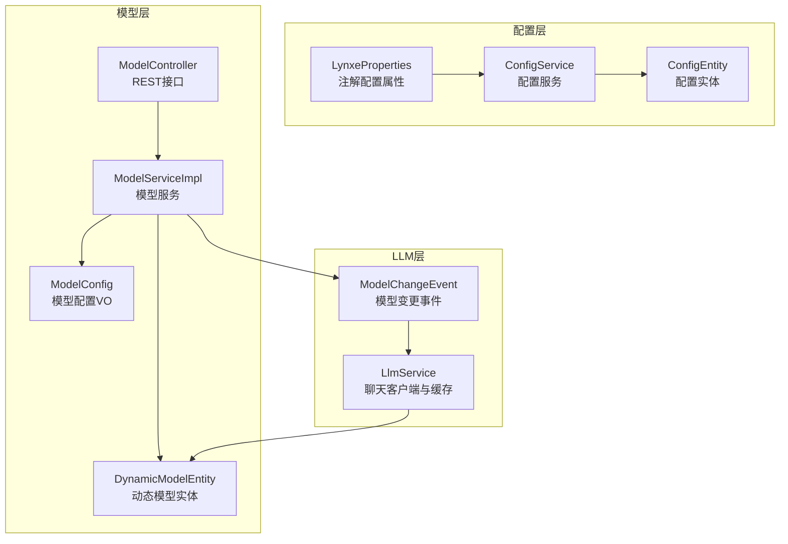
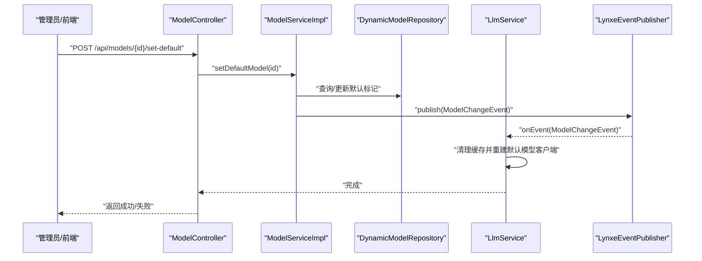
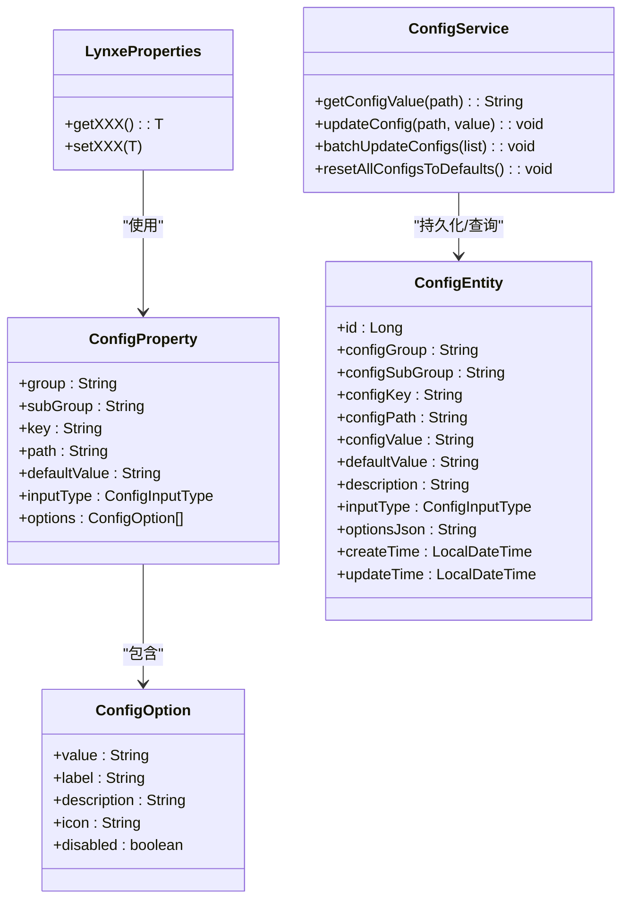
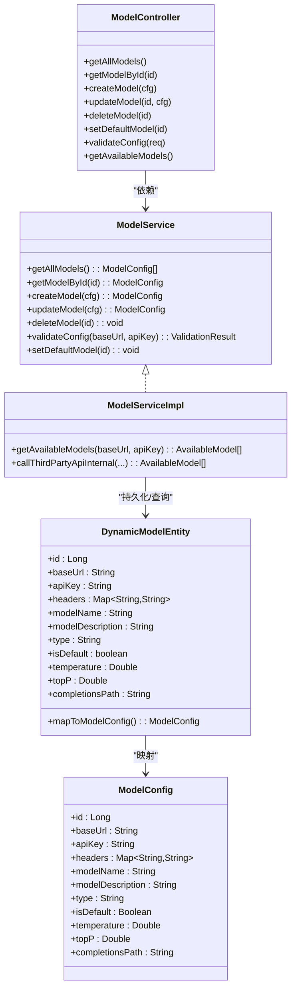
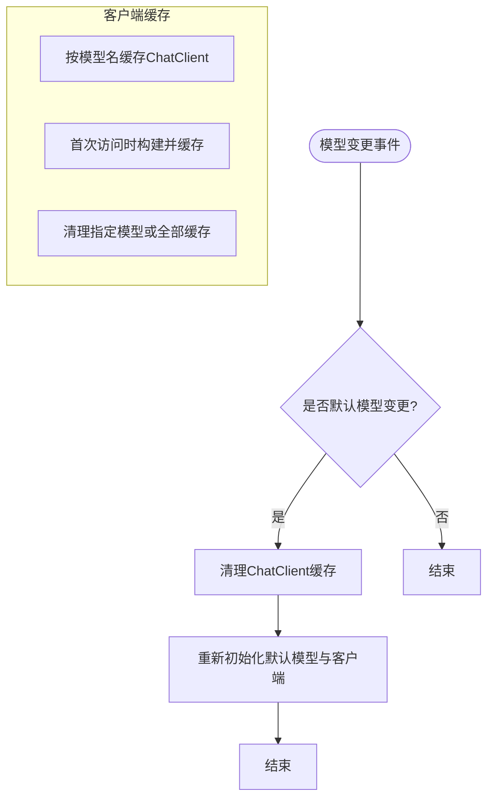
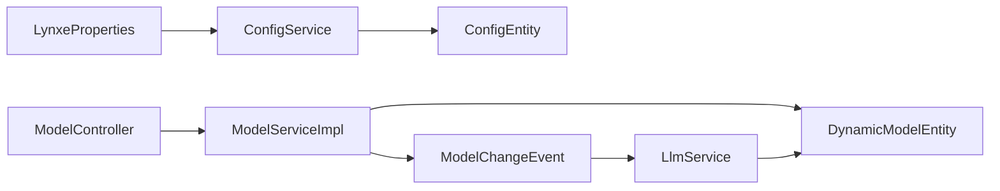

# 模型配置管理

<cite>
**本文档引用的文件**
- [ConfigService.java](file://src/main/java/com/alibaba/cloud/ai/lynxe/config/ConfigService.java)
- [IConfigService.java](file://src/main/java/com/alibaba/cloud/ai/lynxe/config/IConfigService.java)
- [ConfigProperty.java](file://src/main/java/com/alibaba/cloud/ai/lynxe/config/ConfigProperty.java)
- [ConfigOption.java](file://src/main/java/com/alibaba/cloud/ai/lynxe/config/ConfigOption.java)
- [ConfigEntity.java](file://src/main/java/com/alibaba/cloud/ai/lynxe/config/entity/ConfigEntity.java)
- [ConfigInputType.java](file://src/main/java/com/alibaba/cloud/ai/lynxe/config/entity/ConfigInputType.java)
- [LynxeProperties.java](file://src/main/java/com/alibaba/cloud/ai/lynxe/config/LynxeProperties.java)
- [ModelService.java](file://src/main/java/com/alibaba/cloud/ai/lynxe/model/service/ModelService.java)
- [ModelServiceImpl.java](file://src/main/java/com/alibaba/cloud/ai/lynxe/model/service/ModelServiceImpl.java)
- [DynamicModelEntity.java](file://src/main/java/com/alibaba/cloud/ai/lynxe/model/entity/DynamicModelEntity.java)
- [ModelConfig.java](file://src/main/java/com/alibaba/cloud/ai/lynxe/model/model/vo/ModelConfig.java)
- [ModelController.java](file://src/main/java/com/alibaba/cloud/ai/lynxe/model/controller/ModelController.java)
- [LlmService.java](file://src/main/java/com/alibaba/cloud/ai/lynxe/llm/LlmService.java)
- [ModelChangeEvent.java](file://src/main/java/com/alibaba/cloud/ai/lynxe/event/ModelChangeEvent.java)
- [application.yml](file://src/main/resources/application.yml)
</cite>

## 目录
1. [简介](#简介)
2. [项目结构](#项目结构)
3. [核心组件](#核心组件)
4. [架构总览](#架构总览)
5. [详细组件分析](#详细组件分析)
6. [依赖关系分析](#依赖关系分析)
7. [性能考量](#性能考量)
8. [故障排查指南](#故障排查指南)
9. [结论](#结论)
10. [附录](#附录)

## 简介
本文件系统性阐述Lynxe模型配置管理系统的定义、加载与管理机制，覆盖以下方面：
- 模型配置的分类体系：LLM模型、嵌入模型、图像生成模型等的配置方式
- 参数体系：模型名称、API密钥、端点URL、超时设置等关键参数
- 验证规则、默认值处理与配置冲突解决策略
- 动态切换、热更新与回滚机制
- 与代理系统的集成方式与运行时行为
- 最佳实践与性能优化建议

## 项目结构
围绕“配置管理”与“模型管理”的核心模块如下：
- 配置层：注解驱动的配置属性定义、数据库持久化、缓存与热更新
- 模型层：动态模型实体、服务与控制器，支持第三方模型可用性校验与默认模型切换
- LLM层：基于Spring AI的ChatClient构建与缓存，响应模型变更事件进行热更新
- 配置与模型的交互：通过事件总线实现模型变更后的缓存清理与重建

**图表来源**
- [LynxeProperties.java:28-654](file://src/main/java/com/alibaba/cloud/ai/lynxe/config/LynxeProperties.java#L28-L654)
- [ConfigService.java:42-320](file://src/main/java/com/alibaba/cloud/ai/lynxe/config/ConfigService.java#L42-L320)
- [ConfigEntity.java:36-218](file://src/main/java/com/alibaba/cloud/ai/lynxe/config/entity/ConfigEntity.java#L36-L218)
- [ModelController.java:38-176](file://src/main/java/com/alibaba/cloud/ai/lynxe/model/controller/ModelController.java#L38-L176)
- [ModelServiceImpl.java:54-485](file://src/main/java/com/alibaba/cloud/ai/lynxe/model/service/ModelServiceImpl.java#L54-L485)
- [DynamicModelEntity.java:26-190](file://src/main/java/com/alibaba/cloud/ai/lynxe/model/entity/DynamicModelEntity.java#L26-L190)
- [ModelConfig.java:24-137](file://src/main/java/com/alibaba/cloud/ai/lynxe/model/model/vo/ModelConfig.java#L24-L137)
- [LlmService.java:57-482](file://src/main/java/com/alibaba/cloud/ai/lynxe/llm/LlmService.java#L57-L482)
- [ModelChangeEvent.java:25-45](file://src/main/java/com/alibaba/cloud/ai/lynxe/event/ModelChangeEvent.java#L25-L45)

**章节来源**
- [application.yml:1-97](file://src/main/resources/application.yml#L1-L97)

## 核心组件
- 注解驱动的配置属性定义：通过自定义注解在配置类中声明可管理的配置项，支持分组、子组、键、描述、默认值、输入类型与下拉选项。
- 配置服务：扫描带有配置注解的Bean，初始化数据库中的配置记录，提供查询、更新、批量更新、重置默认值等能力，并维护内存缓存。
- 模型服务：管理动态模型实体，提供创建、更新、删除、默认模型设置、第三方可用模型校验与缓存。
- LLM服务：基于OpenAI兼容API构建ChatClient，维护模型级缓存；监听模型变更事件以热更新默认模型与客户端实例。
- 控制器：对外暴露REST接口，用于模型列表、增删改查、默认模型设置、可用模型查询与配置校验。

**章节来源**
- [ConfigProperty.java:37-89](file://src/main/java/com/alibaba/cloud/ai/lynxe/config/ConfigProperty.java#L37-L89)
- [ConfigOption.java:30-64](file://src/main/java/com/alibaba/cloud/ai/lynxe/config/ConfigOption.java#L30-L64)
- [ConfigService.java:42-320](file://src/main/java/com/alibaba/cloud/ai/lynxe/config/ConfigService.java#L42-L320)
- [ConfigEntity.java:36-218](file://src/main/java/com/alibaba/cloud/ai/lynxe/config/entity/ConfigEntity.java#L36-L218)
- [ModelServiceImpl.java:54-485](file://src/main/java/com/alibaba/cloud/ai/lynxe/model/service/ModelServiceImpl.java#L54-L485)
- [DynamicModelEntity.java:26-190](file://src/main/java/com/alibaba/cloud/ai/lynxe/model/entity/DynamicModelEntity.java#L26-L190)
- [ModelConfig.java:24-137](file://src/main/java/com/alibaba/cloud/ai/lynxe/model/model/vo/ModelConfig.java#L24-L137)
- [LlmService.java:57-482](file://src/main/java/com/alibaba/cloud/ai/lynxe/llm/LlmService.java#L57-L482)
- [ModelController.java:38-176](file://src/main/java/com/alibaba/cloud/ai/lynxe/model/controller/ModelController.java#L38-L176)

## 架构总览
Lynxe采用“注解+数据库+缓存+事件”的架构实现配置与模型的动态管理：
- 启动阶段：配置服务扫描配置Bean，将注解声明的配置项写入数据库并注入到对应Bean字段。
- 运行阶段：配置服务提供查询与更新；模型服务负责动态模型的CRUD与默认模型切换；LLM服务根据默认模型构建ChatClient并缓存；模型变更通过事件触发LLM层缓存清理与重建。
- 外部接口：模型控制器提供REST接口，支持配置校验、默认模型设置与可用模型查询。

**图表来源**
- [ModelController.java:107-126](file://src/main/java/com/alibaba/cloud/ai/lynxe/model/controller/ModelController.java#L107-L126)
- [ModelServiceImpl.java:357-385](file://src/main/java/com/alibaba/cloud/ai/lynxe/model/service/ModelServiceImpl.java#L357-L385)
- [LlmService.java:266-293](file://src/main/java/com/alibaba/cloud/ai/lynxe/llm/LlmService.java#L266-L293)
- [ModelChangeEvent.java:25-45](file://src/main/java/com/alibaba/cloud/ai/lynxe/event/ModelChangeEvent.java#L25-L45)

## 详细组件分析

### 配置系统（注解、实体与服务）
- 配置注解：支持三级分组（group.subGroup.key），声明描述、默认值、输入类型与下拉选项。
- 配置实体：持久化配置项，包含分组、子组、键、路径、值、默认值、描述、输入类型、选项JSON与时间戳。
- 配置服务：启动时扫描配置Bean，清理过时配置，初始化缺失配置；提供查询、更新、批量更新、重置默认值；更新后反射设置Bean字段并刷新缓存。

**图表来源**
- [LynxeProperties.java:28-654](file://src/main/java/com/alibaba/cloud/ai/lynxe/config/LynxeProperties.java#L28-L654)
- [ConfigProperty.java:37-89](file://src/main/java/com/alibaba/cloud/ai/lynxe/config/ConfigProperty.java#L37-L89)
- [ConfigOption.java:30-64](file://src/main/java/com/alibaba/cloud/ai/lynxe/config/ConfigOption.java#L30-L64)
- [ConfigEntity.java:36-218](file://src/main/java/com/alibaba/cloud/ai/lynxe/config/entity/ConfigEntity.java#L36-L218)
- [ConfigService.java:42-320](file://src/main/java/com/alibaba/cloud/ai/lynxe/config/ConfigService.java#L42-L320)

**章节来源**
- [ConfigProperty.java:37-89](file://src/main/java/com/alibaba/cloud/ai/lynxe/config/ConfigProperty.java#L37-L89)
- [ConfigOption.java:30-64](file://src/main/java/com/alibaba/cloud/ai/lynxe/config/ConfigOption.java#L30-L64)
- [ConfigEntity.java:36-218](file://src/main/java/com/alibaba/cloud/ai/lynxe/config/entity/ConfigEntity.java#L36-L218)
- [ConfigService.java:42-320](file://src/main/java/com/alibaba/cloud/ai/lynxe/config/ConfigService.java#L42-L320)
- [IConfigService.java:27-81](file://src/main/java/com/alibaba/cloud/ai/lynxe/config/IConfigService.java#L27-L81)

### 模型配置系统（动态模型与控制器）
- 动态模型实体：包含基础URL、API密钥、请求头、模型名称、描述、类型、是否默认、采样参数与补全路径。
- 模型配置VO：对外传输对象，屏蔽敏感信息（API密钥掩码显示）。
- 模型服务：提供CRUD、默认模型设置、第三方可用模型校验（含URL格式、API密钥格式与网络连通性）、缓存控制与事件发布。
- 模型控制器：提供REST接口，支持模型列表、详情、创建、更新、删除、默认模型设置、可用模型查询与配置校验。

**图表来源**
- [DynamicModelEntity.java:26-190](file://src/main/java/com/alibaba/cloud/ai/lynxe/model/entity/DynamicModelEntity.java#L26-L190)
- [ModelConfig.java:24-137](file://src/main/java/com/alibaba/cloud/ai/lynxe/model/model/vo/ModelConfig.java#L24-L137)
- [ModelService.java:23-40](file://src/main/java/com/alibaba/cloud/ai/lynxe/model/service/ModelService.java#L23-L40)
- [ModelServiceImpl.java:54-485](file://src/main/java/com/alibaba/cloud/ai/lynxe/model/service/ModelServiceImpl.java#L54-L485)
- [ModelController.java:38-176](file://src/main/java/com/alibaba/cloud/ai/lynxe/model/controller/ModelController.java#L38-L176)

**章节来源**
- [DynamicModelEntity.java:26-190](file://src/main/java/com/alibaba/cloud/ai/lynxe/model/entity/DynamicModelEntity.java#L26-L190)
- [ModelConfig.java:24-137](file://src/main/java/com/alibaba/cloud/ai/lynxe/model/model/vo/ModelConfig.java#L24-L137)
- [ModelService.java:23-40](file://src/main/java/com/alibaba/cloud/ai/lynxe/model/service/ModelService.java#L23-L40)
- [ModelServiceImpl.java:54-485](file://src/main/java/com/alibaba/cloud/ai/lynxe/model/service/ModelServiceImpl.java#L54-L485)
- [ModelController.java:38-176](file://src/main/java/com/alibaba/cloud/ai/lynxe/model/controller/ModelController.java#L38-L176)

### LLM服务与热更新机制
- 客户端构建：基于OpenAI兼容API构建ChatClient，支持默认模型懒加载、缓存模型客户端实例。
- 缓存策略：按模型名缓存ChatClient，支持清理单个或全部缓存。
- 事件驱动：监听模型变更事件，当默认模型变化时清理缓存并重建客户端，确保热更新生效。
- URL与路径规范化：对基础URL与补全路径进行规范化，避免重复/v1段。

**图表来源**
- [LlmService.java:266-312](file://src/main/java/com/alibaba/cloud/ai/lynxe/llm/LlmService.java#L266-L312)
- [ModelChangeEvent.java:25-45](file://src/main/java/com/alibaba/cloud/ai/lynxe/event/ModelChangeEvent.java#L25-L45)

**章节来源**
- [LlmService.java:57-482](file://src/main/java/com/alibaba/cloud/ai/lynxe/llm/LlmService.java#L57-L482)

### 配置验证与默认值处理
- 配置验证：启动时扫描配置Bean，清理过时配置；初始化缺失配置并从环境变量或注解默认值填充；支持批量更新与重置默认值。
- 默认值处理：配置Bean的getter中优先从配置服务获取值，若为空则回退到注解默认值；部分全局配置提供硬编码默认值保障可用性。
- 输入类型与选项：支持文本、下拉、复选、布尔、数字五种输入类型，下拉框支持选项JSON序列化存储。

**章节来源**
- [ConfigService.java:67-163](file://src/main/java/com/alibaba/cloud/ai/lynxe/config/ConfigService.java#L67-L163)
- [LynxeProperties.java:28-654](file://src/main/java/com/alibaba/cloud/ai/lynxe/config/LynxeProperties.java#L28-L654)
- [ConfigInputType.java:18-46](file://src/main/java/com/alibaba/cloud/ai/lynxe/config/entity/ConfigInputType.java#L18-L46)

### 模型配置验证与第三方可用性
- URL格式校验：要求协议为http/https且非空。
- API密钥校验：长度不小于阈值且非空白。
- 第三方可用模型查询：调用第三方模型列表接口，解析标准响应格式，带2秒缓存避免频繁请求。
- 错误处理：区分认证、网络、限流与未知异常，返回统一验证结果。

**章节来源**
- [ModelServiceImpl.java:190-253](file://src/main/java/com/alibaba/cloud/ai/lynxe/model/service/ModelServiceImpl.java#L190-L253)
- [ModelServiceImpl.java:425-482](file://src/main/java/com/alibaba/cloud/ai/lynxe/model/service/ModelServiceImpl.java#L425-L482)

## 依赖关系分析
- 组件耦合
  - 配置服务与配置实体：强耦合，配置服务负责实体的创建、更新与缓存。
  - 模型服务与动态模型实体：强耦合，模型服务负责实体的CRUD与默认模型设置。
  - LLM服务与动态模型实体：间接耦合，通过事件与默认模型查询实现松耦合。
  - 控制器与服务：控制器直接依赖服务接口，便于扩展与测试。
- 外部依赖
  - Spring AI OpenAI兼容API：构建ChatClient与OpenAiApi。
  - 数据库：JPA持久化配置与动态模型。
  - RestTemplate/WebClient：第三方可用模型查询与HTTP通信。

**图表来源**
- [ConfigService.java:42-320](file://src/main/java/com/alibaba/cloud/ai/lynxe/config/ConfigService.java#L42-L320)
- [ConfigEntity.java:36-218](file://src/main/java/com/alibaba/cloud/ai/lynxe/config/entity/ConfigEntity.java#L36-L218)
- [LynxeProperties.java:28-654](file://src/main/java/com/alibaba/cloud/ai/lynxe/config/LynxeProperties.java#L28-L654)
- [ModelController.java:38-176](file://src/main/java/com/alibaba/cloud/ai/lynxe/model/controller/ModelController.java#L38-L176)
- [ModelServiceImpl.java:54-485](file://src/main/java/com/alibaba/cloud/ai/lynxe/model/service/ModelServiceImpl.java#L54-L485)
- [DynamicModelEntity.java:26-190](file://src/main/java/com/alibaba/cloud/ai/lynxe/model/entity/DynamicModelEntity.java#L26-L190)
- [LlmService.java:57-482](file://src/main/java/com/alibaba/cloud/ai/lynxe/llm/LlmService.java#L57-L482)
- [ModelChangeEvent.java:25-45](file://src/main/java/com/alibaba/cloud/ai/lynxe/event/ModelChangeEvent.java#L25-L45)

**章节来源**
- [application.yml:1-97](file://src/main/resources/application.yml#L1-L97)

## 性能考量
- 缓存策略
  - 配置缓存：内存缓存配置值，减少数据库访问频率。
  - LLM客户端缓存：按模型名缓存ChatClient，避免重复构建开销。
  - 可用模型缓存：第三方可用模型查询带2秒缓存，降低外部依赖压力。
- 懒加载与重建
  - 默认模型懒加载，仅在需要时初始化，减少启动时间。
  - 模型变更后清理缓存并重建，保证一致性。
- 超时与资源限制
  - WebClient设置默认超时与最大内存限制，防止资源耗尽。
  - Hikari连接池参数调优，平衡并发与稳定性。

[本节为通用性能建议，无需特定文件引用]

## 故障排查指南
- 配置无法更新
  - 检查配置路径是否存在，确认数据库中存在对应记录。
  - 确认配置服务已初始化，Bean上存在配置注解。
- 默认模型未生效
  - 确认只有一个默认模型标记为true，其他默认标记被清除。
  - 观察事件日志，确认模型变更事件已被消费，缓存已清理并重建。
- 第三方可用模型查询失败
  - 校验URL格式与API密钥有效性。
  - 查看网络异常与限流异常分支，确认外部服务状态。
- LLM调用超时或内存溢出
  - 调整WebClient超时与最大内存限制。
  - 检查连接池参数与并发度设置。

**章节来源**
- [ConfigService.java:182-196](file://src/main/java/com/alibaba/cloud/ai/lynxe/config/ConfigService.java#L182-L196)
- [ModelServiceImpl.java:190-253](file://src/main/java/com/alibaba/cloud/ai/lynxe/model/service/ModelServiceImpl.java#L190-L253)
- [LlmService.java:366-388](file://src/main/java/com/alibaba/cloud/ai/lynxe/llm/LlmService.java#L366-L388)

## 结论
Lynxe通过注解驱动的配置系统与动态模型管理，实现了配置与模型的灵活管理与热更新。结合事件驱动的缓存清理与重建机制，确保在运行时能够平滑切换默认模型并保持高性能。建议在生产环境中合理设置缓存与超时参数，完善监控与告警，以提升系统的稳定性与可观测性。

[本节为总结性内容，无需特定文件引用]

## 附录

### 模型配置参数体系
- 基础参数
  - 基础URL：模型服务端点，需为http/https协议。
  - API密钥：访问令牌，长度满足最小阈值。
  - 请求头：附加HTTP头部，如鉴权或自定义标识。
  - 模型名称：用于展示与选择。
  - 模型描述：简要说明用途。
  - 类型：模型类别（如LLM、嵌入、图像生成）。
  - 是否默认：唯一默认模型，影响LLM客户端构建。
  - 采样参数：温度与Top-P，控制生成多样性。
  - 补全路径：模型补全端点路径，支持规范化处理。
- 配置系统参数
  - 分组/子组/键：三层命名空间，便于分类管理。
  - 描述与默认值：支持国际化键与硬编码默认值。
  - 输入类型：文本、下拉、复选、布尔、数字。
  - 下拉选项：支持选项JSON序列化存储。

**章节来源**
- [DynamicModelEntity.java:26-190](file://src/main/java/com/alibaba/cloud/ai/lynxe/model/entity/DynamicModelEntity.java#L26-L190)
- [ModelConfig.java:24-137](file://src/main/java/com/alibaba/cloud/ai/lynxe/model/model/vo/ModelConfig.java#L24-L137)
- [ConfigProperty.java:37-89](file://src/main/java/com/alibaba/cloud/ai/lynxe/config/ConfigProperty.java#L37-L89)
- [ConfigInputType.java:18-46](file://src/main/java/com/alibaba/cloud/ai/lynxe/config/entity/ConfigInputType.java#L18-L46)

### 配置分类体系
- LLM模型：支持温度、Top-P、补全路径等参数，适配对话与推理场景。
- 嵌入模型：通过OpenAI兼容API的嵌入端点进行向量化处理。
- 图像生成模型：通过图像生成工具链与提供商集成，支持不同模型名称与参数。

**章节来源**
- [LlmService.java:441-479](file://src/main/java/com/alibaba/cloud/ai/lynxe/llm/LlmService.java#L441-L479)
- [application.yml:1-97](file://src/main/resources/application.yml#L1-L97)

### 动态切换、热更新与回滚
- 动态切换：通过设置默认模型，触发事件清理缓存并重建客户端。
- 热更新：事件监听器即时响应，默认模型变更后立即生效。
- 回滚策略：当前实现未提供显式回滚，可通过重置默认模型或恢复历史配置值实现。

**章节来源**
- [ModelController.java:107-126](file://src/main/java/com/alibaba/cloud/ai/lynxe/model/controller/ModelController.java#L107-L126)
- [ModelServiceImpl.java:357-385](file://src/main/java/com/alibaba/cloud/ai/lynxe/model/service/ModelServiceImpl.java#L357-L385)
- [LlmService.java:266-293](file://src/main/java/com/alibaba/cloud/ai/lynxe/llm/LlmService.java#L266-L293)

### 与代理系统的集成与运行时行为
- 代理集成：通过请求头与URL规范化，适配代理环境与多厂商兼容。
- 运行时行为：懒加载默认模型、按模型名缓存客户端、统一超时与内存限制、事件驱动热更新。

**章节来源**
- [LlmService.java:366-405](file://src/main/java/com/alibaba/cloud/ai/lynxe/llm/LlmService.java#L366-L405)