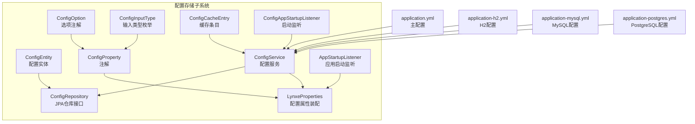
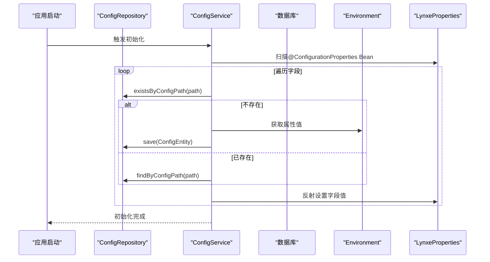
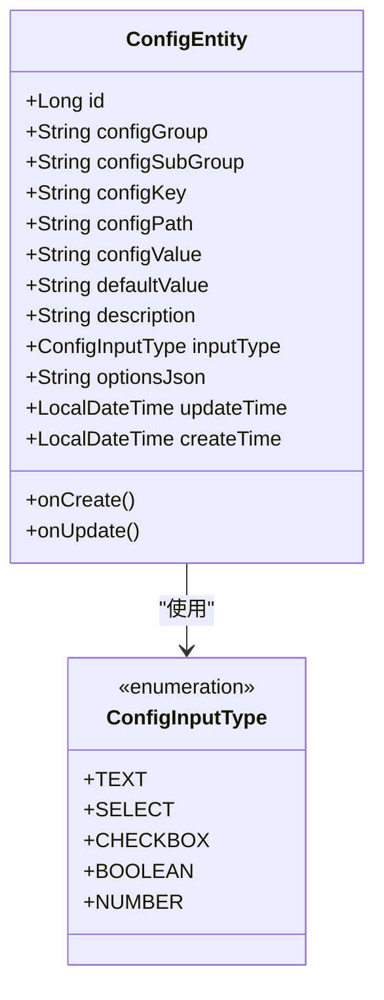
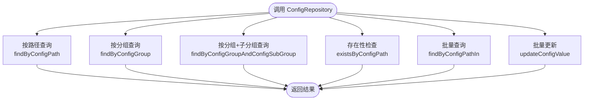
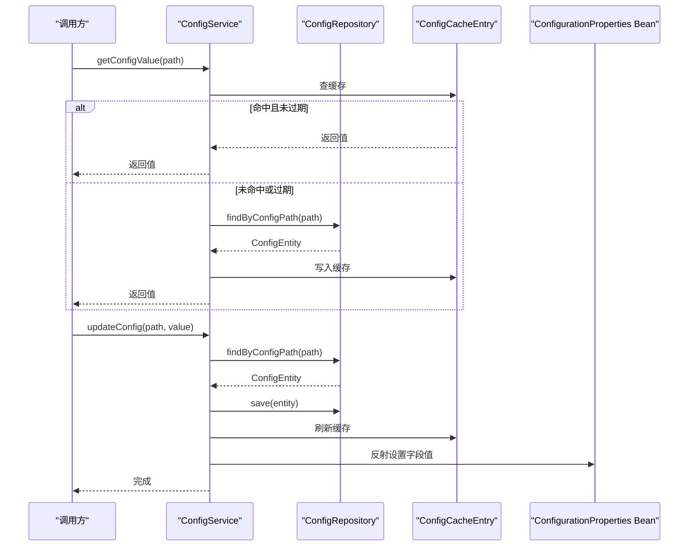
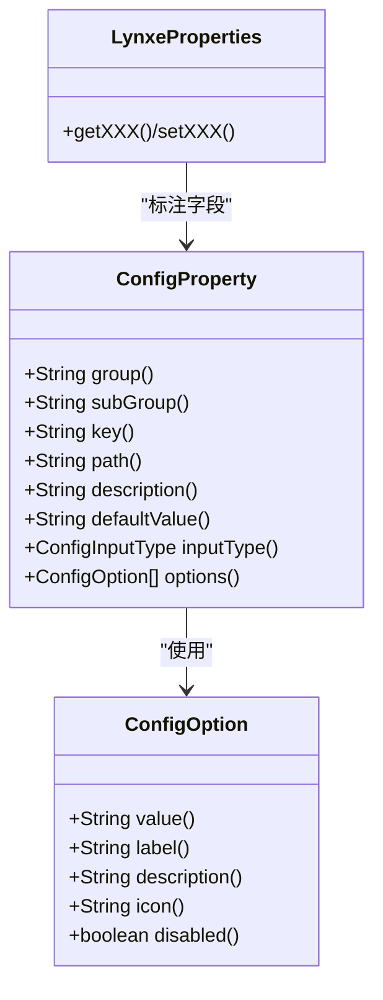
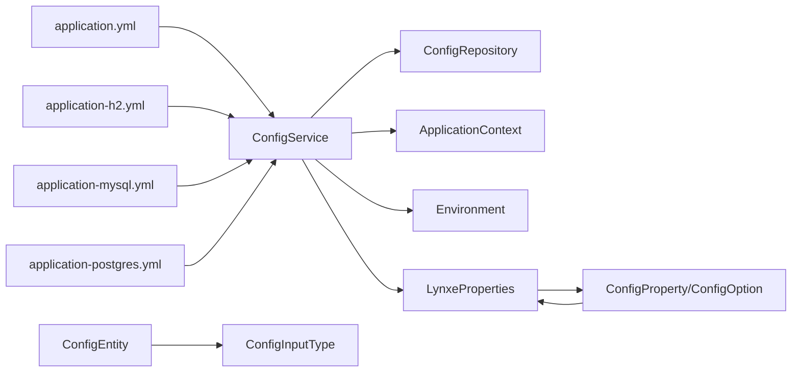

# 配置存储管理

<cite>
**本文引用的文件**
- [ConfigEntity.java](file://src/main/java/com/alibaba/cloud/ai/lynxe/config/entity/ConfigEntity.java)
- [ConfigRepository.java](file://src/main/java/com/alibaba/cloud/ai/lynxe/config/repository/ConfigRepository.java)
- [IConfigService.java](file://src/main/java/com/alibaba/cloud/ai/lynxe/config/IConfigService.java)
- [ConfigService.java](file://src/main/java/com/alibaba/cloud/ai/lynxe/config/ConfigService.java)
- [ConfigInputType.java](file://src/main/java/com/alibaba/cloud/ai/lynxe/config/entity/ConfigInputType.java)
- [ConfigProperty.java](file://src/main/java/com/alibaba/cloud/ai/lynxe/config/ConfigProperty.java)
- [ConfigOption.java](file://src/main/java/com/alibaba/cloud/ai/lynxe/config/ConfigOption.java)
- [LynxeProperties.java](file://src/main/java/com/alibaba/cloud/ai/lynxe/config/LynxeProperties.java)
- [ConfigCacheEntry.java](file://src/main/java/com/alibaba/cloud/ai/lynxe/config/ConfigCacheEntry.java)
- [AppStartupListener.java](file://src/main/java/com/alibaba/cloud/ai/lynxe/config/startUp/AppStartupListener.java)
- [ConfigAppStartupListener.java](file://src/main/java/com/alibaba/cloud/ai/lynxe/config/startUp/ConfigAppStartupListener.java)
- [application.yml](file://src/main/resources/application.yml)
- [application-h2.yml](file://src/main/resources/application-h2.yml)
- [application-mysql.yml](file://src/main/resources/application-mysql.yml)
- [application-postgres.yml](file://src/main/resources/application-postgres.yml)
</cite>

## 目录
1. [简介](#简介)
2. [项目结构](#项目结构)
3. [核心组件](#核心组件)
4. [架构总览](#架构总览)
5. [详细组件分析](#详细组件分析)
6. [依赖分析](#依赖分析)
7. [性能考虑](#性能考虑)
8. [故障排查指南](#故障排查指南)
9. [结论](#结论)
10. [附录](#附录)

## 简介
本文件面向Lynxe配置存储管理系统，系统性阐述ConfigRepository数据访问层设计与配置数据持久化策略，详解ConfigEntity实体模型的字段定义、数据类型与约束，说明存储结构、索引设计与查询优化策略，并覆盖版本管理、审计日志与数据一致性保障机制。同时提供备份恢复、迁移升级与性能监控方案，给出扩展接口与自定义存储实现指南，以及配置存储与数据库的交互模式与ORM映射关系。

## 项目结构
配置存储子系统位于后端模块的config包下，采用分层架构：
- 实体层：ConfigEntity定义配置项的完整结构
- 数据访问层：ConfigRepository基于Spring Data JPA提供CRUD与查询方法
- 服务层：ConfigService实现配置初始化、缓存、批量更新与重置逻辑
- 注解与枚举：ConfigProperty、ConfigOption、ConfigInputType用于声明式配置与输入类型
- 启动监听：AppStartupListener与ConfigAppStartupListener负责应用启动阶段的浏览器打开与配置系统状态初始化
- 配置文件：application.yml及多环境配置文件（H2/MySQL/PostgreSQL）定义JPA/Hikari连接池与方言

**图表来源**
- [ConfigEntity.java:36-218](file://src/main/java/com/alibaba/cloud/ai/lynxe/config/entity/ConfigEntity.java#L36-L218)
- [ConfigRepository.java:31-101](file://src/main/java/com/alibaba/cloud/ai/lynxe/config/repository/ConfigRepository.java#L31-L101)
- [ConfigService.java:41-320](file://src/main/java/com/alibaba/cloud/ai/lynxe/config/ConfigService.java#L41-L320)
- [LynxeProperties.java:26-654](file://src/main/java/com/alibaba/cloud/ai/lynxe/config/LynxeProperties.java#L26-L654)
- [ConfigProperty.java:37-89](file://src/main/java/com/alibaba/cloud/ai/lynxe/config/ConfigProperty.java#L37-L89)
- [ConfigOption.java:27-64](file://src/main/java/com/alibaba/cloud/ai/lynxe/config/ConfigOption.java#L27-L64)
- [ConfigInputType.java:18-46](file://src/main/java/com/alibaba/cloud/ai/lynxe/config/entity/ConfigInputType.java#L18-L46)
- [ConfigCacheEntry.java:18-45](file://src/main/java/com/alibaba/cloud/ai/lynxe/config/ConfigCacheEntry.java#L18-L45)
- [ConfigAppStartupListener.java:33-84](file://src/main/java/com/alibaba/cloud/ai/lynxe/config/startUp/ConfigAppStartupListener.java#L33-L84)
- [AppStartupListener.java:32-112](file://src/main/java/com/alibaba/cloud/ai/lynxe/config/startUp/AppStartupListener.java#L32-L112)
- [application.yml:1-97](file://src/main/resources/application.yml#L1-L97)
- [application-h2.yml:1-23](file://src/main/resources/application-h2.yml#L1-L23)
- [application-mysql.yml:1-15](file://src/main/resources/application-mysql.yml#L1-L15)
- [application-postgres.yml:1-15](file://src/main/resources/application-postgres.yml#L1-L15)

**章节来源**
- [application.yml:1-97](file://src/main/resources/application.yml#L1-L97)
- [application-h2.yml:1-23](file://src/main/resources/application-h2.yml#L1-L23)
- [application-mysql.yml:1-15](file://src/main/resources/application-mysql.yml#L1-L15)
- [application-postgres.yml:1-15](file://src/main/resources/application-postgres.yml#L1-L15)

## 核心组件
- ConfigEntity：系统配置项的完整实体，包含分组、子分组、键、路径、值、默认值、描述、输入类型、选项JSON、创建/更新时间等字段，并通过JPA注解映射到表system_config。
- ConfigRepository：继承JpaRepository，提供按路径、分组、子分组查询，存在性检查、删除、去重查询、批量更新与批量查询等方法。
- ConfigService：实现IConfigService，负责配置初始化、缓存、单个/批量更新、重置、类型转换与对@ConfigurationProperties注解的Bean字段的反射赋值。
- ConfigProperty/ConfigOption/ConfigInputType：声明式配置注解与输入类型枚举，支持TEXT/SELECT/CHECKBOX/BOOLEAN/NUMBER五种输入类型与下拉选项。
- LynxeProperties：集中装配各配置项，通过ConfigService读取数据库值并回填到Bean字段，支持默认值与类型转换。
- ConfigCacheEntry：轻量级本地缓存，带过期时间，减少频繁数据库访问。
- 启动监听：在应用启动时执行浏览器自动打开与配置系统状态初始化。

**章节来源**
- [ConfigEntity.java:36-218](file://src/main/java/com/alibaba/cloud/ai/lynxe/config/entity/ConfigEntity.java#L36-L218)
- [ConfigRepository.java:31-101](file://src/main/java/com/alibaba/cloud/ai/lynxe/config/repository/ConfigRepository.java#L31-L101)
- [IConfigService.java:27-81](file://src/main/java/com/alibaba/cloud/ai/lynxe/config/IConfigService.java#L27-L81)
- [ConfigService.java:41-320](file://src/main/java/com/alibaba/cloud/ai/lynxe/config/ConfigService.java#L41-L320)
- [ConfigProperty.java:37-89](file://src/main/java/com/alibaba/cloud/ai/lynxe/config/ConfigProperty.java#L37-L89)
- [ConfigOption.java:27-64](file://src/main/java/com/alibaba/cloud/ai/lynxe/config/ConfigOption.java#L27-L64)
- [ConfigInputType.java:18-46](file://src/main/java/com/alibaba/cloud/ai/lynxe/config/entity/ConfigInputType.java#L18-L46)
- [LynxeProperties.java:26-654](file://src/main/java/com/alibaba/cloud/ai/lynxe/config/LynxeProperties.java#L26-L654)
- [ConfigCacheEntry.java:18-45](file://src/main/java/com/alibaba/cloud/ai/lynxe/config/ConfigCacheEntry.java#L18-L45)
- [ConfigAppStartupListener.java:33-84](file://src/main/java/com/alibaba/cloud/ai/lynxe/config/startUp/ConfigAppStartupListener.java#L33-L84)
- [AppStartupListener.java:32-112](file://src/main/java/com/alibaba/cloud/ai/lynxe/config/startUp/AppStartupListener.java#L32-L112)

## 架构总览
配置存储系统采用“注解声明 + ORM持久化 + 缓存 + 反射回填”的架构模式：
- 声明式配置：通过ConfigProperty与ConfigOption标注Bean字段，定义配置的分组、键、默认值、输入类型与选项。
- ORM映射：ConfigEntity映射到system_config表，使用JPA/Hibernate进行持久化。
- 缓存策略：ConfigService维护ConcurrentHashMap缓存，ConfigCacheEntry带30秒过期。
- 初始化流程：应用启动时扫描@ConfigurationProperties Bean，若数据库中不存在对应配置则创建并写入默认值或环境变量值；随后对Bean进行反射赋值。
- 查询与更新：ConfigRepository提供多种查询与批量操作，ConfigService封装事务与缓存更新。

**图表来源**
- [ConfigService.java:67-163](file://src/main/java/com/alibaba/cloud/ai/lynxe/config/ConfigService.java#L67-L163)
- [ConfigRepository.java:39-67](file://src/main/java/com/alibaba/cloud/ai/lynxe/config/repository/ConfigRepository.java#L39-L67)
- [LynxeProperties.java:26-654](file://src/main/java/com/alibaba/cloud/ai/lynxe/config/LynxeProperties.java#L26-L654)

## 详细组件分析

### 实体模型：ConfigEntity
- 表映射：@Entity + @Table(name="system_config")
- 主键：@Id + @GeneratedValue(strategy=GenerationType.IDENTITY)
- 字段与约束：
  - configGroup：非空，字符串，用于一级分组
  - configSubGroup：非空，字符串，用于二级分组
  - configKey：非空，字符串，配置键
  - configPath：非空且唯一，字符串，全路径标识
  - configValue/defaultValue/description：TEXT类型，字符串
  - inputType：非空，枚举，ConfigInputType
  - optionsJson：TEXT类型，字符串，存储SELECT类型选项
  - updateTime/createTime：非空，LocalDateTime，自动维护
- 生命周期回调：@PrePersist/@PreUpdate自动填充创建与更新时间

**图表来源**
- [ConfigEntity.java:36-218](file://src/main/java/com/alibaba/cloud/ai/lynxe/config/entity/ConfigEntity.java#L36-L218)
- [ConfigInputType.java:18-46](file://src/main/java/com/alibaba/cloud/ai/lynxe/config/entity/ConfigInputType.java#L18-L46)

**章节来源**
- [ConfigEntity.java:36-218](file://src/main/java/com/alibaba/cloud/ai/lynxe/config/entity/ConfigEntity.java#L36-L218)

### 数据访问层：ConfigRepository
- 继承JpaRepository<ConfigEntity, Long>，天然具备基本CRUD能力
- 自定义查询：
  - 按路径查询与存在性检查：findByConfigPath、existsByConfigPath
  - 按分组/子分组查询：findByConfigGroupAndConfigSubGroup、findByConfigGroup
  - 去重查询：findAllGroups、findSubGroupsByGroup
  - 批量更新与批量查询：updateConfigValue、findByConfigPathIn
- 查询优化建议：
  - 在configPath上建立唯一索引（实体已定义唯一约束）
  - 在configGroup/configSubGroup上建立复合索引以优化分组查询
  - 对高频查询字段增加索引，如configKey

**图表来源**
- [ConfigRepository.java:31-101](file://src/main/java/com/alibaba/cloud/ai/lynxe/config/repository/ConfigRepository.java#L31-L101)

**章节来源**
- [ConfigRepository.java:31-101](file://src/main/java/com/alibaba/cloud/ai/lynxe/config/repository/ConfigRepository.java#L31-L101)

### 服务层：ConfigService
- 初始化：扫描@ConfigurationProperties Bean，若数据库不存在则创建配置项，优先从Environment读取值，否则使用注解默认值；SELECT类型将options数组序列化为JSON写入optionsJson。
- 读取：先查缓存（ConfigCacheEntry），未命中则查库并写入缓存。
- 更新：@Transactional包裹，更新值后刷新缓存并对所有使用该配置的Bean进行反射赋值。
- 批量更新与重置：遍历列表更新值并同步Bean；重置全部配置到默认值。
- 类型转换：根据目标字段类型将字符串值转换为对应类型（String/Boolean/Integer/Long/Double/Float）。

**图表来源**
- [ConfigService.java:165-196](file://src/main/java/com/alibaba/cloud/ai/lynxe/config/ConfigService.java#L165-L196)
- [ConfigService.java:182-196](file://src/main/java/com/alibaba/cloud/ai/lynxe/config/ConfigService.java#L182-L196)
- [ConfigRepository.java:39-67](file://src/main/java/com/alibaba/cloud/ai/lynxe/config/repository/ConfigRepository.java#L39-L67)
- [ConfigCacheEntry.java:18-45](file://src/main/java/com/alibaba/cloud/ai/lynxe/config/ConfigCacheEntry.java#L18-L45)

**章节来源**
- [ConfigService.java:41-320](file://src/main/java/com/alibaba/cloud/ai/lynxe/config/ConfigService.java#L41-L320)

### 配置声明与输入类型
- ConfigProperty：定义group/subGroup/key/path/description/defaultValue/inputType/options等元信息
- ConfigOption：定义选项value/label/description/icon/disabled
- ConfigInputType：定义TEXT/SELECT/CHECKBOX/BOOLEAN/NUMBER五种输入类型

**图表来源**
- [ConfigProperty.java:37-89](file://src/main/java/com/alibaba/cloud/ai/lynxe/config/ConfigProperty.java#L37-L89)
- [ConfigOption.java:27-64](file://src/main/java/com/alibaba/cloud/ai/lynxe/config/ConfigOption.java#L27-L64)
- [LynxeProperties.java:26-654](file://src/main/java/com/alibaba/cloud/ai/lynxe/config/LynxeProperties.java#L26-L654)

**章节来源**
- [ConfigProperty.java:37-89](file://src/main/java/com/alibaba/cloud/ai/lynxe/config/ConfigProperty.java#L37-L89)
- [ConfigOption.java:27-64](file://src/main/java/com/alibaba/cloud/ai/lynxe/config/ConfigOption.java#L27-L64)
- [LynxeProperties.java:26-654](file://src/main/java/com/alibaba/cloud/ai/lynxe/config/LynxeProperties.java#L26-L654)

### 启动与初始化监听
- ConfigAppStartupListener：应用启动后统计配置总数、分组数量与自定义值数量，便于运行态监控
- AppStartupListener：根据配置决定是否自动打开浏览器访问UI

**章节来源**
- [ConfigAppStartupListener.java:33-84](file://src/main/java/com/alibaba/cloud/ai/lynxe/config/startUp/ConfigAppStartupListener.java#L33-L84)
- [AppStartupListener.java:32-112](file://src/main/java/com/alibaba/cloud/ai/lynxe/config/startUp/AppStartupListener.java#L32-L112)

## 依赖分析
- ConfigService依赖ConfigRepository、ApplicationContext、Environment与LynxeProperties
- ConfigEntity依赖ConfigInputType枚举
- ConfigProperty/ConfigOption/ConfigInputType共同驱动LynxeProperties的装配
- 多环境配置文件通过spring.profiles.active切换数据库与JPA方言

**图表来源**
- [ConfigService.java:41-320](file://src/main/java/com/alibaba/cloud/ai/lynxe/config/ConfigService.java#L41-L320)
- [ConfigEntity.java:36-218](file://src/main/java/com/alibaba/cloud/ai/lynxe/config/entity/ConfigEntity.java#L36-L218)
- [ConfigProperty.java:37-89](file://src/main/java/com/alibaba/cloud/ai/lynxe/config/ConfigProperty.java#L37-L89)
- [ConfigOption.java:27-64](file://src/main/java/com/alibaba/cloud/ai/lynxe/config/ConfigOption.java#L27-L64)
- [application.yml:1-97](file://src/main/resources/application.yml#L1-L97)
- [application-h2.yml:1-23](file://src/main/resources/application-h2.yml#L1-L23)
- [application-mysql.yml:1-15](file://src/main/resources/application-mysql.yml#L1-L15)
- [application-postgres.yml:1-15](file://src/main/resources/application-postgres.yml#L1-L15)

**章节来源**
- [ConfigService.java:41-320](file://src/main/java/com/alibaba/cloud/ai/lynxe/config/ConfigService.java#L41-L320)
- [application.yml:1-97](file://src/main/resources/application.yml#L1-L97)

## 性能考虑
- 缓存策略：ConfigCacheEntry提供30秒过期，显著降低高频读取的数据库压力
- 查询优化：建议在configPath（唯一）、configGroup、configSubGroup、configKey上建立索引
- 批量操作：使用ConfigRepository提供的批量查询与批量更新方法，减少往返次数
- 连接池：application.yml中配置了Hikari连接池参数，确保高并发下的稳定性
- 事务边界：更新与批量更新均在事务内执行，保证一致性

**章节来源**
- [ConfigCacheEntry.java:18-45](file://src/main/java/com/alibaba/cloud/ai/lynxe/config/ConfigCacheEntry.java#L18-L45)
- [ConfigRepository.java:73-98](file://src/main/java/com/alibaba/cloud/ai/lynxe/config/repository/ConfigRepository.java#L73-L98)
- [application.yml:20-30](file://src/main/resources/application.yml#L20-L30)

## 故障排查指南
- 配置未生效：检查ConfigService初始化流程，确认ConfigProperty.path与数据库configPath一致，确认Environment中是否存在同名属性
- 类型转换异常：检查ConfigService.convertValue逻辑与目标字段类型是否匹配
- 缓存不一致：观察ConfigCacheEntry过期时间，必要时缩短或禁用缓存以定位问题
- 启动失败：查看ConfigAppStartupListener日志输出，确认配置总数与分组分布是否符合预期
- 数据库连接问题：核对application-h2.yml、application-mysql.yml、application-postgres.yml中的连接参数与驱动类名

**章节来源**
- [ConfigService.java:219-245](file://src/main/java/com/alibaba/cloud/ai/lynxe/config/ConfigService.java#L219-L245)
- [ConfigAppStartupListener.java:47-70](file://src/main/java/com/alibaba/cloud/ai/lynxe/config/startUp/ConfigAppStartupListener.java#L47-L70)
- [application-h2.yml:1-23](file://src/main/resources/application-h2.yml#L1-L23)
- [application-mysql.yml:1-15](file://src/main/resources/application-mysql.yml#L1-L15)
- [application-postgres.yml:1-15](file://src/main/resources/application-postgres.yml#L1-L15)

## 结论
Lynxe配置存储系统通过声明式注解、ORM映射与本地缓存实现了高效、可维护的配置管理。ConfigRepository提供了完善的查询与批量操作能力，ConfigService承担初始化、缓存与反射回填职责，配合启动监听实现自动化与可观测性。建议在生产环境中完善索引、监控与备份策略，确保配置系统的高可用与可演进性。

## 附录

### 存储结构与索引设计
- 表名：system_config
- 唯一索引：configPath（实体已定义唯一约束）
- 建议复合索引：(configGroup, configSubGroup)、(configGroup, configKey)、(configSubGroup, configKey)

**章节来源**
- [ConfigEntity.java:63](file://src/main/java/com/alibaba/cloud/ai/lynxe/config/entity/ConfigEntity.java#L63)
- [ConfigRepository.java:47-54](file://src/main/java/com/alibaba/cloud/ai/lynxe/config/repository/ConfigRepository.java#L47-L54)

### 查询优化策略
- 使用existsByConfigPath进行存在性检查，避免不必要的加载
- 使用findByConfigGroupAndConfigSubGroup与findByConfigGroup进行分组查询
- 使用findByConfigPathIn进行批量查询，减少多次往返
- 使用updateConfigValue进行批量更新，避免逐条更新

**章节来源**
- [ConfigRepository.java:61-98](file://src/main/java/com/alibaba/cloud/ai/lynxe/config/repository/ConfigRepository.java#L61-L98)

### 版本管理、审计日志与一致性
- 版本管理：当前实现未内置版本号字段，可在ConfigEntity新增version字段并配合乐观锁注解
- 审计日志：当前实现未内置审计字段，可在ConfigEntity新增createdBy/updatedBy/createdAt/updatedAt等字段
- 一致性：通过@Transactional保证更新与反射回填的一致性；缓存过期时间控制最终一致性

**章节来源**
- [ConfigEntity.java:109-118](file://src/main/java/com/alibaba/cloud/ai/lynxe/config/entity/ConfigEntity.java#L109-L118)
- [ConfigService.java:182-196](file://src/main/java/com/alibaba/cloud/ai/lynxe/config/ConfigService.java#L182-L196)

### 备份恢复、迁移升级与性能监控
- 备份恢复：建议定期导出system_config表；不同数据库使用各自工具（H2 Console、mysqldump、pg_dump）
- 迁移升级：通过DDL变更添加新列或索引；使用Flyway/Liquibase管理迁移脚本
- 性能监控：结合ConfigAppStartupListener的日志统计，关注configGroup分布与自定义值比例；使用数据库慢查询日志与连接池指标

**章节来源**
- [application-h2.yml:8-12](file://src/main/resources/application-h2.yml#L8-L12)
- [application.yml:20-30](file://src/main/resources/application.yml#L20-L30)
- [ConfigAppStartupListener.java:47-70](file://src/main/java/com/alibaba/cloud/ai/lynxe/config/startUp/ConfigAppStartupListener.java#L47-L70)

### 扩展接口与自定义存储实现指南
- 扩展接口：可定义新的Repository接口，继承QueryByExampleExecutor或自定义@Query方法
- 自定义存储：实现自定义存储（如Redis/ETCD）时，保持IConfigService接口不变，替换ConfigRepository实现即可
- ORM映射：遵循JPA规范，使用@Entity/@Table/@Column/@Enumerated等注解映射字段与类型

**章节来源**
- [IConfigService.java:27-81](file://src/main/java/com/alibaba/cloud/ai/lynxe/config/IConfigService.java#L27-L81)
- [ConfigRepository.java:31-101](file://src/main/java/com/alibaba/cloud/ai/lynxe/config/repository/ConfigRepository.java#L31-L101)

### 配置存储与数据库交互模式
- 交互模式：ConfigService通过ConfigRepository与数据库交互；Repository基于JPA/Hibernate；application.yml与多环境配置文件定义数据源与JPA方言
- ORM映射关系：ConfigEntity映射到system_config表，字段与列一一对应；枚举inputType映射为字符串

**章节来源**
- [ConfigService.java:41-320](file://src/main/java/com/alibaba/cloud/ai/lynxe/config/ConfigService.java#L41-L320)
- [application.yml:1-97](file://src/main/resources/application.yml#L1-L97)
- [application-h2.yml:1-23](file://src/main/resources/application-h2.yml#L1-L23)
- [application-mysql.yml:1-15](file://src/main/resources/application-mysql.yml#L1-L15)
- [application-postgres.yml:1-15](file://src/main/resources/application-postgres.yml#L1-L15)