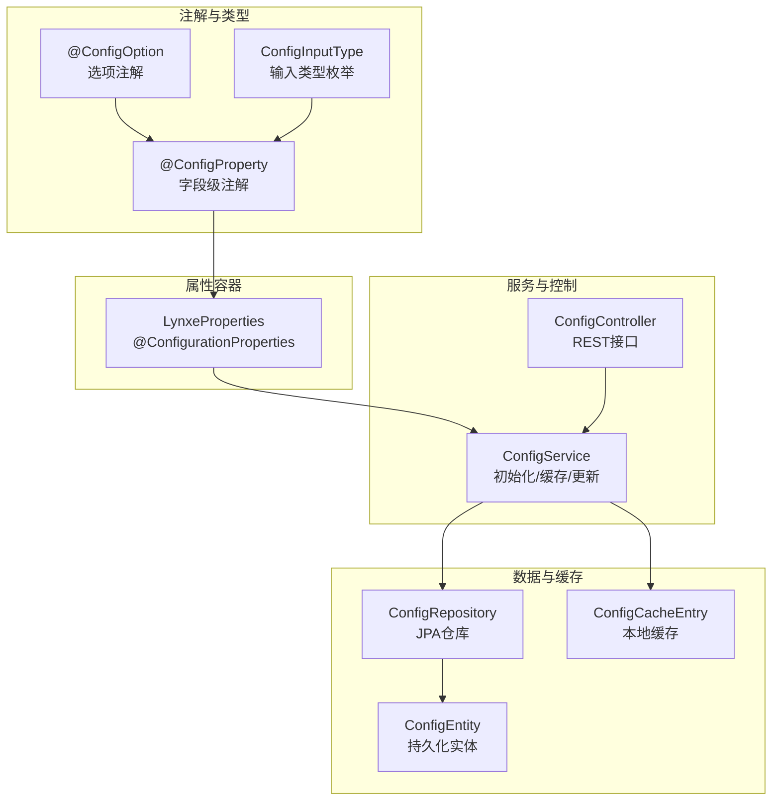
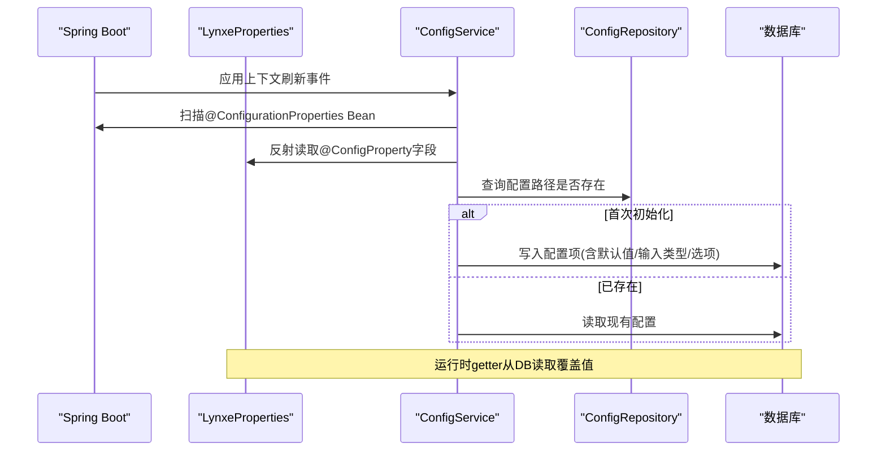
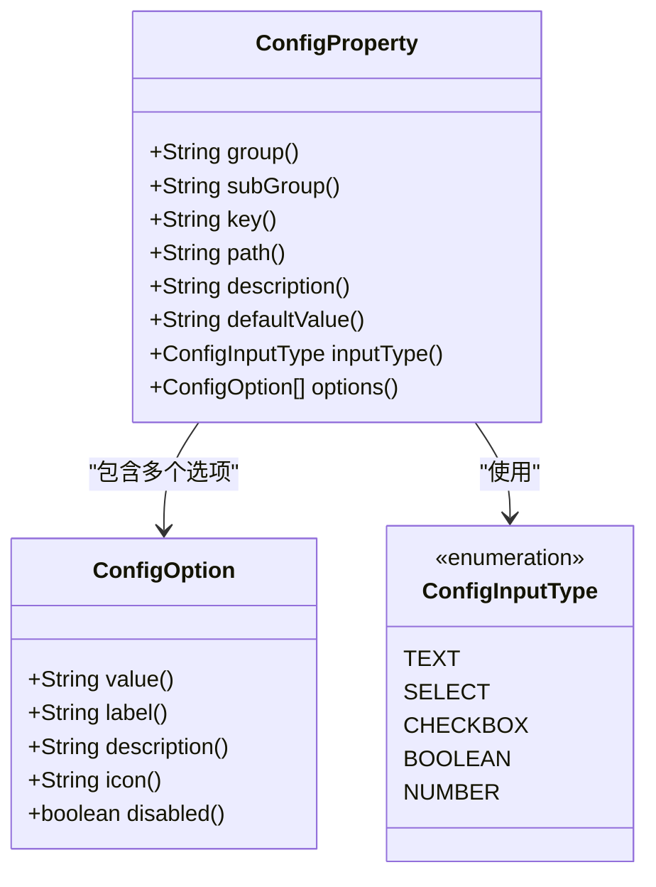
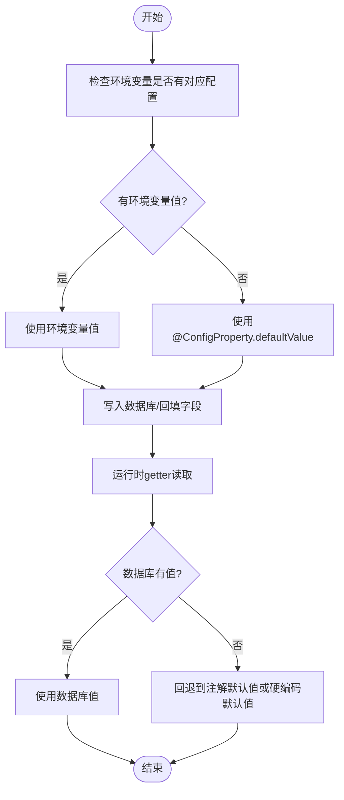
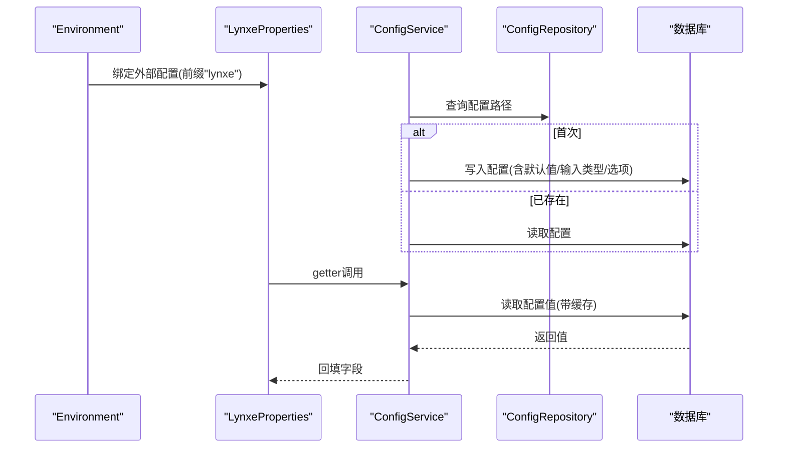
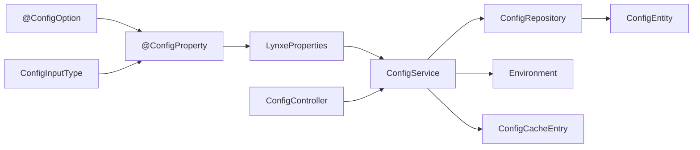

# 配置属性定义

<cite>
**本文引用的文件**
- [ConfigProperty.java](file://src/main/java/com/alibaba/cloud/ai/lynxe/config/ConfigProperty.java)
- [ConfigOption.java](file://src/main/java/com/alibaba/cloud/ai/lynxe/config/ConfigOption.java)
- [ConfigInputType.java](file://src/main/java/com/alibaba/cloud/ai/lynxe/config/entity/ConfigInputType.java)
- [LynxeProperties.java](file://src/main/java/com/alibaba/cloud/ai/lynxe/config/LynxeProperties.java)
- [ConfigService.java](file://src/main/java/com/alibaba/cloud/ai/lynxe/config/ConfigService.java)
- [IConfigService.java](file://src/main/java/com/alibaba/cloud/ai/lynxe/config/IConfigService.java)
- [ConfigController.java](file://src/main/java/com/alibaba/cloud/ai/lynxe/config/ConfigController.java)
- [ConfigEntity.java](file://src/main/java/com/alibaba/cloud/ai/lynxe/config/entity/ConfigEntity.java)
- [ConfigRepository.java](file://src/main/java/com/alibaba/cloud/ai/lynxe/config/repository/ConfigRepository.java)
- [ConfigCacheEntry.java](file://src/main/java/com/alibaba/cloud/ai/lynxe/config/ConfigCacheEntry.java)
- [application.yml](file://src/main/resources/application.yml)
</cite>

## 目录
1. [简介](#简介)
2. [项目结构](#项目结构)
3. [核心组件](#核心组件)
4. [架构总览](#架构总览)
5. [详细组件分析](#详细组件分析)
6. [依赖关系分析](#依赖关系分析)
7. [性能考虑](#性能考虑)
8. [故障排查指南](#故障排查指南)
9. [结论](#结论)
10. [附录](#附录)

## 简介
本文件系统性阐述Lynxe的“配置属性定义系统”，围绕以下目标展开：
- 解释@ConfigurationProperties注解在Lynxe中的使用方式与配置属性声明语法
- 详解自定义注解@ConfigProperty的字段语义与配置方法：group、subGroup、key、path、description、defaultValue、inputType与options
- 阐述配置属性的类型系统：基本类型、复合类型与枚举类型的定义方式
- 解释默认值处理机制与空值处理策略
- 提供配置属性的最佳实践与命名约定
- 描述配置属性与Spring Boot配置绑定的工作原理与实现细节

## 项目结构
Lynxe的配置属性定义系统主要由以下模块构成：
- 注解层：@ConfigProperty与@ConfigOption，用于在字段上声明配置元数据
- 类型层：ConfigInputType，定义输入类型枚举
- 属性容器：LynxeProperties，承载具体配置项并实现运行时读取逻辑
- 服务层：ConfigService，负责初始化、缓存、更新与回填配置
- 控制器层：ConfigController，提供REST接口管理配置
- 数据模型：ConfigEntity与ConfigRepository，持久化配置项
- 缓存：ConfigCacheEntry，轻量级本地缓存

图表来源
- [ConfigProperty.java:1-89](file://src/main/java/com/alibaba/cloud/ai/lynxe/config/ConfigProperty.java#L1-L89)
- [ConfigOption.java:1-64](file://src/main/java/com/alibaba/cloud/ai/lynxe/config/ConfigOption.java#L1-L64)
- [ConfigInputType.java:1-46](file://src/main/java/com/alibaba/cloud/ai/lynxe/config/entity/ConfigInputType.java#L1-L46)
- [LynxeProperties.java:1-654](file://src/main/java/com/alibaba/cloud/ai/lynxe/config/LynxeProperties.java#L1-L654)
- [ConfigService.java:1-320](file://src/main/java/com/alibaba/cloud/ai/lynxe/config/ConfigService.java#L1-L320)
- [ConfigController.java:1-82](file://src/main/java/com/alibaba/cloud/ai/lynxe/config/ConfigController.java#L1-L82)
- [ConfigEntity.java:1-218](file://src/main/java/com/alibaba/cloud/ai/lynxe/config/entity/ConfigEntity.java#L1-L218)
- [ConfigRepository.java:1-101](file://src/main/java/com/alibaba/cloud/ai/lynxe/config/repository/ConfigRepository.java#L1-L101)
- [ConfigCacheEntry.java:1-45](file://src/main/java/com/alibaba/cloud/ai/lynxe/config/ConfigCacheEntry.java#L1-L45)

章节来源
- [ConfigProperty.java:1-89](file://src/main/java/com/alibaba/cloud/ai/lynxe/config/ConfigProperty.java#L1-L89)
- [ConfigOption.java:1-64](file://src/main/java/com/alibaba/cloud/ai/lynxe/config/ConfigOption.java#L1-L64)
- [ConfigInputType.java:1-46](file://src/main/java/com/alibaba/cloud/ai/lynxe/config/entity/ConfigInputType.java#L1-L46)
- [LynxeProperties.java:1-654](file://src/main/java/com/alibaba/cloud/ai/lynxe/config/LynxeProperties.java#L1-L654)
- [ConfigService.java:1-320](file://src/main/java/com/alibaba/cloud/ai/lynxe/config/ConfigService.java#L1-L320)
- [ConfigController.java:1-82](file://src/main/java/com/alibaba/cloud/ai/lynxe/config/ConfigController.java#L1-L82)
- [ConfigEntity.java:1-218](file://src/main/java/com/alibaba/cloud/ai/lynxe/config/entity/ConfigEntity.java#L1-L218)
- [ConfigRepository.java:1-101](file://src/main/java/com/alibaba/cloud/ai/lynxe/config/repository/ConfigRepository.java#L1-L101)
- [ConfigCacheEntry.java:1-45](file://src/main/java/com/alibaba/cloud/ai/lynxe/config/ConfigCacheEntry.java#L1-L45)

## 核心组件
- @ConfigProperty：在字段上声明配置项的分组、键、路径、描述、默认值、输入类型与下拉选项等元信息
- @ConfigOption：为SELECT等输入类型提供选项集合
- ConfigInputType：定义输入类型枚举（TEXT、SELECT、CHECKBOX、BOOLEAN、NUMBER）
- LynxeProperties：通过@ConfigurationProperties加载前缀为“lynxe”的外部配置，并在运行时从数据库读取覆盖值
- ConfigService：扫描带@ConfigurationProperties的Bean，基于@ConfigProperty初始化数据库配置项，提供缓存、更新与批量重置能力
- ConfigController：提供按组查询、批量更新、全部重置等REST接口
- ConfigEntity/ConfigRepository：持久化配置项，支持按组/子组查询与唯一路径约束
- ConfigCacheEntry：轻量级本地缓存，减少数据库访问

章节来源
- [ConfigProperty.java:26-88](file://src/main/java/com/alibaba/cloud/ai/lynxe/config/ConfigProperty.java#L26-L88)
- [ConfigOption.java:22-63](file://src/main/java/com/alibaba/cloud/ai/lynxe/config/ConfigOption.java#L22-L63)
- [ConfigInputType.java:18-44](file://src/main/java/com/alibaba/cloud/ai/lynxe/config/entity/ConfigInputType.java#L18-L44)
- [LynxeProperties.java:26-28](file://src/main/java/com/alibaba/cloud/ai/lynxe/config/LynxeProperties.java#L26-L28)
- [ConfigService.java:41-319](file://src/main/java/com/alibaba/cloud/ai/lynxe/config/ConfigService.java#L41-L319)
- [ConfigController.java:36-81](file://src/main/java/com/alibaba/cloud/ai/lynxe/config/ConfigController.java#L36-L81)
- [ConfigEntity.java:33-217](file://src/main/java/com/alibaba/cloud/ai/lynxe/config/entity/ConfigEntity.java#L33-L217)
- [ConfigRepository.java:28-100](file://src/main/java/com/alibaba/cloud/ai/lynxe/config/repository/ConfigRepository.java#L28-L100)
- [ConfigCacheEntry.java:18-44](file://src/main/java/com/alibaba/cloud/ai/lynxe/config/ConfigCacheEntry.java#L18-L44)

## 架构总览
Lynxe将Spring Boot的@ConfigurationProperties与自研的配置属性定义系统结合：
- 外部配置（如application.yml）通过@ConfigurationProperties前缀“lynxe”注入到LynxeProperties
- 启动阶段，ConfigService扫描所有@ConfigurationProperties Bean，提取@ConfigProperty元信息，初始化数据库配置项
- 运行时，LynxeProperties的getter优先从数据库读取值，若无则回退到默认值或外部配置
- ConfigController提供管理接口；ConfigService维护缓存与批量更新

图表来源
- [LynxeProperties.java:26-28](file://src/main/java/com/alibaba/cloud/ai/lynxe/config/LynxeProperties.java#L26-L28)
- [ConfigService.java:60-163](file://src/main/java/com/alibaba/cloud/ai/lynxe/config/ConfigService.java#L60-L163)
- [ConfigRepository.java:39-67](file://src/main/java/com/alibaba/cloud/ai/lynxe/config/repository/ConfigRepository.java#L39-L67)

## 详细组件分析

### @ConfigProperty 注解详解
- 作用域：字段级注解，用于声明配置项的三段式分组与键
- 字段说明
  - group：顶级分组（如browser、general、agent等）
  - subGroup：二级分组（如browser.settings、browser.proxy等）
  - key：配置项键名
  - path：YAML全路径，用于在数据库中定位该配置项
  - description：配置项描述，支持国际化键格式
  - defaultValue：默认值字符串
  - inputType：输入类型，默认文本框
  - options：下拉框等输入类型的选项数组（仅当inputType=SELECT时生效）

图表来源
- [ConfigProperty.java:39-86](file://src/main/java/com/alibaba/cloud/ai/lynxe/config/ConfigProperty.java#L39-L86)
- [ConfigOption.java:30-61](file://src/main/java/com/alibaba/cloud/ai/lynxe/config/ConfigOption.java#L30-L61)
- [ConfigInputType.java:18-44](file://src/main/java/com/alibaba/cloud/ai/lynxe/config/entity/ConfigInputType.java#L18-L44)

章节来源
- [ConfigProperty.java:26-88](file://src/main/java/com/alibaba/cloud/ai/lynxe/config/ConfigProperty.java#L26-L88)
- [ConfigOption.java:22-63](file://src/main/java/com/alibaba/cloud/ai/lynxe/config/ConfigOption.java#L22-L63)
- [ConfigInputType.java:18-44](file://src/main/java/com/alibaba/cloud/ai/lynxe/config/entity/ConfigInputType.java#L18-L44)

### @ConfigurationProperties 使用方式与声明语法
- 在容器类上使用@Component与@ConfigurationProperties(prefix="lynxe")，将外部配置映射到类字段
- 与@ConfigProperty配合：前者负责外部配置绑定，后者负责UI/管理端元数据与持久化
- 示例：LynxeProperties通过@ConfigurationProperties(prefix="lynxe")绑定application.yml中的lynxe.*配置

章节来源
- [LynxeProperties.java:26-28](file://src/main/java/com/alibaba/cloud/ai/lynxe/config/LynxeProperties.java#L26-L28)
- [application.yml:60-97](file://src/main/resources/application.yml#L60-L97)

### 类型系统与默认值处理
- 基本类型：String、Boolean/boolean、Integer/int、Long/long、Double/double、Float/float
- 复合类型：通过@ConfigProperty的options定义SELECT类型选项集合
- 枚举类型：ConfigInputType定义输入类型枚举
- 默认值处理机制
  - 初始化阶段：若环境变量存在，则使用环境值；否则使用注解的defaultValue
  - 运行时：LynxeProperties的getter优先从数据库读取覆盖值；若无则回退到注解默认值或硬编码默认值
  - 空值处理策略：对数值/布尔等基本类型，若数据库值为空或解析失败，回退到注解默认值或硬编码默认值

图表来源
- [ConfigService.java:114-132](file://src/main/java/com/alibaba/cloud/ai/lynxe/config/ConfigService.java#L114-L132)
- [LynxeProperties.java:44-51](file://src/main/java/com/alibaba/cloud/ai/lynxe/config/LynxeProperties.java#L44-L51)

章节来源
- [ConfigService.java:219-245](file://src/main/java/com/alibaba/cloud/ai/lynxe/config/ConfigService.java#L219-L245)
- [LynxeProperties.java:44-51](file://src/main/java/com/alibaba/cloud/ai/lynxe/config/LynxeProperties.java#L44-L51)

### 空值与异常处理策略
- 环境变量缺失：使用注解默认值
- 数据库值为空：回退到注解默认值或硬编码默认值
- 类型转换失败：抛出不支持类型异常（Unsupported type），需确保注解与字段类型一致
- 缓存过期：ConfigCacheEntry默认30秒过期，避免脏读

章节来源
- [ConfigService.java:219-245](file://src/main/java/com/alibaba/cloud/ai/lynxe/config/ConfigService.java#L219-L245)
- [ConfigCacheEntry.java:24-42](file://src/main/java/com/alibaba/cloud/ai/lynxe/config/ConfigCacheEntry.java#L24-L42)

### 配置属性与Spring Boot绑定的工作原理
- 外部配置加载：application.yml中lynxe.*键值被@ConfigurationProperties绑定到LynxeProperties
- 启动初始化：ConfigService监听ContextRefreshedEvent，扫描@ConfigurationProperties Bean，提取@ConfigProperty元信息，初始化数据库配置项
- 运行时读取：LynxeProperties的getter优先从数据库读取，再回退到外部配置或注解默认值
- 更新与回填：ConfigService.updateConfig更新数据库后，同步回填到所有持有该配置的Bean字段

图表来源
- [LynxeProperties.java:26-28](file://src/main/java/com/alibaba/cloud/ai/lynxe/config/LynxeProperties.java#L26-L28)
- [ConfigService.java:60-163](file://src/main/java/com/alibaba/cloud/ai/lynxe/config/ConfigService.java#L60-L163)
- [ConfigRepository.java:39-67](file://src/main/java/com/alibaba/cloud/ai/lynxe/config/repository/ConfigRepository.java#L39-L67)

### 最佳实践与命名约定
- 分组与键命名
  - group/subGroup/key采用层级清晰的小写短横线风格，如"browser"、"browser.proxy"
  - path遵循YAML全路径规范，如"lynxe.browser.headless"
- 默认值与输入类型
  - 为每个配置项提供合理defaultValue
  - 对可选值明确的配置使用SELECT并提供options
- 类型一致性
  - 字段类型与期望值严格匹配，避免运行时转换异常
- 国际化
  - description与option.label支持国际化键格式，便于多语言界面展示
- 安全与合规
  - 对敏感配置（如密钥）建议通过环境变量注入，避免硬编码
- 可维护性
  - 将相关配置按功能分组，保持path与group/subGroup/key的一致性
  - 新增配置时，同时完善数据库初始化与运行时回填逻辑

章节来源
- [ConfigProperty.java:62-86](file://src/main/java/com/alibaba/cloud/ai/lynxe/config/ConfigProperty.java#L62-L86)
- [ConfigOption.java:38-51](file://src/main/java/com/alibaba/cloud/ai/lynxe/config/ConfigOption.java#L38-L51)
- [ConfigInputType.java:18-44](file://src/main/java/com/alibaba/cloud/ai/lynxe/config/entity/ConfigInputType.java#L18-L44)

## 依赖关系分析
- 注解与类型：@ConfigProperty依赖ConfigInputType与@ConfigOption
- 属性容器：LynxeProperties依赖IConfigService进行运行时读取
- 服务层：ConfigService依赖ConfigRepository与Environment，负责初始化、缓存与更新
- 控制器：ConfigController依赖IConfigService提供REST接口
- 数据层：ConfigEntity与ConfigRepository提供持久化能力

图表来源
- [ConfigProperty.java:39-86](file://src/main/java/com/alibaba/cloud/ai/lynxe/config/ConfigProperty.java#L39-L86)
- [ConfigOption.java:30-61](file://src/main/java/com/alibaba/cloud/ai/lynxe/config/ConfigOption.java#L30-L61)
- [ConfigInputType.java:18-44](file://src/main/java/com/alibaba/cloud/ai/lynxe/config/entity/ConfigInputType.java#L18-L44)
- [LynxeProperties.java:30-32](file://src/main/java/com/alibaba/cloud/ai/lynxe/config/LynxeProperties.java#L30-L32)
- [ConfigService.java:46-53](file://src/main/java/com/alibaba/cloud/ai/lynxe/config/ConfigService.java#L46-L53)
- [ConfigController.java:40-44](file://src/main/java/com/alibaba/cloud/ai/lynxe/config/ConfigController.java#L40-L44)
- [ConfigEntity.java:36-217](file://src/main/java/com/alibaba/cloud/ai/lynxe/config/entity/ConfigEntity.java#L36-L217)
- [ConfigRepository.java:32-100](file://src/main/java/com/alibaba/cloud/ai/lynxe/config/repository/ConfigRepository.java#L32-L100)
- [ConfigCacheEntry.java:18-44](file://src/main/java/com/alibaba/cloud/ai/lynxe/config/ConfigCacheEntry.java#L18-L44)

章节来源
- [IConfigService.java:23-80](file://src/main/java/com/alibaba/cloud/ai/lynxe/config/IConfigService.java#L23-L80)
- [ConfigService.java:67-163](file://src/main/java/com/alibaba/cloud/ai/lynxe/config/ConfigService.java#L67-L163)

## 性能考虑
- 缓存策略：ConfigCacheEntry提供30秒过期的本地缓存，降低数据库压力
- 批量操作：ConfigService支持批量更新与全部重置，减少多次往返
- 反射与初始化：启动阶段一次性扫描与初始化，避免运行时反射开销
- 数据库索引：configPath唯一索引保证查找效率

章节来源
- [ConfigCacheEntry.java:24-42](file://src/main/java/com/alibaba/cloud/ai/lynxe/config/ConfigCacheEntry.java#L24-L42)
- [ConfigRepository.java:39-67](file://src/main/java/com/alibaba/cloud/ai/lynxe/config/repository/ConfigRepository.java#L39-L67)
- [ConfigService.java:182-196](file://src/main/java/com/alibaba/cloud/ai/lynxe/config/ConfigService.java#L182-L196)

## 故障排查指南
- 配置未生效
  - 检查@ConfigProperty.path是否与外部配置路径一致
  - 确认ConfigService已初始化并写入数据库
- 类型转换异常
  - 检查字段类型与注解defaultValue是否匹配
- 默认值未生效
  - 确认数据库中configValue为空且defaultValue已正确写入
- 接口返回异常
  - 使用ConfigController提供的接口确认数据库状态与返回值

章节来源
- [ConfigService.java:219-245](file://src/main/java/com/alibaba/cloud/ai/lynxe/config/ConfigService.java#L219-L245)
- [ConfigController.java:46-81](file://src/main/java/com/alibaba/cloud/ai/lynxe/config/ConfigController.java#L46-L81)

## 结论
Lynxe的配置属性定义系统通过@ConfigProperty与@ConfigurationProperties的协同，实现了“声明式元数据+运行时覆盖”的双轨配置体系。它既满足了Spring Boot的外部配置绑定需求，又提供了UI/管理端友好的配置项定义、持久化与动态更新能力。通过合理的命名约定、类型一致性与缓存策略，系统在易用性与性能之间取得了良好平衡。

## 附录
- 关键接口与实体一览
  - IConfigService：配置服务接口
  - ConfigService：配置服务实现
  - ConfigController：配置管理REST控制器
  - ConfigEntity：配置持久化实体
  - ConfigRepository：配置数据访问接口
  - ConfigCacheEntry：配置缓存条目
  - ConfigInputType：输入类型枚举
  - ConfigProperty：配置属性注解
  - ConfigOption：配置选项注解

章节来源
- [IConfigService.java:23-80](file://src/main/java/com/alibaba/cloud/ai/lynxe/config/IConfigService.java#L23-L80)
- [ConfigService.java:41-319](file://src/main/java/com/alibaba/cloud/ai/lynxe/config/ConfigService.java#L41-L319)
- [ConfigController.java:36-81](file://src/main/java/com/alibaba/cloud/ai/lynxe/config/ConfigController.java#L36-L81)
- [ConfigEntity.java:33-217](file://src/main/java/com/alibaba/cloud/ai/lynxe/config/entity/ConfigEntity.java#L33-L217)
- [ConfigRepository.java:28-100](file://src/main/java/com/alibaba/cloud/ai/lynxe/config/repository/ConfigRepository.java#L28-L100)
- [ConfigCacheEntry.java:18-44](file://src/main/java/com/alibaba/cloud/ai/lynxe/config/ConfigCacheEntry.java#L18-L44)
- [ConfigInputType.java:18-44](file://src/main/java/com/alibaba/cloud/ai/lynxe/config/entity/ConfigInputType.java#L18-L44)
- [ConfigProperty.java:39-86](file://src/main/java/com/alibaba/cloud/ai/lynxe/config/ConfigProperty.java#L39-L86)
- [ConfigOption.java:30-61](file://src/main/java/com/alibaba/cloud/ai/lynxe/config/ConfigOption.java#L30-L61)