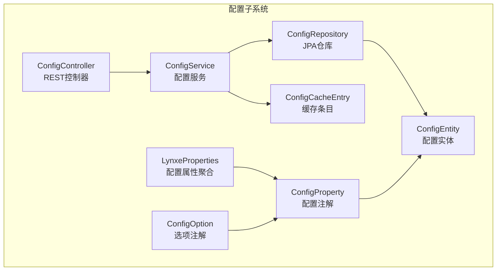
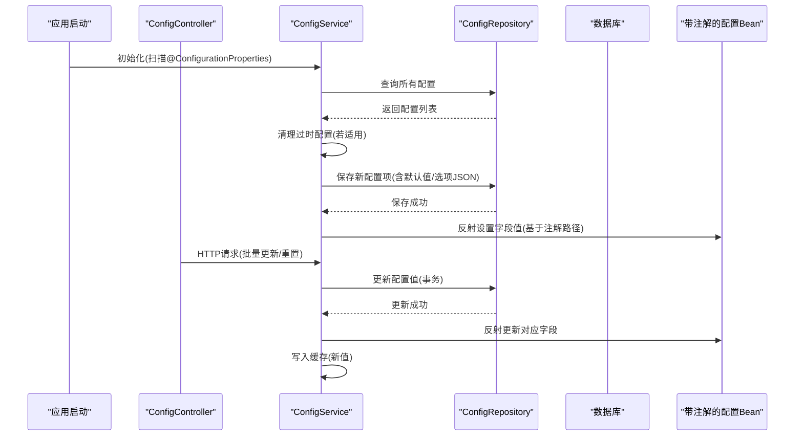
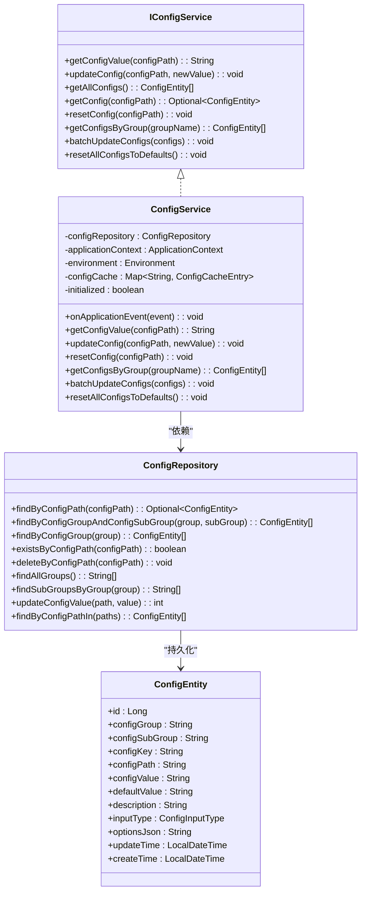
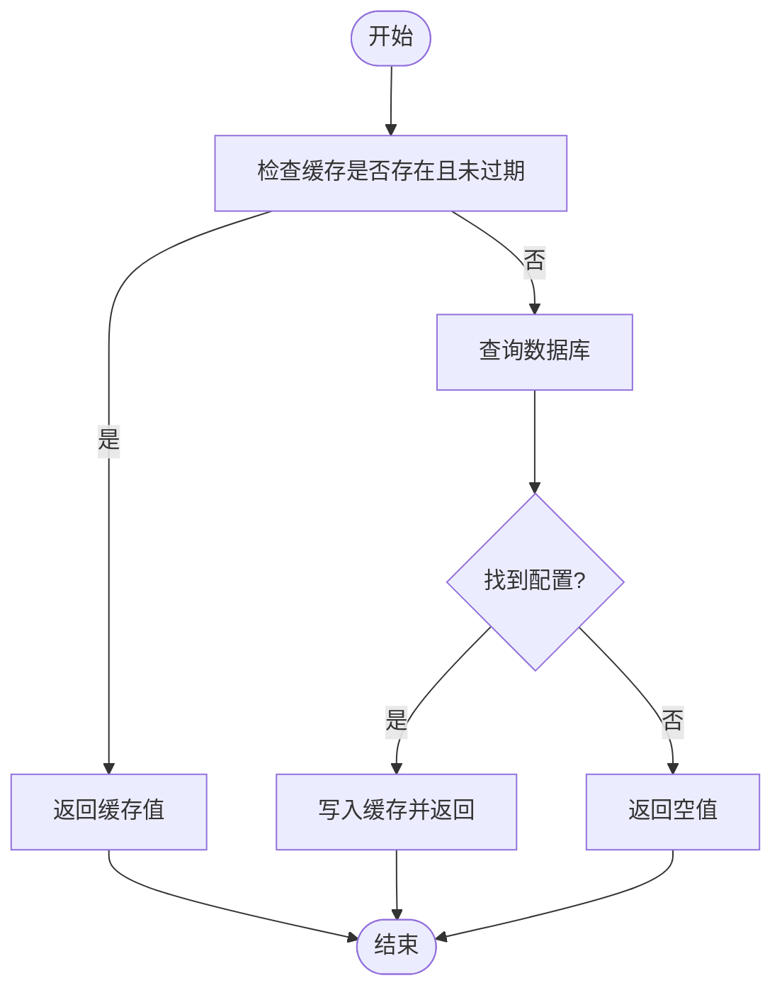
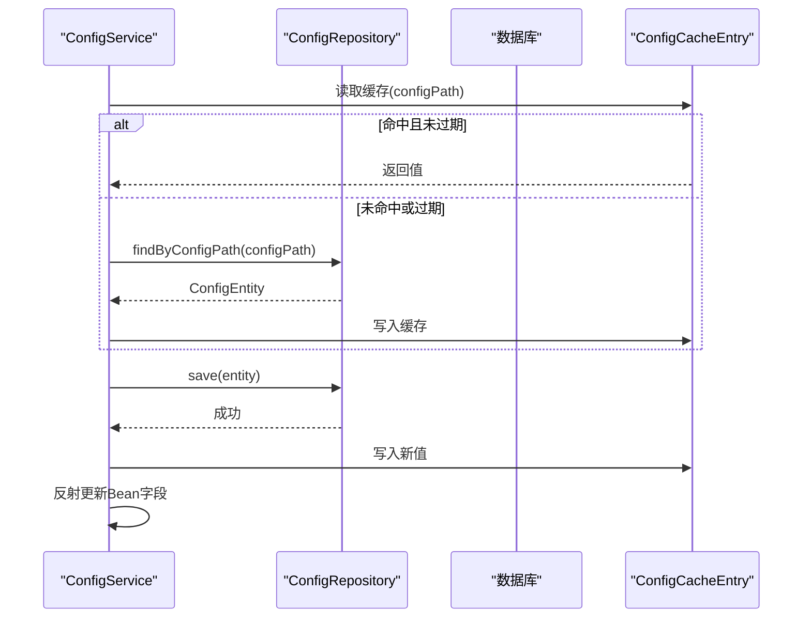
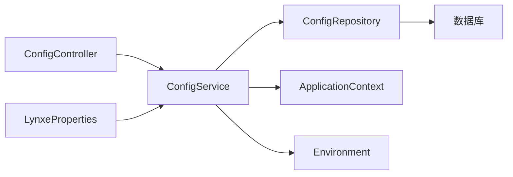

# 配置服务管理

<cite>
**本文引用的文件**
- [ConfigService.java](file://src/main/java/com/alibaba/cloud/ai/lynxe/config/ConfigService.java)
- [IConfigService.java](file://src/main/java/com/alibaba/cloud/ai/lynxe/config/IConfigService.java)
- [ConfigRepository.java](file://src/main/java/com/alibaba/cloud/ai/lynxe/config/repository/ConfigRepository.java)
- [ConfigEntity.java](file://src/main/java/com/alibaba/cloud/ai/lynxe/config/entity/ConfigEntity.java)
- [ConfigController.java](file://src/main/java/com/alibaba/cloud/ai/lynxe/config/ConfigController.java)
- [ConfigProperty.java](file://src/main/java/com/alibaba/cloud/ai/lynxe/config/ConfigProperty.java)
- [ConfigOption.java](file://src/main/java/com/alibaba/cloud/ai/lynxe/config/ConfigOption.java)
- [ConfigCacheEntry.java](file://src/main/java/com/alibaba/cloud/ai/lynxe/config/ConfigCacheEntry.java)
- [LynxeProperties.java](file://src/main/java/com/alibaba/cloud/ai/lynxe/config/LynxeProperties.java)
- [ConfigInputType.java](file://src/main/java/com/alibaba/cloud/ai/lynxe/config/entity/ConfigInputType.java)
- [application.yml](file://src/main/resources/application.yml)
- [AppStartupListener.java](file://src/main/java/com/alibaba/cloud/ai/lynxe/config/startUp/AppStartupListener.java)
- [ConfigAppStartupListener.java](file://src/main/java/com/alibaba/cloud/ai/lynxe/config/startUp/ConfigAppStartupListener.java)
</cite>

## 目录
1. [简介](#简介)
2. [项目结构](#项目结构)
3. [核心组件](#核心组件)
4. [架构总览](#架构总览)
5. [详细组件分析](#详细组件分析)
6. [依赖分析](#依赖分析)
7. [性能考虑](#性能考虑)
8. [故障排查指南](#故障排查指南)
9. [结论](#结论)
10. [附录](#附录)

## 简介
本文件面向Lynxe配置服务管理系统，围绕ConfigService展开，系统性阐述配置的获取、设置、更新与删除流程；解析接口设计与实现架构；说明配置缓存机制、配置验证逻辑与配置变更通知机制；阐明配置服务与配置存储的交互方式与数据持久化策略；给出事务处理、并发控制与性能优化建议；并提供使用示例与集成指南，帮助开发者快速理解与扩展配置能力。

## 项目结构
Lynxe配置子系统采用分层架构：
- 控制层：通过REST控制器对外暴露配置管理接口
- 业务层：ConfigService负责配置生命周期管理、缓存与变更传播
- 数据访问层：ConfigRepository基于JPA对ConfigEntity进行持久化
- 实体模型：ConfigEntity描述配置项的元数据与值
- 注解体系：ConfigProperty、ConfigOption、ConfigInputType定义配置项的结构与输入类型
- 启动监听：应用启动阶段完成配置初始化与校验

图表来源
- [ConfigController.java:36-81](file://src/main/java/com/alibaba/cloud/ai/lynxe/config/ConfigController.java#L36-L81)
- [ConfigService.java:41-320](file://src/main/java/com/alibaba/cloud/ai/lynxe/config/ConfigService.java#L41-L320)
- [ConfigRepository.java:31-101](file://src/main/java/com/alibaba/cloud/ai/lynxe/config/repository/ConfigRepository.java#L31-L101)
- [ConfigEntity.java:34-218](file://src/main/java/com/alibaba/cloud/ai/lynxe/config/entity/ConfigEntity.java#L34-L218)
- [ConfigProperty.java:37-89](file://src/main/java/com/alibaba/cloud/ai/lynxe/config/ConfigProperty.java#L37-L89)
- [ConfigOption.java:27-64](file://src/main/java/com/alibaba/cloud/ai/lynxe/config/ConfigOption.java#L27-L64)
- [ConfigCacheEntry.java:18-45](file://src/main/java/com/alibaba/cloud/ai/lynxe/config/ConfigCacheEntry.java#L18-L45)
- [LynxeProperties.java:26-654](file://src/main/java/com/alibaba/cloud/ai/lynxe/config/LynxeProperties.java#L26-L654)

章节来源
- [ConfigController.java:36-81](file://src/main/java/com/alibaba/cloud/ai/lynxe/config/ConfigController.java#L36-L81)
- [ConfigService.java:41-320](file://src/main/java/com/alibaba/cloud/ai/lynxe/config/ConfigService.java#L41-L320)
- [ConfigRepository.java:31-101](file://src/main/java/com/alibaba/cloud/ai/lynxe/config/repository/ConfigRepository.java#L31-L101)
- [ConfigEntity.java:34-218](file://src/main/java/com/alibaba/cloud/ai/lynxe/config/entity/ConfigEntity.java#L34-L218)
- [ConfigProperty.java:37-89](file://src/main/java/com/alibaba/cloud/ai/lynxe/config/ConfigProperty.java#L37-L89)
- [ConfigOption.java:27-64](file://src/main/java/com/alibaba/cloud/ai/lynxe/config/ConfigOption.java#L27-L64)
- [ConfigCacheEntry.java:18-45](file://src/main/java/com/alibaba/cloud/ai/lynxe/config/ConfigCacheEntry.java#L18-L45)
- [LynxeProperties.java:26-654](file://src/main/java/com/alibaba/cloud/ai/lynxe/config/LynxeProperties.java#L26-L654)

## 核心组件
- 接口层：IConfigService定义配置服务的标准能力，包括按路径获取值、更新、重置、批量更新、按组查询等。
- 服务实现：ConfigService实现IConfigService，负责：
  - 应用上下文初始化时扫描带@ConfigurationProperties的Bean，基于ConfigProperty注解生成或同步数据库中的配置项
  - 提供缓存读取与写入，支持过期策略
  - 执行配置更新后，反射更新对应Bean字段值
  - 支持事务性更新与批量更新
- 数据访问：ConfigRepository继承JpaRepository，提供按路径、组、子组查询与统计、批量更新等方法
- 实体模型：ConfigEntity映射system_config表，包含配置分组、键、路径、默认值、当前值、描述、输入类型、选项JSON、时间戳等
- 注解体系：ConfigProperty定义配置项的三段式分组与路径、默认值、描述、输入类型与下拉选项；ConfigOption定义下拉/单选/多选的选项集合；ConfigInputType枚举定义输入类型
- 控制器：ConfigController提供按组查询、批量更新、重置全部默认值等HTTP接口
- 启动监听：ConfigAppStartupListener在应用启动完成后输出配置系统状态；AppStartupListener根据配置自动打开浏览器

章节来源
- [IConfigService.java:27-81](file://src/main/java/com/alibaba/cloud/ai/lynxe/config/IConfigService.java#L27-L81)
- [ConfigService.java:41-320](file://src/main/java/com/alibaba/cloud/ai/lynxe/config/ConfigService.java#L41-L320)
- [ConfigRepository.java:31-101](file://src/main/java/com/alibaba/cloud/ai/lynxe/config/repository/ConfigRepository.java#L31-L101)
- [ConfigEntity.java:34-218](file://src/main/java/com/alibaba/cloud/ai/lynxe/config/entity/ConfigEntity.java#L34-L218)
- [ConfigProperty.java:37-89](file://src/main/java/com/alibaba/cloud/ai/lynxe/config/ConfigProperty.java#L37-L89)
- [ConfigOption.java:27-64](file://src/main/java/com/alibaba/cloud/ai/lynxe/config/ConfigOption.java#L27-L64)
- [ConfigInputType.java:18-46](file://src/main/java/com/alibaba/cloud/ai/lynxe/config/entity/ConfigInputType.java#L18-L46)
- [ConfigController.java:36-81](file://src/main/java/com/alibaba/cloud/ai/lynxe/config/ConfigController.java#L36-L81)
- [ConfigAppStartupListener.java:34-84](file://src/main/java/com/alibaba/cloud/ai/lynxe/config/startUp/ConfigAppStartupListener.java#L34-L84)
- [AppStartupListener.java:32-112](file://src/main/java/com/alibaba/cloud/ai/lynxe/config/startUp/AppStartupListener.java#L32-L112)

## 架构总览
配置服务以“注解驱动 + 缓存 + 事务 + 反射”的方式实现配置的声明式管理与运行时注入，形成从配置定义到持久化、缓存、运行时注入与变更传播的完整闭环。

图表来源
- [ConfigService.java:67-163](file://src/main/java/com/alibaba/cloud/ai/lynxe/config/ConfigService.java#L67-L163)
- [ConfigService.java:182-196](file://src/main/java/com/alibaba/cloud/ai/lynxe/config/ConfigService.java#L182-L196)
- [ConfigController.java:46-61](file://src/main/java/com/alibaba/cloud/ai/lynxe/config/ConfigController.java#L46-L61)
- [ConfigRepository.java:39-98](file://src/main/java/com/alibaba/cloud/ai/lynxe/config/repository/ConfigRepository.java#L39-L98)

## 详细组件分析

### 配置服务接口与实现
- IConfigService定义了配置服务的核心契约，包括：
  - 获取配置值、按路径更新、按路径重置、批量更新、按组查询、重置全部默认值
- ConfigService实现：
  - 初始化阶段扫描带@ConfigurationProperties的Bean，收集带ConfigProperty的字段，生成或同步数据库中的配置项，同时将下拉选项序列化为JSON存储
  - 提供缓存读取与写入，缓存过期时间为30秒
  - 更新配置后，遍历所有带@ConfigurationProperties的Bean，反射匹配对应字段并设置新值
  - 使用@Transactional保证更新的原子性

图表来源
- [IConfigService.java:27-81](file://src/main/java/com/alibaba/cloud/ai/lynxe/config/IConfigService.java#L27-L81)
- [ConfigService.java:41-320](file://src/main/java/com/alibaba/cloud/ai/lynxe/config/ConfigService.java#L41-L320)
- [ConfigRepository.java:31-101](file://src/main/java/com/alibaba/cloud/ai/lynxe/config/repository/ConfigRepository.java#L31-L101)
- [ConfigEntity.java:34-218](file://src/main/java/com/alibaba/cloud/ai/lynxe/config/entity/ConfigEntity.java#L34-L218)

章节来源
- [IConfigService.java:27-81](file://src/main/java/com/alibaba/cloud/ai/lynxe/config/IConfigService.java#L27-L81)
- [ConfigService.java:41-320](file://src/main/java/com/alibaba/cloud/ai/lynxe/config/ConfigService.java#L41-L320)
- [ConfigRepository.java:31-101](file://src/main/java/com/alibaba/cloud/ai/lynxe/config/repository/ConfigRepository.java#L31-L101)
- [ConfigEntity.java:34-218](file://src/main/java/com/alibaba/cloud/ai/lynxe/config/entity/ConfigEntity.java#L34-L218)

### 配置缓存机制
- 缓存结构：以配置路径为键，ConfigCacheEntry为值，包含值与最后更新时间
- 命中策略：优先从缓存读取，未命中或过期则回源数据库查询，并写入缓存
- 过期策略：默认30秒过期，确保读取一致性与性能平衡
- 写入策略：更新配置后立即写入缓存，避免后续读取脏值

图表来源
- [ConfigService.java:165-180](file://src/main/java/com/alibaba/cloud/ai/lynxe/config/ConfigService.java#L165-L180)
- [ConfigCacheEntry.java:24-42](file://src/main/java/com/alibaba/cloud/ai/lynxe/config/ConfigCacheEntry.java#L24-L42)

章节来源
- [ConfigService.java:165-180](file://src/main/java/com/alibaba/cloud/ai/lynxe/config/ConfigService.java#L165-L180)
- [ConfigCacheEntry.java:18-45](file://src/main/java/com/alibaba/cloud/ai/lynxe/config/ConfigCacheEntry.java#L18-L45)

### 配置验证逻辑
- 输入类型约束：ConfigInputType枚举定义TEXT、SELECT、CHECKBOX、BOOLEAN、NUMBER五种类型，用于前端渲染与校验
- 下拉选项存储：当输入类型为SELECT时，将选项数组序列化为JSON字符串存储于optionsJson字段
- 类型转换：更新配置时，ConfigService根据目标字段类型进行转换，不支持的类型会抛出异常
- 默认值与环境变量：初始化时优先从Environment读取同名属性作为初始值，否则使用注解默认值

章节来源
- [ConfigInputType.java:18-46](file://src/main/java/com/alibaba/cloud/ai/lynxe/config/entity/ConfigInputType.java#L18-L46)
- [ConfigProperty.java:79-87](file://src/main/java/com/alibaba/cloud/ai/lynxe/config/ConfigProperty.java#L79-L87)
- [ConfigService.java:134-153](file://src/main/java/com/alibaba/cloud/ai/lynxe/config/ConfigService.java#L134-L153)
- [ConfigService.java:219-245](file://src/main/java/com/alibaba/cloud/ai/lynxe/config/ConfigService.java#L219-L245)

### 配置变更通知机制
- 反射级联更新：配置更新后，ConfigService遍历所有带@ConfigurationProperties的Bean，定位与配置路径匹配的字段，通过反射设置新值，实现“配置即代码”的即时生效
- 事务保障：更新与批量更新均标注@Transactional，确保数据库与Bean状态一致

章节来源
- [ConfigService.java:182-196](file://src/main/java/com/alibaba/cloud/ai/lynxe/config/ConfigService.java#L182-L196)
- [ConfigService.java:198-203](file://src/main/java/com/alibaba/cloud/ai/lynxe/config/ConfigService.java#L198-L203)
- [ConfigService.java:280-296](file://src/main/java/com/alibaba/cloud/ai/lynxe/config/ConfigService.java#L280-L296)

### 配置服务与配置存储的交互
- 初始化：扫描Bean → 生成/同步配置项 → 写入数据库 → 反射设置Bean字段
- 查询：优先缓存 → 回源数据库 → 写入缓存
- 更新：事务写库 → 写入缓存 → 反射更新Bean
- 删除：通过路径删除并清理缓存
- 统计：提供按组、子组查询与去重统计

图表来源
- [ConfigService.java:165-196](file://src/main/java/com/alibaba/cloud/ai/lynxe/config/ConfigService.java#L165-L196)
- [ConfigRepository.java:39-67](file://src/main/java/com/alibaba/cloud/ai/lynxe/config/repository/ConfigRepository.java#L39-L67)
- [ConfigCacheEntry.java:24-42](file://src/main/java/com/alibaba/cloud/ai/lynxe/config/ConfigCacheEntry.java#L24-L42)

章节来源
- [ConfigService.java:165-196](file://src/main/java/com/alibaba/cloud/ai/lynxe/config/ConfigService.java#L165-L196)
- [ConfigRepository.java:39-67](file://src/main/java/com/alibaba/cloud/ai/lynxe/config/repository/ConfigRepository.java#L39-L67)
- [ConfigCacheEntry.java:18-45](file://src/main/java/com/alibaba/cloud/ai/lynxe/config/ConfigCacheEntry.java#L18-L45)

### 事务处理与并发控制
- 事务：updateConfig、batchUpdateConfigs、resetAllConfigsToDefaults均使用@Transactional，确保数据库更新与Bean反射更新的一致性
- 并发：缓存使用ConcurrentHashMap，读写路径短、开销低；Bean字段更新通过反射逐个字段设置，避免全局锁竞争
- 建议：高并发场景可引入分布式锁或队列化配置变更，降低瞬时压力

章节来源
- [ConfigService.java:182-196](file://src/main/java/com/alibaba/cloud/ai/lynxe/config/ConfigService.java#L182-L196)
- [ConfigService.java:280-296](file://src/main/java/com/alibaba/cloud/ai/lynxe/config/ConfigService.java#L280-L296)
- [ConfigService.java:301-317](file://src/main/java/com/alibaba/cloud/ai/lynxe/config/ConfigService.java#L301-L317)

### 性能优化措施
- 缓存命中：30秒过期策略在一致性与性能间取得平衡
- 批量更新：提供批量更新接口，减少多次往返
- 反射最小化：仅在配置变更时更新受影响的字段，避免全量扫描
- 数据库索引：configPath唯一索引，提升查找与去重效率
- 启动阶段预热：启动监听器输出配置统计，便于运维监控

章节来源
- [ConfigCacheEntry.java:24](file://src/main/java/com/alibaba/cloud/ai/lynxe/config/ConfigCacheEntry.java#L24)
- [ConfigRepository.java:61](file://src/main/java/com/alibaba/cloud/ai/lynxe/config/repository/ConfigRepository.java#L61)
- [ConfigAppStartupListener.java:47-70](file://src/main/java/com/alibaba/cloud/ai/lynxe/config/startUp/ConfigAppStartupListener.java#L47-L70)

### 使用示例与集成指南
- 定义配置项
  - 在配置Bean中使用@ConfigurationProperties(prefix="...")，并在字段上使用@ConfigProperty声明分组、子组、键、路径、默认值、描述与输入类型
  - 若为SELECT类型，使用@ConfigOption定义选项集合
- 读取配置
  - 通过IConfigService.getConfigValue("...")获取字符串值；如需强类型，可在业务层自行转换
- 更新配置
  - 通过ConfigController的POST /api/config/batch-update或调用IConfigService.updateConfig实现
  - 更新后Bean字段将被反射更新，无需重启
- 重置配置
  - 单项重置：IConfigService.resetConfig
  - 全部重置：IConfigService.resetAllConfigsToDefaults
- 分组查询
  - 通过ConfigController的GET /api/config/group/{groupName}或IConfigService.getConfigsByGroup获取分组内配置

章节来源
- [LynxeProperties.java:26-654](file://src/main/java/com/alibaba/cloud/ai/lynxe/config/LynxeProperties.java#L26-L654)
- [ConfigProperty.java:37-89](file://src/main/java/com/alibaba/cloud/ai/lynxe/config/ConfigProperty.java#L37-L89)
- [ConfigOption.java:27-64](file://src/main/java/com/alibaba/cloud/ai/lynxe/config/ConfigOption.java#L27-L64)
- [ConfigController.java:46-61](file://src/main/java/com/alibaba/cloud/ai/lynxe/config/ConfigController.java#L46-L61)
- [IConfigService.java:27-81](file://src/main/java/com/alibaba/cloud/ai/lynxe/config/IConfigService.java#L27-L81)

## 依赖分析
- 组件耦合
  - ConfigService依赖ConfigRepository与ApplicationContext/Environment
  - ConfigController依赖IConfigService
  - LynxeProperties通过@Lazy注入IConfigService，避免循环依赖
- 外部依赖
  - Spring Boot Starter Data JPA用于ORM与事务
  - Spring AOP代理与事务管理
- 潜在风险
  - 反射更新字段存在类型不匹配风险，需严格约束输入类型
  - 大量Bean时反射成本上升，建议限制配置Bean数量或引入异步更新

图表来源
- [ConfigController.java:40-44](file://src/main/java/com/alibaba/cloud/ai/lynxe/config/ConfigController.java#L40-L44)
- [ConfigService.java:46-53](file://src/main/java/com/alibaba/cloud/ai/lynxe/config/ConfigService.java#L46-L53)
- [LynxeProperties.java:30-32](file://src/main/java/com/alibaba/cloud/ai/lynxe/config/LynxeProperties.java#L30-L32)

章节来源
- [ConfigController.java:40-44](file://src/main/java/com/alibaba/cloud/ai/lynxe/config/ConfigController.java#L40-L44)
- [ConfigService.java:46-53](file://src/main/java/com/alibaba/cloud/ai/lynxe/config/ConfigService.java#L46-L53)
- [LynxeProperties.java:30-32](file://src/main/java/com/alibaba/cloud/ai/lynxe/config/LynxeProperties.java#L30-L32)

## 性能考虑
- 缓存策略：30秒过期兼顾实时性与吞吐；可根据业务调整过期时间
- 批量接口：优先使用批量更新减少网络与事务开销
- 字段类型：尽量使用简单类型，避免复杂对象导致的转换与序列化成本
- 数据库：确保configPath建立唯一索引；合理设置连接池参数
- 启动阶段：利用启动监听器输出配置统计，便于发现异常配置

## 故障排查指南
- 配置未生效
  - 检查是否正确使用@ConfigProperty与正确的path
  - 确认Bean已注册为@ConfigurationProperties
  - 查看日志中初始化阶段的清理与创建记录
- 类型转换失败
  - 检查ConfigProperty的inputType与实际值是否匹配
  - 确认目标字段类型支持转换
- 更新后Bean未变化
  - 确认反射更新路径与字段可见性
  - 检查事务是否成功提交
- 启动时浏览器未打开
  - 检查LynxeProperties中的openBrowserAuto开关
  - 查看AppStartupListener日志

章节来源
- [ConfigService.java:67-163](file://src/main/java/com/alibaba/cloud/ai/lynxe/config/ConfigService.java#L67-L163)
- [ConfigService.java:182-196](file://src/main/java/com/alibaba/cloud/ai/lynxe/config/ConfigService.java#L182-L196)
- [ConfigService.java:219-245](file://src/main/java/com/alibaba/cloud/ai/lynxe/config/ConfigService.java#L219-L245)
- [AppStartupListener.java:47-109](file://src/main/java/com/alibaba/cloud/ai/lynxe/config/startUp/AppStartupListener.java#L47-L109)

## 结论
Lynxe配置服务通过注解驱动、缓存与事务保障、反射级联更新，实现了配置的声明式管理与运行时注入。其清晰的分层架构、完善的接口设计与可扩展的注解体系，使得配置管理既易于使用又便于维护。结合本文提供的性能优化与故障排查建议，可进一步提升系统的稳定性与可运维性。

## 附录
- 关键配置项示例
  - 浏览器无头模式：group=lynxe, subGroup=browser, key=headless, path=lynxe.browser.headless
  - 请求超时：group=lynxe, subGroup=browser, key=requestTimeout, path=lynxe.browser.requestTimeout
  - 代理开关：group=lynxe, subGroup=browser, key=enableShortUrl, path=lynxe.browser.enableShortUrl
  - 代理开关：group=lynxe, subGroup=general, key=openBrowser, path=lynxe.general.openBrowser
  - 代理开关：group=lynxe, subGroup=general, key=debugDetail, path=lynxe.general.debugDetail
- 数据库表结构要点
  - 表名：system_config
  - 主键：id
  - 唯一索引：configPath
  - 关键字段：configGroup, configSubGroup, configKey, configPath, configValue, defaultValue, description, inputType, optionsJson, createTime, updateTime

章节来源
- [ConfigEntity.java:34-218](file://src/main/java/com/alibaba/cloud/ai/lynxe/config/entity/ConfigEntity.java#L34-L218)
- [application.yml:1-97](file://src/main/resources/application.yml#L1-L97)