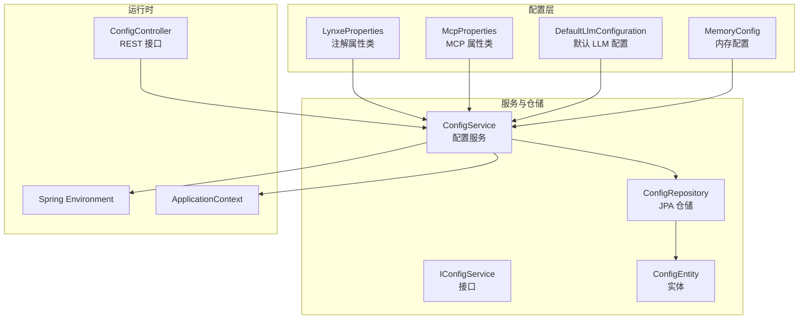
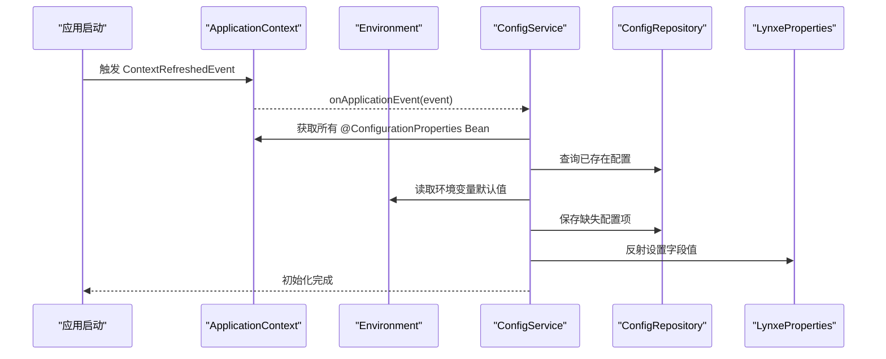
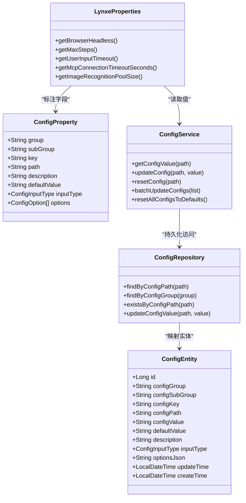
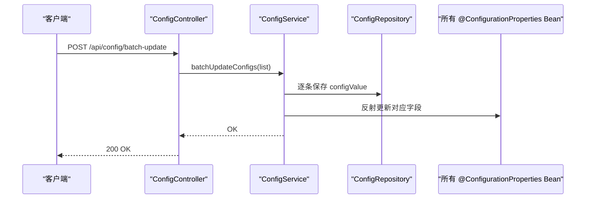
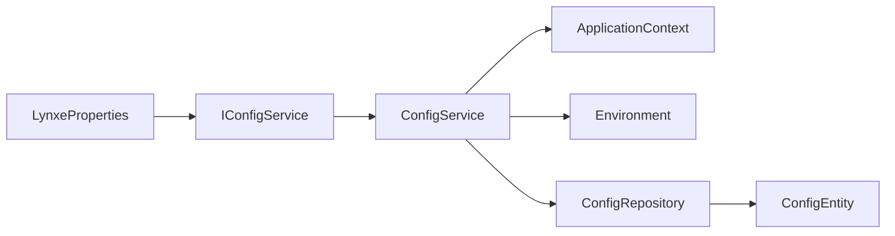

# 配置管理

<cite>
**本文引用的文件**
- [LynxeProperties.java](file://src/main/java/com/alibaba/cloud/ai/lynxe/config/LynxeProperties.java)
- [ConfigService.java](file://src/main/java/com/alibaba/cloud/ai/lynxe/config/ConfigService.java)
- [IConfigService.java](file://src/main/java/com/alibaba/cloud/ai/lynxe/config/IConfigService.java)
- [ConfigController.java](file://src/main/java/com/alibaba/cloud/ai/lynxe/config/ConfigController.java)
- [ConfigEntity.java](file://src/main/java/com/alibaba/cloud/ai/lynxe/config/entity/ConfigEntity.java)
- [ConfigRepository.java](file://src/main/java/com/alibaba/cloud/ai/lynxe/config/repository/ConfigRepository.java)
- [ConfigProperty.java](file://src/main/java/com/alibaba/cloud/ai/lynxe/config/ConfigProperty.java)
- [ConfigOption.java](file://src/main/java/com/alibaba/cloud/ai/lynxe/config/ConfigOption.java)
- [ConfigCacheEntry.java](file://src/main/java/com/alibaba/cloud/ai/lynxe/config/ConfigCacheEntry.java)
- [McpProperties.java](file://src/main/java/com/alibaba/cloud/ai/lynxe/mcp/config/McpProperties.java)
- [application.yml](file://src/main/resources/application.yml)
- [MemoryConfig.java](file://src/main/java/com/alibaba/cloud/ai/lynxe/config/MemoryConfig.java)
- [DefaultLlmConfiguration.java](file://src/main/java/com/alibaba/cloud/ai/lynxe/config/DefaultLlmConfiguration.java)
- [NamespaceService.java](file://src/main/java/com/alibaba/cloud/ai/lynxe/namespace/service/NamespaceService.java)
- [ModelService.java](file://src/main/java/com/alibaba/cloud/ai/lynxe/model/service/ModelService.java)
</cite>

## 目录
1. [简介](#简介)
2. [项目结构](#项目结构)
3. [核心组件](#核心组件)
4. [架构总览](#架构总览)
5. [详细组件分析](#详细组件分析)
6. [依赖分析](#依赖分析)
7. [性能考量](#性能考量)
8. [故障排查指南](#故障排查指南)
9. [结论](#结论)
10. [附录](#附录)

## 简介
本文件系统性阐述 Lynxe 配置管理系统的定义、加载、验证与运行机制，覆盖以下方面：
- 配置属性定义与注解体系
- 配置分类：模型配置、命名空间配置、MCP 配置、数据库配置等
- 配置优先级、继承与覆盖规则
- 动态更新、热重载与一致性保障
- 开发指南、最佳实践与安全考虑
- 配置与各组件的集成方式与依赖关系
- 备份、迁移与版本管理策略

## 项目结构
Lynxe 的配置管理由“注解驱动的属性类 + 配置服务 + 数据持久化 + 控制器接口”构成，同时通过 Spring 环境与应用上下文在启动阶段完成初始化与缓存。

图表来源
- [LynxeProperties.java:1-654](file://src/main/java/com/alibaba/cloud/ai/lynxe/config/LynxeProperties.java#L1-L654)
- [McpProperties.java:1-191](file://src/main/java/com/alibaba/cloud/ai/lynxe/mcp/config/McpProperties.java#L1-L191)
- [DefaultLlmConfiguration.java:1-52](file://src/main/java/com/alibaba/cloud/ai/lynxe/config/DefaultLlmConfiguration.java#L1-L52)
- [MemoryConfig.java:1-73](file://src/main/java/com/alibaba/cloud/ai/lynxe/config/MemoryConfig.java#L1-L73)
- [ConfigService.java:1-320](file://src/main/java/com/alibaba/cloud/ai/lynxe/config/ConfigService.java#L1-L320)
- [IConfigService.java:1-81](file://src/main/java/com/alibaba/cloud/ai/lynxe/config/IConfigService.java#L1-L81)
- [ConfigRepository.java:1-101](file://src/main/java/com/alibaba/cloud/ai/lynxe/config/repository/ConfigRepository.java#L1-L101)
- [ConfigEntity.java:1-218](file://src/main/java/com/alibaba/cloud/ai/lynxe/config/entity/ConfigEntity.java#L1-L218)
- [ConfigController.java:1-82](file://src/main/java/com/alibaba/cloud/ai/lynxe/config/ConfigController.java#L1-L82)

章节来源
- [application.yml:1-97](file://src/main/resources/application.yml#L1-L97)

## 核心组件
- 注解与元数据
  - ConfigProperty：定义三段式分组路径与默认值、输入类型、选项等
  - ConfigOption：用于 SELECT 类型的下拉选项
- 配置实体与仓储
  - ConfigEntity：持久化配置项，含分组、子组、键、路径、默认值、描述、输入类型、选项 JSON、时间戳
  - ConfigRepository：按路径、分组查询与批量更新
- 配置服务
  - IConfigService：对外暴露获取、更新、重置、分组查询、批量更新、全部重置等能力
  - ConfigService：实现初始化、缓存、类型转换、字段反射写入、过期清理
- 属性类
  - LynxeProperties：集中声明各类业务配置项，并通过配置服务读取实际值
  - McpProperties：MCP 客户端连接与会话参数
  - DefaultLlmConfiguration：默认 LLM 基础信息
  - MemoryConfig：基于数据库的对话记忆仓库选择
- 控制器
  - ConfigController：提供按组查询、批量更新、重置全部默认值、可用模型枚举等接口

章节来源
- [ConfigProperty.java:1-89](file://src/main/java/com/alibaba/cloud/ai/lynxe/config/ConfigProperty.java#L1-L89)
- [ConfigOption.java:1-64](file://src/main/java/com/alibaba/cloud/ai/lynxe/config/ConfigOption.java#L1-L64)
- [ConfigEntity.java:1-218](file://src/main/java/com/alibaba/cloud/ai/lynxe/config/entity/ConfigEntity.java#L1-L218)
- [ConfigRepository.java:1-101](file://src/main/java/com/alibaba/cloud/ai/lynxe/config/repository/ConfigRepository.java#L1-L101)
- [IConfigService.java:1-81](file://src/main/java/com/alibaba/cloud/ai/lynxe/config/IConfigService.java#L1-L81)
- [ConfigService.java:1-320](file://src/main/java/com/alibaba/cloud/ai/lynxe/config/ConfigService.java#L1-L320)
- [LynxeProperties.java:1-654](file://src/main/java/com/alibaba/cloud/ai/lynxe/config/LynxeProperties.java#L1-L654)
- [McpProperties.java:1-191](file://src/main/java/com/alibaba/cloud/ai/lynxe/mcp/config/McpProperties.java#L1-L191)
- [DefaultLlmConfiguration.java:1-52](file://src/main/java/com/alibaba/cloud/ai/lynxe/config/DefaultLlmConfiguration.java#L1-L52)
- [MemoryConfig.java:1-73](file://src/main/java/com/alibaba/cloud/ai/lynxe/config/MemoryConfig.java#L1-L73)
- [ConfigController.java:1-82](file://src/main/java/com/alibaba/cloud/ai/lynxe/config/ConfigController.java#L1-L82)

## 架构总览
Lynxe 的配置系统采用“注解定义 + 启动初始化 + 缓存读取 + 反射更新”的模式，确保配置在运行时可被动态修改并即时生效于对应属性类。

图表来源
- [ConfigService.java:59-163](file://src/main/java/com/alibaba/cloud/ai/lynxe/config/ConfigService.java#L59-L163)
- [LynxeProperties.java:44-51](file://src/main/java/com/alibaba/cloud/ai/lynxe/config/LynxeProperties.java#L44-L51)

## 详细组件分析

### 配置属性定义与加载机制
- 注解驱动
  - 使用 ConfigProperty 标注字段，声明 group/subGroup/key 与完整路径 path，以及默认值、输入类型、国际化描述与选项
  - ConfigOption 仅在输入类型为 SELECT 时生效，服务侧会将选项序列化为 JSON 存储
- 启动初始化
  - ConfigService 在 ContextRefreshedEvent 事件中扫描所有带 @ConfigurationProperties 的 Bean
  - 对每个 Bean 收集其 ConfigProperty 注解，生成或补全数据库中的配置项
  - 从 Environment 读取同名路径的环境变量作为初始值，否则使用注解默认值
  - 将配置值通过反射写入 Bean 字段，完成首次赋值
- 运行时读取
  - 业务类通过 getter 从 ConfigService 获取最新值；若缓存未过期则直接返回，否则从数据库读取并更新缓存
- 类型转换
  - 支持字符串、布尔、整型、长整型、双精度、单精度等常见类型；对布尔值额外兼容“on”文本

图表来源
- [LynxeProperties.java:1-654](file://src/main/java/com/alibaba/cloud/ai/lynxe/config/LynxeProperties.java#L1-L654)
- [ConfigProperty.java:1-89](file://src/main/java/com/alibaba/cloud/ai/lynxe/config/ConfigProperty.java#L1-L89)
- [ConfigService.java:1-320](file://src/main/java/com/alibaba/cloud/ai/lynxe/config/ConfigService.java#L1-L320)
- [ConfigRepository.java:1-101](file://src/main/java/com/alibaba/cloud/ai/lynxe/config/repository/ConfigRepository.java#L1-L101)
- [ConfigEntity.java:1-218](file://src/main/java/com/alibaba/cloud/ai/lynxe/config/entity/ConfigEntity.java#L1-L218)

章节来源
- [ConfigProperty.java:26-89](file://src/main/java/com/alibaba/cloud/ai/lynxe/config/ConfigProperty.java#L26-L89)
- [ConfigOption.java:22-64](file://src/main/java/com/alibaba/cloud/ai/lynxe/config/ConfigOption.java#L22-L64)
- [ConfigService.java:67-163](file://src/main/java/com/alibaba/cloud/ai/lynxe/config/ConfigService.java#L67-L163)
- [LynxeProperties.java:34-96](file://src/main/java/com/alibaba/cloud/ai/lynxe/config/LynxeProperties.java#L34-L96)

### 配置分类与职责边界
- 模型配置
  - 默认 LLM 配置：提供默认模型名称、基础地址、描述与补全路径
  - 模型服务：提供模型列表、校验、设置默认模型等能力（与配置联动）
- 命名空间配置
  - 命名空间服务：提供命名空间的增删改查能力（与配置联动）
- MCP 配置
  - MCP 属性类：集中管理连接超时、初始化超时、SSE 参数、重试策略等
- 数据库配置
  - 应用配置：Hikari 连接池、JPA、日志级别等
  - 内存配置：根据启用的数据库类型选择对应的聊天记忆仓库

章节来源
- [DefaultLlmConfiguration.java:24-52](file://src/main/java/com/alibaba/cloud/ai/lynxe/config/DefaultLlmConfiguration.java#L24-L52)
- [ModelService.java:23-40](file://src/main/java/com/alibaba/cloud/ai/lynxe/model/service/ModelService.java#L23-L40)
- [NamespaceService.java:22-35](file://src/main/java/com/alibaba/cloud/ai/lynxe/namespace/service/NamespaceService.java#L22-L35)
- [McpProperties.java:26-191](file://src/main/java/com/alibaba/cloud/ai/lynxe/mcp/config/McpProperties.java#L26-L191)
- [application.yml:19-38](file://src/main/resources/application.yml#L19-L38)
- [MemoryConfig.java:35-73](file://src/main/java/com/alibaba/cloud/ai/lynxe/config/MemoryConfig.java#L35-L73)

### 配置优先级、继承与覆盖规则
- 优先级顺序（高到低）
  1) 环境变量（来自 Spring Environment）：启动初始化时读取同名路径的环境变量作为初始值
  2) 数据库持久化值：用户通过接口更新后的最终值
  3) 注解默认值：当未找到环境变量且数据库无值时回退
- 继承与覆盖
  - 启动阶段：服务扫描所有带注解的属性类，为缺失的配置项创建记录并写入默认值
  - 运行阶段：每次读取均先查缓存，未命中再查数据库；更新后同步刷新缓存与所有相关 Bean 的字段值
- 过期与一致性
  - 缓存默认 30 秒过期，确保更新后最多 30 秒内可见
  - 批量更新与全部重置会同步更新所有相关 Bean，避免脏读

章节来源
- [ConfigService.java:114-163](file://src/main/java/com/alibaba/cloud/ai/lynxe/config/ConfigService.java#L114-L163)
- [ConfigService.java:165-196](file://src/main/java/com/alibaba/cloud/ai/lynxe/config/ConfigService.java#L165-L196)
- [ConfigCacheEntry.java:18-45](file://src/main/java/com/alibaba/cloud/ai/lynxe/config/ConfigCacheEntry.java#L18-L45)

### 动态更新、热重载与一致性保证
- 动态更新
  - 提供按路径更新与批量更新接口；更新成功后立即写入数据库并刷新缓存
- 热重载
  - 更新后通过反射遍历所有带 @ConfigurationProperties 的 Bean，将新值写入对应字段，无需重启
- 一致性
  - 事务性更新：单条更新与批量更新均在事务中执行
  - 全部重置：将所有配置恢复默认值并同步刷新 Bean

图表来源
- [ConfigController.java:51-55](file://src/main/java/com/alibaba/cloud/ai/lynxe/config/ConfigController.java#L51-L55)
- [ConfigService.java:280-296](file://src/main/java/com/alibaba/cloud/ai/lynxe/config/ConfigService.java#L280-L296)

章节来源
- [ConfigController.java:46-61](file://src/main/java/com/alibaba/cloud/ai/lynxe/config/ConfigController.java#L46-L61)
- [ConfigService.java:182-196](file://src/main/java/com/alibaba/cloud/ai/lynxe/config/ConfigService.java#L182-L196)
- [ConfigService.java:255-265](file://src/main/java/com/alibaba/cloud/ai/lynxe/config/ConfigService.java#L255-L265)
- [ConfigService.java:301-317](file://src/main/java/com/alibaba/cloud/ai/lynxe/config/ConfigService.java#L301-L317)

### 验证与校验机制
- 输入类型与选项
  - 通过 ConfigProperty 的 inputType 与 options 定义 UI 输入形态与可选范围
  - SELECT 类型的选项以 JSON 形式存储于 optionsJson，便于前端渲染
- 类型转换
  - 服务侧在设置 Bean 字段前进行类型转换，不支持的类型会抛出异常
- 运行时校验
  - 建议在控制器或上层服务增加业务校验（如范围检查、格式校验），并在失败时返回明确错误

章节来源
- [ConfigProperty.java:79-87](file://src/main/java/com/alibaba/cloud/ai/lynxe/config/ConfigProperty.java#L79-L87)
- [ConfigService.java:219-245](file://src/main/java/com/alibaba/cloud/ai/lynxe/config/ConfigService.java#L219-L245)

### 配置与组件的集成方式与依赖关系
- 与业务类集成
  - LynxeProperties 的 getter 通过 ConfigService 读取值，实现“声明即注入”
- 与数据库集成
  - ConfigEntity 映射 system_config 表；ConfigRepository 提供按路径、分组查询与批量更新
- 与外部系统集成
  - MCP 属性类与 MemoryConfig 分别面向 MCP 客户端与对话记忆仓库，通过各自属性类注入
- 与模型/命名空间服务集成
  - 模型与命名空间服务通过各自的接口与实现提供 CRUD 能力，配置变更可影响这些服务的行为

章节来源
- [LynxeProperties.java:44-51](file://src/main/java/com/alibaba/cloud/ai/lynxe/config/LynxeProperties.java#L44-L51)
- [ConfigEntity.java:33-118](file://src/main/java/com/alibaba/cloud/ai/lynxe/config/entity/ConfigEntity.java#L33-L118)
- [ConfigRepository.java:31-101](file://src/main/java/com/alibaba/cloud/ai/lynxe/config/repository/ConfigRepository.java#L31-L101)
- [McpProperties.java:26-191](file://src/main/java/com/alibaba/cloud/ai/lynxe/mcp/config/McpProperties.java#L26-L191)
- [MemoryConfig.java:35-73](file://src/main/java/com/alibaba/cloud/ai/lynxe/config/MemoryConfig.java#L35-L73)
- [ModelService.java:23-40](file://src/main/java/com/alibaba/cloud/ai/lynxe/model/service/ModelService.java#L23-L40)
- [NamespaceService.java:22-35](file://src/main/java/com/alibaba/cloud/ai/lynxe/namespace/service/NamespaceService.java#L22-L35)

### 配置开发指南与最佳实践
- 定义配置
  - 使用 ConfigProperty 标注字段，明确 group/subGroup/key 与 path
  - 为 SELECT 类型提供 ConfigOption 数组，并确保 label/描述符合国际化键规范
- 初始化与默认值
  - 启动阶段由 ConfigService 自动创建缺失配置项并写入默认值
  - 如需从环境变量注入，请确保配置路径与环境变量键一致
- 更新与回滚
  - 通过 /api/config/batch-update 执行批量更新；必要时使用 /api/config/reset-all-defaults 回滚
- 性能与一致性
  - 利用内置缓存减少数据库压力；注意 30 秒过期窗口
  - 批量更新时建议一次性提交，避免多次事务开销

章节来源
- [ConfigProperty.java:26-89](file://src/main/java/com/alibaba/cloud/ai/lynxe/config/ConfigProperty.java#L26-L89)
- [ConfigService.java:67-163](file://src/main/java/com/alibaba/cloud/ai/lynxe/config/ConfigService.java#L67-L163)
- [ConfigController.java:51-61](file://src/main/java/com/alibaba/cloud/ai/lynxe/config/ConfigController.java#L51-L61)

### 安全考虑
- 环境变量注入
  - 仅允许受控的环境变量键与路径，避免将敏感信息硬编码在源码中
- 输入类型与选项
  - 对涉及权限、路径等敏感配置，优先使用 SELECT 或受限输入类型，并在上层服务做二次校验
- 缓存与过期
  - 30 秒缓存窗口有助于降低频繁读取带来的风险，但应结合审计日志追踪配置变更

章节来源
- [ConfigService.java:114-163](file://src/main/java/com/alibaba/cloud/ai/lynxe/config/ConfigService.java#L114-L163)
- [ConfigCacheEntry.java:24-42](file://src/main/java/com/alibaba/cloud/ai/lynxe/config/ConfigCacheEntry.java#L24-L42)

### 备份、迁移与版本管理策略
- 备份
  - 建议定期导出 system_config 表，保留配置历史快照
- 迁移
  - 新增配置项时，通过 ConfigService 初始化逻辑自动补齐；删除或变更字段时，可在启动阶段清理无效配置
- 版本管理
  - 通过注解默认值与数据库默认值共同维护向后兼容；重大变更时提供迁移脚本与回滚方案

章节来源
- [ConfigService.java:83-104](file://src/main/java/com/alibaba/cloud/ai/lynxe/config/ConfigService.java#L83-L104)
- [ConfigRepository.java:61-98](file://src/main/java/com/alibaba/cloud/ai/lynxe/config/repository/ConfigRepository.java#L61-L98)

## 依赖分析
- 组件耦合
  - ConfigService 依赖 ApplicationContext、Environment、ConfigRepository，是配置系统的核心协调者
  - LynxeProperties 通过 IConfigService 间接依赖 ConfigService，形成“读取依赖”
- 外部依赖
  - Spring Environment 用于读取环境变量
  - JPA/H2/MySQL/PostgreSQL 用于持久化配置
- 循环依赖
  - 通过懒加载与接口隔离，避免直接循环引用

图表来源
- [IConfigService.java:23-81](file://src/main/java/com/alibaba/cloud/ai/lynxe/config/IConfigService.java#L23-L81)
- [ConfigService.java:42-54](file://src/main/java/com/alibaba/cloud/ai/lynxe/config/ConfigService.java#L42-L54)
- [ConfigRepository.java:28-101](file://src/main/java/com/alibaba/cloud/ai/lynxe/config/repository/ConfigRepository.java#L28-L101)
- [ConfigEntity.java:33-218](file://src/main/java/com/alibaba/cloud/ai/lynxe/config/entity/ConfigEntity.java#L33-L218)

章节来源
- [IConfigService.java:23-81](file://src/main/java/com/alibaba/cloud/ai/lynxe/config/IConfigService.java#L23-L81)
- [ConfigService.java:42-54](file://src/main/java/com/alibaba/cloud/ai/lynxe/config/ConfigService.java#L42-L54)
- [ConfigRepository.java:28-101](file://src/main/java/com/alibaba/cloud/ai/lynxe/config/repository/ConfigRepository.java#L28-L101)

## 性能考量
- 缓存命中率
  - 通过 30 秒缓存提升读取性能；对于高频读取场景，建议合并请求
- 批量更新
  - 使用批量更新接口减少事务次数，提高吞吐
- 类型转换成本
  - 类型转换发生在运行时，建议在设计阶段尽量统一类型，减少转换开销

## 故障排查指南
- 配置未生效
  - 检查是否正确标注 ConfigProperty 且 path 与环境变量一致
  - 确认 ConfigService 已完成初始化，且 Bean 字段已被反射设置
- 更新后读取仍旧值
  - 等待缓存过期（约 30 秒）或确认更新接口调用成功
- 类型转换异常
  - 检查数据库中的 configValue 是否与目标字段类型匹配
- 无法找到配置
  - 使用按组查询接口确认配置是否存在

章节来源
- [ConfigService.java:165-196](file://src/main/java/com/alibaba/cloud/ai/lynxe/config/ConfigService.java#L165-L196)
- [ConfigService.java:219-245](file://src/main/java/com/alibaba/cloud/ai/lynxe/config/ConfigService.java#L219-L245)
- [ConfigController.java:46-49](file://src/main/java/com/alibaba/cloud/ai/lynxe/config/ConfigController.java#L46-L49)

## 结论
Lynxe 的配置管理以注解为核心、以服务为枢纽、以缓存与事务为保障，实现了从定义、初始化、运行时读取到动态更新的全链路闭环。通过清晰的分组与类型约束、完善的持久化与接口能力，系统既满足了灵活性，也兼顾了稳定性与安全性。建议在生产环境中配合审计与备份策略，确保配置变更的可追溯与可恢复。

## 附录
- 关键接口与路径
  - GET /api/config/group/{groupName}：按组查询配置
  - POST /api/config/batch-update：批量更新配置
  - POST /api/config/reset-all-defaults：重置全部配置为默认值
- 数据模型
  - system_config 表：包含分组、子组、键、路径、值、默认值、描述、输入类型、选项 JSON、时间戳等字段

章节来源
- [ConfigController.java:46-61](file://src/main/java/com/alibaba/cloud/ai/lynxe/config/ConfigController.java#L46-L61)
- [ConfigEntity.java:33-218](file://src/main/java/com/alibaba/cloud/ai/lynxe/config/entity/ConfigEntity.java#L33-L218)
- [ConfigRepository.java:31-101](file://src/main/java/com/alibaba/cloud/ai/lynxe/config/repository/ConfigRepository.java#L31-L101)