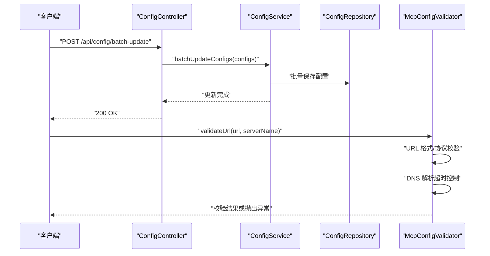
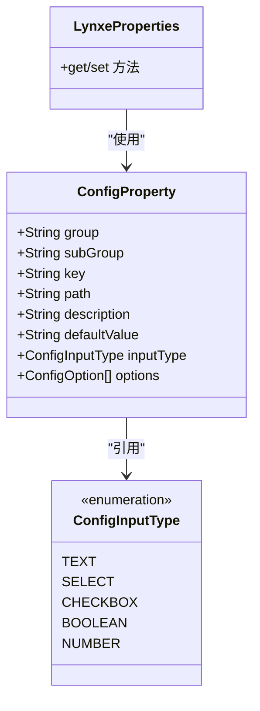
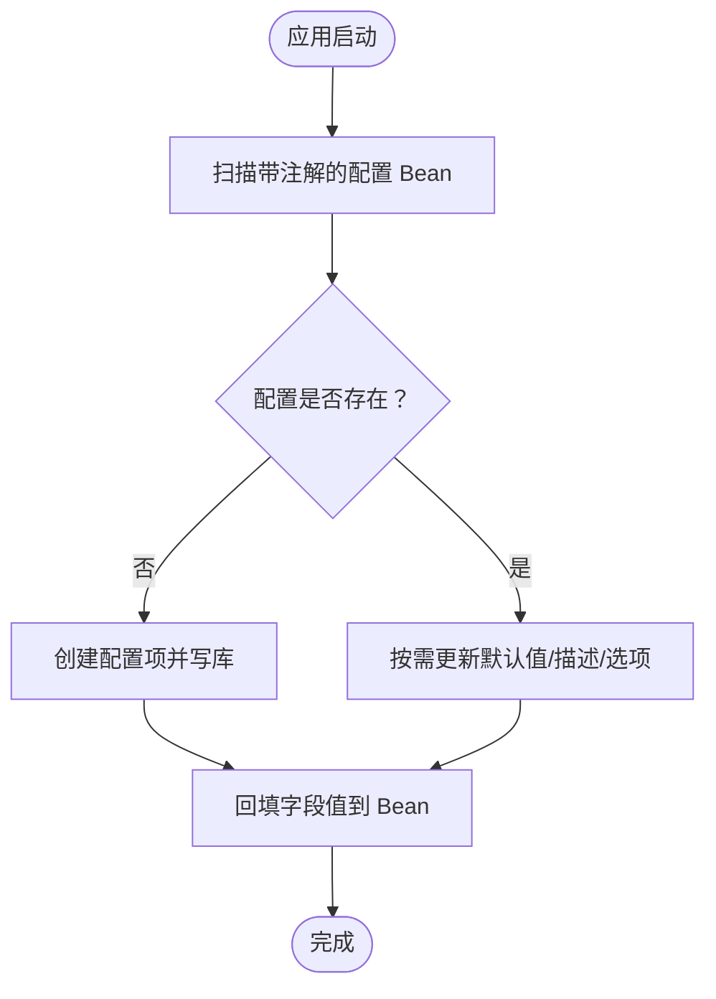
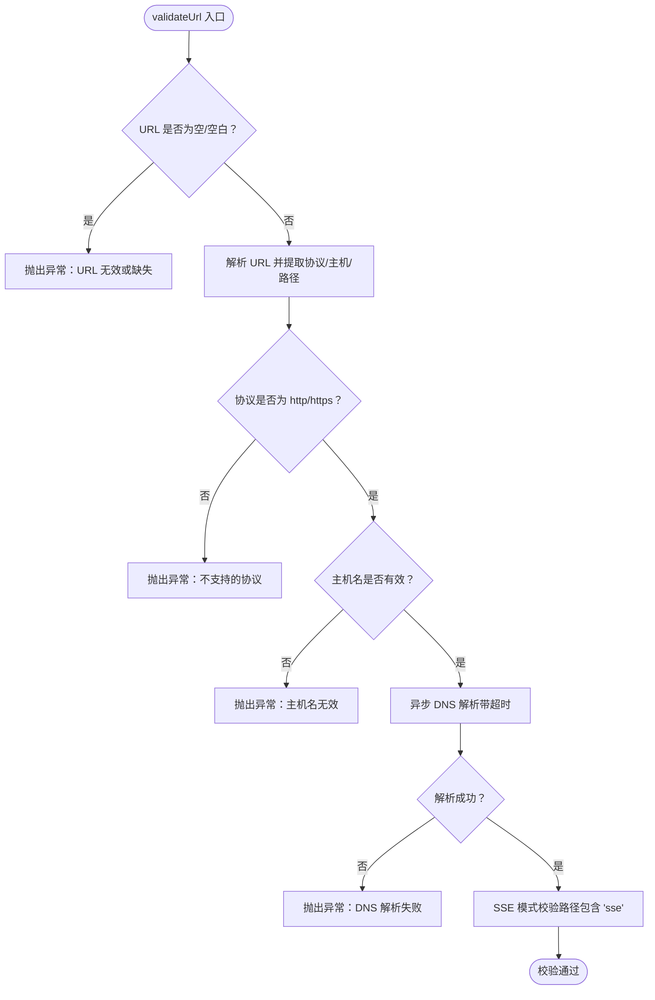
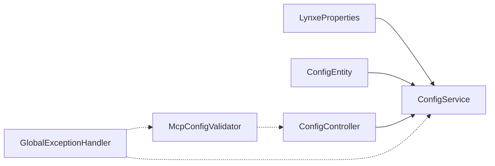

# 配置验证机制

<cite>
**本文引用的文件**
- [McpConfigValidator.java](file://src/main/java/com/alibaba/cloud/ai/lynxe/mcp/service/McpConfigValidator.java)
- [McpConfigValidatorTest.java](file://src/test/java/com/alibaba/cloud/ai/lynxe/mcp/service/McpConfigValidatorTest.java)
- [ConfigService.java](file://src/main/java/com/alibaba/cloud/ai/lynxe/config/ConfigService.java)
- [ConfigEntity.java](file://src/main/java/com/alibaba/cloud/ai/lynxe/config/entity/ConfigEntity.java)
- [ConfigProperty.java](file://src/main/java/com/alibaba/cloud/ai/lynxe/config/ConfigProperty.java)
- [ConfigInputType.java](file://src/main/java/com/alibaba/cloud/ai/lynxe/config/entity/ConfigInputType.java)
- [LynxeProperties.java](file://src/main/java/com/alibaba/cloud/ai/lynxe/config/LynxeProperties.java)
- [ConfigController.java](file://src/main/java/com/alibaba/cloud/ai/lynxe/config/ConfigController.java)
- [GlobalExceptionHandler.java](file://src/main/java/com/alibaba/cloud/ai/lynxe/exception/handler/GlobalExceptionHandler.java)
</cite>

## 目录
1. [引言](#引言)
2. [项目结构](#项目结构)
3. [核心组件](#核心组件)
4. [架构总览](#架构总览)
5. [详细组件分析](#详细组件分析)
6. [依赖分析](#依赖分析)
7. [性能考虑](#性能考虑)
8. [故障排查指南](#故障排查指南)
9. [结论](#结论)
10. [附录](#附录)

## 引言
本文件系统化梳理 Lynxe 的“配置验证机制”，围绕配置验证的架构设计、验证流程与类型体系（语法验证、语义验证、依赖验证、兼容性验证）进行深入解析，并阐述验证器的实现模式、扩展机制与自定义规则能力；同时覆盖错误处理、错误报告与修复建议机制，以及性能优化、批量验证与异步验证策略。最后提供使用示例与集成指南，说明配置验证在配置管理流程中的作用及与各组件的协作关系。

## 项目结构
Lynxe 的配置验证涉及两类场景：
- MCP 服务配置验证：对服务器名称、连接类型、命令/URL、参数、DNS 可达性等进行校验。
- 应用配置验证：基于注解驱动的配置项声明、默认值、输入类型与可选项，配合数据库持久化与运行时转换，形成统一的配置管理与验证入口。

```mermaid
graph TB
subgraph "配置管理"
A["LynxeProperties<br/>配置声明与默认值"] --> B["ConfigService<br/>初始化/更新/批量更新"]
C["ConfigEntity<br/>配置持久化模型"] <- --> B
D["ConfigController<br/>HTTP 接口"] --> B
end
subgraph "MCP 配置验证"
E["McpConfigValidator<br/>MCP 配置验证器"] --> F["McpConfigValidatorTest<br/>单元测试"]
end
G["GlobalExceptionHandler<br/>全局异常处理"] -.-> B
G -.-> E
```

图表来源
- [ConfigService.java:41-320](file://src/main/java/com/alibaba/cloud/ai/lynxe/config/ConfigService.java#L41-L320)
- [LynxeProperties.java:26-654](file://src/main/java/com/alibaba/cloud/ai/lynxe/config/LynxeProperties.java#L26-L654)
- [ConfigEntity.java:33-218](file://src/main/java/com/alibaba/cloud/ai/lynxe/config/entity/ConfigEntity.java#L33-L218)
- [ConfigController.java:36-82](file://src/main/java/com/alibaba/cloud/ai/lynxe/config/ConfigController.java#L36-L82)
- [McpConfigValidator.java:40-391](file://src/main/java/com/alibaba/cloud/ai/lynxe/mcp/service/McpConfigValidator.java#L40-L391)
- [McpConfigValidatorTest.java:35-95](file://src/test/java/com/alibaba/cloud/ai/lynxe/mcp/service/McpConfigValidatorTest.java#L35-L95)
- [GlobalExceptionHandler.java:32-69](file://src/main/java/com/alibaba/cloud/ai/lynxe/exception/handler/GlobalExceptionHandler.java#L32-L69)

章节来源
- [ConfigService.java:41-320](file://src/main/java/com/alibaba/cloud/ai/lynxe/config/ConfigService.java#L41-L320)
- [LynxeProperties.java:26-654](file://src/main/java/com/alibaba/cloud/ai/lynxe/config/LynxeProperties.java#L26-L654)
- [ConfigEntity.java:33-218](file://src/main/java/com/alibaba/cloud/ai/lynxe/config/entity/ConfigEntity.java#L33-L218)
- [ConfigController.java:36-82](file://src/main/java/com/alibaba/cloud/ai/lynxe/config/ConfigController.java#L36-L82)
- [McpConfigValidator.java:40-391](file://src/main/java/com/alibaba/cloud/ai/lynxe/mcp/service/McpConfigValidator.java#L40-L391)
- [McpConfigValidatorTest.java:35-95](file://src/test/java/com/alibaba/cloud/ai/lynxe/mcp/service/McpConfigValidatorTest.java#L35-L95)
- [GlobalExceptionHandler.java:32-69](file://src/main/java/com/alibaba/cloud/ai/lynxe/exception/handler/GlobalExceptionHandler.java#L32-L69)

## 核心组件
- 配置声明与默认值：通过注解在属性类中声明配置项，包括分组、子组、键、路径、描述、默认值、输入类型与可选项。
- 配置服务：负责扫描带注解的配置 Bean，初始化缺失配置、清理过期配置、支持单个与批量更新、缓存与类型转换。
- 配置实体：持久化配置项的元数据与取值。
- 控制器：对外暴露配置查询、批量更新、重置默认值等接口。
- MCP 配置验证器：对 MCP 服务器配置进行语法与可达性校验，包含命令/URL、参数、DNS 解析等。
- 全局异常处理器：统一捕获异常并返回标准化响应。

章节来源
- [ConfigProperty.java:26-89](file://src/main/java/com/alibaba/cloud/ai/lynxe/config/ConfigProperty.java#L26-L89)
- [LynxeProperties.java:26-654](file://src/main/java/com/alibaba/cloud/ai/lynxe/config/LynxeProperties.java#L26-L654)
- [ConfigService.java:41-320](file://src/main/java/com/alibaba/cloud/ai/lynxe/config/ConfigService.java#L41-L320)
- [ConfigEntity.java:33-218](file://src/main/java/com/alibaba/cloud/ai/lynxe/config/entity/ConfigEntity.java#L33-L218)
- [ConfigController.java:36-82](file://src/main/java/com/alibaba/cloud/ai/lynxe/config/ConfigController.java#L36-L82)
- [McpConfigValidator.java:40-391](file://src/main/java/com/alibaba/cloud/ai/lynxe/mcp/service/McpConfigValidator.java#L40-L391)
- [GlobalExceptionHandler.java:32-69](file://src/main/java/com/alibaba/cloud/ai/lynxe/exception/handler/GlobalExceptionHandler.java#L32-L69)

## 架构总览
配置验证贯穿“声明—持久化—加载—运行时转换—对外接口—异常处理”的全链路。MCP 验证器作为独立组件，与配置服务协同工作，确保配置在入库与运行前满足格式与可达性要求。



图表来源
- [ConfigController.java:51-55](file://src/main/java/com/alibaba/cloud/ai/lynxe/config/ConfigController.java#L51-L55)
- [ConfigService.java:280-296](file://src/main/java/com/alibaba/cloud/ai/lynxe/config/ConfigService.java#L280-L296)
- [McpConfigValidator.java:271-323](file://src/main/java/com/alibaba/cloud/ai/lynxe/mcp/service/McpConfigValidator.java#L271-L323)

章节来源
- [ConfigController.java:36-82](file://src/main/java/com/alibaba/cloud/ai/lynxe/config/ConfigController.java#L36-L82)
- [ConfigService.java:280-296](file://src/main/java/com/alibaba/cloud/ai/lynxe/config/ConfigService.java#L280-L296)
- [McpConfigValidator.java:271-323](file://src/main/java/com/alibaba/cloud/ai/lynxe/mcp/service/McpConfigValidator.java#L271-L323)

## 详细组件分析

### 配置声明与类型体系
- 声明注解：通过分层注解定义配置的三段式路径（group.subGroup.key），并提供默认值、描述、输入类型与可选项。
- 输入类型：文本、下拉框、多选、布尔、数值等，用于前端渲染与后端校验约束。
- 默认值与国际化：注解中提供默认值与描述键，运行时由服务从环境变量或数据库读取并注入。



图表来源
- [LynxeProperties.java:26-654](file://src/main/java/com/alibaba/cloud/ai/lynxe/config/LynxeProperties.java#L26-L654)
- [ConfigProperty.java:26-89](file://src/main/java/com/alibaba/cloud/ai/lynxe/config/ConfigProperty.java#L26-L89)
- [ConfigInputType.java:18-46](file://src/main/java/com/alibaba/cloud/ai/lynxe/config/entity/ConfigInputType.java#L18-L46)

章节来源
- [ConfigProperty.java:26-89](file://src/main/java/com/alibaba/cloud/ai/lynxe/config/ConfigProperty.java#L26-L89)
- [ConfigInputType.java:18-46](file://src/main/java/com/alibaba/cloud/ai/lynxe/config/entity/ConfigInputType.java#L18-L46)
- [LynxeProperties.java:26-654](file://src/main/java/com/alibaba/cloud/ai/lynxe/config/LynxeProperties.java#L26-L654)

### 配置持久化与加载
- 初始化：应用启动时扫描带注解的 Bean，生成或更新配置项，写入数据库并回填到 Bean 字段。
- 更新与批量更新：支持单字段更新与批量更新，更新后同步刷新所有使用该配置的 Bean。
- 缓存：提供轻量级内存缓存，避免频繁访问数据库。
- 类型转换：根据目标字段类型进行字符串到目标类型的转换，保证运行时一致性。



图表来源
- [ConfigService.java:67-163](file://src/main/java/com/alibaba/cloud/ai/lynxe/config/ConfigService.java#L67-L163)

章节来源
- [ConfigService.java:41-320](file://src/main/java/com/alibaba/cloud/ai/lynxe/config/ConfigService.java#L41-L320)
- [ConfigEntity.java:33-218](file://src/main/java/com/alibaba/cloud/ai/lynxe/config/entity/ConfigEntity.java#L33-L218)

### MCP 配置验证器
- 能力范围：校验服务器名称、连接类型、连接配置、命令/URL、参数、SSE 路径、DNS 可达性等。
- 实现要点：
  - 语法验证：URL 协议、主机名、路径包含“sse”等。
  - 语义验证：命令是否为可执行、参数列表是否为空元素、绝对路径识别。
  - 依赖验证：DNS 解析前置校验，超时控制。
  - 兼容性验证：仅允许 http/https 协议；对常见包管理器、解释器、脚本解释器进行白名单匹配。
- 错误处理：统一抛出 IO 异常，便于上层捕获与反馈。



图表来源
- [McpConfigValidator.java:271-323](file://src/main/java/com/alibaba/cloud/ai/lynxe/mcp/service/McpConfigValidator.java#L271-L323)
- [McpConfigValidator.java:364-388](file://src/main/java/com/alibaba/cloud/ai/lynxe/mcp/service/McpConfigValidator.java#L364-L388)

章节来源
- [McpConfigValidator.java:48-391](file://src/main/java/com/alibaba/cloud/ai/lynxe/mcp/service/McpConfigValidator.java#L48-L391)
- [McpConfigValidatorTest.java:35-95](file://src/test/java/com/alibaba/cloud/ai/lynxe/mcp/service/McpConfigValidatorTest.java#L35-L95)

### 配置验证类型体系
- 语法验证：检查必填字段、格式合法性（如 URL）、协议限制、路径片段（SSE）。
- 语义验证：命令可执行性判断、参数列表完整性、路径绝对/相对识别。
- 依赖验证：DNS 解析前置校验，避免运行时连接失败。
- 兼容性验证：仅允许受支持的协议与命令集合，确保跨平台兼容。

章节来源
- [McpConfigValidator.java:48-391](file://src/main/java/com/alibaba/cloud/ai/lynxe/mcp/service/McpConfigValidator.java#L48-L391)

### 验证器实现模式与扩展机制
- 组件化：验证器以 Spring 组件形式存在，可被其他服务直接注入使用。
- 策略分离：不同验证维度（URL、命令、参数、DNS）拆分为独立方法，便于扩展与复用。
- 自定义规则：可通过新增方法扩展新规则；若需跨模块复用，可抽象为接口或模板方法模式。
- 测试先行：配套单元测试覆盖关键分支，保障变更稳定性。

章节来源
- [McpConfigValidator.java:40-391](file://src/main/java/com/alibaba/cloud/ai/lynxe/mcp/service/McpConfigValidator.java#L40-L391)
- [McpConfigValidatorTest.java:35-95](file://src/test/java/com/alibaba/cloud/ai/lynxe/mcp/service/McpConfigValidatorTest.java#L35-L95)

### 错误处理、错误报告与修复建议
- 统一异常：验证失败抛出 IO 异常，便于上层捕获。
- 全局处理：全局异常处理器将异常映射为标准化响应体，包含错误信息与状态码。
- 修复建议：DNS 失败时提示核对主机名与网络连通性；URL 不合法时提示修正格式；协议不受支持时提示改用 http/https。

章节来源
- [McpConfigValidator.java:294-296](file://src/main/java/com/alibaba/cloud/ai/lynxe/mcp/service/McpConfigValidator.java#L294-L296)
- [McpConfigValidator.java:381-387](file://src/main/java/com/alibaba/cloud/ai/lynxe/mcp/service/McpConfigValidator.java#L381-L387)
- [GlobalExceptionHandler.java:32-69](file://src/main/java/com/alibaba/cloud/ai/lynxe/exception/handler/GlobalExceptionHandler.java#L32-L69)

### 性能优化、批量验证与异步验证策略
- 批量更新：ConfigService 支持批量更新配置项，减少多次事务开销。
- 缓存：配置读取带本地缓存，降低数据库压力。
- 异步 DNS：验证器内部使用异步任务与超时控制，避免阻塞主线程。
- 建议：对大规模配置导入可采用分批提交与幂等更新；对高频校验可引入本地缓存与预热。

章节来源
- [ConfigService.java:280-296](file://src/main/java/com/alibaba/cloud/ai/lynxe/config/ConfigService.java#L280-L296)
- [ConfigService.java:165-180](file://src/main/java/com/alibaba/cloud/ai/lynxe/config/ConfigService.java#L165-L180)
- [McpConfigValidator.java:364-388](file://src/main/java/com/alibaba/cloud/ai/lynxe/mcp/service/McpConfigValidator.java#L364-L388)

### 使用示例与集成指南
- 配置声明：在属性类中使用注解声明配置项，设置默认值与输入类型。
- 初始化与更新：应用启动自动初始化；通过控制器进行批量更新与重置默认值。
- MCP 验证：在保存或启用 MCP 服务器配置前调用验证器方法，确保 URL/命令/参数/DNS 合法。
- 错误处理：捕获 IO 异常并结合全局异常处理器返回用户可读的错误信息。

章节来源
- [LynxeProperties.java:26-654](file://src/main/java/com/alibaba/cloud/ai/lynxe/config/LynxeProperties.java#L26-L654)
- [ConfigController.java:51-61](file://src/main/java/com/alibaba/cloud/ai/lynxe/config/ConfigController.java#L51-L61)
- [McpConfigValidator.java:53-107](file://src/main/java/com/alibaba/cloud/ai/lynxe/mcp/service/McpConfigValidator.java#L53-L107)

## 依赖分析
- 配置服务依赖于配置实体与仓库，通过注解扫描与类型转换实现配置生命周期管理。
- 控制器依赖配置服务提供对外接口。
- MCP 验证器独立运行，但与控制器/服务在业务流程中协作。
- 全局异常处理器为配置与验证过程提供统一错误出口。



图表来源
- [ConfigService.java:41-320](file://src/main/java/com/alibaba/cloud/ai/lynxe/config/ConfigService.java#L41-L320)
- [ConfigController.java:36-82](file://src/main/java/com/alibaba/cloud/ai/lynxe/config/ConfigController.java#L36-L82)
- [McpConfigValidator.java:40-391](file://src/main/java/com/alibaba/cloud/ai/lynxe/mcp/service/McpConfigValidator.java#L40-L391)
- [GlobalExceptionHandler.java:32-69](file://src/main/java/com/alibaba/cloud/ai/lynxe/exception/handler/GlobalExceptionHandler.java#L32-L69)

章节来源
- [ConfigService.java:41-320](file://src/main/java/com/alibaba/cloud/ai/lynxe/config/ConfigService.java#L41-L320)
- [ConfigController.java:36-82](file://src/main/java/com/alibaba/cloud/ai/lynxe/config/ConfigController.java#L36-L82)
- [McpConfigValidator.java:40-391](file://src/main/java/com/alibaba/cloud/ai/lynxe/mcp/service/McpConfigValidator.java#L40-L391)
- [GlobalExceptionHandler.java:32-69](file://src/main/java/com/alibaba/cloud/ai/lynxe/exception/handler/GlobalExceptionHandler.java#L32-L69)

## 性能考虑
- 批量操作：优先使用批量更新接口，减少事务次数与数据库往返。
- 缓存命中：合理利用配置读取缓存，避免热点配置重复查询。
- 异步校验：对 DNS 解析等外部依赖采用异步与超时控制，防止阻塞。
- 数据库索引：确保配置路径唯一索引与常用查询列索引，提升初始化与查询效率。

## 故障排查指南
- URL 校验失败：检查协议是否为 http/https，主机名是否可解析；参考 DNS 失败日志定位网络问题。
- 命令/参数非法：确认命令为可执行或绝对路径，参数列表不允许空元素。
- 配置未生效：检查配置路径是否正确、是否被清理或重置；确认缓存是否已刷新。
- 接口异常：查看全局异常处理器返回的错误信息，结合日志定位具体异常类型。

章节来源
- [McpConfigValidator.java:271-323](file://src/main/java/com/alibaba/cloud/ai/lynxe/mcp/service/McpConfigValidator.java#L271-L323)
- [McpConfigValidatorTest.java:48-92](file://src/test/java/com/alibaba/cloud/ai/lynxe/mcp/service/McpConfigValidatorTest.java#L48-L92)
- [GlobalExceptionHandler.java:32-69](file://src/main/java/com/alibaba/cloud/ai/lynxe/exception/handler/GlobalExceptionHandler.java#L32-L69)

## 结论
Lynxe 的配置验证机制以注解驱动的声明与服务化的配置管理为核心，辅以独立的 MCP 验证器实现对关键配置的语法、语义、依赖与兼容性校验。通过批量更新、缓存与异步校验等手段，兼顾易用性与性能。建议在实际落地中完善自定义规则扩展点与更细粒度的错误分类，持续优化用户体验与系统稳定性。

## 附录
- 关键接口与职责
  - 配置声明：ConfigProperty 注解与 LynxeProperties 属性类
  - 配置管理：ConfigService 初始化/更新/批量更新/缓存
  - 配置持久化：ConfigEntity 实体模型
  - 对外接口：ConfigController 批量更新/重置默认值
  - MCP 验证：McpConfigValidator URL/命令/参数/DNS 校验
  - 异常处理：GlobalExceptionHandler 统一错误输出

章节来源
- [ConfigProperty.java:26-89](file://src/main/java/com/alibaba/cloud/ai/lynxe/config/ConfigProperty.java#L26-L89)
- [LynxeProperties.java:26-654](file://src/main/java/com/alibaba/cloud/ai/lynxe/config/LynxeProperties.java#L26-L654)
- [ConfigService.java:41-320](file://src/main/java/com/alibaba/cloud/ai/lynxe/config/ConfigService.java#L41-L320)
- [ConfigEntity.java:33-218](file://src/main/java/com/alibaba/cloud/ai/lynxe/config/entity/ConfigEntity.java#L33-L218)
- [ConfigController.java:36-82](file://src/main/java/com/alibaba/cloud/ai/lynxe/config/ConfigController.java#L36-L82)
- [McpConfigValidator.java:40-391](file://src/main/java/com/alibaba/cloud/ai/lynxe/mcp/service/McpConfigValidator.java#L40-L391)
- [GlobalExceptionHandler.java:32-69](file://src/main/java/com/alibaba/cloud/ai/lynxe/exception/handler/GlobalExceptionHandler.java#L32-L69)