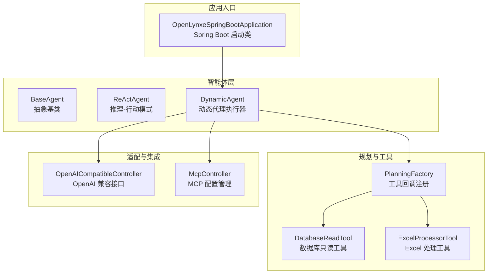
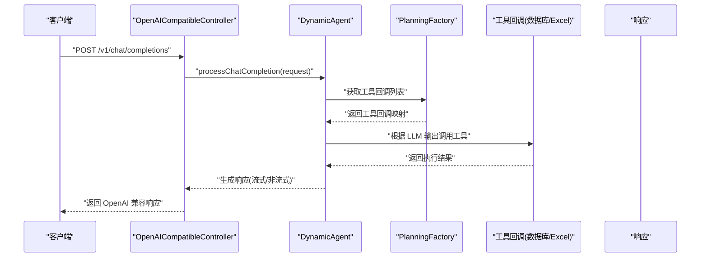
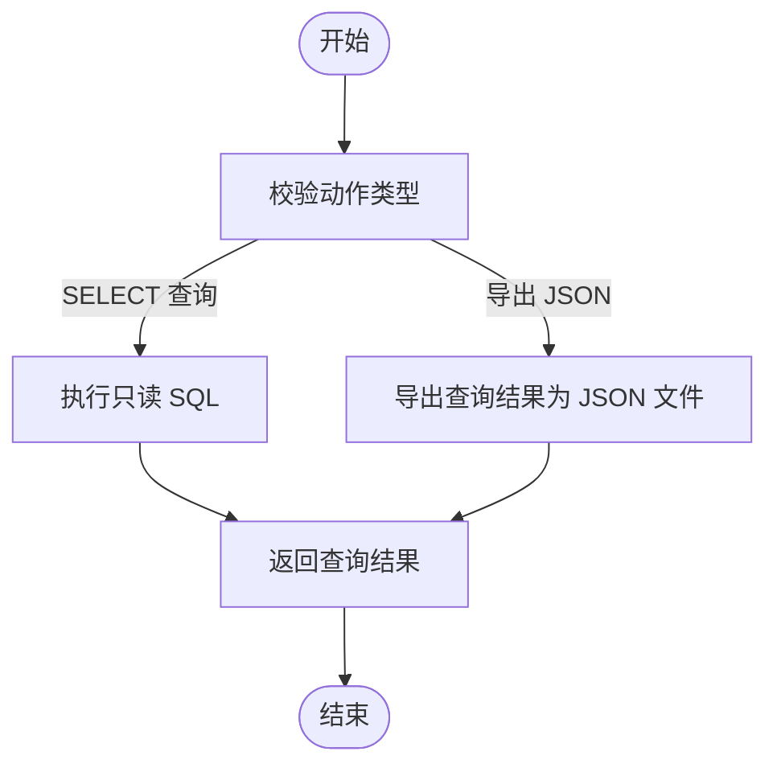
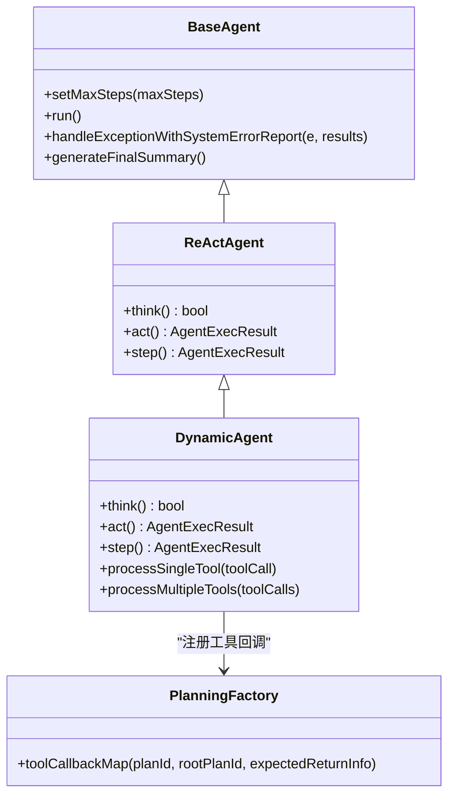
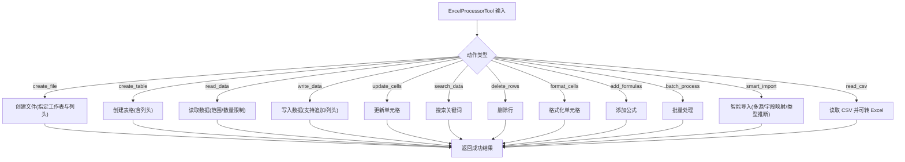
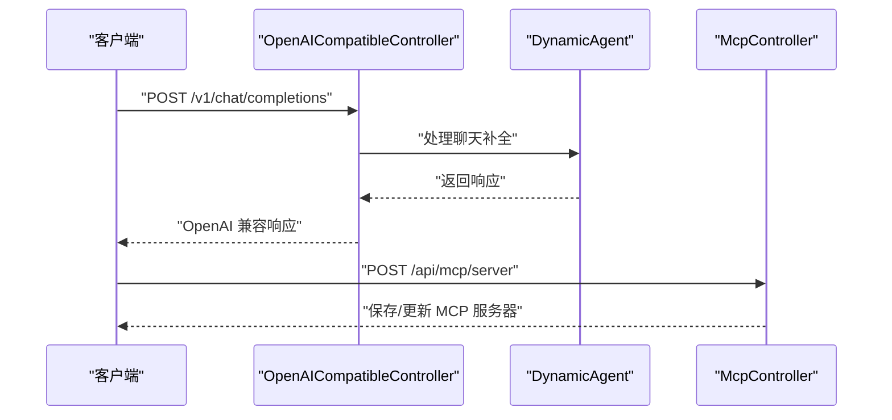
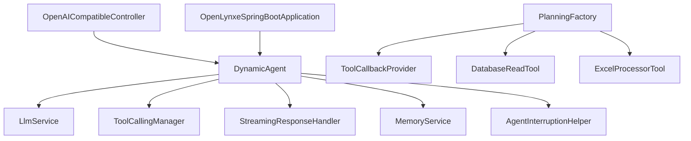

# 应用场景

<cite>
**本文引用的文件**
- [README.md](file://README.md)
- [README-zh.md](file://README-zh.md)
- [OpenLynxeSpringBootApplication.java](file://src/main/java/com/alibaba/cloud/ai/lynxe/OpenLynxeSpringBootApplication.java)
- [BaseAgent.java](file://src/main/java/com/alibaba/cloud/ai/lynxe/agent/BaseAgent.java)
- [ReActAgent.java](file://src/main/java/com/alibaba/cloud/ai/lynxe/agent/ReActAgent.java)
- [DynamicAgent.java](file://src/main/java/com/alibaba/cloud/ai/lynxe/agent/DynamicAgent.java)
- [PlanningFactory.java](file://src/main/java/com/alibaba/cloud/ai/lynxe/planning/PlanningFactory.java)
- [DatabaseReadTool.java](file://src/main/java/com/alibaba/cloud/ai/lynxe/tool/database/DatabaseReadTool.java)
- [ExcelProcessorTool.java](file://src/main/java/com/alibaba/cloud/ai/lynxe/tool/excelProcessor/ExcelProcessorTool.java)
- [OpenAICompatibleController.java](file://src/main/java/com/alibaba/cloud/ai/lynxe/adapter/controller/OpenAICompatibleController.java)
- [McpController.java](file://src/main/java/com/alibaba/cloud/ai/lynxe/mcp/controller/McpController.java)
</cite>

## 目录
1. [简介](#简介)
2. [项目结构](#项目结构)
3. [核心组件](#核心组件)
4. [架构总览](#架构总览)
5. [详细组件分析](#详细组件分析)
6. [依赖关系分析](#依赖关系分析)
7. [性能考量](#性能考量)
8. [故障排查指南](#故障排查指南)
9. [结论](#结论)
10. [附录](#附录)

## 简介
Lynxe 是阿里巴巴内部广泛使用的 Java 实现的 Manus 多智能体系统，专注于“探索性任务”的确定性执行，例如从海量数据中检索并转换为数据库记录、日志分析与告警、以及复杂重复流程的自动化。它提供 HTTP 服务调用能力，便于集成到现有项目；同时支持 Func-Agent 模式，允许对每一步执行细节进行精确控制，满足高确定性的业务需求。

- 探索性任务能力：大规模数据查询、日志分析与告警
- Func-Agent 模式：复杂重复流程与函数式代理的确定性执行
- HTTP 服务：OpenAI 兼容接口与 MCP 协议集成，便于二次集成
- 工具生态：数据库读写、Excel 处理、文件系统操作、并行执行等

章节来源
- [README.md:22-29](file://README.md#L22-L29)
- [README-zh.md:18-26](file://README-zh.md#L18-L26)

## 项目结构
Lynxe 采用分层与模块化的组织方式，核心模块包括：
- agent：智能体基类与 ReAct/DynamicAgent 实现
- planning：规划工厂与工具回调注册
- tool：数据库、Excel、文件系统、并行执行等工具集合
- adapter：OpenAI 兼容接口适配器
- mcp：MCP 协议控制器与服务
- runtime/cron/namespace/model 等：运行时调度、命名空间、模型管理等支撑模块

下面给出一个概念性项目结构图，展示主要模块之间的关系：

图表来源
- [OpenLynxeSpringBootApplication.java:29-45](file://src/main/java/com/alibaba/cloud/ai/lynxe/OpenLynxeSpringBootApplication.java#L29-L45)
- [BaseAgent.java:70-135](file://src/main/java/com/alibaba/cloud/ai/lynxe/agent/BaseAgent.java#L70-L135)
- [ReActAgent.java:26-96](file://src/main/java/com/alibaba/cloud/ai/lynxe/agent/ReActAgent.java#L26-L96)
- [DynamicAgent.java:83-201](file://src/main/java/com/alibaba/cloud/ai/lynxe/agent/DynamicAgent.java#L83-L201)
- [PlanningFactory.java:112-393](file://src/main/java/com/alibaba/cloud/ai/lynxe/planning/PlanningFactory.java#L112-L393)
- [DatabaseReadTool.java:34-84](file://src/main/java/com/alibaba/cloud/ai/lynxe/tool/database/DatabaseReadTool.java#L34-L84)
- [ExcelProcessorTool.java:34-57](file://src/main/java/com/alibaba/cloud/ai/lynxe/tool/excelProcessor/ExcelProcessorTool.java#L34-L57)
- [OpenAICompatibleController.java:50-116](file://src/main/java/com/alibaba/cloud/ai/lynxe/adapter/controller/OpenAICompatibleController.java#L50-L116)
- [McpController.java:38-195](file://src/main/java/com/alibaba/cloud/ai/lynxe/mcp/controller/McpController.java#L38-L195)

章节来源
- [OpenLynxeSpringBootApplication.java:29-45](file://src/main/java/com/alibaba/cloud/ai/lynxe/OpenLynxeSpringBootApplication.java#L29-L45)

## 核心组件
- BaseAgent：抽象智能体基类，提供状态管理、步数限制、异常处理、终止逻辑与执行记录等通用能力
- ReActAgent：实现“推理-行动”交替的智能体模式
- DynamicAgent：基于 LLM 的动态代理，具备重试机制、流式响应处理、工具回调、内存压缩与中断检测等高级特性
- PlanningFactory：集中注册工具回调，构建工具清单并支持子计划工具与 MCP 工具注入
- DatabaseReadTool：数据库只读操作封装，支持 SQL 查询、表名获取、导出为 JSON 文件等
- ExcelProcessorTool：面向大体量数据的 Excel 处理工具，支持结构创建、读写、搜索、格式化、批量处理、智能导入、CSV 读取等
- OpenAICompatibleController：提供 OpenAI 兼容的聊天补全与模型列表接口，支持流式与非流式响应
- McpController：MCP 服务器配置的增删改查与启停管理

章节来源
- [BaseAgent.java:70-357](file://src/main/java/com/alibaba/cloud/ai/lynxe/agent/BaseAgent.java#L70-L357)
- [ReActAgent.java:26-96](file://src/main/java/com/alibaba/cloud/ai/lynxe/agent/ReActAgent.java#L26-L96)
- [DynamicAgent.java:83-581](file://src/main/java/com/alibaba/cloud/ai/lynxe/agent/DynamicAgent.java#L83-L581)
- [PlanningFactory.java:234-393](file://src/main/java/com/alibaba/cloud/ai/lynxe/planning/PlanningFactory.java#L234-L393)
- [DatabaseReadTool.java:34-165](file://src/main/java/com/alibaba/cloud/ai/lynxe/tool/database/DatabaseReadTool.java#L34-L165)
- [ExcelProcessorTool.java:34-506](file://src/main/java/com/alibaba/cloud/ai/lynxe/tool/excelProcessor/ExcelProcessorTool.java#L34-L506)
- [OpenAICompatibleController.java:50-298](file://src/main/java/com/alibaba/cloud/ai/lynxe/adapter/controller/OpenAICompatibleController.java#L50-L298)
- [McpController.java:38-195](file://src/main/java/com/alibaba/cloud/ai/lynxe/mcp/controller/McpController.java#L38-L195)

## 架构总览
下图展示了 Lynxe 的关键交互路径：客户端通过 OpenAI 兼容接口发起请求，DynamicAgent 负责思考与行动，PlanningFactory 注册工具回调，工具执行后返回结果，最终通过适配器返回给客户端；同时支持 MCP 服务器的外部工具注入。

图表来源
- [OpenAICompatibleController.java:85-116](file://src/main/java/com/alibaba/cloud/ai/lynxe/adapter/controller/OpenAICompatibleController.java#L85-L116)
- [DynamicAgent.java:521-563](file://src/main/java/com/alibaba/cloud/ai/lynxe/agent/DynamicAgent.java#L521-L563)
- [PlanningFactory.java:261-393](file://src/main/java/com/alibaba/cloud/ai/lynxe/planning/PlanningFactory.java#L261-L393)

## 详细组件分析

### 探索性任务处理能力（大规模数据查询、日志分析与告警）
- 大规模数据查询：通过 DatabaseReadTool 的只读模式，限制仅允许 SELECT 查询，并支持将查询结果导出为 JSON 文件，便于后续分析与入库
- 日志分析与告警：结合文件系统工具与并行执行能力，可对日志进行分片、搜索、聚合与格式化，再通过告警工具或终止工具输出结论
- 确定性执行：DynamicAgent 的重试机制、流式响应处理、内存压缩与中断检测，确保在复杂任务中稳定推进

图表来源
- [DatabaseReadTool.java:87-120](file://src/main/java/com/alibaba/cloud/ai/lynxe/tool/database/DatabaseReadTool.java#L87-L120)

章节来源
- [DatabaseReadTool.java:87-120](file://src/main/java/com/alibaba/cloud/ai/lynxe/tool/database/DatabaseReadTool.java#L87-L120)
- [DynamicAgent.java:235-495](file://src/main/java/com/alibaba/cloud/ai/lynxe/agent/DynamicAgent.java#L235-L495)

### Func-Agent 模式在复杂重复流程中的应用
- 精确控制每一步执行细节：BaseAgent 提供最大步数限制、异常包装与最终总结，确保复杂流程可控
- 动态代理执行：DynamicAgent 在每次思考后根据 LLM 的工具调用决策执行相应动作，支持单工具与多工具并行执行
- 工具回调注册：PlanningFactory 将内置工具与 MCP 工具统一注册为 FunctionToolCallback，按服务组与工具名进行调用

图表来源
- [BaseAgent.java:70-357](file://src/main/java/com/alibaba/cloud/ai/lynxe/agent/BaseAgent.java#L70-L357)
- [ReActAgent.java:26-96](file://src/main/java/com/alibaba/cloud/ai/lynxe/agent/ReActAgent.java#L26-L96)
- [DynamicAgent.java:83-581](file://src/main/java/com/alibaba/cloud/ai/lynxe/agent/DynamicAgent.java#L83-L581)
- [PlanningFactory.java:261-393](file://src/main/java/com/alibaba/cloud/ai/lynxe/planning/PlanningFactory.java#L261-L393)

章节来源
- [BaseAgent.java:281-357](file://src/main/java/com/alibaba/cloud/ai/lynxe/agent/BaseAgent.java#L281-L357)
- [DynamicAgent.java:521-658](file://src/main/java/com/alibaba/cloud/ai/lynxe/agent/DynamicAgent.java#L521-L658)
- [PlanningFactory.java:340-393](file://src/main/java/com/alibaba/cloud/ai/lynxe/planning/PlanningFactory.java#L340-L393)

### 数据转换与报表生成的实际业务场景
- Excel 处理：ExcelProcessorTool 支持创建文件/表格、读取数据、写入数据、更新单元格、搜索、删除行、格式化、添加公式、批量处理、智能导入、CSV 读取、并行批处理、数据变换聚合、流式处理、清洗验证与导出等
- 报表生成：可将查询结果写入 Excel 表格，配合格式化与公式生成报表；或通过智能导入将多源数据整合后生成统一报表

图表来源
- [ExcelProcessorTool.java:431-506](file://src/main/java/com/alibaba/cloud/ai/lynxe/tool/excelProcessor/ExcelProcessorTool.java#L431-L506)

章节来源
- [ExcelProcessorTool.java:431-506](file://src/main/java/com/alibaba/cloud/ai/lynxe/tool/excelProcessor/ExcelProcessorTool.java#L431-L506)

### HTTP 服务调用能力与集成
- OpenAI 兼容接口：提供 /v1/chat/completions 与 /v1/models，支持流式与非流式响应，便于与 Cherry Studio 等前端工具对接
- MCP 集成：通过 /api/mcp/list、/api/mcp/server、/api/mcp/remove、/api/mcp/enable/{id}、/api/mcp/disable/{id} 等端点管理 MCP 服务器配置，实现外部工具的无缝接入

图表来源
- [OpenAICompatibleController.java:85-116](file://src/main/java/com/alibaba/cloud/ai/lynxe/adapter/controller/OpenAICompatibleController.java#L85-L116)
- [McpController.java:85-122](file://src/main/java/com/alibaba/cloud/ai/lynxe/mcp/controller/McpController.java#L85-L122)

章节来源
- [OpenAICompatibleController.java:85-298](file://src/main/java/com/alibaba/cloud/ai/lynxe/adapter/controller/OpenAICompatibleController.java#L85-L298)
- [McpController.java:54-195](file://src/main/java/com/alibaba/cloud/ai/lynxe/mcp/controller/McpController.java#L54-L195)

### 使用案例与最佳实践
- 快速开始与部署
  - 使用 GitHub Release 的 JAR 包或 Docker 镜像快速启动
  - 引导式配置 DashScope API Key 与数据库配置（H2/MySQL/PostgreSQL）
- API 调用示例（路径参考）
  - 流式聊天补全：[OpenAICompatibleController.java:85-116](file://src/main/java/com/alibaba/cloud/ai/lynxe/adapter/controller/OpenAICompatibleController.java#L85-L116)
  - 非流式聊天补全：[OpenAICompatibleController.java:246-261](file://src/main/java/com/alibaba/cloud/ai/lynxe/adapter/controller/OpenAICompatibleController.java#L246-L261)
  - 模型列表：[OpenAICompatibleController.java:276-288](file://src/main/java/com/alibaba/cloud/ai/lynxe/adapter/controller/OpenAICompatibleController.java#L276-L288)
  - 健康检查：[OpenAICompatibleController.java:293-298](file://src/main/java/com/alibaba/cloud/ai/lynxe/adapter/controller/OpenAICompatibleController.java#L293-L298)
- MCP 配置管理（路径参考）
  - 列表：[McpController.java:54-59](file://src/main/java/com/alibaba/cloud/ai/lynxe/mcp/controller/McpController.java#L54-L59)
  - 新增/更新：[McpController.java:85-93](file://src/main/java/com/alibaba/cloud/ai/lynxe/mcp/controller/McpController.java#L85-L93)
  - 删除：[McpController.java:128-132](file://src/main/java/com/alibaba/cloud/ai/lynxe/mcp/controller/McpController.java#L128-L132)
  - 启用/禁用：[McpController.java:147-167](file://src/main/java/com/alibaba/cloud/ai/lynxe/mcp/controller/McpController.java#L147-L167)
- 最佳实践
  - 对于高并发与长耗时任务，优先启用并行工具执行与流式响应
  - 使用工具回调注册与子计划工具，提升复杂流程的可维护性
  - 通过 MCP 集成第三方工具，扩展系统能力

章节来源
- [README.md:49-151](file://README.md#L49-L151)
- [README-zh.md:43-145](file://README-zh.md#L43-L145)
- [OpenAICompatibleController.java:85-298](file://src/main/java/com/alibaba/cloud/ai/lynxe/adapter/controller/OpenAICompatibleController.java#L85-L298)
- [McpController.java:54-195](file://src/main/java/com/alibaba/cloud/ai/lynxe/mcp/controller/McpController.java#L54-L195)

### 不同行业与规模企业的适用场景
- 金融风控：日志分析与告警、大规模交易数据查询与报表生成
- 电商运营：销售数据 Excel 导入与清洗、跨源数据智能合并、报表自动化
- IT 运维：系统日志分片与搜索、批量处理与格式化、告警与终止流程
- 中小企业：通过 Docker 快速部署，结合 OpenAI 兼容接口与 MCP 工具，低成本接入 LLM 能力

章节来源
- [README.md:22-29](file://README.md#L22-L29)
- [README-zh.md:18-26](file://README-zh.md#L18-L26)

## 依赖关系分析
- 组件耦合
  - DynamicAgent 依赖 LLM 服务、工具回调管理器、流式响应处理器、内存服务与中断辅助器
  - PlanningFactory 负责集中注册工具回调，向 DynamicAgent 提供可用工具清单
  - OpenAICompatibleController 作为适配层，将外部请求路由至 DynamicAgent
- 外部依赖
  - Playwright 初始化（启动参数）
  - Rest 客户端超时配置（10 分钟）

图表来源
- [DynamicAgent.java:170-201](file://src/main/java/com/alibaba/cloud/ai/lynxe/agent/DynamicAgent.java#L170-L201)
- [PlanningFactory.java:114-229](file://src/main/java/com/alibaba/cloud/ai/lynxe/planning/PlanningFactory.java#L114-L229)
- [OpenAICompatibleController.java:77-80](file://src/main/java/com/alibaba/cloud/ai/lynxe/adapter/controller/OpenAICompatibleController.java#L77-L80)
- [OpenLynxeSpringBootApplication.java:36-44](file://src/main/java/com/alibaba/cloud/ai/lynxe/OpenLynxeSpringBootApplication.java#L36-L44)

章节来源
- [DynamicAgent.java:170-201](file://src/main/java/com/alibaba/cloud/ai/lynxe/agent/DynamicAgent.java#L170-L201)
- [PlanningFactory.java:114-229](file://src/main/java/com/alibaba/cloud/ai/lynxe/planning/PlanningFactory.java#L114-L229)
- [OpenAICompatibleController.java:77-80](file://src/main/java/com/alibaba/cloud/ai/lynxe/adapter/controller/OpenAICompatibleController.java#L77-L80)
- [OpenLynxeSpringBootApplication.java:36-44](file://src/main/java/com/alibaba/cloud/ai/lynxe/OpenLynxeSpringBootApplication.java#L36-L44)

## 性能考量
- 流式响应与字符计数：DynamicAgent 在构建提示前计算消息字符数，有助于控制上下文长度与成本
- 重试与指数退避：当出现网络相关错误时，采用指数退避策略重试，降低失败率
- 早期终止阈值：若 LLM 反复仅输出思考而无工具调用，将触发失败处理，避免无限重试
- 并行执行：支持多工具并行与文件级并行处理，提升大体量数据处理效率
- 内存压缩：在必要时压缩对话历史，维持较长上下文的稳定性

章节来源
- [DynamicAgent.java:356-381](file://src/main/java/com/alibaba/cloud/ai/lynxe/agent/DynamicAgent.java#L356-L381)
- [DynamicAgent.java:463-483](file://src/main/java/com/alibaba/cloud/ai/lynxe/agent/DynamicAgent.java#L463-L483)
- [DynamicAgent.java:382-402](file://src/main/java/com/alibaba/cloud/ai/lynxe/agent/DynamicAgent.java#L382-L402)
- [PlanningFactory.java:396-414](file://src/main/java/com/alibaba/cloud/ai/lynxe/planning/PlanningFactory.java#L396-L414)

## 故障排查指南
- LLM 调用失败
  - 观察重试次数与最后一次异常信息，必要时检查网络与 DNS 配置
  - 若出现“早期终止阈值”，需调整模型提示或强制要求工具调用
- 工具执行异常
  - 通过 SystemErrorReportTool 包装异常并记录错误信息，定位具体工具与参数
- 中断与清理
  - 当任务被中断时，DynamicAgent 会清理表单输入工具与各工具回调上下文，避免资源泄漏

章节来源
- [DynamicAgent.java:463-483](file://src/main/java/com/alibaba/cloud/ai/lynxe/agent/DynamicAgent.java#L463-L483)
- [DynamicAgent.java:531-540](file://src/main/java/com/alibaba/cloud/ai/lynxe/agent/DynamicAgent.java#L531-L540)
- [BaseAgent.java:400-449](file://src/main/java/com/alibaba/cloud/ai/lynxe/agent/BaseAgent.java#L400-L449)

## 结论
Lynxe 通过智能体基类与 DynamicAgent 的组合，实现了对探索性任务的高确定性执行；借助 PlanningFactory 的工具回调注册与 MCP 集成，系统具备强大的可扩展性；OpenAI 兼容接口与 Docker 部署降低了集成门槛。对于需要大规模数据查询、日志分析与告警、以及复杂重复流程的企业，Lynxe 提供了稳定高效的解决方案。

## 附录
- 快速开始与部署参考
  - [README.md:49-151](file://README.md#L49-L151)
  - [README-zh.md:43-145](file://README-zh.md#L43-L145)
- 关键类与方法路径参考
  - [OpenLynxeSpringBootApplication.java:29-45](file://src/main/java/com/alibaba/cloud/ai/lynxe/OpenLynxeSpringBootApplication.java#L29-L45)
  - [BaseAgent.java:70-357](file://src/main/java/com/alibaba/cloud/ai/lynxe/agent/BaseAgent.java#L70-L357)
  - [ReActAgent.java:26-96](file://src/main/java/com/alibaba/cloud/ai/lynxe/agent/ReActAgent.java#L26-L96)
  - [DynamicAgent.java:83-581](file://src/main/java/com/alibaba/cloud/ai/lynxe/agent/DynamicAgent.java#L83-L581)
  - [PlanningFactory.java:234-393](file://src/main/java/com/alibaba/cloud/ai/lynxe/planning/PlanningFactory.java#L234-L393)
  - [DatabaseReadTool.java:34-165](file://src/main/java/com/alibaba/cloud/ai/lynxe/tool/database/DatabaseReadTool.java#L34-L165)
  - [ExcelProcessorTool.java:34-506](file://src/main/java/com/alibaba/cloud/ai/lynxe/tool/excelProcessor/ExcelProcessorTool.java#L34-L506)
  - [OpenAICompatibleController.java:50-298](file://src/main/java/com/alibaba/cloud/ai/lynxe/adapter/controller/OpenAICompatibleController.java#L50-L298)
  - [McpController.java:38-195](file://src/main/java/com/alibaba/cloud/ai/lynxe/mcp/controller/McpController.java#L38-L195)