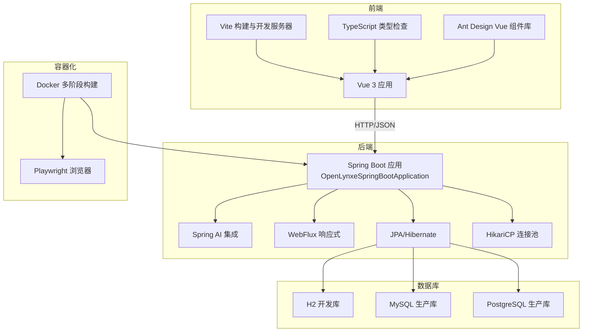
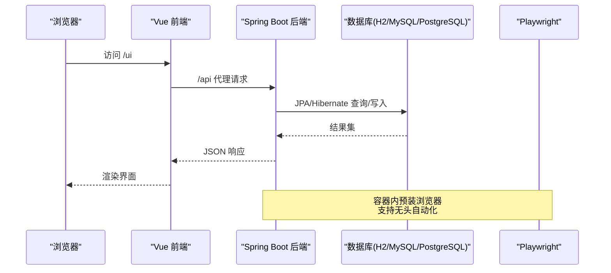
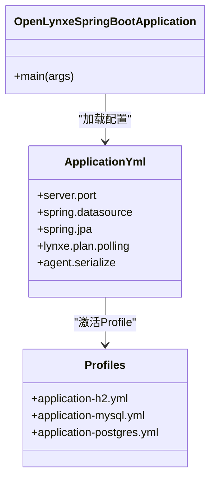
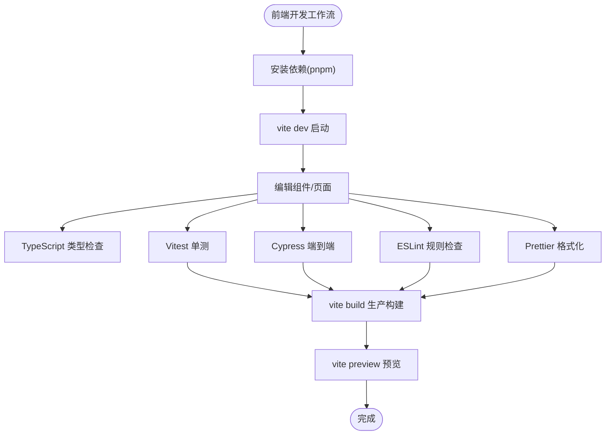
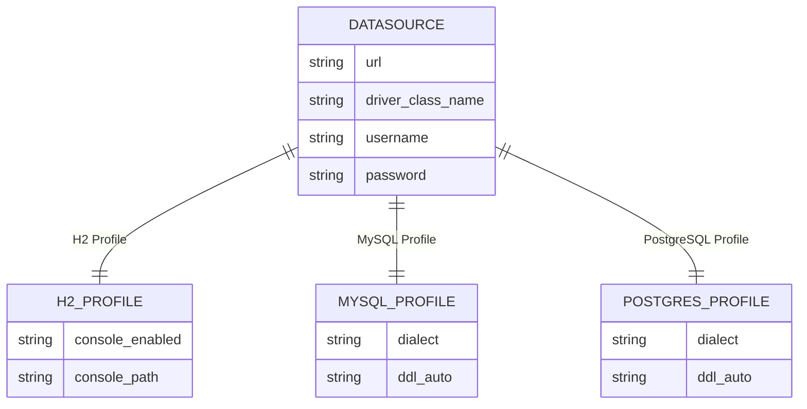
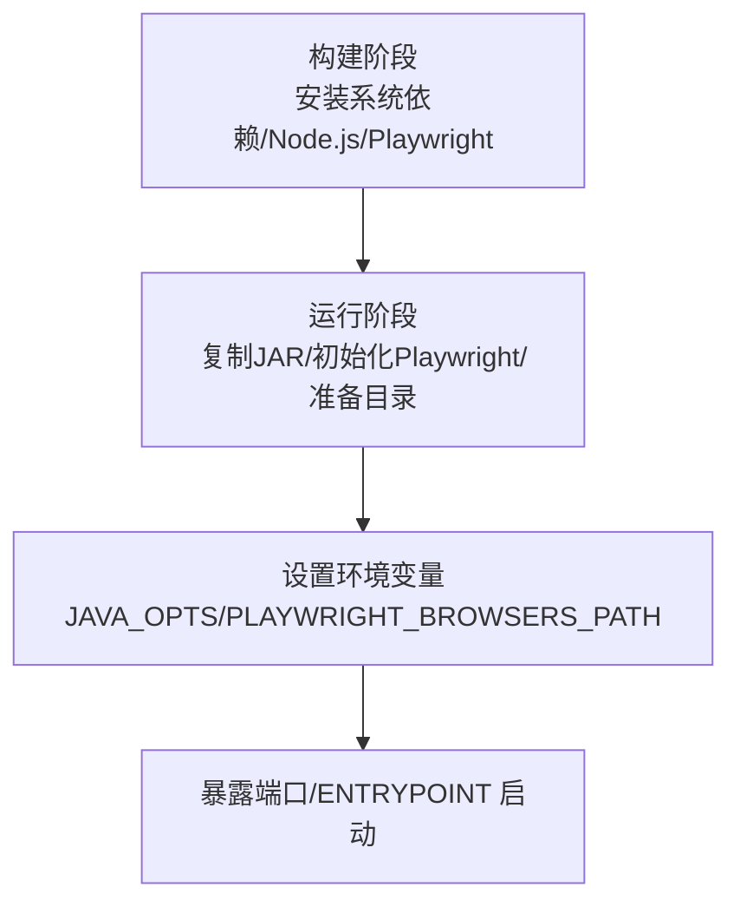
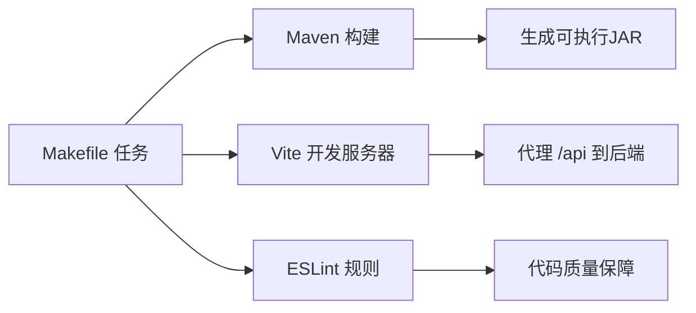
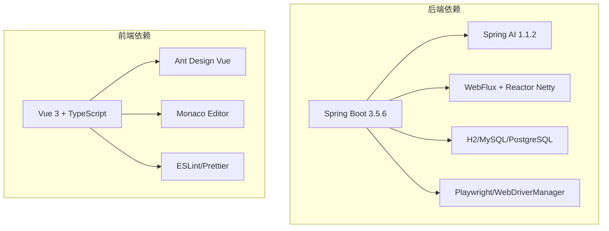

# 技术栈概览

<cite>
**本文档引用的文件**
- [pom.xml](file://pom.xml)
- [OpenLynxeSpringBootApplication.java](file://src/main/java/com/alibaba/cloud/ai/lynxe/OpenLynxeSpringBootApplication.java)
- [application.yml](file://src/main/resources/application.yml)
- [application-h2.yml](file://src/main/resources/application-h2.yml)
- [application-mysql.yml](file://src/main/resources/application-mysql.yml)
- [application-postgres.yml](file://src/main/resources/application-postgres.yml)
- [Dockerfile](file://deploy/Dockerfile)
- [package.json](file://ui-vue3/package.json)
- [vite.config.ts](file://ui-vue3/vite.config.ts)
- [.eslintrc.cjs](file://ui-vue3/.eslintrc.cjs)
- [eslint.config.js](file://ui-vue3/eslint.config.js)
- [tsconfig.json](file://ui-vue3/tsconfig.json)
- [Makefile](file://Makefile)
- [common.mk](file://tools/make/common.mk)
- [README.md](file://ui-vue3/README.md)
</cite>

## 目录
1. [引言](#引言)
2. [项目结构](#项目结构)
3. [核心组件](#核心组件)
4. [架构总览](#架构总览)
5. [详细组件分析](#详细组件分析)
6. [依赖分析](#依赖分析)
7. [性能考虑](#性能考虑)
8. [故障排除指南](#故障排除指南)
9. [结论](#结论)
10. [附录](#附录)

## 引言
本技术栈概览面向Lynxe项目的后端与前端开发者，系统梳理并解释后端技术栈（Spring Boot 3.x、Spring AI、Java 17+）、前端技术栈（Vue.js 3、TypeScript、Ant Design Vue）、数据库支持（H2、MySQL、PostgreSQL）、容器化（Docker）以及开发工具链（Maven、Vite、ESLint）。同时提供版本兼容性信息、技术选型权衡与学习路径建议，帮助新成员快速上手。

## 项目结构
Lynxe采用前后端分离架构：
- 后端：基于Spring Boot 3.x，使用Spring AI进行大模型集成，配合WebFlux响应式编程与JPA持久化。
- 前端：Vue.js 3 + TypeScript + Vite，采用Ant Design Vue构建UI，Pinia管理状态，Monaco Editor提供代码编辑能力。
- 数据库：通过Spring Profile支持H2（开发/测试）、MySQL、PostgreSQL三种运行环境。
- 容器化：多阶段Docker镜像，内置Playwright浏览器依赖，支持无头模式自动化。
- 工具链：Maven负责后端构建与依赖管理；Vite提供快速开发体验；ESLint与Prettier保障代码质量。

图表来源
- [OpenLynxeSpringBootApplication.java:29-34](file://src/main/java/com/alibaba/cloud/ai/lynxe/OpenLynxeSpringBootApplication.java#L29-L34)
- [application.yml:1-97](file://src/main/resources/application.yml#L1-L97)
- [Dockerfile:15-138](file://deploy/Dockerfile#L15-L138)
- [package.json:28-81](file://ui-vue3/package.json#L28-L81)

章节来源
- [pom.xml:12-58](file://pom.xml#L12-L58)
- [application.yml:1-97](file://src/main/resources/application.yml#L1-L97)
- [Dockerfile:15-138](file://deploy/Dockerfile#L15-L138)
- [package.json:28-81](file://ui-vue3/package.json#L28-L81)

## 核心组件
- 后端核心启动类与扫描配置：应用入口类启用调度、JPA仓库与实体扫描，确保模块化组件被正确注册。
- 配置中心：application.yml作为默认配置，按Profile切换H2/MySQL/PostgreSQL；各Profile覆盖数据源、方言与AI内存配置。
- 数据库驱动：H2用于本地开发与测试，MySQL与PostgreSQL用于生产环境。
- 容器化：Dockerfile定义多阶段构建，安装Node.js与Playwright依赖，预装浏览器以支持无头自动化。
- 前端工程：package.json声明依赖与脚本，Vite配置代理后端API，ESLint与TypeScript共同保证质量与类型安全。

章节来源
- [OpenLynxeSpringBootApplication.java:29-45](file://src/main/java/com/alibaba/cloud/ai/lynxe/OpenLynxeSpringBootApplication.java#L29-L45)
- [application.yml:6-97](file://src/main/resources/application.yml#L6-L97)
- [application-h2.yml:1-23](file://src/main/resources/application-h2.yml#L1-L23)
- [application-mysql.yml:1-15](file://src/main/resources/application-mysql.yml#L1-L15)
- [application-postgres.yml:1-15](file://src/main/resources/application-postgres.yml#L1-L15)
- [Dockerfile:15-138](file://deploy/Dockerfile#L15-L138)
- [package.json:6-27](file://ui-vue3/package.json#L6-L27)

## 架构总览
下图展示Lynxe从浏览器到后端服务再到数据库的整体交互流程，包括容器化部署与Playwright自动化支持。

图表来源
- [vite.config.ts:35-44](file://ui-vue3/vite.config.ts#L35-L44)
- [application.yml:1-97](file://src/main/resources/application.yml#L1-L97)
- [Dockerfile:48-109](file://deploy/Dockerfile#L48-L109)

## 详细组件分析

### 后端技术栈：Spring Boot 3.x + Spring AI + Java 17+
- 版本与特性
  - Spring Boot 3.5.6：提供Starter、自动装配与容器化友好打包。
  - Spring AI 1.1.2：通过BOM统一版本，适配OpenAI模型与MCP客户端。
  - Java 17：LTS版本，获得长期支持与性能优化。
- 关键依赖
  - WebFlux：响应式Web栈，提升高并发下的吞吐与资源利用率。
  - JPA/Hibernate：对象关系映射与Schema自动生成。
  - HikariCP：高性能连接池，支持连接泄漏检测与容器感知。
  - Playwright：浏览器自动化，结合Docker多平台支持。
- 配置要点
  - application.yml集中管理端口、文件上传、日志级别、计划轮询与文件上传策略。
  - Profile切换：H2用于开发，MySQL/PostgreSQL用于生产，方言与DDL策略按需调整。
- 启动与初始化
  - 启动类启用调度与JPA扫描，支持Playwright初始化命令行参数。

图表来源
- [OpenLynxeSpringBootApplication.java:29-45](file://src/main/java/com/alibaba/cloud/ai/lynxe/OpenLynxeSpringBootApplication.java#L29-L45)
- [application.yml:1-97](file://src/main/resources/application.yml#L1-L97)
- [application-h2.yml:1-23](file://src/main/resources/application-h2.yml#L1-L23)
- [application-mysql.yml:1-15](file://src/main/resources/application-mysql.yml#L1-L15)
- [application-postgres.yml:1-15](file://src/main/resources/application-postgres.yml#L1-L15)

章节来源
- [pom.xml:12-58](file://pom.xml#L12-L58)
- [pom.xml:88-127](file://pom.xml#L88-L127)
- [pom.xml:230-301](file://pom.xml#L230-L301)
- [application.yml:1-97](file://src/main/resources/application.yml#L1-L97)
- [OpenLynxeSpringBootApplication.java:29-45](file://src/main/java/com/alibaba/cloud/ai/lynxe/OpenLynxeSpringBootApplication.java#L29-L45)

### 前端技术栈：Vue.js 3 + TypeScript + Ant Design Vue
- 技术组合
  - Vue 3：组合式API与更好的Tree-shaking，适合复杂交互。
  - TypeScript：类型安全与IDE智能提示，降低重构风险。
  - Vite：快速冷启动与热更新，开发体验优秀。
  - Ant Design Vue：企业级UI组件库，主题与暗色模式契合设计风格。
  - Pinia：轻量状态管理，替代Vuex。
  - Monaco Editor：代码高亮与语法校验，满足任务执行与编辑需求。
- 开发工具链
  - ESLint：规则覆盖Vue/TS/JS，支持未使用导入清理。
  - Prettier：统一代码格式。
  - Vitest/Cypress：单元与端到端测试。
- 开发体验
  - Vite代理后端API，支持跨域调试。
  - tsconfig分层配置，确保类型检查与构建一致性。

图表来源
- [package.json:6-27](file://ui-vue3/package.json#L6-L27)
- [vite.config.ts:24-71](file://ui-vue3/vite.config.ts#L24-L71)
- [.eslintrc.cjs:20-107](file://ui-vue3/.eslintrc.cjs#L20-L107)
- [eslint.config.js:28-160](file://ui-vue3/eslint.config.js#L28-L160)
- [tsconfig.json:1-15](file://ui-vue3/tsconfig.json#L1-L15)

章节来源
- [package.json:28-81](file://ui-vue3/package.json#L28-L81)
- [vite.config.ts:24-71](file://ui-vue3/vite.config.ts#L24-L71)
- [.eslintrc.cjs:20-107](file://ui-vue3/.eslintrc.cjs#L20-L107)
- [eslint.config.js:28-160](file://ui-vue3/eslint.config.js#L28-L160)
- [tsconfig.json:1-15](file://ui-vue3/tsconfig.json#L1-L15)
- [README.md:130-141](file://ui-vue3/README.md#L130-L141)

### 数据库支持：H2、MySQL、PostgreSQL
- H2（开发/测试）
  - 内嵌文件数据库，支持Web控制台与SQL方言适配。
  - 默认开启控制台，便于本地调试。
- MySQL（生产）
  - 使用MySQL方言与连接池配置，DDL策略按需调整。
- PostgreSQL（生产）
  - 使用PostgreSQL方言，适合高并发与复杂查询场景。
- 配置差异
  - 不同Profile仅替换数据源URL、驱动与方言，保持JPA/Hibernate行为一致。

图表来源
- [application-h2.yml:1-23](file://src/main/resources/application-h2.yml#L1-L23)
- [application-mysql.yml:1-15](file://src/main/resources/application-mysql.yml#L1-L15)
- [application-postgres.yml:1-15](file://src/main/resources/application-postgres.yml#L1-L15)

章节来源
- [application-h2.yml:1-23](file://src/main/resources/application-h2.yml#L1-L23)
- [application-mysql.yml:1-15](file://src/main/resources/application-mysql.yml#L1-L15)
- [application-postgres.yml:1-15](file://src/main/resources/application-postgres.yml#L1-L15)

### 容器化：Docker 使用与部署优势
- 多阶段构建
  - 基础镜像采用Eclipse Temurin 17，体积小且运行稳定。
  - 分层安装系统依赖、Node.js与Playwright浏览器，提升缓存命中率。
- 运行时准备
  - 预装Playwright浏览器，启动时解压JAR并设置权限。
  - 创建日志与H2数据目录，便于持久化与排障。
- 环境变量
  - 设置DISPLAY、PLAYWRIGHT_BROWSERS_PATH与JAVA_OPTS，优化GC与容器感知。
- 入口与暴露
  - 通过启动脚本作为入口，暴露18080端口，便于反向代理与集群部署。

图表来源
- [Dockerfile:15-138](file://deploy/Dockerfile#L15-L138)

章节来源
- [Dockerfile:15-138](file://deploy/Dockerfile#L15-L138)

### 开发工具链：Maven、Vite、ESLint 等
- Maven（后端）
  - 管理Spring Boot与Spring AI版本，配置编译插件、资源过滤与Surefire测试。
  - 通过spring-boot-maven-plugin生成可执行JAR，支持主类与布局定制。
- Vite（前端）
  - 提供开发服务器、代理后端API、TypeScript/Vue检查与代码分割。
- ESLint（前端）
  - 推荐配置覆盖Vue/TS/JS，结合unused-imports插件清理未使用导入。
- Make（通用）
  - 统一目标入口，整合Java、Docker、UI与工具链任务。

图表来源
- [pom.xml:374-552](file://pom.xml#L374-L552)
- [vite.config.ts:35-44](file://ui-vue3/vite.config.ts#L35-L44)
- [.eslintrc.cjs:27-107](file://ui-vue3/.eslintrc.cjs#L27-L107)
- [Makefile:17-30](file://Makefile#L17-L30)
- [common.mk:30-35](file://tools/make/common.mk#L30-L35)

章节来源
- [pom.xml:374-552](file://pom.xml#L374-L552)
- [vite.config.ts:24-71](file://ui-vue3/vite.config.ts#L24-L71)
- [.eslintrc.cjs:20-107](file://ui-vue3/.eslintrc.cjs#L20-L107)
- [Makefile:17-30](file://Makefile#L17-L30)
- [common.mk:30-35](file://tools/make/common.mk#L30-L35)

## 依赖分析
- 后端依赖
  - Spring Boot Starter Web/WebFlux/JPA/AOP与日志。
  - Spring AI Starter（OpenAI/MCP）与Reactor Netty。
  - Playwright与WebDriverManager，支持浏览器自动化。
  - H2/MySQL/PostgreSQL驱动与EasyExcel、POI等文档处理。
- 前端依赖
  - Vue 3、Vue Router、Pinia、Ant Design Vue、Monaco Editor、Axios、Day.js等。
  - 开发期ESLint、Prettier、Vitest、Cypress等工具。

图表来源
- [pom.xml:60-353](file://pom.xml#L60-L353)
- [package.json:28-81](file://ui-vue3/package.json#L28-L81)

章节来源
- [pom.xml:60-353](file://pom.xml#L60-L353)
- [package.json:28-81](file://ui-vue3/package.json#L28-L81)

## 性能考虑
- 连接池与数据库
  - HikariCP连接池参数已调优，包括最大池大小、空闲超时与泄漏检测阈值，减少连接抖动与资源泄露风险。
- 响应式编程
  - WebFlux在高并发I/O密集场景下具备更好吞吐与内存占用表现，适合与Spring AI异步调用配合。
- 容器与GC
  - Docker中设置JAVA_OPTS启用G1GC与容器感知，有助于在Kubernetes等环境中稳定运行。
- 前端构建
  - Vite按需加载与Source Map在开发阶段提升调试效率，生产构建开启Source Map便于排障但需权衡包体大小。

章节来源
- [application.yml:20-31](file://src/main/resources/application.yml#L20-L31)
- [Dockerfile:115-119](file://deploy/Dockerfile#L115-L119)
- [vite.config.ts:25-28](file://ui-vue3/vite.config.ts#L25-L28)

## 故障排除指南
- Playwright 初始化失败
  - 在容器内可通过启动参数触发Playwright初始化，确保浏览器二进制可执行。
- CORS 与代理问题
  - 前端Vite代理指向后端18080端口，确认后端已启动且允许外部访问。
- 数据库连接异常
  - 检查Profile是否正确，确认URL、驱动与方言匹配对应数据库。
- 日志定位
  - application.yml中已配置日志文件与关键包的日志级别，便于排查AI与工具链相关问题。

章节来源
- [OpenLynxeSpringBootApplication.java:36-44](file://src/main/java/com/alibaba/cloud/ai/lynxe/OpenLynxeSpringBootApplication.java#L36-L44)
- [vite.config.ts:35-44](file://ui-vue3/vite.config.ts#L35-L44)
- [application.yml:46-58](file://src/main/resources/application.yml#L46-L58)

## 结论
Lynxe采用成熟稳定的全栈技术栈：后端以Spring Boot 3.x + Spring AI为核心，结合WebFlux与JPA实现高性能与可扩展性；前端以Vue 3 + TypeScript为基础，辅以Ant Design Vue与Monaco Editor构建现代化交互体验；数据库支持多厂商切换，容器化方案完善，开发工具链覆盖质量与效率。整体选型兼顾易用性、可维护性与生产可用性。

## 附录

### 版本兼容性与技术选型权衡
- Java 17 vs 21：当前使用Java 17，平衡生态成熟度与升级成本；如需更高性能可评估升级至Java 21。
- Spring Boot 3.x：与Spring AI 1.1.2配合良好，注意注解与WebFlux生态的兼容性。
- Vue 3 + TypeScript：类型安全与现代工具链，学习曲线略高于JS，但长期收益显著。
- 数据库选择：H2适合本地开发，MySQL/PostgreSQL适合生产；PostgreSQL在复杂查询与事务一致性方面更优。

章节来源
- [pom.xml:20-46](file://pom.xml#L20-L46)
- [package.json:75-76](file://ui-vue3/package.json#L75-L76)
- [application-postgres.yml:1-15](file://src/main/resources/application-postgres.yml#L1-L15)

### 学习路径建议
- 后端入门
  - 掌握Spring Boot基础与Profile配置，理解WebFlux与JPA。
  - 学习Spring AI集成与MCP客户端使用，熟悉工具调用与计划执行。
  - 阅读Dockerfile与启动流程，掌握容器化部署。
- 前端入门
  - 熟悉Vue 3组合式API与TypeScript基础。
  - 学习Ant Design Vue组件使用与状态管理（Pinia）。
  - 掌握Vite开发服务器、ESLint与Prettier工具链。
- 实践建议
  - 从H2开发环境入手，逐步切换到MySQL/PostgreSQL。
  - 使用Makefile统一任务，提高团队协作效率。
  - 参考README与配置文件，完成本地一键启动与构建。

章节来源
- [README.md:28-96](file://ui-vue3/README.md#L28-L96)
- [Makefile:17-30](file://Makefile#L17-L30)
- [common.mk:30-35](file://tools/make/common.mk#L30-L35)