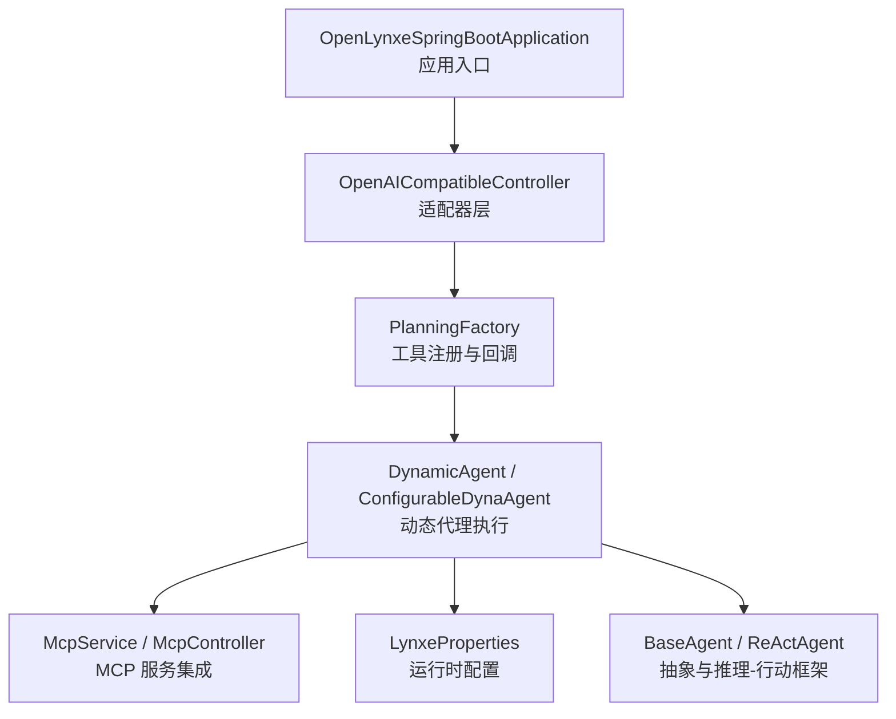
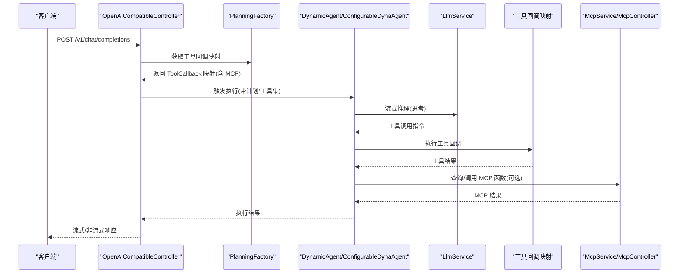
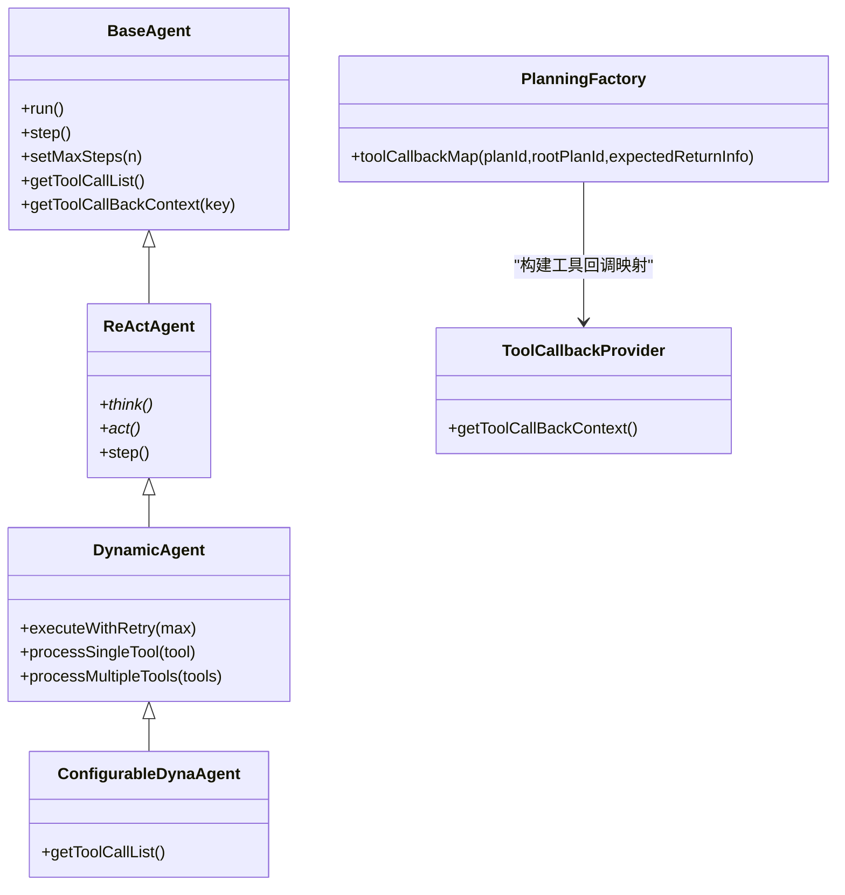
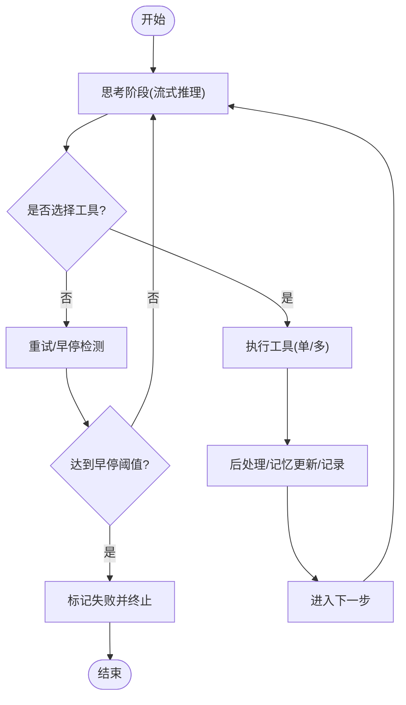
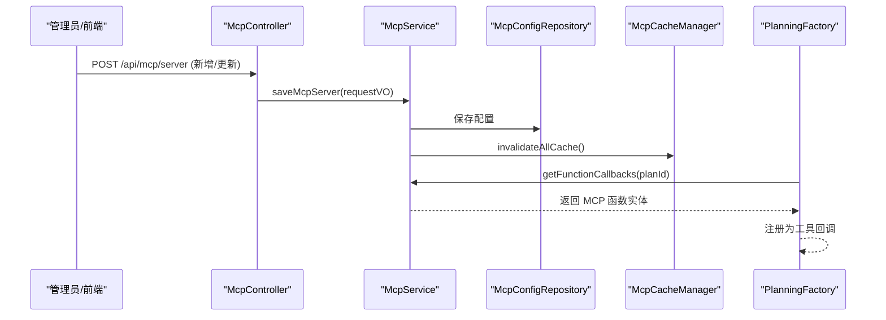
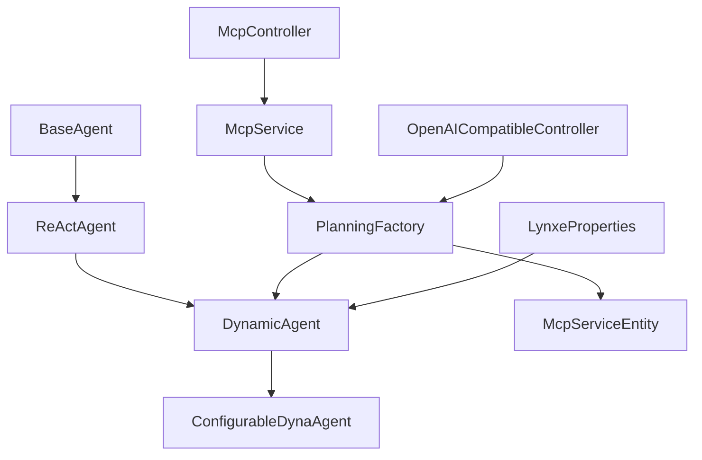

# 核心特性

<cite>
**本文引用的文件**   
- [OpenLynxeSpringBootApplication.java](file://src/main/java/com/alibaba/cloud/ai/lynxe/OpenLynxeSpringBootApplication.java)
- [BaseAgent.java](file://src/main/java/com/alibaba/cloud/ai/lynxe/agent/BaseAgent.java)
- [ReActAgent.java](file://src/main/java/com/alibaba/cloud/ai/lynxe/agent/ReActAgent.java)
- [DynamicAgent.java](file://src/main/java/com/alibaba/cloud/ai/lynxe/agent/DynamicAgent.java)
- [ConfigurableDynaAgent.java](file://src/main/java/com/alibaba/cloud/ai/lynxe/agent/ConfigurableDynaAgent.java)
- [PlanningFactory.java](file://src/main/java/com/alibaba/cloud/ai/lynxe/planning/PlanningFactory.java)
- [DynamicAgentPlanningTool.java](file://src/main/java/com/alibaba/cloud/ai/lynxe/tool/DynamicAgentPlanningTool.java)
- [McpService.java](file://src/main/java/com/alibaba/cloud/ai/lynxe/mcp/service/McpService.java)
- [McpController.java](file://src/main/java/com/alibaba/cloud/ai/lynxe/mcp/controller/McpController.java)
- [McpServiceEntity.java](file://src/main/java/com/alibaba/cloud/ai/lynxe/mcp/model/vo/McpServiceEntity.java)
- [OpenAICompatibleController.java](file://src/main/java/com/alibaba/cloud/ai/lynxe/adapter/controller/OpenAICompatibleController.java)
- [LynxeProperties.java](file://src/main/java/com/alibaba/cloud/ai/lynxe/config/LynxeProperties.java)
- [ToolCallbackProvider.java](file://src/main/java/com/alibaba/cloud/ai/lynxe/agent/ToolCallbackProvider.java)
</cite>

## 目录
1. [引言](#引言)
2. [项目结构](#项目结构)
3. [核心组件](#核心组件)
4. [架构总览](#架构总览)
5. [详细组件分析](#详细组件分析)
6. [依赖分析](#依赖分析)
7. [性能考虑](#性能考虑)
8. [故障排查指南](#故障排查指南)
9. [结论](#结论)

## 引言
本文件聚焦 Lynxe 的三大核心特性：纯 Java 多代理协作实现、Func-Agent 精确控制模式、MCP 协议集成能力。我们将从技术实现原理、业务价值与使用场景三个维度进行系统化说明，并通过图示与路径引用帮助开发者快速定位源码位置，理解各特性的工程落地方式与最佳实践。

## 项目结构
Lynxe 基于 Spring Boot 构建，采用分层清晰的模块化组织：适配器层（OpenAI 兼容接口）、智能体层（Agent 抽象与具体实现）、规划与工具层（PlanningFactory、工具注册与回调）、MCP 集成层（服务发现与缓存）、配置与运行时支持（LynxeProperties、执行记录与中断管理）等。入口类负责启动与 Playwright 初始化，控制器对外暴露统一 API，内部通过 LLM 与工具链协同完成复杂任务编排。

图表来源
- [OpenLynxeSpringBootApplication.java:34-45](file://src/main/java/com/alibaba/cloud/ai/lynxe/OpenLynxeSpringBootApplication.java#L34-L45)
- [OpenAICompatibleController.java:85-116](file://src/main/java/com/alibaba/cloud/ai/lynxe/adapter/controller/OpenAICompatibleController.java#L85-L116)
- [PlanningFactory.java:261-393](file://src/main/java/com/alibaba/cloud/ai/lynxe/planning/PlanningFactory.java#L261-L393)
- [DynamicAgent.java:170-201](file://src/main/java/com/alibaba/cloud/ai/lynxe/agent/DynamicAgent.java#L170-L201)
- [McpService.java:44-62](file://src/main/java/com/alibaba/cloud/ai/lynxe/mcp/service/McpService.java#L44-L62)
- [LynxeProperties.java:27-28](file://src/main/java/com/alibaba/cloud/ai/lynxe/config/LynxeProperties.java#L27-L28)

章节来源
- [OpenLynxeSpringBootApplication.java:34-45](file://src/main/java/com/alibaba/cloud/ai/lynxe/OpenLynxeSpringBootApplication.java#L34-L45)
- [OpenAICompatibleController.java:85-116](file://src/main/java/com/alibaba/cloud/ai/lynxe/adapter/controller/OpenAICompatibleController.java#L85-L116)

## 核心组件
- 智能体抽象与执行框架
  - BaseAgent：定义执行轮次、状态机、异常处理、终止流程与最终总结生成。
  - ReActAgent：定义“思考-行动”交替的执行骨架。
  - DynamicAgent：基于 LLM 流式响应与工具调用管理，支持重试、早停检测、并发工具执行与记忆压缩。
  - ConfigurableDynaAgent：在 DynamicAgent 基础上支持运行时可选工具集与终止工具注入。
- 工具与规划
  - PlanningFactory：集中注册工具回调，构建 ToolCallback 映射，整合 MCP 服务与子计划工具。
  - DynamicAgentPlanningTool：用于将“步骤定义”转化为可执行的动态代理计划。
- MCP 集成
  - McpService：保存/删除/启用/禁用 MCP 服务器配置，提供函数回调查询与缓存失效。
  - McpController：提供 MCP 服务器的增删改查与启停接口。
  - McpServiceEntity：封装 MCP 客户端与异步工具回调提供者。
- 适配器与配置
  - OpenAICompatibleController：提供 OpenAI 兼容的聊天补全与模型列表接口，支持流式与非流式响应。
  - LynxeProperties：集中管理运行时配置（如最大步数、并行工具调用、对话记忆上限等）。

章节来源
- [BaseAgent.java:70-357](file://src/main/java/com/alibaba/cloud/ai/lynxe/agent/BaseAgent.java#L70-L357)
- [ReActAgent.java:30-96](file://src/main/java/com/alibaba/cloud/ai/lynxe/agent/ReActAgent.java#L30-L96)
- [DynamicAgent.java:83-595](file://src/main/java/com/alibaba/cloud/ai/lynxe/agent/DynamicAgent.java#L83-L595)
- [ConfigurableDynaAgent.java:51-340](file://src/main/java/com/alibaba/cloud/ai/lynxe/agent/ConfigurableDynaAgent.java#L51-L340)
- [PlanningFactory.java:261-393](file://src/main/java/com/alibaba/cloud/ai/lynxe/planning/PlanningFactory.java#L261-L393)
- [DynamicAgentPlanningTool.java:31-353](file://src/main/java/com/alibaba/cloud/ai/lynxe/tool/DynamicAgentPlanningTool.java#L31-L353)
- [McpService.java:44-352](file://src/main/java/com/alibaba/cloud/ai/lynxe/mcp/service/McpService.java#L44-L352)
- [McpController.java:40-196](file://src/main/java/com/alibaba/cloud/ai/lynxe/mcp/controller/McpController.java#L40-L196)
- [McpServiceEntity.java:21-67](file://src/main/java/com/alibaba/cloud/ai/lynxe/mcp/model/vo/McpServiceEntity.java#L21-L67)
- [OpenAICompatibleController.java:50-357](file://src/main/java/com/alibaba/cloud/ai/lynxe/adapter/controller/OpenAICompatibleController.java#L50-L357)
- [LynxeProperties.java:27-654](file://src/main/java/com/alibaba/cloud/ai/lynxe/config/LynxeProperties.java#L27-L654)
- [ToolCallbackProvider.java:22-26](file://src/main/java/com/alibaba/cloud/ai/lynxe/agent/ToolCallbackProvider.java#L22-L26)

## 架构总览
下图展示从外部请求到智能体执行、工具调用与 MCP 服务的完整链路，体现“纯 Java 实现 + 精确控制 + 协议集成”的整体架构。

图表来源
- [OpenAICompatibleController.java:85-116](file://src/main/java/com/alibaba/cloud/ai/lynxe/adapter/controller/OpenAICompatibleController.java#L85-L116)
- [PlanningFactory.java:331-339](file://src/main/java/com/alibaba/cloud/ai/lynxe/planning/PlanningFactory.java#L331-L339)
- [DynamicAgent.java:361-449](file://src/main/java/com/alibaba/cloud/ai/lynxe/agent/DynamicAgent.java#L361-L449)
- [McpService.java:284-287](file://src/main/java/com/alibaba/cloud/ai/lynxe/mcp/service/McpService.java#L284-L287)

## 详细组件分析

### 纯 Java 多代理协作实现
- 设计要点
  - 以 BaseAgent 为抽象基类，统一状态机、最大步数、异常与终止处理；ReActAgent 提供“思考-行动”骨架；DynamicAgent 将推理与工具调用解耦，支持重试、早停检测、并发工具执行与记忆压缩。
  - ConfigurableDynaAgent 在 DynamicAgent 基础上支持运行时可选工具集与终止工具注入，便于按需裁剪工具集合。
  - PlanningFactory 负责集中注册工具回调，构建工具名到回调的映射，并将 MCP 服务函数注入为工具回调，形成统一的工具生态。
- 业务价值
  - 通过纯 Java 实现，降低对特定运行时的依赖，提升二次集成的稳定性与可控性；统一的工具注册与回调机制，便于扩展新工具与第三方服务。
- 使用场景
  - 需要稳定、可移植的智能体执行环境；需要在不同 LLM 间切换或自建推理服务；需要对工具调用进行细粒度控制与可观测性。

图表来源
- [BaseAgent.java:70-357](file://src/main/java/com/alibaba/cloud/ai/lynxe/agent/BaseAgent.java#L70-L357)
- [ReActAgent.java:30-96](file://src/main/java/com/alibaba/cloud/ai/lynxe/agent/ReActAgent.java#L30-L96)
- [DynamicAgent.java:83-595](file://src/main/java/com/alibaba/cloud/ai/lynxe/agent/DynamicAgent.java#L83-L595)
- [ConfigurableDynaAgent.java:51-340](file://src/main/java/com/alibaba/cloud/ai/lynxe/agent/ConfigurableDynaAgent.java#L51-L340)
- [PlanningFactory.java:261-393](file://src/main/java/com/alibaba/cloud/ai/lynxe/planning/PlanningFactory.java#L261-L393)
- [ToolCallbackProvider.java:22-26](file://src/main/java/com/alibaba/cloud/ai/lynxe/agent/ToolCallbackProvider.java#L22-L26)

章节来源
- [BaseAgent.java:70-357](file://src/main/java/com/alibaba/cloud/ai/lynxe/agent/BaseAgent.java#L70-L357)
- [ReActAgent.java:30-96](file://src/main/java/com/alibaba/cloud/ai/lynxe/agent/ReActAgent.java#L30-L96)
- [DynamicAgent.java:83-595](file://src/main/java/com/alibaba/cloud/ai/lynxe/agent/DynamicAgent.java#L83-L595)
- [ConfigurableDynaAgent.java:51-340](file://src/main/java/com/alibaba/cloud/ai/lynxe/agent/ConfigurableDynaAgent.java#L51-L340)
- [PlanningFactory.java:261-393](file://src/main/java/com/alibaba/cloud/ai/lynxe/planning/PlanningFactory.java#L261-L393)
- [ToolCallbackProvider.java:22-26](file://src/main/java/com/alibaba/cloud/ai/lynxe/agent/ToolCallbackProvider.java#L22-L26)

### Func-Agent 精确控制模式
- 设计要点
  - DynamicAgent 在“思考-行动”循环中引入重试与早停检测，当 LLM 反复仅输出文本而未调用工具时，会触发失败状态，避免无限循环。
  - 支持单工具与多工具执行，多工具执行通过并行执行服务协调，同时保留 TerminateTool 的后置执行语义，确保流程收敛。
  - ConfigurableDynaAgent 自动补齐终止工具，保证执行闭环；同时兼容服务组前缀的工具键格式，提升前端交互一致性。
- 业务价值
  - 高确定性：通过早停检测、重试策略与终止工具保障流程收敛；通过严格的工具调用规则减少歧义。
  - 复杂流程处理：支持多工具并发、记忆压缩与中断检查，满足复杂任务的可靠性与可观测性需求。
- 使用场景
  - 需要严格控制执行路径与输出格式的任务；需要在多工具组合下保持高吞吐与低延迟；需要对异常与中断进行精细化处理。

图表来源
- [DynamicAgent.java:235-495](file://src/main/java/com/alibaba/cloud/ai/lynxe/agent/DynamicAgent.java#L235-L495)
- [DynamicAgent.java:617-777](file://src/main/java/com/alibaba/cloud/ai/lynxe/agent/DynamicAgent.java#L617-L777)
- [ConfigurableDynaAgent.java:97-201](file://src/main/java/com/alibaba/cloud/ai/lynxe/agent/ConfigurableDynaAgent.java#L97-L201)

章节来源
- [DynamicAgent.java:235-495](file://src/main/java/com/alibaba/cloud/ai/lynxe/agent/DynamicAgent.java#L235-L495)
- [DynamicAgent.java:617-777](file://src/main/java/com/alibaba/cloud/ai/lynxe/agent/DynamicAgent.java#L617-L777)
- [ConfigurableDynaAgent.java:97-201](file://src/main/java/com/alibaba/cloud/ai/lynxe/agent/ConfigurableDynaAgent.java#L97-L201)

### MCP 协议集成能力
- 设计要点
  - McpService 负责 MCP 服务器配置的保存、删除、启用/禁用与缓存失效；提供按计划 ID 查询函数回调的能力。
  - McpController 对外提供批量导入、单个新增/更新、删除、启用/禁用等 REST 接口，便于前端与外部系统管理 MCP 服务。
  - PlanningFactory 在构建工具回调映射时，将 MCP 服务函数注入为工具回调，统一由 LLM 调用。
  - McpServiceEntity 封装 MCP 异步客户端与工具回调提供者，作为工具注册的一部分。
- 业务价值
  - 与外部服务无缝对接：通过 MCP 协议，将第三方服务以工具形式纳入统一调度体系，无需侵入式改造。
  - 运行时可插拔：支持动态增删改查 MCP 服务，配合缓存失效机制实现热更新。
- 使用场景
  - 需要将外部服务（如数据库、搜索、图像生成等）以标准化工具形式接入；需要在不改变核心逻辑的前提下扩展能力边界。

图表来源
- [McpController.java:85-122](file://src/main/java/com/alibaba/cloud/ai/lynxe/mcp/controller/McpController.java#L85-L122)
- [McpService.java:150-213](file://src/main/java/com/alibaba/cloud/ai/lynxe/mcp/service/McpService.java#L150-L213)
- [McpService.java:284-287](file://src/main/java/com/alibaba/cloud/ai/lynxe/mcp/service/McpService.java#L284-L287)
- [PlanningFactory.java:331-339](file://src/main/java/com/alibaba/cloud/ai/lynxe/planning/PlanningFactory.java#L331-L339)

章节来源
- [McpController.java:40-196](file://src/main/java/com/alibaba/cloud/ai/lynxe/mcp/controller/McpController.java#L40-L196)
- [McpService.java:44-352](file://src/main/java/com/alibaba/cloud/ai/lynxe/mcp/service/McpService.java#L44-L352)
- [PlanningFactory.java:331-339](file://src/main/java/com/alibaba/cloud/ai/lynxe/planning/PlanningFactory.java#L331-L339)
- [McpServiceEntity.java:21-67](file://src/main/java/com/alibaba/cloud/ai/lynxe/mcp/model/vo/McpServiceEntity.java#L21-L67)

## 依赖分析
- 组件耦合与内聚
  - BaseAgent/ReActAgent/ DynamicAgent 形成清晰的继承层次，职责分离明确；DynamicAgent 与 LLM、工具回调、内存与中断检查等模块存在横向依赖，但通过接口与工厂解耦。
  - PlanningFactory 是工具与 MCP 的集中入口，承担“注册-聚合-导出”的职责，降低上层对底层细节的感知。
  - McpService 与 McpController 通过仓储与缓存管理 MCP 配置，避免直接暴露底层实现。
- 外部依赖与集成点
  - 适配器层依赖 OpenAI 兼容接口规范，便于与外部平台（如 Cherry Studio）对接。
  - 配置层通过 LynxeProperties 提供集中配置，支持运行时参数调整与回退策略。

图表来源
- [BaseAgent.java:70-357](file://src/main/java/com/alibaba/cloud/ai/lynxe/agent/BaseAgent.java#L70-L357)
- [ReActAgent.java:30-96](file://src/main/java/com/alibaba/cloud/ai/lynxe/agent/ReActAgent.java#L30-L96)
- [DynamicAgent.java:83-595](file://src/main/java/com/alibaba/cloud/ai/lynxe/agent/DynamicAgent.java#L83-L595)
- [ConfigurableDynaAgent.java:51-340](file://src/main/java/com/alibaba/cloud/ai/lynxe/agent/ConfigurableDynaAgent.java#L51-L340)
- [PlanningFactory.java:261-393](file://src/main/java/com/alibaba/cloud/ai/lynxe/planning/PlanningFactory.java#L261-L393)
- [McpController.java:40-196](file://src/main/java/com/alibaba/cloud/ai/lynxe/mcp/controller/McpController.java#L40-L196)
- [McpService.java:44-352](file://src/main/java/com/alibaba/cloud/ai/lynxe/mcp/service/McpService.java#L44-L352)
- [OpenAICompatibleController.java:85-116](file://src/main/java/com/alibaba/cloud/ai/lynxe/adapter/controller/OpenAICompatibleController.java#L85-L116)
- [LynxeProperties.java:27-654](file://src/main/java/com/alibaba/cloud/ai/lynxe/config/LynxeProperties.java#L27-L654)

章节来源
- [PlanningFactory.java:261-393](file://src/main/java/com/alibaba/cloud/ai/lynxe/planning/PlanningFactory.java#L261-L393)
- [McpService.java:44-352](file://src/main/java/com/alibaba/cloud/ai/lynxe/mcp/service/McpService.java#L44-L352)
- [OpenAICompatibleController.java:85-116](file://src/main/java/com/alibaba/cloud/ai/lynxe/adapter/controller/OpenAICompatibleController.java#L85-L116)

## 性能考虑
- 并发与资源控制
  - 动态代理支持多工具并发执行，需结合 LynxeProperties 中的线程池大小与并行工具调用开关进行权衡，避免资源争用。
- 记忆与字符限制
  - 通过对话记忆上限与字符统计，动态压缩历史消息，降低输入开销，提高响应速度。
- 重试与早停
  - 合理设置重试次数与早停阈值，平衡鲁棒性与延迟；在工具执行失败时及时回退至错误报告工具，避免长时间阻塞。

## 故障排查指南
- 早停与无工具调用
  - 当 LLM 反复仅输出文本而未调用工具时，DynamicAgent 会记录并最终失败。建议检查提示词模板与工具可用性。
  - 参考路径：[DynamicAgent.java:235-495](file://src/main/java/com/alibaba/cloud/ai/lynxe/agent/DynamicAgent.java#L235-L495)
- 工具回调缺失
  - 若工具回调上下文为空，系统会记录错误并尝试继续执行，但建议确认工具注册与服务组键格式。
  - 参考路径：[DynamicAgent.java:692-702](file://src/main/java/com/alibaba/cloud/ai/lynxe/agent/DynamicAgent.java#L692-L702)
- MCP 配置问题
  - 新增/更新 MCP 服务器失败时，检查请求体格式与唯一性约束；启用/禁用失败时确认 ID 是否存在。
  - 参考路径：[McpController.java:85-122](file://src/main/java/com/alibaba/cloud/ai/lynxe/mcp/controller/McpController.java#L85-L122)，[McpService.java:150-213](file://src/main/java/com/alibaba/cloud/ai/lynxe/mcp/service/McpService.java#L150-L213)
- 适配器层异常
  - OpenAI 兼容接口返回错误时，检查请求合法性与超时设置；必要时开启调试详情以获取更详细日志。
  - 参考路径：[OpenAICompatibleController.java:121-185](file://src/main/java/com/alibaba/cloud/ai/lynxe/adapter/controller/OpenAICompatibleController.java#L121-L185)

章节来源
- [DynamicAgent.java:235-495](file://src/main/java/com/alibaba/cloud/ai/lynxe/agent/DynamicAgent.java#L235-L495)
- [DynamicAgent.java:692-702](file://src/main/java/com/alibaba/cloud/ai/lynxe/agent/DynamicAgent.java#L692-L702)
- [McpController.java:85-122](file://src/main/java/com/alibaba/cloud/ai/lynxe/mcp/controller/McpController.java#L85-L122)
- [McpService.java:150-213](file://src/main/java/com/alibaba/cloud/ai/lynxe/mcp/service/McpService.java#L150-L213)
- [OpenAICompatibleController.java:121-185](file://src/main/java/com/alibaba/cloud/ai/lynxe/adapter/controller/OpenAICompatibleController.java#L121-L185)

## 结论
Lynxe 通过“纯 Java 多代理协作实现 + Func-Agent 精确控制模式 + MCP 协议集成能力”，在保证可移植性与可控性的同时，提供了强大的任务编排与外部服务集成能力。开发者可基于统一的工具回调与规划工厂，快速扩展新工具与第三方服务，并通过 MCP 协议实现与外部系统的无缝对接。建议在生产环境中结合运行时配置与监控手段，持续优化并发策略、记忆压缩与重试机制，以获得更优的稳定性与性能表现。