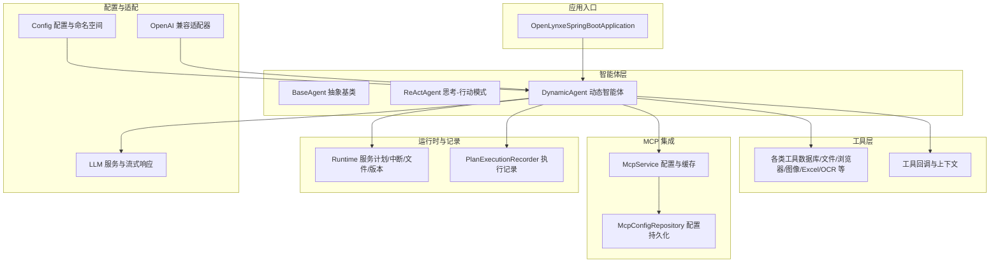
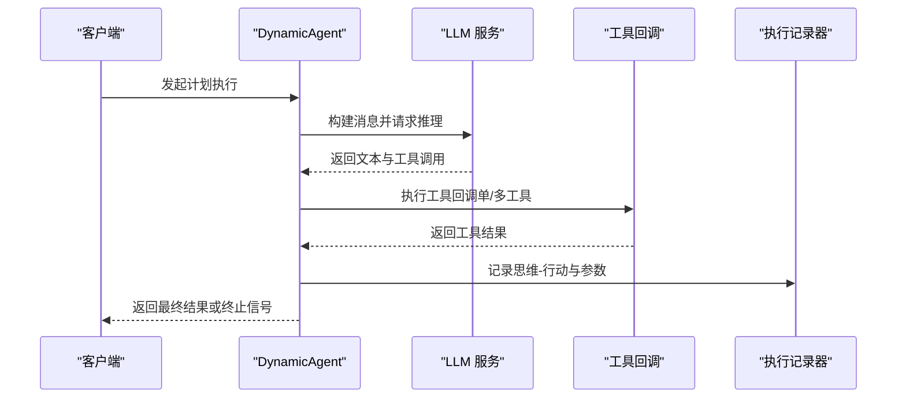
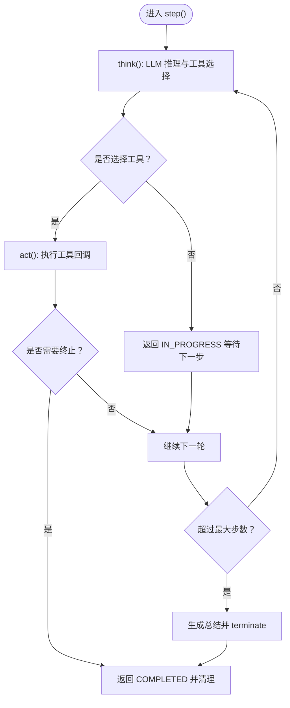
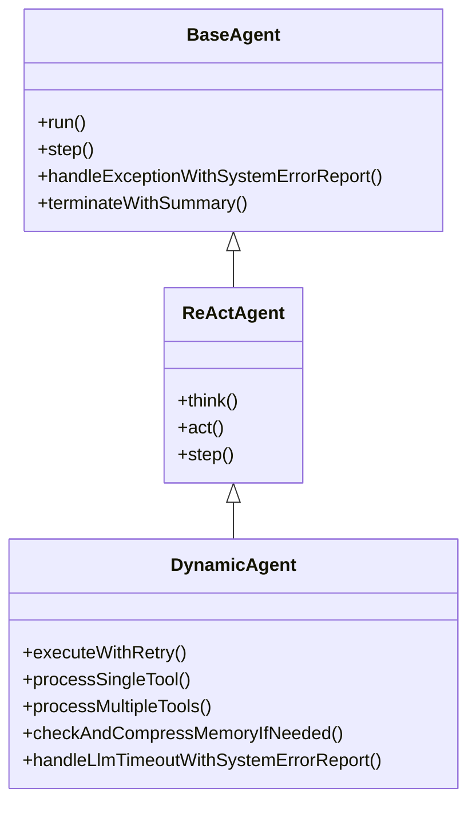
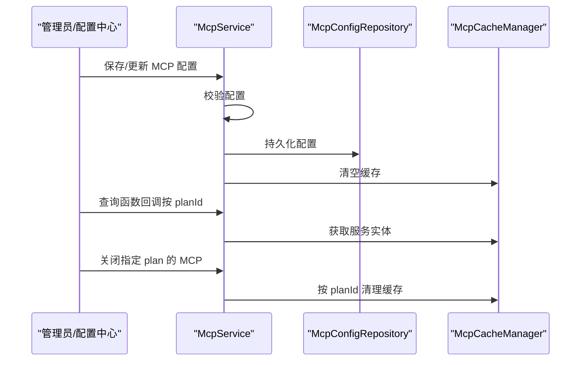
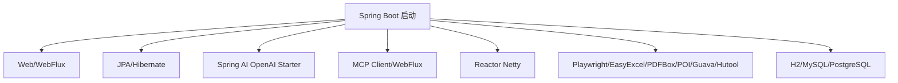

# 项目介绍

<cite>
**本文引用的文件**   
- [README.md](file://README.md)
- [README-zh.md](file://README-zh.md)
- [CONTRIBUTING.md](file://CONTRIBUTING.md)
- [CONTRIBUTING-zh.md](file://CONTRIBUTING-zh.md)
- [OpenLynxeSpringBootApplication.java](file://src/main/java/com/alibaba/cloud/ai/lynxe/OpenLynxeSpringBootApplication.java)
- [pom.xml](file://pom.xml)
- [application.yml](file://src/main/resources/application.yml)
- [BaseAgent.java](file://src/main/java/com/alibaba/cloud/ai/lynxe/agent/BaseAgent.java)
- [ReActAgent.java](file://src/main/java/com/alibaba/cloud/ai/lynxe/agent/ReActAgent.java)
- [DynamicAgent.java](file://src/main/java/com/alibaba/cloud/ai/lynxe/agent/DynamicAgent.java)
- [McpService.java](file://src/main/java/com/alibaba/cloud/ai/lynxe/mcp/service/McpService.java)
</cite>

## 目录
1. [引言](#引言)
2. [项目结构](#项目结构)
3. [核心组件](#核心组件)
4. [架构总览](#架构总览)
5. [详细组件分析](#详细组件分析)
6. [依赖关系分析](#依赖关系分析)
7. [性能考量](#性能考量)
8. [故障排查指南](#故障排查指南)
9. [结论](#结论)
10. [附录](#附录)

## 引言
Lynxe 是 Manus 的 Java 实现版本，当前已在阿里巴巴集团内部广泛应用。其核心定位是为“具有一定确定性要求的探索性任务”提供稳定可靠的多智能体协作能力，典型场景包括：从海量数据集中快速检索并导出为数据库单行记录、对日志进行分析并触发告警等。

项目名称来源：Lynxe 的原始名称为 JManus，体现了其作为 Manus 的 Java 实现的身份。

产品价值主张：
- 纯 Java 实现，便于 Java 生态集成与二次开发；
- Func-Agent 模式，提供高确定性的执行流程，适合复杂重复任务；
- 原生支持 MCP（模型上下文协议），可与外部服务和工具无缝集成；
- 提供 HTTP 服务调用能力，便于嵌入现有系统。

开源背景与社区发展：Lynxe 已在 GitHub 上开源，遵循 Apache 2.0 许可证，欢迎社区贡献。项目提供完善的贡献指南与行为准则，鼓励开发者通过 Issue、PR、文档与测试等方式参与共建。

面向不同技术背景的用户理解角度：
- 初学者：可从“什么是多智能体”“如何用 Lynxe 解决常见问题”入手，结合快速开始与示例用例理解整体流程。
- 进阶用户：可关注 Agent 执行循环、工具回调机制、MCP 集成与缓存管理等实现细节。
- 专家：可深入研究 LLM 推理与行动（ReAct）模式、流式响应处理、重试与中断控制、内存压缩与字符计数等性能与稳定性机制。

**章节来源**
- [README.md:18-42](file://README.md#L18-L42)
- [README-zh.md:18-42](file://README-zh.md#L18-L42)

## 项目结构
Lynxe 采用 Spring Boot 3.x + Spring AI 驱动的分层架构，核心模块围绕“智能体（Agent）—计划（Plan）—工具（Tool）—记录（Recorder）—配置（Config）—MCP 集成”展开。主要目录与职责概览：
- agent：抽象智能体基类与 ReAct 智能体实现，支撑思考与行动的交替执行；
- tool：内置大量工具（数据库读写、文件处理、浏览器自动化、图像生成、Excel/文档转换等），并支持动态注册与回调；
- mcp：MCP 客户端与服务端集成，负责外部服务发现、连接与函数回调；
- config：系统配置、命名空间、模型与数据库配置等；
- runtime：计划调度、任务中断、文件上传与版本管理等运行时能力；
- recorder：执行记录与回放，支持思维-行动记录、工具参数记录与异常清理；
- cron：动态定时任务加载与调度；
- llm：对话记忆限制、追踪与流式响应处理；
- adapter：OpenAI 兼容接口适配层；
- resources：静态资源、国际化文案、Prompts、UI 资源与配置文件。

**图表来源**
- [OpenLynxeSpringBootApplication.java:29-45](file://src/main/java/com/alibaba/cloud/ai/lynxe/OpenLynxeSpringBootApplication.java#L29-L45)
- [BaseAgent.java:70-117](file://src/main/java/com/alibaba/cloud/ai/lynxe/agent/BaseAgent.java#L70-L117)
- [ReActAgent.java:30-44](file://src/main/java/com/alibaba/cloud/ai/lynxe/agent/ReActAgent.java#L30-L44)
- [DynamicAgent.java:83-201](file://src/main/java/com/alibaba/cloud/ai/lynxe/agent/DynamicAgent.java#L83-L201)
- [McpService.java:44-62](file://src/main/java/com/alibaba/cloud/ai/lynxe/mcp/service/McpService.java#L44-L62)

**章节来源**
- [pom.xml:60-353](file://pom.xml#L60-L353)
- [application.yml:1-97](file://src/main/resources/application.yml#L1-L97)

## 核心组件
- 智能体基类与模式
  - BaseAgent：统一的状态管理、步数限制、异常包装与最终终止逻辑；提供“思考-行动”框架与工具回调上下文；
  - ReActAgent：在 BaseAgent 基础上定义 think()/act() 的交替执行；
  - DynamicAgent：实现 LLM 思考与工具调用的完整闭环，包含重试、流式响应、早期终止检测、并行工具执行、记忆压缩与字符计数等高级能力。
- MCP 集成
  - McpService：负责 MCP 服务器配置的保存、校验、状态变更与缓存失效；提供按计划维度的服务实体查询与关闭。
- 配置与运行时
  - application.yml：端口、数据库连接池、JPA、日志级别、计划轮询、文件上传等系统级配置；
  - OpenLynxeSpringBootApplication：Spring Boot 启动入口，支持 Playwright 初始化与常规启动。
- 工具与适配
  - 丰富的内置工具覆盖数据库、文件系统、浏览器、图像生成、Excel/文档转换、OCR、并行执行等；
  - OpenAI 兼容适配器：提供 HTTP 服务调用能力，便于二次集成。

**章节来源**
- [BaseAgent.java:70-357](file://src/main/java/com/alibaba/cloud/ai/lynxe/agent/BaseAgent.java#L70-L357)
- [ReActAgent.java:30-96](file://src/main/java/com/alibaba/cloud/ai/lynxe/agent/ReActAgent.java#L30-L96)
- [DynamicAgent.java:83-800](file://src/main/java/com/alibaba/cloud/ai/lynxe/agent/DynamicAgent.java#L83-L800)
- [McpService.java:44-351](file://src/main/java/com/alibaba/cloud/ai/lynxe/mcp/service/McpService.java#L44-L351)
- [application.yml:1-97](file://src/main/resources/application.yml#L1-L97)
- [OpenLynxeSpringBootApplication.java:34-45](file://src/main/java/com/alibaba/cloud/ai/lynxe/OpenLynxeSpringBootApplication.java#L34-L45)

## 架构总览
Lynxe 的整体架构围绕“智能体驱动的计划执行”，通过 LLM 进行推理与工具选择，再由工具回调执行具体动作。MCP 作为外部服务桥接层，提供函数级能力扩展。运行时模块负责任务调度、中断控制、文件上传与版本管理；记录模块贯穿执行全过程，保障可观测性与可回溯性。

**图表来源**
- [DynamicAgent.java:204-563](file://src/main/java/com/alibaba/cloud/ai/lynxe/agent/DynamicAgent.java#L204-L563)
- [BaseAgent.java:281-357](file://src/main/java/com/alibaba/cloud/ai/lynxe/agent/BaseAgent.java#L281-L357)

## 详细组件分析

### 智能体执行循环与确定性控制
- 步数上限与状态机：BaseAgent 统一管理执行轮次与状态（进行中/完成/中断/失败），并在达到上限时生成总结并终止；
- 异常处理：通过 SystemErrorReportTool 包装异常，模拟正常工具流程，保证执行记录一致性；
- 中断与清理：支持任务中断检查与清理（如表单输入工具），确保资源释放；
- 终止工具：TerminateTool 用于显式结束当前步骤或计划。

**图表来源**
- [BaseAgent.java:281-357](file://src/main/java/com/alibaba/cloud/ai/lynxe/agent/BaseAgent.java#L281-L357)
- [ReActAgent.java:78-96](file://src/main/java/com/alibaba/cloud/ai/lynxe/agent/ReActAgent.java#L78-L96)

**章节来源**
- [BaseAgent.java:70-357](file://src/main/java/com/alibaba/cloud/ai/lynxe/agent/BaseAgent.java#L70-L357)
- [ReActAgent.java:30-96](file://src/main/java/com/alibaba/cloud/ai/lynxe/agent/ReActAgent.java#L30-L96)

### 动态智能体：思考-行动与工具执行
- 重试与指数退避：当 LLM 返回仅“思考”无工具调用时，进行多次重试并逐步增加等待时间；
- 流式响应与字符计数：通过 StreamingResponseHandler 合并内容，统计输入/输出字符数，辅助记忆压缩；
- 早期终止检测：连续多次仅“思考”无工具调用时，判定为失败并终止；
- 并行工具执行：支持多个工具并发执行，TerminateTool 与其他工具存在“先决关系”；
- 记忆与压缩：根据历史消息与对话记忆进行压缩，避免超出上下文长度；
- 错误提取与记录：对 ErrorReportTool/SystemErrorReportTool 的错误信息进行提取并记录。

**图表来源**
- [BaseAgent.java:70-589](file://src/main/java/com/alibaba/cloud/ai/lynxe/agent/BaseAgent.java#L70-L589)
- [ReActAgent.java:30-96](file://src/main/java/com/alibaba/cloud/ai/lynxe/agent/ReActAgent.java#L30-L96)
- [DynamicAgent.java:83-800](file://src/main/java/com/alibaba/cloud/ai/lynxe/agent/DynamicAgent.java#L83-L800)

**章节来源**
- [DynamicAgent.java:204-800](file://src/main/java/com/alibaba/cloud/ai/lynxe/agent/DynamicAgent.java#L204-L800)

### MCP 集成与缓存管理
- 配置保存与校验：支持批量与单条保存，校验连接类型、URL/命令等字段；
- 状态变更与缓存失效：启用/禁用 MCP 服务器后刷新缓存，确保服务列表实时；
- 按计划维度查询：根据 planId 查询可用函数回调，便于动态绑定；
- 关闭与清理：按计划关闭后清理缓存，避免资源泄漏。

**图表来源**
- [McpService.java:70-351](file://src/main/java/com/alibaba/cloud/ai/lynxe/mcp/service/McpService.java#L70-L351)

**章节来源**
- [McpService.java:44-351](file://src/main/java/com/alibaba/cloud/ai/lynxe/mcp/service/McpService.java#L44-L351)

### 配置与运行时要点
- 系统配置：端口、数据库连接池、JPA、日志级别、计划轮询参数、文件上传策略等；
- 启动入口：支持 Playwright 初始化与常规 Spring Boot 启动；
- 依赖与生态：基于 Spring Boot 3.x 与 Spring AI Alibaba，引入 Web、WebFlux、JPA、MCP SDK、Playwright、EasyExcel、PDFBox、POI 等。

**章节来源**
- [application.yml:1-97](file://src/main/resources/application.yml#L1-L97)
- [OpenLynxeSpringBootApplication.java:34-45](file://src/main/java/com/alibaba/cloud/ai/lynxe/OpenLynxeSpringBootApplication.java#L34-L45)
- [pom.xml:60-353](file://pom.xml#L60-L353)

## 依赖关系分析
- 启动与扫描：Spring Boot 自动装配 + 组件扫描 + JPA 扫描 + 定时任务启用；
- LLM 与 MCP：OpenAI Starter、MCP Client/WebFlux、Reactor Netty；
- 工具生态：Playwright（浏览器自动化）、EasyExcel（表格处理）、PDFBox/POI（文档解析）、Guava/Hutool（通用工具）；
- 数据库：H2（默认）、MySQL、PostgreSQL；
- Web：Spring Web 与 WebFlux 并存，支持同步与响应式。

**图表来源**
- [pom.xml:60-353](file://pom.xml#L60-L353)
- [OpenLynxeSpringBootApplication.java:29-34](file://src/main/java/com/alibaba/cloud/ai/lynxe/OpenLynxeSpringBootApplication.java#L29-L34)

**章节来源**
- [pom.xml:60-353](file://pom.xml#L60-L353)

## 性能考量
- 计划轮询与超时：可配置最大尝试次数、轮询间隔、连接与读取超时、指数退避上限；
- 字符计数与记忆压缩：在构建提示前计算输入字符数，必要时压缩对话记忆，避免上下文溢出；
- 流式响应与合并：通过 StreamingResponseHandler 合并流式内容，提升用户体验并减少中间状态；
- 并行工具执行：在满足约束的前提下并发执行多个工具，缩短整体耗时；
- 连接池与资源：合理配置 Hikari 连接池参数与验证超时，降低长连接抖动风险；
- 文件上传：限制单次上传文件数量与大小，避免内存压力。

**章节来源**
- [application.yml:60-97](file://src/main/resources/application.yml#L60-L97)
- [DynamicAgent.java:356-380](file://src/main/java/com/alibaba/cloud/ai/lynxe/agent/DynamicAgent.java#L356-L380)
- [DynamicAgent.java:787-800](file://src/main/java/com/alibaba/cloud/ai/lynxe/agent/DynamicAgent.java#L787-L800)

## 故障排查指南
- LLM 重试与早期终止：若 LLM 反复仅返回“思考”而无工具调用，将触发失败并终止；检查模型配置与提示词；
- 异常包装与记录：系统异常通过 SystemErrorReportTool 包装并记录，便于定位；
- 中断与清理：任务中断时需确认中断检查器状态与清理逻辑（如表单输入工具）；
- MCP 配置：保存/更新 MCP 配置后需确保缓存失效与重新加载；
- 日志级别：适当提高 agent、llm、web.reactive.function.client 等包的日志级别以辅助诊断。

**章节来源**
- [DynamicAgent.java:235-495](file://src/main/java/com/alibaba/cloud/ai/lynxe/agent/DynamicAgent.java#L235-L495)
- [BaseAgent.java:400-449](file://src/main/java/com/alibaba/cloud/ai/lynxe/agent/BaseAgent.java#L400-L449)
- [McpService.java:138-141](file://src/main/java/com/alibaba/cloud/ai/lynxe/mcp/service/McpService.java#L138-L141)
- [application.yml:47-58](file://src/main/resources/application.yml#L47-L58)

## 结论
Lynxe 以纯 Java 实现 Manus 的核心能力，聚焦于“确定性执行”的探索性任务，具备高可扩展性与工程化落地能力。其智能体执行循环、工具回调体系、MCP 集成与运行时记录构成了稳定高效的执行闭环。对于初学者，可从“用例与快速开始”入手；对于进阶与专家用户，可在智能体模式、流式响应、重试与中断、并行工具与记忆压缩等方面深入实践与优化。

## 附录
- 项目名称来源：JManus → Lynxe，体现 Java 实现身份；
- 产品特性：纯 Java 实现、Func-Agent 模式、MCP 集成；
- 社区与贡献：遵循 Apache 2.0 许可证，提供贡献指南与行为准则，欢迎 Issue、PR、文档与测试贡献。

**章节来源**
- [README.md:22-47](file://README.md#L22-L47)
- [README-zh.md:18-41](file://README-zh.md#L18-L41)
- [CONTRIBUTING.md:1-138](file://CONTRIBUTING.md#L1-L138)
- [CONTRIBUTING-zh.md:1-140](file://CONTRIBUTING-zh.md#L1-L140)