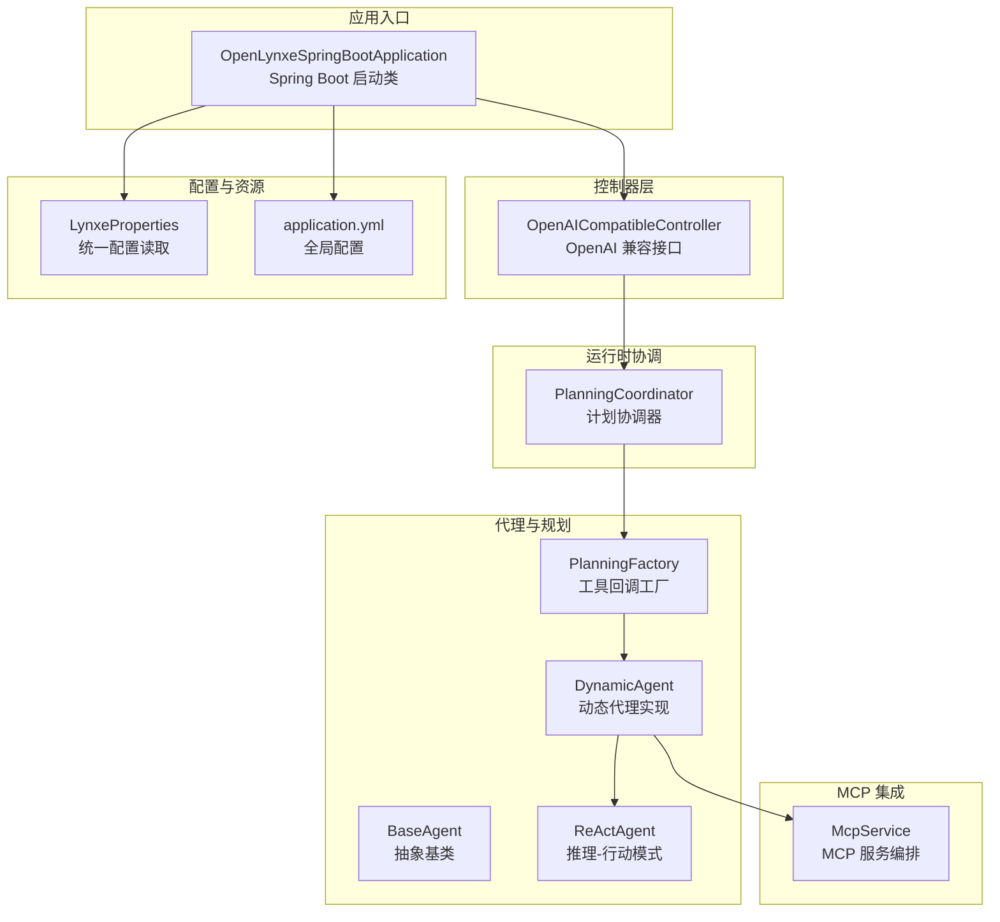
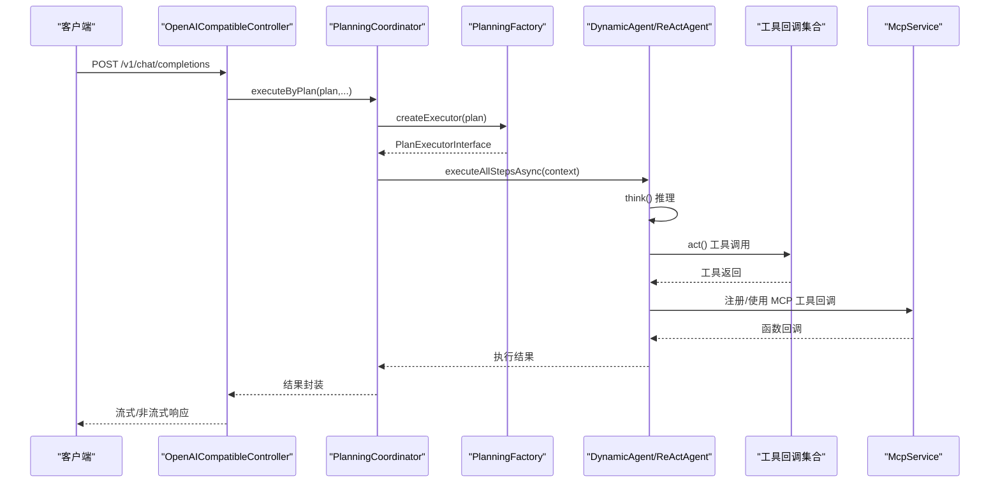
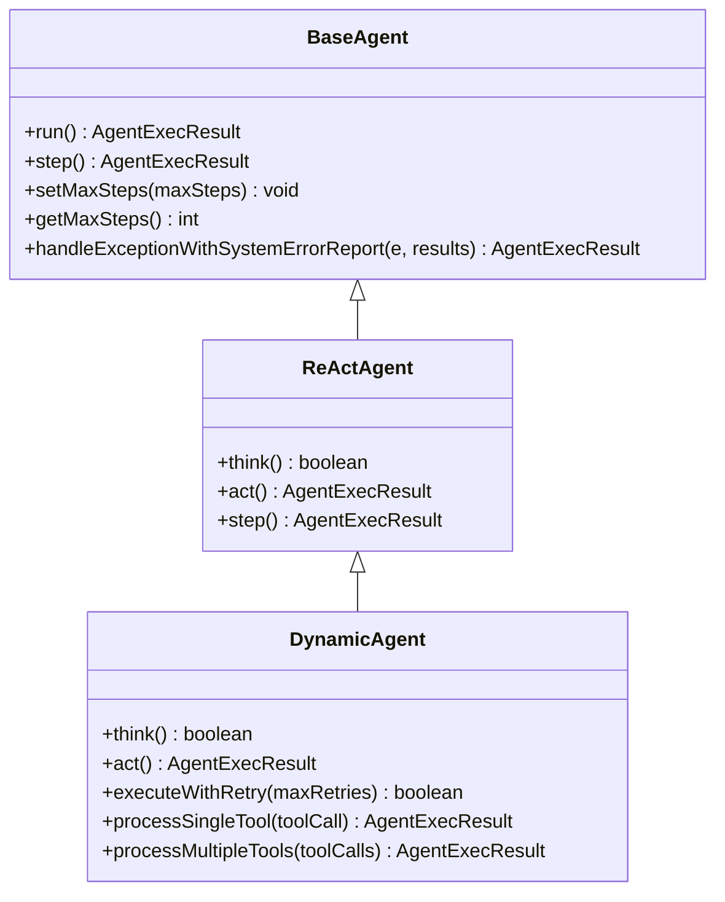
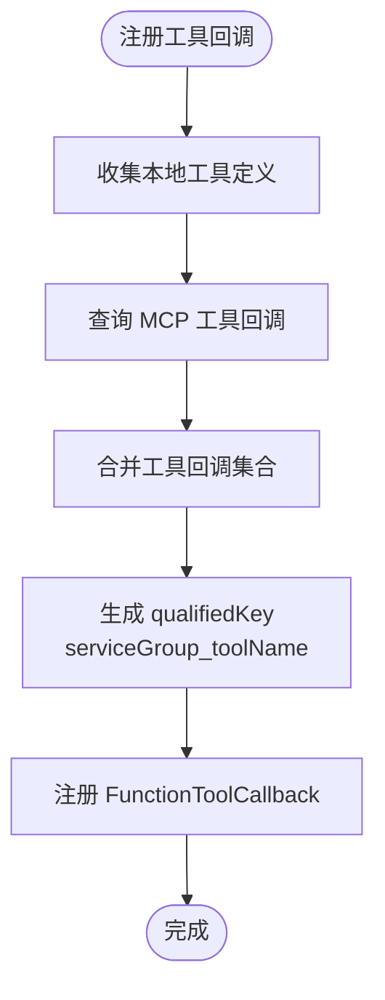
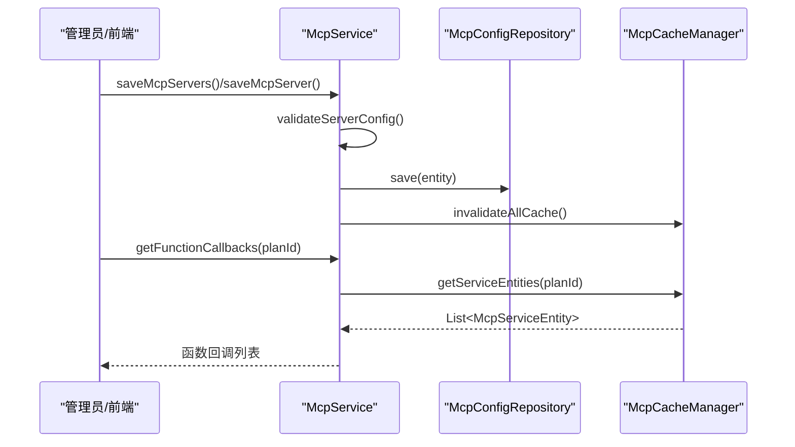
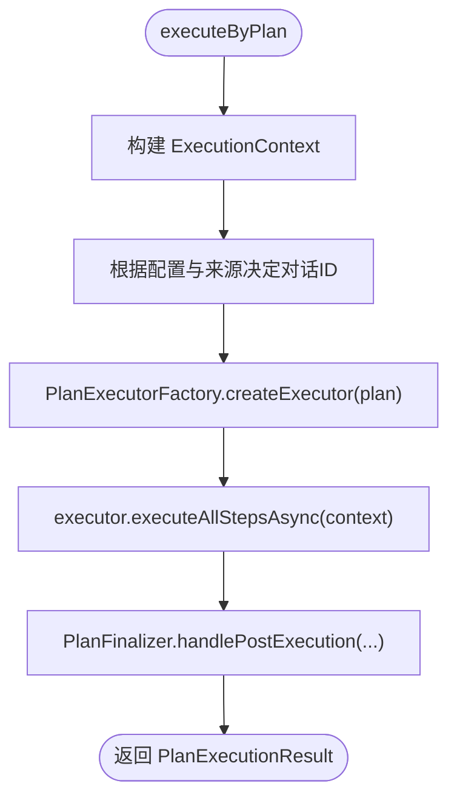
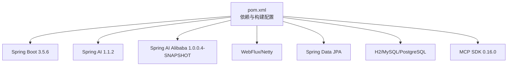

# 项目概述

<cite>
**本文引用的文件**   
- [README.md](file://README.md)
- [README-zh.md](file://README-zh.md)
- [OpenLynxeSpringBootApplication.java](file://src/main/java/com/alibaba/cloud/ai/lynxe/OpenLynxeSpringBootApplication.java)
- [pom.xml](file://pom.xml)
- [application.yml](file://src/main/resources/application.yml)
- [BaseAgent.java](file://src/main/java/com/alibaba/cloud/ai/lynxe/agent/BaseAgent.java)
- [ReActAgent.java](file://src/main/java/com/alibaba/cloud/ai/lynxe/agent/ReActAgent.java)
- [DynamicAgent.java](file://src/main/java/com/alibaba/cloud/ai/lynxe/agent/DynamicAgent.java)
- [Tool.java](file://src/main/java/com/alibaba/cloud/ai/lynxe/agent/model/Tool.java)
- [LynxeProperties.java](file://src/main/java/com/alibaba/cloud/ai/lynxe/config/LynxeProperties.java)
- [PlanningFactory.java](file://src/main/java/com/alibaba/cloud/ai/lynxe/planning/PlanningFactory.java)
- [PlanningCoordinator.java](file://src/main/java/com/alibaba/cloud/ai/lynxe/runtime/service/PlanningCoordinator.java)
- [OpenAICompatibleController.java](file://src/main/java/com/alibaba/cloud/ai/lynxe/adapter/controller/OpenAICompatibleController.java)
- [McpService.java](file://src/main/java/com/alibaba/cloud/ai/lynxe/mcp/service/McpService.java)
- [version.properties](file://src/main/resources/version.properties)
- [CONTRIBUTING.md](file://CONTRIBUTING.md)
</cite>

## 目录
1. [引言](#引言)
2. [项目结构](#项目结构)
3. [核心组件](#核心组件)
4. [架构总览](#架构总览)
5. [详细组件分析](#详细组件分析)
6. [依赖关系分析](#依赖关系分析)
7. [性能考量](#性能考量)
8. [故障排查指南](#故障排查指南)
9. [结论](#结论)
10. [附录](#附录)

## 引言
Lynxe（原名 JManus）是阿里巴巴在集团内部广泛使用的“Manus”多智能体协作系统的 Java 实现。它专注于需要一定确定性的探索性任务，例如从海量数据中检索并转换为结构化结果、日志分析与告警等。Lynxe 提供纯 Java 的多智能体协作实现，并通过 HTTP 接口对外提供服务，便于 Java 生态的二次集成。

产品核心特性包括：
- 纯 Java 的 Manus 实现，提供完整的 HTTP 调用接口
- Func-Agent 模式：精确控制每一步执行细节，提供极高执行确定性，适用于复杂重复流程
- MCP 集成：原生支持模型上下文协议（Model Context Protocol），实现与外部服务和工具的无缝集成

Lynxe 当前版本为 4.9.6，基于 Spring Boot 3.x 与 Spring AI Alibaba 构建，支持多种数据库（H2/MySQL/PostgreSQL），并提供 Docker 化部署能力。

**章节来源**
- [README.md:22-47](file://README.md#L22-L47)
- [README-zh.md:18-41](file://README-zh.md#L18-L41)
- [pom.xml:10](file://pom.xml#L10)
- [version.properties:1-6](file://src/main/resources/version.properties#L1-L6)

## 项目结构
Lynxe 采用分层与按功能域划分的组织方式：
- 核心入口：Spring Boot 启动类负责应用初始化与组件扫描
- 控制器层：适配 OpenAI 兼容接口，便于外部系统对接
- 代理与规划：Agent 抽象与 ReAct/Dynamic 等实现，配合 PlanningFactory 工厂注册工具回调
- 运行时协调：PlanningCoordinator 统一调度计划执行与收尾
- MCP 集成：McpService 负责 MCP 服务器配置、校验与缓存管理
- 配置与属性：LynxeProperties 提供统一配置读取与动态开关
- 资源与配置：application.yml 定义服务端口、数据库、JPA、MCP 轮询等全局参数

**图表来源**
- [OpenLynxeSpringBootApplication.java:29-45](file://src/main/java/com/alibaba/cloud/ai/lynxe/OpenLynxeSpringBootApplication.java#L29-L45)
- [OpenAICompatibleController.java:50-80](file://src/main/java/com/alibaba/cloud/ai/lynxe/adapter/controller/OpenAICompatibleController.java#L50-L80)
- [BaseAgent.java:70-117](file://src/main/java/com/alibaba/cloud/ai/lynxe/agent/BaseAgent.java#L70-L117)
- [ReActAgent.java:30-44](file://src/main/java/com/alibaba/cloud/ai/lynxe/agent/ReActAgent.java#L30-L44)
- [DynamicAgent.java:83-201](file://src/main/java/com/alibaba/cloud/ai/lynxe/agent/DynamicAgent.java#L83-L201)
- [PlanningFactory.java:112-229](file://src/main/java/com/alibaba/cloud/ai/lynxe/planning/PlanningFactory.java#L112-L229)
- [PlanningCoordinator.java:40-58](file://src/main/java/com/alibaba/cloud/ai/lynxe/runtime/service/PlanningCoordinator.java#L40-L58)
- [McpService.java:44-62](file://src/main/java/com/alibaba/cloud/ai/lynxe/mcp/service/McpService.java#L44-L62)
- [LynxeProperties.java:27-28](file://src/main/java/com/alibaba/cloud/ai/lynxe/config/LynxeProperties.java#L27-L28)
- [application.yml:1-97](file://src/main/resources/application.yml#L1-L97)

**章节来源**
- [OpenLynxeSpringBootApplication.java:29-45](file://src/main/java/com/alibaba/cloud/ai/lynxe/OpenLynxeSpringBootApplication.java#L29-L45)
- [application.yml:1-97](file://src/main/resources/application.yml#L1-L97)

## 核心组件
- 启动入口与组件扫描
  - OpenLynxeSpringBootApplication：启用调度、JPA 扫描与组件扫描，支持 Playwright 初始化参数
- 适配层（OpenAI 兼容）
  - OpenAICompatibleController：提供 /v1/chat/completions 与 /v1/models 等接口，兼容流式与非流式响应
- 代理体系
  - BaseAgent：抽象代理基类，定义状态机、步进执行、异常处理与终止逻辑
  - ReActAgent：推理-行动交替模式的抽象
  - DynamicAgent：动态代理实现，支持工具回调、重试机制、并发工具调用、内存压缩与中断检测
- 规划与工具回调
  - PlanningFactory：集中注册工具回调（浏览器、数据库、文件系统、OCR、图像生成、并行执行、Cron 等），并整合 MCP 工具
- 运行时协调
  - PlanningCoordinator：根据计划类型选择执行器，构建执行上下文，触发异步执行并进行后处理
- MCP 集成
  - McpService：保存/删除 MCP 服务器配置，校验与缓存管理，暴露函数回调列表
- 配置中心
  - LynxeProperties：统一读取配置项（如最大步数、并行工具调用、对话记忆、MCP 连接超时等）

**章节来源**
- [OpenLynxeSpringBootApplication.java:29-45](file://src/main/java/com/alibaba/cloud/ai/lynxe/OpenLynxeSpringBootApplication.java#L29-L45)
- [OpenAICompatibleController.java:50-80](file://src/main/java/com/alibaba/cloud/ai/lynxe/adapter/controller/OpenAICompatibleController.java#L50-L80)
- [BaseAgent.java:70-117](file://src/main/java/com/alibaba/cloud/ai/lynxe/agent/BaseAgent.java#L70-L117)
- [ReActAgent.java:30-44](file://src/main/java/com/alibaba/cloud/ai/lynxe/agent/ReActAgent.java#L30-L44)
- [DynamicAgent.java:83-201](file://src/main/java/com/alibaba/cloud/ai/lynxe/agent/DynamicAgent.java#L83-L201)
- [PlanningFactory.java:261-393](file://src/main/java/com/alibaba/cloud/ai/lynxe/planning/PlanningFactory.java#L261-L393)
- [PlanningCoordinator.java:76-182](file://src/main/java/com/alibaba/cloud/ai/lynxe/runtime/service/PlanningCoordinator.java#L76-L182)
- [McpService.java:44-62](file://src/main/java/com/alibaba/cloud/ai/lynxe/mcp/service/McpService.java#L44-L62)
- [LynxeProperties.java:27-28](file://src/main/java/com/alibaba/cloud/ai/lynxe/config/LynxeProperties.java#L27-L28)

## 架构总览
Lynxe 的整体设计围绕“计划-代理-工具”的协作闭环展开：
- 控制器层接收外部请求，封装为统一执行上下文
- 协调器根据计划类型选择合适的执行器
- 代理负责思考（推理）与行动（工具调用），并在每步记录执行轨迹
- 工具回调工厂集中注册各类工具，支持本地工具与 MCP 工具
- MCP 服务负责外部工具的配置、校验与缓存，保障工具可用性
- 配置中心提供统一的运行参数与开关，支撑不同场景下的行为差异

**图表来源**
- [OpenAICompatibleController.java:85-116](file://src/main/java/com/alibaba/cloud/ai/lynxe/adapter/controller/OpenAICompatibleController.java#L85-L116)
- [PlanningCoordinator.java:76-182](file://src/main/java/com/alibaba/cloud/ai/lynxe/runtime/service/PlanningCoordinator.java#L76-L182)
- [PlanningFactory.java:261-393](file://src/main/java/com/alibaba/cloud/ai/lynxe/planning/PlanningFactory.java#L261-L393)
- [DynamicAgent.java:520-563](file://src/main/java/com/alibaba/cloud/ai/lynxe/agent/DynamicAgent.java#L520-L563)
- [McpService.java:284-287](file://src/main/java/com/alibaba/cloud/ai/lynxe/mcp/service/McpService.java#L284-L287)

## 详细组件分析

### 代理体系：BaseAgent、ReActAgent、DynamicAgent
- BaseAgent
  - 定义代理状态机（进行中/已完成/中断/失败），限制最大步数，记录执行步骤
  - 提供 run() 主循环，逐步执行 step()，并在达到上限或异常时生成最终摘要并终止
  - 提供 handleExceptionWithSystemErrorReport() 将异常包装为工具输出，保证流程连续性
- ReActAgent
  - 在 BaseAgent 基础上抽象 think()/act()，交替进行推理与行动
- DynamicAgent
  - 增强的动态代理实现，支持：
    - 流式响应处理与合并
    - 工具调用重试与指数退避
    - 早期终止检测与阈值控制
    - 并行工具执行与终止工具优先级
    - 表单输入工具的交互式等待与清理
    - 记忆压缩与去重结果检测

**图表来源**
- [BaseAgent.java:70-357](file://src/main/java/com/alibaba/cloud/ai/lynxe/agent/BaseAgent.java#L70-L357)
- [ReActAgent.java:30-96](file://src/main/java/com/alibaba/cloud/ai/lynxe/agent/ReActAgent.java#L30-L96)
- [DynamicAgent.java:83-800](file://src/main/java/com/alibaba/cloud/ai/lynxe/agent/DynamicAgent.java#L83-L800)

**章节来源**
- [BaseAgent.java:70-357](file://src/main/java/com/alibaba/cloud/ai/lynxe/agent/BaseAgent.java#L70-L357)
- [ReActAgent.java:30-96](file://src/main/java/com/alibaba/cloud/ai/lynxe/agent/ReActAgent.java#L30-L96)
- [DynamicAgent.java:203-563](file://src/main/java/com/alibaba/cloud/ai/lynxe/agent/DynamicAgent.java#L203-L563)

### 工具与工具模型
- PlanningFactory.toolCallbackMap
  - 动态注册本地工具与 MCP 工具回调，使用“服务组_工具名”作为唯一键，便于 LLM 识别与调用
  - 支持浏览器操作、数据库读写、文件系统、OCR/Markdown 转换、图像生成、并行执行、定时任务、表单输入等
- Tool 模型
  - 描述工具的键、名称、描述、启用状态、服务组与是否可选择等元信息

**图表来源**
- [PlanningFactory.java:261-393](file://src/main/java/com/alibaba/cloud/ai/lynxe/planning/PlanningFactory.java#L261-L393)
- [Tool.java:18-82](file://src/main/java/com/alibaba/cloud/ai/lynxe/agent/model/Tool.java#L18-L82)

**章节来源**
- [PlanningFactory.java:261-393](file://src/main/java/com/alibaba/cloud/ai/lynxe/planning/PlanningFactory.java#L261-L393)
- [Tool.java:18-82](file://src/main/java/com/alibaba/cloud/ai/lynxe/agent/model/Tool.java#L18-L82)

### MCP 集成与缓存
- McpService
  - 保存/删除 MCP 服务器配置，校验连接类型与状态
  - 缓存管理：失效与刷新，确保工具回调列表实时可用
  - 暴露 getFunctionCallbacks(planId) 返回当前计划可用的 MCP 函数回调

**图表来源**
- [McpService.java:70-141](file://src/main/java/com/alibaba/cloud/ai/lynxe/mcp/service/McpService.java#L70-L141)
- [McpService.java:284-287](file://src/main/java/com/alibaba/cloud/ai/lynxe/mcp/service/McpService.java#L284-L287)

**章节来源**
- [McpService.java:44-351](file://src/main/java/com/alibaba/cloud/ai/lynxe/mcp/service/McpService.java#L44-L351)

### 运行时协调与计划执行
- PlanningCoordinator
  - 构建执行上下文（标题、计划、深度、对话 ID、上传键等）
  - 依据请求来源决定是否生成对话 ID 与是否需要摘要
  - 通过 PlanExecutorFactory 创建执行器，异步执行计划并进行后处理

**图表来源**
- [PlanningCoordinator.java:76-182](file://src/main/java/com/alibaba/cloud/ai/lynxe/runtime/service/PlanningCoordinator.java#L76-L182)

**章节来源**
- [PlanningCoordinator.java:40-182](file://src/main/java/com/alibaba/cloud/ai/lynxe/runtime/service/PlanningCoordinator.java#L40-L182)

### 配置与属性
- LynxeProperties
  - 提供统一的配置读取入口，覆盖浏览器、通用、代理、MCP 服务加载、图像识别/生成等子组
  - 支持运行时动态读取与默认值回退
- application.yml
  - 定义服务端口、数据库连接池、JPA、日志级别、计划轮询、文件上传等全局参数

**章节来源**
- [LynxeProperties.java:27-654](file://src/main/java/com/alibaba/cloud/ai/lynxe/config/LynxeProperties.java#L27-L654)
- [application.yml:1-97](file://src/main/resources/application.yml#L1-L97)

## 依赖关系分析
- 技术栈与版本
  - Spring Boot 3.5.6、Spring AI 1.1.2、Spring AI Alibaba 1.0.0.4-SNAPSHOT、Playwright 1.55.0、MCP SDK 0.16.0
- 关键依赖
  - WebFlux/Reactor Netty：支持流式响应与高性能网络
  - Spring Data JPA：数据库抽象与连接池配置
  - H2/MySQL/PostgreSQL：三种数据库支持
  - EasyExcel、PDFBox、Apache POI：文档与表格处理
  - Gson/Jackson：序列化与反序列化
- Maven 构建
  - 主类、打包布局、资源过滤（version.properties）、Spotless 自动格式化、Surefire 测试插件

**图表来源**
- [pom.xml:10-556](file://pom.xml#L10-L556)

**章节来源**
- [pom.xml:10-556](file://pom.xml#L10-L556)

## 性能考量
- 流式响应与字符计数
  - DynamicAgent 在推理阶段计算消息总字符数，有助于监控与限流
- 重试与指数退避
  - 对网络相关异常进行重试，避免瞬时故障导致失败
- 早期终止检测
  - 若多次仅返回文本而未调用工具，触发显式要求调用工具的提示，防止死循环
- 并行工具执行
  - 支持多工具并发执行，提升吞吐；终止工具具有后置优先级，确保收尾一致性
- 记忆压缩与重复结果检测
  - 动态压缩对话记忆，减少上下文开销；检测重复结果并强制压缩，避免无效循环

**章节来源**
- [DynamicAgent.java:356-401](file://src/main/java/com/alibaba/cloud/ai/lynxe/agent/DynamicAgent.java#L356-L401)
- [DynamicAgent.java:497-518](file://src/main/java/com/alibaba/cloud/ai/lynxe/agent/DynamicAgent.java#L497-L518)
- [DynamicAgent.java:520-563](file://src/main/java/com/alibaba/cloud/ai/lynxe/agent/DynamicAgent.java#L520-L563)
- [DynamicAgent.java:762-764](file://src/main/java/com/alibaba/cloud/ai/lynxe/agent/DynamicAgent.java#L762-L764)

## 故障排查指南
- 常见问题定位
  - 代理异常：通过 BaseAgent 的 handleExceptionWithSystemErrorReport 将异常包装为工具输出，便于记录与追踪
  - LLM 调用失败：DynamicAgent 记录所有重试异常与最新异常，支持从异常列表构建错误信息
  - 早期终止：若模型多次仅输出文本而不调用工具，将触发失败状态，需检查模型配置与工具回调
- 配置检查
  - 确认 LynxeProperties 中的并行工具调用、最大步数、对话记忆开关与 MCP 连接超时等参数
  - application.yml 中数据库连接池、JPA、日志级别与计划轮询参数
- MCP 问题
  - 使用 McpService 的 getFunctionCallbacks(planId) 确认当前计划可用的 MCP 工具回调是否正确加载

**章节来源**
- [BaseAgent.java:400-449](file://src/main/java/com/alibaba/cloud/ai/lynxe/agent/BaseAgent.java#L400-L449)
- [DynamicAgent.java:569-614](file://src/main/java/com/alibaba/cloud/ai/lynxe/agent/DynamicAgent.java#L569-L614)
- [DynamicAgent.java:520-563](file://src/main/java/com/alibaba/cloud/ai/lynxe/agent/DynamicAgent.java#L520-L563)
- [McpService.java:284-287](file://src/main/java/com/alibaba/cloud/ai/lynxe/mcp/service/McpService.java#L284-L287)
- [LynxeProperties.java:27-654](file://src/main/java/com/alibaba/cloud/ai/lynxe/config/LynxeProperties.java#L27-L654)
- [application.yml:1-97](file://src/main/resources/application.yml#L1-L97)

## 结论
Lynxe 以纯 Java 实现 Manus 多智能体协作系统，具备高确定性的 Func-Agent 模式与原生 MCP 集成能力，能够满足大规模数据检索、日志分析与告警等探索性任务需求。通过 OpenAI 兼容接口与 Spring Boot 生态，Lynxe 易于在企业环境中集成与扩展。其模块化设计、统一配置与运行时协调机制，使得系统在可维护性与可扩展性方面表现优异。

## 附录
- 版本信息
  - 当前版本：4.9.6（由 version.properties 与 pom.xml 共同声明）
- 发布与部署
  - 支持 JAR、Docker 与源码运行三种方式，提供稳定 release 与 Docker 镜像
- 社区与贡献
  - 提供贡献指南、CLA 签署流程与本地 CI/格式化工具链

**章节来源**
- [version.properties:1-6](file://src/main/resources/version.properties#L1-L6)
- [pom.xml:10](file://pom.xml#L10)
- [README.md:219-276](file://README.md#L219-L276)
- [README-zh.md:213-270](file://README-zh.md#L213-L270)
- [CONTRIBUTING.md:1-138](file://CONTRIBUTING.md#L1-L138)